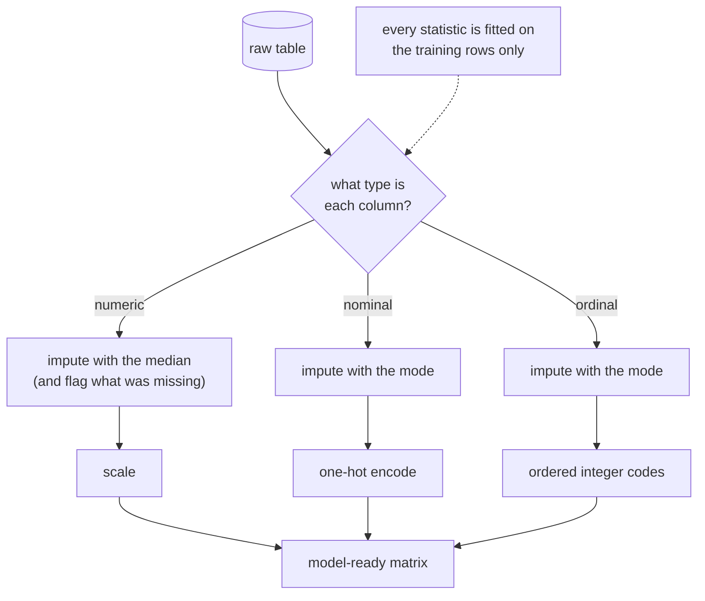

import Infographic from '@site/src/components/Infographic';
import ScalingOutlierLab from '@site/src/components/viz/ScalingOutlierLab';

**In one line.** Models see numbers and nothing else, so preprocessing is the work of turning messy columns into numbers that say what you mean, using only what the training rows can know.

## The idea in plain words

"Garbage in, garbage out" is the oldest rule in the field and the most neglected. Real tables arrive with missing cells, categories typed three different ways, columns measured in kilometres beside columns measured in fractions, and the odd value that is either an error or a genuine freak. A model cannot ask what any of this means. It adds and multiplies, so every column must be a number whose size and order mean what you intend.

Preprocessing is four jobs, done for each column in this order.

1. **Know the type.** Nominal, ordinal, interval or ratio decides which encodings and which statistics are legitimate.
2. **Fill the gaps.** Impute missing values, and often record that they were missing.
3. **Encode.** Turn categories into numbers without inventing a ranking that is not there.
4. **Scale and screen.** Put numeric columns on comparable ranges and decide what to do about extreme values.

After the four jobs comes a warning about the curse of dimensionality: the temptation to add every column you can find usually makes things worse.

One rule sits above all of them, and the next chapter ([features, leakage and imbalance](/docs/theory/ml/features-leakage-and-imbalance)) treats it in full. Every number computed here, whether a median used to fill gaps or a mean and standard deviation used to scale, must be learned from the **training rows only** and then applied unchanged to validation, test and live data. That is why the code below uses scikit-learn's `ColumnTransformer` and `Pipeline` instead of editing a data frame by hand.



<Infographic src="/img/ml/data-preprocessing-pipeline.svg" alt="A raw table with three feature columns and missing cells is split by type, imputed, encoded and scaled into a six-column numeric matrix." caption="The preprocessing pipeline for the small table in the second code block: 3 raw columns become 6 numeric columns." />

<Infographic src="/img/ml/data-preprocessing-scaling-outliers.svg" alt="The lecture's ten values on a number line with the IQR fence at 16.5 and the 3-sigma limit at 46.0, so that 45 is flagged by the IQR rule and missed by the 3-sigma rule." caption="The lecture's worked example. Every number is reproduced by the first code block." />

<Infographic src="/img/ml/data-preprocessing-curse.svg" alt="Two measurements of the curse of dimensionality: nearest and farthest neighbours become equally far as dimensions grow, and k-NN accuracy on iris falls from 0.960 to 0.400 as noise columns are added." caption="The curse of dimensionality in numbers from the last code block." />

## How it works

### Attribute types & imputation

- **Attribute types** — Nominal (colour), ordinal (S/M/L), interval (°C), ratio (price) — the type decides valid encodings and stats.
- **Imputation** — Numerical → mean/median; categorical → mode; or model-based (k-NN). Drop only as a last resort.

### Categorical & numerical encoding

- **One-hot** — One 0/1 column per category — for nominal data, invents no false order.
- **Ordinal/label** — Map ordered categories to integers (S=1, M=2, L=3). Don't use on nominal data.

:::note

**Numerical.** Binning discretises continuous columns into ranges; log transforms tame skew.

:::

### Feature scaling

Min-max: x' = (x−min)/(max−min) → [0,1]. Standardise: z = (x−μ)/σ → mean 0, variance 1.

:::tip

**Worked.** x=8 → z = (8−10.8)/11.74 = **−0.239**; min-max = (8−2)/43 = **0.140**.

:::

### IQR & 3-sigma

IQR rule: flag points outside [Q₁−1.5·IQR, Q₃+1.5·IQR]. 3-sigma rule: flag beyond μ±3σ.

:::tip

**Worked.** \{2,4,5,6,7,8,9,10,12,45\}: Q₁=5.25, Q₃=9.75, IQR=4.5 → upper fence **16.5**; **45** is an outlier. IQR is more robust than 3-sigma (46.0) because it ignores the outlier-inflated mean/σ.

:::

### The curse of dimensionality

As features grow, data gets sparse, distances concentrate, and models overfit while needing exponentially more data.

:::note

**Fixes.** Feature selection (drop irrelevant columns) and dimensionality reduction (PCA).

:::

### Key takeaways

- **1 · Clean** — Types → impute → encode.
- **2 · Scale** — Min-max or standardise; handle outliers (IQR/3σ).
- **3 · Reduce** — Beat the curse with selection/reduction.

:::note

**The thread.** Preprocessing converts messy raw data into clean, comparable, compact features. Get this right and simple models shine; get it wrong and no model can recover.

:::

## A real system that works this way

**A loan application form** is the standard picture of why type matters. Age and annual income are *ratio* values: real zeros, meaningful ratios, and income is right-skewed with a few very large entries and some blanks. Employment status (employed, self-employed, retired) is *nominal*: no order, so it gets one-hot columns. Education band (school, degree, postgraduate) is *ordinal*: the order is real, so ordered integer codes are fine. Postcode is nominal with thousands of values, which one-hot encoding handles badly and which the next chapter handles with target encoding. Treating postcode as a number, or education as unordered, would each quietly cost accuracy without raising any error.

**The small cars table in the second code block** is the same idea at a size you can read: a nominal colour, an ordinal size, a numeric age, one missing value in each column. It comes out as six numeric columns that a model can use, and the transformer that produced them can be applied unchanged to next week's data.

## Code you can run

Five blocks. The first reproduces every number in the lecture. The rest cover the things the lecture only names: encoding and imputation together, what an outlier does to each scaler, which models actually need scaling, and the curse of dimensionality measured.

**1. The lecture's worked numbers.** The data set is `{2, 4, 5, 6, 7, 8, 9, 10, 12, 45}`. Each lecture figure is printed beside the value the code computes.

```python
import numpy as np
import pandas as pd
from sklearn.preprocessing import MinMaxScaler, StandardScaler

values = np.array([2, 4, 5, 6, 7, 8, 9, 10, 12, 45], dtype=float)
mu, sigma = values.mean(), values.std()
print(f"mean {mu:.1f}   population std {sigma:.2f}   min {values.min():.0f}   max {values.max():.0f}")

z = (8 - mu) / sigma
minmax = (8 - values.min()) / (values.max() - values.min())
print(f"x = 8   standardised {z:.3f} (lecture: -0.239)   min-max {minmax:.3f} (lecture: 0.140)")

column = values.reshape(-1, 1)
z_sk = StandardScaler().fit(column).transform([[8]])[0, 0]
mm_sk = MinMaxScaler().fit(column).transform([[8]])[0, 0]
print(f"scikit-learn gives {z_sk:.3f} and {mm_sk:.3f}")
print(f"pandas .std() uses ddof=1 and would give {(8 - mu) / pd.Series(values).std():.3f}\n")

q1, q3 = np.percentile(values, [25, 75])
iqr = q3 - q1
low, high = q1 - 1.5 * iqr, q3 + 1.5 * iqr
print(f"Q1 {q1:.2f}   Q3 {q3:.2f}   IQR {iqr:.1f}   fences [{low:.1f}, {high:.1f}]   (lecture: upper 16.5)")
print("IQR rule flags:", values[(values < low) | (values > high)])

three_low, three_high = mu - 3 * sigma, mu + 3 * sigma
print(f"3-sigma limits [{three_low:.1f}, {three_high:.1f}]   (lecture: 46.0)")
print("3-sigma flags: ", values[(values < three_low) | (values > three_high)])
print("\nthe outlier inflated mu and sigma so much that 45 sits inside its own 3-sigma limit")

for outlier in (45, 1_000, 1_000_000):
    sample = np.append(values[:-1], outlier)
    print(f"outlier {outlier:>9,}: its z-score is {(outlier - sample.mean()) / sample.std():.3f}")
print(f"with n = 10 no point can pass sqrt(n - 1) = {np.sqrt(len(values) - 1):.1f} population standard deviations, so the 3-sigma rule can never fire")
```

```text
mean 10.8   population std 11.74   min 2   max 45
x = 8   standardised -0.239 (lecture: -0.239)   min-max 0.140 (lecture: 0.140)
scikit-learn gives -0.239 and 0.140
pandas .std() uses ddof=1 and would give -0.226

Q1 5.25   Q3 9.75   IQR 4.5   fences [-1.5, 16.5]   (lecture: upper 16.5)
IQR rule flags: [45.]
3-sigma limits [-24.4, 46.0]   (lecture: 46.0)
3-sigma flags:  []

the outlier inflated mu and sigma so much that 45 sits inside its own 3-sigma limit
outlier        45: its z-score is 2.914
outlier     1,000: its z-score is 3.000
outlier 1,000,000: its z-score is 3.000
with n = 10 no point can pass sqrt(n - 1) = 3.0 population standard deviations, so the 3-sigma rule can never fire
```

Every figure in the lecture reproduces: mean 10.8, standard deviation 11.74, standardised value -0.239, min-max value 0.140, quartiles 5.25 and 9.75, upper fence 16.5, and a 3-sigma limit of 46.0.

:::note Beyond the lecture: three details the numbers hide

**Which standard deviation?** The lecture's 11.74 divides by n (population standard deviation), which is also what scikit-learn's `StandardScaler` does. `pandas.Series.std()` divides by n minus 1 by default and would give 12.37, so the same value of 8 standardises to -0.226 instead of -0.239. Neither is wrong, but mixing them between training and serving code is a classic silent bug.

**The 3-sigma rule missed the outlier.** The point 45 inflates the very mean and standard deviation the rule uses, so 45 sits at 2.914 standard deviations, inside its own limit of 46.0. The IQR rule uses quartiles, which one extreme value cannot move, so it flags 45.

**With ten points the 3-sigma rule can never fire.** Using the population standard deviation, no value in a sample of n can be more than the square root of n minus 1 standard deviations from the mean. For n = 10 that is exactly 3.0, so even an outlier of a million scores 3.000 and is not beyond it. The rule only begins to work on larger samples.

:::

<ScalingOutlierLab />

The lab's defaults (x = 8, outlier 45, population sigma) show the standardised value -0.239, min-max 0.140, upper IQR fence 16.5, 3-sigma upper limit 46.0, and flag 45 under the IQR rule only. Switch sigma to "sample" to see -0.226 and a limit of 47.9. Drag the outlier up to 100 and watch the 3-sigma limit run away from it while the IQR fence does not move. Uncheck "include outlier" and the mean falls to 7.00.

**2. Imputation and encoding in one transformer.** A tiny table with one missing cell in each feature column. Colour is nominal (one-hot), size is ordinal (S, M, L coded 0, 1, 2), age is numeric (median fill, then standardise), and a separate indicator column records which ages were missing.

```python
import numpy as np
import pandas as pd
from sklearn.compose import ColumnTransformer
from sklearn.impute import MissingIndicator, SimpleImputer
from sklearn.pipeline import Pipeline
from sklearn.preprocessing import OneHotEncoder, OrdinalEncoder, StandardScaler

cars = pd.DataFrame(
    {
        "colour": ["red", "blue", "blue", np.nan, "green", "red"],
        "size": ["S", "M", "L", "M", np.nan, "S"],
        "age_years": [3.0, 7.0, np.nan, 5.0, 2.0, 9.0],
        "price": [14_200.0, 6_500.0, 4_100.0, 9_000.0, 15_800.0, 3_900.0],
    }
)
features = cars.drop(columns="price")
print("missing per column:", features.isna().sum().to_dict(), "\n")

prepare = ColumnTransformer(
    [
        ("colour", Pipeline([("fill", SimpleImputer(strategy="most_frequent")), ("onehot", OneHotEncoder(sparse_output=False))]), ["colour"]),
        ("size", Pipeline([("fill", SimpleImputer(strategy="most_frequent")), ("order", OrdinalEncoder(categories=[["S", "M", "L"]]))]), ["size"]),
        ("age", Pipeline([("fill", SimpleImputer(strategy="median")), ("scale", StandardScaler())]), ["age_years"]),
        ("age_was_missing", MissingIndicator(), ["age_years"]),
    ]
)
matrix = prepare.fit_transform(features)
table = pd.DataFrame(matrix, columns=[n.split("__")[-1] for n in prepare.get_feature_names_out()])
print(table.round(2).to_string())
print(f"\n{features.shape[1]} raw feature columns became {matrix.shape[1]} numeric columns")
```

```text
missing per column: {'colour': 1, 'size': 1, 'age_years': 1} 

   colour_blue  colour_green  colour_red  size  age_years  missingindicator_age_years
0          0.0           0.0         1.0   0.0      -0.93                         0.0
1          1.0           0.0         0.0   1.0       0.78                         0.0
2          1.0           0.0         0.0   2.0      -0.07                         1.0
3          1.0           0.0         0.0   1.0      -0.07                         0.0
4          0.0           1.0         0.0   1.0      -1.35                         0.0
5          0.0           0.0         1.0   0.0       1.64                         0.0

3 raw feature columns became 6 numeric columns
```

Three raw feature columns became six numeric columns. Row 2 had no age: the median (5.0) filled it, which standardises to -0.07, and the indicator column keeps the fact that it was filled. Row 3 had no colour: the most frequent value, blue, filled it (blue and red were tied at two each, and the tie went to the first alphabetically). The price column is the target, so it is not part of the features.

**3. What one outlier does to each scaler.** Two hundred values near 50, with one value at 500 added. The same ordinary value, 50, is scaled with and without the outlier present.

```python
import numpy as np
from sklearn.preprocessing import MinMaxScaler, RobustScaler, StandardScaler

rng = np.random.default_rng(0)
base = np.append(rng.normal(50, 5, 199), 500.0).reshape(-1, 1)
clean = base[:-1]

print(" scaler        scaled value of 50, outlier absent   scaled value of 50, outlier present")
for name, scaler in (("standard", StandardScaler()), ("min-max", MinMaxScaler()), ("robust", RobustScaler())):
    without = scaler.fit(clean).transform([[50.0]])[0, 0]
    with_it = scaler.fit(base).transform([[50.0]])[0, 0]
    print(f" {name:9s}             {without:8.3f}                           {with_it:8.3f}")

spread = StandardScaler().fit(base).transform(clean)
print(f"\nwith one outlier, the 199 ordinary points occupy only {spread.max() - spread.min():.2f} standard units")
print(f"without it they occupy {StandardScaler().fit_transform(clean).max() - StandardScaler().fit_transform(clean).min():.2f}")
```

```text
 scaler        scaled value of 50, outlier absent   scaled value of 50, outlier present
 standard                -0.013                             -0.072
 min-max                  0.545                              0.026
 robust                  -0.036                             -0.037

with one outlier, the 199 ordinary points occupy only 0.69 standard units
without it they occupy 4.57
```

Min-max scaling is the most fragile: one outlier moves the scaled value of 50 from 0.545 to 0.026 and squeezes all the ordinary points into a sliver. Standard scaling keeps 50 near zero but the 199 ordinary points are crushed from 4.57 standard units wide to 0.69. Robust scaling, which uses the median and the interquartile range, barely notices (-0.036 against -0.037).

**4. Which models need scaling.** The wine data have columns whose widths run from 0.53 to 1,402. A k-nearest-neighbours model measures distance, so the large columns drown the small ones. A random forest only asks "is this value above a threshold?", which scaling does not change.

```python
from sklearn.datasets import load_wine
from sklearn.ensemble import RandomForestClassifier
from sklearn.model_selection import cross_val_score
from sklearn.neighbors import KNeighborsClassifier
from sklearn.pipeline import make_pipeline
from sklearn.preprocessing import StandardScaler

X, y = load_wine(return_X_y=True)
widths = X.max(0) - X.min(0)
print(f"feature widths (max - min): smallest {widths.min():.2f}, largest {widths.max():.1f}\n")

for name, plain, scaled in (
    ("k-NN (k=5)", KNeighborsClassifier(5), make_pipeline(StandardScaler(), KNeighborsClassifier(5))),
    ("random forest", RandomForestClassifier(200, random_state=0), make_pipeline(StandardScaler(), RandomForestClassifier(200, random_state=0))),
):
    a = cross_val_score(plain, X, y, cv=5).mean()
    b = cross_val_score(scaled, X, y, cv=5).mean()
    print(f"{name:14s} raw features {a:.3f}   standardised {b:.3f}")
```

```text
feature widths (max - min): smallest 0.53, largest 1402.0

k-NN (k=5)     raw features 0.691   standardised 0.949
random forest  raw features 0.972   standardised 0.972
```

Standardising lifts k-NN from 0.691 to 0.949 and changes the random forest not at all (0.972 both ways). Scale for distance-based models (k-NN, k-means, SVMs), for models trained with gradient descent, and for anything with a regularisation penalty. Tree-based models do not need it.

**5. The curse of dimensionality, measured.** First, how much closer is the nearest point than the farthest as the number of dimensions grows? Second, what happens to k-NN on iris as meaningless noise columns are added?

```python
import numpy as np
from sklearn.datasets import load_iris
from sklearn.model_selection import cross_val_score
from sklearn.neighbors import KNeighborsClassifier
from sklearn.pipeline import make_pipeline
from sklearn.preprocessing import StandardScaler

rng = np.random.default_rng(0)
print("   d    (farthest - nearest) / nearest distance from one point to 500 others")
for d in (2, 10, 100, 1_000, 10_000):
    points = rng.random((500, d))
    gaps = np.linalg.norm(points[1:] - points[0], axis=1)
    print(f"{d:6d}   {(gaps.max() - gaps.min()) / gaps.min():.3f}")

X, y = load_iris(return_X_y=True)
print("\n noise columns added to iris   5-fold k-NN accuracy")
for extra in (0, 10, 50, 200, 1_000):
    noisy = np.hstack([X, rng.normal(size=(len(X), extra))])
    model = make_pipeline(StandardScaler(), KNeighborsClassifier(5))
    print(f"{extra:16d}              {cross_val_score(model, noisy, y, cv=5).mean():.3f}")
```

```text
   d    (farthest - nearest) / nearest distance from one point to 500 others
     2   66.130
    10   2.316
   100   0.363
  1000   0.108
 10000   0.032

 noise columns added to iris   5-fold k-NN accuracy
               0              0.960
              10              0.747
              50              0.720
             200              0.527
            1000              0.400
```

In 2 dimensions the gap between the farthest and the nearest point is 66 times the nearest distance, so "near" means something. In 10,000 dimensions the farthest is only 3% farther: "nearest" has stopped meaning anything. That is why k-NN on iris, which scores 0.960 with its four real columns, falls to 0.747 with ten noise columns added and to 0.400 with a thousand. The remedies are the lecture's two: select features, or reduce dimensions with PCA (see [unsupervised learning](/docs/theory/ml/unsupervised-learning)).

## Designing with it

**Match the encoding to the attribute type**

| Type | Example | Valid encoding | Valid statistics | Trap |
| --- | --- | --- | --- | --- |
| Nominal | Colour, postcode | One-hot, target encoding for many values | Mode, counts | Integer codes invent an order |
| Ordinal | S, M, L; star ratings | Ordered integer codes with the order spelled out | Median, mode | Assuming equal gaps between levels |
| Interval | Temperature in °C | Use as numbers | Mean, standard deviation | Ratios mean nothing: 20 °C is not twice 10 °C |
| Ratio | Price, age, distance | Use as numbers, log-transform if skewed | All of them | Skew and extreme values |

**Choose an imputation strategy**

| Situation | Strategy | Why |
| --- | --- | --- |
| Numeric, roughly symmetric | Mean or median | Simple, cheap |
| Numeric, skewed or with outliers | Median | The mean is dragged by extremes |
| Categorical | Most frequent, or a new category "missing" | Keeps rows, makes the gap visible |
| Missingness itself may carry signal | Add a missing-indicator column | The model can learn "no age given" |
| Strong relationships between columns | k-NN or model-based imputation | Uses the other columns, at higher cost |
| Column mostly empty, or rows plentiful | Drop, as a last resort | Imputing 90% of a column invents data |

**Choose a scaler.** Standardise by default for distance-based, gradient-based and regularised models. Use min-max when you need a fixed range and the data have no outliers. Use robust scaling when outliers are real and cannot be removed. Skip scaling for trees. For heavily skewed positive columns (incomes, counts), a log transform before scaling often matters more than the scaler.

**Treat outliers as a question, not a command.** Before deleting a flagged value, ask whether it is an error (a typo, a broken sensor), in which case fix or drop it, or a genuine rare case (a very large customer), in which case it may be exactly what the model needs to see. Prefer methods that tolerate extremes (the IQR rule, robust scaling, trees) over methods that quietly delete data.

**Fight dimensionality.** In order of cost: drop columns that are constant, duplicated or irrelevant; select features with a validation-based method; reduce with PCA; add a regularisation penalty; and collect more rows, which is the only remedy that attacks the cause.

**Put it all in a pipeline.** Wrap imputers, encoders and scalers in a `ColumnTransformer` and attach the model with a `Pipeline`. The pipeline fits every statistic on training rows only, replays the identical steps on new data, and travels as one object to production.

## Where this stands in 2026

:::info Industry view

- scikit-learn's imputation guide lists decision trees, random forests and `HistGradientBoostingClassifier` among the estimators that accept missing values directly, so for those models imputation is optional rather than mandatory.
- `OneHotEncoder` can tolerate categories it never saw in training (`handle_unknown`) and can pool rare categories (`min_frequency`, `max_categories`), which are the two features that matter most when an encoder meets live data.
- Scalers and imputers are ordinary fitted transformers in scikit-learn; the library's own guidance is to place them inside a `Pipeline` so they are fitted on training data only.
- Median imputation plus a missing-indicator column is a cheap and sturdy default. `IterativeImputer` is still marked experimental in the documentation and must be enabled explicitly.

:::

## Practice questions

<details>
<summary><strong>Q1.</strong> Name the four attribute types with an example of each.</summary>

Nominal (colour — unordered), ordinal (S/M/L — ordered), interval (°C — equal gaps, no true zero), ratio (price — true zero).<br /><em>Module 2 · conceptual</em>

</details>

<details>
<summary><strong>Q2.</strong> How would you impute missing numerical vs categorical values, and when do you drop instead?</summary>

Numerical → mean (or median when skewed/outlier-heavy); categorical → mode; or model-based (k-NN/regression). Drop rows/columns only when data is abundant or a column is mostly empty.<br /><em>Module 2 · conceptual</em>

</details>

<details>
<summary><strong>Q3.</strong> Why use one-hot encoding for nominal data instead of label encoding?</summary>

Label encoding assigns integers that invent a false order the model will exploit; one-hot gives an independent 0/1 column per category, with no implied ranking.<br /><em>Module 2 · conceptual</em>

</details>

<details>
<summary><strong>Q4.</strong> On data with μ=10.8, σ=11.74, min=2, max=45, standardise and min-max scale x=8.</summary>

z = (8−10.8)/11.74 = −0.239; min-max = (8−2)/(45−2) = 0.140.<br /><em>Module 2 · numeric</em>

</details>

<details>
<summary><strong>Q5.</strong> For \{2,4,5,6,7,8,9,10,12,45\}, use the IQR rule to find outliers.</summary>

Q₁=5.25, Q₃=9.75, IQR=4.5; upper fence = 9.75+1.5(4.5) = 16.5, lower = −1.5. 45 exceeds 16.5, so it is an outlier.<br /><em>Module 2 · numeric</em>

</details>

<details>
<summary><strong>Q6.</strong> Why is the IQR rule more robust than the 3-sigma rule?</summary>

The 3-sigma rule uses the mean and σ, which are themselves inflated by the outlier; the IQR uses quartiles, which are resistant to extreme values, so it flags outliers more reliably.<br /><em>Module 2 · conceptual</em>

</details>

<details>
<summary><strong>Q7.</strong> What is the curse of dimensionality and how do you combat it?</summary>

As features grow, data becomes sparse, distances concentrate, and models overfit while needing exponentially more data. Combat it with feature selection and dimensionality reduction (PCA).<br /><em>Module 2 · conceptual</em>

</details>

## Further reading

- [Preprocessing data (scikit-learn user guide)](https://scikit-learn.org/stable/modules/preprocessing.html). Scalers, encoders, discretisation and power transforms, with the formulas.
- [Imputation of missing values (scikit-learn user guide)](https://scikit-learn.org/stable/modules/impute.html). Simple, iterative and k-NN imputers, missing indicators, and which estimators handle NaN natively.
- [Pipelines and composite estimators (scikit-learn user guide)](https://scikit-learn.org/stable/modules/compose.html). `Pipeline` and `ColumnTransformer`, the tools the code here relies on.
- [Common pitfalls and recommended practices (scikit-learn)](https://scikit-learn.org/stable/common_pitfalls.html). Why preprocessing belongs inside a pipeline.
- [An Introduction to Statistical Learning](https://www.statlearning.com/). Chapter material on resampling and the curse of dimensionality for k-NN.
- Built from the course lecture "ml-m2-preprocessing" (Lecture Library series).

- **[An Introduction to Statistical Learning](https://www.statlearning.com/)** `book`
  James, Witten, Hastie & Tibshirani — The friendliest rigorous intro to ML — free PDF plus R/Python labs.
- **[Stanford CS229 (Machine Learning)](https://cs229.stanford.edu/)** `course`
  Andrew Ng, Stanford — The rigorous derivations behind SVMs, GLMs, EM and learning theory.
- **[StatQuest](https://statquest.org/video-index/)** `▶ video`
  Josh Starmer — Short, wonderfully clear videos that build intuition step by step.

## Check yourself

- [ ] I can choose an encoding from the attribute type, and explain why integer codes on a nominal column mislead a model
- [ ] I can pick an imputation strategy and say when a missing-indicator column earns its place
- [ ] I can standardise and min-max scale a value by hand, and say which standard deviation I used
- [ ] I can apply the IQR rule and the 3-sigma rule, and explain why the second can miss an outlier that the first catches
- [ ] I can say which model families need scaling and which do not
- [ ] I can explain the curse of dimensionality and name two ways of reducing it
- [ ] I can build a ColumnTransformer inside a Pipeline so that every statistic is learned from training rows only
