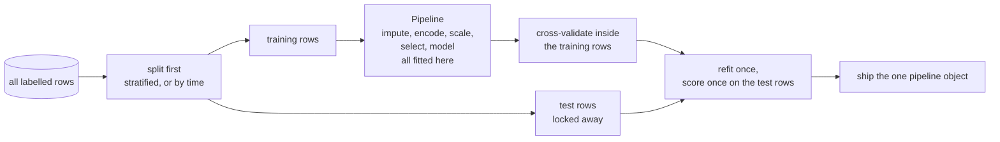

import Infographic from '@site/src/components/Infographic';
import LeakageLab from '@site/src/components/viz/LeakageLab';
import ImbalanceThresholdLab from '@site/src/components/viz/ImbalanceThresholdLab';

**In one line.** Most of the damage in real projects is done before the model is chosen: a feature that quietly contains the answer, a statistic learned from rows it should never have seen, or a metric that rewards ignoring the rare class.

:::note Not from the lecture

This chapter is an **addition**. It follows [data preprocessing](/docs/theory/ml/data-preprocessing) and prepares the ground for [model evaluation](/docs/theory/ml/model-evaluation). It was written for these notes from the scikit-learn user guide and the papers listed under Further reading. Every number on the page is printed by the code on the page.

:::

## The idea in plain words

Three problems account for a large share of machine learning projects that look brilliant in a notebook and fail in production. They are linked by one idea: **the score you measured must come from a procedure that could really have been run at prediction time.**

- **Features.** A model only sees the columns you give it, in the form you give them. A good encoding of a categorical column, or a product of two columns that the model cannot form for itself, can be worth more than a change of algorithm. A careless encoding can leak the answer.
- **Leakage.** Leakage is any route by which information that would not be available when the model is used reaches the model while it is being built or scored. It never raises an error. It raises the score, which is why it survives code review: the number looks like good news. Three kinds matter. *Target leakage*: a feature that is a consequence of the outcome. *Train-test contamination*: a statistic, selection or encoding learned from rows that later serve as test rows. *Temporal leakage*: a split that lets the model train on the future of the cases it is tested on.
- **Imbalance.** When one class is rare, accuracy rewards ignoring it. A model that always answers "no" is 97.5% accurate on a data set with 2.5% positives and has found nothing. The cures are a better metric, a stratified split, and then a choice among class weights, resampling and moving the decision threshold.

One tool makes all three manageable: put every fitted step inside a `Pipeline` with a `ColumnTransformer`, and cross-validate the pipeline, never a pre-processed copy of the data. The last code block shows it end to end.



<Infographic src="/img/ml/features-leakage-and-imbalance-leakage.svg" alt="Three kinds of leakage side by side with the score each inflates: a feature created after the outcome, selection or encoding fitted on all rows, and a shuffled split of time-ordered data." caption="Three kinds of leakage and the honest score each one hides. Numbers are from the leakage code blocks below." />

<Infographic src="/img/ml/features-leakage-and-imbalance-imbalance.svg" alt="A table comparing five ways of handling a 2.5 percent positive class by accuracy, recall, precision, F1 and average precision, beside the precision a fixed threshold gives as the positive class gets rarer." caption="Five treatments of an imbalanced problem, and why precision falls as the positive class thins out while ROC-AUC does not move." />

<Infographic src="/img/ml/features-leakage-and-imbalance-pipeline.svg" alt="A DataFrame passes through a ColumnTransformer with numeric, one-hot and target-encoding branches into a class-weighted gradient boosting model, cross-validated on average precision." caption="The whole honest workflow as one object, with the cross-validated score the last code block prints." />

## A real system that works this way

These are patterns, not named case studies. None needs a company to be true.

**A churn model with a post-event column.** A subscription table records whether a cancellation survey was sent. The survey goes out when someone cancels, so the column is nearly a copy of the label. The model tests superbly and is useless in production, where the survey does not yet exist when you need the prediction. The first leakage block builds this.

**A rare-event detector.** Fraud, equipment faults and serious clinical events have positive rates of a few per cent or less. Accuracy is meaningless; the team picks the precision and recall that match the cost of a missed event against the cost of an investigation, then sets the threshold to deliver them.

**A forecast scored on a shuffled split.** Rows from one dated stream are split at random, so every test row has neighbours in time inside the training set. In production the model only ever extrapolates. The temporal block measures the gap.

Kaufman and colleagues define leakage as information about the target that should not legitimately be available to the learning process, and their paper is the standard reference (see Further reading).

## Code you can run

Ten blocks in four groups. Each takes a few seconds on a laptop CPU and is fully seeded.

### 1. Features: interactions and target encoding

**Interactions.** Some signal does not live in any single column. Here a discount helps new customers and annoys loyal ones, so the response depends on the *product* of the two columns. A linear model cannot form that product, and a tree ensemble can only approximate it.

```python
import numpy as np
from sklearn.ensemble import HistGradientBoostingClassifier
from sklearn.linear_model import LogisticRegression
from sklearn.metrics import roc_auc_score
from sklearn.model_selection import train_test_split
from sklearn.pipeline import make_pipeline
from sklearn.preprocessing import FunctionTransformer, PolynomialFeatures, StandardScaler

rng = np.random.default_rng(1)
n = 4_000
discount = rng.uniform(-1, 1, n)
tenure = rng.uniform(-1, 1, n)
noise_column = rng.normal(size=n)
effect = discount * tenure + rng.normal(0, 0.15, n)
responded = (effect > 0).astype(int)

X = np.column_stack([discount, tenure, noise_column])
Xtr, Xte, ytr, yte = train_test_split(X, responded, test_size=0.3, random_state=0, stratify=responded)


def auc(model):
    model.fit(Xtr, ytr)
    return roc_auc_score(yte, model.predict_proba(Xte)[:, 1])


add_product = FunctionTransformer(lambda a: np.column_stack([a, a[:, 0] * a[:, 1]]))
print("a discount helps new customers and annoys loyal ones: the signal lives in the product\n")
print(f"logistic regression, raw columns        AUC {auc(make_pipeline(StandardScaler(), LogisticRegression())):.3f}")
print(f"logistic regression, + discount*tenure  AUC {auc(make_pipeline(add_product, StandardScaler(), LogisticRegression())):.3f}")
print(f"logistic regression, all degree-2 terms AUC {auc(make_pipeline(PolynomialFeatures(2, include_bias=False), StandardScaler(), LogisticRegression(max_iter=1000))):.3f}")
print(f"gradient boosting, raw columns          AUC {auc(HistGradientBoostingClassifier(random_state=0)):.3f}")
```

```text
a discount helps new customers and annoys loyal ones: the signal lives in the product

logistic regression, raw columns        AUC 0.510
logistic regression, + discount*tenure  AUC 0.924
logistic regression, all degree-2 terms AUC 0.924
gradient boosting, raw columns          AUC 0.909
```

A logistic regression on the raw columns is at chance (AUC 0.510). One extra column, `discount * tenure`, lifts it to 0.924, and the automatic route (every degree-2 term) finds the same product. Gradient-boosted trees reach 0.909 on the raw columns by approximating the product with splits, and still fall short of the one-line feature.

**Target encoding, and the leak inside it.** A categorical column with hundreds of values (a postcode, a product code) is awkward for one-hot encoding. Target encoding replaces each category with the average of the target in that category. Done naively on the training rows, it leaks: each row's own label is part of its own feature.

```python
import numpy as np
import pandas as pd
from sklearn.linear_model import LogisticRegression
from sklearn.metrics import roc_auc_score
from sklearn.model_selection import KFold
from sklearn.preprocessing import TargetEncoder

rng = np.random.default_rng(0)
n_rows, n_codes = 3_000, 600
codes = rng.integers(0, n_codes, n_rows).astype(str)
y = rng.integers(0, 2, n_rows)
cut = 2_000
code_train, code_test = codes[:cut].reshape(-1, 1), codes[cut:].reshape(-1, 1)
y_train, y_test = y[:cut], y[cut:]

means = pd.Series(y_train).groupby(code_train[:, 0]).mean()
naive_train = pd.Series(code_train[:, 0]).map(means).to_numpy().reshape(-1, 1)
naive_test = pd.Series(code_test[:, 0]).map(means).fillna(y_train.mean()).to_numpy().reshape(-1, 1)

encoder = TargetEncoder(smooth="auto", cv=KFold(5, shuffle=True, random_state=0))
honest_train = encoder.fit_transform(code_train, y_train)
honest_test = encoder.transform(code_test)

print("the target is a fair coin, so no encoding can honestly beat AUC 0.50\n")
print(" encoding                   AUC on training rows   AUC on held-out rows")
for name, tr, te in (("naive group mean", naive_train, naive_test), ("TargetEncoder (cross-fit)", honest_train, honest_test)):
    model = LogisticRegression().fit(tr, y_train)
    print(f" {name:26s}      {roc_auc_score(y_train, model.predict_proba(tr)[:, 1]):.3f}                  {roc_auc_score(y_test, model.predict_proba(te)[:, 1]):.3f}")
```

```text
the target is a fair coin, so no encoding can honestly beat AUC 0.50

 encoding                   AUC on training rows   AUC on held-out rows
 naive group mean                0.806                  0.510
 TargetEncoder (cross-fit)       0.515                  0.510
```

The target is a coin flip, so honest skill is an AUC of 0.50. The naive encoding scores 0.806 on the rows it was built from, because 600 categories of about 5 rows each memorise their labels, and falls to 0.510 on new rows. Scikit-learn's `TargetEncoder` uses *cross fitting*: inside `fit_transform` each row is encoded with statistics from the other folds only, so its training-row AUC is an honest 0.515. The documentation stresses that `fit(X, y).transform(X)` is not `fit_transform(X, y)` for this reason: use `fit_transform` on training rows and `transform` only on rows the encoder has not seen.

### 2. Leakage, kind by kind

**Kind 1: target leakage.** A churn table with an honest set of features and one that is only recorded after the customer has gone.

```python
import numpy as np
import pandas as pd
from sklearn.ensemble import HistGradientBoostingClassifier
from sklearn.model_selection import cross_val_score

rng = np.random.default_rng(3)
n = 5_000
tenure = rng.exponential(24, n)
tickets = rng.poisson(2, n)
monthly = rng.normal(60, 15, n)
churn_logit = -1.2 + 0.6 * (tickets - 2) - 0.03 * (tenure - 24) + 0.01 * (monthly - 60)
churned = (rng.random(n) < 1 / (1 + np.exp(-churn_logit))).astype(int)
cancellation_survey_sent = churned * (rng.random(n) < 0.9) + (1 - churned) * (rng.random(n) < 0.02)

frame = pd.DataFrame({"tenure": tenure, "tickets": tickets, "monthly": monthly,
                      "cancellation_survey_sent": cancellation_survey_sent})
model = HistGradientBoostingClassifier(random_state=0)
honest = cross_val_score(model, frame.drop(columns="cancellation_survey_sent"), churned, cv=5, scoring="roc_auc").mean()
leaky = cross_val_score(model, frame, churned, cv=5, scoring="roc_auc").mean()
print(f"churn rate {churned.mean():.3f}")
print(f"without the leaky column  CV AUC {honest:.3f}")
print(f"with 'cancellation_survey_sent' CV AUC {leaky:.3f}   <- the survey is sent after the customer leaves")
```

```text
churn rate 0.271
without the leaky column  CV AUC 0.719
with 'cancellation_survey_sent' CV AUC 0.960   <- the survey is sent after the customer leaves
```

Cross-validated AUC jumps from 0.719 to 0.960 when `cancellation_survey_sent` is added. A jump like that calls for a question, not a celebration: *would this value exist at the moment of prediction?*

**Kind 2: train-test contamination.** Choosing the best features, or fitting any statistic, on all the rows before splitting lets test rows vote in the choice. The demonstration uses a problem with no signal at all: 1,000 features of pure noise and labels that are coin flips. The rule keeps the 20 features most correlated with the label and votes by their signs. It is written in plain numpy so the lab below can run the identical computation in your browser.

```python
import math
import numpy as np


class Mulberry32:
    def __init__(self, seed):
        self.state = seed & 0xFFFFFFFF

    def random(self):
        self.state = (self.state + 0x6D2B79F5) & 0xFFFFFFFF
        t = self.state
        t = ((t ^ (t >> 15)) * (1 | t)) & 0xFFFFFFFF
        t = ((t + (((t ^ (t >> 7)) * (61 | t)) & 0xFFFFFFFF)) & 0xFFFFFFFF) ^ t
        return ((t ^ (t >> 14)) & 0xFFFFFFFF) / 4294967296

    def normal(self):
        u = max(self.random(), 1e-12)
        return math.sqrt(-2 * math.log(u)) * math.cos(2 * math.pi * self.random())


def noise_problem(n, p, seed):
    rng = Mulberry32(seed)
    X = np.array([[rng.normal() for _ in range(p)] for _ in range(n)])
    y = np.array([1 if rng.random() < 0.5 else -1 for _ in range(n)])
    return X, y


def pick_features(X, y, k):
    corr = (X * y[:, None]).mean(axis=0)
    keep = np.argsort(-np.abs(corr), kind="stable")[:k]
    return keep, np.sign(corr[keep])


def accuracy(X, y, keep, signs):
    return float(np.mean(np.where(X[:, keep] @ signs > 0, 1, -1) == y))


n, p, k = 100, 1_000, 20
X, y = noise_problem(n, p, seed=5)
half = n // 2
X_train, y_train, X_test, y_test = X[:half], y[:half], X[half:], y[half:]

keep_all, signs_all = pick_features(X, y, k)
keep_train, signs_train = pick_features(X_train, y_train, k)

print(f"{n} rows, {p} features of pure noise, labels are coin flips, keep the best {k}\n")
print(f"leaky : features chosen on all rows, scored on the test half   {accuracy(X_test, y_test, keep_all, signs_all):.3f}")
print(f"honest: features chosen on the training half only, same test   {accuracy(X_test, y_test, keep_train, signs_train):.3f}")
print(f"(for reference, the honest rule on the rows it was chosen from {accuracy(X_train, y_train, keep_train, signs_train):.3f})")
```

```text
100 rows, 1000 features of pure noise, labels are coin flips, keep the best 20

leaky : features chosen on all rows, scored on the test half   0.840
honest: features chosen on the training half only, same test   0.460
(for reference, the honest rule on the rows it was chosen from 0.980)
```

Choosing the features on all 100 rows gives 0.840 on the test half. Choosing them on the training half only gives 0.460, which is chance, and the rule scores 0.980 on the half it was chosen from, which is just as meaningless. Among 1,000 noise columns, the 20 that happen to line up with these labels are easy to find and do not generalise at all.

<LeakageLab />

The lab's defaults (100 rows, 1,000 candidate features, 20 kept, data set 1) show the three bars above: leaky 0.840, honest 0.460, honest on its own training half 0.980. More candidate features give noise more chances to line up, so the leak grows; more rows shrink it. Slide "features kept" from 1 to 100: the leaky curve climbs to 1.000 while the honest one stays at chance.

The same experiment with scikit-learn's own tools, and the fix:

```python
import numpy as np
from sklearn.feature_selection import SelectKBest, f_classif
from sklearn.linear_model import LogisticRegression
from sklearn.model_selection import StratifiedKFold, cross_val_score
from sklearn.pipeline import make_pipeline
from sklearn.preprocessing import StandardScaler

rng = np.random.default_rng(0)
X = rng.normal(size=(100, 1_000))
y = rng.integers(0, 2, 100)
cv = StratifiedKFold(5, shuffle=True, random_state=0)

X_selected_early = SelectKBest(f_classif, k=20).fit_transform(X, y)
leaky = cross_val_score(LogisticRegression(), X_selected_early, y, cv=cv).mean()

pipeline = make_pipeline(StandardScaler(), SelectKBest(f_classif, k=20), LogisticRegression())
honest = cross_val_score(pipeline, X, y, cv=cv).mean()

print(f"selection before the split : CV accuracy {leaky:.3f}")
print(f"selection inside Pipeline  : CV accuracy {honest:.3f}   (chance is 0.50)")
```

```text
selection before the split : CV accuracy 0.850
selection inside Pipeline  : CV accuracy 0.580   (chance is 0.50)
```

Selecting before cross-validation reports 0.850. With `SelectKBest` inside the `Pipeline`, refitted on the training part of every fold, it reports 0.580, close to the 0.50 noise deserves (with 100 rows, a few points either side is ordinary variation). Scikit-learn's documentation uses the same example for the same warning.

**Kind 3: temporal leakage.** In this stream the relationship between features and label rotates slowly with time. A shuffled split lets the model train on days on both sides of every test day. A forward-chaining split only ever tests on days after the training days, which is the situation in production.

```python
import numpy as np
from sklearn.ensemble import HistGradientBoostingClassifier
from sklearn.model_selection import KFold, TimeSeriesSplit, cross_val_score

rng = np.random.default_rng(0)
days = 3_000
t = np.arange(days)
theta = np.pi * 1.6 * t / days
X = np.column_stack([rng.normal(size=days), rng.normal(size=days), t])
signal = X[:, 0] * np.cos(theta) + X[:, 1] * np.sin(theta)
y = ((signal + rng.normal(0, 0.3, days)) > 0).astype(int)

model = HistGradientBoostingClassifier(random_state=0)
shuffled = cross_val_score(model, X, y, cv=KFold(5, shuffle=True, random_state=0)).mean()
forward = cross_val_score(model, X, y, cv=TimeSeriesSplit(5)).mean()
print(f"shuffled 5-fold  accuracy {shuffled:.3f}   (test days sit between training days)")
print(f"forward-chaining accuracy {forward:.3f}   (test days are always after training days)")
```

```text
shuffled 5-fold  accuracy 0.893   (test days sit between training days)
forward-chaining accuracy 0.799   (test days are always after training days)
```

Shuffled folds report 0.893, forward chaining 0.799. Do not over-read the size of the gap: the earliest forward folds also train on fewer rows. The direction is the lesson. If rows are ordered in time and the model will be used on the future, split by time.

### 3. Imbalance

**Stratification.** With 6 positives in 200 rows, an unshuffled five-fold split can leave most folds with none.

```python
import numpy as np
from sklearn.model_selection import KFold, StratifiedKFold

y = np.zeros(200, dtype=int)
y[:6] = 1
X = np.zeros((200, 1))

for name, splitter in (("KFold, no shuffle", KFold(5)), ("StratifiedKFold", StratifiedKFold(5))):
    positives = [int(y[test].sum()) for _, test in splitter.split(X, y)]
    print(f"{name:18s} positives per test fold: {positives}")
```

```text
KFold, no shuffle  positives per test fold: [6, 0, 0, 0, 0]
StratifiedKFold    positives per test fold: [2, 1, 1, 1, 1]
```

`StratifiedKFold` (and `train_test_split(..., stratify=y)`) keeps the class ratio in every fold, so no fold is blind to the rare class.

**The toolbox, compared.** A 2.5% positive class, a stratified split, and five approaches scored on the same test set.

```python
import numpy as np
from sklearn.datasets import make_classification
from sklearn.dummy import DummyClassifier
from sklearn.linear_model import LogisticRegression
from sklearn.metrics import average_precision_score, f1_score, precision_score, recall_score, roc_auc_score
from sklearn.model_selection import StratifiedKFold, TunedThresholdClassifierCV, train_test_split
from sklearn.pipeline import make_pipeline
from sklearn.preprocessing import StandardScaler
from sklearn.utils import resample

X, y = make_classification(n_samples=20_000, n_features=12, n_informative=5, weights=[0.98, 0.02], class_sep=1.0, flip_y=0.01, random_state=0)
Xtr, Xte, ytr, yte = train_test_split(X, y, test_size=0.3, stratify=y, random_state=0)
print(f"positives: train {ytr.mean():.4f}   test {yte.mean():.4f}   (stratified, so the two agree)\n")


def report(name, scores, predictions):
    print(f"{name:34s} acc {np.mean(predictions == yte):.3f}  recall {recall_score(yte, predictions):.3f}  "
          f"precision {precision_score(yte, predictions, zero_division=0):.3f}  F1 {f1_score(yte, predictions):.3f}  "
          f"AP {average_precision_score(yte, scores):.3f}  ROC-AUC {roc_auc_score(yte, scores):.3f}")


dummy = DummyClassifier(strategy="most_frequent").fit(Xtr, ytr)
report("always predict the majority", dummy.predict_proba(Xte)[:, 1], dummy.predict(Xte))

plain = make_pipeline(StandardScaler(), LogisticRegression()).fit(Xtr, ytr)
report("logistic, threshold 0.5", plain.predict_proba(Xte)[:, 1], plain.predict(Xte))

weighted = make_pipeline(StandardScaler(), LogisticRegression(class_weight="balanced")).fit(Xtr, ytr)
report("class_weight='balanced'", weighted.predict_proba(Xte)[:, 1], weighted.predict(Xte))

positives, negatives = Xtr[ytr == 1], Xtr[ytr == 0]
more = resample(positives, replace=True, n_samples=len(negatives), random_state=0)
X_over = np.vstack([negatives, more])
y_over = np.r_[np.zeros(len(negatives)), np.ones(len(more))]
oversampled = make_pipeline(StandardScaler(), LogisticRegression()).fit(X_over, y_over)
report("random oversampling of the minority", oversampled.predict_proba(Xte)[:, 1], oversampled.predict(Xte))

tuned = TunedThresholdClassifierCV(make_pipeline(StandardScaler(), LogisticRegression()), scoring="f1", cv=StratifiedKFold(5, shuffle=True, random_state=0)).fit(Xtr, ytr)
report(f"tuned threshold ({tuned.best_threshold_:.3f}) for F1", tuned.predict_proba(Xte)[:, 1], tuned.predict(Xte))

print()
print(f"actual positive rate in the test set      {yte.mean():.4f}")
for name, model in (("plain logistic", plain), ("class_weight='balanced'", weighted), ("random oversampling", oversampled)):
    print(f"mean predicted probability, {name:24s} {model.predict_proba(Xte)[:, 1].mean():.4f}")
```

```text
positives: train 0.0255   test 0.0255   (stratified, so the two agree)

always predict the majority        acc 0.975  recall 0.000  precision 0.000  F1 0.000  AP 0.025  ROC-AUC 0.500
logistic, threshold 0.5            acc 0.984  recall 0.379  precision 0.935  F1 0.540  AP 0.614  ROC-AUC 0.849
class_weight='balanced'            acc 0.868  recall 0.758  precision 0.133  F1 0.226  AP 0.603  ROC-AUC 0.864
random oversampling of the minority acc 0.871  recall 0.758  precision 0.136  F1 0.230  AP 0.602  ROC-AUC 0.863
tuned threshold (0.282) for F1     acc 0.986  recall 0.503  precision 0.875  F1 0.639  AP 0.614  ROC-AUC 0.849

actual positive rate in the test set      0.0255
mean predicted probability, plain logistic           0.0243
mean predicted probability, class_weight='balanced'  0.2857
mean predicted probability, random oversampling      0.2817
```

Always answering "no" reaches 0.975 accuracy and finds nothing. The plain logistic regression has high precision (0.935) but finds only 38% of the positives at its default threshold of 0.5. `class_weight='balanced'` and random oversampling do the same thing to the model: recall jumps to 0.758, precision collapses to about 0.13, F1 falls to 0.226. Their *ranking* quality is almost unchanged (average precision 0.603 and 0.602 against 0.614), because they mostly slide the operating point along the same curve. They also inflate predicted probabilities: the average is 0.2857 against a true rate of 0.0255, about eleven times too high, so recalibrate if you need probabilities. Moving the threshold on the plain model, chosen by `TunedThresholdClassifierCV` with cross-validation on the training rows, gives the best F1 (0.639) at threshold 0.282 and leaves the probabilities alone.

:::warning Resample inside the training fold only

The oversampling above is applied to the training rows alone, after the split. Oversampling or SMOTE-style synthesis *before* splitting puts copies, or near-copies, of the same positive into both training and test, which is train-test contamination again, and it inflates every metric. If you use a resampling library, put the sampler inside an imbalance-aware pipeline so it runs on training folds only.

:::

**ROC and precision-recall, and the cost of a threshold.** The analytic version needs no sampling: negatives score as a bell curve centred at 0, positives as one centred 2.0 higher. Everything below is an exact calculation.

```python
import numpy as np
from scipy.stats import norm

separation = 2.0


def rates(threshold):
    return norm.sf(threshold - separation), norm.sf(threshold)


def precision(prevalence, threshold):
    tpr, fpr = rates(threshold)
    return prevalence * tpr / (prevalence * tpr + (1 - prevalence) * fpr)


def average_precision(prevalence):
    grid = np.linspace(-8, separation + 8, 20_001)
    tpr, _ = rates(grid)
    prec = precision(prevalence, grid)
    return float(np.sum(-np.diff(tpr) * prec[1:]))


print(f"two bell curves of equal width, centres {separation} apart: ROC-AUC {norm.cdf(separation / np.sqrt(2)):.3f} whatever the prevalence\n")
tpr, fpr = rates(1.0)
print(f"threshold 1.0: recall {tpr:.4f}, false-positive rate {fpr:.4f}\n")
print(f"{'prevalence':>10s} {'precision':>10s} {'accuracy':>9s} {'always-negative':>16s} {'avg precision':>14s}")
for prevalence in (0.5, 0.2, 0.05, 0.02, 0.005):
    accuracy = prevalence * tpr + (1 - prevalence) * (1 - fpr)
    print(f"{prevalence:10.3f} {precision(prevalence, 1.0):10.4f} {accuracy:9.4f} {1 - prevalence:16.4f} {average_precision(prevalence):14.4f}")

cases, prevalence = 10_000, 0.02
positives, negatives = cases * prevalence, cases * (1 - prevalence)
print(f"\nper {cases:,} cases at prevalence 2%, threshold 1.0:")
print(f"  caught {positives * tpr:.1f}, missed {positives * (1 - tpr):.1f}, false alarms {negatives * fpr:.1f}, correct rejections {negatives * (1 - fpr):.1f}")
precision_now = precision(prevalence, 1.0)
print(f"  precision {precision_now:.4f}, F1 {2 * precision_now * tpr / (precision_now + tpr):.4f}")

cost_fn, cost_fp = 10.0, 1.0
grid = np.linspace(-4, 7, 11_001)
t, f = rates(grid)
cost = (prevalence * (1 - t) * cost_fn + (1 - prevalence) * f * cost_fp) * cases
best = int(np.argmin(cost))
at_one = int(np.argmin(abs(grid - 1.0)))
print(f"\na missed positive costs {cost_fn:g}, a false alarm {cost_fp:g}")
print(f"  threshold 1.0  -> total cost {cost[at_one]:.0f}")
print(f"  threshold {grid[best]:.2f} -> total cost {cost[best]:.0f}  (the minimum)")
print(f"  closed form: x* = (ln((1-p)*c_fp / (p*c_fn)) + d^2/2) / d = {(np.log((1 - prevalence) * cost_fp / (prevalence * cost_fn)) + separation**2 / 2) / separation:.2f}")
```

```text
two bell curves of equal width, centres 2.0 apart: ROC-AUC 0.921 whatever the prevalence

threshold 1.0: recall 0.8413, false-positive rate 0.1587

prevalence  precision  accuracy  always-negative  avg precision
     0.500     0.8413    0.8413           0.5000         0.9218
     0.200     0.5700    0.8413           0.8000         0.7865
     0.050     0.2182    0.8413           0.9500         0.5377
     0.020     0.0977    0.8413           0.9800         0.3754
     0.005     0.0260    0.8413           0.9950         0.1831

per 10,000 cases at prevalence 2%, threshold 1.0:
  caught 168.3, missed 31.7, false alarms 1554.8, correct rejections 8245.2
  precision 0.0977, F1 0.1750

a missed positive costs 10, a false alarm 1
  threshold 1.0  -> total cost 1872
  threshold 1.79 -> total cost 1194  (the minimum)
  closed form: x* = (ln((1-p)*c_fp / (p*c_fn)) + d^2/2) / d = 1.79
```

The ROC-AUC is 0.921 whatever the prevalence, because ROC compares the two score distributions and never mentions how many of each class there are. Precision at the same threshold does not survive: 0.8413 when positives are half the data, 0.0977 at 2%, 0.0260 at 0.5%. Accuracy stays at 0.8413, worse than the 0.9800 you get at 2% by always saying no. Average precision falls from 0.9218 to 0.1831 as positives thin out, so it tells the truth about the rare class where ROC does not. Per 10,000 cases at 2%, threshold 1.0 catches 168.3 positives, misses 31.7 and raises 1,554.8 false alarms.

The last lines make it a decision. If a missed positive costs ten times a false alarm, threshold 1.0 costs 1,872 per 10,000 cases, while the cost-minimising threshold, 1.79, costs 1,194. The closed form agrees with the grid search. The threshold is a business decision, not a property of the model.

<ImbalanceThresholdLab />

The lab's defaults (prevalence 2%, separation 2.0, threshold 1.00, miss cost 10) reproduce those figures: 168.3 caught, 31.7 missed, 1,554.8 false alarms, precision 0.0977, accuracy 0.8413 against 0.9800 for always negative, ROC-AUC 0.921, average precision 0.375, cost 1,872 with a minimum of 1,194 at threshold 1.79. Press "jump to cost-optimal threshold", then drag the prevalence slider to 50% and press the button again: the cost-optimal threshold falls from 1.79 to about -0.15 and precision recovers. Open "show data" for the full table.

### 4. Everything in one Pipeline

A churn-shaped table with a numeric column that has gaps, a three-level plan, and a 120-level region. The preprocessing is a `ColumnTransformer` (median fill and scale for the numbers, one-hot for the plan, cross-fitted target encoding for the region), followed by a class-weighted gradient-boosted classifier. The whole object is cross-validated on average precision.

```python
import numpy as np
import pandas as pd
from sklearn.compose import ColumnTransformer
from sklearn.ensemble import HistGradientBoostingClassifier
from sklearn.impute import SimpleImputer
from sklearn.model_selection import KFold, StratifiedKFold, cross_val_score
from sklearn.pipeline import Pipeline
from sklearn.preprocessing import OneHotEncoder, StandardScaler, TargetEncoder

rng = np.random.default_rng(4)
n = 6_000
plan = rng.choice(["basic", "plus", "pro"], n, p=[0.5, 0.3, 0.2])
region = rng.integers(0, 120, n).astype(str)
region_effect = {r: rng.normal(0, 1.0) for r in map(str, range(120))}
tenure = rng.exponential(20, n)
tenure[rng.random(n) < 0.05] = np.nan
spend = rng.normal(55, 18, n)
logit = -3.0 + (plan == "basic") * 1.2 + np.array([region_effect[r] for r in region]) - 0.06 * np.nan_to_num(tenure, nan=20) + 0.03 * (spend - 55)
churned = (rng.random(n) < 1 / (1 + np.exp(-logit))).astype(int)
frame = pd.DataFrame({"plan": plan, "region": region, "tenure": tenure, "spend": spend})

prepare = ColumnTransformer(
    [
        ("numbers", Pipeline([("fill", SimpleImputer(strategy="median")), ("scale", StandardScaler())]), ["tenure", "spend"]),
        ("plan", OneHotEncoder(handle_unknown="ignore"), ["plan"]),
        ("region", TargetEncoder(cv=KFold(5, shuffle=True, random_state=0)), ["region"]),
    ]
)
model = Pipeline([("prepare", prepare), ("classify", HistGradientBoostingClassifier(class_weight="balanced", random_state=0))])

cv = StratifiedKFold(5, shuffle=True, random_state=0)
scores = cross_val_score(model, frame, churned, cv=cv, scoring="average_precision")
print(f"churn rate {churned.mean():.3f}  (an uninformed model scores average precision of about this)")
print(f"5-fold average precision {scores.mean():.3f} +/- {scores.std():.3f}")
print("steps:", [name for name, _ in model.steps], "->", [name for name, _, _ in prepare.transformers])

model.fit(frame, churned)
stranger = pd.DataFrame({"plan": ["enterprise"], "region": ["999"], "tenure": [np.nan], "spend": [60.0]})
print(f"unseen plan and region, missing tenure -> churn probability {model.predict_proba(stranger)[0, 1]:.3f} (no crash)")
```

```text
churn rate 0.063  (an uninformed model scores average precision of about this)
5-fold average precision 0.202 +/- 0.037
steps: ['prepare', 'classify'] -> ['numbers', 'plan', 'region']
unseen plan and region, missing tenure -> churn probability 0.032 (no crash)
```

The base rate is 6.3%, which is what a model with no skill scores on average precision. The pipeline reaches 0.202 with a standard deviation of 0.037 across folds: real signal, honestly measured. `prepare` and `classify` are one object that can be saved and called with raw data. The last line sends it a plan and a region it never saw and a missing tenure, and it returns a probability instead of crashing.

## Designing with it

**A leakage audit, in the order that finds the most.**

| Ask | Catches | Typical fix |
| --- | --- | --- |
| Would this value exist at the moment of prediction? | Target leakage from post-event columns, status flags, timestamps | Drop it, or rebuild it as of the prediction time |
| Was every fitted step fitted inside the training fold? | Contamination from scalers, imputers, encoders, selectors | Put them in a `Pipeline` and cross-validate that |
| Does the same customer, patient or device appear on both sides? | Entity leakage, near-duplicate rows | Split by group rather than by row |
| Do rows have an order in time, and will the model be used on the future? | Temporal leakage | Split by time; use forward chaining |
| Is the score implausibly good, or is one feature carrying everything? | Everything above | Re-run without the top feature and see what is left |

**Choosing an encoding**

| Column | Cardinality | Start with | Watch for |
| --- | --- | --- | --- |
| Nominal | Up to a few dozen | One-hot, with unknown categories ignored | New categories in production |
| Nominal | Hundreds or more | Target encoding with cross fitting, or pooled rare categories | Using `fit` and `transform` instead of `fit_transform` on training rows |
| Ordinal | Any | Ordered integer codes, order stated explicitly | Assuming equal gaps |
| Numeric, with interacting columns | n/a | Add the product or ratio by hand when you know the mechanism | Products of every pair explode the column count |

**A decision ladder for imbalance.** Take the steps in order and stop when the problem is solved.

1. Pick a metric that sees the rare class: average precision, or recall at a fixed precision.
2. Split with stratification (or by time, if time matters).
3. Train a plain model and look at the precision-recall curve.
4. Move the threshold, by cross-validation or by an explicit cost, before anything else.
5. If the model itself does badly on the rare class, try class weights.
6. Resample only inside training folds, and recalibrate if you need probabilities.
7. The strongest remedy is more real positives; everything above compensates for their absence.

**Rules for the pipeline.** Split first. Put every fitted step in the pipeline. Tune and cross-validate the pipeline, not the data. Touch the test rows once. Save the fitted pipeline as one object.

## Where this stands in 2026

:::info Industry view

- Scikit-learn's own guidance is that preprocessing must be learned from training data only and that a `Pipeline` is the recommended way to guarantee it (user guide version 1.9.1).
- `TargetEncoder` uses cross fitting inside `fit_transform` to prevent target leakage, and the documentation warns that `fit(X, y).transform(X)` differs from `fit_transform(X, y)`.
- `TunedThresholdClassifierCV` and `FixedThresholdClassifier` make threshold moving a first-class step. The documentation warns against tuning the threshold on the same data used to train the classifier.
- The imbalanced-learn library (version 0.14.2, released 7 June 2026, MIT licence) provides resamplers that follow scikit-learn's conventions and can sit inside pipelines.
- Saito and Rehmsmeier (PLOS ONE, 2015) argue that precision-recall plots are more informative than ROC plots on imbalanced data, the same point the analytic block above makes with numbers.
- Google's Machine Learning Crash Course teaches downsampling the majority class and upweighting it by the same factor, so the model still learns the true class proportions (page last updated 28 August 2025).

:::

## Practice questions

These questions were written for these notes, not taken from the lecture.

<details>
<summary><strong>Q1.</strong> A cross-validated churn model reports AUC 0.99. What do you check before trusting it?</summary>

Whether any feature is created after the outcome; whether any fitted step (imputer, scaler, encoder, selector) saw all rows before the split; whether the same customer sits on both sides; whether time-ordered rows were shuffled; and whether one feature carries nearly all the importance. Retrain without it and see what is left.<br /><em>Chapter 3 · conceptual</em>

</details>

<details>
<summary><strong>Q2.</strong> Why does naive target encoding overfit, and how does cross fitting fix it?</summary>

Each training row's own label is included in the category mean that becomes its feature, so categories with few rows act as a lookup table for the labels (an AUC of 0.806 on pure noise in the code above). Cross fitting encodes each row using only the folds it is not in, so a row's label never contributes to its own feature (AUC 0.515 on the training rows). New data is encoded with statistics from all training rows via <code>transform</code>.<br /><em>Chapter 3 · conceptual</em>

</details>

<details>
<summary><strong>Q3.</strong> A fraud model with 1% positives reaches 99% accuracy. Is it good?</summary>

Not on that evidence: always answering "not fraud" also scores 99%. Report recall and precision for the fraud class, average precision, and the confusion counts, and compare against the do-nothing baseline.<br /><em>Chapter 3 · conceptual</em>

</details>

<details>
<summary><strong>Q4.</strong> Why does <code>class_weight='balanced'</code> raise recall and lower precision, and what does it do to predicted probabilities?</summary>

It weights the classes so that the rare class carries as much total weight as the majority, so the model shifts its operating point toward flagging more cases: recall rises and, with the rare class still rare, precision falls. The ranking quality barely changes. Predicted probabilities are inflated (0.2857 on average against a true rate of 0.0255 in the code above), so recalibrate them if you need probabilities rather than a ranking.<br /><em>Chapter 3 · conceptual</em>

</details>

<details>
<summary><strong>Q5.</strong> At prevalence 2%, a classifier has recall 0.8413 and false-positive rate 0.1587. What is its precision?</summary>

Per 10,000 cases there are 200 positives and 9,800 negatives. True positives: 200 x 0.8413 = 168.3. False positives: 9,800 x 0.1587 = 1,555.3 (1,554.8 with the unrounded rate). Precision = 168.3 / (168.3 + 1,555) = about 0.098. A classifier that looks strong on ROC is wrong nine times in ten when it raises an alert.<br /><em>Chapter 3 · numeric</em>

</details>

<details>
<summary><strong>Q6.</strong> Where does resampling belong in cross-validation, and what goes wrong if you do it first?</summary>

Inside each training fold only, after the split. Resampling the whole data set first places copies of the same positive row on both sides of the split, so test rows are partly present in training and every metric is inflated. It is train-test contamination in a different disguise.<br /><em>Chapter 3 · conceptual</em>

</details>

## Further reading

- [Common pitfalls and recommended practices (scikit-learn)](https://scikit-learn.org/stable/common_pitfalls.html). The official statement of the leakage rules and why a `Pipeline` enforces them.
- [Cross-validation: evaluating estimator performance (scikit-learn)](https://scikit-learn.org/stable/modules/cross_validation.html). `StratifiedKFold`, `TimeSeriesSplit`, and preprocessing inside cross-validation.
- [Preprocessing data (scikit-learn)](https://scikit-learn.org/stable/modules/preprocessing.html). Scalers and encoders, including `TargetEncoder` and its cross fitting.
- [Comparing Target Encoder with Other Encoders (scikit-learn example)](https://scikit-learn.org/stable/auto_examples/preprocessing/plot_target_encoder.html). Where target encoding wins and why.
- [Pipelines and composite estimators (scikit-learn)](https://scikit-learn.org/stable/modules/compose.html). `Pipeline`, `ColumnTransformer` and `make_column_selector`.
- [Tuning the decision threshold for class prediction (scikit-learn)](https://scikit-learn.org/stable/modules/classification_threshold.html). `FixedThresholdClassifier` and `TunedThresholdClassifierCV`.
- [Post-tuning the decision threshold for cost-sensitive learning (scikit-learn example)](https://scikit-learn.org/stable/auto_examples/model_selection/plot_cost_sensitive_learning.html). A threshold chosen by a business cost.
- [Precision-Recall (scikit-learn example)](https://scikit-learn.org/stable/auto_examples/model_selection/plot_precision_recall.html). Why average precision suits imbalanced classes.
- [Leakage in Data Mining: Formulation, Detection, and Avoidance (Kaufman, Rosset, Perlich, Stitelman, ACM TKDD 2012)](https://doi.org/10.1145/2382577.2382579). The standard reference on what leakage is.
- [The Precision-Recall Plot Is More Informative than the ROC Plot When Evaluating Binary Classifiers on Imbalanced Datasets (Saito and Rehmsmeier, PLOS ONE 2015)](https://journals.plos.org/plosone/article?id=10.1371/journal.pone.0118432). Open access.
- [Class-imbalanced datasets (Google Machine Learning Crash Course)](https://developers.google.com/machine-learning/crash-course/overfitting/imbalanced-datasets). Downsampling with upweighting, explained with a small example.
- [imbalanced-learn documentation](https://imbalanced-learn.org/stable/). Resamplers that fit inside scikit-learn pipelines.

## Check yourself

- [ ] I can choose an encoding for a categorical column by its cardinality, and say why naive target encoding leaks
- [ ] I can name the three kinds of leakage and give a demonstration of each that inflates a score
- [ ] I can explain why selection, scaling and encoding must be fitted inside the training fold, and show the Pipeline that does it
- [ ] I can explain why accuracy misleads on a rare class and why ROC-AUC does not change with prevalence while precision does
- [ ] I can compare stratification, class weights, resampling and threshold moving, and say which of them distorts predicted probabilities
- [ ] I can choose a decision threshold from the cost of a miss and the cost of a false alarm
- [ ] I can build a ColumnTransformer and Pipeline that cross-validates cleanly and survives categories it has never seen
