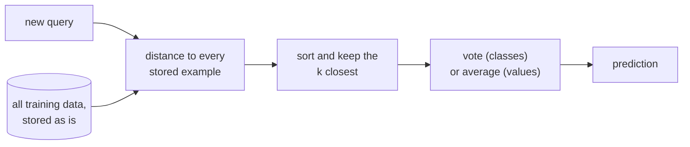

import Infographic from '@site/src/components/Infographic';
import KnnLab from '@site/src/components/viz/KnnLab';

**In one line.** k-nearest neighbours does no learning in advance: it stores every example and answers each question by letting the closest stored examples vote.

## The idea in plain words

Imagine valuing a house you have never seen. You would not derive a formula; you would look up the few most similar houses that sold nearby and average what they fetched. **k-nearest neighbours (k-NN)** is that habit turned into an algorithm: keep every example, and when a new case arrives, find the $k$ stored examples closest to it and let them decide.

Most learners are **eager**. They study the training data once, squeeze it into a small model (a line, a tree, a set of weights) and throw the data away. Predicting is then cheap. k-NN is **lazy**, also called instance-based or memory-based: "training" is just storing the examples, and all the work happens when a question arrives. The data *is* the model.

Three decisions define a k-NN model, and every other detail follows from them:

- **How distance is measured.** Euclidean distance by default, $d(q,x)=\sqrt{\sum_i (x_i-q_i)^2}$. Because it adds up differences in raw units, the scale of each feature quietly decides who counts as "near".
- **How many neighbours vote.** The number $k$ is the bias-variance knob: one neighbour memorises noise, hundreds blur real structure.
- **How the votes are combined.** One vote each, or weighted so that closer neighbours count more. For classification the class with the most (weighted) votes wins; for regression the neighbours' target values are averaged.

The consequences are worth knowing before the details. Training is free, but prediction costs a distance to every stored point, and the whole dataset must sit in memory. There is no global assumption about the shape of the boundary, so odd boundaries are no problem. And because everything is local, the method collapses when "local" stops meaning anything, which is what happens in many dimensions.



<Infographic
  src="/img/ml/instance-based-learning-lazy-vote.svg"
  alt="Eager and lazy learners compared, with the lecture worked example: query (2, 3), three nearest neighbours, one vote each gives + 2 to - 1 and 1/d squared weights give + 1.5 to - 1.0."
  caption="Lazy learning in one picture, and the lecture example with every number it uses."
/>

<Infographic
  src="/img/ml/instance-based-learning-k-scale-dimensions.svg"
  alt="Three panels: choosing k trades training accuracy against cross-validated accuracy, standardising wine features lifts accuracy from 0.663 to 0.961, and the nearest-to-farthest distance ratio climbs towards 1 as dimensions grow."
  caption="The three things that decide whether k-NN works. Every figure is printed by the code further down."
/>

## How it works

### Lazy vs eager learning

**Eager** learners compress the data into a model up front. **Instance-based** learners are **lazy**: they just store every example and defer all work to query time.

:::tip

**The data is the model.** Training is instant; the cost is paid per prediction (distances to stored points). "You are the average of those closest to you."

:::

### k-Nearest-Neighbours

Measure the query's **distance** to every training point (Euclidean: √Σ(xᵢ−qᵢ)²), take the **k closest**, and predict the **majority class** (or average target).

#### k-NN playground

Drag the query with the sliders and change k. The k nearest points light up and vote on the class.

*This widget is the lab in [Try it yourself](#try-it-yourself) below, which also explains how its defaults reproduce the code.*


:::tip

**Worked.** q=(2,3), training A(1,1)+,B(2,2)+,C(3,3)−,D(5,1)−,E(1,4)+. k=3 nearest: B(1.0)+, C(1.0)−, E(1.41)+ → majority **+**.

:::

### Distance-weighted k-NN

Weight each neighbour by **1/d²** so closer points count more; sum the weights per class.

:::note

**Worked.** Same neighbours: B=1/1²=1.0 (+), C=1/1²=1.0 (−), E=1/1.41²=0.5 (+). Totals: + = 1.5, − = 1.0 → **+**, more confidently. Weighting lets you safely use all points.

:::

:::note Correction to the lecture
The lecture says weighting makes the vote "more confident". The totals reproduce (+ 1.5, - 1.0), but the share of the winning class goes *down*: with one vote each it is 2 of 3, 67%; with $1/d^2$ weights it is 1.5 of 2.5, 60%. The nearer neighbour C, a "-", gains weight and E, a "+", loses it. What weighting really buys is robustness: distant points count for little, so more of them can vote safely, as the lecture says (with all five points the share of + is 61.2%). The code below prints both shares.
:::


### Choosing k & scaling features

- **k is a bias–variance knob** — Small k → jagged, overfits noise. Large k → smooth, may blur structure. Tune by cross-validation; use odd k to avoid ties.
- **Normalise first** — Distances are unit-sensitive — a large-scale feature dominates. Standardise every feature (zero mean, unit variance) so all count fairly.

### Locally weighted regression & the curse

For regression, fit a constant or line to **nearby points only**, weighted by closeness — a flexible curve that adapts locally.

:::note Beyond the lecture
**Locally weighted regression, in full.** To predict at a point $x_0$, fit a straight line to the training data with each point weighted by how near it is, and read off the line's value at $x_0$:

$$ \hat y(x_0)=a,\qquad (a,b)=\arg\min_{a,b}\sum_i w_i\bigl(y_i-a-b\,(x_i-x_0)\bigr)^2,\qquad w_i=\exp\!\Bigl(-\frac{(x_i-x_0)^2}{2\tau^2}\Bigr) $$

The width $\tau$ plays the role of $k$: small follows the noise, large flattens towards one global line. The fit is repeated for every query, so it is lazy in the same way k-NN is.

**The curse of dimensionality, in full.** In high dimensions two things happen together. Distances concentrate: the nearest and the farthest point end up at nearly the same distance, so "nearest" carries little information. And neighbourhoods stop being local: a region holding a fixed small fraction of the data must stretch across most of every axis. Irrelevant features make it worse, because each adds distance but no signal. The remedies are to drop irrelevant features, reduce dimension, learn a better distance, or use a different model. Section 3 of the code measures all of this.
:::


### Key takeaways

- **1 · Lazy** — Store data; all work at query time. Data is the model.
- **2 · Vote** — k nearest by Euclidean distance; majority / average. Weight by 1/d².
- **3 · Care** — Tune k, normalise features, mind high dimensions.

:::note

**The thread.** Instance-based learning stores all examples and, at query time, finds the k nearest by distance and lets them vote (classification) or average (regression). Distance weighting (1/d²) makes near neighbours count more; k trades bias for variance; features must be normalised; and high dimensions erode the meaning of "nearest".

:::

## A real system that works this way

**Vector search is k-NN with the labels removed.** Any system that finds the stored items most similar to a query, such as the retrieval step of a retrieval-augmented assistant, a "more like this" feature or a duplicate finder, represents items as vectors and asks for the nearest ones. At small scale that is the brute-force loop in this chapter. At large scale the cost of measuring against every item is the whole problem, and libraries such as Faiss exist to answer it. Its documentation describes the trade directly: you can accept an incorrect result some of the time (it gives 10% as an illustration) in exchange for a method that is many times faster or lighter on memory. That is **approximate** nearest-neighbour search, and it exists because exact search stops being affordable.

**scikit-learn's own switch-over shows the dimension problem in practice.** The k-d tree index is described as very fast for low-dimensional data (fewer than about 20 dimensions) and as becoming inefficient as dimension grows, and with `algorithm='auto'` the library falls back to plain brute force when there are more than 15 features. The reason is the one the lecture hints at in its last section and the code below measures: in high dimensions the trees can no longer rule out most of the data.

## Code you can run

Four short experiments, each one runnable on its own. The first reproduces every number in the lecture; the others measure the claims the lecture makes in words (scale features, tune $k$, mind the dimensions) and the regression variant it mentions.

### 1. The lecture's worked example, from scratch

Five labelled points, the query $q=(2,3)$, $k=3$. The code ranks the distances, takes the vote, then repeats it with $1/d^2$ weights, and finally asks scikit-learn what its built-in weightings do.

```python
import math

import numpy as np
from sklearn.neighbors import KNeighborsClassifier

points = {"A": (1, 1, "+"), "B": (2, 2, "+"), "C": (3, 3, "-"), "D": (5, 1, "-"), "E": (1, 4, "+")}
query = (2, 3)

dist = {name: math.dist(query, (x, y)) for name, (x, y, _) in points.items()}
ranked = sorted(dist, key=dist.get)
print("distances from q=(2, 3):", {n: round(dist[n], 2) for n in ranked})

k = 3
nearest = ranked[:k]
votes = {}
for name in nearest:
    sign = points[name][2]
    votes[sign] = votes.get(sign, 0) + 1
print(f"k={k} nearest: {nearest}  votes: {votes}  ->  {max(votes, key=votes.get)}")

weights = {}
for name in nearest:
    sign = points[name][2]
    weights[sign] = weights.get(sign, 0.0) + 1 / dist[name] ** 2
print("1/d^2 weight per class:", {s: round(w, 2) for s, w in weights.items()})
print(f"share of '+'   unweighted {votes['+'] / k:.0%}   weighted {weights['+'] / sum(weights.values()):.0%}")

everyone = {"+": 0.0, "-": 0.0}
for name, (x, y, sign) in points.items():
    everyone[sign] += 1 / dist[name] ** 2
print("all five points, 1/d^2:", {s: round(w, 3) for s, w in everyone.items()},
      f"share of '+' {everyone['+'] / sum(everyone.values()):.1%}")

X = np.array([[x, y] for x, y, _ in points.values()])
labels = np.array([sign for _, _, sign in points.values()])
print("\nscikit-learn, k=3, P('+') at the query:")
for name, w in [("uniform", "uniform"), ("distance (1/d)", "distance"), ("1/d^2 callable", lambda d: 1 / d**2)]:
    clf = KNeighborsClassifier(n_neighbors=3, weights=w).fit(X, labels)
    p_plus = clf.predict_proba([query])[0][list(clf.classes_).index("+")]
    print(f"  {name:15} P(+) = {p_plus:.3f}  predicts {clf.predict([query])[0]}")
```

The distances and both vote totals match the lecture exactly: B and C at 1.00, E at 1.41, a vote of + 2 to - 1, and weights of + 1.50 against - 1.00. Two details are worth a second look.

- With every point allowed to vote (the lecture's remark that weighting lets you "safely use all points") the totals are + 1.700 and - 1.077, a share of 61.2% for +. The far points A and D hardly move the answer, which is the point of weighting.
- scikit-learn's `weights='distance'` uses $1/d$, not $1/d^2$. At this query it gives $P(+)=0.631$, between the uniform 0.667 and the $1/d^2$ value of 0.600. If you want the lecture's rule you pass a function, as the last line of the block does.

### 2. Why features need one scale, and what $k$ does

Wine has 13 measurements on very different scales: alcohol spans 3.8 units, proline spans 1402. Euclidean distance adds those raw differences, so proline decides almost everything. Standardising inside a pipeline fixes that. The second half sweeps $k$ on noisy two-moons data and prints training and cross-validated accuracy side by side.

```python
import numpy as np
from sklearn.datasets import load_wine, make_moons
from sklearn.model_selection import StratifiedKFold, cross_val_score
from sklearn.neighbors import KNeighborsClassifier
from sklearn.pipeline import make_pipeline
from sklearn.preprocessing import StandardScaler

X, y = load_wine(return_X_y=True)
cv = StratifiedKFold(n_splits=5, shuffle=True, random_state=0)
spread = np.ptp(X, axis=0)
print(f"range of alcohol {spread[0]:.1f}, of malic acid {spread[1]:.1f}, of proline {spread[12]:.0f}")
for name, model in [("raw features", KNeighborsClassifier(5)),
                    ("standardised", make_pipeline(StandardScaler(), KNeighborsClassifier(5)))]:
    print(f"{name:13} 5-NN accuracy {cross_val_score(model, X, y, cv=cv).mean():.3f}")

Xm, ym = make_moons(n_samples=300, noise=0.35, random_state=0)
print("\n  k   train accuracy   cross-validated")
for k in (1, 3, 5, 9, 15, 25, 51, 101, 201):
    clf = KNeighborsClassifier(k)
    cv_score = cross_val_score(clf, Xm, ym, cv=cv).mean()
    print(f"{k:3}   {clf.fit(Xm, ym).score(Xm, ym):14.3f}   {cv_score:15.3f}")
```

Standardising lifts 5-NN accuracy on wine from 0.663 to 0.961 with no other change. In the $k$ sweep, $k=1$ scores a perfect 1.000 on its own training data (each point is its own nearest neighbour) but only 0.883 on held-out folds; accuracy peaks at small-to-medium $k$ (0.920 at $k=3$); and at $k=201$ both scores fall (0.760 and 0.727) because most of the training data now votes on every query. Read the middle of the table with care: with 300 points and 5 folds, differences of two or three hundredths are within noise, so pick $k$ by cross-validation and prefer the smooth middle of the curve to a lucky spike.

### 3. The curse of dimensionality

Three measurements. First, for uniform random points, the ratio of the nearest distance to the farthest distance from a query (1 would mean every point is equally far). Second, the edge length of a cube that holds 1% of uniformly spread data, as a fraction of each axis. Third, the wine data with useless random columns appended, which is what an irrelevant feature does to a distance.

```python
import numpy as np
from sklearn.datasets import load_wine
from sklearn.model_selection import StratifiedKFold, cross_val_score
from sklearn.neighbors import KNeighborsClassifier
from sklearn.preprocessing import StandardScaler

rng = np.random.default_rng(0)
print("dimensions   nearest / farthest   edge of a cube holding 1% of the data")
for d in (2, 10, 50, 200, 1000):
    points = rng.random((500, d))
    queries = rng.random((100, d))
    gaps = np.linalg.norm(points[None, :, :] - queries[:, None, :], axis=2)
    print(f"{d:10}   {(gaps.min(axis=1) / gaps.max(axis=1)).mean():17.3f}   {0.01 ** (1 / d):37.3f}")

X, y = load_wine(return_X_y=True)
X = StandardScaler().fit_transform(X)
cv = StratifiedKFold(n_splits=5, shuffle=True, random_state=0)
print("\nuseless extra columns   5-NN accuracy")
for extra in (0, 10, 50, 200, 500):
    noisy = np.hstack([X, rng.standard_normal((len(X), extra))])
    print(f"{extra:21}   {cross_val_score(KNeighborsClassifier(5), noisy, y, cv=cv).mean():.3f}")
```

The ratio climbs from 0.020 in two dimensions to 0.899 in a thousand: "nearest" is barely different from "farthest", so a vote among the nearest points carries little information. The last column says why from the geometry: to enclose just 1% of the data, a neighbourhood must span 0.100 of each axis in two dimensions, 0.631 in ten and 0.912 in fifty. A region that covers most of every axis is not "local" any more. The second table is the practical version. Each added noise column contributes distance but no signal, and 5-NN accuracy falls from 0.961 to 0.854 with 50 noise columns and 0.557 with 500. This is why k-NN is paired with feature selection or dimensionality reduction in practice.

### 4. The regression variant

The lecture's last section says regression can fit a constant or a line to nearby points only, weighted by closeness. The block compares one global line, locally weighted linear regression at several widths, and plain k-NN regression, all scored against the true curve $\sin x$.

```python
import numpy as np
from sklearn.neighbors import KNeighborsRegressor

rng = np.random.default_rng(1)
x = np.sort(rng.uniform(0, 2 * np.pi, 80))
y = np.sin(x) + rng.normal(0, 0.25, x.size)
grid = np.linspace(0, 2 * np.pi, 9)
truth = np.sin(grid)

def locally_weighted(x_query, bandwidth):
    w = np.exp(-((x - x_query) ** 2) / (2 * bandwidth**2))
    design = np.column_stack([np.ones_like(x), x - x_query])
    weighted = design.T * w
    intercept, slope = np.linalg.solve(weighted @ design, weighted @ y)
    return intercept

def rmse(pred):
    return float(np.sqrt(np.mean((pred - truth) ** 2)))

print(f"one global straight line      RMSE {rmse(np.polyval(np.polyfit(x, y, 1), grid)):.3f}")
for bandwidth in (0.2, 0.5, 1.5):
    fit = np.array([locally_weighted(g, bandwidth) for g in grid])
    print(f"locally weighted, width {bandwidth:<4}  RMSE {rmse(fit):.3f}")
for k in (1, 5, 15, 40):
    model = KNeighborsRegressor(n_neighbors=k).fit(x[:, None], y)
    print(f"k-NN regression, k={k:<2}        RMSE {rmse(model.predict(grid[:, None])):.3f}")
```

One straight line cannot follow a sine wave (RMSE 0.576). Fitting a weighted line around each query brings it to 0.103 at a width of 0.5, and the width behaves exactly like $k$: 0.2 chases noise (0.164), 1.5 flattens back towards the global line (0.401). k-NN regression shows the same U-shape, best near $k=5$ (0.137) and worse at both 1 and 40.

### Try it yourself

The lab below is the lecture's k-NN playground. With its defaults (the five lecture points, query $(2,3)$, $k=3$, one vote each) it reproduces the first block: distances 1.00, 1.00, 1.41, a vote of + 2 to - 1, and, after switching the votes to weighted $1/d^2$, totals of + 1.50 against - 1.00. Choose "two features on different scales" and tick or untick standardise to see the wine lesson as a picture: the dashed outline is the region that counts as "near", and the leave-one-out accuracy changes with it. The "high dimensions" view draws the distance histogram behind the third block.

<KnnLab />

## Designing with it

**The decisions, in the order to make them**

| Question | Guidance |
| --- | --- |
| Do the features share a scale? | Standardise inside a `Pipeline` so each cross-validation fold learns its own mean and spread. A scaler fitted on all the data leaks the test set into the training step. |
| How many features are really informative? | Distance counts every column equally. Drop irrelevant ones or reduce dimension first; the noise-column table is the cost of not doing so. |
| What is $k$? | Search odd values by cross-validation; odd $k$ avoids ties in binary problems. |
| Should closer neighbours count more? | Yes when classes overlap or $k$ is large. Remember `weights='distance'` is $1/d$; pass a function for $1/d^2$. |
| Are there categorical features? | One-hot columns make the distance jumpy. Use a metric designed for mixed data or a different model. |
| Are the classes imbalanced? | A large $k$ drifts towards the majority class, because most of the neighbourhood belongs to it. Keep $k$ small, weight by distance, or rebalance. |
| How big is the data? | Prediction costs a distance per stored point per query. Past a few hundred thousand points, use an index (k-d tree or ball tree for modest dimension) or approximate search. |

**When k-NN is the right tool.** As a fast, assumption-light baseline that tells you how much a smarter model must beat; when the boundary is irregular and you have plenty of low-dimensional data; when you need the *examples* behind a prediction (the neighbours are the explanation); and as the engine of similarity search. It is a poor fit when features are many and mostly irrelevant, when predictions must be very fast on very large data, or when the cost of storing the training set is unacceptable.

**A habit worth keeping.** Always print the neighbours for a few predictions. If the "nearest" examples do not look similar to a human, the distance function is wrong, and no choice of $k$ will repair it.

## Where this stands in 2026

:::info Industry view

- **The search idea outlived the classifier.** Used directly for prediction on tabular data, k-NN is a baseline; used as the retrieval step over embeddings, nearest-neighbour search is everywhere, and approximate indexes are the standard answer once exact search is too slow (the Faiss documentation describes this accuracy-for-speed trade explicitly).
- **Library defaults encode the dimension problem.** In scikit-learn 1.9, `algorithm='auto'` uses brute force when there are more than 15 features, because tree indexes lose their advantage as dimension grows.
- **The curse is old and measured.** Beyer and colleagues showed in 1999 that the nearest and farthest distances converge as dimension grows, with the effect visible from about 10 to 15 dimensions on real and synthetic data; the same paper notes it does not hold for every workload, so measure on your own data.
- **Scaling is not optional.** Standardise inside the pipeline; the wine experiment above moves accuracy from 0.663 to 0.961 on that one change.

:::

## Practice questions

<details>
<summary><strong>Q1.</strong> Why is k-NN called a 'lazy' learner?</summary>

It does no work during training — it just stores the examples — and defers all computation (distances, neighbour selection, voting) to **query time**.<br /><em>Module 6 · conceptual</em>

</details>

<details>
<summary><strong>Q2.</strong> Classify q=(2,3) with k=3 given A(1,1)+, B(2,2)+, C(3,3)−, D(5,1)−, E(1,4)+.</summary>

Distances: B=1.00, C=1.00, E=1.41 are nearest. Votes: +,−,+ → class + (2 vs 1).<br /><em>Module 6 · numeric</em>

</details>

<details>
<summary><strong>Q3.</strong> Repeat Q2 with distance weighting (1/d²). Does the answer change?</summary>

Weights: B=1.0(+), C=1.0(−), E=1/1.41²=0.5(+). Totals + = 1.5, − = 1.0 → still **+**. (The lecture adds "but more confidently"; see the correction above: the share of + actually falls from 67% to 60%.)<br /><em>Module 6 · numeric</em>

</details>

<details>
<summary><strong>Q4.</strong> How does the choice of k affect the model, and why prefer odd k?</summary>

Small k → low bias, high variance (jagged, overfits); large k → smoother, higher bias. Odd k avoids ties in binary voting. Tune by cross-validation.<br /><em>Module 6 · conceptual</em>

</details>

<details>
<summary><strong>Q5.</strong> Why must features be normalised before using k-NN?</summary>

Euclidean distance is unit-sensitive, so a large-scale feature dominates the distance. Standardising (zero mean, unit variance) lets every feature contribute fairly.<br /><em>Module 6 · conceptual</em>

</details>

<details>
<summary><strong>Q6.</strong> What is the curse of dimensionality for k-NN?</summary>

In high dimensions all points become nearly equidistant, so 'nearest' loses meaning and k-NN degrades. Mitigate with dimensionality reduction or efficient indexes (k-d trees).<br /><em>Module 6 · conceptual</em>

</details>

## Further reading

- [scikit-learn user guide: Nearest Neighbors](https://scikit-learn.org/stable/modules/neighbors.html), the primary reference for classification, regression, `weights`, and the brute-force, k-d tree and ball tree algorithms.
- [Beyer, Goldstein, Ramakrishnan and Shaft, "When Is Nearest Neighbor Meaningful?" (ICDT 1999)](https://doi.org/10.1007/3-540-49257-7_15), the paper behind the curse-of-dimensionality statement.
- [Stanford CS229 lecture notes (Ng and Ma)](https://cs229.stanford.edu/notes2022fall/main_notes.pdf), section 1.4 covers locally weighted linear regression.
- [Faiss: a library for similarity search of dense vectors](https://faiss.ai/), what exact versus approximate nearest-neighbour search looks like at scale.
- Built from the course lecture "ml-m6-instance-based" (Lecture Library series).

- **[An Introduction to Statistical Learning](https://www.statlearning.com/)** `book`
  James, Witten, Hastie & Tibshirani — The friendliest rigorous intro to ML — free PDF plus R/Python labs.
- **[Stanford CS229 (Machine Learning)](https://cs229.stanford.edu/)** `course`
  Andrew Ng, Stanford — The rigorous derivations behind SVMs, GLMs, EM and learning theory.
- **[StatQuest](https://statquest.org/video-index/)** `▶ video`
  Josh Starmer — Short, wonderfully clear videos that build intuition step by step.

## What you can now do

- I can classify a query by hand with k-NN, with and without $1/d^2$ weights, and explain why the weighted share of the winning class can be smaller than the unweighted one.
- I can explain why a lazy learner has no training cost but a per-query cost, and what that means for memory and latency.
- I can show, with a pipeline and cross-validation, that unscaled features change which points are nearest.
- I can choose $k$ by cross-validation and say what too small and too large each do to bias and variance.
- I can state what the curse of dimensionality does to the nearest and farthest distances, and reduce the damage with feature selection or dimensionality reduction.
- I can describe locally weighted regression and how its width plays the role of $k$.
