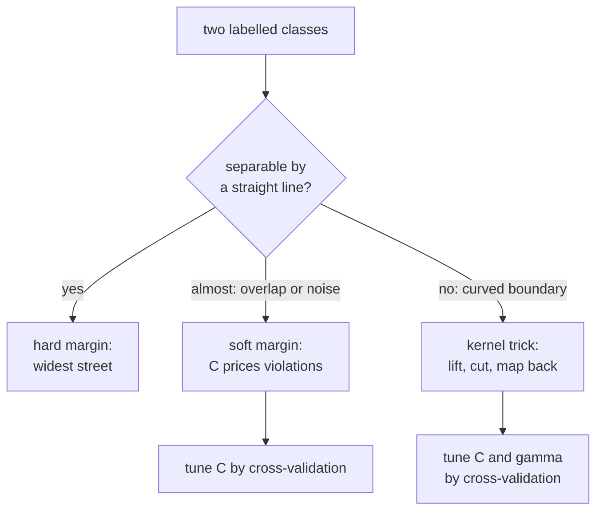

import Infographic from '@site/src/components/Infographic';
import SvmMarginLab from '@site/src/components/viz/SvmMarginLab';

**In one line.** Of all the lines that separate two classes, a support vector machine picks the one with the widest margin, and a kernel bends that line when the data are not linearly separable.

## The idea in plain words

Draw two clouds of points that a straight line can separate and you will find that infinitely many lines do the job. Some of them squeeze past a point with a hair's breadth to spare; a small nudge to the data and they misclassify it. The **support vector machine (SVM)** asks for the line that stays as far as possible from both classes: the **widest street** that fits between them. A wide street is robust, because a new point has to wander a long way before it crosses the middle.

Two facts make the idea powerful.

- **Only the kerb points matter.** The street is pinned down by the few examples on its edges, the **support vectors**. Delete any other point and the boundary does not move. That is why an SVM stores only a handful of training points, and why it is hard to disturb with noise far from the boundary.
- **Real data is messy in two different ways.** Classes may *overlap*, so no street is clean; the **soft margin** allows a few violations and the knob $C$ prices them. Or the boundary may be *curved*, so no straight street exists; the **kernel trick** lifts the data to a space where a straight street does, without ever building that space.

Everything else in the chapter is detail on those three moves: pick the widest margin, allow priced violations, and bend the space when a line is not enough.



<Infographic
  src="/img/ml/support-vector-machines-margin.svg"
  alt="Left: a separating line x1 + x2 = 3 with margin lines at 2 and 4, margin 1.41, and four ringed support vectors. Right: a table of how the margin, support vector count and training accuracy change as C rises from 0.01 to 100."
  caption="The widest street (the lecture example) and the C knob with one stray point. Figures come from svm_1.py and svm_2.py."
/>

<Infographic
  src="/img/ml/support-vector-machines-kernel-lift.svg"
  alt="Three steps: one-dimensional points with a positive class in the middle cannot be cut by one threshold, lifting them to x and x squared lets a horizontal cut at 4.25 separate them, and mapping back gives two cut points at plus and minus 2.062. Below are the kernel identity and RBF gamma results."
  caption="The kernel trick as lift, cut, map back, with the numbers printed by svm_3.py and svm_4.py."
/>

## How it works

### Maximum margin & support vectors

Classify by sign(**w·x + b**). The best boundary leaves the **widest margin** = 2/‖w‖ to the nearest points. Those nearest points are the **support vectors**.

:::tip

**Worked.** w=(1,1), b=−3 → boundary x₁+x₂=3, margin 2/√2 = **√2 ≈ 1.41**. Point (2,2): 2+2−3 = +1 → class + (on the margin). (1,1): −1 → class −.

:::

### Hard vs soft margin

**Soft-margin** SVM lets some points violate the margin (slack), with **C** trading margin width against violations.

#### Tilt the boundary

Rotate/shift the separating line and watch the margin width and the number of misclassified points.

*This widget is the first lab in [Try it yourself](#try-it-yourself) below, in the "margin and C" view.*


:::tip

**C knob.** Large C = punish mistakes hard (narrow margin, overfit risk); small C = tolerate them (wider margin, more bias).

:::

### The kernel trick

Map data to a higher dimension where it *is* linearly separable — the boundary becomes curved back in the original space — **without ever computing the mapping**.

:::note

**Kernels.** A kernel K(x,z) returns the high-dim dot product directly. Common: linear, polynomial (x·z+1)ᵈ, and RBF exp(−γ‖x−z‖²). This is what makes SVMs handle XOR-like, non-linear data.

:::

:::note Beyond the lecture
**What the optimiser actually solves.** The widest street is the answer to: minimise $\tfrac12\lVert w\rVert^2$ subject to $y_i(w\cdot x_i+b)\ge 1$ for every point. Maximising the margin $2/\lVert w\rVert$ and minimising $\lVert w\rVert^2$ are the same job. The soft margin gives each point a slack $\xi_i\ge 0$: minimise $\tfrac12\lVert w\rVert^2+C\sum_i\xi_i$ subject to $y_i(w\cdot x_i+b)\ge 1-\xi_i$. Since the cheapest slack is $\xi_i=\max(0,\,1-y_if(x_i))$, this is the *hinge loss*: zero for points safely outside the margin and growing linearly for violators. An SVM is therefore regularised hinge-loss minimisation, and $C$ is the inverse of the regularisation strength.

**Why kernels work.** The solution can be written using only dot products between training points, $f(x)=\sum_i\alpha_iy_iK(x_i,x)+b$, and only the support vectors have $\alpha_i>0$. Swap each dot product for a kernel $K$ and the algorithm never needs the lifted coordinates. That is the whole trick.

**What it does not give you.** The output $f(x)$ is a signed distance score, not a probability; getting probabilities needs an extra calibration step (see Designing with it below).
:::


### Key takeaways

- **1 · Margin** — Widest separator; margin = 2/‖w‖; support vectors define it.
- **2 · Soft margin** — Slack + C trade width vs violations.
- **3 · Kernels** — Polynomial / RBF give non-linear boundaries cheaply.

:::note

**The thread.** SVMs maximise the margin between classes; only the support vectors on the margin matter, and the margin is 2/‖w‖. Soft margins with parameter C handle overlap, and the kernel trick separates non-linear data by an implicit lift to higher dimensions.

:::

## A real system that works this way

**Text classification was the showcase.** In a 1998 study of sorting documents into topics, Thorsten Joachims pointed out that text, represented as word counts, becomes a very high-dimensional sparse vector (10,000 dimensions and more), and argued that SVMs suit this setting because their ability to generalise is governed by the margin rather than by the number of dimensions. The paper reports substantial gains over the best methods of its day, and that the SVMs needed no manual parameter tuning. The reasoning still describes why a linear SVM on word counts is a strong baseline for text.

**scikit-learn's guide gives the modern summary of where SVMs earn their place:** effective in high-dimensional spaces, still useful when there are more features than samples, memory-efficient because only the support vectors are kept, and flexible through custom kernels. It is equally plain about the costs: a kernel SVM's fit time grows faster than linearly in the number of samples (the guide quotes between quadratic and cubic behaviour), probability estimates are not native, and scaling the features is "highly recommended" because SVMs are not scale invariant. For very large datasets it points to the linear variant, `LinearSVC`, which scales almost linearly.

## Code you can run

Four blocks. The first reproduces the lecture's numbers and recovers the same line from data; the second turns the $C$ knob; the third shows the kernel trick numerically; the fourth measures what $\gamma$, $C$ and scaling do.

### 1. The lecture's margin, and the same line learned from data

The lecture's line is $w=(1,1)$, $b=-3$. The block checks its two worked points, then fits a real SVM to eight points built so that this line is the widest street. A very large $C$ makes the margin hard.

```python
import numpy as np
from sklearn.svm import SVC

w = np.array([1.0, 1.0])
b = -3.0
print(f"margin 2/||w|| = {2 / np.linalg.norm(w):.4f}   sqrt(2) = {2 ** 0.5:.4f}")
for point in [(2, 2), (1, 1)]:
    score = float(w @ point + b)
    print(f"w.x + b at {point} = {score:+.0f}  ->  class {'+' if score > 0 else '-'}")

X = np.array([[2, 2], [3, 1], [4, 3], [3, 4], [1, 1], [2, 0], [0, 0], [0, 1]], dtype=float)
y = np.array([1, 1, 1, 1, -1, -1, -1, -1])
svm = SVC(kernel="linear", C=1e6).fit(X, y)
w_fit, b_fit = svm.coef_[0], svm.intercept_[0]
print(f"\nfitted w = {np.round(w_fit, 3)}, b = {b_fit:.3f}, margin = {2 / np.linalg.norm(w_fit):.4f}")
print("support vectors:", svm.support_vectors_.astype(int).tolist())
print("the other four points sit strictly outside the margin:")
for point, label in zip(X, y):
    if not any((point == sv).all() for sv in svm.support_vectors_):
        print(f"  {point.astype(int).tolist()}  y*(w.x+b) = {label * (w_fit @ point + b_fit):.2f}")
```

The hand calculation matches the lecture: margin $2/\lVert w\rVert=\sqrt2\approx1.41$, $(2,2)$ scores $+1$ and $(1,1)$ scores $-1$, which is exactly the margin condition $y(w\cdot x+b)=1$. The fitted SVM recovers $w=(1,1)$, $b=-3$ and the same margin 1.4142 from the data alone. Its four support vectors, $(1,1)$, $(2,0)$, $(2,2)$ and $(3,1)$, are the points on the two kerb lines $x_1+x_2=2$ and $x_1+x_2=4$; the other four points score 2, 3, 4 and 4, comfortably outside, and removing them would change nothing.

### 2. Turning the C knob

Add one stray "+" point at $(1.2,1.3)$, deep inside the "-" territory, and refit for a range of $C$.

```python
import numpy as np
from sklearn.svm import SVC

X = np.array([[2, 2], [3, 1], [4, 3], [3, 4], [1, 1], [2, 0], [0, 0], [0, 1], [1.2, 1.3]])
y = np.array([1, 1, 1, 1, -1, -1, -1, -1, 1])

print("one stray '+' point at (1.2, 1.3), deep inside the '-' side")
print("     C   margin 2/||w||   support vectors   training accuracy")
for C in (0.01, 0.1, 1, 10, 100):
    svm = SVC(kernel="linear", C=C).fit(X, y)
    margin = 2 / np.linalg.norm(svm.coef_[0])
    print(f"{C:6}   {margin:13.2f}   {len(svm.support_):15}   {svm.score(X, y):17.2f}")
```

At $C=0.01$ violations are almost free, so the margin balloons to 22.63 and nearly everything is a support vector (training accuracy 0.56). At $C=1$ the margin is the lecture's 1.41, but the stray point is still misclassified (0.89). Raise $C$ to 10 and the street twists to catch the stray point: accuracy 1.00, margin 0.55, only two support vectors. That is the overfitting risk the lecture describes: a single odd point has rotated and narrowed the whole boundary.

### 3. The kernel trick, numerically

Three checks. A degree-2 polynomial kernel $(x\cdot z+1)^2$ equals the dot product of an explicit six-coordinate lift. One-dimensional points with the "+" class in the middle defeat any linear rule but yield to a cut in $(x,x^2)$. And on two concentric rings, linear, polynomial and RBF kernels are compared.

```python
import numpy as np
from sklearn.datasets import make_circles
from sklearn.metrics.pairwise import rbf_kernel
from sklearn.model_selection import train_test_split
from sklearn.svm import SVC

def lift(v):
    a, b = v
    r = np.sqrt(2)
    return np.array([1, r * a, r * b, a * a, b * b, r * a * b])

x = np.array([1.0, 2.0])
z = np.array([3.0, -1.0])
print("kernel (x.z + 1)^2 :", (x @ z + 1) ** 2)
print("explicit lift      :", round(float(lift(x) @ lift(z)), 6), "(six coordinates instead of two)")
gamma = 0.5
print("RBF by hand        :", round(float(np.exp(-gamma * np.sum((x - z) ** 2))), 6),
      "  scikit-learn:", round(float(rbf_kernel([x], [z], gamma=gamma)[0, 0]), 6))

x1 = np.array([-4, -3, -2.5, -1.5, -1, 0, 1, 1.5, 2.5, 3, 4.0])
y1 = np.array([-1, -1, -1, 1, 1, 1, 1, 1, -1, -1, -1])
flat = SVC(kernel="linear", C=1000).fit(x1[:, None], y1)
lifted = np.column_stack([x1, x1**2])
curved = SVC(kernel="linear", C=1000).fit(lifted, y1)
height = -curved.intercept_[0] / curved.coef_[0][1]
print(f"\n1-D points, a line on x      : accuracy {flat.score(x1[:, None], y1):.2f}")
print(f"same points lifted to (x, x^2): accuracy {curved.score(lifted, y1):.2f}")
print(f"the cut is x^2 = {height:.3f}, so back on the line it falls at x = +-{height ** 0.5:.3f}")

X, y = make_circles(n_samples=300, noise=0.1, factor=0.4, random_state=0)
X_tr, X_te, y_tr, y_te = train_test_split(X, y, test_size=0.3, random_state=0, stratify=y)
print("\ntwo concentric rings, test accuracy")
for name, kwargs in [("linear", {"kernel": "linear"}),
                     ("poly, degree 2", {"kernel": "poly", "degree": 2, "coef0": 1}),
                     ("rbf", {"kernel": "rbf"})]:
    svm = SVC(**kwargs).fit(X_tr, y_tr)
    print(f"  {name:15} {svm.score(X_te, y_te):.3f}   support vectors {len(svm.support_)}")
```

The kernel and the explicit lift both give 4.0, but the kernel never builds the six coordinates; for RBF the lifted space is infinite-dimensional and only the kernel makes the calculation possible, here $\exp(-0.5\cdot13)=0.001503$ both by hand and in scikit-learn. On the 1-D data a linear SVM can do no better than 0.55; lifted to $(x,x^2)$ it reaches 1.00 with the cut at $x^2=4.250$, which falls back on the line at $x=\pm2.062$: a boundary of two points, found by a straight cut. On the rings the linear kernel is at chance (0.522), the degree-2 polynomial is perfect (1.000) and RBF is 0.989.

### 4. Gamma, C and scaling

For the RBF kernel, $\gamma$ sets how far one example's influence reaches. The block sweeps $\gamma$ and then $C$ on noisy moons, and finishes with the wine data with and without scaling.

```python
from sklearn.datasets import load_wine, make_moons
from sklearn.model_selection import StratifiedKFold, cross_val_score, train_test_split
from sklearn.pipeline import make_pipeline
from sklearn.preprocessing import StandardScaler
from sklearn.svm import SVC

X, y = make_moons(n_samples=300, noise=0.3, random_state=1)
X_tr, X_te, y_tr, y_te = train_test_split(X, y, test_size=0.3, random_state=0, stratify=y)

print("RBF kernel, C=1: how far one example's influence reaches")
print("  gamma   train   test   support vectors")
for gamma in (0.01, 0.1, 1, 10, 100):
    svm = SVC(kernel="rbf", gamma=gamma, C=1).fit(X_tr, y_tr)
    print(f"{gamma:7}   {svm.score(X_tr, y_tr):.3f}  {svm.score(X_te, y_te):.3f}   {len(svm.support_):3}")

print("\nRBF kernel, gamma=1: how hard mistakes are punished")
print("      C   train   test   support vectors")
for C in (0.01, 0.1, 1, 10, 100, 1000):
    svm = SVC(kernel="rbf", gamma=1, C=C).fit(X_tr, y_tr)
    print(f"{C:7}   {svm.score(X_tr, y_tr):.3f}  {svm.score(X_te, y_te):.3f}   {len(svm.support_):3}")

Xw, yw = load_wine(return_X_y=True)
cv = StratifiedKFold(n_splits=5, shuffle=True, random_state=0)
print("\nwine, 5-fold accuracy")
print("  SVC on raw features       :", round(cross_val_score(SVC(), Xw, yw, cv=cv).mean(), 3))
print("  scaler + SVC in a pipeline:", round(cross_val_score(make_pipeline(StandardScaler(), SVC()), Xw, yw, cv=cv).mean(), 3))
```

A tiny $\gamma$ (0.01) gives a nearly straight boundary that underfits (0.789 on test); a huge one (100) reaches only a hair's width around each point, so training accuracy rises to 0.971 while test accuracy drops to 0.878, with 197 of 210 training points becoming support vectors. The best test score sits in the middle ($\gamma$ of 1 to 10). $C$ behaves as in block 2. And the last two lines are the scaling warning in numbers: an RBF SVM on raw wine features scores 0.657 and the same model behind a `StandardScaler` scores 0.983.

### Try it yourself

The lab has three views. In **margin and C**, the defaults are the line $x_1+x_2=3$ (angle 45 degrees, offset 2.12): margin 1.41, no mistakes and the four ringed support points, as in block 1. Tilt it and watch the margin shrink or points go wrong. Press "fit for this C" and the lab solves the soft-margin problem exactly (it is the same optimisation scikit-learn runs): with the stray point ticked, C of 0.01, 0.1, 1, 10 and 100 give the margins 22.63, 4.80, 1.41, 0.55 and 0.36 of block 2, and 9, 8, 4, 2 and 2 points on or inside the margin. **Kernel lift** is block 3's 1-D picture, with a cut height you can drag (the default 4.25 gives $\pm2.062$). **RBF similarity** shows $\exp(-\gamma d^2)$ and the 0.0015 from block 3.

<SvmMarginLab />

## Designing with it

**A workflow that rarely disappoints**

1. **Scale the features** in a `Pipeline` (see [data preprocessing](/docs/theory/ml/data-preprocessing)). This is not optional for SVMs.
2. **Start linear.** A linear SVM (`LinearSVC` for speed) is a strong baseline on wide, sparse data such as text.
3. **Move to RBF** if the linear model underfits. Search $C$ and $\gamma$ on a logarithmic grid with cross-validation, for example powers of ten for both; the scikit-learn guide recommends exponentially spaced values.
4. **Read the support-vector count.** Nearly every training point being a support vector (as at $C=0.01$ or $\gamma=100$ above) is a warning that the model is either far too soft or far too wiggly.

| Knob | Small value | Large value |
| --- | --- | --- |
| $C$ | Wide street, many violations tolerated, more bias | Narrow street, few violations, risk of overfitting to stray points |
| $\gamma$ (RBF) | Each point reaches far, smooth, nearly linear boundary | Each point reaches a hair's width, wiggly boundary, overfitting |
| degree (polynomial) | Gentle curve | Flexible curve, numerically harsher |

**Practical limits.** Kernel SVMs need the kernel matrix, so training time and memory grow quickly with the number of samples; the scikit-learn guide quotes between quadratic and cubic scaling. Past tens of thousands of rows, prefer a linear SVM, a tree ensemble or a neural network. An SVM outputs a signed distance from the boundary, not a probability: `probability=True` adds Platt scaling with internal cross-validation, which is slow and can disagree with `predict`. If you need probabilities, use the distance as a score and calibrate it (see [model evaluation](/docs/theory/ml/model-evaluation)).

**Multiclass and outliers.** SVMs are binary at heart; libraries combine several binary problems. Remember that a very large $C$ makes the model chase every outlier, as the stray point showed.

## Where this stands in 2026

:::info Industry view

- **Linear SVMs remain a competitive baseline for high-dimensional sparse data such as text**, which is the setting the 1998 text-categorisation study identified; the scikit-learn guide still lists effectiveness in high dimensions as the first advantage.
- **Kernel SVMs are used less for large tabular problems today.** Fit time grows between quadratically and cubically with the number of samples (scikit-learn 1.9 guide), so tree ensembles and neural networks are the usual first choices on large tabular data. This is a statement about cost and common practice, not a ranking that holds for every dataset: on small, clean, high-dimensional data a tuned RBF SVM is still a serious contender.
- **The margin idea outlived the classifier.** The hinge loss behind the soft margin is still the default loss of scikit-learn's `SGDClassifier`, which trains a linear SVM on data too large for a kernel solver.
- **Scale first.** The guide calls scaling highly recommended because SVMs are not scale invariant; the wine experiment measures the gap (0.657 raw against 0.983 scaled).

:::

## Practice questions

<details>
<summary><strong>Q1.</strong> What does an SVM maximise, and which points determine the boundary?</summary>

It maximises the margin — the gap to the nearest points of each class. Only the support vectors (points on the margin) determine the boundary.<br /><em>Module 7 · conceptual</em>

</details>

<details>
<summary><strong>Q2.</strong> For w=(1,1), b=−3, give the margin width and classify (2,2) and (1,1).</summary>

Margin = 2/‖w‖ = 2/√2 = √2 ≈ 1.41. (2,2): 2+2−3 = +1 → class + (on margin). (1,1): −1 → class −.<br /><em>Module 7 · numeric</em>

</details>

<details>
<summary><strong>Q3.</strong> What does the soft-margin parameter C control?</summary>

The trade-off between margin width and margin violations: large C punishes mistakes hard (narrow margin, overfit risk); small C tolerates them (wider margin, more bias).<br /><em>Module 7 · conceptual</em>

</details>

<details>
<summary><strong>Q4.</strong> Explain the kernel trick in one or two sentences.</summary>

Map the data to a higher-dimensional space where it is linearly separable and separate it there; a kernel returns the high-dimensional dot product directly, so the mapping is never computed explicitly — giving non-linear boundaries cheaply.<br /><em>Module 7 · conceptual</em>

</details>

<details>
<summary><strong>Q5.</strong> Name three common kernels and what the RBF kernel computes.</summary>

Linear, polynomial (x·z+1)ᵈ, and RBF. RBF = exp(−γ‖x−z‖²), a similarity that decays with distance.<br /><em>Module 7 · conceptual</em>

</details>

<details>
<summary><strong>Q6.</strong> Why do wider margins tend to generalise better?</summary>

A wider gap means small perturbations of the data are less likely to cross the boundary, so the classifier is more robust to noise and new points.<br /><em>Module 7 · conceptual</em>

</details>

## Further reading

- [scikit-learn user guide: Support Vector Machines](https://scikit-learn.org/stable/modules/svm.html), the primary reference for `SVC`, `LinearSVC`, kernels, scaling advice, complexity and probability estimates.
- [Joachims, "Text Categorization with Support Vector Machines: Learning with Many Relevant Features" (ECML 1998)](https://www.cs.cornell.edu/people/tj/publications/joachims_98a.pdf), why SVMs suit sparse, high-dimensional text.
- [Stanford CS229 lecture notes (Ng and Ma)](https://cs229.stanford.edu/notes2022fall/main_notes.pdf), the chapter on support vector machines derives functional and geometric margins and kernels.
- Built from the course lecture "ml-m7-svm" (Lecture Library series).

- **[An Introduction to Statistical Learning](https://www.statlearning.com/)** `book`
  James, Witten, Hastie & Tibshirani — The friendliest rigorous intro to ML — free PDF plus R/Python labs.
- **[Stanford CS229 (Machine Learning)](https://cs229.stanford.edu/)** `course`
  Andrew Ng, Stanford — The rigorous derivations behind SVMs, GLMs, EM and learning theory.
- **[StatQuest](https://statquest.org/video-index/)** `▶ video`
  Josh Starmer — Short, wonderfully clear videos that build intuition step by step.

## What you can now do

- I can compute the margin $2/\lVert w\rVert$ and classify points with $\mathrm{sign}(w\cdot x+b)$ for a given $w$ and $b$.
- I can explain why only the support vectors determine the boundary, and show it by removing a non-support point.
- I can say what $C$ trades off and predict how the margin and the number of support vectors change when it rises.
- I can explain the kernel trick in a sentence, and show that a kernel equals a dot product in a lifted space without computing the lift.
- I can tune $C$ and $\gamma$ with cross-validation inside a pipeline that scales the features first.
- I can say when not to use a kernel SVM: large sample counts, or when I need calibrated probabilities.
