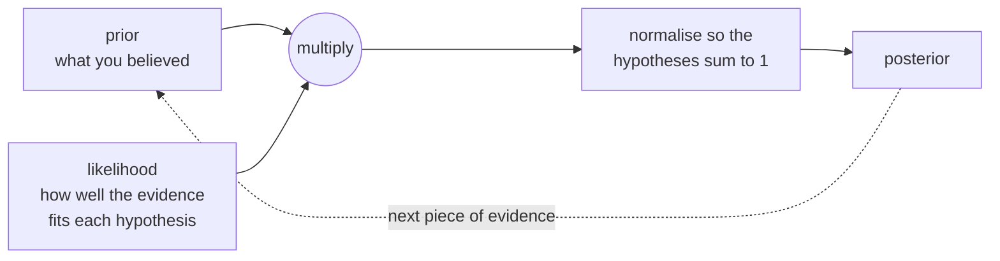

import Infographic from '@site/src/components/Infographic';
import BayesRuleLab from '@site/src/components/viz/BayesRuleLab';

**In one line.** Bayesian learning treats hypotheses as probabilities and updates them with evidence, so the prior never stops mattering.

## The idea in plain words

A detective does not start from nothing. Before looking at any clue she already has a sense of how common each kind of culprit is; each clue then shifts the odds, and a clue is only as persuasive as it is rare among the innocent. **Bayes' rule** is that reasoning made exact:

$$ P(H\mid D)=\frac{P(D\mid H)\,P(H)}{P(D)} \qquad\text{posterior}\;\propto\;\text{likelihood}\times\text{prior} $$

- The **prior** $P(H)$ is what you believed before the evidence, for example how common a disease is.
- The **likelihood** $P(D\mid H)$ is how probable the evidence would be if the hypothesis were true.
- The **posterior** $P(H\mid D)$ is the updated belief. It becomes tomorrow's prior.

The famous trap is forgetting the prior. A test that is right 99% of the time sounds decisive, yet for a disease that affects one person in a thousand most positive results are false alarms, because the healthy are so much more numerous. The lecture's calculation, and the lab and code below, make that concrete with natural frequencies: count people, not probabilities.

Learning enters in two steps. **MAP** (maximum a posteriori) picks the hypothesis with the highest likelihood times prior; **maximum likelihood** picks the highest likelihood alone, which is MAP with a flat prior. And for classification with many features, **Naive Bayes** makes one bold simplification, that features are independent *given the class*, so the likelihood of all the evidence is just a product of per-feature likelihoods. The assumption is rarely true, which is why the "naive", yet it makes the model fast, data-efficient and, for text, surprisingly strong.



<Infographic
  src="/img/ml/bayesian-learning-base-rate.svg"
  alt="A tree of 100,000 people: 100 sick of whom 99 test positive, 99,900 healthy of whom 4,995 test positive, so 99 of 5,094 positives are sick, 0.0194. Side panels show the posterior for different prevalences and after repeated positive tests."
  caption="The disease-test surprise as counted people. Figures come from bayes_1.py."
/>

<Infographic
  src="/img/ml/bayesian-learning-naive-bayes.svg"
  alt="Three panels: the Naive Bayes spam calculation giving 0.192 for spam and 0.012 for ham and a posterior of 0.941, MAP against maximum likelihood for a coin that came up heads three times, and Laplace smoothing turning a 0 over 0 non-answer into 0.8889."
  caption="Naive Bayes, MAP versus maximum likelihood, and Laplace smoothing, with the numbers printed by bayes_2.py to bayes_4.py."
/>

## How it works

### Updating belief with evidence

**P(H|D) = P(D|H)·P(H) / P(D)** — prior × likelihood, normalised, gives the posterior.

#### The disease-test surprise

Slide the disease rarity, sensitivity and false-positive rate. Watch how a positive test barely moves a rare-disease probability.

*This widget is the first view of the lab in [Try it yourself](#try-it-yourself) below.*


:::tip

**Worked.** P(disease)=0.1%, sens=99%, FPR=5% → P(disease|+) = 0.99·0.001/(0.99·0.001+0.05·0.999) = **0.0194** (1.9%). Base rates matter!

:::

:::note Beyond the lecture
**Count people, not probabilities.** Picture 100,000 people. At 0.1% prevalence, 100 are sick and 99 of them test positive. Of the 99,900 healthy, 5% (4,995) also test positive. A positive result puts you among $99+4{,}995=5{,}094$ people, of whom 99 are sick: $99/5094=0.0194$. The arithmetic is identical to Bayes' rule, but the picture shows where the surprise comes from: the false alarms from a huge healthy group outnumber the true detections from a tiny sick one. The first board and block 1 of the code walk through exactly this.
:::


### MAP vs Maximum Likelihood

**MAP** maximises likelihood × prior (best given our prior); **ML** maximises just the likelihood. *ML = MAP with a flat prior.*

### Naive Bayes

Assume features are **conditionally independent given the class**, then P(C|x) ∝ P(C)·∏P(xᵢ|C) — just multiply per-feature likelihoods.

:::tip

**Worked spam filter.** P(spam)=0.4; P(free|spam)=0.8, P(money|spam)=0.6; P(free|ham)=0.1, P(money|ham)=0.2. Both words → spam 0.4·0.8·0.6=0.192, ham 0.6·0.1·0.2=0.012 → P(spam)=**0.941**.

:::

:::note Beyond the lecture
**Laplace smoothing, concretely.** The lecture's Q6 says to add a small count so no probability is exactly zero. For word counts the smoothed estimate is $P(w\mid c)=\dfrac{n_{wc}+\alpha}{n_c+\alpha\,|V|}$, where $n_{wc}$ is how often word $w$ occurs in class $c$, $n_c$ is the total word count of the class, $|V|$ is the vocabulary size and $\alpha=1$ is Laplace's choice (smaller values are Lidstone smoothing). Without it, one word never seen in a class makes that class's whole product zero, as block 4 of the code shows.
:::


### Key takeaways

- **1 · Bayes** — Posterior ∝ likelihood × prior. Base rates matter.
- **2 · MAP / ML** — MAP maximises likelihood×prior; ML is MAP with a flat prior.
- **3 · Naive Bayes** — Conditional independence; multiply likelihoods; Laplace-smooth.

:::note

**The thread.** Bayesian learning updates hypothesis probabilities with evidence via Bayes' rule; the prior never stops mattering (a positive rare-disease test is still only ~1.9%). MAP picks the most probable hypothesis; ML is the flat-prior case. Naive Bayes assumes conditional independence to multiply per-feature likelihoods — simple, fast, and surprisingly strong, given Laplace smoothing.

:::

## A real system that works this way

**Spam filtering is the classic Naive Bayes system.** Apache SpamAssassin's documentation describes its Bayes plugin as a Bayesian-style probabilistic classifier built on Paul Graham's spam-filtering approach, and its `sa-learn` tool is how it is trained: you feed it folders of mail already sorted into spam and ham so it learns which signs point which way. Graham's 2002 essay "A Plan for Spam" describes the method it grew from: build separate collections of spam and legitimate mail (about 4,000 messages each in his case), count word frequencies in each, turn those into per-word spam probabilities, take the 15 most telling words in a new message and combine them with Bayes' rule. He reports, for his own mail, missing fewer than 5 spams in 1,000 with no false positives; treat that as one person's result on one corpus, not a benchmark.

The mechanism is exactly the lecture's: multiply word likelihoods per class, compare, normalise. The code below rebuilds a miniature of it, including the smoothing a real filter needs because every new message contains words it has never seen.

## Code you can run

Five blocks. They reproduce each worked number in the lecture, then go one step further where the lecture stops (repeating a test, smoothing, and trusting the probabilities).

### 1. The disease-test surprise, as arithmetic and as counted people

```python
def posterior(prior, sensitivity, false_positive_rate):
    hit = sensitivity * prior
    return hit / (hit + false_positive_rate * (1 - prior))

prior, sensitivity, fpr = 0.001, 0.99, 0.05
print(f"P(disease | positive) = {posterior(prior, sensitivity, fpr):.4f}")
print(f"numerator {sensitivity * prior:.5f}, evidence {sensitivity * prior + fpr * (1 - prior):.5f}")

population = 100_000
sick = round(population * prior)
healthy = population - sick
true_positives = round(sick * sensitivity)
false_positives = round(healthy * fpr)
print(f"\nout of {population:,} people: {sick} sick, {true_positives} of them test positive;")
print(f"{healthy:,} healthy, {false_positives:,} of them also test positive")
print(f"a positive result is one of {true_positives + false_positives:,}, and only {true_positives} are sick "
      f"= {true_positives / (true_positives + false_positives):.4f}")

print("\nhow rare is the disease?   P(disease | positive)")
for rate in (0.0001, 0.001, 0.01, 0.1, 0.5):
    print(f"  prevalence {rate:6.4f}      {posterior(rate, sensitivity, fpr):.4f}")

belief = prior
print("\nrepeating the test (each result independent given the disease):")
for n in range(1, 4):
    belief = posterior(belief, sensitivity, fpr)
    print(f"  after positive test {n}: {belief:.4f}")
```

The formula gives the lecture's 0.0194, built from the numerator $0.99\times0.001=0.00099$ over the evidence $0.05094$. The same answer falls out of counting: of 100,000 people, 100 are sick and 99 of them test positive; of the 99,900 healthy, 4,995 also test positive. A positive result is therefore one of 5,094 people, of whom only 99 are sick. The table shows how completely the prior controls the answer: the same test gives 0.0020 for a disease at 1 in 10,000 and 0.9519 when half the population has it. The last lines go beyond the lecture: if the tests err independently given the disease (an assumption real tests often violate), a second positive lifts the belief to 0.2818 and a third to 0.8860. Posterior becomes prior.

### 2. MAP versus maximum likelihood

```python
likelihood = {"fair coin": 0.5**3, "biased coin (P(heads)=0.8)": 0.8**3}
prior = {"fair coin": 0.95, "biased coin (P(heads)=0.8)": 0.05}

print("data: three heads in three flips")
for label, weights in [("maximum likelihood", {h: 1.0 for h in likelihood}), ("MAP", prior)]:
    score = {h: likelihood[h] * weights[h] for h in likelihood}
    best = max(score, key=score.get)
    print(f"{label:19}", {h: round(v, 4) for h, v in score.items()}, "->", best)

heads, flips = 3, 3
print("\nthe same idea for a coin of unknown bias, three heads in three flips:")
print("  maximum likelihood estimate of P(heads):", heads / flips)
for a, b in [(1, 1), (2, 2), (10, 10)]:
    map_estimate = (heads + a - 1) / (flips + a + b - 2)
    print(f"  MAP with a Beta({a}, {b}) prior: {map_estimate:.3f}")
```

Three heads in three flips. Maximum likelihood compares 0.125 for a fair coin with 0.512 for a coin that lands heads 80% of the time and picks the biased coin. MAP multiplies in a prior of 0.95 for fairness and the order reverses: 0.1187 against 0.0256, so MAP keeps the fair coin. For an unknown bias the same effect appears as shrinkage: the maximum likelihood estimate of $P(\text{heads})$ is 1.0, which no one believes after three flips; with a flat Beta(1, 1) prior MAP agrees (1.000, the lecture's "ML is MAP with a flat prior"), and stronger priors pull it back to 0.800 and 0.571.

### 3. The lecture's spam filter, then learned from counts

```python
import numpy as np
from sklearn.naive_bayes import BernoulliNB

p_spam = 0.4
spam_score = p_spam * 0.8 * 0.6
ham_score = (1 - p_spam) * 0.1 * 0.2
print(f"spam: 0.4 x 0.8 x 0.6 = {spam_score:.3f}    ham: 0.6 x 0.1 x 0.2 = {ham_score:.3f}")
print(f"P(spam | 'free' and 'money') = {spam_score / (spam_score + ham_score):.3f}")

rng = np.random.default_rng(0)

def column(ones, total):
    values = np.array([1] * ones + [0] * (total - ones))
    rng.shuffle(values)
    return values

X = np.vstack([np.column_stack([column(16, 20), column(12, 20)]),
               np.column_stack([column(3, 30), column(6, 30)])])
y = np.array([1] * 20 + [0] * 30)

model = BernoulliNB(alpha=1e-10, force_alpha=True).fit(X, y)
print("\n50 emails: 20 spam, 30 ham, counted so the table matches the lecture")
prior = np.exp(model.class_log_prior_)
word_prob = np.exp(model.feature_log_prob_)
print(f"  learned P(ham), P(spam)          : {prior[0]:.2f}, {prior[1]:.2f}")
print(f"  learned P(free | ham), (| spam)  : {word_prob[0, 0]:.2f}, {word_prob[1, 0]:.2f}")
print(f"  learned P(money | ham), (| spam) : {word_prob[0, 1]:.2f}, {word_prob[1, 1]:.2f}")
print(f"  predict_proba of spam for an email with both words: {model.predict_proba([[1, 1]])[0, 1]:.3f}")
print(f"  with only 'money'                                : {model.predict_proba([[0, 1]])[0, 1]:.3f}")
```

The hand calculation reproduces the lecture: $0.4\times0.8\times0.6=0.192$ for spam, $0.6\times0.1\times0.2=0.012$ for ham, $P(\text{spam})=0.941$. The second half builds 50 emails whose word counts match those probabilities and lets `BernoulliNB` learn them; its learned table is the lecture's table, and `predict_proba` returns the same 0.941. Because `BernoulliNB` also treats a *missing* word as evidence (it multiplies in $1-p$), an email containing only "money" scores 0.308: $0.4\times0.2\times0.6=0.048$ against $0.6\times0.9\times0.2=0.108$.

### 4. Why Laplace smoothing is not optional

A tiny corpus of six spam and six ham messages, and the message "free money meeting". "Meeting" never appeared in spam and "free" never appeared in ham.

```python
from collections import Counter

from sklearn.feature_extraction.text import CountVectorizer
from sklearn.naive_bayes import MultinomialNB

spam = ["win free money now", "free prize claim money", "claim your free gift now",
        "cheap money offer free", "win the free prize today", "urgent claim your prize"]
ham = ["meeting moved to monday", "please review the report", "lunch tomorrow with the team",
       "report due monday morning", "can you review my code", "team meeting notes attached"]

counts = {"spam": Counter(w for t in spam for w in t.split()), "ham": Counter(w for t in ham for w in t.split())}
vocabulary = sorted(set(counts["spam"]) | set(counts["ham"]))
prior = {"spam": len(spam) / 12, "ham": len(ham) / 12}
message = ["free", "money", "meeting"]
print(f"vocabulary of {len(vocabulary)} words; 'meeting' never appears in spam, 'free' never in ham")

def score(label, alpha):
    total = sum(counts[label].values())
    result = prior[label]
    for word in message:
        result *= (counts[label][word] + alpha) / (total + alpha * len(vocabulary))
    return result

for alpha in (0, 1):
    s, h = score("spam", alpha), score("ham", alpha)
    verdict = "0 / 0, no answer at all" if s + h == 0 else f"P(spam) = {s / (s + h):.4f}"
    print(f"alpha={alpha}: spam {s:.3e}   ham {h:.3e}   {verdict}")

vectoriser = CountVectorizer()
X = vectoriser.fit_transform(spam + ham)
model = MultinomialNB(alpha=1.0).fit(X, [1] * 6 + [0] * 6)
print(f"MultinomialNB(alpha=1): P(spam) = {model.predict_proba(vectoriser.transform(['free money meeting']))[0, 1]:.4f}")
```

With raw counts ($\alpha=0$) the spam score is zero (because of "meeting") and so is the ham score (because of "free" and "money"): $0/0$, no answer at all. One unseen word has erased all the evidence. Adding $\alpha=1$ to every count (Laplace smoothing) keeps every probability above zero and gives $P(\text{spam})=0.8889$, which matches scikit-learn's `MultinomialNB(alpha=1.0)` to four decimals. Each class here has 26 words and the vocabulary is 32, so "meeting" in spam gets $(0+1)/(26+32)\approx0.017$ rather than 0.

### 5. Good classifier, poor probabilities

```python
import numpy as np
from sklearn.calibration import calibration_curve
from sklearn.datasets import load_breast_cancer
from sklearn.linear_model import LogisticRegression
from sklearn.model_selection import StratifiedKFold, cross_val_score, train_test_split
from sklearn.naive_bayes import GaussianNB
from sklearn.pipeline import make_pipeline
from sklearn.preprocessing import StandardScaler

X, y = load_breast_cancer(return_X_y=True)
cv = StratifiedKFold(n_splits=5, shuffle=True, random_state=0)
print("5-fold accuracy")
print("  Gaussian naive Bayes :", round(cross_val_score(GaussianNB(), X, y, cv=cv).mean(), 3))
print("  logistic regression  :", round(cross_val_score(make_pipeline(StandardScaler(), LogisticRegression(max_iter=1000)), X, y, cv=cv).mean(), 3))

X_tr, X_te, y_tr, y_te = train_test_split(X, y, test_size=0.4, random_state=0, stratify=y)
proba = GaussianNB().fit(X_tr, y_tr).predict_proba(X_te)[:, 1]
extreme = ((proba > 0.99) | (proba < 0.01)).mean()
print(f"\nGaussian NB gives a probability above 0.99 or below 0.01 for {extreme:.0%} of test cases")
observed, predicted = calibration_curve(y_te, proba, n_bins=5, strategy="quantile")
print("  mean predicted P(benign)   observed share benign")
for p, o in zip(predicted, observed):
    print(f"  {p:22.4f}   {o:20.2f}")
```

On the breast-cancer data Gaussian Naive Bayes classifies well (0.939) but logistic regression does better (0.979): the independence assumption costs something when features are strongly correlated, as these are. The more serious cost is the probabilities. For 96% of test cases the model reports a probability above 0.99 or below 0.01, and the reliability table shows the overconfidence: among cases it scores at 0.9997, only 0.91 are actually benign. Scikit-learn's guide says as much: Naive Bayes is a decent classifier but a poor probability estimator, so `predict_proba` should not be taken too seriously until it is calibrated (see [model evaluation](/docs/theory/ml/model-evaluation)).

### Try it yourself

The lab has three views. **Disease-test surprise** opens on the lecture's setting (0.1% prevalence, 99% sensitivity, 5% false positives): 100 sick, 99 true positives, 4,995 false positives and a posterior of 1.94%, exactly block 1. Raise "positive tests in a row" to 2 and 3 for 28.2% and 88.6%. **Naive Bayes spam filter** opens on the lecture's inputs and shows spam 0.192, ham 0.012, P(spam) 94.1%; untick "free" and "money" to see 30.8% for the money-only email of block 3. **Laplace smoothing** uses the counts of block 4: at $\alpha=1$ it shows 6.150e-05, 7.688e-06 and 0.8889, and at $\alpha=0$ it shows the empty $0/0$.

<BayesRuleLab />

## Designing with it

**Choosing the Naive Bayes variant**

| Features look like | Use | Notes |
| --- | --- | --- |
| Word or token counts, tf-idf | `MultinomialNB` | The classic text classifier; `alpha=1` is Laplace smoothing |
| Present or absent flags | `BernoulliNB` | Counts absence as evidence, as block 3 showed; can suit short texts |
| Continuous measurements | `GaussianNB` | Fits a normal curve per class and feature; checks for skew first |
| Mixed categorical columns | `CategoricalNB` | One smoothed table per column |
| Imbalanced text | `ComplementNB` | Uses statistics of the other classes |

**Where it earns its place.** A Naive Bayes model trains in a single pass over the data, handles very many features, needs little data, can be updated incrementally with `partial_fit`, and gives a baseline in minutes. For text it is the first model to try, and often hard to beat by much with a bag of words.

**Where it misleads.**

- **Correlated features are counted twice.** If two words always travel together, the model multiplies in the evidence twice, pushing probabilities to the extremes. This is why block 5's probabilities are overconfident. Rankings (which email is more spammy) are usually fine; the numbers are not.
- **Priors matter.** The class prior is estimated from the training mix. If production has a different spam rate, the posterior is wrong in a predictable way; set `class_prior` or adjust the threshold.
- **Zero counts.** Always smooth. Tune $\alpha$ by cross-validation rather than assuming 1.
- **Do not read the probability as the truth.** Calibrate it before using it for a decision with a cost.

:::note Beyond the lecture
**Bayes in the rest of machine learning.** Choosing the weights that maximise likelihood times prior is MAP, and putting a Gaussian prior on the weights of a linear model gives the same objective as ridge regression: the penalty term *is* the prior. Treat "regularisation" and "prior belief" as two descriptions of one idea. A fully Bayesian treatment keeps the whole posterior over the parameters instead of its peak, which is what lets a model report how unsure it is; that is the idea behind Gaussian processes and Bayesian optimisation, good topics to read about next.
:::

## Where this stands in 2026

:::info Industry view

- **Bayesian spam filtering remains part of Apache SpamAssassin.** The 4.0 documentation includes the Bayes plugin and `sa-learn` training tool, with the method traced to Paul Graham's 2002 essay.
- **Naive Bayes is a standard fast text baseline**, with `MultinomialNB` the classic variant for word counts (scikit-learn 1.9 guide), yet the same guide warns its `predict_proba` outputs are not to be taken too seriously.
- **Calibrate before you decide.** Rank quality and probability quality are different properties; the Gaussian Naive Bayes reliability table above is a small example.
- **Base-rate reasoning is a daily skill, not a textbook trick.** Any alert, screening or fraud rule on a rare event has the lecture's structure: a high accuracy with a low prior still yields mostly false alarms.

:::

## Practice questions

<details>
<summary><strong>Q1.</strong> Write Bayes' theorem and name each term.</summary>

P(H|D) = P(D|H)·P(H) / P(D): P(H) prior, P(D|H) likelihood, P(H|D) posterior, P(D) the normalising evidence.<br /><em>Module 8 · conceptual</em>

</details>

<details>
<summary><strong>Q2.</strong> Disease rate 0.1%, sensitivity 99%, false-positive 5%. Find P(disease | positive test).</summary>

P = 0.99·0.001 / (0.99·0.001 + 0.05·0.999) = 0.00099/0.05094 = 0.0194 (≈1.9%). The low base rate dominates.<br /><em>Module 8 · numeric</em>

</details>

<details>
<summary><strong>Q3.</strong> How do MAP and ML hypotheses differ?</summary>

MAP maximises P(D|H)·P(H) (likelihood × prior); ML maximises P(D|H) only. ML is MAP with a uniform prior.<br /><em>Module 8 · conceptual</em>

</details>

<details>
<summary><strong>Q4.</strong> State the Naive Bayes assumption and its scoring rule.</summary>

Features are conditionally independent given the class, so P(C|x) ∝ P(C)·∏P(xᵢ|C) — multiply per-feature likelihoods.<br /><em>Module 8 · conceptual</em>

</details>

<details>
<summary><strong>Q5.</strong> P(spam)=0.4; P(free|spam)=0.8, P(money|spam)=0.6; P(free|ham)=0.1, P(money|ham)=0.2. Classify an email with both words.</summary>

spam ∝ 0.4·0.8·0.6 = 0.192; ham ∝ 0.6·0.1·0.2 = 0.012. P(spam) = 0.192/0.204 = 0.941 → spam.<br /><em>Module 8 · numeric</em>

</details>

<details>
<summary><strong>Q6.</strong> Why is Laplace smoothing used in Naive Bayes?</summary>

An unseen feature value has likelihood 0, which zeroes the entire product. Add-one smoothing adds a small count so no probability is exactly zero.<br /><em>Module 8 · conceptual</em>

</details>

## Further reading

- [scikit-learn user guide: Naive Bayes](https://scikit-learn.org/stable/modules/naive_bayes.html), the variants, smoothing with `alpha`, and the warning about `predict_proba`.
- [Think Bayes (Allen B. Downey), free to read](https://greenteapress.com/wp/think-bayes/), Bayes' theorem and the update cycle in Python code.
- [Stanford CS229 lecture notes (Ng and Ma)](https://cs229.stanford.edu/notes2022fall/main_notes.pdf), the generative-learning chapter derives Naive Bayes and Laplace smoothing.
- [Paul Graham, "A Plan for Spam" (2002)](https://www.paulgraham.com/spam.html), the essay behind Bayesian spam filters.
- [Apache SpamAssassin: the Bayes plugin](https://spamassassin.apache.org/full/4.0.x/doc/Mail_SpamAssassin_Plugin_Bayes.html) and [`sa-learn`](https://spamassassin.apache.org/full/4.0.x/doc/sa-learn.html), a production Bayesian filter and how it is trained.
- Built from the course lecture "ml-m8-bayesian" (Lecture Library series).

- **[An Introduction to Statistical Learning](https://www.statlearning.com/)** `book`
  James, Witten, Hastie & Tibshirani — The friendliest rigorous intro to ML — free PDF plus R/Python labs.
- **[Stanford CS229 (Machine Learning)](https://cs229.stanford.edu/)** `course`
  Andrew Ng, Stanford — The rigorous derivations behind SVMs, GLMs, EM and learning theory.
- **[StatQuest](https://statquest.org/video-index/)** `▶ video`
  Josh Starmer — Short, wonderfully clear videos that build intuition step by step.

## What you can now do

- I can write Bayes' rule, name each term, and compute a posterior from a prior, a sensitivity and a false-positive rate.
- I can explain, with counted people, why a positive result for a rare disease is usually a false alarm, and how a second independent positive changes the answer.
- I can say how MAP and maximum likelihood differ and when they coincide.
- I can state the Naive Bayes assumption, apply it to a small table by hand, and say what happens when features are correlated.
- I can explain what Laplace smoothing prevents and choose $\alpha$ by cross-validation.
- I can explain why a Naive Bayes classifier can rank well yet report overconfident probabilities.
