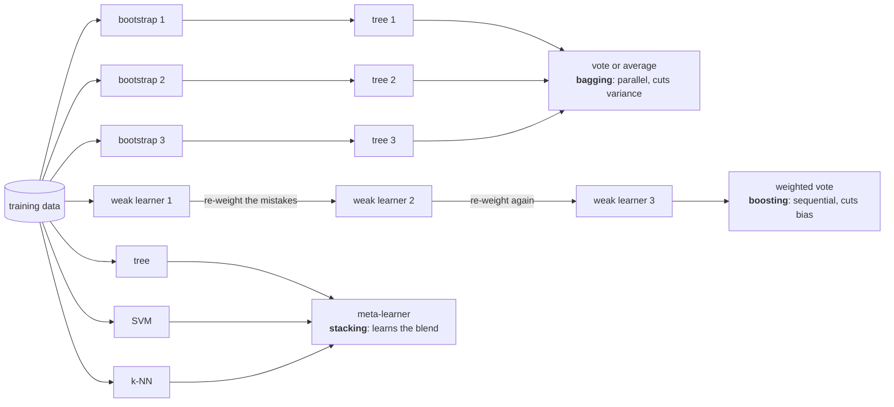

import Infographic from '@site/src/components/Infographic';
import EnsembleVoteLab from '@site/src/components/viz/EnsembleVoteLab';
import BaggingBoostingLab from '@site/src/components/viz/BaggingBoostingLab';

**In one line.** Many decent models that disagree in different places beat one excellent model, because their errors cancel instead of adding up.

## The idea in plain words

A single model is one opinion. It can be wrong in two different ways: it can be **too rigid** to capture the pattern (high bias), or **too flexible** and chase the noise in whichever sample it happened to see (high variance). An ensemble hires several opinions and combines them, and the combination can be better than any member for a simple reason: **mistakes that are not shared get outvoted.**

Picture three forecasters who each call tomorrow's weather correctly 70% of the time. If they always make the same mistakes, asking three of them is no better than asking one. If their mistakes fall on different days, then the majority is wrong only when **at least two** of them are wrong on the same day, and that is rarer than one being wrong. The lecture's number is the clean example: three independent 70% models, majority vote, **78.4%**.

Two conditions make this work, and both matter:

- **Better than chance.** In the independent majority-vote example below, a voter that is right less than half the time drags the vote the wrong way as you add more of them. Boosting asks for less: each weak learner need only beat chance on the reweighted data it is given.
- **Diverse errors.** The voters must disagree somewhere. Identical copies of one model add cost and nothing else.

Everything in this chapter is a different answer to one question: *how do I get models that are individually decent but make different mistakes?*

| Family | How diversity is created | Training | What it mainly reduces |
| --- | --- | --- | --- |
| **Bagging** (and random forests) | each model sees a different bootstrap resample of the rows | in parallel, independently | variance |
| **Boosting** (AdaBoost) | each model is told to concentrate on what the previous ones got wrong | one after another | bias, typically |
| **Stacking** | the models are of different kinds (tree, SVM, k-NN) and a meta-learner learns how to weight them | base models first, then the blender | a bit of both, by exploiting different strengths |

The deeper link is the bias-variance trade-off from the earlier chapters. A deep tree has low bias and high variance: fit it on two different samples and you get two quite different trees. Averaging many such trees leaves the bias alone and shrinks the variance. A decision stump (one split) has the opposite problem: stable but too simple. Boosting stacks many of them so that each one repairs the previous residue, and the bias falls. Knowing which problem you have tells you which family to reach for.



<Infographic src="/img/ml/ensemble-learning-vote.svg" alt="Three independent 70 percent classifiers vote and reach 78.4 percent; a table shows accuracy rising with the number of voters and falling as their errors become correlated." caption="Why a vote helps, and why it stops helping when the voters share their mistakes. Every figure is printed by the vote block in the code section." />

<Infographic src="/img/ml/ensemble-learning-families.svg" alt="Three columns compare bagging (parallel, cuts variance), boosting (sequential, cuts bias) and stacking (a meta-learner blends different models), each with a number from the chapter code." caption="The three ways to build an ensemble, side by side, with the numbers the code section reproduces." />

## How it works

### Wisdom of the crowd

If base models beat chance and make **independent** errors, a majority vote is far more reliable than any one.

#### Majority-vote accuracy

This is the vote calculator lab in the code section below: set each model's accuracy and the number of voters and read off the ensemble accuracy.

:::tip

**Worked.** 3 independent 70% models: P(≥2 right) = 3·0.7²·0.3 + 0.7³ = 0.441 + 0.343 = **0.784**.

:::

### Bagging vs Boosting

- **Bagging (parallel)**: Train each model on a **bootstrap resample**; average/vote. Cuts **variance**. **Random Forest** = bagged trees + random feature subsets to decorrelate them.
- **Boosting (sequential)**: Each model focuses on the previous one's mistakes. With the usual weak learners (stumps and shallow trees) it cuts **bias**; it can also overfit noisy labels. **AdaBoost** up-weights misclassified points and weights each learner by α.

:::tip

**AdaBoost step.** Weighted error ε=0.3 → α = ½·ln(0.7/0.3) = **0.42**. Misclassified weights ×e^α≈1.53, correct ×e^−α≈0.65, then renormalise.

:::

### Stacking

Train a **meta-learner** on top of several *different* base models (tree + SVM + k-NN), learning how to weight their predictions rather than using a fixed vote.

### Key takeaways

- **1 · Vote**: Diverse better-than-chance models → errors cancel (70%→78.4%).
- **2 · Bagging**: Bootstrap + aggregate; cuts variance. Random Forests.
- **3 · Boosting**: Sequential, error-focused; cuts bias. AdaBoost α.

:::note

**The thread.** Ensembles combine diverse, better-than-chance models so their independent errors cancel. Bagging (and Random Forests) resample to reduce variance; boosting (AdaBoost) trains sequentially on the hard cases to reduce bias; stacking learns a meta-model to blend different learners.

:::

## A real system that works this way

**The Netflix Prize** is the textbook case of both the power and the price of ensembling. The grand-prize solution blended hundreds of predictive models, which is stacking and averaging at scale. Netflix's own account of the outcome says two things. Two of the strongest algorithms from the earlier progress prizes, a matrix factorisation and a restricted Boltzmann machine, were adapted and put into production, where a linear blend of them cut the error on the competition data from 0.8914 and 0.8990 to 0.88. The final grand-prize ensemble was evaluated offline, but its extra accuracy gains "did not seem to justify the engineering effort needed to bring them into a production environment". The lesson is practical rather than theoretical: a blend that wins a leaderboard by a small margin can still lose to a simpler model once you count serving cost, maintenance and the next change in the business.

The everyday version of the same pattern is the **random forest**, a common default for tabular problems: hundreds of trees, each trained on a different resample, voting. It is popular precisely because it needs almost no tuning to be useful, and you can read an honest out-of-bag error from it without holding any data back.

## Code you can run

:::note Beyond the lecture
The lecture gives the vote arithmetic and the AdaBoost update by hand. Everything below reproduces those figures in code, then goes one step further than the lecture: it measures the variance that bagging removes, shows why random forests restrict features, and runs the same ten points through both bagging and boosting so you can see which family fixes which problem.
:::

#### 1. The vote, and what correlation does to it

The lecture's 78.4% is a binomial tail. The function below also adds a correlation knob: with probability `rho` every voter copies a single shared draw, otherwise they are independent. That is a deliberately simple model of "the voters share their mistakes".

```python
import numpy as np
from scipy.stats import binom

def vote_accuracy(p, n, rho=0.0):
    need = n // 2 + 1
    independent = binom.sf(need - 1, n, p)
    return rho * p + (1 - rho) * independent

print("lecture figure, by hand :", round(3 * 0.7**2 * 0.3 + 0.7**3, 3))
print("lecture figure, binomial:", round(float(vote_accuracy(0.7, 3)), 3))

rng = np.random.default_rng(0)
votes = rng.random((200_000, 3)) < 0.7
print("lecture figure, simulated:", round(float((votes.sum(axis=1) >= 2).mean()), 3))

print("\nvoters   independent   rho=0.25   rho=0.50   rho=1.00")
for n in (1, 3, 5, 11, 25, 101):
    row = [float(vote_accuracy(0.7, n, rho)) for rho in (0, 0.25, 0.5, 1.0)]
    print(f"{n:6d}   " + "   ".join(f"{a:8.3f}" for a in row))

print("\nvoters worse than chance (p = 0.45):")
print([round(float(vote_accuracy(0.45, n)), 3) for n in (1, 3, 11, 101)])
```

Read the table across: with fully shared mistakes (`rho=1.00`) a hundred voters are exactly as good as one. Read the last line: if each voter is *worse* than a coin flip, adding voters makes the ensemble **worse**, which is why "better than chance" is a requirement and not a politeness.

The lab below is the lecture's majority-vote widget, with the correlation knob added. Its defaults are `p = 0.70`, three voters, no correlation, and it shows the same 0.784 the code prints.

<EnsembleVoteLab />

#### 2. Bagging: bootstrap, out-of-bag error, and the variance it removes

A bootstrap resample draws `n` rows **with replacement**. Any one row is missed with probability $(1 - 1/n)^n$, which tends to $e^{-1} \approx 0.368$, so each tree sees about 63.2% of the distinct rows and the other 36.8% are its **out-of-bag** rows: a free validation set for that tree.

```python
import numpy as np
from sklearn.datasets import make_moons
from sklearn.ensemble import BaggingClassifier
from sklearn.model_selection import train_test_split
from sklearn.tree import DecisionTreeClassifier

rng = np.random.default_rng(1)
n = 1000
unique_share = np.mean([len(np.unique(rng.integers(0, n, n))) / n for _ in range(200)])
print(f"distinct rows in a bootstrap: {unique_share:.3f}   out-of-bag: {1 - unique_share:.3f}")

X, y = make_moons(n_samples=600, noise=0.35, random_state=0)
Xtr, Xte, ytr, yte = train_test_split(X, y, test_size=0.3, random_state=0, stratify=y)

tree = DecisionTreeClassifier(random_state=0).fit(Xtr, ytr)
print(f"\none deep tree   train {tree.score(Xtr, ytr):.3f}   test {tree.score(Xte, yte):.3f}")
print("\ntrees   test accuracy   out-of-bag accuracy")
for n_trees in (25, 100, 300):
    bag = BaggingClassifier(DecisionTreeClassifier(), n_estimators=n_trees,
                            oob_score=True, random_state=0).fit(Xtr, ytr)
    print(f"{n_trees:5d}   {bag.score(Xte, yte):13.3f}   {bag.oob_score_:18.3f}")

grid = np.random.default_rng(5).uniform(-1.5, 2.5, (400, 2))
single, bagged = [], []
for seed in range(30):
    Xs, ys = make_moons(n_samples=300, noise=0.35, random_state=100 + seed)
    single.append(DecisionTreeClassifier(random_state=0).fit(Xs, ys).predict_proba(grid)[:, 1])
    bagged.append(BaggingClassifier(DecisionTreeClassifier(), n_estimators=25,
                                    random_state=0).fit(Xs, ys).predict_proba(grid)[:, 1])
print("\nprediction variance across 30 fresh training sets")
print("  single tree :", round(float(np.var(single, axis=0).mean()), 4))
print("  bagged trees:", round(float(np.var(bagged, axis=0).mean()), 4))
```

The last two lines are the claim "bagging cuts variance" turned into a number: the same kind of tree, retrained on 30 different samples, disagrees with itself nearly four times less once it is bagged. The out-of-bag score is a fair estimate here (0.86 against a test score of 0.82 on this one 180-row split is noisy but the right neighbourhood), and it costs no extra data.

#### 3. Random forests: bagging plus random feature subsets

Bagged trees are still similar to each other, because every tree sees the same strong features and splits on them first. A random forest also lets each split consider only a random subset of the features, which forces the trees apart. The code measures the effect directly: the average correlation between the individual trees' predicted probabilities.

```python
import numpy as np
from sklearn.datasets import load_breast_cancer
from sklearn.ensemble import RandomForestClassifier
from sklearn.model_selection import train_test_split

X, y = load_breast_cancer(return_X_y=True)
Xa, Xb, ya, yb = train_test_split(X, y, test_size=0.3, random_state=0, stratify=y)

def mean_tree_correlation(forest):
    probs = np.array([t.predict_proba(Xb)[:, 1] for t in forest.estimators_])
    corr = np.corrcoef(probs)
    return corr[np.triu_indices_from(corr, k=1)].mean()

bagged_trees = RandomForestClassifier(n_estimators=100, max_features=None, random_state=0).fit(Xa, ya)
forest = RandomForestClassifier(n_estimators=100, max_features="sqrt", random_state=0).fit(Xa, ya)

print("                        test accuracy   mean correlation between trees")
print(f"bagging, all features   {bagged_trees.score(Xb, yb):13.3f}   {mean_tree_correlation(bagged_trees):.3f}")
print(f"random forest, sqrt     {forest.score(Xb, yb):13.3f}   {mean_tree_correlation(forest):.3f}")
```

The correlation falls (0.826 to 0.794) and the accuracy rises on this split. Treat the accuracy gap as one draw: 171 test rows can move by a handful of rows between splits. The correlation drop is the structural effect.

#### 4. AdaBoost by hand: the lecture's alpha

The lecture's worked step is a weak learner with weighted error $\varepsilon = 0.3$. Its voting weight is $\alpha = \tfrac12 \ln\frac{1-\varepsilon}{\varepsilon}$, misclassified points are multiplied by $e^{\alpha}$, correct ones by $e^{-\alpha}$, and the weights are renormalised. The ten points below are built so that the very first stump has exactly that error.

```python
import math
import numpy as np

x = np.arange(1, 11, dtype=float)
y = np.array([1, 1, 1, -1, -1, -1, 1, 1, 1, -1])

def best_stump(w):
    best = None
    for threshold in np.arange(0.5, 10.6, 1.0):
        for side in (1, -1):
            pred = np.where(x > threshold, side, -side)
            err = w[pred != y].sum()
            if best is None or err < best[0] - 1e-12:
                best = (err, threshold, side)
    return best

eps = 0.3
alpha = 0.5 * math.log((1 - eps) / eps)
print(f"lecture check: eps={eps} -> alpha={alpha:.2f}, misclassified x{math.exp(alpha):.2f}, correct x{math.exp(-alpha):.2f}\n")

w = np.full(10, 0.1)
ensemble = []
print("round  stump rule                error   alpha   ensemble accuracy")
for r in range(1, 4):
    err, threshold, side = best_stump(w)
    alpha = 0.5 * math.log((1 - err) / err)
    pred = np.where(x > threshold, side, -side)
    w = w * np.exp(-alpha * y * pred)
    w = w / w.sum()
    ensemble.append((alpha, threshold, side))
    score = sum(a * np.where(x > t, s, -s) for a, t, s in ensemble)
    rule = f"x > {threshold:.1f} gives {side:+d}, else {-side:+d}"
    print(f"{r:5d}  {rule:24s}  {err:.3f}  {alpha:.3f}   {(np.sign(score) == y).mean():.0%}")
    print("       weights:", np.round(w, 3))
```

Round 1 reproduces the lecture exactly: error 0.300, $\alpha = 0.424$ (the lecture rounds to 0.42), and after renormalising the three misclassified points carry 0.167 each, which is half of all the weight between them. Two stumps tie at error 0.3 in round 1 (`x > 3.5` and `x > 9.5`); the search takes the first it meets. Three rounds of stumps reach 100%, although no single stump can: that is bias falling.

The lab replays this table one round at a time. Switch it to bagging to run the next block's seven resamples through the same stump search.

<BaggingBoostingLab />

#### 5. The same ten points, bagged

If the problem is bias, averaging cannot fix it. Seven stumps, each trained on a bootstrap resample of the same ten points, all share the stump's inability to draw a shape with two boundaries.

```python
import numpy as np

x = np.arange(1, 11, dtype=float)
y = np.array([1, 1, 1, -1, -1, -1, 1, 1, 1, -1])

def best_stump(w):
    best = None
    for threshold in np.arange(0.5, 10.6, 1.0):
        for side in (1, -1):
            pred = np.where(x > threshold, side, -side)
            err = w[pred != y].sum()
            if best is None or err < best[0] - 1e-12:
                best = (err, threshold, side)
    return best

resamples = np.random.default_rng(1).integers(0, 10, (7, 10))
tally = np.zeros(10)
for i, row in enumerate(resamples, start=1):
    weights = np.bincount(row, minlength=10) / 10
    err, threshold, side = best_stump(weights)
    tally += np.where(x > threshold, side, -side)
    print(f"stump {i}: distinct points {len(set(row))}  rule x > {threshold:.1f} gives {side:+d}  "
          f"running vote accuracy {(np.sign(tally) == y).mean():.0%}")
print("\nbagged stumps, final accuracy:", f"{(np.sign(tally) == y).mean():.0%}")
print("three AdaBoost rounds         : 100%")
```

Bagging seven stumps stays at 70%, where three boosting rounds reach 100%. This is a toy, and a different seed can land elsewhere, but it shows the division of labour: bagging is the tool for unstable, flexible models; boosting is the tool for stable, too-simple ones.

#### 6. scikit-learn's AdaBoost on noisy data

```python
from sklearn.datasets import make_moons
from sklearn.ensemble import AdaBoostClassifier
from sklearn.model_selection import train_test_split
from sklearn.tree import DecisionTreeClassifier

X, y = make_moons(n_samples=600, noise=0.35, random_state=0)
Xtr, Xte, ytr, yte = train_test_split(X, y, test_size=0.3, random_state=0, stratify=y)

stump = DecisionTreeClassifier(max_depth=1, random_state=0).fit(Xtr, ytr)
print(f"single stump           train {stump.score(Xtr, ytr):.3f}   test {stump.score(Xte, yte):.3f}")
for n in (10, 50, 200):
    ada = AdaBoostClassifier(estimator=DecisionTreeClassifier(max_depth=1),
                             n_estimators=n, random_state=0).fit(Xtr, ytr)
    print(f"AdaBoost, {n:3d} stumps    train {ada.score(Xtr, ytr):.3f}   test {ada.score(Xte, yte):.3f}")
```

Training accuracy climbs from 0.79 for one stump to 0.89, 0.92 and 0.92 as the stumps accumulate, which is the bias falling. Test accuracy goes from 0.71 for one stump to 0.82, 0.81 and 0.81: once the easy gains are taken, boosting starts fitting the noise in the 0.35-noise moons. Boosting keeps pushing weight onto hard points, and with label noise some of those points are simply wrong, which is the usual reason it needs early stopping or a small step size.

#### 7. Voting and stacking on real data

Hard voting counts class votes. Stacking trains a meta-learner on the base models' **out-of-fold** predictions, so the blender never sees a prediction a model made on its own training row. Both are compared to each member under repeated cross-validation.

```python
import numpy as np
from sklearn.datasets import load_breast_cancer
from sklearn.ensemble import RandomForestClassifier, StackingClassifier, VotingClassifier
from sklearn.linear_model import LogisticRegression
from sklearn.model_selection import RepeatedStratifiedKFold, cross_val_score
from sklearn.neighbors import KNeighborsClassifier
from sklearn.pipeline import make_pipeline
from sklearn.preprocessing import StandardScaler
from sklearn.svm import SVC

X, y = load_breast_cancer(return_X_y=True)
cv = RepeatedStratifiedKFold(n_splits=5, n_repeats=2, random_state=0)

members = [
    ("logistic", make_pipeline(StandardScaler(), LogisticRegression(max_iter=2000))),
    ("svm", make_pipeline(StandardScaler(), SVC(random_state=0))),
    ("knn", make_pipeline(StandardScaler(), KNeighborsClassifier(n_neighbors=15))),
    ("forest", RandomForestClassifier(n_estimators=100, random_state=0)),
]

print("model             mean CV accuracy")
for name, model in members:
    print(f"{name:16s}  {cross_val_score(model, X, y, cv=cv).mean():.4f}")

vote = VotingClassifier(members, voting="hard")
stack = StackingClassifier(members, final_estimator=LogisticRegression(max_iter=2000), cv=5)
print(f"{'hard vote':16s}  {cross_val_score(vote, X, y, cv=cv).mean():.4f}")
print(f"{'stacking':16s}  {cross_val_score(stack, X, y, cv=cv).mean():.4f}")

stack.fit(X, y)
weights = stack.final_estimator_.coef_[0]
print("\nmeta-learner weights:", {n: round(float(w), 2) for (n, _), w in zip(members, weights)})
```

Be honest about the size of the win: the hard vote (0.9780) edges the best single member (0.9754), and stacking (0.9763) lands between them. On 569 rows those differences are a row or two. The members here are already strong and fairly similar, so there is little diversity left to harvest. Ensembles pay off most when members are individually weak but different, or when one model's blind spot is another's strength.

## Designing with it

**Choosing a family**

| Your problem | Reach for | Why |
| --- | --- | --- |
| One flexible model (deep tree) is unstable between samples | Bagging or a random forest | Averages away variance; needs almost no tuning |
| The model is stable but too simple (stumps, shallow trees) | Boosting | Each round repairs what is still wrong; bias falls |
| You have several good, different model types already | Voting, then stacking | Cheap to try; stacking needs out-of-fold predictions |
| Labels are noisy | Bagging first; boosting with early stopping | Boosting concentrates on hard points, and noisy labels are hard points |
| You need an honest error estimate without a hold-out set | Random forest with `oob_score=True` | Out-of-bag rows are a built-in validation set |
| Latency or memory is tight | One model, or a small forest | Every member is a model you must store, serve and monitor |

**Rules of thumb that hold up**

- **Check diversity before adding members.** Compute the correlation of the members' errors. If it is near 1, the extra model is dead weight.
- **Weak and diverse beats strong and identical.** Mixing model families (linear, tree, distance-based) creates diversity that mixing seeds of one family cannot.
- **Stack with out-of-fold predictions.** Training the meta-learner on predictions made on the base models' own training rows leaks the label and inflates the score.
- **Count the full cost.** A 0.3 point gain from a ten-model blend is paid for in latency, memory, monitoring and every future retraining. The Netflix example above is this trade-off at scale.
- **Prefer soft voting when members give calibrated probabilities**, hard voting when they only give labels. Averaging probabilities keeps information that a bare vote throws away.

**Failure modes to name**

- *Copies, not crowds:* the same algorithm with different seeds on the same features gives a small gain at best.
- *Worse than chance members:* adding them makes the vote worse, as the first code block shows.
- *Leaky stacking:* a meta-learner fitted on in-sample predictions looks excellent and generalises badly.
- *Boosting on dirty labels:* the ensemble spends its capacity memorising the mistakes.

## Where this stands in 2026

:::info Industry view

- **Bagged and boosted trees are still the default for tabular data.** scikit-learn's user guide groups gradient-boosted trees, random forests, bagging, voting, stacking and AdaBoost in one ensembles chapter, which is a fair map of what practitioners actually use.
- **Boosting has largely absorbed the old AdaBoost role.** AdaBoost is the clearest way to learn the idea, but gradient boosting (next chapter) is what people run in practice.
- **Large blends win leaderboards and rarely ship.** The Netflix Prize story above is typical: the cost of serving and maintaining many models usually outweighs a small accuracy gain.
- **Ensembles of one are often enough.** A single well-tuned gradient-boosted model, or a random forest with out-of-bag error, covers most business problems without a stacking layer.

:::

## Practice questions

<details>
<summary><strong>Q1.</strong> What two conditions must base models satisfy for an ensemble to help?</summary>

They must be better than chance and make diverse (independent) errors. Identical models give no benefit.<br /><em>Module 9 · conceptual</em>

</details>

<details>
<summary><strong>Q2.</strong> Three independent 70%-accurate classifiers vote. What is the ensemble accuracy?</summary>

P(≥2 of 3) = 3·0.7²·0.3 + 0.7³ = 0.441 + 0.343 = 0.784 (78.4%).<br /><em>Module 9 · numeric</em>

</details>

<details>
<summary><strong>Q3.</strong> What is bagging, and what error does it mainly reduce?</summary>

Train each model on a bootstrap resample and aggregate (vote/average). It mainly reduces variance. Random Forests add random feature subsets to decorrelate trees.<br /><em>Module 9 · conceptual</em>

</details>

<details>
<summary><strong>Q4.</strong> In AdaBoost, a weak learner has weighted error ε=0.3. Compute its weight α.</summary>

α = ½·ln((1−ε)/ε) = ½·ln(0.7/0.3) = ½·ln(2.33) ≈ 0.42. Lower error → larger α.<br /><em>Module 9 · numeric</em>

</details>

<details>
<summary><strong>Q5.</strong> Contrast bagging and boosting.</summary>

Bagging = parallel, independent models, reduces **variance**. Boosting = sequential, each focuses on prior mistakes, reduces **bias** (but can overfit noise).<br /><em>Module 9 · conceptual</em>

</details>

<details>
<summary><strong>Q6.</strong> What does stacking do differently from simple voting?</summary>

It trains a meta-learner to combine several different base models' predictions, learning how to weight them rather than using a fixed majority vote.<br /><em>Module 9 · conceptual</em>

</details>

## Further reading

- [scikit-learn user guide: Ensembles](https://scikit-learn.org/stable/modules/ensemble.html): the reference for bagging, forests, boosting, voting and stacking, with the parameters used in this chapter.
- [Breiman, "Random Forests" (Machine Learning, 2001)](https://doi.org/10.1023/A:1010933404324): the paper that made bagging plus feature subsets the default.
- [Breiman, "Bagging predictors" (Machine Learning, 1996)](https://doi.org/10.1007/BF00058655): the bootstrap-and-aggregate idea in its original form.
- [Freund and Schapire, "A Decision-Theoretic Generalization of On-Line Learning and an Application to Boosting" (JCSS, 1997)](https://doi.org/10.1006/jcss.1997.1504): the AdaBoost paper.
- [An Introduction to Statistical Learning (ISLP)](https://www.statlearning.com/): the tree-based methods chapter covers bagging, forests and boosting with worked labs.
- [Netflix Technology Blog: Netflix Recommendations, Beyond the 5 Stars (Part 1)](https://netflixtechblog.com/netflix-recommendations-beyond-the-5-stars-part-1-55838468f429): Netflix's own account of what went into production and why the grand-prize ensemble did not. The page blocks automated fetching; it was read through a reader proxy on 5 October 2026.
- Built from the course lecture "ml-m9-ensemble" (Lecture Library series).

- **[An Introduction to Statistical Learning](https://www.statlearning.com/)** `book`
  James, Witten, Hastie & Tibshirani: The friendliest rigorous intro to ML: free PDF plus R/Python labs.
- **[Stanford CS229 (Machine Learning)](https://cs229.stanford.edu/)** `course`
  Andrew Ng, Stanford: The rigorous derivations behind SVMs, GLMs, EM and learning theory.
- **[StatQuest](https://statquest.org/video-index/)** `▶ video`
  Josh Starmer: Short, wonderfully clear videos that build intuition step by step.

## Check yourself

- I can explain why three independent 70% voters reach 78.4%, and why the gain disappears when their errors are shared or when each voter is worse than chance.
- I can say what a bootstrap resample is, why about 36.8% of rows are out-of-bag, and how to use them as a free validation set.
- I can explain why bagging reduces variance but not bias, and show it with the ten-point example.
- I can explain what a random forest adds to bagging and how to check that the trees really are less correlated.
- I can compute the AdaBoost voting weight and the weight update by hand for a weighted error of 0.3.
- I can say what stacking does differently from voting and why its meta-learner needs out-of-fold predictions.
- I can decide between bagging, boosting, voting and stacking from the symptom, and say when none of them is worth the serving cost.
