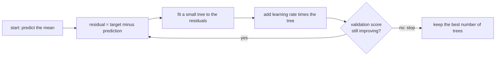

import Infographic from '@site/src/components/Infographic';
import GradientBoostingLab from '@site/src/components/viz/GradientBoostingLab';

**In one line.** Gradient boosting builds a model by repeatedly fitting a small tree to the mistakes the model still makes, and adding a deliberately small fraction of that tree, so a few knobs control how well it fits and when it stops.

:::note Not from the lecture
The ensemble lecture covers AdaBoost, the original boosting algorithm. This chapter is an **addition**: it takes the same idea to gradient boosting, the form that is used on real tabular problems, and shows it from scratch before moving to the library implementations. Every number below is printed by the code in this chapter.
:::

## The idea in plain words

AdaBoost, in the previous chapter, kept a weight on every training row and made the next learner try harder on the rows that were wrong. **Gradient boosting reaches the same goal differently: it fits the next tree to the errors themselves.**

Start with the simplest possible model, a constant: the average of the target. It is wrong almost everywhere. Compute the **residual** for every row, the amount by which the prediction misses. Fit a small tree whose job is to predict those residuals. Add the tree's output to the model, and the model is now less wrong. Compute the new residuals, fit another small tree to them, add it, and repeat.

Written down, the model after $m$ rounds is

$$F_m(x) = F_{m-1}(x) + \nu \, h_m(x)$$

where $h_m$ is the new small tree and $\nu$ (nu) is the **learning rate**, also called shrinkage. The reason for the name is a neat piece of mathematics from Friedman's 2001 paper: for squared error the residual $y - F(x)$ is exactly the negative gradient of the loss with respect to the prediction, so fitting a tree to residuals is **gradient descent in function space**. Change the loss and only the thing being fitted changes. For log loss on a binary target the residual becomes $y - p$, the true label minus the current predicted probability, and the same loop trains a classifier.

Three ideas carry nearly all of the practical behaviour.

- **Weak learners on purpose.** The trees are shallow: stumps or a few leaves. Each one only has to improve things a little. Deep trees would memorise the residuals in one round.
- **Shrinkage.** Multiplying every tree by a small $\nu$ such as 0.1 means each tree takes only a small step. It takes more trees to get to the same place, but the path is smoother and generalises better. scikit-learn's guide states the trade-off directly: a smaller learning rate needs more trees, and in practice small values tend to give better test error.
- **A stopping rule.** Add trees until a held-out score stops improving. This is **early stopping**, and it replaces guessing the number of trees.

The difference from a random forest, the other tree ensemble in the previous chapter, is the shape of the process. A forest grows deep trees **independently** and averages them, which cuts variance. Boosting grows shallow trees **in sequence**, each correcting the last, which cuts bias, and it can overfit if you let it run too long.

<Infographic src="/img/ml/gradient-boosting-in-practice-residual-loop.svg" alt="A loop: start from the mean, compute residuals, fit a small tree, add a fraction of it, repeat; with the numbers from the from-scratch code for 80 points." caption="The residual-fitting loop with the figures printed by the first code block: the starting error 0.8800, the first stump's split, and what shrinkage changes." />

<Infographic src="/img/ml/gradient-boosting-in-practice-knobs.svg" alt="Early stopping results for three learning rates and for no early stopping, showing similar AUC but very different log loss, with the main hyperparameters grouped by what they control." caption="The knobs that matter, and the early-stopping numbers printed by the second code block." />



## A real system that works this way

**XGBoost's own paper** reports how far this idea spread. In "XGBoost: A Scalable Tree Boosting System" (Chen and Guestrin, KDD 2016), the authors counted the 29 challenge-winning solutions published on Kaggle's blog during 2015 and report that 17 used XGBoost; eight of those used it alone to train the model, and most of the rest combined it with neural networks in an ensemble. For comparison, the second most popular method, deep neural networks, was used in 11. They also note that every winning team in the top 10 of KDD Cup 2015 used it, and that the winning teams reported ensembles beat a well-configured XGBoost by only a small amount.

That is a statement about 2015 competitions and the authors' own tally, not a ranking of today's tools. It is still the clearest evidence for the pattern that explains this chapter: on tabular data of moderate size, a tuned boosted-tree model is a very hard baseline to beat.

A second piece of evidence is a research benchmark. Grinsztajn, Oyallon and Varoquaux ("Why do tree-based models still outperform deep learning on tabular data?", 2022) ran an extensive comparison over 45 datasets and concluded that tree-based models remain state of the art on medium-sized tabular data, around ten thousand samples, even before counting their cheaper training. The last code block reproduces the *kind* of reasons they give, on a toy.

## Code you can run

Everything here is CPU only, seeded, and takes seconds. The environment used to write this chapter has `xgboost` 3.4.1 and `lightgbm` 4.7.0 installed but both fail to load, because the OpenMP runtime `libomp` is missing on this machine. The XGBoost and LightGBM snippets are therefore **shown and labelled as not run**, and the scikit-learn estimators that do the same job are run for real.

#### 1. Gradient boosting from scratch

Eighty noisy points from a known curve, depth-1 trees (stumps), squared error. The error is measured two ways: against the noisy training targets, and against the true curve, which is the quantity that really matters.

```python
import numpy as np
from sklearn.ensemble import GradientBoostingRegressor
from sklearn.tree import DecisionTreeRegressor

rng = np.random.default_rng(0)
x = np.sort(rng.uniform(0, 6, 80))
y = np.sin(x) + 0.5 * np.sin(3 * x) + rng.normal(0, 0.25, 80)
x, y = np.round(x, 3), np.round(y, 3)
grid = np.linspace(0, 6, 200)
truth = np.sin(grid) + 0.5 * np.sin(3 * grid)

def fit_boosting(rounds, learning_rate):
    start = y.mean()
    pred = np.full(len(y), start)
    stumps = []
    for _ in range(rounds):
        residual = y - pred
        stump = DecisionTreeRegressor(max_depth=1).fit(x[:, None], residual)
        pred = pred + learning_rate * stump.predict(x[:, None])
        stumps.append(stump)
    return start, stumps

def predict(model, learning_rate, points):
    start, stumps = model
    out = np.full(len(points), start)
    for stump in stumps:
        out = out + learning_rate * stump.predict(points[:, None])
    return out

start, stumps = fit_boosting(1, 1.0)
first = stumps[0]
print(f"start value (mean of y): {start:.4f}")
print(f"first stump splits at x = {first.tree_.threshold[0]:.3f}, "
      f"adds {first.tree_.value[1][0][0]:+.3f} on the left and {first.tree_.value[2][0][0]:+.3f} on the right")
print(f"RMSE before any tree: {np.sqrt(np.mean((y - start) ** 2)):.4f}")

print("\nlearning rate  rounds   train RMSE   RMSE against the true curve")
for learning_rate in (1.0, 0.1):
    for rounds in (1, 5, 20, 100, 300):
        model = fit_boosting(rounds, learning_rate)
        train = np.sqrt(np.mean((y - predict(model, learning_rate, x)) ** 2))
        vs_truth = np.sqrt(np.mean((truth - predict(model, learning_rate, grid)) ** 2))
        print(f"{learning_rate:13.1f}  {rounds:6d}   {train:10.4f}   {vs_truth:10.4f}")

ours = predict(fit_boosting(100, 0.1), 0.1, grid)
library = GradientBoostingRegressor(n_estimators=100, learning_rate=0.1, max_depth=1,
                                    random_state=0).fit(x[:, None], y).predict(grid[:, None])
print("\nlargest difference from GradientBoostingRegressor:", f"{np.abs(ours - library).max():.1e}")
```

Read it in three steps. Before any tree the error is 0.8800, the spread of the data. The first stump splits at 3.345, adds 0.764 to the left half and subtracts 0.845 from the right, and with a full step (`learning_rate=1.0`) the training error drops to 0.3593 in one round.

Then compare the two learning rates. With full steps the training error keeps falling, to 0.1154 after 300 rounds, but the error against the true curve **turns around** after about 100 rounds (0.1672, then 0.1942): the model has started fitting noise. With a step of 0.1 the training error is much higher at every point, yet the error against the truth keeps improving, reaching 0.1402 at 300 rounds. Shrinkage is the brake.

The last line is the check that matters: the hand-written loop agrees with scikit-learn's `GradientBoostingRegressor` to rounding error (2.2e-16). There is no hidden magic in the library for this case.

The lab replays the same 80 points. Its defaults are 100 rounds at a learning rate of 0.1, which gives the training RMSE 0.2687 and the error against the truth 0.1778 printed above. Try a rate of 1.0 and drag the rounds to 300 to see the turnaround.

<GradientBoostingLab />

#### 2. Early stopping in `HistGradientBoostingClassifier`

scikit-learn's `HistGradientBoostingClassifier` is its fast, histogram-based gradient boosting. It bins every feature into at most 255 buckets, which is what makes it quick on large tables. Early stopping holds back part of the training data as a validation set and stops when the validation loss has not improved for `n_iter_no_change` rounds. By default it switches on automatically only above 10,000 rows, so on smaller tables you ask for it explicitly.

```python
from sklearn.datasets import make_classification
from sklearn.ensemble import HistGradientBoostingClassifier
from sklearn.metrics import log_loss, roc_auc_score
from sklearn.model_selection import train_test_split

X, y = make_classification(n_samples=8000, n_features=20, n_informative=8, n_redundant=4,
                           flip_y=0.05, class_sep=0.9, random_state=0)
Xtr, Xte, ytr, yte = train_test_split(X, y, test_size=0.25, random_state=0, stratify=y)

def report(label, model):
    p = model.predict_proba(Xte)[:, 1]
    print(f"{label:34s} trees {model.n_iter_:4d}   AUC {roc_auc_score(yte, p):.4f}   log loss {log_loss(yte, p):.4f}")

for lr in (0.3, 0.1, 0.03):
    model = HistGradientBoostingClassifier(learning_rate=lr, max_iter=2000, early_stopping=True,
                                           validation_fraction=0.15, n_iter_no_change=20,
                                           random_state=0).fit(Xtr, ytr)
    report(f"early stopping, learning rate {lr}", model)

fixed = HistGradientBoostingClassifier(learning_rate=0.1, max_iter=600, early_stopping=False,
                                       random_state=0).fit(Xtr, ytr)
report("no early stopping, 600 trees", fixed)
```

Two lessons. First, the number of trees is an output, not an input: the same data stops at 37, 99 or 282 trees depending on the step size, and the scores are close. Second, look at the last row. Running 600 trees without early stopping keeps the **ranking** quality (AUC 0.9787, even marginally higher) but nearly doubles the log loss, from 0.1521 to 0.2977. The model has become overconfident: its probabilities are too extreme even though its ordering is fine. If anything downstream uses the probability, as a threshold or as an expected cost, AUC alone will not warn you.

#### 3. Which hyperparameters matter

Same data, same early-stopping setup, one knob changed at a time. The values in the table are the library's own parameter names.

```python
from sklearn.datasets import make_classification
from sklearn.ensemble import HistGradientBoostingClassifier
from sklearn.metrics import log_loss, roc_auc_score
from sklearn.model_selection import train_test_split

X, y = make_classification(n_samples=8000, n_features=20, n_informative=8, n_redundant=4,
                           flip_y=0.05, class_sep=0.9, random_state=0)
Xtr, Xte, ytr, yte = train_test_split(X, y, test_size=0.25, random_state=0, stratify=y)

settings = {
    "max_leaf_nodes=4": dict(max_leaf_nodes=4),
    "max_leaf_nodes=31 (default)": dict(max_leaf_nodes=31),
    "max_leaf_nodes=127": dict(max_leaf_nodes=127),
    "min_samples_leaf=200": dict(min_samples_leaf=200),
    "l2_regularization=10": dict(l2_regularization=10.0),
    "max_features=0.5": dict(max_features=0.5),
    "max_depth=3": dict(max_depth=3),
}
print("setting                        trees   AUC      log loss")
for name, params in settings.items():
    model = HistGradientBoostingClassifier(learning_rate=0.1, max_iter=2000, early_stopping=True,
                                           validation_fraction=0.15, n_iter_no_change=20,
                                           random_state=0, **params).fit(Xtr, ytr)
    p = model.predict_proba(Xte)[:, 1]
    print(f"{name:29s}  {model.n_iter_:5d}   {roc_auc_score(yte, p):.4f}   {log_loss(yte, p):.4f}")
```

On this dataset every setting lands within about 0.003 AUC of every other, which is itself the message: once early stopping and a reasonable learning rate are in place, the remaining knobs are second-order. The visible pattern is in the number of trees. Smaller trees (`max_leaf_nodes=4`, `max_depth=3`) need 344 and 269 trees; larger trees (127 leaves) need only 62. The default of 31 leaves with 99 trees gave the best log loss (0.1521) here, and the very small and very large trees were worse (0.1717, 0.1637). Treat that as one dataset, not a law.

#### 4. Missing values, without an imputer

Histogram gradient boosting treats `NaN` as a value of its own. At each split it learns which side the missing rows should go to. That matters when *missingness carries information*, as it often does: a missing income on a loan application is not random.

```python
import numpy as np
from sklearn.ensemble import HistGradientBoostingClassifier
from sklearn.impute import SimpleImputer
from sklearn.metrics import roc_auc_score
from sklearn.model_selection import train_test_split
from sklearn.pipeline import make_pipeline

rng = np.random.default_rng(0)
n = 6000
income = rng.lognormal(10.5, 0.5, n)
age = rng.uniform(21, 70, n)
debt = rng.uniform(0, 1, n)
logit = -2.0 + 3.0 * debt - 0.00002 * income + 0.02 * (age - 45)
default = (rng.random(n) < 1 / (1 + np.exp(-logit))).astype(int)
income_missing = rng.random(n) < np.where(default == 1, 0.5, 0.05)

X_full = np.column_stack([income, age, debt])
X = X_full.copy()
X[income_missing, 0] = np.nan

print(f"income missing for {income_missing.mean():.1%} of rows")
print(f"default rate when income is missing: {default[income_missing].mean():.1%}")
print(f"default rate when income is present: {default[~income_missing].mean():.1%}\n")

idx_train, idx_test = train_test_split(np.arange(n), test_size=0.3, random_state=0, stratify=default)

def auc(model, features):
    model.fit(features[idx_train], default[idx_train])
    return roc_auc_score(default[idx_test], model.predict_proba(features[idx_test])[:, 1])

print(f"native NaN handling            AUC {auc(HistGradientBoostingClassifier(random_state=0), X):.4f}")
print(f"median imputation              AUC {auc(make_pipeline(SimpleImputer(strategy='median'), HistGradientBoostingClassifier(random_state=0)), X):.4f}")
print(f"median + missing indicator     AUC {auc(make_pipeline(SimpleImputer(strategy='median', add_indicator=True), HistGradientBoostingClassifier(random_state=0)), X):.4f}")
print(f"no values missing (full data)  AUC {auc(HistGradientBoostingClassifier(random_state=0), X_full):.4f}")
```

In this simulation people who default are far more likely to leave income blank (76.3% default rate among blanks against 15.1% among the rest), so the blank is a strong signal. Native handling (0.8144), median imputation (0.8114) and imputation with an explicit indicator column (0.8204) all use it, within about one hundredth of each other, and all beat the model with no missing values at all (0.7103) because the full-data model cannot see the blank. Two practical conclusions: you do not need an imputer in front of a boosted tree, and if you do impute, keep a missing indicator so the signal survives. The last row is a warning about the opposite habit, filling every gap silently and then wondering why a field is "unimportant".

#### 5. Monotonic constraints

Sometimes you know the direction of a relationship: more years of tenure should never lower a predicted lifetime value. An unconstrained tree model, fitted to noisy data, will happily produce small dips. `monotonic_cst` forbids them: `1` means non-decreasing, `-1` non-increasing, `0` unconstrained.

```python
import numpy as np
from sklearn.ensemble import HistGradientBoostingRegressor

rng = np.random.default_rng(0)
n = 3000
tenure = rng.uniform(0, 10, n)
spend = rng.uniform(0, 5, n)
y = 2.0 * np.log1p(tenure) + 0.5 * spend + rng.normal(0, 1.0, n)
X = np.column_stack([tenure, spend])

free = HistGradientBoostingRegressor(random_state=0, max_iter=300, early_stopping=False).fit(X, y)
monotone = HistGradientBoostingRegressor(random_state=0, max_iter=300, early_stopping=False,
                                         monotonic_cst=[1, 1]).fit(X, y)

tenure_grid = np.linspace(0, 10, 101)
test_rng = np.random.default_rng(1)
X_test = np.column_stack([test_rng.uniform(0, 10, 5000), test_rng.uniform(0, 5, 5000)])
y_true = 2.0 * np.log1p(X_test[:, 0]) + 0.5 * X_test[:, 1]

print("model        decreasing steps along tenure   RMSE against the true curve")
for name, model in (("free", free), ("monotonic", monotone)):
    drops = total = 0
    for fixed_spend in np.linspace(0.2, 4.8, 12):
        curve = model.predict(np.column_stack([tenure_grid, np.full_like(tenure_grid, fixed_spend)]))
        drops += int((np.diff(curve) < -1e-12).sum())
        total += len(curve) - 1
    rmse = np.sqrt(np.mean((model.predict(X_test) - y_true) ** 2))
    print(f"{name:10s}   {drops:4d} of {total}                       {rmse:.4f}")
```

The free model goes the wrong way on 522 of 1,200 steps along the tenure axis; the constrained model never does. Notice that the constraint also **improved** accuracy against the truth (RMSE 0.4359 down to 0.1645), because the truth really is monotone and the constraint removes noise-fitting. If the true relationship were not monotone the constraint would hurt, so apply it only where domain knowledge is certain. In regulated settings such as credit it is often a requirement in its own right, since a model that lowers a score for higher income is hard to defend.

#### 6. XGBoost and LightGBM: shown, not run

:::warning Not run in this environment
The two snippets below were **not executed**. `xgboost` 3.4.1 and `lightgbm` 4.7.0 are installed in the chapter's environment but cannot be imported, because `libomp` (the OpenMP runtime) is missing on this machine. The parameter names were checked against the installed packages' own source, not against a run. The scikit-learn block after them *was* run.
:::

```python
from xgboost import XGBClassifier

model = XGBClassifier(
    n_estimators=2000,
    learning_rate=0.05,
    max_depth=6,
    min_child_weight=1,
    subsample=0.8,
    colsample_bytree=0.8,
    reg_lambda=1.0,
    tree_method="hist",
    early_stopping_rounds=50,
    eval_metric="logloss",
)
model.fit(Xtr, ytr, eval_set=[(Xval, yval)], verbose=False)
print(model.best_iteration)
```

```python
import lightgbm as lgb

model = lgb.LGBMClassifier(
    n_estimators=2000,
    learning_rate=0.05,
    num_leaves=31,
    min_child_samples=20,
    subsample=0.8,
    subsample_freq=1,
    colsample_bytree=0.8,
    reg_lambda=1.0,
)
model.fit(
    Xtr, ytr,
    eval_set=[(Xval, yval)],
    eval_metric="logloss",
    callbacks=[lgb.early_stopping(50), lgb.log_evaluation(0)],
)
print(model.best_iteration_)
```

The names differ between libraries, but the ideas map one to one. This is the translation table, followed by the scikit-learn run that uses the matching settings:

| Idea | scikit-learn `HistGradientBoosting*` | XGBoost | LightGBM |
| --- | --- | --- | --- |
| Step size | `learning_rate` | `learning_rate` | `learning_rate` |
| Number of trees | `max_iter` | `n_estimators` | `n_estimators` |
| Tree size | `max_leaf_nodes` (31), `max_depth` | `max_depth`, `max_leaves`, `grow_policy` | `num_leaves` (31), `max_depth` |
| Minimum evidence per leaf | `min_samples_leaf` (20) | `min_child_weight` | `min_child_samples` (20) |
| L2 penalty on leaf values | `l2_regularization` | `reg_lambda` | `reg_lambda` |
| Column subsampling | `max_features` | `colsample_bytree` | `colsample_bytree` |
| Row subsampling | none | `subsample` | `subsample` with `subsample_freq` |
| Early stopping | `early_stopping`, `n_iter_no_change` | `early_stopping_rounds` | `lgb.early_stopping(n)` callback |
| Monotonic constraints | `monotonic_cst` | `monotone_constraints` | `monotone_constraints` |

```python
from sklearn.datasets import make_classification
from sklearn.ensemble import HistGradientBoostingClassifier
from sklearn.metrics import log_loss, roc_auc_score
from sklearn.model_selection import train_test_split

X, y = make_classification(n_samples=8000, n_features=20, n_informative=8, n_redundant=4,
                           flip_y=0.05, class_sep=0.9, random_state=0)
Xtr, Xte, ytr, yte = train_test_split(X, y, test_size=0.25, random_state=0, stratify=y)

model = HistGradientBoostingClassifier(
    max_iter=2000,
    learning_rate=0.05,
    max_leaf_nodes=31,
    min_samples_leaf=20,
    l2_regularization=1.0,
    max_features=0.8,
    early_stopping=True,
    n_iter_no_change=50,
    validation_fraction=0.15,
    random_state=0,
).fit(Xtr, ytr)

p = model.predict_proba(Xte)[:, 1]
print(f"stopped at {model.n_iter_} trees   AUC {roc_auc_score(yte, p):.4f}   log loss {log_loss(yte, p):.4f}")
```

The run is the working equivalent of the two snippets above: same step size, same patience of 50 rounds, same L2 penalty and column fraction, with a validation split carved out automatically. It stops at 224 trees with AUC 0.9770 and log loss 0.1512, close to the default settings in the earlier block. It has no row subsampling, which is the one feature in the table the scikit-learn estimator lacks.

#### 7. Boosting against other models on tabular data, on a toy

The claim "boosting wins on tabular data" needs conditions. Here are two small, seeded cases that show a win and a loss, with the same split of rows used for every model.

```python
import numpy as np
from sklearn.ensemble import HistGradientBoostingClassifier
from sklearn.linear_model import LogisticRegression
from sklearn.metrics import roc_auc_score
from sklearn.neural_network import MLPClassifier
from sklearn.pipeline import make_pipeline
from sklearn.preprocessing import StandardScaler

def irregular(n, junk, seed):
    r = np.random.default_rng(seed)
    a = r.uniform(-1, 1, (n, 2))
    z = np.sin(5 * a[:, 0]) + (np.abs(a[:, 1]) > 0.5) * 1.0 - 0.5
    y = (z + r.normal(0, 0.15, n) > 0.35).astype(int)
    return np.hstack([a, r.normal(0, 1, (n, junk))]), y

def smooth(n, seed):
    r = np.random.default_rng(seed)
    X = r.normal(0, 1, (n + 4000, 10))
    w = r.normal(0, 1, 10)
    y = (X @ w + r.normal(0, 1.0, n + 4000) > 0).astype(int)
    return X, y

def models():
    return {
        "boosting": HistGradientBoostingClassifier(random_state=0),
        "logistic": make_pipeline(StandardScaler(), LogisticRegression(max_iter=1000)),
        "MLP": make_pipeline(StandardScaler(), MLPClassifier((64, 64), max_iter=400, random_state=0)),
    }

def score(X, y, n_train):
    out = {}
    for name, model in models().items():
        model.fit(X[:n_train], y[:n_train])
        out[name] = roc_auc_score(y[n_train:], model.predict_proba(X[n_train:])[:, 1])
    return out

print("scenario                                   boosting  logistic  MLP")
for junk in (0, 30):
    X, y = irregular(5500, junk, 0)
    s = score(X, y, 2800)
    print(f"irregular rule, {junk:2d} junk columns, 2800 rows   {s['boosting']:.3f}     {s['logistic']:.3f}     {s['MLP']:.3f}")
for n in (300, 3000):
    X, y = smooth(n, 0)
    s = score(X, y, n)
    print(f"smooth linear rule, {n:4d} rows                {s['boosting']:.3f}     {s['logistic']:.3f}     {s['MLP']:.3f}")
```

Read the four rows as four lessons. With an irregular, step-like rule and no junk, a small MLP matches boosting (0.981 against 0.983), and logistic regression cannot represent the rule at all. Add 30 columns of pure noise and boosting barely notices (0.982) while the MLP collapses to 0.579: trees simply never split on columns that do not help, which is the robustness-to-irrelevant-features point from the benchmark paper. But when the true rule is smooth and linear and there are few rows, a plain logistic regression beats boosting (0.969 against 0.913 at 300 rows), because a staircase of trees is an expensive way to draw a straight line. With 3,000 rows the gap narrows to 0.986 against 0.978. These are toy datasets, so use the pattern and not the digits.

## Designing with it

**A reliable default recipe**

1. Start with `HistGradientBoostingClassifier` (or `Regressor`) with early stopping on, `learning_rate` around 0.05 to 0.1 and `max_iter` large enough that stopping triggers well before it.
2. Evaluate with cross-validation or a time-aware split, and watch **log loss as well as AUC** whenever probabilities will be used.
3. Tune in this order: tree size (`max_leaf_nodes`, `min_samples_leaf`), then regularisation (`l2_regularization`, `max_features`), then lower the learning rate and let early stopping add trees.
4. Add monotonic constraints where domain knowledge is certain; leave missing values alone before trying an imputer.
5. Compare against a logistic regression or a regularised linear model first. If boosting does not clearly beat it, the simpler model wins.

**Comparing the libraries**

| | scikit-learn `HistGradientBoosting*` | XGBoost | LightGBM | CatBoost |
| --- | --- | --- | --- | --- |
| Distinct idea | histogram binning of every feature into at most 255 buckets, in the standard scikit-learn API | tree growth policy `depthwise` or `lossguide`; the paper's sparsity-aware split finding and weighted quantile sketch | histogram-based, leaf-wise (best-first) growth | ordered boosting to remove a form of target leakage, plus its own treatment of categorical features |
| Categorical features | native, via `categorical_features` | `enable_categorical`, with parameters the package marks experimental | native, by partitioning categories into two subsets without one-hot encoding | native, using target statistics computed in an order that avoids leakage |
| Missing values | native | native; the paper's sparsity-aware algorithm learns a default direction | handled natively | handled natively |
| Row subsampling | no | yes | yes | yes |
| Best fit | a clean scikit-learn pipeline with no extra dependency | the long-standing general default, huge ecosystem | very large tables where speed matters | many high-cardinality categorical columns |

Treat the "best fit" row as guidance rather than a verdict: in practice all four are competitive, and which wins depends on the dataset. The scikit-learn, XGBoost-growth, LightGBM-growth and categorical entries come from the scikit-learn user guide, the LightGBM features page, the XGBoost and CatBoost papers and the installed packages' own parameter documentation. The missing-value entries for LightGBM and CatBoost, and CatBoost's row subsampling, reflect general knowledge of those libraries and were not re-checked against their current documentation. This environment could not run XGBoost, LightGBM or CatBoost, so none of the speed or accuracy differences between them are measured here.

**When boosting beats a neural network, and when it does not**

| Boosting tends to win | A neural network or a linear model tends to win |
| --- | --- |
| Tabular data with mixed types and missing values | Images, audio, text and other raw signals, where learned representations matter |
| Many irrelevant or weakly useful columns | Very large datasets where the extra capacity is used |
| Medium-sized tables, in the thousands to hundreds of thousands of rows | A smooth, nearly linear relationship with few rows (a regularised linear model wins) |
| You need a strong model with little tuning and fast training on a CPU | You must share one model across several modalities or fine-tune a pretrained network |

**Failure modes to name**

- *Overconfident probabilities:* training without early stopping can keep AUC while doubling log loss, as the second block shows.
- *Leaky validation:* tuning on the same rows you report on. Keep a final test set the search never saw.
- *Constraints that fight the truth:* a monotonic constraint on a relationship that is not monotone loses accuracy.
- *Treating a leaderboard as production:* a ten-model blend is rarely worth its serving cost; one well-tuned boosted model usually is.

## Where this stands in 2026

:::info Industry view

- **Gradient-boosted trees remain the default for tabular prediction.** The 2022 benchmark paper above is the clearest published evidence for medium-sized data, and the libraries below are all still under active development.
- **The libraries are actively maintained.** PyPI lists scikit-learn 1.9.1 (September 2026), XGBoost 3.4.1 (August 2026), LightGBM 4.7.0 (July 2026) and CatBoost 1.2.10 (February 2026) as the latest releases at the time of writing.
- **scikit-learn's histogram implementation is a serious option.** It has native missing values, categorical support, monotonic and interaction constraints and early stopping, with no extra dependency to install.
- **OpenMP is the usual installation snag.** On macOS, XGBoost and LightGBM need the `libomp` runtime; its absence is exactly why the two snippets in this chapter are labelled as not run.
- **Constraints and calibration are the production concerns.** Monotonic constraints for defensibility, and calibrated probabilities for decisions, matter more in deployment than another point of AUC.

:::

## Practice questions

<details>
<summary><strong>Q1.</strong> Explain in your own words why fitting a tree to the residuals of a squared-error model is gradient descent.</summary>

For squared error the loss is $\tfrac12 (y - F)^2$ and its derivative with respect to the prediction $F$ is $-(y - F)$, so the residual is the negative gradient. Each round fits a tree to that direction of steepest descent in function space and adds a small step along it, exactly like a parameter update $\theta \leftarrow \theta - \eta \nabla L$, except the "parameter" is the whole prediction function.<br /><em>Authored · conceptual</em>

</details>

<details>
<summary><strong>Q2.</strong> In the from-scratch block, a learning rate of 1.0 reaches a lower training error than 0.1 at 300 rounds but a worse error against the true curve. Why, and what would you do in practice?</summary>

Full steps let the ensemble chase the noise in the 80 training targets (training RMSE 0.1154, but 0.1942 against the truth). A step of 0.1 follows the signal more slowly and more smoothly (training RMSE 0.2078, truth 0.1402). In practice you would lower the learning rate and let early stopping on a validation set choose the number of trees.<br /><em>Authored · interpretation</em>

</details>

<details>
<summary><strong>Q3.</strong> A model trained for 600 trees without early stopping has an AUC no worse than the early-stopped one but a much higher log loss. What happened, and when does it matter?</summary>

The model's ranking of cases is intact, but its probabilities have become too extreme: it is overconfident. It matters whenever the probability itself is used, for example a decision threshold set from a cost, an expected-value calculation, or a risk score shown to a person. AUC measures only ordering, so it cannot reveal this.<br /><em>Authored · interpretation</em>

</details>

<details>
<summary><strong>Q4.</strong> A credit model must never lower a score when income rises. How do you enforce this in scikit-learn, and what is the risk?</summary>

Set `monotonic_cst` with `1` for income and `0` for the other features. The model then produces a non-decreasing response in income. The risk is bias: if the true relationship is not monotone the constraint forces a worse fit, so use it only where the direction is certain.<br /><em>Authored · applied</em>

</details>

<details>
<summary><strong>Q5.</strong> Give two situations where you would prefer a logistic regression or a neural network to gradient boosting on a table.</summary>

A smooth, nearly linear relationship with few rows (a regularised linear model is simpler and, in the toy above, better), and inputs that are not really tabular, such as images or text, where a learned representation does the work. A very large dataset where the extra model capacity pays for itself is a third.<br /><em>Authored · applied</em>

</details>

## Further reading

- [scikit-learn user guide: Ensembles, gradient-boosted trees](https://scikit-learn.org/stable/modules/ensemble.html): histogram gradient boosting, early stopping, missing values, categorical support and monotonic constraints.
- [Friedman, "Greedy Function Approximation: A Gradient Boosting Machine" (Annals of Statistics, 2001)](https://doi.org/10.1214/aos/1013203451): the paper that frames boosting as gradient descent in function space.
- [Chen and Guestrin, "XGBoost: A Scalable Tree Boosting System" (KDD 2016)](https://arxiv.org/abs/1603.02754): the system, its sparsity-aware algorithm and the 2015 Kaggle tally quoted above.
- [XGBoost documentation](https://xgboost.readthedocs.io/en/stable/): parameters, tree methods and categorical data.
- [LightGBM features](https://lightgbm.readthedocs.io/en/stable/Features.html): leaf-wise growth, histograms and categorical splits.
- [Prokhorenkova et al., "CatBoost: unbiased boosting with categorical features"](https://arxiv.org/abs/1706.09516): ordered boosting and the categorical-feature method.
- [Grinsztajn, Oyallon and Varoquaux, "Why do tree-based models still outperform deep learning on tabular data?"](https://arxiv.org/abs/2207.08815): the benchmark behind the comparison above.
- [An Introduction to Statistical Learning (ISLP)](https://www.statlearning.com/): the boosting section of the tree-based methods chapter.

## Check yourself

- I can explain why a residual is the negative gradient of squared error, and what changes for log loss.
- I can write the residual-fitting loop with shrinkage from scratch and check it against `GradientBoostingRegressor`.
- I can explain what the learning rate and the number of trees trade off, and why early stopping replaces choosing the number of trees.
- I can explain why a model without early stopping can keep its AUC and still produce worse probabilities.
- I can name the hyperparameters that control tree size, regularisation and sampling, and translate them between scikit-learn, XGBoost and LightGBM.
- I can use native missing-value handling and decide whether an indicator column is worth adding.
- I can apply a monotonic constraint and say when it helps and when it hurts.
- I can say when gradient boosting beats a neural network on tabular data and when a linear model beats it.
