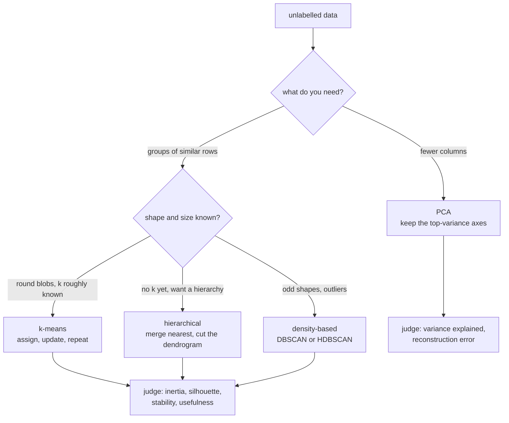

import Infographic from '@site/src/components/Infographic';
import KMeansLab from '@site/src/components/viz/KMeansLab';
import PcaLab from '@site/src/components/viz/PcaLab';

**In one line.** With no labels to check against, you can still find structure by grouping similar points or by describing the data with fewer axes, and you judge the result by fit and usefulness instead of accuracy.

## The idea in plain words

Everything so far in this subject had an answer key. A classifier is scored against known labels; a regressor against known values. **Unsupervised learning removes the key.** You hand the algorithm a table of features and ask what shape the data has. There are two classic questions.

- **Which rows belong together?** That is **clustering**: customers who behave alike, documents about the same topic, sensor readings from the same operating regime.
- **Can the columns be described more cheaply?** That is **dimensionality reduction**: find a few new axes that carry most of the variation so that fifty correlated measurements become three numbers.

The absence of labels changes how you work in three ways:

| | Supervised | Unsupervised |
| --- | --- | --- |
| What you give it | features and a target | features only |
| How you know it worked | accuracy, error, AUC on held-out labels | fit measures (inertia, silhouette, variance explained) and whether the result is **useful** |
| Typical risk | overfitting the labels | finding structure that is real in the numbers but meaningless for the business |

That last risk deserves a pause. Clustering will always return clusters, even on pure noise, and PCA will always return components. Neither tells you the structure matters. The checks that count are practical: do the groups have different profiles, are they stable when you resample, and can someone act on them?

Distance is the foundation of both methods, so **feature scale is part of the model**. A column measured in thousands drowns a column measured in fractions. The wine example in the code section shows a single feature taking 99.8% of a PCA, and the clusters it produces being much worse, until the data is standardised.



<Infographic src="/img/ml/unsupervised-learning-kmeans.svg" alt="The lecture's seven numbers are split into two clusters by alternating assignment and centroid update; the centroids settle at 3.5 and 11 with a within-cluster sum of squares of 7." caption="k-means on the lecture's seven points: assign, update, repeat. The printed trace in the code section matches every number on the board." />

<Infographic src="/img/ml/unsupervised-learning-choosing-k.svg" alt="An elbow curve of within-cluster sum of squares for k from 1 to 8 with a knee at 3, beside a small dendrogram that is cut to give two clusters." caption="Two ways to answer how many clusters: the elbow of an inertia curve, and the height at which a dendrogram is cut." />

<Infographic src="/img/ml/unsupervised-learning-pca.svg" alt="Four eigenvalues 6.2, 2.4, 1.0 and 0.4 become 62, 24, 10 and 4 percent of the variance, with the first two components keeping 86 percent; a second panel shows wine variance dominated by one unscaled feature." caption="PCA keeps the high-variance directions. The same arithmetic as the lecture, then the scaling trap on a real dataset." />

## How it works

### Learning without labels

Unsupervised learning discovers **groupings** (clustering) or a **lower-dimensional description** (dimensionality reduction): with no labels to check against.

### k-means clustering

Repeat until stable: **assign** each point to the nearest centroid, then **update** each centroid to its points' mean.

#### k-means, step by step (1-D)

Data \{2,4,10,12,3,11,5\}, k=2, centroids start at 2 and 10. The k-means lab in the code section steps through exactly this.

:::tip

**Result.** Converges to clusters \{2,3,4,5\} (centroid 3.5) and \{10,11,12\} (centroid 11).

:::

### Choosing k & hierarchical clustering

- **Elbow method**: Plot WCSS vs k; it always falls but flattens at a "knee", a good k. (Silhouette score is another.)
- **Hierarchical**: Start with singletons, repeatedly merge the two nearest clusters → a **dendrogram**. Cut it at any height for that many clusters; no k needed up front.

### Principal Component Analysis

Find new axes (**principal components**) of maximum variance, the eigenvectors of the covariance matrix, and keep the top few.

:::tip

**Worked.** Eigenvalues 6.2, 2.4, 1.0, 0.4 (total 10): PC1 = 62%, PC1+PC2 = **86%**. So 2 components retain 86% of the variance, a 4→2 reduction with little loss.

:::

### Key takeaways

- **1 · Clustering**: k-means assign/update; elbow for k; hierarchical dendrograms.
- **2 · PCA**: Top-variance eigenvectors; keep the components that matter.
- **3 · No labels**: Judge by fit (WCSS, variance explained), not accuracy.

:::note

**The thread.** Unsupervised learning finds structure in unlabelled data. k-means alternates nearest-centroid assignment and mean-centroid updates until convergence; the elbow of WCSS picks k; hierarchical clustering builds a dendrogram; and PCA projects onto the highest-variance eigenvectors of the covariance matrix to compress dimensions with little loss.

:::

## A real system that works this way

**Eigenfaces** is the classic real use of PCA. In the 1991 paper "Eigenfaces for Recognition" (Turk and Pentland, *Journal of Cognitive Neuroscience*), a face image is treated as one long vector of pixel values, and the principal components of a collection of such vectors become a small set of "face-like" basis images. Any face is then described by a handful of coordinates along those components, which is far cheaper to store and compare than the raw pixels. The idea has not changed: find the axes of most variation, keep a few, and describe each item by its position on them.

**Customer segmentation** is the everyday clustering pattern. A retailer or a bank groups customers by behaviour such as recency, frequency, spend and product mix, without any predefined segment labels. The output is only valuable if the segments differ in ways the business can act on, such as different offers or different service levels, which is why the profile of each cluster matters more than the cluster count. No particular company is named here because the pattern is generic.

## Code you can run

:::note Beyond the lecture
The lecture works two small examples by hand. The code below reproduces both exactly, and then adds what the lecture does not: how a bad starting point can trap k-means, how to choose k with the elbow and the silhouette, what a dendrogram's heights mean, where k-means fails, and why PCA needs standardised input.
:::

#### 1. k-means by hand: the lecture's seven points

Data 2, 4, 10, 12, 3, 11, 5 with k = 2 and the centroids starting at 2 and 10. Each pass assigns every point to the nearest centroid, then moves each centroid to the mean of its points.

```python
import numpy as np
from sklearn.cluster import KMeans

x = np.array([2, 4, 10, 12, 3, 11, 5], dtype=float)
centroids = np.array([2.0, 10.0])

for step in range(1, 6):
    labels = np.abs(x[:, None] - centroids[None, :]).argmin(axis=1)
    updated = np.array([x[labels == k].mean() for k in range(2)])
    wcss = sum(((x[labels == k] - updated[k]) ** 2).sum() for k in range(2))
    clusters = [sorted(x[labels == k].astype(int).tolist()) for k in range(2)]
    print(f"step {step}: clusters {clusters}  centroids {updated.tolist()}  WCSS {wcss}")
    if np.allclose(updated, centroids):
        break
    centroids = updated

km = KMeans(n_clusters=2, init=np.array([[2.0], [10.0]]), n_init=1).fit(x[:, None])
print("\nscikit-learn:", km.cluster_centers_.ravel().tolist(), "inertia", km.inertia_)
print("lecture      : clusters {2,3,4,5} and {10,11,12}, centroids 3.5 and 11")
```

The first pass already produces the lecture's answer: \{2, 3, 4, 5\} with centroid 3.5 and \{10, 11, 12\} with centroid 11. The second pass changes nothing, which is the stopping rule. The within-cluster sum of squares is 5 + 2 = 7, and scikit-learn agrees.

<KMeansLab />

The lab steps this one iteration at a time. Its default is the lecture dataset and ends at WCSS 7. Switch to the 2-D blobs to see the next block.

#### 2. The starting point matters: local minima

k-means only ever improves its objective, so it settles into the nearest valley, not necessarily the deepest. The same 60 points, the same k = 3, three different sets of starting rows:

```python
import numpy as np
from sklearn.cluster import KMeans
from sklearn.datasets import make_blobs
from sklearn.metrics import silhouette_score

X, _ = make_blobs(n_samples=60, centers=[(0, 0), (5, 1), (2, 5)],
                  cluster_std=[0.9, 0.8, 1.0], random_state=3)
X = np.round(X, 2)

def lloyd(X, centroids):
    trace = []
    for _ in range(50):
        labels = ((X[:, None, :] - centroids[None]) ** 2).sum(-1).argmin(axis=1)
        updated = np.array([X[labels == k].mean(axis=0) for k in range(len(centroids))])
        trace.append(round(float(sum(((X[labels == k] - updated[k]) ** 2).sum()
                                     for k in range(len(centroids)))), 2))
        if np.allclose(updated, centroids):
            break
        centroids = updated
    return trace

for rows in [(30, 37, 49), (0, 25, 27), (24, 31, 39)]:
    trace = lloyd(X, X[list(rows)])
    print(f"start rows {rows}: WCSS per pass {trace}")

best = KMeans(n_clusters=3, init="k-means++", n_init=10, random_state=0).fit(X)
print("\nk-means++ with 10 restarts:", round(float(best.inertia_), 2))

print("\n k   WCSS     silhouette")
for k in range(1, 9):
    model = KMeans(n_clusters=k, n_init=10, random_state=0).fit(X)
    sil = f"{silhouette_score(X, model.labels_):.3f}" if k > 1 else "   -"
    print(f"{k:2d}  {model.inertia_:7.2f}   {sil}")
```

Starting from rows (30, 37, 49), one in each blob, k-means reaches WCSS 95.35. Starting from (0, 25, 27) it stalls at 324.28, and from (24, 31, 39) at 404.28: two centroids are born in the same blob and the algorithm never recovers. The remedy is built in. **k-means++** spreads the initial centroids out, and `n_init=10` runs ten restarts and keeps the lowest WCSS, which gives 95.35 here.

The same loop gives the two usual ways to choose k. The WCSS always falls as k grows, but it drops from 345.74 to 95.35 between k = 2 and 3 and then by 16 or less per step: the **elbow** is at 3. The silhouette score, which compares each point's distance to its own cluster against the nearest other cluster, also peaks at k = 3. When the two agree, trust them; when they disagree, let the business meaning of the groups decide. The silhouette needs the same caution as any internal score, as the wine example below shows.

#### 3. Hierarchical clustering and the dendrogram

Hierarchical clustering starts with every point alone and repeatedly merges the two **closest** clusters. The height at which each merge happens is a distance, and cutting the tree at a chosen height gives a flat clustering with no need to fix k in advance. Here it runs on the lecture's own seven points.

```python
import numpy as np
from scipy.cluster.hierarchy import fcluster, linkage

x = np.array([2, 4, 10, 12, 3, 11, 5], dtype=float)[:, None]

for method in ("single", "average", "ward"):
    tree = linkage(x, method=method)
    heights = [round(float(h), 3) for h in tree[:, 2]]
    cut = fcluster(tree, t=2, criterion="maxclust")
    groups = [sorted(x[cut == c].ravel().astype(int).tolist()) for c in sorted(set(cut))]
    print(f"{method:8s} merge heights {heights}")
    print(f"{'':8s} cut into 2 -> {groups}")
```

Three different linkage rules, one answer: two groups, \{2, 3, 4, 5\} and \{10, 11, 12\}, the same split k-means found. The last merge height is the giveaway: it is far larger than the others, which is what a visible gap in a dendrogram looks like. Single linkage measures the nearest pair between clusters, average linkage the mean distance, and Ward linkage the increase in within-cluster variance.

#### 4. Where k-means breaks

k-means draws straight boundaries between centroids and assumes round, similarly sized groups. On two interleaved crescents it fails and other methods do not:

```python
from sklearn.cluster import DBSCAN, AgglomerativeClustering, KMeans
from sklearn.datasets import make_moons
from sklearn.metrics import adjusted_rand_score

X, truth = make_moons(n_samples=300, noise=0.06, random_state=0)
methods = {
    "k-means": KMeans(n_clusters=2, n_init=10, random_state=0),
    "Ward linkage": AgglomerativeClustering(n_clusters=2, linkage="ward"),
    "single linkage": AgglomerativeClustering(n_clusters=2, linkage="single"),
    "DBSCAN (eps 0.2)": DBSCAN(eps=0.2, min_samples=5),
}
print("method              adjusted Rand index vs the true crescents")
for name, model in methods.items():
    print(f"{name:18s}  {adjusted_rand_score(truth, model.fit_predict(X)):.3f}")
```

The adjusted Rand index is 1.0 for a perfect match and about 0 for chance. k-means and Ward linkage score 0.23 and 0.30, while single linkage and DBSCAN recover the crescents exactly at 1.0. The lesson is not that k-means is bad; it is that the method encodes an assumption about shape, and you should look at a plot before trusting a number.

#### 5. PCA: the lecture's 86%

The lecture's eigenvalues 6.2, 2.4, 1.0 and 0.4 sum to 10, so the components explain 62%, 24%, 10% and 4%, and the first two keep 86%. To prove the eigenvalues really are the variances along the axes, the code builds data whose covariance has exactly those eigenvalues and lets scikit-learn recover them.

```python
import numpy as np
from sklearn.decomposition import PCA

eigenvalues = np.array([6.2, 2.4, 1.0, 0.4])
share = eigenvalues / eigenvalues.sum()
print("lecture arithmetic:", share.round(2).tolist(), "cumulative", np.cumsum(share).round(2).tolist())

rng = np.random.default_rng(0)
noise = rng.normal(size=(500, 4))
noise -= noise.mean(axis=0)
q, _ = np.linalg.qr(noise)
q = q * np.sqrt(len(noise) - 1)
rotation, _ = np.linalg.qr(rng.normal(size=(4, 4)))
data = (q * np.sqrt(eigenvalues)) @ rotation.T

pca = PCA().fit(data)
print("\nscikit-learn eigenvalues:", pca.explained_variance_.round(3).tolist())
print("explained ratio         :", pca.explained_variance_ratio_.round(3).tolist())
print("cumulative              :", np.cumsum(pca.explained_variance_ratio_).round(3).tolist())
print("components for 85% of variance:", PCA(n_components=0.85).fit(data).n_components_)

covariance = np.cov(data, rowvar=False)
by_hand = np.sort(np.linalg.eigvalsh(covariance))[::-1]
print("\neigenvalues of the covariance matrix:", by_hand.round(3).tolist())
```

The 4-to-2 reduction keeps 86% of the variance, so two numbers per row replace four with a 14% loss. Passing a fraction such as `n_components=0.85` lets PCA pick the smallest number of components that reaches it. The last line is the lecture's definition at work: the principal components are the eigenvectors of the covariance matrix, and the eigenvalues, computed here directly with `numpy.linalg.eigvalsh`, are the variances.

#### 6. Rotating the axis by hand

PCA is the axis along which the projected points have the largest variance. Sweep an axis around a correlated 2-D cloud and watch the variance change:

```python
import numpy as np
from sklearn.decomposition import PCA

rng = np.random.default_rng(2)
cloud = np.round(rng.multivariate_normal([0, 0], [[3, 1.6], [1.6, 1.2]], 60), 2)
centred = cloud - cloud.mean(axis=0)

def variance_along(angle_degrees):
    a = np.radians(angle_degrees)
    axis = np.array([np.cos(a), np.sin(a)])
    return float((centred @ axis).var(ddof=1))

pca = PCA().fit(cloud)
pc1_angle = float(np.degrees(np.arctan2(pca.components_[0][1], pca.components_[0][0])))
total = float(pca.explained_variance_.sum())

print("angle   variance along axis   share of total")
for angle in (0, 45, 90, round(pc1_angle, 1)):
    v = variance_along(angle)
    print(f"{angle:5}   {v:19.3f}   {v / total:13.1%}")
print("\nPC1 variance (eigenvalue 1):", round(float(pca.explained_variance_[0]), 3))
print("second eigenvalue         :", round(float(pca.explained_variance_[1]), 3))
```

The variance is largest, 3.468, exactly at the PC1 angle of 30.9 degrees, and it equals the first eigenvalue. The perpendicular axis carries the remaining 0.278. Keeping only PC1 retains 92.6% of the variance, and the points lost are the short perpendicular distances to the axis.

<PcaLab />

The lab has three views: the lecture's eigenvalue arithmetic (default: keep 2 of 4 gives 86%), this rotating axis (snap it to 30.9 degrees to match the code), and the wine comparison from the next block.

#### 7. PCA and scale: the wine trap

PCA is driven by variance, and variance depends on units. The wine dataset has a `proline` column in the hundreds or thousands next to columns of order 1.

```python
import numpy as np
from sklearn.cluster import KMeans
from sklearn.datasets import load_wine
from sklearn.decomposition import PCA
from sklearn.metrics import adjusted_rand_score, silhouette_score
from sklearn.preprocessing import StandardScaler

X, y = load_wine(return_X_y=True)
Xs = StandardScaler().fit_transform(X)

raw = PCA().fit(X)
scaled = PCA().fit(Xs)
print("raw    explained ratio, first 3:", raw.explained_variance_ratio_[:3].round(4).tolist())
print("scaled explained ratio, first 3:", scaled.explained_variance_ratio_[:3].round(4).tolist())
print("scaled cumulative, first 2     :", round(float(scaled.explained_variance_ratio_[:2].sum()), 3))
print("components for 90% (scaled)    :", PCA(n_components=0.9).fit(Xs).n_components_)

print("\nk-means with k=3 against the true cultivar (adjusted Rand index)")
for name, data in (("raw features", X), ("standardised", Xs),
                   ("standardised + PCA(2)", PCA(2).fit_transform(Xs))):
    labels = KMeans(n_clusters=3, n_init=10, random_state=0).fit_predict(data)
    print(f"{name:22s} ARI {adjusted_rand_score(y, labels):.3f}   silhouette {silhouette_score(data, labels):.3f}")

two = PCA(2).fit(Xs)
error = ((Xs - two.inverse_transform(two.transform(Xs))) ** 2).mean()
print("\nreconstruction error with 2 components:", round(float(error), 4), "= 1 - variance kept:",
      round(1 - float(two.explained_variance_ratio_.sum()), 4))
```

Unscaled, the first component explains 99.8% of the variance: it is simply `proline`. Standardised, it is 36.2%, the first two keep 55.4%, and eight components are needed to reach 90%. The consequence for clustering is large: the adjusted Rand index against the real cultivars jumps from 0.371 to 0.897 once the columns share a scale. Projecting to two components costs almost nothing here (0.895) while making the data plottable. Notice the silhouette column, though: it is highest (0.571) for the raw features, the worst clustering by the cultivar labels. The silhouette measures how well separated the groups are in whatever space you give it, and unscaled data is separated along one dominant column. It cannot see that the separation is meaningless. The last line shows the reconstruction error is exactly the variance you threw away.

## Designing with it

**Choosing a method**

| If you need | Use | Watch out for |
| --- | --- | --- |
| Round, similar-sized groups, k roughly known | k-means (`k-means++`, several restarts) | scale the features; local minima; outliers drag centroids |
| A hierarchy, or you do not know k | Hierarchical, then cut the dendrogram | cost grows quickly with the number of rows |
| Arbitrary shapes, noise points | DBSCAN or HDBSCAN | the density parameters need a look at the data |
| A compact, decorrelated version of many columns | PCA on standardised data | components are mixtures of features, harder to explain |
| A 2-D picture of high-dimensional data | PCA first; a nonlinear method only after | distances in a 2-D plot can mislead |

**Habits that prevent most mistakes**

- **Scale before you cluster or reduce**, unless the units are genuinely comparable.
- **Fit PCA and the scaler on training data only**, then apply them to new rows. Fitting on everything leaks information from the rows you meant to hold out.
- **Never trust k from one criterion.** Plot the elbow, the silhouette and the dendrogram, and then name the clusters. If you cannot say how two clusters differ in plain words, you probably have too many.
- **Check stability.** Re-run on a bootstrap resample or with a different seed. Groups that reshuffle every time are not findings.
- **Profile the clusters** with the original, un-scaled features, so a person can read them.
- **Do not read PCA components as importance.** A component with high variance may be a measurement artefact, as the `proline` column showed.

**Failure modes to name**

- *Clusters from noise:* k-means partitions uniform random data into tidy-looking groups. A good silhouette is not proof of structure.
- *The wrong shape assumption:* crescents, rings and very unequal sizes defeat k-means.
- *Curse of dimensionality:* in very high dimensions Euclidean distances inflate and become less informative, and scikit-learn's guide suggests reducing dimension with PCA before k-means.
- *PCA before a supervised model:* the high-variance directions are not necessarily the predictive ones.

## Where this stands in 2026

:::info Industry view

- **Embeddings turned clustering into a text and image tool.** Grouping rows by the distance between learned vectors is the same idea as the lecture, applied to a better feature space, and PCA is the usual first step for shrinking those vectors.
- **The clustering toolbox is wider than k-means.** scikit-learn's clustering guide lists k-means, affinity propagation, mean shift, spectral clustering, hierarchical clustering, DBSCAN, HDBSCAN, OPTICS and BIRCH, with a table of which suits which shape.
- **HDBSCAN is the modern density-based default** for data with irregular shapes and noise, because it builds on DBSCAN to cope with clusters of different densities.
- **Evaluation without labels stays hard.** Internal scores such as the silhouette coefficient are useful guides, but the real test is whether a downstream decision improves.

:::

## Practice questions

<details>
<summary><strong>Q1.</strong> How does unsupervised learning differ from supervised learning?</summary>

It works on unlabelled data, the goal is to discover structure (clusters or a low-dimensional description), with **no target labels** to check against.<br /><em>Module 10 · conceptual</em>

</details>

<details>
<summary><strong>Q2.</strong> State the two repeating steps of k-means.</summary>

Assign each point to the nearest centroid; update each centroid to the mean of its assigned points. Repeat until nothing changes.<br /><em>Module 10 · conceptual</em>

</details>

<details>
<summary><strong>Q3.</strong> Run k-means on \{2,4,10,12,3,11,5\}, k=2, centroids 2 and 10. Give the final clusters and centroids.</summary>

Assign → \{2,4,3,5\} and \{10,12,11\}; update → centroids 3.5 and 11. Converged clusters: \{2,3,4,5\} and \{10,11,12\}.<br /><em>Module 10 · numeric</em>

</details>

<details>
<summary><strong>Q4.</strong> What does the elbow method decide, and how?</summary>

It chooses k: plot within-cluster sum of squares (WCSS) vs k and pick the knee where the decrease flattens.<br /><em>Module 10 · conceptual</em>

</details>

<details>
<summary><strong>Q5.</strong> What are the principal components in PCA, mathematically?</summary>

The eigenvectors of the data's covariance matrix, ordered by eigenvalue (variance). PC1 is the direction of maximum variance, PC2 the next orthogonal one, etc.<br /><em>Module 10 · conceptual</em>

</details>

<details>
<summary><strong>Q6.</strong> Eigenvalues are 6.2, 2.4, 1.0, 0.4. What fraction of variance do the first two components keep?</summary>

(6.2+2.4)/(6.2+2.4+1.0+0.4) = 8.6/10 = 86%.<br /><em>Module 10 · numeric</em>

</details>

## Further reading

- [scikit-learn user guide: Clustering](https://scikit-learn.org/stable/modules/clustering.html): k-means, hierarchical, DBSCAN, HDBSCAN, and the silhouette coefficient, including the stated assumptions and drawbacks of k-means.
- [scikit-learn user guide: Decomposing signals in components (PCA)](https://scikit-learn.org/stable/modules/decomposition.html): PCA centres but does not scale the data, the solvers, and the probabilistic view.
- [Google Machine Learning: Clustering course](https://developers.google.com/machine-learning/clustering): a short course on similarity measures, k-means and evaluating clusters.
- [Turk and Pentland, "Eigenfaces for Recognition" (Journal of Cognitive Neuroscience, 1991)](https://doi.org/10.1162/jocn.1991.3.1.71): PCA applied to face images.
- [An Introduction to Statistical Learning (ISLP)](https://www.statlearning.com/): the unsupervised learning chapter covers PCA, k-means and hierarchical clustering with labs.
- Built from the course lecture "ml-m10-unsupervised" (Lecture Library series).

- **[An Introduction to Statistical Learning](https://www.statlearning.com/)** `book`
  James, Witten, Hastie & Tibshirani: The friendliest rigorous intro to ML: free PDF plus R/Python labs.
- **[Stanford CS229 (Machine Learning)](https://cs229.stanford.edu/)** `course`
  Andrew Ng, Stanford: The rigorous derivations behind SVMs, GLMs, EM and learning theory.
- **[StatQuest](https://statquest.org/video-index/)** `▶ video`
  Josh Starmer: Short, wonderfully clear videos that build intuition step by step.

## Check yourself

- I can state the two repeating steps of k-means and run them by hand on the lecture's seven points to reach centroids 3.5 and 11.
- I can explain why k-means can settle in a bad local minimum and how k-means++ and restarts address it.
- I can choose k from an elbow plot and a silhouette score, and say what to do when they disagree.
- I can read a dendrogram and cut it to get a chosen number of clusters, and name three linkage rules.
- I can say when k-means is the wrong tool and what to use for crescents or noisy data.
- I can explain that principal components are eigenvectors of the covariance matrix, and compute the variance kept from the eigenvalues (62% and 86% in the lecture).
- I can explain why PCA and k-means need standardised features, using the wine example.
- I can judge an unsupervised result by stability and usefulness, since there are no labels to score it against.
