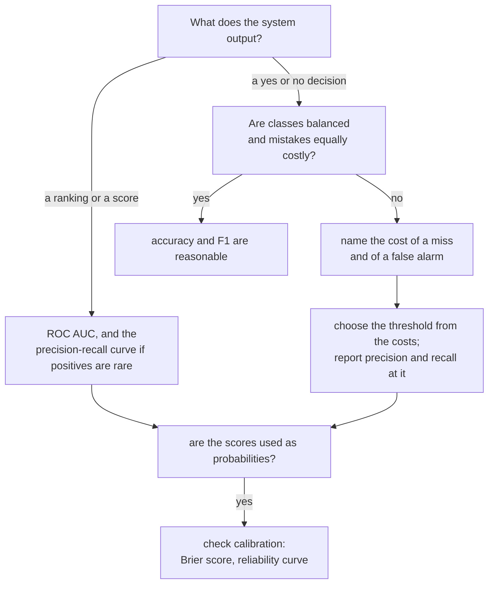

import Infographic from '@site/src/components/Infographic';
import EvalConfusionMatrixLab from '@site/src/components/viz/EvalConfusionMatrixLab';
import RocPrLab from '@site/src/components/viz/RocPrLab';
import CalibrationLab from '@site/src/components/viz/CalibrationLab';

**In one line.** A model is worth exactly what it scores on data it has never seen, measured with a metric that matches what each kind of mistake costs.

## The idea in plain words

Training hands you a score for free: how well the model does on the rows it learned from. That number is nearly useless, for the same reason a student's mark on questions they have already seen says little about the exam. Evaluation is the craft of getting a number you can believe, and then checking that it is the number the problem needs.

Work through three questions, in this order.

1. **Is the number honest?** Hold some data back so the model is scored on rows it never trained on. One held-out test set is the simplest way. When data is scarce, **k-fold cross-validation** rotates which part is held back and averages the results, so a lucky or unlucky split cannot decide the verdict.
2. **Is it the right number?** Accuracy counts every mistake alike, and mistakes are rarely alike. The **confusion matrix** separates misses (false negatives) from false alarms (false positives), and **precision**, **recall** and **F1** weigh them differently. On skewed data a useless model can be 99% accurate.
3. **Is it the right threshold?** Most classifiers output a score, and a cut-off turns it into a decision. **ROC AUC** summarises quality over every possible cut-off. Choosing one cut-off is a separate decision that belongs to the business, because it depends on what a miss and a false alarm cost.

Underneath all three sits the **bias-variance** picture. A model that is too simple misses the pattern and scores badly on both train and test (underfitting). A model that is too flexible memorises noise, scores superbly on train and badly on test (overfitting). The validation score is the instrument that shows which side you are on.



<Infographic src="/img/ml/model-evaluation-confusion-metrics.svg" alt="A two by two confusion matrix with TP 40, FP 10, FN 5 and TN 45 beside the five metrics computed from it: accuracy 0.850, precision 0.800, recall 0.889, F1 0.842 and specificity 0.818." caption="The lecture's confusion-matrix example, with every metric worked out. The first code block reproduces each figure." />

<Infographic src="/img/ml/model-evaluation-honest-splits.svg" alt="Three panels compare a single train and test split, five-fold cross-validation with a rotating held-out fold, and a time-ordered split where the test block is always later than the training block." caption="Three ways to hold data back, with the scores the code section prints for each." />

## How it works

### Train / validation / test & cross-validation

Fit on **train**, tune on **validation**, report on an untouched **test** set. When data is scarce, **k-fold CV** rotates the test fold and averages for a stable estimate.

:::tip

**Why.** Scoring on training data is like grading students on questions they've already seen. k-fold uses all data for both roles at different times.

:::

### Confusion matrix & metrics

**Accuracy**=(TP+TN)/all, **Precision**=TP/(TP+FP), **Recall**=TP/(TP+FN), **F₁**=harmonic mean of P & R.

#### Confusion-matrix calculator

The calculator in the code section takes the four counts and returns every metric.

:::tip

**Worked.** TP=40, FP=10, FN=5, TN=45 → Acc 0.85, Prec 0.80, Recall 0.889, F₁ 0.842, Specificity 0.818.

:::

### ROC curve & AUC

Sweep the decision **threshold** and plot true-positive vs false-positive rate. **AUC** summarises it: 1.0 perfect, 0.5 random.

:::note

**Why AUC.** It's threshold-independent and robust to class imbalance, a fairer single number than accuracy when classes are skewed.

:::

### Underfitting vs overfitting

- **Underfit (high bias)**: Too simple; misses the pattern; poor on train *and* test.
- **Overfit (high variance)**: Too complex; memorises noise; great on train, poor on test.

:::tip

**The sweet spot.** Watch validation performance as complexity grows; stop at its minimum error.

:::

### Key takeaways

- **1 · Unseen data**: Train/val/test; k-fold CV for stability.
- **2 · Right metric**: Precision/recall/F₁; accuracy misleads when imbalanced. ROC/AUC across thresholds.
- **3 · Complexity**: Balance bias and variance at the validation minimum.

:::note

**The thread.** Honest evaluation measures performance on unseen data via a test split or k-fold cross-validation. The confusion matrix gives accuracy, precision, recall and F₁, and accuracy alone misleads on imbalanced data. ROC/AUC judges a classifier across all thresholds, and balancing bias against variance picks the right model complexity.

:::

## A real system that works this way

**Weather forecasts are the oldest probability forecasts to be scored this way.** A forecaster who says "70% chance of rain" is not judged right or wrong on a single day. Over many days with that statement, rain should fall on about 70% of them (calibration), and the forecasts that said 90% should beat the ones that said 30% (discrimination). A 1988 National Weather Service technical note describes the Brier score as one of the most widely used verification scores for probability-of-precipitation forecasts, and says the Service used a slightly modified version. The score is the mean squared gap between the stated probability and what happened, so it punishes both timid forecasts and confident wrong ones. The same logic now sits behind credit scores, fraud scores and churn scores.

**A fraud screen shows why accuracy fails.** If 1 transaction in 100 is fraudulent, a model that always says "legitimate" is 99% accurate and catches nothing. The team that ships it has measured the wrong thing. Recall on the fraud class, precision of the alerts, and the cost of each kind of error are the numbers that matter, and the next section computes exactly this case.

## Code you can run

Every figure the lecture prints is reproduced below, next to the lecture's own value. Nothing here needs a network or a GPU.

### The lecture's confusion matrix, in code

```python
def metrics(tp, fp, fn, tn):
    total = tp + fp + fn + tn
    precision = tp / (tp + fp)
    recall = tp / (tp + fn)
    return {
        "accuracy": (tp + tn) / total,
        "precision": precision,
        "recall": recall,
        "f1": 2 * precision * recall / (precision + recall),
        "specificity": tn / (tn + fp),
    }

lecture = {"accuracy": 0.85, "precision": 0.80, "recall": 0.889, "f1": 0.842, "specificity": 0.818}
ours = metrics(40, 10, 5, 45)
print("lecture widget: TP=40 FP=10 FN=5 TN=45")
print(f"{'metric':<12}{'lecture':>9}{'code':>9}")
for name, value in lecture.items():
    print(f"{name:<12}{value:>9.3f}{ours[name]:>9.3f}")

bank = metrics(40, 10, 20, 30)
print("\nquestion bank Q50: TP=40 FP=10 FN=20 TN=30")
for name in ("accuracy", "precision", "recall", "f1"):
    print(f"{name:<12}{bank[name]:>9.3f}")

positives, negatives = 10, 990
tp, fp, fn, tn = 0, 0, positives, negatives
print("\nalways-legit model on 1% fraud:")
print(f"accuracy {(tp + tn) / (positives + negatives):.3f}, recall {tp / (tp + fn):.3f}")
```

The first table matches the lecture to three decimals. The second shows the question bank's own example (TP 40, FP 10, FN 20, TN 30): the same precision with lower recall, so F1 falls from 0.842 to 0.727. The last two lines are the fraud-screen trap from above.

The lecture's "Confusion-matrix calculator" is the lab below. Its default is the lecture's example and prints the same five numbers; try the third preset to see 99% accuracy with zero recall.

<EvalConfusionMatrixLab />

### Why one split is not enough

```python
import numpy as np
from sklearn.datasets import load_breast_cancer
from sklearn.linear_model import LogisticRegression
from sklearn.model_selection import StratifiedKFold, cross_val_score, train_test_split
from sklearn.pipeline import make_pipeline
from sklearn.preprocessing import StandardScaler

X, y = load_breast_cancer(return_X_y=True)
model = make_pipeline(StandardScaler(), LogisticRegression(max_iter=1000))

single = []
for seed in range(20):
    X_tr, X_te, y_tr, y_te = train_test_split(X, y, test_size=0.2, random_state=seed)
    single.append(model.fit(X_tr, y_tr).score(X_te, y_te))
single = np.array(single)
print(f"20 different 80/20 splits: min {single.min():.3f}  max {single.max():.3f}  std {single.std():.3f}")

cv = StratifiedKFold(n_splits=5, shuffle=True, random_state=0)
scores = cross_val_score(model, X, y, cv=cv)
print("5-fold scores:", np.round(scores, 3))
print(f"5-fold mean {scores.mean():.3f}  std {scores.std():.3f}")

X_tr, X_te, y_tr, y_te = train_test_split(X, y, test_size=0.2, random_state=0, stratify=y)
print(f"\ntrain {len(X_tr)} / test {len(X_te)}, positives in test {y_te.mean():.3f} vs overall {y.mean():.3f}")
```

Twenty different 80/20 splits of the same data give accuracies from 0.947 to 0.991, a spread of more than four points that has nothing to do with the model. Five-fold cross-validation reports 0.979 with a standard deviation of 0.014, and every row is used for testing exactly once. The last line shows `stratify=y`: the test set keeps the class mix of the whole data (0.632 against 0.627 positives), which matters more as classes get rarer.

### Underfitting and overfitting

```python
import numpy as np
from sklearn.datasets import make_moons
from sklearn.model_selection import validation_curve
from sklearn.tree import DecisionTreeClassifier

X, y = make_moons(n_samples=600, noise=0.35, random_state=1)
depths = np.arange(1, 13)
train, valid = validation_curve(DecisionTreeClassifier(random_state=0), X, y, param_name="max_depth", param_range=depths, cv=5)
print("depth  train  validation")
for d, tr, va in zip(depths, train.mean(axis=1), valid.mean(axis=1)):
    print(f"{d:>5}  {tr:.3f}  {va:.3f}")
mean_valid = valid.mean(axis=1)
peak = depths[mean_valid >= mean_valid.max() - 1e-9]
print(f"validation score {mean_valid.max():.3f} peaks at depth {', '.join(str(d) for d in peak)}")
```

Training accuracy climbs steadily with depth, up to 0.991. Validation accuracy rises to 0.860 at depths 5 and 6 and then falls. The gap between the two columns is the overfitting. Stop where validation stops improving; this is the "sweet spot" of the lecture. The same picture, with a slider, is in the [bias-variance lab](/docs/theory/ml/what-machine-learning-is).

### ROC curves, and what the lecture glosses over

```python
import numpy as np
from scipy.stats import norm
from sklearn.datasets import make_classification
from sklearn.linear_model import LogisticRegression
from sklearn.metrics import average_precision_score, precision_recall_curve, roc_auc_score
from sklearn.model_selection import train_test_split

X, y = make_classification(n_samples=20000, n_features=12, n_informative=5, weights=[0.98, 0.02], class_sep=0.8, random_state=0)
X_tr, X_te, y_tr, y_te = train_test_split(X, y, test_size=0.5, random_state=0, stratify=y)
scores = LogisticRegression(max_iter=1000).fit(X_tr, y_tr).predict_proba(X_te)[:, 1]

print(f"positives in the test set: {y_te.mean():.3f}")
print(f"accuracy of always predicting negative: {1 - y_te.mean():.3f}")
print(f"ROC AUC {roc_auc_score(y_te, scores):.3f}   average precision {average_precision_score(y_te, scores):.3f}")
print(f"average precision of a random ranking would be about {y_te.mean():.3f}")

precision, recall, _ = precision_recall_curve(y_te, scores)
for target in (0.5, 0.7, 0.9):
    i = np.argmax(recall <= target)
    print(f"at recall {recall[i]:.2f} precision is {precision[i]:.2f}")

separation, n = 1.5, 1000
print(f"\nbinormal model: negatives ~ N(0,1), positives ~ N({separation},1)")
print(f"AUC = Phi(d / sqrt 2) = {norm.cdf(separation / np.sqrt(2)):.3f}, whatever the prevalence")

def counts(prevalence, threshold):
    tpr, fpr = norm.sf(threshold - separation), norm.sf(threshold)
    tp, fn = tpr * prevalence * n, (1 - tpr) * prevalence * n
    fp, tn = fpr * (1 - prevalence) * n, (1 - fpr) * (1 - prevalence) * n
    return tpr, fpr, tp, fn, fp, tn

def area_under_pr(prevalence):
    t = np.linspace(-6, separation + 6, 4001)
    tpr, fpr = norm.sf(t - separation), norm.sf(t)
    precision = prevalence * tpr / (prevalence * tpr + (1 - prevalence) * fpr)
    order = np.argsort(tpr)
    return float(np.trapezoid(precision[order], tpr[order]))

tpr, fpr, tp, fn, fp, tn = counts(0.10, 1.0)
print(f"\nprevalence 0.10, threshold 1.0: TPR {tpr:.3f} FPR {fpr:.3f}")
print(f"expected counts per 1000: TP {tp:.0f} FN {fn:.0f} FP {fp:.0f} TN {tn:.0f}, precision {tp / (tp + fp):.3f}")
print(f"\n{'prevalence':<12}{'AUC':>7}{'precision at t=1':>18}{'area under PR':>15}")
for prevalence in (0.5, 0.1, 0.01):
    _, _, tp, _, fp, _ = counts(prevalence, 1.0)
    print(f"{prevalence:<12}{norm.cdf(separation / np.sqrt(2)):>7.3f}{tp / (tp + fp):>18.3f}{area_under_pr(prevalence):>15.3f}")
```

:::note Correction to the lecture
The lecture calls ROC AUC "robust to class imbalance", and the question bank repeats it. That is true in one narrow sense: AUC does not change when you change the class mix, as the last table shows (0.856 in every row). It is **not** true that AUC tells you the model is useful on rare positives. With 2.5% positives the same model has ROC AUC 0.838 but average precision 0.575, and at 70% recall only one alert in five is real. When positives are rare, look at the precision-recall curve too.
:::

The lab draws both curves for a model whose scores for the two classes are normal curves a distance `d` apart. Its default (separation 1.5, prevalence 0.10, threshold 1.0) prints AUC 0.856, TP 69, FN 31, FP 143, TN 757 and precision 0.326, the same numbers as the "prevalence 0.10" lines above. Now drag prevalence down and watch the ROC curve stay put while the precision-recall curve collapses.

<RocPrLab />

### Beyond the lecture

:::note Beyond the lecture
Everything from here to the end of this section is an **addition**: the lecture stops at ROC and AUC. Calibration, precision-recall curves, cost-based thresholds, time-based splits and comparing two models are the parts of evaluation that decide whether a score survives contact with a real decision.
:::

#### Calibration: do the probabilities mean what they say?

A model can rank perfectly and still lie about its confidence. A **reliability curve** groups predictions into bins and plots the average stated probability against how often the event really happened; a calibrated model sits on the diagonal. The **Brier score** is the mean squared gap between stated probability and outcome, and **expected calibration error** (ECE) is the average distance from the diagonal, weighted by bin size. Two cheap fixes exist: **Platt scaling** fits a sigmoid to the scores, and **isotonic regression** fits any rising step curve. Isotonic is more flexible and needs more data; the scikit-learn guide suggests it can overfit below roughly a thousand samples.

```python
import numpy as np
from sklearn.calibration import CalibratedClassifierCV, calibration_curve
from sklearn.datasets import make_classification
from sklearn.metrics import brier_score_loss, log_loss
from sklearn.model_selection import train_test_split
from sklearn.naive_bayes import GaussianNB

X, y = make_classification(n_samples=6000, n_features=20, n_informative=8, n_redundant=8, random_state=3)
X_tr, X_te, y_tr, y_te = train_test_split(X, y, test_size=0.5, random_state=3)

def expected_calibration_error(y_true, prob, bins=10):
    ids = np.minimum((prob * bins).astype(int), bins - 1)
    total = 0.0
    for b in range(bins):
        m = ids == b
        if m.any():
            total += m.mean() * abs(prob[m].mean() - y_true[m].mean())
    return total

models = {"uncalibrated": GaussianNB().fit(X_tr, y_tr)}
for method in ("sigmoid", "isotonic"):
    models[method] = CalibratedClassifierCV(GaussianNB(), method=method, cv=5).fit(X_tr, y_tr)

print(f"{'model':<14}{'Brier':>8}{'log loss':>10}{'ECE':>8}")
for name, m in models.items():
    p = m.predict_proba(X_te)[:, 1]
    print(f"{name:<14}{brier_score_loss(y_te, p):>8.4f}{log_loss(y_te, p):>10.4f}{expected_calibration_error(y_te, p):>8.4f}")

fraction, predicted = calibration_curve(y_te, models["uncalibrated"].predict_proba(X_te)[:, 1], n_bins=5, strategy="uniform")
print("\nuncalibrated Gaussian Naive Bayes, five equal-width bins")
for mp, f in zip(predicted, fraction):
    print(f"  said {mp:.2f}, was positive {f:.2f}")
```

Gaussian Naive Bayes is badly overconfident: when it said 0.06 the event happened 19% of the time. Either fix cuts the Brier score and, more strikingly, cuts ECE from 0.107 to 0.031 or 0.024. Rankings (AUC) barely change; only the meaning of the numbers does.

The lab below has the scores' reliability controlled by a single slope: the model states `q`, reality is `sigmoid(slope * logit(q) + shift)`, a calibrator is fitted on one half of the cases and scored on the other half. The lab's defaults reproduce the first table that the next block prints.

<CalibrationLab />

```python
import numpy as np
from sklearn.isotonic import IsotonicRegression

GOLDEN = 0.6180339887498949

def logit(p):
    return np.log(p / (1 - p))

def sigmoid(z):
    return 1 / (1 + np.exp(-z))

def make_scores(n, slope, shift):
    i = np.arange(n)
    q = (i + 0.5) / n
    true_p = sigmoid(slope * logit(q) + shift)
    u = ((i + 1) * GOLDEN) % 1.0
    return q, (u < true_p).astype(float)

def fit_platt(q, y, steps=50):
    x = logit(np.clip(q, 1e-6, 1 - 1e-6))
    w, b = 1.0, 0.0
    for _ in range(steps):
        p = sigmoid(w * x + b)
        g = np.array([((p - y) * x).sum(), (p - y).sum()])
        s = p * (1 - p)
        H = np.array([[(s * x * x).sum() + 1e-9, (s * x).sum()], [(s * x).sum(), s.sum() + 1e-9]])
        w, b = np.array([w, b]) - np.linalg.solve(H, g)
    return lambda q_new: sigmoid(w * logit(np.clip(q_new, 1e-6, 1 - 1e-6)) + b)

def fit_isotonic(q, y):
    iso = IsotonicRegression(out_of_bounds="clip").fit(q, y)
    return iso.predict

def brier(p, y):
    return float(((p - y) ** 2).mean())

def ece(p, y, bins=10):
    ids = np.minimum((p * bins).astype(int), bins - 1)
    total = 0.0
    for b in range(bins):
        m = ids == b
        if m.any():
            total += m.mean() * abs(p[m].mean() - y[m].mean())
    return float(total)

n, slope, shift = 500, 0.6, 0.0
q, y = make_scores(n, slope, shift)
fit, test = np.arange(n) % 2 == 0, np.arange(n) % 2 == 1
print(f"n={n}, model says logit(q), reality is sigmoid({slope} * logit(q) + {shift})")
print(f"{'calibration':<12}{'Brier':>8}{'ECE':>8}")
print(f"{'none':<12}{brier(q[test], y[test]):>8.4f}{ece(q[test], y[test]):>8.4f}")
for name, builder in (("platt", fit_platt), ("isotonic", fit_isotonic)):
    f = builder(q[fit], y[fit])
    print(f"{name:<12}{brier(f(q[test]), y[test]):>8.4f}{ece(f(q[test]), y[test]):>8.4f}")

print("\nsame recipe at n=60 (isotonic has too few points to be smooth)")
q, y = make_scores(60, slope, shift)
fit, test = np.arange(60) % 2 == 0, np.arange(60) % 2 == 1
for name, builder in (("platt", fit_platt), ("isotonic", fit_isotonic)):
    f = builder(q[fit], y[fit])
    print(f"{name:<12}{brier(f(q[test]), y[test]):>8.4f}{ece(f(q[test]), y[test]):>8.4f}")
print(f"{'none':<12}{brier(q[test], y[test]):>8.4f}{ece(q[test], y[test]):>8.4f}")
```

At 500 cases both fixes help, isotonic more on ECE (0.0780 down to 0.0219). At 60 cases isotonic's Brier score is worse than not calibrating at all (0.2028 against 0.1861) while Platt's still improves slightly. Few cases, use the smooth fix.

<Infographic src="/img/ml/model-evaluation-roc-vs-pr.svg" alt="A table showing ROC AUC fixed at 0.856 while precision at a fixed threshold falls from 0.813 to 0.326 to 0.042 and the area under the precision-recall curve falls from 0.854 to 0.478 to 0.115 as prevalence drops from 0.5 to 0.1 to 0.01." caption="Why rare positives need a precision-recall view: the ranking quality is constant, what a flagged case is worth is not." />

#### Choosing the threshold from costs

If a miss costs 500 and a false alarm costs 20, the best cut-off on **calibrated** probabilities is `20 / (20 + 500) = 0.038`, far below the default 0.5. The block below sweeps thresholds on held-out scores and lets scikit-learn's `TunedThresholdClassifierCV` find one with cross-validation.

```python
import numpy as np
from sklearn.datasets import make_classification
from sklearn.linear_model import LogisticRegression
from sklearn.metrics import confusion_matrix, f1_score, make_scorer
from sklearn.model_selection import TunedThresholdClassifierCV, train_test_split

X, y = make_classification(n_samples=20000, n_features=12, n_informative=5, weights=[0.95, 0.05], class_sep=0.9, random_state=2)
X_tr, X_te, y_tr, y_te = train_test_split(X, y, test_size=0.4, random_state=2, stratify=y)

COST_FALSE_NEGATIVE = 500
COST_FALSE_POSITIVE = 20

def total_cost(y_true, y_pred):
    tn, fp, fn, tp = confusion_matrix(y_true, y_pred).ravel()
    return fn * COST_FALSE_NEGATIVE + fp * COST_FALSE_POSITIVE

model = LogisticRegression(max_iter=1000).fit(X_tr, y_tr)
p = model.predict_proba(X_te)[:, 1]
grid = np.linspace(0.01, 0.99, 99)
costs = [total_cost(y_te, (p >= t).astype(int)) for t in grid]
best = grid[int(np.argmin(costs))]
theory_threshold = COST_FALSE_POSITIVE / (COST_FALSE_POSITIVE + COST_FALSE_NEGATIVE)
print(f"cost-optimal threshold for calibrated scores = FP cost / (FP cost + FN cost) = {theory_threshold:.3f}")
print(f"cost at the theoretical {theory_threshold:.3f}: {total_cost(y_te, (p >= theory_threshold).astype(int)):>7}")
print(f"cost at 0.50:  {total_cost(y_te, (p >= 0.5).astype(int)):>7}")
print(f"cost at best grid threshold {best:.2f}: {min(costs):>7}")
print(f"F1 at 0.50 {f1_score(y_te, (p >= 0.5).astype(int)):.3f}, F1 at best-cost threshold {f1_score(y_te, (p >= best).astype(int)):.3f}")

scorer = make_scorer(total_cost, greater_is_better=False)
tuned = TunedThresholdClassifierCV(LogisticRegression(max_iter=1000), scoring=scorer, cv=5, thresholds=99).fit(X_tr, y_tr)
print(f"TunedThresholdClassifierCV picked {tuned.best_threshold_:.2f}; test cost {total_cost(y_te, tuned.predict(X_te))}")
```

The default threshold costs 119,440. The formula's 0.038 costs 68,740, and the best grid value, 0.08, costs 63,500. The formula lands near but not on the grid optimum because the model's probabilities are not perfectly calibrated and the cost curve is flat near its minimum. Notice that F1 falls (0.607 to 0.460) while the total cost almost halves: F1 is the wrong objective when the two mistakes are not equally expensive. `TunedThresholdClassifierCV` picks 0.07 using only the training data and pays 63,920 on the test data, so the procedure generalises.

<Infographic src="/img/ml/model-evaluation-calibration-threshold.svg" alt="Left, a table of Brier score, log loss and expected calibration error for an uncalibrated, sigmoid-calibrated and isotonic-calibrated model. Right, total cost at thresholds 0.50, 0.038 and 0.08 for a miss cost of 500 and a false-alarm cost of 20." caption="Calibration first, then a threshold derived from costs. Figures are the ones the two blocks above print." />

#### Time-based splits

If rows are ordered in time, a shuffled split lets the model train on tomorrow to predict yesterday. Use a split in which every test block comes after its training block.

```python
import numpy as np
from sklearn.ensemble import RandomForestClassifier
from sklearn.model_selection import KFold, TimeSeriesSplit, cross_val_score

rng = np.random.default_rng(0)
n = 3000
t = np.arange(n)
x = rng.normal(size=(n, 3))
drift = t / n
logit = 2.5 * x[:, 0] * (1 - 2 * drift) + 0.8 * x[:, 2]
y = (rng.random(n) < 1 / (1 + np.exp(-logit))).astype(int)
X = np.column_stack([x, drift])

model = RandomForestClassifier(n_estimators=100, min_samples_leaf=5, random_state=0, n_jobs=1)
shuffled = cross_val_score(model, X, y, cv=KFold(5, shuffle=True, random_state=0))
forward = cross_val_score(model, X, y, cv=TimeSeriesSplit(5))
print("shuffled KFold   :", np.round(shuffled, 3), f"mean {shuffled.mean():.3f}")
print("TimeSeriesSplit  :", np.round(forward, 3), f"mean {forward.mean():.3f}")
```

On data whose rule drifts over time, shuffled five-fold cross-validation reports 0.730, while forward-chaining `TimeSeriesSplit` reports 0.681, which is nearer what a deployed model sees. The shuffled number is flattering because the model can learn the pattern from both sides of every test row.

#### Is model A really better than model B?

Cross-validation scores are not independent samples, because the training sets overlap, so an ordinary paired t-test is too eager. The Nadeau and Bengio correction inflates the variance by a term that depends on the test and train sizes.

```python
import numpy as np
from scipy import stats
from sklearn.datasets import load_breast_cancer
from sklearn.ensemble import RandomForestClassifier
from sklearn.linear_model import LogisticRegression
from sklearn.model_selection import RepeatedStratifiedKFold, cross_val_score
from sklearn.pipeline import make_pipeline
from sklearn.preprocessing import StandardScaler

X, y = load_breast_cancer(return_X_y=True)
cv = RepeatedStratifiedKFold(n_splits=5, n_repeats=4, random_state=0)
linear = make_pipeline(StandardScaler(), LogisticRegression(max_iter=1000))
forest = RandomForestClassifier(n_estimators=100, random_state=0, n_jobs=1)

a = cross_val_score(linear, X, y, cv=cv)
b = cross_val_score(forest, X, y, cv=cv)
diff = a - b
k = len(diff)
n_test_over_train = 1 / 4
naive_t = diff.mean() / np.sqrt(diff.var(ddof=1) / k)
corrected_t = diff.mean() / np.sqrt((1 / k + n_test_over_train) * diff.var(ddof=1))
p_naive = 2 * stats.t.sf(abs(naive_t), k - 1)
p_corrected = 2 * stats.t.sf(abs(corrected_t), k - 1)

print(f"logistic {a.mean():.3f}   forest {b.mean():.3f}   mean paired difference {diff.mean():+.4f}")
print(f"naive paired t-test       t={naive_t:+.2f}  p={p_naive:.3f}")
print(f"corrected resampled test  t={corrected_t:+.2f}  p={p_corrected:.3f}")
```

The naive test says a gap of 0.015 accuracy is overwhelming (t = 4.57), while the corrected test gives p = 0.078, which is not significant at the usual 5% level. The honest reading is "no reliable difference on this data", which is a different decision from "logistic regression wins".

## Designing with it

**Pick the evaluation before the model.** Decide the split, the metric and the decision rule first; otherwise every later choice quietly tunes itself to the test set.

| Situation | What to use | Watch out for |
| --- | --- | --- |
| Small data | Stratified k-fold, repeated | Preprocessing must sit **inside** the fold (use a `Pipeline`) |
| Rows ordered in time | `TimeSeriesSplit`, or a final block held out by date | Any shuffled split flatters the score |
| Classes balanced, errors equally costly | Accuracy, F1 | Still report the confusion matrix |
| Rare positives | Precision, recall, average precision, PR curve | ROC AUC alone looks fine and hides it |
| Scores used as probabilities | Brier score, reliability curve, calibration | Calibrate on data the model did not train on |
| A decision per case | Threshold from the cost of each error | Tune it on validation data, not on the test set |
| Choosing between two models | Paired scores, corrected test, effect size | "Slightly higher mean" is not a result |

**Three habits that prevent most embarrassment.**

- Touch the test set once, at the end. Everything you tune (features, hyperparameters, threshold, calibration) uses validation data or cross-validation.
- Put every learned preprocessing step inside a scikit-learn `Pipeline` so each fold fits scalers and encoders on its own training part only. [Leakage](/docs/theory/ml/features-leakage-and-imbalance) is the usual reason a model that scored 0.95 in the notebook scores 0.80 in production.
- Report the spread, not just the mean: a score of 0.979 with a standard deviation of 0.014 is a different claim from a single 0.979.

## Where this stands in 2026

:::info Industry view

- scikit-learn 1.9 ships `TunedThresholdClassifierCV` and `FixedThresholdClassifier`, so choosing a cut-off by cross-validation against a custom cost is a first-class operation rather than a hand-written loop.
- The scikit-learn calibration guide still frames the choice as sigmoid for small samples and isotonic for larger ones (roughly more than a thousand cases), which matches the behaviour in the lab above.
- Reporting on slices (by region, device, customer type) and not only overall is standard practice in model documentation, following the "model cards" proposal of 2018; a good overall score can hide a poor one on a subgroup.
- Probability quality is judged separately from ranking quality: teams that use a score to price, prioritise or trigger actions track calibration alongside AUC.

:::

## Practice questions

<details>
<summary><strong>Q1.</strong> Why must a model be evaluated on a separate test set?</summary>

Training performance can reflect memorisation, not generalisation. A held-out test set measures performance on **unseen** data, the only honest estimate.<br /><em>Module 11 · conceptual</em>

</details>

<details>
<summary><strong>Q2.</strong> What is k-fold cross-validation and why use it?</summary>

Split into k folds, train on k−1 and test on the held-out fold, rotating so each fold is tested once, then average. It gives a more stable estimate and uses all data for both roles.<br /><em>Module 11 · conceptual</em>

</details>

<details>
<summary><strong>Q3.</strong> Given TP=40, FP=10, FN=5, TN=45, compute accuracy, precision and recall.</summary>

Accuracy = 85/100 = 0.85; Precision = 40/50 = 0.80; Recall = 40/45 = 0.889.<br /><em>Module 11 · numeric</em>

</details>

<details>
<summary><strong>Q4.</strong> Continue Q3: compute F₁.</summary>

F₁ = 2·P·R/(P+R) = 2·0.80·0.889/(0.80+0.889) = 0.842.<br /><em>Module 11 · numeric</em>

</details>

<details>
<summary><strong>Q5.</strong> Why can accuracy be misleading, and what should you report instead?</summary>

On imbalanced data, predicting the majority class gives high accuracy but is useless (e.g. 99% accurate, 0 recall). Report precision, recall and F₁, or use ROC/AUC.<br /><em>Module 11 · conceptual</em>

</details>

<details>
<summary><strong>Q6.</strong> What does the AUC of an ROC curve represent, and what do 0.5 and 1.0 mean?</summary>

AUC is the area under the true-positive-vs-false-positive curve as the threshold sweeps, a threshold-independent quality score. 0.5 = random, 1.0 = perfect.<br /><em>Module 11 · conceptual</em>

</details>

## Further reading

- [scikit-learn user guide: metrics and scoring](https://scikit-learn.org/stable/modules/model_evaluation.html): every metric used here, with the scoring-string table.
- [scikit-learn user guide: cross-validation](https://scikit-learn.org/stable/modules/cross_validation.html): `StratifiedKFold`, `TimeSeriesSplit` and why preprocessing belongs inside the pipeline.
- [scikit-learn user guide: probability calibration](https://scikit-learn.org/stable/modules/calibration.html): reliability curves, sigmoid versus isotonic and `CalibratedClassifierCV`.
- [scikit-learn user guide: tuning the decision threshold](https://scikit-learn.org/stable/modules/classification_threshold.html): `TunedThresholdClassifierCV` and cost-sensitive thresholds.
- [Saito and Rehmsmeier (2015): the precision-recall plot is more informative than the ROC plot on imbalanced data](https://journals.plos.org/plosone/article?id=10.1371/journal.pone.0118432): open access.
- [Niculescu-Mizil and Caruana (2005): predicting good probabilities with supervised learning](https://mlanthology.org/icml/2005/niculescumizil2005icml-predicting): which model families are over- or under-confident, and what Platt scaling and isotonic regression repair.
- [Nadeau and Bengio: inference for the generalization error](https://papers.nips.cc/paper/1661-inference-for-the-generalization-error): the corrected resampled t-test used in the comparison block.
- [Hyndman and Athanasopoulos, Forecasting: Principles and Practice, section 5.10](https://otexts.com/fpp3/tscv.html): time-series cross-validation with a rolling origin.
- [Google Machine Learning Crash Course: accuracy, precision, recall](https://developers.google.com/machine-learning/crash-course/classification/accuracy-precision-recall): a short, clear treatment of the metrics.
- [McNulty (1988), a National Weather Service technical attachment on the Brier score](https://repository.library.noaa.gov/view/noaa/33800/noaa_33800_DS1.pdf): how probability-of-precipitation forecasts are verified.
- Built from the course lecture "ml-m11-model-evaluation" (Lecture Library series).

- **[An Introduction to Statistical Learning](https://www.statlearning.com/)** `book`
  James, Witten, Hastie & Tibshirani, The friendliest rigorous intro to ML, free PDF plus R/Python labs.
- **[Stanford CS229 (Machine Learning)](https://cs229.stanford.edu/)** `course`
  Andrew Ng, Stanford, The rigorous derivations behind SVMs, GLMs, EM and learning theory.
- **[StatQuest](https://statquest.org/video-index/)** `▶ video`
  Josh Starmer, Short, wonderfully clear videos that build intuition step by step.

## Check yourself

- I can explain why a score on training data cannot be trusted, and why one split is a noisy estimate.
- I can compute accuracy, precision, recall, F1 and specificity from a confusion matrix, including the lecture example (0.850, 0.800, 0.889, 0.842, 0.818).
- I can explain why a 99%-accurate model can have zero recall, and choose a better metric.
- I can say what ROC AUC does and does not tell me, and when to read the precision-recall curve instead.
- I can read a reliability curve, compute a Brier score, and choose between Platt scaling and isotonic regression.
- I can derive a threshold from the cost of a miss and of a false alarm, and tune it with cross-validation.
- I can choose a time-ordered split when rows are ordered in time, and explain why a shuffled split flatters the score.
- I can say why a plain t-test on cross-validation scores overstates a difference.
