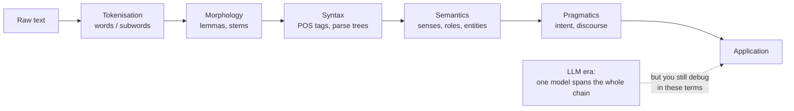

**In one line.** Language is ambiguous at every level, and NLP is the business of resolving that ambiguity well enough to be useful.

## The idea in plain words

Every layer of language is ambiguous:

- **Words** — "bank" is a river edge or a financial institution.
- **Structure** — "I saw the man with the telescope": who has the telescope?
- **Meaning** — "it" refers to what, exactly?
- **Intent** — "can you pass the salt?" is not a question about ability.

Classical NLP attacked this with a **pipeline**: tokenise, tag, parse, extract meaning. Each stage had its own model, and errors compounded down the chain.

Large language models replaced the pipeline with one model that goes text-in, text-out. The pipeline still matters, though, for a practical reason: **it is the vocabulary you use to describe what went wrong.** When a model mishandles a negation, a coreference or a domain term, you are debugging exactly these layers.

One classical stage never went away: **tokenisation**. Subword splitting decides your cost per request, how much fits in the context window, and how badly the model handles rare names, code and non-English text.



## How it works

### What is NLP?

**NLP** makes computers analyse, understand, and generate human language — making the computer learn *our* language rather than us learning its. A branch of AI, it borrows from linguistics, psychology, cognitive science, and statistics.

:::note

**The intuition.** Text is the largest and fastest-growing store of human knowledge — emails, articles, contracts, court decisions. NLP is the key that lets machines read, search, translate, and reason over all of it. It sits where AI, information retrieval, and machine translation meet.

:::

#### Where NLP shows up

Click an everyday tool to see which NLP task powers it. You use NLP constantly — predictive text, spell-check, search, translation, voice assistants, spam filters — each is a system processing natural language.

:::tip

**The scale.** The NLP market is projected to grow from ~$15.7 B (2022) toward ~$49.4 B (2027). NLP powers question answering, sentiment analysis, translation, summarisation, spell/grammar correction, information extraction, and more.

:::

### The levels of language analysis

Language is understood in **layers**, each building on the one below: **morphology → lexical → syntactic → semantic → discourse → pragmatic**. Full understanding needs all of them.

#### Climb the levels

Click each level to see what it analyses and an example. Notice how a sentence can be correct at low levels yet wrong higher up — meaning and context are separate from grammar.

:::tip

**Worked example — three ways to be wrong.** "Green frogs have large noses" — only *pragmatically* odd. "Green ideas have large noses" — broken at the *semantic* level (ideas can't be green). "Large have green ideas nose" — ungrammatical, wrong at *all three* levels (syntax, semantics, pragmatics).

:::

:::note

**NLU vs NLG.** **Understanding** (NLU) analyses input across these levels; **Generation** (NLG) decides what to say (planning) and how to say it (syntactic generation).

:::

### Why NLP is hard: ambiguity

The central difficulty is **ambiguity**: the same string can mean different things at every level. Choosing the intended meaning often needs knowledge *outside* the sentence.

#### Read it two ways

Pick a famously ambiguous sentence and reveal its two readings. Each is grammatical — only meaning and world knowledge can pick the intended one. That's exactly why NLP can't be done by rules alone.

:::tip

**Types of ambiguity.** **Lexical**: "I saw bats" (mammals or baseball bats?). **Structural**: "Visiting relatives can be a nuisance" (visiting them, or relatives who visit?). **Headline**: "Teacher strikes idle kids".

:::

### The preprocessing pipeline

Nearly every NLP system starts the same way: **segment → tokenise → stem/lemmatise → remove stop words**. These turn messy raw text into clean units of analysis.

#### Run the pipeline on your own text

Type a sentence and watch each stage: split into tokens, strip suffixes (stemming), map to dictionary lemmas, and drop stop words. Toggle the stages to compare — and see how **stemming** ("studies"→"studi") differs from **lemmatisation** ("studies"→"study").

### Syntax & context-free grammars

Most syntactic representations rest on **context-free grammars (CFGs)** — sentence structure as phrases nested in phrases, drawn as a **parse tree**. A CFG has rules plus a lexicon.

$$ S \to NP\ VP \quad NP \to N\ N \mid N \quad VP \to V\ NP \mid V\ PP \quad PP \to P\ NP $$

#### Two parse trees for one sentence

"Rice flies like sand." Toggle between the two valid parses: *rice-flies (insects) like sand*, or *rice flies through the air like sand does*. The CFG generates both — structural ambiguity made visible. Choosing one needs meaning.

:::tip

**The lexicon.** *Rice*: N · *Flies*: N or V · *Like*: V or P · *Sand*: N. Because "flies" and "like" each have two categories, the same words yield two grammatical trees.

:::

### Evaluation & tools

We measure performance with task-appropriate metrics, often from a **contingency table** (true/false positives and negatives) on a held-out test set.

#### The contingency table

Slide the four counts (TP, FP, FN, TN) and watch precision, recall, F1, and accuracy update. These come straight from the confusion matrix — the foundation of NLP evaluation.

:::note

**The toolkits.** **NLTK** (the most popular Python toolkit), **spaCy** (fast, modern), **Gensim** (topic modelling), **Stanford CoreNLP** (Java), plus commercial APIs (IBM Watson, Google Cloud NLP, Amazon Comprehend).

:::

### Key takeaways

The shape of the whole field, in one session.

- **1 · What & why** — NLP analyses, understands, and generates human language — the gateway to the world's largest knowledge store: text.
- **2 · Levels & difficulty** — Six layers, morphology to pragmatics. Hard because language is ambiguous at every one, plus idioms and world knowledge.
- **3 · The pipeline** — Segment, tokenise, stem/lemmatise, remove stop words. CFGs represent syntax; careful evaluation tells us if it works.

:::note

**The thread.** Language is understood in layers and ambiguous at every one — that tension defines NLP. We clean text with a standard pipeline, represent structure with grammars, and evaluate with care. Next session: representing word *meaning* as vectors, so machines can measure how similar two words are.

:::

## A real system that works this way

**Clinical text** is the canonical hard case. "Patient denies chest pain" and "patient reports chest pain" differ by one word and invert the meaning. Negation and scope detection is still evaluated explicitly in medical NLP systems, whatever model sits underneath.

**Search query understanding** shows the same layers at work: "apple pie recipe" versus "apple pie stock" — same token, different sense, different index to query.

## Code you can run

Tokenisation is where the cost and the failure modes live. This compares whitespace splitting against byte-pair-style subwords on the kind of text that breaks naive pipelines.

```python
import re
from collections import Counter

TEXT = ("Dr. O'Neill's pre-authorisation for patient #4172 was denied — "
        "resubmit via api.example.com/v2 before 2026-10-01.")

# 1. naive whitespace
ws = TEXT.split()

# 2. regex word tokeniser (classical NLP)
rx = re.findall(r"\w+(?:'\w+)?|[^\w\s]", TEXT)

# 3. a tiny byte-pair encoder, learned on the text itself
def learn_bpe(corpus, merges=40):
    vocab = Counter(" ".join(w) + " </w>" for w in corpus.split())
    rules = []
    for _ in range(merges):
        pairs = Counter()
        for word, freq in vocab.items():
            sym = word.split()
            for i in range(len(sym) - 1):
                pairs[(sym[i], sym[i + 1])] += freq
        if not pairs:
            break
        best = max(pairs, key=pairs.get)
        rules.append(best)
        pattern = re.escape(" ".join(best))
        vocab = Counter({re.sub(rf"(?<!\S){pattern}(?!\S)", "".join(best), w): f
                         for w, f in vocab.items()})
    return rules

def apply_bpe(word, rules):
    symbols = list(word) + ["</w>"]
    for a, b in rules:
        i = 0
        while i < len(symbols) - 1:
            if symbols[i] == a and symbols[i + 1] == b:
                symbols[i:i + 2] = [a + b]
            else:
                i += 1
    return symbols

rules = learn_bpe(TEXT.lower())
bpe = [piece for w in TEXT.lower().split() for piece in apply_bpe(w, rules)]

print(f"whitespace : {len(ws):2} tokens  {ws[:6]}")
print(f"regex      : {len(rx):2} tokens  {rx[:8]}")
print(f"bpe        : {len(bpe):2} pieces  {bpe[:10]}")
print("\nnote how the URL, the date and the ID fragment under subword splitting —")
print("that fragmentation is why models miscount digits and mangle rare identifiers.")
```

## Designing with it

**Design decisions at the very start of an NLP system**

| Decision | Options | How to choose |
| --- | --- | --- |
| Unit of text | Document, paragraph, sentence, utterance | Match the unit your users act on |
| Tokeniser | Model's own subword vocab | Never re-tokenise before an LLM; do measure token counts for cost |
| Language coverage | English-only vs multilingual | Multilingual models cost more tokens per word in non-Latin scripts — budget for it |
| Normalisation | Case folding, unicode NFKC, de-hyphenation | Aggressive normalisation destroys identifiers; keep a raw copy |
| PII | Redact before or after modelling | Redact **before** anything leaves your boundary |

**Two rules that save projects**

1. **Keep the raw text.** Every normalisation is lossy, and you will need the original for audit, re-processing and debugging.
2. **Measure tokens, not characters.** Cost, latency and context limits are all denominated in tokens, and the ratio varies wildly by language and content type.

## Where this stands in 2026

:::info Industry view

- The classical pipeline is no longer how systems are built, but it is still **how they are debugged** — negation, coreference and scope are named problems with known tests.
- **Tokenisation drives cost.** The same document can differ 2–3× in token count across languages and tokenisers, which shows up directly on the invoice.
- Domain jargon (clinical, legal, financial) is where accuracy collapses; that is the gap retrieval and fine-tuning fill.
- Most production "NLP" work in 2026 is data plumbing, evaluation and guardrails — not modelling.

:::

## Practice questions

<details>
<summary><strong>Q1.</strong> Why is ambiguity the central challenge of NLP?</summary>

Because one string can carry several meanings, at every level. Resolving it needs information beyond the sentence — context, discourse and world knowledge, which is why simple rule-based systems are brittle.<br /><em>Session 1 · conceptual</em>

</details>

<details>
<summary><strong>Q2.</strong> Give one example each of lexical and structural ambiguity.</summary>

Lexical: "I saw bats" (animals vs sports gear). Structural: "Visiting relatives can be a nuisance" has two parses (the act of visiting, or the relatives themselves).<br /><em>Session 1 · applied</em>

</details>

<details>
<summary><strong>Q3.</strong> Name the six levels of language analysis in order.</summary>

Morphology → lexical → syntactic → semantic → discourse → pragmatic. Each adds a kind of structure; naming which level a sentence violates is the first diagnostic skill.<br /><em>Session 1 · recall</em>

</details>

<details>
<summary><strong>Q4.</strong> Distinguish stemming from lemmatization.</summary>

Stemming crudely chops affixes to a stem ("running"→"run"), sometimes producing non-words. Lemmatization maps to the dictionary lemma using linguistic knowledge ("better"→"good"), so it is more accurate but more expensive.<br /><em>Session 1 · conceptual</em>

</details>

<details>
<summary><strong>Q5.</strong> What do the two halves NLU and NLG do?</summary>

NLU maps text → meaning (climbing the levels of analysis); NLG maps meaning → text (plan what to say, then realise grammatical sentences).<br /><em>Session 1 · conceptual</em>

</details>

## Further reading

- [Jurafsky & Martin, *Speech and Language Processing* (3rd ed. draft)](https://web.stanford.edu/~jurafsky/slp3/) — the standard textbook, free from the authors.
- [Hugging Face NLP Course, chapter 2 (tokenisers)](https://huggingface.co/learn/nlp-course/chapter2/4) — how subword tokenisation actually works in practice.
- [spaCy 101](https://spacy.io/usage/spacy-101) — the production-grade classical pipeline, still the fastest way to do rule-plus-statistics NLP.
- [Source lecture: nlp-s1-intro](https://learning.bansal-ai.in/nlp-s1-intro/lecture.html) — the original interactive lecture these notes were built from.

- **[Speech and Language Processing — Ch. 1-2](https://web.stanford.edu/~jurafsky/slp3/)** `book`
  Jurafsky & Martin — The standard NLP textbook, free from the authors. Chapter 1 introduces the field; Chapter 2 covers words, tokens and edit distance.
- **[CS224N — NLP with Deep Learning](https://web.stanford.edu/class/cs224n/)** `course`
  Stanford CS224N — Stanford's deep-learning NLP course — slides, notes and lecture videos for the whole pipeline.
