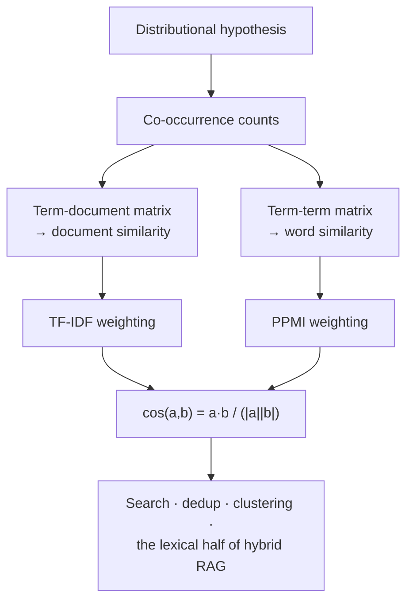

**In one line.** Words that appear in similar contexts mean similar things — so represent a word by the company it keeps.

## The idea in plain words

The **distributional hypothesis**: you shall know a word by the company it keeps. Turn that into arithmetic and you get vectors.

Two matrix shapes:

- **Term-document** — rows are words, columns are documents. Similar columns = similar documents. This is the ancestor of search.
- **Term-term** — rows and columns are both words, counting co-occurrence in a window. Similar rows = similar words.

Raw counts are a bad signal because frequent words dominate. Two weightings fix that:

- **TF-IDF** — multiply term frequency by inverse document frequency. Common words everywhere get crushed; distinctive words get amplified.
- **PPMI** — positive pointwise mutual information. How much more often do these two words co-occur than chance would predict?

Then compare with **cosine similarity**, which measures the angle between vectors and ignores length — so a long document is not automatically "more similar" to everything.



## How it works

### Lexical semantics

**Lexical semantics** studies word meaning: a **lemma** (like "mouse") can be **polysemous** (the rodent; the device), and words stand in **relations** a good representation must capture.

#### Explore word relations

Click each relation to see examples. Note the subtle ones: *similarity* (coffee/tea) is not *relatedness* (coffee/cup); and synonymy holds between *senses*, not words ("big" can mean grown-up, "large" can't).

:::tip

**The relations.** **Synonymy** (couch/sofa) · **Antonymy** (hot/cold) · **Similarity** (vanish/disappear) · **Relatedness** (coffee/cup) · **Semantic field/frame** (surgeon, scalpel, nurse) · **Connotation** (valence, arousal, dominance).

:::

### The distributional hypothesis

**A word is known by the company it keeps.** Words in similar contexts have similar meanings — so we can learn meaning from raw text, and represent each word as a vector (an **embedding**) where similar words sit nearby.

#### Guess the unknown word

You've never seen "ongchoi". Reveal the sentences it appears in, one by one, and watch its meaning emerge from the contexts it shares with known words — exactly how a distributional model learns. No definition needed.

:::tip

**Two ideas.** (1) Define meaning by *distribution* (the contexts a word appears in). (2) Meaning is a *point in a multidimensional space* — a word's vector is its **embedding**; similar words are nearby.

:::

### Co-occurrence vectors

Frequency-based vectors come from two matrices. A **term-document matrix** counts word $w$ in document $d$ (a document is a column, a word is a row). A **term-term matrix** counts how often word $w$ co-occurs with context word $c$.

#### Build a co-occurrence matrix

A tiny corpus with a sliding context window. Watch the word-word co-occurrence counts fill in as the window slides — each word becomes a row vector of context counts. Two words are similar in meaning if their rows are similar.

:::tip

**Two views.** Term-document: two *documents* are similar if their column vectors are similar. Term-term: two *words* are similar in meaning if their context-count vectors are similar. The term-term matrix is the more common one for word meaning.

:::

### Dot product & cosine

The **dot product** is large when two vectors share big values — but it *favours long vectors*, so frequent words score high regardless of meaning. The fix: normalise by length to get **cosine similarity**, which measures direction only.

$$ \mathbf{a}\cdot\mathbf{b}=\sum_i a_i b_i \qquad \cos(\mathbf{a},\mathbf{b})=\frac{\mathbf{a}\cdot\mathbf{b}}{|\mathbf{a}|\,|\mathbf{b}|} $$

#### Compute cosine on real word vectors

The slide's data: `cherry=[442,8,2]`, `digital=[5,1683,1670]`, `information=[5,3982,3325]` over dimensions [pie, data, computer]. Pick two words and watch the dot product, lengths, and cosine — *digital* & *information* give ≈ 0.996, while *cherry* & *information* ≈ 0.

:::tip

**Worked example.** digital·information = 5·5 + 1683·3982 + 1670·3325 = 12,255,081. Lengths ≈ 2371 and 5188. Cosine = 12,255,081 / (2371·5188) ≈ **0.996** — almost identical direction. cherry vs information ≈ 0 (different dimensions).

:::

### TF-IDF

Common words like "the" occur everywhere but say little; a word like "Romeo" is distinctive. **TF-IDF** weights a word by how often it appears in a document (**TF**) times how rare it is across documents (**IDF**), so ubiquitous words get weight zero.

$$ \text{tf}_{t,d}=\log_{10}(\text{count}+1) \qquad \text{idf}_t=\log_{10}\frac{N}{\text{df}_t} \qquad \text{tf-idf}=\text{tf}\times\text{idf} $$

#### The TF-IDF calculator (slide example)

Three documents: `D1="apple banana apple"`, `D2="banana orange"`, `D3="apple orange orange banana"`. Click a word to see its TF (per document), IDF, and TF-IDF computed in full. Watch **banana** get IDF = 0 — it's in every document, so it carries no weight.

:::tip

**Worked example.** apple: TF in D1 = 2/3 = 0.667, df = 2, IDF = log₁₀(3/2) ≈ 0.176, TF-IDF ≈ **0.117**. banana: df = 3 (every doc), IDF = log₁₀(3/3) = 0 → TF-IDF = **0**. The "wit" example: tf = log₁₀(21) = 1.322, idf = log₁₀(37/34) = 0.037 → 0.049.

:::

### Sparse vs dense vectors

TF-IDF vectors are **long** (|V| = 20k–50k) and **sparse** (mostly zeros). The alternative — **dense embeddings** — are **short** (50–1000) and mostly non-zero, and they generalise better.

#### Why dense wins at synonymy

In a **sparse** vector, "car" and "automobile" get separate, unrelated dimensions — the model can't see they're synonyms. In a **dense** vector, they land close together. Toggle between the two and watch whether the synonymy is captured.

:::tip

**Why dense?** Fewer weights to tune (easier ML features), better generalisation, and it captures synonymy — a sparse representation puts car and automobile in distinct dimensions, so it can't see they're related. In practice, dense embeddings simply work better.

:::

### Key takeaways

From words-as-strings to words-as-vectors.

- **1 · Meaning** — Lexical relations (synonymy, similarity, relatedness…) and the distributional hypothesis: a word is known by its company.
- **2 · Vectors & cosine** — Co-occurrence counts → vectors. Cosine (not the length-biased dot product) measures similarity: digital·information ≈ 0.996.
- **3 · TF-IDF & dense** — TF-IDF zeros out ubiquitous words (banana→0). Dense embeddings are short, generalise better, capture synonymy.

:::note

**The thread.** Meaning is a point in space, learned from the contexts a word keeps. We measure it with cosine and weight it with TF-IDF, then trade long sparse count vectors for short dense embeddings that capture synonymy. Next: word2vec, which learns those embeddings by prediction.

:::

## A real system that works this way

**BM25 — a refined TF-IDF — is still the default lexical ranker** in Elasticsearch, OpenSearch and Lucene, and it is half of every serious RAG system. Dense embeddings miss exact identifiers ("error K8s CrashLoopBackOff", "part no. 4172-B"); BM25 nails them.

**Deduplication of training corpora** is done with TF-IDF or MinHash over n-grams, at web scale, before any model sees the data.

## Code you can run

TF-IDF and cosine from scratch, then the same thing with scikit-learn so you can see they agree.

```python
import math
from collections import Counter

DOCS = [
    "the cat sat on the mat",
    "the dog sat on the log",
    "cats and dogs are pets",
    "kubernetes pods crash on the node",
]

def tokenize(d):
    return d.lower().split()

vocab = sorted({t for d in DOCS for t in tokenize(d)})
N = len(DOCS)

df = Counter()
for d in DOCS:
    for t in set(tokenize(d)):
        df[t] += 1

def tfidf(doc):
    counts = Counter(tokenize(doc))
    total = sum(counts.values())
    return {t: (counts[t] / total) * math.log(N / (1 + df[t]) + 1) for t in counts}

def cosine(a, b):
    shared = set(a) & set(b)
    num = sum(a[t] * b[t] for t in shared)
    den = math.sqrt(sum(v * v for v in a.values())) * math.sqrt(sum(v * v for v in b.values()))
    return num / den if den else 0.0

vecs = [tfidf(d) for d in DOCS]
print("cosine similarity matrix")
for i in range(N):
    print("  ", " ".join(f"{cosine(vecs[i], vecs[j]):.2f}" for j in range(N)))

query = tfidf("dogs on the log")
ranked = sorted(range(N), key=lambda i: -cosine(query, vecs[i]))
print("\nquery: 'dogs on the log'")
for rank, i in enumerate(ranked[:3], 1):
    print(f"  {rank}. {DOCS[i]!r}  score={cosine(query, vecs[i]):.3f}")
```

Documents 1 and 2 are near-identical in structure but score apart because TF-IDF discounts "the", "sat" and "on" — exactly the behaviour you want from a ranker.

## Designing with it

**Designing retrieval: lexical, dense, or both**

| Signal | Strong at | Weak at |
| --- | --- | --- |
| BM25 / TF-IDF | Exact terms, rare identifiers, numbers, code, acronyms | Synonyms, paraphrase, cross-lingual |
| Dense embeddings | Paraphrase, semantic similarity, multilingual | Rare tokens, exact match, long-tail identifiers |
| **Hybrid (both + fusion)** | Almost everything | Slightly more infrastructure |

**Hybrid is the default in 2026.** Run both retrievers, merge with reciprocal-rank fusion, then re-rank the top 50 with a cross-encoder.

**Practical notes**

- **Normalise vectors at index time** if your store uses cosine — then cosine reduces to a dot product and search gets faster.
- **Watch IDF drift.** In a growing corpus, IDF weights change; recompute on a schedule or scores become inconsistent over time.
- Keep a **stop-word policy** per language; for code and logs, do not remove stop words at all.

## Where this stands in 2026

:::info Industry view

- **BM25 is not legacy** — it is the lexical half of modern hybrid retrieval and often the stronger half on technical corpora.
- Cosine similarity is the default metric in every vector database; knowing that it ignores magnitude explains most "why is this match weird" questions.
- The current RAG recipe is **BM25 + dense + reciprocal-rank fusion + cross-encoder re-rank** — this lecture is the first term of that sum.
- TF-IDF still powers cheap production features: near-duplicate detection, keyword extraction, log clustering and spam heuristics.

:::

## Practice questions

<details>
<summary><strong>Q1.</strong> State the distributional hypothesis.</summary>

"You shall know a word by the company it keeps" — a word's meaning is given by the contexts it appears in, which lets us represent meaning as a point in vector space.<br /><em>Session 2 · recall</em>

</details>

<details>
<summary><strong>Q2.</strong> Why does TF-IDF give "the" a weight of zero?</summary>

idf = log(N/df). A word in *every* document has df = N, so idf = log(N/N) = 0, and tf×idf = 0 — ubiquitous words contribute nothing.<br /><em>Session 2 · applied</em>

</details>

<details>
<summary><strong>Q3.</strong> Why is cosine preferred over the raw dot product?</summary>

The dot product grows with vector length, so it over-rewards frequent words. Cosine normalises by both lengths, comparing only the angle (1 = same direction, 0 = unrelated).<br /><em>Session 2 · conceptual</em>

</details>

<details>
<summary><strong>Q4.</strong> cherry=[442,8,2], digital=[5,1683,1670]. Are they similar?</summary>

cos(cherry, digital) ≈ 0.018 — nearly orthogonal, so different topics. (cos(digital, information) ≈ 0.996, almost identical — both computing words.)<br /><em>Session 2 · numeric</em>

</details>

<details>
<summary><strong>Q5.</strong> Why are dense vectors preferred over sparse count vectors?</summary>

Sparse vectors are long (|V|) and treat car/automobile as unrelated dimensions. Dense vectors (50–1000 d) place synonyms close and generalise better, with fewer parameters to tune.<br /><em>Session 2 · conceptual</em>

</details>

## Further reading

- [Jurafsky & Martin, chapter 6 — Vector Semantics](https://web.stanford.edu/~jurafsky/slp3/6.pdf) — the source treatment of TF-IDF, PPMI and cosine.
- [Elasticsearch: practical BM25](https://www.elastic.co/blog/practical-bm25-part-2-the-bm25-algorithm-and-its-variables) — how the production ranker differs from textbook TF-IDF.
- [scikit-learn: text feature extraction](https://scikit-learn.org/stable/modules/feature_extraction.html#text-feature-extraction) — the batteries-included implementation.
- [Source lecture: nlp-s2-vector-semantics](https://learning.bansal-ai.in/nlp-s2-vector-semantics/lecture.html) — the original interactive lecture these notes were built from.

- **[Speech and Language Processing — Ch. 5, Embeddings](https://web.stanford.edu/~jurafsky/slp3/)** `book`
  Jurafsky & Martin — The full treatment of vector semantics: term-document matrices, cosine similarity and dense embeddings. Appendix J covers PPMI in detail.
- **[CS224N — NLP with Deep Learning](https://web.stanford.edu/class/cs224n/)** `course`
  Stanford CS224N — Its first lectures are devoted to word vectors and are the clearest video explanation available.
