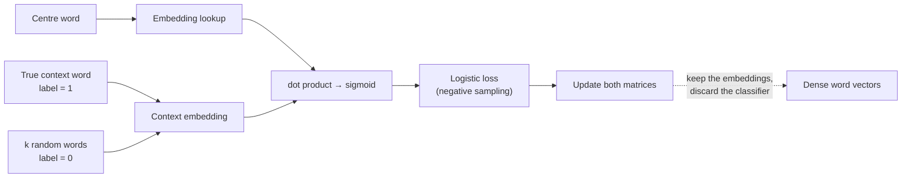

**In one line.** Train a classifier to tell real context words from random ones, and the weights you throw away the classifier for are the embeddings.

## The idea in plain words

TF-IDF vectors are long and sparse — one dimension per vocabulary word. **Word2Vec** learns short, dense ones (100–300 dims) that generalise far better.

The trick is to invent a task you do not care about. **Skip-gram** asks: given this centre word, is this other word really in its context, or did I make it up?

- Real pairs from the corpus → label 1.
- **Negative samples** — random words from the vocabulary → label 0.
- Train logistic regression on the dot product of the two embeddings.

You throw the classifier away and keep the embedding matrix. Words that predict similar contexts end up with similar vectors.

The famous `king − man + woman ≈ queen` arithmetic falls out of this, and so does the field's first serious bias problem — the same arithmetic reproduces occupational stereotypes present in the corpus.

**The idea that survived** is not word vectors. It is the training recipe: **pull related pairs together, push random pairs apart**. That is contrastive learning, and it trains every modern embedding model.



## How it works

### Why predict instead of count?

TF-IDF vectors are long (|V| = 20k–50k) and sparse. Word2vec instead trains a classifier to answer one question — *is this word likely near that word?* — and the vectors that make it answer well **are** the embeddings.

:::tip

**The reframe.** Don't record co-occurrence counts; learn vectors that *predict* co-occurrence. The supervision is free: real neighbour pairs from the text are positives, random pairs are negatives. No labels needed — it's self-supervised.

:::

:::note

**Immersion, not flashcards.** You never memorise a co-occurrence table to learn a language — you keep guessing which words go together, and your sense of each word sharpens with every guess. Word2vec does exactly that.

:::

### One-hot vs dense embeddings

A **one-hot** vector has a single 1 in a |V|-long sea of zeros. Every two words are orthogonal — "apple" is as unrelated to "orange" as to "Tuesday". A **dense embedding** places related words close together.

#### One-hot vs dense — see the difference

Toggle between representations. In one-hot, every pair has cosine 0 (orthogonal). In the dense space, "apple" and "orange" are close, "king" and "queen" are close — meaning is encoded as geometry.

:::tip

**Why dense wins.** Fewer weights to tune as ML features, better generalisation, and it captures synonymy — "car" and "automobile" land next to each other instead of in distinct, unrelated dimensions.

:::

### The word2vec idea

**Word2vec** (Mikolov et al., 2013) slides a window across a corpus. Each position has a **centre word** $c$ and **context words** $o$. Use the similarity of their vectors to predict $o$ given $c$, and nudge the vectors to make the real context more likely.

#### Slide the skip-gram window

Move the centre word along the sentence "…a tablespoon of apricot jam a pinch…". The ±2 window highlights the context words skip-gram tries to predict from the centre. Each (centre, context) pair becomes a positive training example.

:::tip

**Two architectures.** **Skip-gram** predicts context from the centre; **CBOW** predicts the centre from context. We focus on skip-gram in its efficient form: **skip-gram with negative sampling (SGNS)**.

:::

### The skip-gram classifier

Reframe learning as binary classification: given a **(word, context)** pair, output the probability it is a real neighbour pair. Similarity is the dot product; the **sigmoid** squashes it into a probability.

$$ P(+\mid w,c)=\sigma(w\cdot c)=\frac{1}{1+e^{-w\cdot c}} \qquad P(-\mid w,c)=1-P(+\mid w,c) $$

#### Dot product → probability

Drag the dot product and watch the sigmoid. A large positive dot product means "very likely a real pair" (P→1); a negative one means "probably not" (P→0). Cosine isn't a probability — the sigmoid is what we need.

:::tip

**Many contexts.** A centre word has several context words. Assuming independence, multiply: $P(+\mid w,c_{1:L})=\prod_i \sigma(w\cdot c_i)$. In log space this becomes a sum — which is the loss.

:::

### Negative sampling

With only positives, the model could cheat — make every vector identical so every dot product is huge. **Negative sampling** pairs each positive with $k$ random **noise words**, sampled by frequency^0.75, and trains the model to say "no" to them.

#### Build the training table

For the positive pair (apricot, jam), draw k negatives. Adjust k and watch the positive/negative examples. The paper: k = 5–20 for small corpora, k = 2–5 for large ones.

:::note

**Multiple-choice practice.** For the real answer "jam," the model is also shown distractors like "aardvark" and "Tolstoy" and told those are wrong. It learns the right associations only by contrasting good pairs against bad ones.

:::

:::tip

**Two matrices.** SGNS learns a **target** matrix W and a **context** matrix C — an embedding per word in each role. Keep W, or use $w_i+c_i$.

:::

### One step of gradient descent

The loss for one centre word with one positive and $k$ negatives is the negative log-likelihood. Minimising it **maximises** similarity to the true context and **minimises** similarity to noise.

$$ L=-\Big[\log\sigma(c_{\text{pos}}\!\cdot w)+\sum_{i=1}^{k}\log\sigma(-\,c_{\text{neg}_i}\!\cdot w)\Big] $$

#### The SGNS update lab (real numbers)

Target `apricot=[0.50,0.20]`, positive `jam=[0.40,0.30]`, negatives `aardvark` and `Tolstoy`. Press *step* to run one SGD update: watch the loss fall and the target vector slide toward jam, away from the noise words.

:::tip

**Worked numbers.** Forward: dot(apricot,jam)=0.260, σ=0.565; loss = 1.880. The error on the positive is σ−1 = −0.435; gradient on the target = [−0.265, −0.281]. After the step (η=0.1) the target becomes [0.527, 0.228] and dot(apricot,jam) rises 0.260 → 0.279.

:::

### CBOW & GloVe

**CBOW** flips skip-gram — predict the centre from the sum of its context. **GloVe** factorises the global co-occurrence matrix, using *ratios* of co-occurrence probabilities to encode meaning.

- **Skip-gram** — Centre → context. Better with small data and rare words. The workhorse of this session.
- **CBOW** — Context → centre. Faster, smooths over frequent words. "The product __ really good" → predict "is".
- **GloVe** — Global word-word counts. The ratio P(ice|solid)/P(ice|gas) ≫ 1 reveals relations — global stats meet vector geometry.

:::tip

**GloVe's insight.** It's not the raw co-occurrence probability that carries meaning, but the *ratio*: for a probe word, a ratio far from 1 tells you which of two words it relates to. That blends counting (global) with word2vec's geometry (local).

:::

### Key takeaways

Meaning, learned by prediction.

- **1 · Predict, don't count** — Train a classifier to tell real neighbour pairs from noise; the vectors that succeed are the embeddings. Self-supervised, no labels.
- **2 · SGNS mechanics** — P(+) = σ(w·c). k negatives per positive. Loss is the negative log-likelihood; SGD pulls toward context, pushes from noise.
- **3 · The family** — Skip-gram (centre→context), CBOW (context→centre), GloVe (global ratios). All give short dense vectors.

:::note

**The thread.** We stopped counting co-occurrences and started predicting them. A logistic classifier over dot products, trained against random negatives by gradient descent, arranges every word into a dense space where geometry is meaning. Keep the vectors, drop the classifier. Next: language modelling — assigning probabilities to whole sequences.

:::

## A real system that works this way

**Item2vec and session embeddings.** Treat a user's session as a "sentence" of product IDs and run skip-gram over it. Retailers and marketplaces have used this for years to get item similarity without any content features — it is still one of the cheapest strong recommenders.

**Modern text embedding models** (E5, GTE, BGE, OpenAI and Cohere embeddings) are trained with the same contrastive objective at a much larger scale, with hard negatives mined from a retriever instead of sampled uniformly.

## Code you can run

Skip-gram with negative sampling, implemented in NumPy so the whole mechanism is visible.

```python
import numpy as np
from collections import Counter

CORPUS = ("the cat sat on the mat . the dog sat on the log . "
          "the cat chased the mouse . the dog chased the cat . "
          "cats and dogs are pets . mice are not pets").split()

WINDOW, DIM, NEG, EPOCHS, LR = 2, 24, 5, 400, 0.05
rng = np.random.default_rng(0)

vocab = sorted(set(CORPUS))
idx = {w: i for i, w in enumerate(vocab)}
V = len(vocab)

# unigram^0.75 distribution for negative sampling (as in the paper)
freq = np.array([Counter(CORPUS)[w] for w in vocab], dtype=float) ** 0.75
noise = freq / freq.sum()

pairs = [(idx[CORPUS[i]], idx[CORPUS[j]])
         for i in range(len(CORPUS))
         for j in range(max(0, i - WINDOW), min(len(CORPUS), i + WINDOW + 1))
         if i != j and CORPUS[i] != "." and CORPUS[j] != "."]

W_in = rng.normal(0, 0.1, (V, DIM))     # centre embeddings (the ones you keep)
W_out = rng.normal(0, 0.1, (V, DIM))    # context embeddings

sigmoid = lambda x: 1.0 / (1.0 + np.exp(-np.clip(x, -30, 30)))

for epoch in range(EPOCHS):
    rng.shuffle(pairs)
    for centre, context in pairs:
        negatives = rng.choice(V, NEG, p=noise)
        targets = np.concatenate(([context], negatives))
        labels = np.concatenate(([1.0], np.zeros(NEG)))

        v = W_in[centre]
        scores = sigmoid(W_out[targets] @ v)
        err = scores - labels                       # dL/dscore

        grad_v = err @ W_out[targets]
        W_out[targets] -= LR * np.outer(err, v)
        W_in[centre] -= LR * grad_v

def nearest(word, k=3):
    v = W_in[idx[word]]
    sims = W_in @ v / (np.linalg.norm(W_in, axis=1) * np.linalg.norm(v) + 1e-9)
    order = np.argsort(-sims)
    return [(vocab[i], round(float(sims[i]), 3)) for i in order if vocab[i] != word][:k]

for w in ["cat", "dog", "pets"]:
    print(f"{w:6} → {nearest(w)}")
```

With a corpus this small the neighbours are noisy, but the mechanics are exactly those of the real algorithm — and the whole training loop is fifteen lines.

## Designing with it

**When to use which embedding**

| Need | Use |
| --- | --- |
| Word similarity in a fixed domain, tiny footprint | Static vectors (word2vec/fastText) — kilobytes, microseconds |
| Sentence/document retrieval | A modern contrastive text encoder (E5/GTE/BGE class) |
| Items, users, graph nodes | Skip-gram over interaction sequences (item2vec / node2vec) |
| Cross-lingual matching | A multilingual encoder — do not translate then embed |

**Designing an embedding pipeline**

- **Hard negatives beat random negatives.** Mine them from a first-pass retriever; this is the single biggest quality lever.
- **Normalise and store the dimension count** with the vectors. Re-embedding a corpus after a model upgrade is a migration, so version the index.
- **Evaluate with recall@k on your own data**, not on a public leaderboard. Domain shift is the norm.
- **Audit for bias** on the analogy and association tests — embeddings inherit corpus prejudice and feed downstream ranking.

## Where this stands in 2026

:::info Industry view

- Static word vectors are retired for text, but **the objective is everywhere**: item2vec, node2vec, CLIP, and every retrieval encoder use the same contrastive recipe.
- **Negative sampling is the ancestor of InfoNCE** — the loss behind the embedding models in your vector database.
- Embedding model choice is now a real infra decision: dimension count drives index size and query cost at hundreds of millions of vectors.
- One vector per word is exactly the limitation contextual embeddings removed — the cleanest one-sentence framing of the whole field.

:::

## Practice questions

<details>
<summary><strong>Q1.</strong> In one line, what does word2vec actually learn?</summary>

It trains a classifier to predict whether words co-occur; the learned weights are the embeddings, and the classifier is then discarded.<br /><em>Session 3 · conceptual</em>

</details>

<details>
<summary><strong>Q2.</strong> Explain skip-gram with negative sampling.</summary>

Binary classification: P(+|w,c) = σ(w·c). For each true (target, context) pair, draw k random negatives. Training raises σ for real neighbours and lowers it for noise words.<br /><em>Session 3 · conceptual</em>

</details>

<details>
<summary><strong>Q3.</strong> How does CBOW differ from skip-gram?</summary>

CBOW predicts the centre word from averaged context (faster, good for frequent words); skip-gram predicts context from the centre word (better for rare words, more updates).<br /><em>Session 3 · conceptual</em>

</details>

<details>
<summary><strong>Q4.</strong> The 'Ned Stark' pair has dot product 0.508. What is P(+)?</summary>

σ(0.508) = 0.624. The prediction error for this positive pair (t=1) is 0.624 − 1 = −0.376, which pulls "ned" toward "stark".<br /><em>Session 3 · numeric</em>

</details>

<details>
<summary><strong>Q5.</strong> How does GloVe differ from word2vec, and what is 'static'?</summary>

GloVe factorises the global co-occurrence matrix (ratios of probabilities) rather than a local window. Both are static — one vector per word; ELMo/BERT are contextual.<br /><em>Session 3 · conceptual</em>

</details>

## Further reading

- [Efficient Estimation of Word Representations in Vector Space (Mikolov et al.)](https://arxiv.org/abs/1301.3781) — the original word2vec paper.
- [Distributed Representations of Words and Phrases (Mikolov et al.)](https://arxiv.org/abs/1310.4546) — negative sampling and subsampling, the parts that made it fast.
- [Sentence-Transformers documentation](https://www.sbert.net/) — the practical library for modern contrastive text embeddings.
- [Text Embeddings by Weakly-Supervised Contrastive Pre-training (E5)](https://arxiv.org/abs/2212.03533) — how current retrieval encoders are trained.
- [Source lecture: nlp-s3-word2vec](https://learning.bansal-ai.in/nlp-s3-word2vec/lecture.html) — the original interactive lecture these notes were built from.

- **[Speech and Language Processing — Ch. 5, Embeddings](https://web.stanford.edu/~jurafsky/slp3/)** `book`
  Jurafsky & Martin — Skip-gram with negative sampling is derived here in full, including the training objective the companion only sketches.
- **[CS224N — NLP with Deep Learning](https://web.stanford.edu/class/cs224n/)** `course`
  Stanford CS224N — Lectures 1-2 walk through word2vec end to end, with the gradient derivation.
