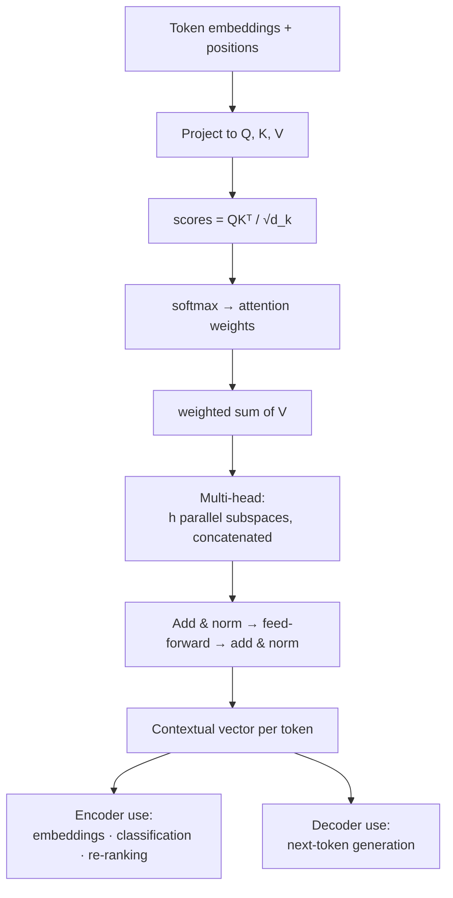

import AttentionLab from '@site/src/components/viz/AttentionLab';

**In one line.** Every token looks at every other token, decides which ones matter, and rebuilds itself as a weighted mixture of them.

## The idea in plain words

Static embeddings give "bank" one vector forever. **Contextual embeddings** give it a different vector in "river bank" and "bank loan". Attention is how.

Each token produces three projections:

- **Query** — what am I looking for?
- **Key** — what do I offer?
- **Value** — what do I contribute if chosen?

Compare every query against every key, softmax the scores into weights, and take the weighted sum of values:

`Attention(Q,K,V) = softmax(QKᵀ / √d_k) · V`

The `√d_k` divisor keeps the dot products from growing with dimension and saturating the softmax.

**Multi-head** attention runs several of these in parallel subspaces — one head can track syntax, another coreference — then concatenates them.

Stack that with feed-forward layers, residual connections and layer norm, and you have a transformer block. Two flavours:

- **Encoders** (BERT family) see the whole sequence at once → embeddings, classification, re-ranking.
- **Decoders** (GPT family) see only the past → generation.



<AttentionLab />

## How it works

### Why recurrence wasn't enough

An encoder-decoder RNN squeezes the whole input into one fixed vector — a **bottleneck** — and processes tokens sequentially, so it's slow and forgets across long distances.

:::tip

**Two fixes.** Attention removes the bottleneck (look at all inputs); the Transformer removes recurrence entirely.

:::

### Weighted average over everything

Score each key against the query, softmax the scores into weights, sum the values: Attention(Q,K,V) = softmax(QKᵀ/√dₖ)·V.

#### Attention weights

Set three relevance scores; see the softmax weights (they always sum to 1).

:::tip

**Worked.** Scores [2,1,0] → softmax = [**0.665**, 0.245, 0.090]. Output = 0.665·v₁ + 0.245·v₂ + 0.090·v₃ — mostly word 1.

:::

### Self-attention, stacked

- **Self-attention** — Every token attends to every other — context flows in one step, any distance.
- **Multi-head** — Several attentions in parallel, each learning a different relation, then concatenated.
- **Positional encoding** — Attention has no order, so positions are added so the model knows word order.
- **Residual + LayerNorm** — Around each sub-layer, to train deep stacks stably.
- **Masked attention** — In the decoder, attend only to earlier positions — no peeking at the future.
- **Feed-forward** — A per-position MLP after attention completes the block.

### BERT

Static embeddings give each word one vector ("bank" is identical everywhere). **Contextual embeddings** give each *occurrence* its own vector from the surrounding sentence.

:::tip

**BERT** is a Transformer encoder **pre-trained** with **masked language modelling** (predict hidden words using both left and right context — so it's **bidirectional**), then **fine-tuned** on your task with a small labelled set.

:::

### Key takeaways

- **1 · Attention** — Softmax-weighted average over all positions; [2,1,0]→[.665,.245,.09].
- **2 · Transformer** — Self + multi-head attention, positional encoding, residual/norm, masking.
- **3 · BERT** — Contextual embeddings; pretrain (masked LM) then fine-tune.

:::note

**The thread.** Attention replaced the RNN bottleneck with a direct, weighted look at every input; the Transformer built an entire architecture from it; and pre-training that architecture with masked language modelling gave us contextual embeddings (BERT) — one vector per occurrence, not per word — which is the foundation of modern NLP.

:::

## A real system that works this way

**Semantic search and re-ranking.** A bi-encoder embeds queries and documents separately (fast, precomputable); a cross-encoder reads the pair together and scores it (slow, far more accurate). Production systems use the bi-encoder to fetch 100 candidates and the cross-encoder to re-rank the top 25. That split is the single most common transformer design decision in industry.

**Serving cost is attention cost.** The KV cache — storing keys and values for tokens already generated — is what makes generation linear instead of quadratic per token, and it is usually the largest consumer of GPU memory in a deployment.

## Code you can run

Single-head self-attention in NumPy. Watch which word each word attends to — the mechanism is fully visible here.

```python
import numpy as np

rng = np.random.default_rng(0)
TOKENS = ["the", "animal", "did", "not", "cross", "the", "street", "because", "it", "was", "tired"]
D, D_K = 16, 8

def softmax(x, axis=-1):
    x = x - x.max(axis=axis, keepdims=True)
    e = np.exp(x)
    return e / e.sum(axis=axis, keepdims=True)

# stand-in embeddings: real ones come from a trained model
E = rng.normal(0, 1, (len(TOKENS), D))
E[8] = 0.75 * E[1] + 0.25 * rng.normal(0, 1, D)     # make "it" resemble "animal"

W_qk = rng.normal(0, 0.3, (D, D_K))      # shared Q/K space, so scores track similarity
W_q = W_k = W_qk
W_v = rng.normal(0, 0.3, (D, D_K))
Q, K, V = E @ W_q, E @ W_k, E @ W_v

scores = Q @ K.T / np.sqrt(D_K)          # (n, n)
weights = softmax(scores)                 # each row sums to 1
output = weights @ V                      # contextual representations

def top_attended(i, k=3):
    order = np.argsort(-weights[i])
    return [(TOKENS[j], round(float(weights[i][j]), 3)) for j in order[:k]]

print(f"attention matrix: {weights.shape},  row sums = {weights.sum(1).round(3)[:3]} …")
print(f"'it'   attends to → {top_attended(8)}")
print(f"'cross' attends to → {top_attended(4)}")
print(f"output shape: {output.shape}  (one contextual vector per token)")

# causal masking is the only difference for a decoder
mask = np.triu(np.ones((len(TOKENS), len(TOKENS))), k=1).astype(bool)
causal = softmax(np.where(mask, -1e9, scores))
print(f"\ncausal row for token 3 (can only see 0..3): {causal[3].round(3)}")
```

The causal mask is the entire structural difference between BERT and GPT — everything else in the block is identical.

## Designing with it

**Choosing an architecture for the job**

| Task | Model type | Why |
| --- | --- | --- |
| Embeddings, retrieval, clustering | Encoder bi-encoder | One vector per item, precomputable, millisecond search |
| Re-ranking top-k | Cross-encoder | Reads query and document together — much more accurate, too slow for the whole corpus |
| Classification, extraction at volume | Small fine-tuned encoder | 10–100× cheaper than an LLM at similar accuracy on a narrow task |
| Open-ended generation, reasoning, tool use | Decoder LLM | Generality, at a cost per token |

**The serving levers that matter**

- **KV cache** — dominates memory; paged attention (vLLM) is the standard fix for fragmentation.
- **Grouped-query attention** — fewer KV heads, large memory saving, negligible quality loss. Now standard in new models.
- **FlashAttention** — same maths, IO-aware kernel; near-free speedup.
- **Context length costs quadratically in prefill.** Long-context models still pay for it; retrieval is often cheaper than a giant context.
- **Quantisation (8-bit, 4-bit)** — the first thing to try when a model nearly fits.

**Failure mode:** lost-in-the-middle. Long contexts degrade attention to material in the centre. Put the critical passage first or last, and re-rank so the best chunk is at the top.

## Where this stands in 2026

:::info Industry view

- This is the **most load-bearing topic in modern NLP** — everything shipped today is a transformer variant.
- Attention is **memory-bound in serving**, so KV cache, FlashAttention, grouped-query attention and paged attention decide your cost per token.
- **Encoders are not obsolete**: embeddings, re-ranking and high-volume classification are still cheaper and better with a small encoder.
- Be able to explain the √d_k scaling, the causal mask, and why context length is quadratic in prefill — all three are standard interview questions.

:::

## Practice questions

<details>
<summary><strong>Q1.</strong> What two problems of RNN encoder-decoders do attention and Transformers solve?</summary>

The fixed-vector bottleneck (attention lets the decoder look at all input positions) and sequential processing / long-range forgetting (the Transformer drops recurrence for self-attention).<br /><em>Session 11 · conceptual</em>

</details>

<details>
<summary><strong>Q2.</strong> Write the scaled dot-product attention formula and say what softmax does.</summary>

Attention(Q,K,V) = softmax(QKᵀ/√dₖ)·V. Softmax turns the raw relevance scores into weights that are positive and sum to 1, so the output is a weighted average of the values.<br /><em>Session 11 · conceptual</em>

</details>

<details>
<summary><strong>Q3.</strong> Scores are [2, 1, 0]. Compute the attention weights.</summary>

softmax(2,1,0) = [0.665, 0.245, 0.090] (sums to 1). The output is 0.665·v₁ + 0.245·v₂ + 0.090·v₃.<br /><em>Session 11 · numeric</em>

</details>

<details>
<summary><strong>Q4.</strong> What do multi-head attention and positional encoding each add?</summary>

Multi-head: several parallel attentions, each learning a different relation, then concatenated. Positional encoding: adds order information, since attention itself is order-agnostic.<br /><em>Session 11 · conceptual</em>

</details>

<details>
<summary><strong>Q5.</strong> How does a contextual embedding differ from word2vec, and how is BERT trained?</summary>

word2vec gives each word one static vector; a contextual embedding gives each occurrence its own vector from the surrounding sentence. BERT is pre-trained with masked language modelling (bidirectional), then fine-tuned on a task.<br /><em>Session 11 · conceptual</em>

</details>

## Further reading

- [Attention Is All You Need (Vaswani et al.)](https://arxiv.org/abs/1706.03762) — the original architecture.
- [The Illustrated Transformer (Jay Alammar)](https://jalammar.github.io/illustrated-transformer/) — the clearest visual explanation available.
- [BERT: Pre-training of Deep Bidirectional Transformers](https://arxiv.org/abs/1810.04805) — the encoder side and contextual embeddings.
- [FlashAttention](https://arxiv.org/abs/2205.14135) — why the same maths runs several times faster.
- [vLLM documentation](https://docs.vllm.ai/en/latest/) — paged attention and production LLM serving.
- [Source lecture: nlp-s11-contextual-embeddings](https://learning.bansal-ai.in/nlp-s11-contextual-embeddings/lecture.html) — the original interactive lecture these notes were built from.

- **[Speech and Language Processing (3rd ed. draft)](https://web.stanford.edu/~jurafsky/slp3/)** `book`
  Jurafsky & Martin — The definitive NLP textbook; chapters posted free as they are revised.
- **[Stanford CS224n](https://web.stanford.edu/class/cs224n/)** `course`
  Stanford — NLP with deep learning — slides, notes and lecture videos.
- **[The Illustrated Transformer](https://jalammar.github.io/illustrated-transformer/)** `docs`
  Jay Alammar — The clearest visual walkthrough of attention and the Transformer.
