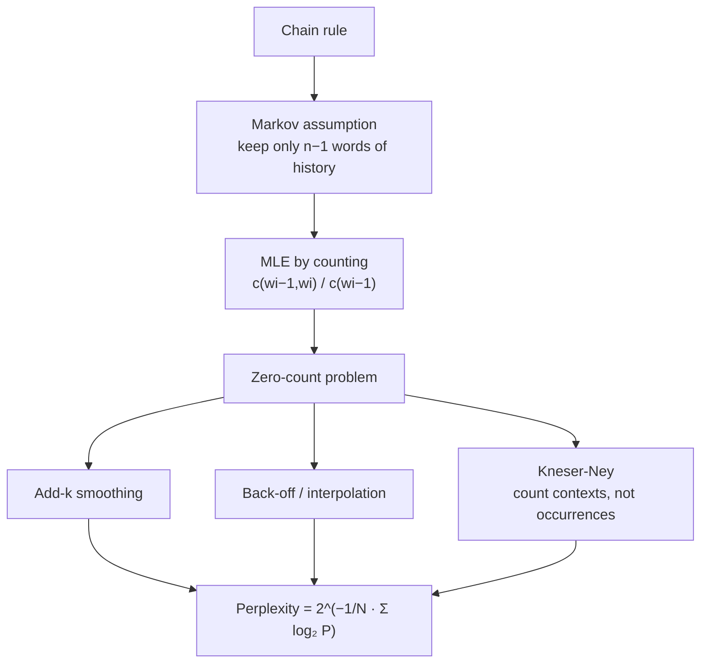

**In one line.** Predict the next word from the last few words by counting — and then spend all your effort handling the counts you never saw.

## The idea in plain words

A language model assigns probability to text. The chain rule makes that exact:

`P(w₁…wₙ) = Π P(wᵢ | w₁…wᵢ₋₁)`

That conditional is impossible to estimate — no corpus contains every prefix. So we make the **Markov assumption**: only the last *n−1* words matter. A bigram model conditions on one word, a trigram on two.

Estimation is then just counting:

`P(wᵢ | wᵢ₋₁) = count(wᵢ₋₁, wᵢ) / count(wᵢ₋₁)`

And immediately you hit the wall: **any unseen pair gets probability zero**, which makes the probability of the whole sentence zero. The fixes:

- **Add-k (Laplace)** smoothing — pretend you saw everything k times. Crude but simple.
- **Back-off** — no trigram evidence? Fall back to the bigram, then the unigram.
- **Interpolation** — always blend all three with learned weights.
- **Kneser-Ney** — the best classical method: it asks not "how often does this word appear" but "in how many *different* contexts does it appear". "Francisco" is frequent but only ever after "San".

Evaluate with **perplexity** — the inverse probability of the test set, normalised by length. Lower is better; it is roughly "how many equally likely words is the model choosing between at each step".



## How it works

#### The whole lecture as one map

Click any box to jump to that chapter. We go left to right. First, what a model is. Then how to turn a sentence into a probability. Then how to read those numbers off real text. Then how to fix what breaks. Last, how to score the result.

#### The big picture

Each node is a chapter. Hover to highlight, click to jump. Watch the path: build the score, count it, fix it, measure it.

- **The rhythm** — Every chapter has the same shape. A hook, an analogy, the math step by step, a worked example, an ML link, a pitfall, and a lab.

### What a language model is

A **language model** (LM for short) learns to predict the probability of a sequence of words. "Probability" here is a score between 0 and 1. High means "this sounds like real language". Low means "this looks odd".

:::note

**Analogy first.** Think of your phone keyboard. You type "See you", and it offers "tomorrow", "soon", and "later". It is ranking next words by how likely each is after "See you". That ranking is a language model at work.

:::

#### The two questions, one coin

The first question is about a **whole sentence**. We write the probability of a sentence $W$ as $P(W)$. Here $W$ is the full string of words, like "the cat sat".

$$ W \;=\; w_1,\, w_2,\, \ldots,\, w_n $$

So $w_1$ is the first word, $w_2$ the second, and $w_n$ the last. The second question is about the **next word**. The bar "$\mid$" means "given". We write the next-word probability like this:

$$ P(w_n \mid w_1, w_2, \ldots, w_{n-1}) $$

Read that as "the probability of word number $n$, given all the words before it". The two questions share the same underlying probabilities, as the next chapters show.

- **Worked example — reading the notation** — Take the sentence "the cat sat". The next-word probability for "sat" is: $$ P(\text{sat} \mid \text{the cat}) $$ In words: how likely is "sat" right after "the cat"? A good model gives this a fair-sized number, because cats do sit. The whole-sentence score $P(\text{the cat sat})$ is built from three such next-word steps, one per word.

#### Rank the next word

Pick a context on the left. The model ranks the words that could come next, tallest bar first. **What to look for:** the context changes the ranking — "See you" wants "tomorrow", but "a piece of" wants "cake".

#### Where this shows up in ML

Every large language model behind a modern chat assistant is this exact idea, scaled up. The model is trained to predict the next word from the words before it. Generating text is just doing that over and over: predict a word, add it, predict again.

:::tip

**Pitfall — probability is not truth.** $P(W)$ is "does this sound like our training language", not "is this true". A false but fluent sentence can still score high. The model judges style, not facts.

:::

### Why language models matter

Many language tasks must choose between options that sound almost the same. A good language model picks the natural one. Here are the three examples from the slides.

:::note

**Analogy first.** A spelling helper sees "about fifteen minuets". It knows "minutes" is far more common right there. So it quietly fixes the word. That "more common, so more likely" judgement is the language model.

:::

#### Three real choices

**Machine translation** (turning text from one language into another) prefers the fluent phrasing:

$$ P(\text{high winds tonight}) \;>\; P(\text{large winds tonight}) $$

**Spelling correction** uses the same trick — the right word in context wins:

$$ P(\text{about fifteen minutes from}) \;>\; P(\text{about fifteen minuets from}) $$

**Speech recognition** (turning sound into text) must pick which words were spoken. The symbol "$\gg$" means "much greater than":

$$ P(\text{I saw a van}) \;\gg\; P(\text{eyes awe of an}) $$

The two phrases can sound alike out loud. But only one reads like English, and the model knows the difference.

#### Be the judge

Switch between the three tasks. Each shows a good candidate and a bad one. **What to look for:** the green (fluent) bar always beats the red (odd) bar. That gap is the value of a language model.

#### Where this shows up in ML

Translation, speech, and spelling systems once used a language model as a **re-ranker**. The main system proposes options; the language model scores them, and the best one wins. Modern end-to-end models fold this scoring inside themselves, but the principle is unchanged.

:::tip

**Pitfall — "likely" is not "correct".** The model only ranks by fluency. It must be paired with a system that proposes sensible options in the first place.

:::

### The chain rule

A whole sentence is hard to score at once. So we score it one word at a time. Each word is judged by the words already said. Multiply those judgements and you get the sentence score. That is the **chain rule**.

:::note

**Analogy first.** Think of telling a story to a friend. Each new word depends on what you just said. "Once upon a ___" almost forces "time". The sentence grows one believable step at a time. The chain rule is the math of that.

:::

#### Step 1 — conditional probability

**Conditional probability** is the chance of one event given that another happened. We write "the probability of $B$ given $A$" as $P(B \mid A)$. Its definition divides the chance of both by the chance of $A$:

$$ P(B \mid A) \;=\; \frac{P(A, B)}{P(A)} $$

Here $P(A,B)$ is the chance that $A$ and $B$ both happen. Rearranging gives a product form:

$$ P(A, B) \;=\; P(A)\,P(B \mid A) $$

#### Step 2 — chain it over many words

Apply that rule again and again. For a sequence $x_1, x_2, \ldots, x_n$, the **chain rule** is. The big symbol $\prod$ (capital pi) means "multiply all of these":

$$ P(x_1, x_2, \ldots, x_n) \;=\; \prod_{i=1}^{n} P(x_i \mid x_1, \ldots, x_{i-1}) $$

So a sentence's probability is a product. Each factor is one word given every word before it.

#### Step 3 — on a real sentence

Take "its water is so transparent". The chain rule writes five factors:

$$ \begin{aligned} P(\text{its water is so transparent}) =\;& P(\text{its}) \\ \times\;& P(\text{water} \mid \text{its}) \\ \times\;& P(\text{is} \mid \text{its water}) \\ \times\;& P(\text{so} \mid \text{its water is}) \\ \times\;& P(\text{transparent} \mid \text{its water is so}) \end{aligned} $$

Each factor is read off real text as a ratio of counts. Here "$\#$" means "the number of times this appears":

$$ P(\text{water} \mid \text{its}) \;=\; \frac{\#(\text{its water})}{\#(\text{its})} $$

#### Build the sentence probability, step by step

Press **Next word** to add one factor at a time. Each factor is a probability below 1, so the running product shrinks. **What to look for:** the score drops with every word. Long sentences are always rare. That is why we move to log space later.

#### Where this shows up in ML

The chain rule is exactly how a modern language model generates text. It outputs $P(\text{next word} \mid \text{everything so far})$, samples one word, appends it, and repeats. The product of those steps is the probability of the text it wrote.

:::tip

**Pitfall — order matters.** $P(B \mid A)$ is not $P(A \mid B)$. "dog bites man" and "man bites dog" use the same words but mean very different things.

:::

### The Markov assumption

The chain rule is exact but heavy. Its last factor needs every earlier word. Real text rarely repeats a long exact phrase, so those counts are zero or shaky. The fix is named after the mathematician **Andrei Markov**.

:::note

**Analogy first.** When you merge onto a busy road, you mostly watch the car right next to you, not every car a mile back. The nearby car carries almost all the information you need now. The Markov shortcut keeps only that nearby context.

:::

#### Drop the distant past

The exact factor uses all of $w_1$ through $w_{i-1}$:

$$ P(w_i \mid w_1, \ldots, w_{i-1}) $$

The Markov assumption replaces it with a short window of the last $k$ words. The symbol "$\approx$" means "is about equal to":

$$ P(w_i \mid w_1, \ldots, w_{i-1}) \;\approx\; P(w_i \mid w_{i-k}, \ldots, w_{i-1}) $$

Here $k$ is the window size, a small whole number we choose. If $k=1$ we keep just the last word. If $k=2$ we keep the last two. Bigger $k$ means more context, but those longer phrases get harder to find.

- **Worked example — from 4 words of history to 1** — For "so transparent that ___", the exact factor needs the whole left side. With $k=1$ we keep only "that": $$ P(? \mid \text{...so transparent that}) \;\approx\; P(? \mid \text{that}) $$ "that" is a common word, so $P(? \mid \text{that})$ is easy to count. The long exact history "so transparent that" is rare, so its count would be unreliable. We trade a little accuracy for a number we can actually measure.

#### Slide the memory window

Slide $k$, the number of past words kept. The kept words light up; the dropped words fade. **What to look for:** at $k=1$ almost the whole sentence goes grey — a bigram remembers almost nothing, which is its weakness and its speed.

#### Where this shows up in ML

Classic n-gram models are pure Markov models: a fixed short window. Modern neural models break this limit, reading long context with attention. So the Markov assumption is the simple baseline that later models were built to beat.

:::tip

**Pitfall — it is only an approximation.** Some real sentences depend on far-back words. We accept a small error in exchange for counts we can estimate.

:::

### Unigram, bigram, and n-gram

We name a model by its window size. An **n-gram** keeps $n$ words, counting the word we predict. So $n=1$ keeps no history, $n=2$ keeps one previous word, and so on.

:::note

**Analogy first.** Picture blinders of different widths. The unigram wears full blinders and sees nothing before. The bigram peeks at the one word just behind. The trigram peeks at two. Wider view, better guess, but rarer sights.

:::

#### Unigram (n = 1): no history

Each word stands alone, so the sentence is just a product of single-word probabilities:

$$ P(w_1, \ldots, w_n) \;\approx\; \prod_{i=1}^{n} P(w_i) $$

This treats a sentence as a bag of words with no order. Weak, but a useful floor.

#### Bigram (n = 2): one previous word

Each factor uses only the word before it:

$$ P(w_i \mid w_1, \ldots, w_{i-1}) \;\approx\; P(w_i \mid w_{i-1}) $$

We mark the start with a token $\langle s \rangle$ and the end with $\langle /s \rangle$. These let the model learn which words start and end sentences. For "I want to eat healthy food":

$$ \begin{aligned} P(\ldots) \approx\;& P(\text{I} \mid \langle s \rangle)\,P(\text{want} \mid \text{I})\,P(\text{to} \mid \text{want}) \\ \times\;& P(\text{eat} \mid \text{to})\,P(\text{healthy} \mid \text{eat})\,P(\text{food} \mid \text{healthy}) \\ \times\;& P(\langle /s \rangle \mid \text{food}) \end{aligned} $$

#### Trigram and beyond — and a limit

A **trigram** keeps two previous words, a **4-gram** three, a **5-gram** four. More context helps, up to a point. But even big n-grams miss **long-distance dependencies** — links between far-apart words:

:::note

Read this example. "The computer**s** ... on the fifth floor **are** crashing." The choice of "are" depends on "computers". That word is ten places back. No small window can see that far.

:::

#### Switch the model order

Pick unigram, bigram, or trigram. The factorization of "I want to eat" rewrites itself, and each arrow shows how far each word looks back. **What to look for:** more order means longer arrows (more context) but rarer phrases to count.

#### Where this shows up in ML

The jump from bigram to trigram to higher orders mirrors the history of language modelling. Each step bought a little more context. The long-distance problem above is exactly what recurrent networks and then transformers were invented to solve.

:::tip

**Pitfall — bigger n is not always better.** As $n$ grows, exact phrases get rare, so most counts fall to zero. The sweet spot for classic models is usually trigram to 5-gram.

:::

### Estimating by counting (MLE)

Where do the probabilities come from? We read them off a **corpus** — a large body of text we treat as training data. The rule for turning counts into probabilities is the **maximum likelihood estimate**, or **MLE**.

:::note

**Analogy first.** Want the chance of rain after a cloudy morning? Look back over many days. Of all cloudy mornings, what fraction were followed by rain? That fraction is your estimate. The MLE does the same with word pairs.

:::

#### Count and divide

The MLE of a bigram probability is the count of the pair, divided by the count of the first word:

$$ P(w_i \mid w_{i-1}) \;=\; \frac{\operatorname{count}(w_{i-1}, w_i)}{\operatorname{count}(w_{i-1})} $$

Here $\operatorname{count}(w_{i-1}, w_i)$ is how many times the pair "$w_{i-1}\ w_i$" appears. And $\operatorname{count}(w_{i-1})$ is how many times the first word appears. "Maximum likelihood" means this choice makes the training text as likely as possible. For now, read it as "count and divide".

- **Worked example — one ratio** — Suppose "the dog" appears 50 times and "the" appears 1000 times. Then: $$ P(\text{dog} \mid \text{the}) = \frac{50}{1000} = 0.05 $$ So 5 percent of the time, "the" is followed by "dog". That single number came straight from two counts.

#### Count-and-divide calculator

Slide the pair count and the first-word count. The bar and the printed fraction update live. **What to look for:** the probability is just one count over another. Raise the pair count and it climbs; raise the first-word count and it falls.

#### Where this shows up in ML

"Count and divide" is the simplest way to fit a model to data. Neural models replace counting with gradient descent, but the goal is the same: choose probabilities that make the training data most likely. That is the maximum-likelihood principle.

:::tip

**Pitfall — the MLE gives unseen pairs a zero.** Any pair it never saw gets probability exactly 0. That seems fair but is dangerous, as the zeros chapter shows.

:::

### A tiny corpus, fully counted

Let us make the MLE concrete on the slide's three-sentence corpus. The angle-bracket tokens mark the start and end of each sentence.

- ⟨s⟩ I am Sam ⟨/s⟩ ⟨s⟩ Sam I am ⟨/s⟩ ⟨s⟩ I do not like green eggs and ham ⟨/s⟩

:::note

**Analogy first.** With only three short sentences we can count by hand, like tallying votes on paper. Scan the text, mark each pair, then divide. Slow, but completely honest.

:::

#### First, single-word counts

"I" appears 3 times. "am" appears 2 times. "Sam" appears 2 times. The start token $\langle s \rangle$ appears 3 times, once per sentence. Now the bigram MLEs are just count-and-divide.

- **Worked example — six bigram MLEs (every step)** — Notice the two factors after "I": $P(\text{am}\mid\text{I})=2/3$ and $P(\text{do}\mid\text{I})=1/3$. They add to 1, because "am" and "do" are the only words that ever follow "I" here.

#### Click a first word, watch counts become probabilities

Pick the first word of a pair. The grid shows what follows it and how often, then turns those counts into probabilities that sum to 1. **What to look for:** pairs never seen sit at zero. For example, "do" is never followed by "Sam", so that probability is 0.

#### Where this shows up in ML

This hand count is exactly what a training loop does, only on billions of words. The model builds a giant table of which word follows which, then normalises each row into probabilities. Same idea, bigger table.

:::tip

**Pitfall — unseen pairs are zero here too.** $P(\text{Sam}\mid\text{do})$ is 0, since "do Sam" never appears. A real test sentence will hit such a zero, and that breaks things.

:::

### The Berkeley Restaurant Project

The **Berkeley Restaurant Project** is 9222 sentences people spoke to a restaurant-information system. The slides give real bigram counts. Let us read several probabilities off them, then score a whole sentence.

:::note

**Analogy first.** The method is the same as the tiny corpus: count and divide. We just have real, messy numbers now. Some pairs are common, some are rare, and some never appear at all.

:::

#### Raw bigram probabilities (every one worked)

Each line below is count of the pair over count of the first word. Some pairs, like "i to", simply never appear, so they are 0.

The big number is $P(\text{to} \mid \text{want}) = 0.66$. Two out of three times, "want" is followed by "to". That is the model learning real grammar from counts. The slides also list more facts, two of which are zero:

| pair | P | pair | P |
| --- | --- | --- | --- |
| english \| want | 0.0011 | chinese \| want | 0.0065 |
| to \| want | 0.66 | eat \| to | 0.28 |
| food \| to | 0 | want \| spend | 0 |
| i \| ⟨s⟩ | 0.25 |  |  |

#### Scoring a whole sentence

Now score "$\langle s \rangle$ I want english food $\langle /s \rangle$" by multiplying its bigram factors. The slides report the answer as 0.000031. The lab replays every step.

#### Score the sentence, one factor at a time

Press **Next factor** to multiply in one bigram probability. **What to look for:** each factor is below 1, so the running product dives to a tiny 0.000031. That is the exact number from the slides.

#### Where this shows up in ML

This is how an n-gram model scores or generates restaurant queries. Multiply the learned bigram probabilities along the sentence. A speech system computes this for several candidate sentences and keeps the highest.

:::tip

**Pitfall — the product gets tiny fast.** Five factors already give about 0.00003. A long sentence can underflow to zero on a computer, which is why we move to log space next.

:::

### Working in log space

Multiplying many small probabilities is risky. The product shrinks toward zero and can hit **underflow**, where the number is too small to store and becomes exactly 0. The fix is to work with **logarithms**.

:::note

**Analogy first.** Fold a long strip of paper. Each fold halves the length; after a few folds it is too thin to measure. But counting the folds is easy: 1, 2, 3, 4. The log is like counting folds instead of measuring the sliver.

:::

#### Logs turn multiplying into adding

The key fact: the log of a product is the sum of the logs.

$$ \log(p_1 \cdot p_2 \cdot p_3 \cdot p_4) \;=\; \log p_1 + \log p_2 + \log p_3 + \log p_4 $$

So we store and add log-probabilities. Each $\log p_i$ is a moderate negative number, easy to handle. Two wins. We avoid underflow, because we never form the tiny product. And adding is faster than multiplying on most hardware.

#### Watch the product crash, then the log-sum stay safe

Add words one at a time. Toggle between the raw product and the log-sum. **What to look for:** the product (left) dives to a flat zero. The log-sum (right) steps down gently and never vanishes. Same calculation, safe numbers.

#### Where this shows up in ML

Almost every probabilistic model is trained and scored in log space. The standard training loss, **cross-entropy**, is an average of negative log-probabilities. So log space is not just a trick here; it is the everyday language of model training.

:::tip

**Pitfall — logs of probabilities are negative.** A "higher" log-probability means closer to zero, that is, less negative. Do not flip the sign in your head.

:::

### Web-scale counts

Google released n-gram counts from a huge sweep of the web. These show how often each short phrase appears across trillions of words. With enough text, even rare phrases get counted.

:::note

**Analogy first.** Imagine a tally of every short phrase ever written on the public web. "serve as the" followed by "incoming", "following", "index", each with its own count. That tally is what Google shared.

:::

#### More text, steadier estimates

The phrase "serve as the" is followed by many different words, each with a count, such as "serve as the incoming" and "serve as the following". The bigger the text, the more continuations we can count with confidence. This is the upside of scale: fewer zeros, steadier estimates.

#### Grow the corpus, watch zeros fill in

Slide the corpus size from a tiny sample up to web scale. Each cell is a possible continuation; grey means "never seen yet". **What to look for:** as the corpus grows, grey zero cells light up. But a few stubborn rare phrases stay grey, so zeros never fully vanish.

#### Where this shows up in ML

Large public count releases and huge text crawls are the fuel of modern language models. The lesson holds at every scale: more text means better estimates of what word comes next.

:::tip

**Pitfall — even web scale runs out.** Most possible long phrases were still never written, so zeros never fully disappear. Scale reduces the problem but does not remove it.

:::

### Overfitting and zeros

Plain n-grams only work when the test text looks like the training text. When a new word pair appears, the model breaks sharply: it says "probability zero", and one zero makes a whole sentence score zero.

:::note

**Analogy first.** A chef who only cooks dishes from one cookbook. Ask for a reasonable dish not in the book, and the chef says "impossible". The dish is fine; the chef is just too rigid. A zero-probability pair is that "impossible".

:::

#### Overfitting, then zeros

**Overfitting** means fitting the training text too closely and failing on new text. N-grams overfit because they trust their exact counts. The sharpest form is **zeros**. Suppose training has "denied the allegations / reports / claims / request". The test says "denied the offer". We never saw that pair, so:

$$ P(\text{offer} \mid \text{denied the}) \;=\; \frac{0}{\#(\text{denied the})} \;=\; 0 $$

Because the sentence is a product, this single zero zeros the whole sentence:

$$ P(\text{test sentence}) \;=\; (\ldots) \times 0 \times (\ldots) \;=\; 0 $$

Worse, perplexity (our score, defined later) divides by a probability. A zero makes perplexity infinite, so we cannot even score the model. One unseen pair has broken everything.

#### One zero nukes the sentence

Each bar is one bigram factor in a sentence. Click any bar to set that factor to zero (an unseen pair). **What to look for:** the moment any one factor hits zero, the whole sentence probability drops to 0, no matter how good the others are.

#### Where this shows up in ML

Overfitting is a universal worry, not just for n-grams. The fixes share a flavour everywhere: do not trust the training data too much. Smoothing, next, is the n-gram version of that caution.

:::tip

**Pitfall — zero is not "very unlikely".** "Very unlikely" is a small positive number. A hard zero says "cannot happen", which is almost never true for a sensible phrase.

:::

### Add-1 (Laplace) smoothing

**Laplace smoothing**, also called **Add-1 smoothing**, pretends we saw every word pair one extra time. It steals a little probability from the common pairs and hands it to the unseen ones, so no pair is zero.

:::note

**Analogy first.** A teacher gives every student one free mark before grading. A student who scored zero now has one mark. The top students barely notice. That free mark is the "add one".

:::

#### The smoothed formula

Recall the plain MLE for one word: "bagel" appears 400 times in a million words, so $P(\text{bagel}) = 400/1{,}000{,}000 = 0.0004$. Add-1 changes the bigram rule. Add 1 to every pair count. To keep probabilities summing to 1, add the vocabulary size $V$ (the number of different words) to the denominator:

$$ P^{*}(w_i \mid w_{i-1}) \;=\; \frac{\operatorname{count}(w_{i-1}, w_i) + 1}{\operatorname{count}(w_{i-1}) + V} $$

The star in $P^{*}$ marks the smoothed version. Why add $V$ below? Because we added 1 to each of the $V$ possible next words, so the bottom grows by $V$. That keeps every row a proper probability.

- **Worked example — add-1 Berkeley bigrams (V = 1446)** — $P(\text{want}\mid\text{i})$ fell from 0.33 to 0.21. And $P(\text{to}\mid\text{i})$ rose from 0 to 0.00025. The zero is gone, but the big value shrank a lot.

#### Reconstituted counts: how blunt is it?

Turn the smoothed probability back into an effective count, the **reconstituted count** $c^{*}$, and compare to the real count:

$$ c^{*}(w_{i-1}, w_i) \;=\; \frac{\big(\operatorname{count}(w_{i-1}, w_i) + 1\big)\,\operatorname{count}(w_{i-1})}{\operatorname{count}(w_{i-1}) + V} $$

For "i want" (real count 827, first-word count 2533, $V=1446$): $c^{*} = (828 \times 2533)/3979 \approx 527$. A drop from 827 to 527 is huge. About 300 sightings of a common pair were given away. That is why add-1 is a **blunt instrument**.

#### Move the smoothing dial

Slide the add-$k$ amount and the vocabulary size $V$. Watch a common pair and an unseen pair. **What to look for:** as $k$ or $V$ grows, the green seen-pair bar shrinks and the red unseen-pair bar climbs. Probability mass flows from seen to unseen.

:::tip

**When add-1 is fine.** It hurts most when there are many zeros to feed. Where zeros are rare, the "+1" and "+V" barely move the numbers. An example is **text classification**, which means sorting documents into categories. So the slides say: do not use add-1 for n-grams. But do use it for classification. There it is the standard fix inside a **naive Bayes** classifier.

:::

#### Where this shows up in ML

Adding a small constant to counts is a form of **regularisation**. That means a gentle pull from the raw data toward a safer guess. The same idea appears as "pseudo-counts" in Bayesian models. It also appears as label smoothing in neural networks.

:::tip

**Pitfall — the bigger V, the worse it gets.** With tens of thousands of words, the "+V" swamps the real counts. So add-1 is rarely used for n-grams in practice.

:::

### Backoff and interpolation

A long context is precise but rare. A short context is rough but common. So when the long context has no evidence, lean on the short one. Two methods do this: **backoff** and **interpolation**.

:::note

**Analogy first.** Ask a local for a restaurant on your exact street. If they know it, great (the trigram). If not, they suggest the neighbourhood (the bigram). If even that is blank, a city-wide favourite (the unigram). You widen until you get a real answer.

:::

#### Backoff: drop context only when needed

**Backoff** uses the longest context that has good evidence, and steps down only when it must. Use the trigram if seen enough; else back off to the bigram; else to the unigram. Each step drops one word of context.

#### Interpolation: always blend all orders

**Interpolation** mixes all orders every time. Give each a weight and add them. **Linear interpolation** for a trigram is. The weights $\lambda$ (lambda) say how much to trust each order:

$$ \hat{P}(w_n \mid w_{n-2}, w_{n-1}) \;=\; \lambda_1 P(w_n \mid w_{n-2}, w_{n-1}) + \lambda_2 P(w_n \mid w_{n-1}) + \lambda_3 P(w_n) $$

Here $\hat{P}$ is the blended estimate. The weights must add to 1, so the blend stays a proper probability:

$$ \lambda_1 + \lambda_2 + \lambda_3 \;=\; 1 $$

The weights can also depend on context, so we trust the trigram more when we have seen that context often. The slides note interpolation usually beats backoff.

#### The interpolation mixer

Set the trigram and bigram weights. The unigram weight fills the rest, so all three always sum to 1. **What to look for:** the blended probability (green) moves between the three orders' values. Pour weight onto the order you trust; the total stays 1.

#### The backoff ladder

Press **try / back off** to attempt the current order; if it has no evidence, step down. **What to look for:** you only drop to a shorter context when the longer one gives a zero. Backoff keeps the most context it can.

#### Where this shows up in ML

Blending several models with weights is called an **ensemble** (a team of models voting together). Interpolation is a small, classic ensemble. Modern systems blend many models too, often with learned weights, for the same reason: the team beats any single member.

:::tip

**Pitfall — the weights must sum to 1.** Otherwise the blend is no longer a probability. Backoff also needs a discount, so the probabilities still sum to 1 after stealing mass for lower orders.

:::

### Setting the weights with a held-out set

The weights $\lambda$ do not come from the training set. And they never come from the test set. We use a third slice of data instead: the **held-out set**.

:::note

**Analogy first.** Studying for an exam. You learn from your notes (training). You rehearse on a mock exam to fine-tune your strategy (held-out). Then you sit the real exam once, to measure how you did (test). Using the real exam to practise would be cheating.

:::

#### Three splits, three jobs

The **training set** fixes the n-gram probabilities by counting. The **held-out set** chooses the weights $\lambda$ that make that held-out text most likely. The **test set** is touched once, at the end, for a fair final score. The recipe: fix the probabilities on training, search weights to maximise the held-out probability, then freeze and report on test.

#### Tune lambda on held-out, judge on test

Slide $\lambda$. The held-out curve peaks at the best weight; a marker shows where you are. Press **lock in best** to snap to the peak, then read the honest test score. **What to look for:** the best $\lambda$ is the one that maximises the held-out probability — not the training one.

#### Where this shows up in ML

Every machine-learning project uses this split. The held-out set is the **validation set** that tunes settings you cannot learn directly, called **hyperparameters**. The test set gives the honest final number. Mixing them up is one of the most common and serious mistakes in the field.

:::tip

**Pitfall — never tune on the test set.** If you peek at the test set while choosing weights, your final score is too optimistic and cannot be trusted.

:::

### Unknown words and the UNK token

Not a new pair, but a brand-new word. We need a plan for these **out-of-vocabulary** words, often shortened to **OOV**.

:::note

**Analogy first.** A form with a final option labelled "Other". You cannot list every possible answer, so "Other" catches the rest. The unknown-word token is the "Other" box of a language model.

:::

#### The plan: one bucket for the unknown

A **closed vocabulary** assumes every test word is already known. An **open vocabulary** allows new words at test time, which is realistic. To handle it, use a special token $\langle\text{UNK}\rangle$, meaning "unknown word". The plan has three steps. First, fix a vocabulary, a lexicon $L$ of size $V$. Second, in training, map every word not in $L$ to $\langle\text{UNK}\rangle$, and learn its probability like any word. Third, at test time, replace any unseen word with $\langle\text{UNK}\rangle$ and use that probability.

#### Send unseen words to UNK

Pick a test sentence. Words in the fixed vocabulary stay. Words outside it get mapped to $\langle\text{UNK}\rangle$. **What to look for:** the model never sees a true "zero word". Every stranger lands in the one UNK bucket, which has a learned probability.

#### Where this shows up in ML

Modern models avoid pure unknown words with **subword tokens**. They split a strange word into known pieces. But the spirit is the same as $\langle\text{UNK}\rangle$. Always have a way to score input you did not expect.

:::tip

**Pitfall — pick the vocabulary before training.** If you choose which words count by peeking at the test set, you are cheating again, in a subtle way.

:::

### Pruning and stupid backoff

At web scale, count tables get too big to store, and full smoothing gets too slow. Two tricks handle this: **pruning** and **stupid backoff**.

:::note

**Analogy first.** Packing for a long trip with a small bag. You drop the items you used only once. And you stop fussing over neat folding, to save time. Pruning drops rare items; stupid backoff is the quick, good-enough fold.

:::

#### Pruning: drop the singletons

**Pruning** only stores n-grams whose count is above a threshold. In particular, drop the **singletons** of the higher orders — the long phrases seen exactly once. This keeps the table small with little loss.

#### Stupid backoff: a fast score

**Stupid backoff** (Brants and colleagues, 2007) does no discounting. If the longer phrase was seen, use its plain relative frequency. If not, back off and multiply by a fixed weight, commonly 0.4. We call it $S$, not $P$, because it is not a true probability:

$$ S(w_i \mid w_{i-k+1}^{\,i-1}) = \begin{cases} \dfrac{\operatorname{count}(w_{i-k+1}^{\,i})}{\operatorname{count}(w_{i-k+1}^{\,i-1})}, & \text{if count} > 0 \\[1em] 0.4 \cdot S(w_i \mid w_{i-k+2}^{\,i-1}), & \text{otherwise} \end{cases} $$

The top case is count of the long phrase over count of its context. The bottom case drops one word and multiplies by 0.4. That 0.4 is fixed, not tuned. The score $S$ is good for ranking, which is all a huge system needs.

#### Stupid backoff, step by step

Pick whether each order was seen. The score either uses the count ratio or multiplies a shorter score by 0.4. **What to look for:** every backoff step costs a fixed 0.4 penalty — cheap, no discounting math, good enough to rank.

#### Where this shows up in ML

Stupid backoff is a lesson in scale. At a billion words, a simple method that runs fast beats a careful method too slow to use. Engineers make this trade often: a rough tool that scales can win over a precise tool that does not.

:::tip

**Pitfall — S is not a real probability.** It does not sum to 1, so you cannot plug it into perplexity. It is for ranking only.

:::

### Extrinsic vs intrinsic evaluation

We train on a training set and test on an *unseen* test set. Then we measure. There are two kinds of measurement: **extrinsic** (the real job) and **intrinsic** (a quick stand-in).

:::note

**Analogy first.** To compare two car engines, the true test is a real race (extrinsic), but it takes days to set up. A quick test is a dynamometer reading in the garage (intrinsic): fast, a decent hint, but not the race itself.

:::

#### The two measures

An **extrinsic** evaluation (also called **in-vivo**, "in the living task") puts models A and B inside a real application. That could be a spell checker, a speech recogniser, or a translator. It compares their accuracy. This is best, because it scores what we care about. The cost is time: days or weeks. An **intrinsic** evaluation scores the model directly, with no task. The standard one is **perplexity** (next chapter). It is fast. But it is only a good guide when the test text looks like the training text. So perplexity is best for quick pilot checks.

|  | Extrinsic (in-vivo) | Intrinsic (perplexity) |
| --- | --- | --- |
| what it measures | real task accuracy | model's surprise on text |
| speed | slow (days) | fast |
| trust | gold standard | good guide only |
| best for | final decisions | quick pilots |

#### Fast filter, slow final test

Slide how many model ideas you have. See the time for the fast intrinsic check versus the slow extrinsic test. **What to look for:** the fast score lets you screen many ideas cheaply. Then you pay for the slow real test on the few survivors.

#### Where this shows up in ML

Every field faces this split. A search engine has fast offline scores and slow real user tests. Teams use the fast score to filter ideas, then run the expensive real test on the few survivors. Perplexity plays the fast-score role for language models.

:::tip

**Pitfall — a better intrinsic score is not always a better task.** Perplexity can disagree with task accuracy. When stakes are high, trust the extrinsic test.

:::

### The Shannon game

A good model is not surprised by real text. It gives high probability to the word that actually comes next. This is the **Shannon game**, named after Claude Shannon.

:::note

**Analogy first.** A friend who knows you well finishes your sentences correctly. A stranger guesses all over the place. The friend is the better "model" of you, because the true next word rarely surprises them.

:::

#### Cover the next word and bet

Let the model bet on the hidden next word. A good model puts most of its bet on the true word. A bad model spreads the bet thinly. Try these slide examples (the blank is the next word):

- "I always order pizza with cheese and ___"
- "The 33rd President of the US was ___"
- "I saw a ___"

A strong model gives a high probability to "mushrooms" or "Truman" or "cat". The slides note that **unigram models are bad at this game**. With no context, a unigram cannot tell that "cheese and" wants a topping next.

#### Play the guessing game

Pick a sentence and a model. The bars are the model's bet over candidate next words; the true word is outlined. **What to look for:** a context-aware model piles its bet onto the true word. The unigram spreads it flat. Flat bets mean a worse model.

#### Where this shows up in ML

This "how surprised is the model?" idea is exactly the training signal for modern language models. They are trained to lower their surprise on real text, word by word. Surprise has a precise name, which the next chapter makes into a number.

:::tip

**Pitfall — low surprise on training text is easy.** We care about low surprise on *unseen* text. A model can memorise training data and still be useless on new sentences.

:::

### Perplexity

**Perplexity** measures how surprised a model is by a test set. Lower perplexity means less surprise, which means a better model.

:::note

**Analogy first.** Being quizzed, at each question, how many options are you torn between? Always sure between two? Your "perplexity" is about two. Guessing among ten? About ten. Lower means more confident and more often right.

:::

#### The formula, built up

Let the test set be $w_1, \ldots, w_N$, with $N$ words. Perplexity $\mathrm{PP}(W)$ is the test-set probability raised to the power $-1/N$:

$$ \mathrm{PP}(W) \;=\; P(w_1, w_2, \ldots, w_N)^{-\frac{1}{N}} $$

The minus sign turns "high probability" into "low perplexity". The $1/N$ averages over length, so test sets of different sizes are comparable. By the chain rule, this is a product of per-word inverse probabilities:

$$ \mathrm{PP}(W) \;=\; \left( \prod_{i=1}^{N} \frac{1}{P(w_i \mid w_1, \ldots, w_{i-1})} \right)^{\frac{1}{N}} $$

For a bigram model, each factor uses only the previous word:

$$ \mathrm{PP}(W) \;=\; \left( \prod_{i=1}^{N} \frac{1}{P(w_i \mid w_{i-1})} \right)^{\frac{1}{N}} $$

The big idea: minimising perplexity is the same as maximising the probability of the test set. Lower is better.

- **Worked example — the branching factor of random digits** — So perplexity reads as the effective number of choices per step. For ten equally likely digits, that number is exactly ten. It is called the **branching factor**.

#### The perplexity meter

Slide the model's confidence in the true word. The dial shows perplexity and the matching branching factor. **What to look for:** as confidence rises, perplexity falls toward 1 (no surprise). A flat, unsure model pushes perplexity up toward the vocabulary size.

#### Real models: WSJ perplexity

On Wall Street Journal text (WSJ), trained on 38 million words and tested on 1.5 million, more context gives lower perplexity:

#### The value of context, as one number

The bars are the WSJ perplexities. Click a model to highlight it and read its meaning. **What to look for:** adding context cuts perplexity from 962 (unigram) to 170 (bigram) to 109 (trigram). That drop is what context buys.

#### Where this shows up in ML

Perplexity is still the headline intrinsic score for modern language models. When a new model is announced, its perplexity on a standard test set is one of the first numbers reported. It is the direct descendant of this exact formula.

:::tip

**Pitfall — perplexity needs real probabilities.** A single zero makes it infinite, so you must smooth first. And only compare perplexities on the *same* test set and vocabulary.

:::

### Corpora and wrap-up

To train and test models, the field uses shared **corpora** — large public collections of text and speech. Sharing them lets different teams compare results fairly.

:::note

**Analogy first.** Standard reading lists in a class: if everyone studies the same books, their test scores can be compared. Shared corpora are the standard reading lists of language modelling.

:::

#### The standard collections

| kind | examples |
| --- | --- |
| written text | Brown, WSJ, AP newswire |
| two-language | Hansards (parliament debates) |
| speech / dialogue | CallHome, ATIS, Switchboard, Broadcast News |
| more speech | TDT, Communicator, TRAINS, Radio News |

The Hansards exist in two languages, which makes them useful for translation. The speech corpora were gathered under DARPA and NIST research programs.

#### The whole lecture in one slider

Everything here turns on one axis: **how much context a method uses**. Slide it and watch the trade-off appear.

#### The through-line: context vs reliability

Slide from "no context" (unigram) to "long context" (high n-gram). The lit row is where you land, with its trade-off printed. **What to look for:** more context means better predictions but rarer phrases and more zeros. The whole lecture is managing that one tension.

- **Check yourself** — Why does one unseen bigram make a whole sentence's probability zero? Reveal answer The sentence probability is a **product** of bigram factors. Anything times 0 is 0. So one zero factor drags the whole product to 0 — which is why we smooth, to remove zeros.

#### Where this shows up in ML

Shared benchmark datasets drive the whole field forward. Progress is measured by beating the last best score on a common dataset. These early corpora set that habit, which still powers machine-learning research today.

:::tip

**The thread.** Score a sentence with the chain rule. Shortcut it with Markov n-grams. Read the numbers by counting. Remove zeros with smoothing. Blend orders with interpolation. Judge it with perplexity. Six ideas, one tool.

:::

## A real system that works this way

**Mobile keyboards** still ship n-gram models on device: a few megabytes, microsecond lookups, no network. A transformer cannot meet that budget for every keystroke.

**Speech recognition rescoring** uses n-gram models to cheaply prune hypotheses before an expensive neural model scores the survivors.

**Perplexity itself never left.** Every LLM pre-training run is still reported in perplexity or its log-space twin, bits-per-byte — the definition below is exactly the one used.

## Code you can run

A bigram model with add-k smoothing and perplexity, from scratch — including the zero-probability failure it fixes.

```python
import math
from collections import Counter, defaultdict

TRAIN = """the cat sat on the mat . the dog sat on the log .
the cat saw the dog . the dog saw the cat . a cat and a dog sat""".split()
TEST = "the dog saw a mat .".split()       # contains bigrams never seen in TRAIN

unigrams = Counter(TRAIN)
bigrams = Counter(zip(TRAIN, TRAIN[1:]))
V = len(unigrams)

def prob(prev, word, k=0.0):
    return (bigrams[(prev, word)] + k) / (unigrams[prev] + k * V) if unigrams[prev] else 0.0

def perplexity(tokens, k):
    log_prob, n = 0.0, 0
    for prev, word in zip(tokens, tokens[1:]):
        p = prob(prev, word, k)
        if p == 0.0:
            return float("inf")
        log_prob += math.log2(p)
        n += 1
    return 2 ** (-log_prob / n)

print(f"vocabulary: {V} types, {len(TRAIN)} tokens\n")
print(f"MLE (k=0)       perplexity on test: {perplexity(TEST, 0.0)}")
for k in (0.1, 0.5, 1.0):
    print(f"add-{k:<4}        perplexity on test: {perplexity(TEST, k):.2f}")

print("\nwhy MLE fails:")
for prev, word in zip(TEST, TEST[1:]):
    if bigrams[(prev, word)] == 0:
        print(f"  unseen bigram ({prev!r}, {word!r}) → P = 0 → whole sentence P = 0")

# generation from the smoothed model
import random
random.seed(0)
word, out = "the", ["the"]
for _ in range(10):
    candidates = list(unigrams)
    weights = [prob(word, w, 0.5) for w in candidates]
    word = random.choices(candidates, weights=weights)[0]
    out.append(word)
print("\nsample:", " ".join(out))
```

One unseen bigram makes the whole test set infinitely surprising. That single failure is why decades of smoothing research exist.

## Designing with it

**When an n-gram model is still the right choice**

| Constraint | Why n-grams win |
| --- | --- |
| Sub-millisecond latency per keystroke | Hash lookup, no matrix multiplication |
| No network, tiny memory | A few MB quantised, runs on a microcontroller |
| Full interpretability / auditability | Every probability traces to counts you can inspect |
| Rescoring a large hypothesis lattice | Cheap enough to score thousands of candidates |

**Design choices**

- **Order n** — 3 to 5 in practice. Higher n means sparser counts and bigger models; the returns fall off fast.
- **Smoothing** — modified Kneser-Ney unless you have a reason; add-k only for teaching.
- **Vocabulary and `<UNK>`** — decide the cutoff explicitly and map rare words to `<UNK>`, or test-time perplexity is meaningless.
- **Sentence boundaries** — pad with `<s>` and `</s>`, and count them, or the model cannot learn how sentences start or end.

**Evaluation caution:** perplexity is only comparable between models with the **same tokenisation and vocabulary**. Comparing across tokenisers is a common and invalidating mistake — use bits-per-byte instead.

## Where this stands in 2026

:::info Industry view

- **Perplexity is still the headline pre-training metric** for LLMs; the definition has not changed since n-grams.
- N-grams survive on-device: keyboard prediction, ASR rescoring, spell correction, query completion.
- The long-tail/zero-count problem reappears as **out-of-distribution behaviour** in LLMs — same shape, different scale.
- Know why perplexity is insufficient: it rewards fluent nonsense, which is why task evals and human/LLM judging sit alongside it.

:::

## Further reading

- [Jurafsky & Martin, chapter 3 — N-gram Language Models](https://web.stanford.edu/~jurafsky/slp3/3.pdf) — including Kneser-Ney, worked out.
- [KenLM](https://kheafield.com/code/kenlm/) — the production n-gram toolkit used in speech and translation pipelines.
- [Perplexity of fixed-length models (Hugging Face)](https://huggingface.co/docs/transformers/perplexity) — how the same metric is computed for a neural LM.
- [Source lecture: nlp-s5-language-modelling](https://learning.bansal-ai.in/nlp-s5-language-modelling/lecture.html) — the original interactive lecture these notes were built from.
