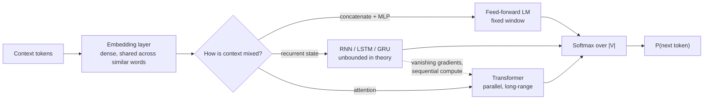

**In one line.** Replace counting with a network: embed the context, mix it, and softmax over the vocabulary.

## The idea in plain words

N-gram models cannot share knowledge between similar words. If the corpus contains "the cat is sleeping" but never "the dog is sleeping", a bigram model learns nothing about the second from the first.

A **neural language model** fixes this by embedding words into a continuous space first. Similar words get similar vectors, so evidence generalises automatically.

The shape barely changed in fifteen years:

1. **Embed** the context tokens.
2. **Mix** them — concatenate and pass through a hidden layer (feed-forward LM), carry a state across time (RNN/LSTM), or attend (transformer).
3. **Softmax** over the whole vocabulary to get next-token probabilities.

**RNNs** added unbounded history via a recurrent state, but gradients vanish over long sequences, so "unbounded" became "about 20 tokens in practice". **LSTMs and GRUs** added gates that let gradients flow further.

Two structural limits remained, and both were solved by attention: recurrence is **sequential** (no parallel training across time), and long-range dependencies still **decay**.



## How it works

#### The map: click any stop to jump

This lecture is one climb, in six bands. Each box is a chapter. Each leans on the one before it. Click a box to jump there.

#### The whole lecture, at a glance

Each node is a chapter. The line shows the path: unit, switch, the XOR puzzle, layers, language, training, then large models. Click a node to go to it.

- **What you will learn** — How a unit decides, why one line is too weak, how layers fix it, how networks read language, and how training works.

- **The rhythm** — Every chapter has the same shape. A hook, an analogy, the math step by step, a worked example, a lab, an ML link, then a pitfall.

:::note

**One term up front.** A *neural network* is a stack of tiny math units that turn numbers into a prediction. It is loosely inspired by brain cells. But hold that lightly: this is *not* a model of your brain. It is just a function of numbers.

:::

### The Neural Unit

A unit takes a few numbers in, weighs each one, adds a bias, and squashes the total into a clean answer. That is the whole atom of deep learning. Everything large is built from it.

:::note

**Analogy first.** A unit is a tiny vote-counter. Each input gets a **weight**, which says how much it matters. The unit adds up the weighted votes. It adds one baseline number called the **bias**. Then it squashes the total into a yes/no-ish answer. Like deciding to walk: sun counts a lot, wind a little, and your mood is the baseline.

:::

#### Step 1 — the weighted sum

Take inputs $x_1, x_2, \dots, x_n$. Each input $x_i$ has a matching **weight** $w_i$. There is one shared **bias** $b$. The unit first forms the **weighted sum**, called $z$:

$$ z \;=\; b + \sum_{i=1}^{n} w_i x_i $$

The same thing is shorter as a **dot product**. Put the weights in a vector $\mathbf{w}$ and the inputs in $\mathbf{x}$. The dot product multiplies matching parts and adds them:

$$ z \;=\; \mathbf{w}\cdot\mathbf{x} + b $$

#### Step 2 — the activation

The raw sum $z$ can be any number. We pass it through a curved **activation** $f$ to get the output $y$. The classic one is the **sigmoid** $\sigma$, which squashes any number into the range between 0 and 1:

$$ y \;=\; \sigma(z) \;=\; \frac{1}{1 + e^{-z}} $$

Here $e \approx 2.718$ is Euler's number. When $z$ is large, $y$ nears 1 (a strong yes). When $z$ is very negative, $y$ nears 0 (a no). At $z=0$, $y=0.5$, perfectly on the fence.

- **Worked example — walk it step by step** — The slide's neuron: weights $w=[0.2,0.3,0.9]$, bias $b=0.5$, inputs $x=[0.5,0.6,0.1]$. Press Next to reveal each step. The final answer should be $y \approx 0.7045$. ▶ Next step↺ Reset

#### Build the sum, watch $y$ form

Drag the three weights and the bias. The edges into the unit get thicker and brighter as a weight grows. Cyan means a positive weight, pink means negative. Watch $z$ and the output $y$ update live, term by term, in the console.

#### Where this shows up in ML

One sigmoid unit is exactly *logistic regression*, a complete yes/no classifier: spam or not, fraud or not. A deep network is just thousands of these units in layers. Each layer's outputs feed the next. Everything large is built from this one atom.

:::tip

**Pitfall — the bias and the bend both matter.** Without the bias $b$, the unit can only split inputs with a line through the origin. Without a *nonlinear* activation, stacking units just gives one big line, and the network gains nothing.

:::

### Activation Functions

The activation is the curved step inside a unit. Without it, a whole network collapses into one straight line. The bend is what lets networks learn rich, twisty patterns. We meet the three most common bends.

:::note

**Analogy first.** An activation is a dimmer switch for a unit's score. A plain wire passes voltage straight through. A dimmer reshapes it: low stays low, high saturates near full. The shape you pick changes how fast the unit learns.

:::

#### The three switches

The **sigmoid** squashes any number into the range between 0 and 1. It reads nicely as a probability. Its weakness: far from zero the curve is almost flat, so learning slows there.

$$ \sigma(z) \;=\; \frac{1}{1 + e^{-z}} $$

The **tanh** (hyperbolic tangent) has the same S-shape, but it is centred on zero. Its range is between $-1$ and $1$:

$$ \tanh(z) \;=\; \frac{e^{z} - e^{-z}}{e^{z} + e^{-z}} $$

The **ReLU** (rectified linear unit) is the simplest and most common today. It keeps positive scores and sets negative ones to zero:

$$ \mathrm{ReLU}(z) \;=\; \max(0,\, z) $$

ReLU has a sharp kink at zero, not a smooth curve. For positive $z$, its slope is a constant 1. That steady slope helps deep networks learn fast.

- **Worked example — same scores, three switches** — Feed $z=2$ and $z=-2$ through each activation. Press Next to reveal each line. ▶ Next step↺ Reset

#### Plot the switch, read its slope

Pick a switch. Drag the slider (or move the mouse over the canvas) to scrub $z$. The dot shows $f(z)$; the yellow line shows the slope there. Look for this: ReLU's slope is a flat 1 for $z>0$, while the sigmoid's slope dies to almost zero out at the edges.

#### Where this shows up in ML

ReLU is the default hidden activation in most deep networks, from image models to transformers. Sigmoid and tanh live inside the gates of recurrent networks. Sigmoid is also the final layer for a yes/no output. The choice is a real design decision.

:::tip

**Pitfall — saturation and dead units.** Sigmoid and tanh flatten far from zero, so gradients shrink and learning stalls. This is the vanishing-gradient trap. ReLU avoids it mostly, but a unit stuck at negative $z$ can die and output zero forever.

:::

### The Perceptron: AND and OR

Before networks, there was the perceptron. It is the simplest unit: weights, a bias, and a hard 0/1 output, with no smooth switch. It fires a 1 when the weighted sum clears zero, and a 0 otherwise.

:::note

**Analogy first.** A perceptron is a strict bouncer at a door. It adds up the weighted inputs plus the bias. If the total clears the bar (above zero), it says yes (1). If not, it says no (0). There is no maybe.

:::

#### The rule

$$ \text{output} = \begin{cases} 1 & \text{if } \mathbf{w}\cdot\mathbf{x} + b > 0 \\ 0 & \text{otherwise} \end{cases} $$

We can build logic gates. The **AND** gate fires only when both inputs are 1. Use $w=[1,1]$ and $b=-1$, so $z = x_1 + x_2 - 1$. The **OR** gate fires when at least one input is 1. Use $w=[1,1]$ and $b=0$.

- **Worked example — AND and OR, every row** — Press Next to walk both truth tables, one input pair at a time, with the real arithmetic. ▶ Next step↺ Reset

#### Flip the inputs, build the gate

Pick AND or OR. Click the two input switches to flip them between 0 and 1. The canvas shows the four corners; green means the gate fires. The white dot is your current input. The console shows the sum $z$ and the output.

#### Where this shows up in ML

The perceptron is the historical seed of neural networks. Its update rule was the first learning algorithm for a linear classifier. Modern units keep its weighted-sum core. But they swap the hard 0/1 step for a smooth switch, so gradient descent can train them.

:::tip

**Pitfall — one line is the only weapon.** A perceptron draws one straight cut, the line $\mathbf{w}\cdot\mathbf{x}+b=0$. AND and OR each need just one cut, so they fit. The moment a task needs two cuts, a single perceptron fails.

:::

### The XOR Problem

Here is the question that nearly killed neural networks. Can one unit do basic logic? In 1969, Minsky and Papert showed the answer is no for XOR. XOR should fire only when the two inputs **differ**.

:::note

**Analogy first.** Picture two light switches, one at each end of a staircase. The light is on only when the switches *disagree*. Flip either one and the light flips. No single threshold on the total can capture this rule.

:::

#### The truth table and why no line works

| x₁ | x₂ | XOR |
| --- | --- | --- |
| 0 | 0 | 0 |
| 0 | 1 | 1 |
| 1 | 0 | 1 |
| 1 | 1 | 0 |

A perceptron's boundary is the line $w_1 x_1 + w_2 x_2 + b = 0$. It splits the plane in two. XOR needs the two "yes" corners, $(0,1)$ and $(1,0)$, on one side. But those corners sit on *opposite diagonals*. So do the two "no" corners. The classes are **not linearly separable**: no straight line can fence them apart.

- **Worked example — one line always fails** — We prove it. Suppose a line scores both "yes" corners positive. Press Next to reach the contradiction. ▶ Next step↺ Reset

#### Try to separate XOR with one line

You drive a straight line with three sliders: $w_1$, $w_2$, and the bias $b$. Green corners are XOR = 1, pink are XOR = 0. The line shades one side as "yes". Try to get all four correct. You will cap out at **3 of 4**, every time. That is the lesson.

#### Where this shows up in ML

XOR is the textbook example of a problem that needs depth. Real data is full of "it depends" patterns, where the right answer flips based on a combination. A single linear layer cannot model those. The fix, adding a hidden layer, is the reason deep networks exist.

:::tip

**Pitfall — "hard" does not mean "complex".** XOR is tiny. The lesson is narrow: one straight cut is too weak. The instant a task needs a bent or split boundary, one unit fails, no matter how you tune its weights.

:::

### Solving XOR with Two Layers

The fix is to stack units into layers. We add a **hidden layer** between the input and the output. It rewrites the raw inputs as new, more useful numbers. In that new space, XOR becomes linearly separable.

:::note

**Analogy first.** The hidden layer is a translator. It re-describes the inputs as facts that make the answer easy. For XOR, one hidden unit learns "*at least one input is on*". The other learns "*both inputs are on*". From those two facts, XOR is just "at least one, but not both".

:::

#### The network

Here is the standard 2-layer ReLU network from Jurafsky and Martin. The hidden layer:

$$ W = \begin{bmatrix} 1 & 1 \\ 1 & 1 \end{bmatrix},\quad \mathbf{b} = \begin{bmatrix} 0 \\ -1 \end{bmatrix},\quad \mathbf{h} = \mathrm{ReLU}(W\mathbf{x} + \mathbf{b}) $$

The output unit, with no bias:

$$ \mathbf{w}_{\text{out}} = [\,1,\ -2\,],\quad y = \mathbf{w}_{\text{out}}\cdot\mathbf{h} = h_1 - 2h_2 $$

Each hidden unit has a job. Unit $h_1 = \mathrm{ReLU}(x_1 + x_2)$ counts how many inputs are on. Unit $h_2 = \mathrm{ReLU}(x_1 + x_2 - 1)$ switches on only when *both* are on. The output subtracts twice $h_2$ to cancel the "both on" case.

- **Worked example — verify all four inputs** — Press Next to compute $h_1, h_2$, then $y = h_1 - 2h_2$, for each input. The outputs should be 0, 1, 1, 0. ▶ Next step↺ Reset

#### Flip the inputs, watch the layers light up

Click the two input switches. The canvas lights the units that fire: cyan inputs, violet hidden units, pink output. Look for this: $h_2$ stays dark until **both** inputs are on. That single unit is the whole trick.

#### Where this shows up in ML

This tiny example is the whole reason for deep learning. Hidden layers learn useful intermediate features, called a *representation*. A vision network's early layers find edges, then shapes, then objects. Each layer reshapes the data so the next layer's job is simpler.

:::tip

**Pitfall — the magic is the hidden features.** It is not the output weights. Remove the hidden layer and keep a linear output, and you are back to one line. XOR fails again. Depth plus a nonlinear switch is what buys the power.

:::

### Feedforward Networks & Notation

A feedforward neural network is just many units in layers, with data flowing one way: input to output, no loops. Another name is the multi-layer perceptron, or MLP. Let us set the notation we use for the rest of the lecture.

:::note

**Analogy first.** A feedforward network is an assembly line. Each station (layer) takes the previous station's parts (numbers), applies its own work (weights and a switch), and passes the result forward. Nothing flows backward during prediction. It marches from input to answer.

:::

#### Logistic regression is a one-layer network

We do not count the input layer, because it does no computing. It just holds the numbers. So logistic regression, one sigmoid unit, is a **one-layer network**. For several outputs, a layer uses a weight *matrix* $W$, a bias *vector* $\mathbf{b}$, and produces a vector of scores.

#### Two layers and the layer notation

A two-layer network adds one hidden layer: $\mathbf{h} = g(W\mathbf{x} + \mathbf{b})$, where $g$ is a hidden switch like ReLU. For deeper nets, we number layers with a bracket superscript:

$$ \mathbf{a}^{[0]} = \mathbf{x},\qquad \mathbf{z}^{[\ell]} = W^{[\ell]} \mathbf{a}^{[\ell-1]} + \mathbf{b}^{[\ell]},\qquad \mathbf{a}^{[\ell]} = g\big(\mathbf{z}^{[\ell]}\big) $$

Name each symbol. $\ell$ (the Greek letter ell) is the layer number. $W^{[\ell]}$ is that layer's weight matrix. $\mathbf{b}^{[\ell]}$ is its bias vector. $\mathbf{z}^{[\ell]}$ is its pre-switch scores. $\mathbf{a}^{[\ell]}$ is its switched output. The input is $\mathbf{a}^{[0]} = \mathbf{x}$. Each layer feeds the next.

#### Stack the layers, watch a value flow

Pick how many hidden layers, and how wide each is. Press **push input** to send a value through. Each layer lights as the value reaches it. Look for this: depth and width are just more units, wired the same way.

#### Where this shows up in ML

The layer notation above is exactly what deep-learning libraries implement, layer by layer. A "deep" network just means many such layers. Each $W^{[\ell]}$ is a learned matrix. The whole network is one big function, built from these stacked pieces.

:::tip

**Pitfall — the input layer is not a real layer.** It only holds numbers; it computes nothing. So a "one-layer network" has one computing layer, not two. Count the layers that have weights, not the input.

:::

### Softmax

The sigmoid gives one probability, good for a yes/no choice. For many classes we need many probabilities that add to 1. The softmax does this. It is the many-class big sister of the sigmoid.

:::note

**Analogy first.** Softmax is like splitting a pie among contestants by their scores. Raise $e$ to each score so all are positive. Then give each one a slice in proportion to its share of the total. A big score grabs a big slice. The slices always add up to the whole pie.

:::

#### The formula, in two moves

Given a score vector $\mathbf{z} = [z_1, \dots, z_k]$, the probability of class $i$ is:

$$ \mathrm{softmax}(\mathbf{z})_i \;=\; \frac{e^{z_i}}{\sum_{j=1}^{k} e^{z_j}} $$

Move one: make every score positive by raising $e$ to it. Move two: divide by the total of all of them, so the parts sum to one. The raw scores $z_i$ are called **logits**; they can be any size.

- **Worked example — the slide's six logits** — Logits $z=[0.6, 1.1, -1.5, 1.2, 3.2, -1.1]$. Press Next to raise $e$, sum, and divide. The answers should match $[0.055, 0.090, 0.0067, 0.10, 0.74, 0.010]$. ▶ Next step↺ Reset

#### The softmax bar race

Drag any logit slider. Watch the bars reshape. Look for this: raising one logit makes its bar grow by **stealing** probability from the others. The bars always add to exactly 1, shown in the sum-check.

#### Where this shows up in ML

Softmax is the final layer of almost every classifier with more than two classes. Examples: image labels, the next-token distribution in a language model, and intent labels in a chatbot. We will use it ourselves in the neural language model soon.

:::tip

**Pitfall — logits are not probabilities yet.** The raw scores can be any size, even negative. Only after the exponentials and the division do they become a valid distribution that adds to 1. Skipping the division is a classic bug.

:::

### The Bias Trick

Carrying the bias $b$ as a separate term is a little clumsy. There is a neat trick. Add a fake input that is always 1, and treat its weight as the bias. Then the whole unit is one clean dot product.

:::note

**Analogy first.** Think of a shopping bill with a fixed delivery fee. Instead of writing "items plus a separate fee", you add one fake item, "delivery", priced at the fee, with quantity 1. Now the bill is one plain sum. The bias is that fixed delivery fee.

:::

#### The trick in symbols

Add a dummy input $a_0 = 1$ to each layer. Give it weight $w_0$. Then $w_0 \cdot 1 = w_0$ plays the exact role of the bias $b$:

$$ \mathbf{w}\cdot\mathbf{x} + b \;=\; w_0(1) + w_1 x_1 + \dots + w_n x_n $$

Nothing changes in the math. We just folded the bias $b$ in as the weight $w_0$ on a constant input of 1. It is purely a tidier way to write the same computation.

#### Where this shows up in ML

This trick is everywhere in textbooks and code. It lets a layer be written as a single matrix multiply, with the bias as an extra column. It removes a special case, which makes the math and the implementation cleaner.

:::tip

**Pitfall — do not double-count the bias.** If you fold the bias into the weights, do not *also* add a separate $b$. Pick one form. Mixing both adds the bias twice and silently breaks the model.

:::

### Text Classification & Sentiment

Now we point the network at text. The first job is classification, like sentiment: read a review and output one number, the chance it is positive. A plain unit on word flags is logistic regression. A hidden layer adds the power to read combinations.

:::note

**Analogy first.** Judging a review is like reading a friend's text. A single word like "terrible" is a strong clue. But "not terrible" flips the meaning. A flat word count misses the flip. A hidden layer can learn the combination "not" plus "terrible" and treat it differently.

:::

#### From words to a label

Simple features can be binary flags: "does the word *great* appear?" A one-layer network on these flags is logistic regression. A **hidden layer** lets the network model nonlinear interactions between features, which is exactly what "not good" needs. For more than two labels, say positive, neutral, negative, we add more output units and a softmax layer.

#### Toggle words, flip the verdict

Click words to include them in a review. The bar shows the predicted chance of "positive". One model is **flat** (single-word weights only). The other has a **hidden layer** that knows the phrase "not good". Toggle "not" and "good" together. Look for this: only the hidden-layer model flips the verdict.

#### Where this shows up in ML

Sentiment, spam filtering, topic labels, and intent detection all use this exact shape. A network reads text features and outputs a class. Adding a hidden layer is what lets it catch phrases and negation, not just isolated words.

:::tip

**Pitfall — single-word features miss context.** "Not good" and "good" share the word "good". A flat bag-of-words model scores them alike. Only a model that sees word *combinations* can tell them apart.

:::

### Embeddings & Pooling

Instead of hand-built flags, feed the network **embeddings**: dense vectors that stand for words and are learned from data. Each word becomes a short list of numbers that captures its meaning. Similar words get similar vectors.

:::note

**Analogy first.** An embedding is a word's address in a "meaning map". Words with similar meanings live in the same neighbourhood. "cat" and "dog" are next-door. "car" is across town. Distance on the map means difference in meaning.

:::

#### The fixed-size problem

Texts vary in length, but a feedforward network wants a fixed-size input. The slides give two fixes.

- **Pad or truncate.** Pick a fixed length. Cut longer texts; pad shorter ones with a blank token.
- **Pool into one vector.** Combine all the word vectors into one **sentence embedding**. Take the element-wise mean (average each dimension) or the element-wise max.

- **Worked example — pool three word vectors** — Vectors $\mathbf{e}_1=[2,0]$, $\mathbf{e}_2=[0,4]$, $\mathbf{e}_3=[1,2]$. Press Next to compute the mean and the max, dimension by dimension. ▶ Next step↺ Reset

#### The meaning map, and pooling

Pick words for a short text. Their vectors appear as arrows. Press **pool** to draw the mean vector (one fixed-size point) for any length of text. Look for this: a 2-word text and a 4-word text both collapse to a single 2-D point.

#### Where this shows up in ML

Embeddings power nearly all modern NLP. Word vectors (word2vec, GloVe) were the first wave. Mean-pooling is a strong, cheap baseline for classification. Today's models pool with attention instead, but the goal is the same: turn variable text into fixed numbers.

:::tip

**Pitfall — mean-pooling forgets order.** "Dog bites man" and "man bites dog" pool to the same vector. For tasks where order matters, plain averaging is too crude. That limit is one reason recurrent nets and transformers exist.

:::

### What a Language Model Is

A language model predicts the next word, given the words so far. It outputs a probability for every word in the vocabulary. A **neural** language model does this with a network. This is the direct ancestor of today's large language models.

:::note

**Analogy first.** A language model is a very good autocomplete. You type "I made sure the cat gets ___" and it ranks every possible next word. "fed" scores high; "purple" scores low. The whole job is that ranking, turned into a probability for each word.

:::

#### The chain rule and the Markov shortcut

The probability of a whole sentence factors by the **chain rule**: each word given the words before it.

$$ P(w_1, \dots, w_n) = \prod_{i=1}^{n} P(w_i \mid w_1, \dots, w_{i-1}) $$

Conditioning on *all* prior words is too much. So we make the **Markov assumption**: only the last few words matter. We can back off from a long history down to none:

$$ P(w_i \mid w_{i-4}, \dots, w_{i-1}) \;\rightarrow\; P(w_i \mid w_{i-1}) \;\rightarrow\; P(w_i) $$

A sentence can be any length. So we use a fixed-length **sliding window**. We look at a fixed number of prior words, then slide forward by one.

#### Slide the window over a sentence

Set the window size. Press **slide** to move it one word at a time. The highlighted words are the context; the next word is what the model predicts. Look for this: the window is fixed-size, but the sentence can be any length.

#### Where this shows up in ML

Every chat model, phone keyboard, and code assistant is, at heart, a next-word (next-token) predictor. The sliding window here is the simple version. Transformers replace it with attention over a long context, but the core job is the same.

:::tip

**Pitfall — a fixed window is short-sighted.** A 3-word window cannot use a clue from ten words back. That hard limit on context is exactly what recurrent nets and transformers were built to fix.

:::

### One-hot Vectors & the Embedding Matrix

A word first enters the network as a one-hot vector: a long list with a single 1. That carries no meaning. So an embedding matrix maps it to a short, dense, meaningful vector. The matrix is just a lookup table.

:::note

**Analogy first.** A one-hot vector is like a seat number in a huge stadium: row 5, and zero everywhere else. It tells you *which* word, but nothing about it. The embedding matrix is the program that says what the person in that seat is actually like.

:::

#### One-hot, then lookup

A **one-hot vector** is as long as the vocabulary $|V|$, with a 1 at the word's index and 0 elsewhere. If "toothpaste" is word number 5, then $x_5 = 1$ and all other entries are 0.

An **embedding matrix** $E$ maps that one-hot to a dense vector. Multiplying $E$ by a one-hot just selects one column of $E$: the word's embedding. So $E$ is a lookup table, one dense vector per word.

$$ \mathbf{e} \;=\; E \, \mathbf{x}_{\text{one-hot}} \;=\; \text{the column of } E \text{ for that word} $$

#### Pick a word, watch the lookup

Click a word. Its one-hot vector lights up (a single 1). The matching column of the embedding matrix $E$ highlights, and its dense vector drops into the output. Look for this: the one-hot just **selects** a column; no real multiplication is needed.

#### Where this shows up in ML

Every NLP model starts here. Token IDs index into an embedding table. That table is one of the largest and most important learned parts of a language model. Looking up a row is the model's very first step on any input.

:::tip

**Pitfall — one-hot is huge and meaningless.** A one-hot has length $|V|$, often tens of thousands. And "cat" and "dog" are as far apart as "cat" and "Tuesday". The embedding step is what adds meaning and shrinks the size.

:::

### Why Neural LMs Beat N-gram LMs

An n-gram model only knows word *identities*. To it, "cat" and "dog" are two unrelated symbols. A neural LM knows word *meanings* through embeddings. So knowledge about "cat" transfers to "dog". That sharing is called generalization.

:::note

**Analogy first.** An n-gram model is someone who memorized exact phrases. If they never heard "dog gets fed", they are stuck. A neural LM is someone who understands that dogs and cats are both pets. They guess "fed" for the dog because they saw it for the cat.

:::

#### The slide's example

Say the training text has "I have to make sure that the cat gets fed". But it never has "dog" in that spot. Now test on "... make sure that the dog gets ___". An n-gram model has never seen "dog gets", so it cannot predict "fed". A neural LM sees that "dog" sits near "cat" in embedding space, and reuses the pattern to predict "fed".

#### Drag "dog" toward "cat", watch "fed" appear

The model was trained on "cat gets fed". Drag the "dog" point around the meaning map. The bar shows the model's probability for "fed" after "dog gets". Look for this: as "dog" nears "cat", the chance of "fed" climbs. An n-gram model's bar stays flat at zero.

#### Where this shows up in ML

Generalization over similar words is the core advantage of neural language models. It is why they need less exact repetition than n-gram models. The same idea, scaled up, lets large models answer questions they never saw word-for-word in training.

:::tip

**Pitfall — generalization needs good embeddings.** If "dog" and "cat" had unrelated vectors, the transfer would fail. The quality of the embeddings decides how well the model shares knowledge across words.

:::

### The Neural LM Forward Pass

Here is the whole prediction, step by step. Take the context words. Look up each embedding. Join them into one vector. Run a hidden layer, then scores, then softmax. The output is a probability for every word in the vocabulary.

:::note

**Analogy first.** It is an assembly line for a guess. Three words go in. Each gets translated to its meaning vector. The vectors are stapled together. A mixing step blends them. A final step scores every possible next word and turns the scores into chances.

:::

#### The math, named symbol by symbol

$$ \mathbf{e} = [\,\mathbf{e}_{w_{t-3}};\ \mathbf{e}_{w_{t-2}};\ \mathbf{e}_{w_{t-1}}\,] $$

$$ \mathbf{h} = g(W\mathbf{e} + \mathbf{b}),\qquad \mathbf{z} = U\mathbf{h},\qquad \mathbf{y} = \mathrm{softmax}(\mathbf{z}) $$

Name each piece. $\mathbf{e}$ is the joined context embedding (this joining is called **concatenation**). $W$ is the hidden weight matrix and $\mathbf{b}$ its bias. $g$ is the hidden switch, like ReLU. $\mathbf{h}$ is the hidden vector. $U$ is the output weight matrix, one row per vocabulary word. $\mathbf{z}$ is the score vector, of length $|V|$. And $\mathbf{y}$ is the softmax output: a probability for every word.

#### Run the forward pass

Press **next stage** to push the three context words through the pipeline. Each stage lights as it computes: one-hot, embeddings, join, hidden, scores, softmax. The bars at the end are the predicted next-word probabilities. Look for this: the whole model is just lookups, a mix, and a softmax.

#### Training the embeddings: freeze or learn

Where does $E$ come from? Two choices. **Freeze**: start $E$ from a method like word2vec and keep it fixed; train only $W, U, \mathbf{b}$. **Learn jointly**: let $E$ update with the network, useful when the task needs special representations.

#### Where this shows up in ML

This feedforward next-word predictor is the seed Bengio planted in 2003. Swap its fixed window for attention and you get the transformer, the engine of GPT and every modern LLM. The forward pass above is the core idea, scaled up.

:::tip

**Pitfall — the output layer is large.** The matrix $U$ has one row per vocabulary word, so the final softmax is over $|V|$ classes. For big vocabularies this is the most expensive step, and there are tricks to speed it up.

:::

### N-gram vs Neural LM

Neither model wins everywhere. The neural LM is more accurate and generalizes better. The n-gram model is faster, cheaper, and easier to inspect. For a small task, the simple tool can still be the right one.

:::note

**Analogy first.** An n-gram model is a bicycle: cheap, simple, easy to fix. A neural LM is a car: faster and goes further, but it costs more fuel and is harder to repair. For a trip to the corner shop, the bicycle wins.

:::

#### Side by side

| Property | N-gram LM | Neural LM |
| --- | --- | --- |
| History length | short | longer |
| Similar words | unrelated | shared |
| Accuracy | lower | higher |
| Speed / cost | fast, cheap | slower, heavier |
| Interpretable | easy | harder |
| Best for | small tasks | large tasks |

#### Slide the one axis: how much context

This is the through-line of the whole lecture: how much context a method uses. Drag the slider from "tiny task, little data" to "huge task, lots of data". Watch which model the trade-off favours, and why. Look for this: the right tool depends on the task, not on which is fancier.

#### Where this shows up in ML

This "match the model to the task" judgement is everyday ML engineering. A tiny autocomplete on a watch may use an n-gram model. A cloud assistant uses a giant neural one. Cost, latency, and data all push the choice.

:::tip

**Pitfall — bigger is not always better.** A neural LM on a tiny dataset can overfit and cost more than it is worth. When data and the task are small, the cheaper n-gram model often wins on both speed and reliability.

:::

### Training the Network

A network starts with random weights and predicts badly. Training fixes that. We measure the error with a **loss**, then nudge every weight to make the loss smaller. We repeat many times. Full backpropagation is the next lecture.

:::note

**Analogy first.** Training is downhill walking in fog. The loss is a landscape: high where the model is wrong, low where it is right. You feel the slope under your boots. You step the opposite way, downhill, by a small amount. Repeat until you reach a low valley.

:::

#### The cross-entropy loss

For a yes/no model we use the **cross-entropy loss**. Let $y$ be the true label (0 or 1) and $\hat{y}$ the predicted probability of class 1:

$$ L_{\mathrm{CE}} = -\big[\, y \log \hat{y} + (1-y)\log(1-\hat{y}) \,\big] $$

Read it as surprise. If the true label is 1, the loss is $-\log \hat{y}$. A confident-and-right guess gives near-zero loss. A confident-and-wrong guess blows the loss up. So it punishes confident mistakes hard.

#### One downhill step

To shrink the loss, we adjust each weight against its slope:

$$ w \;\leftarrow\; w - \eta\,\frac{\partial L}{\partial w} $$

Here $\eta$ (the Greek letter eta) is the **learning rate**: how big a step we take. The term $\partial L/\partial w$ is the slope. The minus sign turns "uphill slope" into a "downhill step". To find the slope we use the **chain rule**, multiplying small slopes. Running it backward through a network is **backpropagation**, the next lecture.

- **Worked example — the logistic gradient, then one step** — For one sigmoid unit the gradient simplifies to $(\hat{y}-y)\,x_j$. Press Next to derive it, then take one step with $\hat{y}=0.7$, $y=1$, $x_j=2$, $\eta=0.1$. ▶ Next step↺ Reset

#### Roll the ball, then crank $\eta$

The cyan ball sits on a bowl-shaped loss. Press **step** to apply one update; the yellow trail shows its path. Slide the learning rate $\eta$. Look for this: small $\eta$ crawls, a good $\eta$ glides to the bottom, large $\eta$ overshoots, and above $\eta=2$ it diverges and flies off.

#### Where this shows up in ML

This loop, loss then gradient then step, is how every neural network is trained, from a tiny classifier to GPT. Real models have millions of weights, and backpropagation computes the slope for all of them at once. But each weight takes the exact step above.

:::tip

**Pitfall — the learning rate is delicate.** Too small and training crawls for ages. Too large and the steps overshoot the valley, bouncing or even diverging to infinity. Picking $\eta$ well is one of the key practical skills in deep learning.

:::

### LLMs & Prompting

A large language model (LLM) is just a very large neural language model. It is usually a transformer, trained on a huge amount of text, to predict the next token. At billions of parameters, one model can write, summarize, translate, and answer questions.

:::note

**Analogy first.** An LLM is the next-word predictor from earlier, grown enormous. Same core job: given the text so far, guess what comes next. With vast data and size, that single skill turns into something that looks like broad language ability.

:::

#### Prompts, completions, and prompt engineering

You talk to an LLM with a **prompt**: the text you give it. It replies with a **completion**: the text it generates. **Prompt engineering** is the craft of writing prompts that get good completions. Small wording changes can change the output a lot.

#### In-context learning: zero-shot and few-shot

LLMs can learn a task from the prompt alone, with no weight changes. This is **in-context learning**. **Zero-shot**: you describe the task and give no examples. **Few-shot**: you include a few worked examples in the prompt, and the model copies the pattern.

#### Generative AI, assistants, and tools

**Generative AI** means models that create new content: text, images, audio, or code. LLMs are the text branch. Common shapes from the slides:

- **AI assistants**: notification (alerts you), FAQ (answers common questions), contextual (uses your situation), personalized (adapts to you), autonomous (acts on its own).
- **Generative tools**: image generation (text to picture) and code generation (text to working code).

#### Where this shows up in ML

An LLM is the scaled-up cousin of the neural LM you built by hand. Prompt engineering is now a core skill. Zero-shot and few-shot prompting let one frozen model do new tasks with no retraining, which is a large practical win.

:::tip

**Pitfall — fluent is not the same as correct.** LLMs predict plausible text, not verified truth. They can state wrong facts with full confidence; this is called *hallucination*. Always check important outputs.

:::

### Transfer Learning

Deep learning is hungry for labelled data, often more than 50,000 examples. And labelled target data is often scarce. Transfer learning solves this. You reuse a model trained on a big task and adapt it to your smaller one.

:::note

**Analogy first.** If you can already drive a car, learning to drive a truck is fast. You keep most of the skill (steering, road sense) and adjust only a few things (size, mirrors). You do not relearn driving from zero. That reuse is transfer learning.

:::

#### The recipe, and two kinds

Take a pre-trained model. **Freeze** its learned weights (hold them fixed). Add new layers for your task. Train only the new layers on your small target data. The slides name two kinds.

- **Transductive transfer**: no labelled target data. You adapt a model across domains. This is *domain adaptation*.
- **Inductive transfer**: you do have labelled target data. This covers multi-task learning and pretraining, like learning word embeddings first.

**Fine-tuning** goes further: you let the pre-trained layers update too, not just the new ones. This works best when your new dataset is large and similar to the original. With little data, freezing is safer.

#### Freeze or fine-tune? Cars to trucks

A model is pre-trained on cars. Choose how much target (truck) data you have, and whether to freeze or fine-tune. The layers light up: blue = frozen (reused), green = trained. Look for this: with little data, fine-tuning everything overfits; freezing wins.

#### Where this shows up in ML

Transfer learning is everywhere: image and speech recognition, named-entity recognition, sentiment, cross-lingual tasks, even game-playing. Modern NLP runs on it. You take a pre-trained language model and fine-tune it, instead of training from scratch.

:::tip

**Pitfall — match the domains.** Transfer helps only when source and target are related. A model trained on photos will not transfer well to medical scans without care. And fine-tuning all layers on tiny data overfits fast.

:::

### Synthesis & Recap

One climb, from a single unit to the models behind modern AI. Each idea leaned on the one before it. If these click, a great deal of the rest of deep learning has a home to land in.

- **1 · The unit** — Weighted sum, a bias, a switch: $y=\sigma(\mathbf{w}\cdot\mathbf{x}+b)$. The atom of every network.
- **2 · The XOR lesson** — One line is too weak. A hidden layer builds new features, so depth makes hard tasks solvable.
- **3 · Softmax** — Turns scores into probabilities that add to 1. The final step for many-class output.
- **4 · Embeddings** — Words as dense vectors. Similar words sit close, so models generalize across them.
- **5 · Neural LM** — Look up, join, mix, softmax to a next-word distribution. The seed of every LLM.
- **6 · Training & transfer** — Gradient descent shrinks the loss. Transfer learning reuses a pre-trained model.

#### The grand tour: one slider, the whole arc

Drag the slider through the lecture's stages, from one unit to a large language model. Each stop lights the matching idea and prints its one-line summary. Look for this: every stage is built from the stage before it.

:::note

**The thread.** A network is units (idea 1) in layers that build features (idea 2). It ends in a softmax (idea 3). For language, it reads embeddings (idea 4) and predicts the next word (idea 5). It learns by gradient descent, and reuses big models by transfer (idea 6). Scale that up, and you get the LLMs you use every day.

:::

## A real system that works this way

**Streaming and on-device** is where recurrence still wins: an RNN keeps constant memory per step, while a transformer's KV cache grows with the sequence. Wake-word detection, real-time ASR and low-power text prediction still use recurrent models.

**State-space models (Mamba and friends)** revived the recurrent idea with hardware-friendly maths — linear-time inference and constant memory, competitive quality. The recurrence-versus-attention question is genuinely open again.

## Code you can run

A complete neural language model in NumPy: embeddings, a hidden layer, softmax, and manual backpropagation. It actually learns.

```python
import numpy as np

rng = np.random.default_rng(0)
CORPUS = ("the cat sat on the mat the dog sat on the log "
          "the cat saw the dog the dog saw the cat "
          "a cat chased a mouse a dog chased a cat").split()

CONTEXT, D_EMB, D_HID, LR, EPOCHS = 2, 12, 24, 0.1, 600

vocab = sorted(set(CORPUS))
idx = {w: i for i, w in enumerate(vocab)}
V = len(vocab)

data = [([idx[CORPUS[i - 2]], idx[CORPUS[i - 1]]], idx[CORPUS[i]])
        for i in range(CONTEXT, len(CORPUS))]

E = rng.normal(0, 0.3, (V, D_EMB))            # embedding table
W1 = rng.normal(0, 0.3, (CONTEXT * D_EMB, D_HID))
b1 = np.zeros(D_HID)
W2 = rng.normal(0, 0.3, (D_HID, V))           # output projection
b2 = np.zeros(V)

def softmax(z):
    z = z - z.max()
    e = np.exp(z)
    return e / e.sum()

for epoch in range(EPOCHS):
    loss = 0.0
    rng.shuffle(data)
    for context, target in data:
        x = E[context].reshape(-1)                      # forward
        h = np.tanh(x @ W1 + b1)
        p = softmax(h @ W2 + b2)
        loss -= np.log(p[target] + 1e-9)

        dlogits = p.copy(); dlogits[target] -= 1.0      # backward
        dW2 = np.outer(h, dlogits); db2 = dlogits
        dh = (W2 @ dlogits) * (1 - h ** 2)
        dW1 = np.outer(x, dh); db1 = dh
        dx = (W1 @ dh).reshape(CONTEXT, D_EMB)

        W2 -= LR * dW2; b2 -= LR * db2
        W1 -= LR * dW1; b1 -= LR * db1
        for slot, word in enumerate(context):
            E[word] -= LR * dx[slot]
    if epoch % 200 == 0:
        print(f"epoch {epoch:4}  loss/token {loss/len(data):.3f}  perplexity {np.exp(loss/len(data)):.2f}")

def predict(w1, w2, k=3):
    x = E[[idx[w1], idx[w2]]].reshape(-1)
    p = softmax(np.tanh(x @ W1 + b1) @ W2 + b2)
    return [(vocab[i], round(float(p[i]), 3)) for i in np.argsort(-p)[:k]]

print("\n'the cat' →", predict("the", "cat"))
print("'the dog' →", predict("the", "dog"))
print("'a cat'   →", predict("a", "cat"))
```

Note what the embedding layer buys you: "cat" and "dog" end up with similar vectors because they appear in similar contexts, so evidence about one transfers to the other — the generalisation an n-gram model can never have.

## Designing with it

**Where the cost is, and what to do about it**

| Component | Cost | Lever |
| --- | --- | --- |
| Embedding table | `V × d` parameters — large for big vocabularies | Tie input and output embeddings (halves it) |
| Output softmax | `O(V)` per token; dominates for large V | Sampled softmax during training; smaller vocab via subwords |
| Recurrence | Sequential — cannot parallelise over time | Attention, or a state-space model |
| Context window | Memory per step | Truncated BPTT for RNNs; KV cache for transformers |

**Training choices that matter**

- **Weight tying** between the embedding and output layers improves quality *and* shrinks the model — near-universal practice.
- **Gradient clipping** (norm ≈ 1.0) is mandatory for RNNs; exploding gradients are common.
- **Residual connections and layer norm** are what make deep stacks trainable — the direct answer to vanishing gradients.
- **Label smoothing** slightly improves calibration on next-token prediction.

**Debugging tip:** if the loss plateaus near `log(V)`, the model is predicting the unigram distribution and learning nothing from context. Check that your context actually reaches the output layer.

## Where this stands in 2026

:::info Industry view

- This is the **direct ancestor of every LLM** — embed, mix, softmax. Scale and the mixing layer changed; nothing else did.
- **The output softmax is still a cost centre**; tied embeddings and subword vocabularies are the standard mitigations.
- Recurrent models persist in streaming and on-device inference, where constant memory per step beats a growing KV cache.
- **State-space models (Mamba)** made recurrence competitive again — worth knowing as the live alternative to attention.

:::

## Further reading

- [A Neural Probabilistic Language Model (Bengio et al., 2003)](https://www.jmlr.org/papers/volume3/bengio03a/bengio03a.pdf) — the paper this architecture comes from.
- [The Unreasonable Effectiveness of Recurrent Neural Networks (Karpathy)](https://karpathy.github.io/2015/05/21/rnn-effectiveness/) — the classic intuition piece.
- [Understanding LSTM Networks (Olah)](https://colah.github.io/posts/2015-08-Understanding-LSTMs/) — the best explanation of the gates.
- [PyTorch language modelling tutorial](https://pytorch.org/tutorials/beginner/transformer_tutorial.html) — the same model, in a framework.
- [Source lecture: nlp-s6-neural-lm](https://learning.bansal-ai.in/nlp-s6-neural-lm/lecture.html) — the original interactive lecture these notes were built from.
