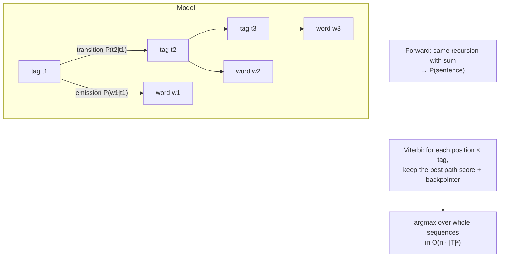

**In one line.** Choose the whole tag sequence at once, not tag by tag — because the best local choice is often the wrong global one.

## The idea in plain words

Many NLP tasks label every token: part of speech, named entity, slot, span. The catch is that **labels depend on each other**. "Book" is a verb in "book a flight" and a noun in "read a book"; only the context decides.

A **hidden Markov model** formalises this with two probability tables:

- **Emission** `P(word | tag)` — how likely is this word given the tag?
- **Transition** `P(tag | previous tag)` — how likely is this tag after that one?

To label a sentence you want the tag sequence maximising the product of all emissions and transitions. Trying every sequence is exponential.

**Viterbi** makes it linear in sentence length with dynamic programming: keep, for each position and each possible tag, the best score of any path that ends there, plus a backpointer. At the end, follow the backpointers.

Two siblings worth knowing:

- Swap `max` for `sum` and you get the **forward algorithm**, which computes the probability of the sentence rather than the best path.
- **Baum-Welch** (forward-backward + EM) trains the tables without labelled data.



## How it works

### What POS tagging is

Every word plays a role. “Dog” names a thing; “run” names an action; “the” points at a thing. A part-of-speech tag is the name of that role. Tagging gives each word in a sentence its one correct tag.

:::note

**Analogy first.** Think of a busy kitchen. The same person can be a chef, a waiter, or a cashier, depending on the moment. To run the place you first label who does what right now. Tagging does this for words.

:::

#### The shape of the task

The input is a list of words $w_1, w_2, \dots, w_n$, where $n$ is the sentence length. The output is a matching list of tags $t_1, t_2, \dots, t_n$, one per word. The small numbers are positions, so $w_3$ is the third word.

$$ \underbrace{w_1\; w_2\; \dots\; w_n}_{\text{words in}} \;\longrightarrow\; \underbrace{t_1\; t_2\; \dots\; t_n}_{\text{one tag each}} $$

:::tip

**Worked example.** Tag “the lead paint is unsafe”. the → points at a thing → **Det**. lead → the metal, a thing → **N**. paint → a thing → **N**. is → the verb → **V**. unsafe → describes the paint → **Adj**. Result: **the/Det lead/N paint/N is/V unsafe/Adj**.

:::

#### Click each word to reveal its tag

Click any word to see the job it does here. Press “reveal all” to tag the whole sentence. Each word gets exactly one tag.

#### Where this shows up in ML

Tagging is the simplest **sequence labeling** task: one label per item in a list. Named entity recognition and chunking share this shape. It also feeds parsers, search, and translation as an early step.

:::tip

**Pitfall — a word has no fixed tag.** “Lead” is a noun in “lead paint” but a verb in “lead the way”. The tag belongs to the word in this sentence, not to the dictionary word.

:::

### Word classes: open and closed

There are about eight traditional parts of speech: noun, verb, adjective, adverb, preposition, pronoun, article, and conjunction. They fall into two groups, and that split matters more than the exact count.

:::note

**Analogy first.** Picture a board game. The rule words on the box never change: “roll”, “pass”, “skip”. That is the closed set. The sticky notes players add for house rules keep growing. That is the open set.

:::

#### Two kinds of class

A **closed class** has a small, fixed membership. New prepositions almost never appear. An **open class** grows all the time, as people coin new words. English has four open classes: nouns, verbs, adjectives, and adverbs.

:::tip

**Worked example.** “of” → preposition → closed. “the” → article → closed. “she” → pronoun → closed. “can” → auxiliary → closed. “laptop” → noun → open. “stream” → verb → open. “happy” → adjective → open.

:::

#### Where this shows up in ML

Closed-class words are most of the **stop words** search engines drop, since “the” carries little topic signal. Word vectors show the split too: closed words sit in tight clusters; open words spread across meaning.

:::tip

**Key insight.** Closed classes are a small fixed set of glue words. Open classes are the growing content words. A new word almost always joins an open class.

:::

### The Penn Treebank tag set

To tag by machine we must fix one standard list of tags. A coarse list uses just N, V, Adj, Adv. The common choice is the Penn Treebank set, with 45 tags that split the coarse classes into finer ones.

:::note

**Analogy first.** A shop can label a rack “tops”, or split it into t-shirts, shirts, and sweaters. Finer labels help you find things, but you need more examples of each to learn them. A tag set is the same trade.

:::

#### From coarse to fine

The Penn set has no single “noun” tag. It uses **NN** for a singular noun, **NNS** for a plural, and **NNP** for a proper noun. Verbs split too: **VB**, **VBD** (past), **VBG** (-ing form), **VBZ** (third person).

#### Turn the detail knob

Slide from coarse to fine and watch each broad class split into its Penn tags. More detail means more tags, and more training data needed per tag.

:::tip

**Worked example.** Tag “The grand jury commented on a number of other topics .”: The/**DT** grand/**JJ** jury/**NN** commented/**VBD** on/**IN** a/**DT** number/**NN** of/**IN** other/**JJ** topics/**NNS** ./**.**

:::

#### Where this shows up in ML

The tag set is the model's **label space**: the fixed list of answers it may give. A finer set helps later tools but needs more data. Many systems now use the smaller Universal Dependencies set across languages.

:::tip

**Pitfall — IN is broad, TO is special.** One IN tag covers prepositions and subordinating conjunctions, so “although” is IN. The word “to” gets its own tag, TO, not IN.

:::

### Ambiguity: one word, many tags

Here is the heart of the problem. Many words can take more than one tag. The word “back” is the classic case, and only the context tells us which tag it has this time.

:::note

**Analogy first.** The word “charge” depends on who says it. A soldier hears “attack”. A shopper hears “pay”. A nurse hears “person in my care”. Same letters, different jobs, and the setting decides.

:::

#### The same word, four tags

Tagging is not a lookup. It is a **choice**. Picking the right meaning has a name: **disambiguation**, which means removing the doubt. The neighbours of a word are the clues we use to choose.

#### Change the context, watch the tag

Pick a sentence for the word “back” and watch its tag change. Nothing about the word changes; only the words around it do.

#### Where this shows up in ML

This is why context models matter. A method that gives each word one fixed tag fails on “back”. Context vectors like those inside BERT exist for this reason: the same word gets a different vector in a different sentence.

:::tip

**Key insight.** Many words carry several possible tags. So tagging is disambiguation: use the neighbours to choose the right tag for this use.

:::

### Tagging as a sequence problem

We now see the sentence as a sequence: an ordered list of words. We must pick the best matching list of tags. The two lists have the same length and line up one to one.

:::note

**Analogy first.** A crossword is the same shape. You rarely fill one square from its clue alone. Each letter must agree with the words crossing it. You solve the whole grid at once.

:::

#### Why not tag each word alone?

Because tags lean on neighbours. After a determiner, a noun beats a verb. A second problem is size. With $n$ words and $T$ tags, the number of possible tag lists is $T^n$, since each word could take any tag.

$$ \#\text{tag lists} \;=\; T^{\,n} \qquad (T \text{ tags},\; n \text{ words}) $$

#### Watch brute force explode

Slide the number of words and tags. The bar shows how many whole tag lists exist, on a log scale. Compare it to the smart cost, $n\,T^2$, which Viterbi pays.

#### Where this shows up in ML

Sequence labeling is a core NLP pattern. Named entity recognition, chunking, and slot filling all give one label per word. Modern systems read the whole sentence with a Transformer, then label each word.

:::tip

**Key insight.** Tagging is sequence labeling: choose the best whole tag list. The count of lists is far too large to test one by one, so we need a model and a smart search.

:::

### Markov chains: today depends on yesterday

A Markov chain models a process that moves between states over time. Its one rule: the next state depends only on the current state, not on the older past.

:::note

**Analogy first.** Snakes and Ladders works this way. Your next square depends only on the square you stand on now and the dice. How you got to this square does not matter at all.

:::

#### The pieces

The states are $q_1,\dots,q_N$. A transition probability $a_{ij}$ is the chance of moving from state $i$ to state $j$. A start vector $\pi$ (the Greek letter pi) gives the chance of beginning in each state. A path's chance is the start times one transition per step.

$$ P(\text{warm},\text{warm},\text{warm},\text{warm}) = \pi_3 \, a_{33}^{\,3} = 0.2 \times 0.6^3 = 0.0432 $$

#### Roll the weather forward

Set the stay-warm chance, then add warm days. The running product is the chance of that warm streak. Watch a long streak get unlikely fast: each day multiplies in another fraction.

#### Where this shows up in ML

Markov chains run under many models. A bigram language model is a Markov chain over words. PageRank is a Markov chain over web pages. Reinforcement learning adds actions and rewards to this same skeleton.

:::tip

**Pitfall — short memory.** The Markov rule forgets older history. That keeps the math cheap, but it cannot catch a clue from many words back. We accept the trade for speed.

:::

### Hidden Markov Models

In tagging we see the words, but the tags are hidden. A Hidden Markov Model is a Markov chain whose states are hidden, plus a rule for how each hidden state produces a visible word.

:::note

**Analogy first.** You are in a windowless office. You cannot see the sky, but you see coats. Heavy coats mean cold; none means warm. The weather is hidden; the coats are visible.

:::

#### Two tables, one product

An HMM uses two kinds of number. A **transition** $P(t_i \mid t_{i-1})$ links a tag to the next tag. An **emission** $P(w_i \mid t_i)$ links a tag to its word. The bar means “given”. The joint score multiplies one of each per position.

$$ P(w_{1:n}, t_{1:n}) = \prod_{i=1}^{n} \underbrace{P(t_i \mid t_{i-1})}_{\text{transition}}\; \underbrace{P(w_i \mid t_i)}_{\text{emission}} $$

#### Build the joint score for “the dog barks”

Drag the transition and emission knobs. Each arrow thickens with its chance, and the readout multiplies them into the joint score. Two big tables, one product.

#### Where this shows up in ML

HMMs were the workhorse of early speech recognition, where hidden states are sounds and the output is audio. They also find genes in DNA. Any visible stream with hidden labels behind it fits the HMM mold.

:::tip

**Pitfall — two simplifying claims.** A tag depends only on the one tag before it. A word depends only on its own tag. Real language bends both, yet the model still works well.

:::

### Bayes' rule: turning the problem around

We want the most likely tag list given the words. That is hard to read off directly. Bayes' rule swaps it for two pieces we can count: a likelihood and a prior.

:::note

**Analogy first.** A doctor wants the disease given your symptoms. That is hard directly. So the doctor asks two easier things: how well does each disease explain these symptoms, and how common is each disease?

:::

#### The rule, step by step

We want $\hat{t}$, the tag list with the largest $P(t \mid w)$. The hat marks our best guess; **argmax** means “the input that gives the largest value”. Bayes' rule rewrites it, and the bottom term $P(w)$ is the same for every tag list, so it drops out.

$$ \hat{t} = \operatorname*{argmax}_{t}\; \underbrace{P(w \mid t)}_{\text{likelihood}}\; \underbrace{P(t)}_{\text{prior}} $$

#### Likelihood × prior picks the winner

Two candidate taggings, A and B. Set each one's likelihood and prior. The product bar decides the winner. Toggle “divide by P(w)” and watch the winner stay the same: the constant cancels.

#### Where this shows up in ML

This is the generative recipe behind naive Bayes and many classifiers. Model the likelihood and the prior, then use Bayes' rule to score each label. Picking the top scorer this way is called MAP estimation.

:::tip

**Key insight.** The likelihood is how well the tags explain the words; it becomes the emission table. The prior is how common the tag list is; it becomes the transition table.

:::

### The two tables, filled by counting

The likelihood and prior become two tables of numbers. We get both by counting in a corpus — a large body of text already tagged by hand — then dividing.

:::note

**Analogy first.** A shop owner learns habits by tallying. Of 100 people who bought bread, 60 also bought milk. So “milk after bread” is 0.6. The tables are the same kind of tally.

:::

#### Count, then divide

The transition table holds $P(t_i \mid t_{i-1})$; the emission table holds $P(w_i \mid t_i)$. To get the chance a noun follows a determiner, count the pair and divide by the count of the determiner.

$$ P(\text{NN}\mid\text{DT}) = \frac{C(\text{DT},\text{NN})}{C(\text{DT})} $$

#### Tally the pairs, watch the fraction

Each button adds one tag-pair sighting after a determiner. The bars are the running chances; the readout shows count over total. Probability is just a tally turned into a fraction.

#### Where this shows up in ML

Counting then dividing is maximum likelihood estimation, the most basic way to fit a model. The zero-count trap and its smoothing fix appear all over NLP, from n-gram models to text classifiers.

:::tip

**Pitfall — zero counts.** If a pair never appears, its chance is zero, and one zero makes the whole product zero. Real taggers use smoothing to move a little chance onto unseen pairs.

:::

### Tagging “race”

In “Secretariat is expected to race tomorrow”, is “race” a verb or a noun? We decide with the neighbours: the “to” before it, and the adverbial noun “tomorrow” (tagged NR) after it.

:::note

**The plan.** Score the verb story and the noun story. Each score multiplies three chances: the tag after “to”, the NR after that tag, and the word “race” given that tag. The bigger score wins.

:::

#### The two products

We use these trained numbers: $P(\text{VB}\mid\text{TO})=0.83$, $P(\text{NN}\mid\text{TO})=0.00047$, $P(\text{NR}\mid\text{VB})=0.0027$, $P(\text{NR}\mid\text{NN})=0.0012$, $P(\text{race}\mid\text{VB})=0.00012$, and $P(\text{race}\mid\text{NN})=0.00057$.

#### Step through the two paths

Press next to reveal each multiplication, for the verb path and the noun path. Then slide $P(\text{VB}\mid\text{TO})$ and find where the winner flips. The verb wins because a verb almost always follows “to”.

#### Where this shows up in ML

This local scoring is what every tagger and language model does in spirit: read the neighbours, weigh each option, keep the best. Modern models use richer context, but the move is the same.

:::tip

**Key insight.** To tag an ambiguous word, score each candidate against its neighbours and keep the highest product. Here “to” makes the verb tag win by about 850 times.

:::

### Building the tables from a corpus

Let us build a transition table by hand from three short tagged sentences. Every sentence starts with a marker, “*”, and ends with STOP.

- the/DT employees/NNS pass/VB an/DT exam/NN . the/DT employees/NNS wait/VB for/IN the/DT pass/VB . employers/NNS fire/VB employees/NNS .

#### Count every tag pair

We walk the tags in order and tally each pair. The start marker is followed by DT twice and NNS once, across three sentences. So $P(\text{DT}\mid *)=2/3$ and $P(\text{NNS}\mid *)=1/3$. Every cell is one such fraction.

#### Walk the bigrams, fill the table

Press next to step through each tag pair in order. The current pair lights up, and its cell in the transition grid counts up. The table is built entirely from these counts.

#### Where this shows up in ML

This by-hand count is what a training script does at scale, over millions of tagged words. Here the table is tiny and full of zeros; a real corpus fills it in, and smoothing covers the gaps.

:::tip

**Key insight.** The tables are built by tallying tag pairs and tag-word pairs, then dividing each count by its row total. Counting is the whole training step.

:::

### The ice-cream HMM

Jason Eisner's puzzle: you are a future scientist with no weather records for one summer. You find a diary of how many ice creams someone ate each day. Guess how hot each day was.

:::note

**Analogy first.** You guess a friend's mood from how much they text. Chatty often means happy; quiet often means tired. The mood is hidden; the texts are visible. Same shape as tags and words.

:::

#### One sequence, many paths

The hidden states are HOT and COLD; the visible output is the count 1, 2, or 3. For the sequence “1 3 1” there are $2^3 = 8$ possible weather paths. We score each by multiplying its start, transitions, and emissions.

#### Score all eight weather paths

Reveal the score of each H/C path for the counts “1 3 1”. The slide example C→H→C scores 0.0024, but it is not the best. Watch which path actually wins.

#### Where this shows up in ML

The ice-cream task is the standard teaching model for HMM decoding. The same code that guesses weather from ice creams guesses tags from words, or sounds from audio. Only the tables change.

:::tip

**Pitfall — paths explode.** Eight paths is easy. But the count is $2^n$, so a month of data has billions of paths. Scoring all of them is hopeless. We need a smarter search.

:::

### The Viterbi idea

Scoring every tag list is too slow: there are $T^n$ of them. The Viterbi algorithm finds the single best list without testing them all, using dynamic programming.

:::note

**Analogy first.** Plan a cheap road trip across several cities. To reach a city you keep only the cheapest way into it, not every way. You build the best route city by city.

:::

#### Keep one best path per cell

Let $V[s,t]$ be the score of the best path that ends in tag $s$ at position $t$. We build each column from the last one: take the best previous tag, times its transition, times the current emission.

$$ V[s,t] = \max_{s'} \; V[s',\,t-1]\;\cdot\; P(s \mid s')\;\cdot\; P(w_t \mid s) $$

We also store which $s'$ won, a **backpointer**, so we can rebuild the path at the end. Many paths flow into a cell, but only the best can ever be part of the answer.

#### Watch the pruning

Several paths reach each cell. Press prune to keep only the best one per cell and drop the rest. The readout compares brute-force paths against Viterbi's cost.

#### Where this shows up in ML

Viterbi decoding is everywhere in sequence models. Conditional random fields use it to find the best label list. Speech systems use it for the best word path. The same trick powers CTC decoding today.

:::tip

**Key insight.** Keep only the best path into each tag at each position, plus a backpointer. The cost drops from $T^n$ to about $n\,T^2$.

:::

### Viterbi in full: “the doctor is in”

We decode “the doctor is in” from start to finish. Five tags, four words, one trellis. We fill it left to right, then backtrace the best path.

:::note

**What to watch.** Each cell keeps one number: the best score for that tag at that word. Tags that emit a word with chance zero stay at zero. The gold path appears only at the end, by backtracing.

:::

#### The numbers

From the tables: $P(\text{Det}\mid\langle s\rangle)=0.3$, $P(\text{the}\mid\text{Det})=0.7$; then $P(\text{Noun}\mid\text{Det})=0.9$, $P(\text{doctor}\mid\text{Noun})=0.4$; then $P(\text{Verb}\mid\text{Noun})=0.4$, $P(\text{is}\mid\text{Verb})=0.9$; then $P(\text{Prep}\mid\text{Verb})=0.2$, $P(\text{in}\mid\text{Prep})=1.0$.

#### Fill the trellis, then backtrace

Press next to fill the next cell, with its full arithmetic in the readout. After the last column, the gold path lights up by following the backpointers. The answer is the/Det doctor/Noun is/Verb in/Prep.

#### Where this shows up in ML

This exact table-filling runs inside taggers, chunkers, and named-entity systems built on HMMs or conditional random fields. The numbers come from a trained model, but the sweep and backtrace are the same.

:::tip

**Pitfall — read the path, not the cells.** Viterbi gives the best whole list, not each word's own top tag. A weak-looking tag can win if it makes the rest of the path much stronger.

:::

### MEMM, features, and bidirectionality

The HMM is a fine first tagger, but it has limits: unknown words, sparse counts, and only one tag of context. A stronger model is the Maximum Entropy Markov Model, or MEMM.

:::note

**The shift.** The HMM is generative: it models how words come from tags. The MEMM is discriminative: it models the tag directly from the word and the previous tag. It is logistic regression run along the sentence.

:::

#### Features and a softmax

The MEMM's strength is **features**: any clue you choose, turned into a yes/no test. For “back” it might check the previous tag, the word ending, or the case. Each feature has a learned weight, and a softmax turns the total scores into probabilities.

$$ P(t \mid \text{context}) = \frac{e^{\,\text{score}(t)}}{\sum_{t'} e^{\,\text{score}(t')}} $$

#### Toggle features, sharpen the tag

Turn features on and off. Each one pushes the score toward VB or NN, and the softmax bars react. Rich features make the right tag stand out — the HMM could not use most of these.

#### Decoding and bidirectionality

We still want the best whole list, so we decode the MEMM with Viterbi too. We can also run two passes, left to right and right to left, and keep the higher-scoring one. Modern taggers usually run both ways.

:::tip

**Pitfall — greedy decoding.** Tagging one word at a time and locking it is fast but cannot undo an early mistake. Use Viterbi over the whole sentence. The MEMM's label-bias flaw is later fixed by the CRF.

:::

### Key Takeaways

One thread runs through the whole lecture: a tag depends on its neighbours, so we score whole sequences, not single words. Everything else is how to do that well and fast.

- **1 · Tagging is choosing** — A word like “back” has many tags. The job is to pick the right one for this sentence, using the words nearby.
- **2 · The HMM** — Hidden tags emit visible words. Score a tagging by multiplying one transition per tag and one emission per word.
- **3 · Viterbi decodes** — Keep only the best path into each cell, sweep left to right, then backtrace. The best sequence, without brute force.
- **The through-line: how much context does a method use?** — Slide from the simplest method to the richest. Each step uses more context and fixes the errors below it. Watch which method lights up and what it can see.

:::note

**Where to go next.** The HMM and Viterbi here are the floor under modern taggers. Swap the count-based tables for a neural network that reads the whole sentence, keep the same decode step, and you have a state-of-the-art tagger.

:::

An HMM poses three questions — how likely is a sequence, what hidden states produced it, and what are the model's parameters? One **trellis** and dynamic programming answer all three: **Viterbi** decodes, **Forward** scores, **Forward-Backward** learns.

### Three problems for an HMM

Every HMM raises the same three questions, each with its own efficient algorithm.

- **1 · Likelihood** — How probable is an observation sequence under the model? → **Forward** algorithm.
- **2 · Decoding** — What hidden-state sequence most likely produced the observations? → **Viterbi** algorithm.
- **3 · Learning** — What A, B parameters make the data most likely? → **Forward-Backward** (Baum-Welch / EM).

:::note

**Jason's ice-cream diary.** You're a climatologist in 2799 with no weather records — only Jason Eisner's diary of how many ice creams he ate each day. From the ice creams (observations) you reconstruct whether each day was Hot or Cold (hidden states). That's decoding — Viterbi's job.

:::

:::tip

**Our running model.** States \{H, C\}; π(H)=0.8, π(C)=0.2; transitions P(H|H)=0.6, P(C|H)=0.4, P(H|C)=0.5, P(C|C)=0.5; emissions P(3|H)=0.4, P(1|H)=0.2, P(3|C)=0.1, P(1|C)=0.5. Observation: **3, 1, 3**.

:::

### Why not brute force?

You could enumerate every state sequence (HHH, HHC, HCH…), score each, and pick the best. With $N$ states and $T$ steps that's $N^T$ sequences — **exponential**.

#### The combinatorial explosion

Slide the sequence length and watch the number of hidden-state paths a brute-force search would have to score. Dynamic programming replaces this with work that grows *linearly* in the length.

:::tip

**The fix: dynamic programming.** Store, for each state at each time step, only the best score so far. Earlier sub-paths are reused, never recomputed — that's Viterbi.

:::

### The Viterbi algorithm

$v_t(j)$ is the probability of the best path ending in state $j$ at time $t$. Each cell keeps the **max** over incoming paths and a **back-pointer** to the winner.

$$ v_t(j)=\max_i\, v_{t-1}(i)\,a_{ij}\,b_j(o_t), \qquad v_1(j)=\pi_j\,b_j(o_1) $$

#### The Viterbi trellis lab

Step through the ice-cream HMM for "3, 1, 3". Each node shows its best score; the green edges trace the surviving best path. At the end, back-pointers recover the answer: **Hot → Cold → Hot** (prob 0.0128).

:::tip

**Worked numbers.** Init: v₁(H)=0.32, v₁(C)=0.02. Then v₂(H)=0.0384, v₂(C)=0.064 (both from H). Then v₃(H)=0.0128 (from C), v₃(C)=0.0032. Best final = H → back-trace H←C←H. Three ice creams = hot days, one = a cold day between.

:::

### The Forward algorithm

Problem 1 wants the *total* probability of the observations, summing over all hidden paths. The recursion is **identical to Viterbi with the max replaced by a sum**.

$$ \alpha_t(j)=\sum_i \alpha_{t-1}(i)\,a_{ij}\,b_j(o_t), \qquad P(O\mid\lambda)=\sum_j \alpha_T(j) $$

#### Max vs sum — one operator apart

Toggle the operator on the same trellis. **MAX** keeps the single best path (Viterbi → 0.0128). **SUM** pools every path that could produce "3,1,3" (Forward → 0.0286). Same machinery, different question.

:::tip

**Why Forward is larger.** P(3,1,3) = 0.0286 pools the probability of *every* hot/cold sequence that could have produced the observations, while Viterbi's 0.0128 is just the single best one.

:::

### Forward-Backward: learning the model

Problem 3 learns the parameters $A, B$ from observations with *no* labelled states. **Forward-Backward** (Baum-Welch) combines forward $\alpha$ and backward $\beta$ probabilities — an instance of **Expectation-Maximization**.

#### The EM loop

Watch the chicken-and-egg loop turn: guess parameters → softly label the data (E-step) → re-estimate A, B from those soft counts (M-step) → repeat. Each round makes the data more probable until it converges.

:::note

**Chicken and egg.** Good parameters need state labels; good labels need parameters. EM breaks the loop: guess, softly label, re-estimate, repeat — each pass increases the likelihood of the data.

:::

### Limits & MEMMs

HMMs run strictly left-to-right and model the likelihood $P(w\mid t)$. Two upgrades follow: **bidirectional** decoding, and the discriminative **MEMM**.

- **Bidirectionality** — A tag can't directly use future words. Run two passes (or left→right and right→left) and keep the higher-scoring sequence. Standard in modern taggers.
- **MEMM** — Model the posterior P(t|w) directly with logistic regression — easy to add rich features (capitalisation, suffixes, neighbours). Still decodes with Viterbi.
- **Greedy vs Viterbi** — Greedy left-to-right is fast but commits to each word before seeing the next, losing accuracy. Viterbi stays the decoder of choice.

:::tip

**HMM vs MEMM.** HMMs compute likelihood (word given tag); MEMMs compute posterior (tag given word). The discriminative form makes feature engineering easy — but both rely on Viterbi to find the optimal whole-sentence tagging.

:::

### Key takeaways

One trellis, three answers.

- **1 · Viterbi** — Max + back-pointers → best state sequence. Ice-cream "3,1,3" → Hot→Cold→Hot, prob 0.0128.
- **2 · Forward** — Same recursion, sum instead of max → observation likelihood P(3,1,3) = 0.0286.
- **3 · Forward-Backward** — α and β + EM → learns A, B from unlabelled data. Limits → bidirectional decoding, MEMMs.

:::note

**The thread.** Dynamic programming turns an exponential search into a linear one. The very same trellis solves decoding (Viterbi's max), likelihood (Forward's sum), and — with a backward pass and EM — learning (Baum-Welch). The HMM's generative, left-to-right design sets up the discriminative, feature-rich, bidirectional models that dominate modern sequence labelling. That completes the journey from words-as-strings to structured prediction over whole sentences.

:::

## A real system that works this way

**PII redaction** is this exact problem: label every token as `PERSON`, `EMAIL`, `ACCOUNT` or `O`, then mask. It runs on millions of documents, so a small token-classification model plus a decoder beats calling an LLM by orders of magnitude in cost.

**Structured LLM output** revived the decoding half: constrained/grammar-guided decoding forces a model to emit valid JSON or a valid function call by masking impossible next tokens — Viterbi-style search over a constrained lattice.

## Code you can run

A complete HMM tagger with Viterbi decoding, trained by counting on a tiny treebank.

```python
from collections import defaultdict, Counter
import math

TRAIN = [
    [("the", "DET"), ("cat", "NOUN"), ("sat", "VERB")],
    [("the", "DET"), ("dog", "NOUN"), ("barked", "VERB")],
    [("a", "DET"), ("cat", "NOUN"), ("chased", "VERB"), ("a", "DET"), ("mouse", "NOUN")],
    [("book", "VERB"), ("a", "DET"), ("flight", "NOUN")],
    [("read", "VERB"), ("the", "DET"), ("book", "NOUN")],
    [("dogs", "NOUN"), ("chased", "VERB"), ("cats", "NOUN")],
]

tags = sorted({t for s in TRAIN for _, t in s})
emit, trans, start = defaultdict(Counter), defaultdict(Counter), Counter()

for sentence in TRAIN:
    start[sentence[0][1]] += 1
    for i, (word, tag) in enumerate(sentence):
        emit[tag][word.lower()] += 1
        if i:
            trans[sentence[i - 1][1]][tag] += 1

V = len({w for s in TRAIN for w, _ in s})
log = lambda p: math.log(p) if p > 0 else -1e9

def p_emit(tag, word, k=0.5):
    return (emit[tag][word] + k) / (sum(emit[tag].values()) + k * V)

def p_trans(prev, tag, k=0.5):
    return (trans[prev][tag] + k) / (sum(trans[prev].values()) + k * len(tags))

def p_start(tag, k=0.5):
    return (start[tag] + k) / (sum(start.values()) + k * len(tags))

def viterbi(words):
    words = [w.lower() for w in words]
    delta = [{t: log(p_start(t)) + log(p_emit(t, words[0])) for t in tags}]
    back = [{t: None for t in tags}]

    for w in words[1:]:                                  # recursion
        layer, ptr = {}, {}
        for t in tags:
            best_prev = max(tags, key=lambda p: delta[-1][p] + log(p_trans(p, t)))
            layer[t] = delta[-1][best_prev] + log(p_trans(best_prev, t)) + log(p_emit(t, w))
            ptr[t] = best_prev
        delta.append(layer); back.append(ptr)

    best = max(tags, key=lambda t: delta[-1][t])          # termination
    path = [best]
    for ptr in reversed(back[1:]):                        # backtrace
        best = ptr[best]
        path.append(best)
    return list(reversed(path))

for sentence in [["Book", "a", "flight"], ["Read", "the", "book"], ["the", "dogs", "barked"]]:
    print(f"{' '.join(sentence):22} → {viterbi(sentence)}")
```

The word "book" is tagged `VERB` in one sentence and `NOUN` in the other. Nothing about the word changed — only the transition probabilities from its neighbours, which is exactly the point of decoding the sequence jointly.

## Designing with it

**Choosing a sequence labeller in 2026**

| Approach | Accuracy | Cost | Use when |
| --- | --- | --- | --- |
| Rules / gazetteers | Low, brittle | Negligible | Fixed formats, IDs, regex-shaped entities |
| HMM / CRF | Moderate | Very low | Tiny footprint, full auditability |
| Fine-tuned encoder (BERT-class) + CRF head | High | Low per item | **The production default for volume extraction** |
| LLM with structured output | High, zero-shot | 10–100× more | Long tail, few examples, rapidly changing schema |

**Design notes**

- **Use the BIO scheme** for spans (`B-PER`, `I-PER`, `O`) and *validate* the output — a bare `I-` without a `B-` is a decode error you should catch.
- **A CRF or constrained decode on top of a neural tagger** enforces legal label sequences. It costs little and removes a whole class of errors.
- **Evaluate per entity, not per token.** Token accuracy is inflated by the `O` class; use span-level precision/recall/F1.
- **Confidence thresholds route to review.** For PII or clinical extraction, low-margin spans should go to a human, not to production.

## Where this stands in 2026

:::info Industry view

- Tagging as a product is gone; **sequence labelling as a pattern is everywhere** — PII redaction, slot filling, document AI, log parsing.
- **Small fine-tuned encoders still beat LLMs on cost** for high-volume extraction, often by two orders of magnitude.
- Viterbi lives on in **CTC beam search, CRF layers and constrained decoding** for JSON/function calls.
- The max-vs-sum distinction (Viterbi vs forward) is the same as "best sequence" vs "probability of the sequence" — a common interview probe.

:::

## Practice questions

<details>
<summary><strong>Q1.</strong> Name the three HMM problems and their algorithms.</summary>

Likelihood → Forward; decoding → Viterbi; learning → Forward-Backward (Baum-Welch, EM). All use the same trellis.<br /><em>Session 7 · recall</em>

</details>

<details>
<summary><strong>Q2.</strong> Why is brute-force decoding infeasible, and how does Viterbi help?</summary>

There are Nᵀ state sequences (exponential). Viterbi keeps only the best path into each state at each step (with backpointers), so it is O(N²T).<br /><em>Session 7 · conceptual</em>

</details>

<details>
<summary><strong>Q3.</strong> Give the Viterbi recurrence.</summary>

v₁(j)=πⱼ·bⱼ(o₁); vₜ(j)=maxᵢ vₜ₋₁(i)·aᵢⱼ·bⱼ(oₜ), storing a backpointer; back-trace from the best final state.<br /><em>Session 7 · recall</em>

</details>

<details>
<summary><strong>Q4.</strong> Ice-cream HMM, obs 3,1,3 — what is the decoded path?</summary>

v₃(H)=0.0128 > v₃(C)=0.0032, so back-trace gives Hot → Cold → Hot. (Work in log space to avoid underflow.)<br /><em>Session 7 · numeric</em>

</details>

<details>
<summary><strong>Q5.</strong> How does Forward differ from Viterbi?</summary>

Forward sums over predecessors instead of taking the max, giving total likelihood P(O|Φ). Same trellis, one operator changed.<br /><em>Session 7 · conceptual</em>

</details>

## Further reading

- [Jurafsky & Martin, appendix A — Hidden Markov Models](https://web.stanford.edu/~jurafsky/slp3/A.pdf) — Viterbi and forward-backward in full.
- [Jurafsky & Martin, chapter 8 — Sequence Labeling](https://web.stanford.edu/~jurafsky/slp3/8.pdf) — POS tagging and NER, classical through neural.
- [spaCy: linguistic features](https://spacy.io/usage/linguistic-features) — the production tagger/NER API.
- [Hugging Face token classification](https://huggingface.co/docs/transformers/tasks/token_classification) — fine-tuning an encoder for this task.
- [Source lecture: nlp-s7-pos-tagging](https://learning.bansal-ai.in/nlp-s7-pos-tagging/lecture.html) — the original interactive lecture these notes were built from.
- [Source lecture: nlp-s8-viterbi](https://learning.bansal-ai.in/nlp-s8-viterbi/lecture.html) — the original interactive lecture these notes were built from.

- **[Speech and Language Processing — Appendix A, Hidden Markov Models](https://web.stanford.edu/~jurafsky/slp3/)** `book`
  Jurafsky & Martin — Appendix A is the one place where Viterbi AND forward-backward (Baum-Welch) are both derived properly, with worked trellis examples.
  Jurafsky & Martin — The applied side: how the HMM machinery is used for tagging.
