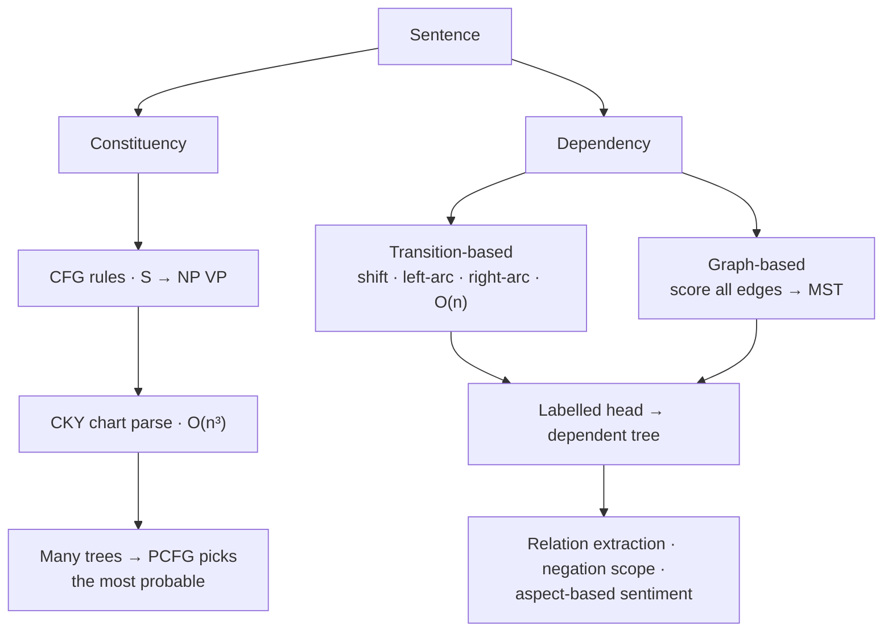

**In one line.** Recover the grammatical skeleton of a sentence — either as nested phrases or as head-to-dependent arrows.

## The idea in plain words

Two ways to describe sentence structure.

**Constituency** groups words into nested phrases: `S → NP VP`. A **context-free grammar** lists those rules, and the **CKY algorithm** fills a chart bottom-up to find every valid tree in O(n³). Real sentences are ambiguous — "I saw the man with the telescope" has several legal trees — so a **PCFG** attaches a probability to each rule and you keep the most probable tree.

**Dependency** parsing skips phrases and draws labelled arrows from each **head** word to its **dependents**: who is the subject of what, which adjective modifies which noun. Two families:

- **Transition-based** — shift/left-arc/right-arc, greedy, linear time. Fast, what spaCy ships.
- **Graph-based** — score every possible edge, take the maximum spanning tree. Slower, more accurate.

Dependencies travel better across languages, which is why **Universal Dependencies** standardised one label set for 100+ languages.



## How it works

### Grammars & structure

A **CFG** is rewrite rules like S → NP VP, NP → Det N, plus lexical rules N → dog. Applying them yields a **parse tree**.

### Bottom-up chart parsing

A **chart parser** stores every constituent it finds so it's computed once and reused. **CKY** fills a triangular table: cell (i,j) holds all non-terminals spanning words i–j.

:::note

**Chomsky Normal Form.** CKY needs rules of the form A → B C or A → w. Any CFG converts to CNF (remove unit/ε-rules, binarise long right-hand sides) — that's what makes the O(n³) chart possible.

:::

:::tip

**Worked chart — "the dog barked".** Span-1: (1)=Det, (2)=N, (3)=V/VP. Span-2: (1,2)=Det+N→**NP**. Span-3: (1,3)=NP+VP→**S**. S covers the sentence → it parses. Complexity **O(n³·|G|)**.

:::

### Probabilistic CFGs

A **PCFG** gives each rule a probability (rules per left-hand side sum to 1). A parse's probability is the **product** of its rules' probabilities.

#### Parse-probability calculator

Adjust rule probabilities and see the parse probability for "the dog saw the cat".

:::tip

**Worked.** With the default rules, the parse probability = product = **2.88 × 10⁻⁵**. The best parse (found by probabilistic CKY) is the most probable one.

:::

### Where probabilities come from

- **Learning rules** — Count rule frequencies in a **treebank**, or use the **inside-outside** EM algorithm without one.
- **Limits & fix** — Plain PCFGs ignore words (structural prob only), so "eat sushi with tuna/chopsticks" tie. **Lexicalised** PCFGs annotate each node with its head word; neural parsers score trees directly.

:::tip

**Evaluation.** PARSEVAL — labelled **precision** (predicted constituents that are correct) and **recall** (gold constituents recovered), combined as F₁. A constituent is correct only if label *and* span match.

:::

### Key takeaways

- **1 · CFG + parsing** — Rules define structure; parsing recovers the tree; ambiguity is explosive.
- **2 · CKY** — Chart parsing reuses sub-phrases; O(n³).
- **3 · PCFG** — Parse prob = product of rule probs; pick the most likely.

:::note

**The thread.** Natural language is deeply ambiguous, so parsing needs both an efficient search (CKY's chart reuses work to stay polynomial) and a way to choose among readings (a PCFG ranks parses by probability). The probabilities are learned from data, and parsers are judged by how well their constituents match a gold treebank.

:::

Instead of nesting words into phrases, **link them directly** — a labelled arc from each head to its dependent. Compact, close to meaning, great for free word order.

### Two views of syntax

- **Phrase structure** — Groups words into nested phrases (NP, VP…).
- **Dependency** — Links words directly: a labelled arc from each **head** to its **dependent** (subject, object, det…).

:::note

**The telescope again.** "I saw a girl with a telescope" is just a choice of head for "with" — attach to *saw* or to *girl*. Parsing is deciding which arc to draw.

:::

### Dependency trees & UD

One node per word plus a ROOT; every word has exactly one head; arcs form a connected, acyclic, single-head tree.

:::tip

**Universal Dependencies (UD)** is a cross-lingual standard label set (nsubj, obj, det, amod, case…), so the same scheme applies to any language.

:::

### Transition- vs graph-based

- **Transition-based** — Stack + buffer, one action per step: **SHIFT**, **LEFT-ARC**, **RIGHT-ARC**. Greedy, linear time O(n). A classifier picks the action.
- **Graph-based** — Score every possible arc; find the **maximum spanning tree** (Chu–Liu/Edmonds). Global search, more accurate on long-range links, higher cost.

### UAS & LAS

#### UAS / LAS calculator

Set sentence length, correct heads, and correct head+label counts.

:::tip

**Worked.** 10 words, 8 correct heads, 7 also correctly labelled → UAS = 8/10 = **0.80**, LAS = 7/10 = **0.70**. LAS ≤ UAS always (a label needs a correct head first).

:::

### Key takeaways

- **1 · Heads & arcs** — Dependency links head→dependent; single-head acyclic tree; UD labels.
- **2 · Two algorithms** — Transition-based (greedy O(n)) vs graph-based (max spanning tree).
- **3 · UAS/LAS** — Correct heads vs correct heads+labels; 0.80 / 0.70.

:::note

**The thread.** Dependency parsing represents syntax as direct labelled links between words, which is compact and language-agnostic. Transition-based parsers build the tree greedily in linear time; graph-based parsers search globally for the best tree; and UAS/LAS measure how many heads (and labels) they get right.

:::

## A real system that works this way

**Negation scope in clinical and legal text.** "No evidence of pneumonia" must not be indexed as a pneumonia diagnosis. Dependency paths give an auditable rule — if the entity is a descendant of a negation head, flip the polarity — which regulators can inspect in a way an LLM's answer cannot be.

**Grammars came back through serving.** Constrained decoding with a CFG or JSON schema is how inference engines force a model to emit valid JSON, SQL or a function call. The grammar is the same formalism; it is now applied to token masks rather than to parse charts.

## Code you can run

A CKY parser plus a probabilistic variant — the same chart, one keeping all trees, the other keeping the best.

```python
from collections import defaultdict
import itertools

# Grammar in Chomsky Normal Form, with rule probabilities
RULES = {
    ("S",):   [(("NP", "VP"), 1.0)],
    ("VP",):  [(("V", "NP"), 0.6), (("VP", "PP"), 0.4)],
    ("NP",):  [(("DET", "N"), 0.5), (("NP", "PP"), 0.2)],
    ("PP",):  [(("P", "NP"), 1.0)],
}
LEXICON = {
    "i": [("NP", 0.3)], "saw": [("V", 1.0)], "the": [("DET", 1.0)],
    "man": [("N", 0.5)], "telescope": [("N", 0.5)], "with": [("P", 1.0)],
}

def cky(words):
    n = len(words)
    chart = [[defaultdict(float) for _ in range(n + 1)] for _ in range(n + 1)]
    back = [[{} for _ in range(n + 1)] for _ in range(n + 1)]

    for i, w in enumerate(words):                       # lexical layer
        for tag, p in LEXICON[w.lower()]:
            chart[i][i + 1][tag] = p
            back[i][i + 1][tag] = w

    for span in range(2, n + 1):                        # build wider spans
        for start in range(n - span + 1):
            end = start + span
            for split in range(start + 1, end):
                left, right = chart[start][split], chart[split][end]
                for parent, productions in RULES.items():
                    for (b, c), p in productions:
                        if b in left and c in right:
                            score = p * left[b] * right[c]
                            if score > chart[start][end][parent[0]]:
                                chart[start][end][parent[0]] = score
                                back[start][end][parent[0]] = (b, c, split)
    return chart, back

def tree(chart, back, start, end, symbol):
    entry = back[start][end].get(symbol)
    if entry is None:
        return symbol
    if isinstance(entry, str):
        return f"({symbol} {entry})"
    b, c, split = entry
    return f"({symbol} {tree(chart, back, start, split, b)} {tree(chart, back, split, end, c)})"

words = "I saw the man with the telescope".split()
chart, back = cky(words)
print("best parse probability:", round(chart[0][len(words)]["S"], 5))
print(tree(chart, back, 0, len(words), "S"))
```

The chart holds every legal sub-analysis; the probabilities pick one. Swap the rule weights and the attachment of "with the telescope" flips — which is precisely how a PCFG resolves ambiguity.

## Designing with it

**Do you need a parser at all?**

| Need | Answer |
| --- | --- |
| Extract subject-verb-object triples at scale | Yes — dependency parse, cheap and deterministic |
| Detect negation/uncertainty scope in regulated text | Yes — dependency paths are auditable |
| General question answering over documents | No — use retrieval and an LLM |
| Force valid JSON/SQL out of a model | Yes, but as a **decoding grammar**, not a parser |

**Practical guidance**

- Use **spaCy** for dependencies in production: transition-based, fast, and it ships trained pipelines for dozens of languages.
- Parse **sentences, not documents** — sentence segmentation errors are the biggest source of garbage trees.
- For structured generation, prefer a **JSON schema / grammar constraint** at decode time over post-hoc parsing and retrying.
- Measure with **UAS/LAS** (unlabelled/labelled attachment score) if you train a parser; for downstream use, measure the extraction task instead.

## Where this stands in 2026

:::info Industry view

- Full constituency parsing rarely ships, but **grammars returned as decoding constraints** for JSON, SQL and tool calls.
- **Dependency parses are the cheap, auditable backbone** of relation extraction in clinical, legal and financial NLP.
- Universal Dependencies matters for multilingual products: one annotation scheme means one downstream rule set across languages.
- A good hybrid pattern in 2026: LLM extracts, dependency rules validate — the parser becomes the guardrail.

:::

## Practice questions

<details>
<summary><strong>Q1.</strong> What is a CFG, and what does parsing produce?</summary>

A context-free grammar is a set of rewrite rules (e.g. S → NP VP) plus lexical rules. Parsing applies them to a sentence to produce a parse tree showing its structure.<br /><em>Session 9 · conceptual</em>

</details>

<details>
<summary><strong>Q2.</strong> Why is 'ambiguity explosive' a problem, and how does a chart parser help?</summary>

A sentence can have exponentially many parses. A chart parser stores each constituent once and reuses it (CKY), keeping parsing polynomial — O(n³·|G|) in Chomsky Normal Form.<br /><em>Session 9 · conceptual</em>

</details>

<details>
<summary><strong>Q3.</strong> How does a PCFG score a parse tree?</summary>

It multiplies the probabilities of all the rules used to build the tree; the best parse is the one with the highest product (found by probabilistic CKY).<br /><em>Session 9 · conceptual</em>

</details>

<details>
<summary><strong>Q4.</strong> Compute the parse probability using: S→NP VP=1.0, NP→Det N=0.6, VP→V NP=0.5, Det→the=0.4, N→dog=0.1, N→cat=0.05, V→saw=0.2 for 'the dog saw the cat'.</summary>

Product = 1.0 × 0.6 × 0.4 × 0.1 × 0.5 × 0.2 × 0.6 × 0.4 × 0.05 = 2.88 × 10⁻⁵ (two NP→Det N, two Det→the, plus N→dog, V→saw, N→cat).<br /><em>Session 9 · numeric</em>

</details>

<details>
<summary><strong>Q5.</strong> Where do PCFG rule probabilities come from, and name one PCFG limitation.</summary>

From counting rule frequencies in a treebank, or the inside-outside (EM) algorithm without one. Limitation: PCFGs ignore lexical information and make strong independence assumptions.<br /><em>Session 9 · conceptual</em>

</details>

<details>
<summary><strong>Q6.</strong> What is Chomsky Normal Form and why does CKY need it?</summary>

CNF restricts rules to A → B C (two non-terminals) or A → w (a terminal). CKY combines exactly two shorter spans per cell, so the binary form is what makes the O(n³) chart algorithm work; any CFG can be converted to CNF.<br /><em>Session 9 · conceptual</em>

</details>

<details>
<summary><strong>Q7.</strong> Fill the CKY chart for 'the dog barked' with S→NP VP, NP→Det N, VP→V (Det→the, N→dog, V→barked).</summary>

Span-1: (1)=Det, (2)=N, (3)=V/VP. Span-2: (1,2)=Det+N → NP; (2,3) empty. Span-3: (1,3)=NP+VP → S. S spans the whole sentence, so it parses.<br /><em>Session 9 · numeric/logic</em>

</details>

<details>
<summary><strong>Q8.</strong> Name the three kinds of ambiguity and give the classic PP-attachment example.</summary>

Structural/attachment (‘I saw a girl with a telescope’ — PP attaches to VP or NP), coordination (‘old men and women’), and lexical (a word's part of speech).<br /><em>Session 9 · conceptual</em>

</details>

<details>
<summary><strong>Q9.</strong> What do lexicalised PCFGs fix, and how?</summary>

Plain PCFGs give ‘eat sushi with tuna’ and ‘eat sushi with chopsticks’ the same structural probability. Lexicalised PCFGs annotate each node with its head word so probabilities condition on the actual words, resolving the attachment.<br /><em>Session 9 · conceptual</em>

</details>

<details>
<summary><strong>Q1.</strong> How does dependency parsing differ from phrase-structure parsing?</summary>

Phrase structure groups words into nested constituents (NP, VP); dependency parsing links words directly with a labelled arc from each head to its dependent — compact and closer to meaning.<br /><em>Session 10 · conceptual</em>

</details>

<details>
<summary><strong>Q2.</strong> What three properties must a dependency tree have, and what is UD?</summary>

Every word has exactly one head, the arcs are connected and acyclic (a tree) rooted at ROOT. Universal Dependencies is a cross-lingual standard set of relation labels (nsubj, obj, det…).<br /><em>Session 10 · conceptual</em>

</details>

<details>
<summary><strong>Q3.</strong> Name the three arc-standard transition actions and their cost.</summary>

SHIFT (buffer→stack), LEFT-ARC, RIGHT-ARC. It is greedy and runs in linear time O(n).<br /><em>Session 10 · conceptual</em>

</details>

<details>
<summary><strong>Q4.</strong> How does graph-based parsing differ from transition-based?</summary>

Graph-based scores every possible arc and finds the maximum spanning tree (Chu–Liu/Edmonds) — a global search, more accurate on long-range dependencies but costlier than the greedy transition-based approach.<br /><em>Session 10 · conceptual</em>

</details>

<details>
<summary><strong>Q5.</strong> A 10-word sentence has 8 correct heads, 7 with correct head and label. Give UAS and LAS.</summary>

UAS = 8/10 = 0.80; LAS = 7/10 = 0.70. LAS is never higher than UAS because a correct label first requires a correct head.<br /><em>Session 10 · numeric</em>

</details>

## Further reading

- [Jurafsky & Martin, chapters 17–18 — Constituency and Dependency Parsing](https://web.stanford.edu/~jurafsky/slp3/) — CKY, PCFGs and both parser families.
- [Universal Dependencies](https://universaldependencies.org/) — the cross-lingual annotation standard and treebanks.
- [spaCy dependency parser](https://spacy.io/usage/linguistic-features#dependency-parse) — the production implementation.
- [Outlines: structured generation](https://dottxt-ai.github.io/outlines/) — grammars applied to LLM decoding.
- [Source lecture: nlp-s9-parsing](https://learning.bansal-ai.in/nlp-s9-parsing/lecture.html) — the original interactive lecture these notes were built from.
- [Source lecture: nlp-s10-dependency](https://learning.bansal-ai.in/nlp-s10-dependency/lecture.html) — the original interactive lecture these notes were built from.

- **[Speech and Language Processing (3rd ed. draft)](https://web.stanford.edu/~jurafsky/slp3/)** `book`
  Jurafsky & Martin — The definitive NLP textbook; chapters posted free as they are revised.
- **[Stanford CS224n](https://web.stanford.edu/class/cs224n/)** `course`
  Stanford — NLP with deep learning — slides, notes and lecture videos.
- **[The Illustrated Transformer](https://jalammar.github.io/illustrated-transformer/)** `docs`
  Jay Alammar — The clearest visual walkthrough of attention and the Transformer.
  Jurafsky & Martin — The definitive NLP textbook; chapters posted free as they are revised.
  Stanford — NLP with deep learning — slides, notes and lecture videos.
  Jay Alammar — The clearest visual walkthrough of attention and the Transformer.
