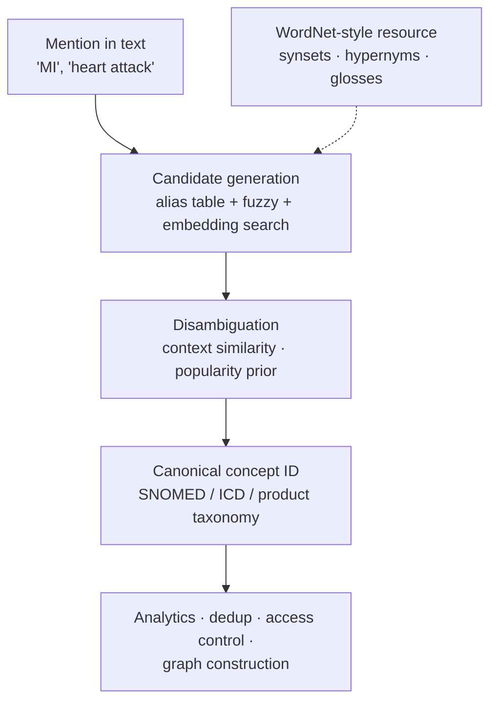

**In one line.** One string can mean several things; production systems care less about naming the sense than about mapping it to a canonical ID.

## The idea in plain words

**Polysemy** is a word with several related senses ("bank" the institution, "bank" the building). **Homonymy** is unrelated senses sharing a spelling ("bass" the fish, "bass" the frequency).

**WordNet** organised English into **synsets** — sets of synonymous senses — connected by relations: hypernym (is-a), hyponym, meronym (part-of), antonym. That graph is still a useful resource.

Classical **word-sense disambiguation**:

- **Lesk** — pick the sense whose dictionary gloss overlaps most with the surrounding words.
- **Supervised WSD** — train a classifier per ambiguous word, given labelled examples.
- **Contextual embeddings** — nearest sense vector to the token's contextual embedding. This is how it is done now, and it mostly happens implicitly inside whatever model you already run.

**What actually matters in industry** is the descendant task: **entity linking and terminology normalisation** — mapping "MI", "heart attack" and "myocardial infarction" to one concept ID so downstream analytics can count them together.



## How it works

### Words, lemmas & senses

A **lemma** (citation form) can carry several **senses** — "bank" = financial institution or river side.

:::note

**Example.** "I sat on the bank and watched the water" vs "I deposited the cheque at the bank." Only the surrounding words tell the senses apart.

:::

### A database of lexical relations

WordNet groups senses into **synsets** (synonym sets) linked by relations, each with a short definition (gloss).

- **Hypernym / hyponym** — is-a: dog → canine → animal. The backbone hierarchy.
- **Meronym / holonym** — part-of: wheel is part of a car.
- **Synonym / antonym** — same / opposite meaning.

### The Lesk algorithm

Knowledge-based WSD: pick the sense whose **gloss** shares the most words with the context.

#### Lesk overlap

Toggle which context words are present; see which sense's gloss overlaps most.

:::tip

**Worked.** Context \{bank, river, water, deposit\}. Sense 1 (money) overlaps \{deposit\} = 1; sense 2 (river) overlaps \{river, water\} = 2 → pick **sense 2**. Add "account" and sense 1 wins.

:::

### Supervised & reach

- **Supervised** — Train a classifier on sense-labelled data (nearby words, POS). Modern systems feed **contextual embeddings (BERT)** in — the vector already encodes the sense.
- **Evaluation** — Accuracy against annotated data (SemCor). The **most-frequent-sense** baseline is surprisingly strong.

:::note

**Reach.** Senses and WordNet feed IR, machine translation and QA, and connect to **semantic-web ontologies** and **knowledge graphs**.

:::

### Key takeaways

- **1 · Senses** — A lemma has many senses; WSD picks the one meant in context.
- **2 · WordNet** — Synsets linked by is-a, part-of, synonym/antonym; each has a gloss.
- **3 · Lesk** — Pick the sense whose gloss overlaps the context most.

:::note

**The thread.** Words are ambiguous, so meaning depends on context. WordNet gives an explicit map of senses and their relations; Lesk uses that map to disambiguate by gloss overlap; and modern systems let contextual embeddings do the same job implicitly — feeding into retrieval, translation and knowledge graphs.

:::

## A real system that works this way

**Clinical coding.** Free-text notes are normalised to SNOMED CT or ICD-10 codes; billing, cohort selection and safety monitoring all depend on that mapping. An LLM proposes the code, a terminology service validates it, and low-confidence cases go to a human coder.

**E-commerce catalogue normalisation.** "iPhone 15 Pro 256 GB", "Apple iPhone15Pro 256GB" and "iphone 15pro (256)" must collapse to one product ID before inventory or pricing means anything. This is entity linking with an alias table plus embedding search.

## Code you can run

Simplified Lesk, then an alias-plus-context linker — the classical method and its modern replacement, side by side.

```python
from collections import Counter
import math

GLOSSES = {
    "bank.financial": "a financial institution that accepts deposits and makes loans money",
    "bank.river":     "sloping land beside a river or lake water edge",
    "bass.fish":      "an edible freshwater or marine fish caught by anglers",
    "bass.music":     "the lowest range of musical frequency guitar sound speaker",
}

def lesk(word_senses, context):
    ctx = Counter(w.lower().strip(".,") for w in context.split())
    best, best_score = None, -1
    for sense in word_senses:
        gloss = Counter(GLOSSES[sense].split())
        overlap = sum(min(ctx[w], gloss[w]) for w in ctx if w in gloss)
        if overlap > best_score:
            best, best_score = sense, overlap
    return best, best_score

print(lesk(["bank.financial", "bank.river"], "I deposited money at the bank and got a loan"))
print(lesk(["bank.financial", "bank.river"], "We sat on the river bank near the water"))
print(lesk(["bass.fish", "bass.music"], "he caught a large bass while fishing in freshwater"))

# --- entity linking: alias table + context score + popularity prior -----------
CATALOGUE = {
    "SNOMED:22298006": dict(name="myocardial infarction",
                            aliases=["mi", "heart attack", "ami"], prior=0.6,
                            context="cardiac chest pain troponin ecg coronary"),
    "SNOMED:386661006": dict(name="fever",
                             aliases=["pyrexia", "high temperature"], prior=0.3,
                             context="temperature infection chills"),
    "MI:state": dict(name="Michigan", aliases=["mi"], prior=0.1,
                     context="state detroit usa address"),
}

def link(mention, context):
    mention = mention.lower()
    ctx = set(context.lower().split())
    scored = []
    for cid, e in CATALOGUE.items():
        if mention not in e["aliases"] and mention != e["name"]:
            continue
        overlap = len(ctx & set(e["context"].split()))
        scored.append((math.log(e["prior"]) + overlap, cid, e["name"]))
    scored.sort(reverse=True)
    return scored[:2]

print("\n'MI' in a cardiology note :", link("MI", "patient with chest pain and raised troponin"))
print("'MI' in an address field  :", link("MI", "shipping address detroit state usa"))
```

The same three characters resolve to a diagnosis or a US state depending on context — and the output is an **ID**, which is what downstream systems can actually join on.

## Designing with it

**Designing a normalisation layer**

| Stage | Technique | Notes |
| --- | --- | --- |
| Candidate generation | Alias table + trigram fuzzy match + embedding kNN | Recall matters most here; be generous |
| Disambiguation | Context overlap, popularity prior, cross-encoder | Combine signals; a prior alone causes systematic bias |
| Confidence | Calibrated score with a threshold | Below threshold → human review queue, never silent guess |
| Feedback | Log corrections back into the alias table | The alias table is the asset that compounds |

**Rules that save you later**

- **Store the mention, the ID and the score** — not just the ID. You will need to re-link when the taxonomy changes.
- **Version the taxonomy.** SNOMED, ICD and product catalogues change; a link is only valid relative to a version.
- **Never let the LLM invent IDs.** Constrain it to a retrieved candidate list, or you will get plausible codes that do not exist.

## Where this stands in 2026

:::info Industry view

- Explicit WSD is rare; **entity linking and terminology normalisation are everywhere** — they turn text into joinable data.
- Controlled vocabularies (SNOMED, ICD, MeSH, product taxonomies) are the industrial descendants of WordNet.
- LLMs propose, **terminology services validate** — the pattern that keeps hallucinated codes out of regulated systems.
- Lexical resources also serve as evaluation sets and as constraints on approved output vocabulary.

:::

## Practice questions

<details>
<summary><strong>Q1.</strong> Define lemma, sense and word sense disambiguation.</summary>

A lemma is the citation form representing a lexeme (e.g. 'bank'); a sense is one of its distinct meanings; WSD is choosing which sense is intended in a given context.<br /><em>Session 12 · conceptual</em>

</details>

<details>
<summary><strong>Q2.</strong> What is a synset, and name three WordNet relations.</summary>

A synset is a set of synonyms sharing one meaning. Relations: hypernym/hyponym (is-a), meronym/holonym (part-of), synonym/antonym.<br /><em>Session 12 · conceptual</em>

</details>

<details>
<summary><strong>Q3.</strong> How does the Lesk algorithm choose a sense?</summary>

It picks the sense whose dictionary gloss shares the most words with the surrounding context (maximum gloss–context overlap).<br /><em>Session 12 · conceptual</em>

</details>

<details>
<summary><strong>Q4.</strong> Context \{bank, river, water, deposit\}; sense-1 gloss \{financial, money, deposit, account\}, sense-2 gloss \{river, water, edge, land\}. Which does Lesk pick?</summary>

Sense 1 overlaps \{deposit\} = 1; sense 2 overlaps \{river, water\} = 2. Lesk picks sense 2 (river bank).<br /><em>Session 12 · numeric</em>

</details>

<details>
<summary><strong>Q5.</strong> How does modern supervised WSD work, and what's a strong baseline?</summary>

Train a classifier on sense-labelled data, typically feeding contextual embeddings (BERT) that already encode the sense. A strong baseline is the most-frequent sense.<br /><em>Session 12 · conceptual</em>

</details>

## Further reading

- [Jurafsky & Martin, chapter 23 — Word Senses and WordNet](https://web.stanford.edu/~jurafsky/slp3/) — senses, relations and WSD algorithms.
- [WordNet](https://wordnet.princeton.edu/) — the resource itself, still freely available.
- [spaCy EntityLinker](https://spacy.io/api/entitylinker) — a production-shaped linking component.
- [Source lecture: nlp-s12-word-senses](https://learning.bansal-ai.in/nlp-s12-word-senses/lecture.html) — the original interactive lecture these notes were built from.

- **[Speech and Language Processing (3rd ed. draft)](https://web.stanford.edu/~jurafsky/slp3/)** `book`
  Jurafsky & Martin — The definitive NLP textbook; chapters posted free as they are revised.
- **[Stanford CS224n](https://web.stanford.edu/class/cs224n/)** `course`
  Stanford — NLP with deep learning — slides, notes and lecture videos.
- **[The Illustrated Transformer](https://jalammar.github.io/illustrated-transformer/)** `docs`
  Jay Alammar — The clearest visual walkthrough of attention and the Transformer.
