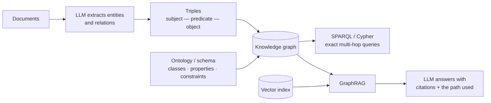

**In one line.** Store facts as subject-predicate-object triples and you can answer multi-hop questions exactly, with an audit trail a vector search cannot give you.

## The idea in plain words

A **knowledge graph** stores facts as **triples**: `(subject, predicate, object)` — `(aspirin, treats, headache)`. Millions of triples form a graph you can traverse.

Three layers to keep straight:

- **Data** — the triples themselves (RDF, or property graphs in Neo4j).
- **Schema / ontology** — what classes and properties are allowed, and what follows from them. If `treats` has domain `Drug` and range `Condition`, anything else is an error you can detect.
- **Query** — SPARQL for RDF, Cypher for property graphs. Both let you ask "find X where X connects to Y through Z", which is what multi-hop questions actually are.

**Why this came back.** Vector search gives fuzzy recall — it finds passages that *feel* related. It cannot reliably answer "which of our suppliers depends on a factory in this region, two tiers down". A graph can, exactly, and can show the path it used.

**GraphRAG** combines them: embeddings find the entry points, the graph walks the relationships, and the LLM writes the answer over both.



## How it works

### From documents to a Web of Data

The syntactic web links documents for humans — a machine sees words, not meaning. Data sit in isolated silos, unlinked, so simple questions have no direct answer.

:::tip

**Bookstore example.** Export shop A (a:author) and shop B (b:writer) as RDF, declare a:author ≡ b:writer (and a French shop's f:auteur), and the datasets merge into one queryable graph — then enrich with Wikipedia. That's Linked Open Data.

:::

:::note

**Layer cake.** URI/Unicode → XML → RDF → RDFS → OWL → Logic/Proof. Each layer adds machine-readable meaning on top of the one below.

:::

### Ontologies: the schema of meaning

An ontology is a formal, explicit specification of a shared conceptualisation.

- **Classes** — Concepts (Book, Person).
- **Properties** — Relations/attributes (hasAuthor).
- **Individuals** — Instances (a specific book) + constraints.

### RDF, RDFS & OWL

- **RDF** — Data model: facts as triples (subject, predicate, object), each a URI; syntaxes Turtle/RDF-XML.
- **RDFS** — Schema: classes, subclass/subproperty, domain & range.
- **OWL (Description Logics)** — Cardinality, disjointness, transitivity → automated reasoning; authored in Protégé.

:::tip

**Worked.** "Marie Curie won the Nobel Prize" → (Marie_Curie, won, Nobel_Prize). RDFS declares *won* domain Person, range Award → a reasoner infers Marie_Curie is a Person and Nobel_Prize an Award.

:::

### Where ontologies are used

- **Semantic search & life sciences** — Answer by meaning; integrate health records, COVID-19 datasets.
- **Sentiment, LinkedIn, & more** — Any setting where data from many sources must be linked and queried together.

:::note

**Building ontologies.** Ontology **engineering** (expert-authored), **reuse** (adopt shared vocabularies), and **learning** (extract concepts/relations from text).

:::

### KGs & Linked Open Data

A knowledge graph is a large graph of entities and relations (Google KG, Wikidata, DBpedia); build it by extracting entities/relations as triples. Linked Open Data interlinks datasets via shared URIs.

:::note

**Why it matters.** KGs power search, question answering, and increasingly ground LLMs with factual, up-to-date knowledge.

:::

### Key takeaways

- **1 · Meaning** — Ontologies specify classes/properties/individuals.
- **2 · Stack** — RDF → RDFS → OWL (triples → schema → logic).
- **3 · KG** — Entities + relations; linked open data.

:::note

**The thread.** Structured meaning turns text into knowledge a machine can reason over: ontologies define the vocabulary, RDF records the facts, and knowledge graphs weave them into a queryable web — now a key way to ground language models in truth.

:::

## A real system that works this way

**Supply-chain risk.** "Which products are exposed if this port closes?" needs three hops: port → supplier → component → product. No amount of semantic search answers it; a graph query does, and returns the exact chain for an analyst to check.

**Drug interaction and clinical decision support.** Relationships between drugs, conditions and contraindications are curated as a graph precisely because a wrong answer is dangerous and the reasoning must be inspectable.

**Fraud rings.** The signal is structural — accounts sharing devices, addresses and beneficiaries. You detect it by traversing, not by embedding.

## Code you can run

A tiny triple store with multi-hop queries and ontology validation — the whole idea in 60 lines.

```python
from collections import defaultdict

class TripleStore:
    def __init__(self):
        self.spo = defaultdict(lambda: defaultdict(set))   # subject → pred → objects
        self.ops = defaultdict(lambda: defaultdict(set))   # object  → pred → subjects
        self.types = {}

    def add(self, s, p, o):
        self.spo[s][p].add(o)
        self.ops[o][p].add(s)

    def declare(self, entity, cls):
        self.types[entity] = cls

    def objects(self, s, p):
        return self.spo[s][p]

    def subjects(self, p, o):
        return self.ops[o][p]

    def hops(self, start, path):
        """Follow a chain of predicates — this is what 'multi-hop' means."""
        frontier = {start}
        for pred in path:
            nxt = set()
            for node in frontier:
                nxt |= self.spo[node][pred]
            frontier = nxt
        return frontier

    def validate(self, schema):
        """Ontology check: every predicate's subject and object must have the right class."""
        problems = []
        for s, preds in self.spo.items():
            for p, objs in preds.items():
                if p not in schema:
                    problems.append(f"unknown predicate {p!r}")
                    continue
                domain, rng = schema[p]
                if self.types.get(s) != domain:
                    problems.append(f"{s!r} is {self.types.get(s)}, but {p!r} needs {domain}")
                for o in objs:
                    if self.types.get(o) != rng:
                        problems.append(f"{o!r} is {self.types.get(o)}, but {p!r} needs {rng}")
        return problems

kg = TripleStore()
for e, c in [("port-rotterdam", "Port"), ("acme-gmbh", "Supplier"), ("cell-x9", "Component"),
             ("ev-battery", "Product"), ("nordwind", "Supplier"), ("resistor-r2", "Component")]:
    kg.declare(e, c)

kg.add("acme-gmbh", "shipsVia", "port-rotterdam")
kg.add("nordwind", "shipsVia", "port-rotterdam")
kg.add("acme-gmbh", "supplies", "cell-x9")
kg.add("nordwind", "supplies", "resistor-r2")
kg.add("cell-x9", "partOf", "ev-battery")
kg.add("resistor-r2", "partOf", "ev-battery")

# "Which products are exposed if Rotterdam closes?" — three hops, answered exactly
suppliers = kg.subjects("shipsVia", "port-rotterdam")
exposed = set()
for s in suppliers:
    exposed |= kg.hops(s, ["supplies", "partOf"])

print("suppliers using the port :", sorted(suppliers))
print("products exposed         :", sorted(exposed))

SCHEMA = {"shipsVia": ("Supplier", "Port"),
          "supplies": ("Supplier", "Component"),
          "partOf":   ("Component", "Product")}
print("ontology violations      :", kg.validate(SCHEMA) or "none")

kg.add("ev-battery", "supplies", "cell-x9")          # deliberately wrong direction
print("after a bad triple       :", kg.validate(SCHEMA))
```

The validation step is the part teams skip and regret: **an ontology turns a data-quality bug into an error message** instead of a wrong answer that looks confident.

## Designing with it

**Graph or vectors?**

| The question is… | Use |
| --- | --- |
| "What does this document say about X?" | Vector search |
| "How is A connected to B?" / "everything two hops from C" | Graph query |
| "Summarise the themes across 10,000 documents" | Graph community summaries (GraphRAG) or map-reduce |
| "Show me why you believe that" | Graph — the path *is* the citation |

**Building one without drowning**

- **Start from the questions**, not the data. Write the ten queries the business needs, and model only the entities and relations those need.
- **Entity resolution is the hard part.** "ACME GmbH", "Acme G.m.b.H." and "ACME Germany" must collapse to one node. Budget more time for this than for extraction.
- **Let the LLM extract, but constrain it** to your schema's predicates and validate every triple before insert. Free-form extraction produces a graph nobody can query.
- **Version the schema** and keep provenance on every triple (source document, extractor version, confidence). Without provenance you cannot debug or retract.

**Cost note:** GraphRAG indexing (entity extraction + community summarisation over a corpus) is expensive up front and cheap at query time — the opposite profile to plain vector RAG. Justify it with the query patterns above.

## Where this stands in 2026

:::info Industry view

- **GraphRAG is why this topic returned**: vector recall plus graph precision plus an explainable path, which is what enterprise assistants are asked for.
- LLMs are now the cheapest way to *populate* a graph (entity and relation extraction), with human review on the high-stakes slice.
- Non-negotiable graph domains: compliance lineage, fraud rings, drug interactions, supply-chain dependency, identity resolution.
- The honest trade: graphs cost curation effort and give explainability; embeddings cost nothing to curate and give recall. Most serious systems pay for both.

:::

## Practice questions

<details>
<summary><strong>Q1.</strong> What is the Semantic Web, and how does it differ from the ordinary web?</summary>

The ordinary web links documents for humans; the Semantic Web adds machine-readable meaning so software can interpret and reason over data.<br /><em>Session 14 · conceptual</em>

</details>

<details>
<summary><strong>Q2.</strong> Define an ontology and its main components.</summary>

A formal, explicit specification of a shared conceptualisation, defining classes, properties (relations/attributes), individuals and constraints of a domain.<br /><em>Session 14 · conceptual</em>

</details>

<details>
<summary><strong>Q3.</strong> What is an RDF triple? Give an example.</summary>

A fact as (subject, predicate, object), e.g. (Marie_Curie, won, Nobel_Prize); resources are identified by URIs.<br /><em>Session 14 · numeric</em>

</details>

<details>
<summary><strong>Q4.</strong> Contrast RDF, RDFS and OWL.</summary>

RDF stores triples; RDFS adds a schema (classes, subclass/subproperty, domain/range); OWL adds rich logic (cardinality, disjointness, transitivity) enabling automated reasoning.<br /><em>Session 14 · conceptual</em>

</details>

<details>
<summary><strong>Q5.</strong> What is a knowledge graph, and what is Linked Open Data?</summary>

A large graph of real-world entities and their relations (e.g. Wikidata, DBpedia). Linked Open Data publishes and interlinks such datasets via shared URIs so queries can traverse across sources.<br /><em>Session 14 · conceptual</em>

</details>

## Further reading

- [RDF 1.1 Primer (W3C)](https://www.w3.org/TR/rdf11-primer/) — triples, graphs and vocabularies, from the standard itself.
- [SPARQL 1.1 Query Language](https://www.w3.org/TR/sparql11-query/) — the query language for RDF.
- [From Local to Global: A GraphRAG Approach (Microsoft Research)](https://arxiv.org/abs/2404.16130) — the paper behind the current GraphRAG wave.
- [Neo4j Cypher manual](https://neo4j.com/docs/cypher-manual/current/) — the property-graph alternative most teams actually deploy.
- [Source lecture: nlp-s14-semantic-web](https://learning.bansal-ai.in/nlp-s14-semantic-web/lecture.html) — the original interactive lecture these notes were built from.

- **[Speech and Language Processing (3rd ed. draft)](https://web.stanford.edu/~jurafsky/slp3/)** `book`
  Jurafsky & Martin — The definitive NLP textbook; chapters posted free as they are revised.
- **[Stanford CS224n](https://web.stanford.edu/class/cs224n/)** `course`
  Stanford — NLP with deep learning — slides, notes and lecture videos.
- **[The Illustrated Transformer](https://jalammar.github.io/illustrated-transformer/)** `docs`
  Jay Alammar — The clearest visual walkthrough of attention and the Transformer.
