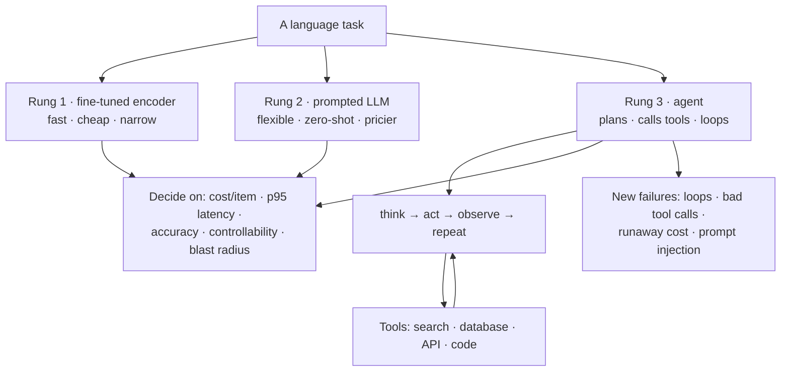

**In one line.** The design question is not which model, but which rung of the ladder — a small fine-tuned model, a prompted LLM, or an agent that plans and calls tools.

## The idea in plain words

The same task can be solved three ways, and they differ by orders of magnitude in cost and control.

**Rung 1 — a fine-tuned encoder.** Milliseconds, cents per million items, narrow. Best when the task is stable and high volume: classification, extraction, routing.

**Rung 2 — a prompted LLM.** Zero or few-shot, flexible, no training. Best for long-tail tasks, changing requirements, and anything needing generation. Costs 10–100× more per item.

**Rung 3 — an agent.** The model **plans**, calls **tools**, observes results and repeats until done. Best when the task needs external state or several steps: "find the customer's last order, check stock, draft the refund".

Agents add capability and a new class of failure: loops, tool errors, runaway cost, and **prompt injection** — untrusted text that hijacks the model's instructions.

The practical rule: **start at the lowest rung that solves the problem**, and move up only when you can show the lower rung failing.



## How it works

### Why Tagging Is Hard

If every word had exactly one tag, a dictionary would finish the job. The trouble is that the same word changes its part of speech with context. A tagger's real work is **disambiguation**: using the neighbours to decide which job a word is doing *here*.

:::note

**Analogy first.** A word is like a person with several possible roles. “Coach” could be a bus, a trainer, or the act of training. You don't know which until you see the company they keep. Is it “the team's new *coach*” or “I will *coach* you”? Context is the name-tag at the party.

:::

#### The set-up

Given words $w_1,\dots,w_n$, choose one tag $t_i$ per word from a fixed set. We use the **Penn Treebank** tags: `NN` noun, `NNS` plural noun, `VB` base verb, `VBZ` verb (-s form), `DT` determiner, `JJ` adjective, `PRP` pronoun. A first, naive tagger gives each word its single **most frequent** tag. We call this the *unigram baseline*. It shows exactly why context matters.

- **Worked example — the unigram baseline trips on “She books a flight”** — Press **Next step** to walk it. ▸ Next step↺ reset

#### Where this shows up in ML

The unigram baseline is a *lookup table* — the simplest possible model, with zero context. Every method in this lecture adds context in a smarter way. Each one really answers one question: how many of those context-only errors did we just erase?

:::tip

**Pitfall — “97% accuracy” hides where the errors live.** They cluster on exactly the ambiguous, high-information words (“books,” “that,” “back”) — the ones a downstream system most needs right. Judge a tagger by its hard cases.

:::

- **Check yourself · Foundations** — The unigram baseline scores about 97% per word. Why is that number misleading? Reveal answer **Answer:** the errors cluster on the few ambiguous words, such as “books” or “back”. **Why:** easy words are common and inflate the average. A high score can still miss the words that matter most.

### Words into Vectors

A neural network reads numbers, not letters. So the first job is to turn each word into a vector — a short list of numbers that captures its behaviour. Similar words land close together, so the model can generalise from “dog” to “cat.”

:::note

**Analogy first.** An **embedding** is a word's address in “meaning space.” Picture a huge map of towns, where each town is a word. Towns that trade with the same partners end up near each other. “King” and “queen” are neighbouring towns; “king” and “cat” are on different continents. The coordinates *are* the embedding.

:::

#### Measuring closeness

We score how alike two vectors are with the **cosine similarity** — the cosine of the angle between them. It is $+1$ for the same direction, $0$ for unrelated, negative for opposite. With the **dot product** $\mathbf{a}\cdot\mathbf{b}=\sum_i a_ib_i$ and length $\lVert\mathbf{a}\rVert=\sqrt{\sum_i a_i^2}$:

$$ \cos(\mathbf{a},\mathbf{b}) \;=\; \frac{\mathbf{a}\cdot\mathbf{b}}{\lVert\mathbf{a}\rVert\,\lVert\mathbf{b}\rVert} $$

- **Worked example — “king” sits near “queen,” far from “cat”** — Use tiny 2-D vectors $\textsf{king}=[0.9,0.8]$, $\textsf{queen}=[0.85,0.9]$, $\textsf{cat}=[-0.7,0.6]$. **king·queen:** dot $=0.9(0.85)+0.8(0.9)=1.485$; lengths $1.204,\,1.238$; so $\cos=\tfrac{1.485}{1.490}=$ **0.996** — nearly identical direction. **king·cat:** dot $=0.9(-0.7)+0.8(0.6)=-0.15$; so $\cos=\tfrac{-0.15}{1.110}=$ **−0.135** — essentially unrelated.

#### Move a word through meaning-space

Drag the two sliders to place a **mystery word** (cyan). Its cosine similarity to king, queen, and cat updates live. Park it near king/queen and watch both cosines shoot toward 1; swing it down toward cat and watch them fall. *Direction is meaning.*

#### Where this shows up in ML

Embeddings are the first layer of almost every modern NLP model. The same trick — one vector per token, similar tokens nearby — powers search, recommendation, and the input layer of every LLM. A small *character*-level network adds a second vector built from the spelling. So an unknown word like “blicking” still signals “-ing → probably a verb.”

:::tip

**Pitfall — plain embeddings are context-free.** Word2Vec/GloVe give “bank” the *same* vector by the river and in finance. That is fine as an input here, because the Bi-LSTM on top adds context. The contextual fix arrives with BERT (chapter 07).

:::

### The Bi-LSTM

Now the tagger reads the sequence of word-vectors and builds, for each position, a summary of everything around it. The workhorse is the **LSTM** — a recurrent network with a memory it learns to update word by word.

:::note

**Analogy first.** An LSTM is a notepad with three dials. As each word arrives, it makes three choices. How much of the old notes to *keep*? How much of the new word to *write down*? And how much to *read out* right now? Because it can keep a note unchanged, important facts survive across a long sentence.

:::

#### From RNN to gates

A plain recurrent network keeps a running summary $h_t$. But over a long sentence the early words fade. This is the **vanishing gradient** problem. The LSTM fixes this with three **gates**, each a sigmoid $\sigma(z)=\tfrac{1}{1+e^{-z}}$ giving a number in $(0,1)$ — a dial from closed to open:

$$\begin{aligned} f_t &= \sigma(W_f x_t + U_f h_{t-1} + b_f) &&\text{forget: keep how much old memory?}\\ i_t &= \sigma(W_i x_t + U_i h_{t-1} + b_i) &&\text{input: write how much new?}\\ g_t &= \tanh(W_g x_t + U_g h_{t-1} + b_g) &&\text{candidate: the new content}\\ o_t &= \sigma(W_o x_t + U_o h_{t-1} + b_o) &&\text{output: reveal how much?} \end{aligned}$$

The **cell state** $c_t$ (the notepad) and **hidden state** $h_t$ (what we read out) update as — with $\odot$ meaning multiply entry by entry:

$$ c_t = f_t\odot c_{t-1} + i_t\odot g_t, \qquad h_t = o_t\odot\tanh(c_t) $$

- **Worked example — one LSTM step, every number shown** — Scalar states: old memory $c_{t-1}=0.5$, old summary $h_{t-1}=0.3$, new word $x_t=1.0$. **Forget:** $z=0.5(1)+0.4(0.3)+0.1=0.72\Rightarrow f=\sigma(0.72)=$ **0.673**. **Input:** $z=0.69\Rightarrow i=$ **0.666**. **Candidate:** $z=0.76\Rightarrow g=\tanh=$ **0.641**. **Memory:** $c_t=0.673(0.5)+0.666(0.641)=0.336+0.427=$ **0.763**. **Output:** $o=\sigma(0.65)=$ **0.657**. **Read out:** $h_t=0.657\cdot\tanh(0.763)=0.657(0.643)=$ **0.422**.

#### Turn the three dials

Drag the inputs and watch the gates open and the memory update live. The ring shows each gate's opening; the bar shows the memory moving from $c_{t-1}$ to $c_t$. Push the **forget** dial closed (drag its weight down) and watch old memory get wiped; open it and the past survives.

:::note

**Both ways.** The “Bi” means we run two LSTMs — one left-to-right ($\overrightarrow{h_t}$), one right-to-left ($\overleftarrow{h_t}$) — and glue their summaries: $h_t=[\overrightarrow{h_t};\overleftarrow{h_t}]$. Press play and watch “bank” collect “river” from the left and the full stop from the right.

:::

#### Read the sentence both directions

Each pass sweeps the sentence and lights the word it is currently summarising. Only after *both* passes does “bank” see “river” (left) and “.” (right) at once.

#### Where this shows up in ML

Before Transformers, LSTMs powered machine translation, speech recognition, and text generation. The core idea is a learned gate that decides how much information flows. It survives everywhere, from GRUs to the gating inside modern architectures.

:::tip

**Pitfall — even an LSTM strains over long distances.** The gates are *learned*, not hand-set, and they help — but very long-range links still fade through the chain. That exact limitation is what self-attention removes in chapter 06.

:::

### The CRF Decoder

A determiner is almost never followed by a verb. The **CRF** (Conditional Random Field) uses facts like this. It scores the *entire* tag sequence at once and picks the best one. So the answer is always grammatically coherent — never locally greedy.

:::note

**Analogy first.** Tagging each word alone is like every musician playing their loudest note — it can be noise. The CRF is the conductor. It picks the notes that sound best *together*. One player may even have to soften their personal favourite. Like a crossword, you choose letters that make every crossing word legal.

:::

#### Two scores, one sequence

The **emission** score $E_i[t]$ comes from the Bi-LSTM: how well tag $t$ fits word $i$ alone. The **transition** score $T[a\!\to\!b]$ is a small learned table: how natural it is for tag $b$ to follow tag $a$. A sequence's score adds them all:

$$ \mathrm{Score}(t_1,\dots,t_n)=\sum_{i=1}^{n}E_i[t_i]+\sum_{i=2}^{n}T[t_{i-1}\!\to\!t_i] $$

To get probabilities we exponentiate and divide by the total over *every* sequence — the **partition function** $Z$. Training pushes up the true path's score relative to $Z$; **Viterbi** finds the best path without listing them all:

$$ P(t_1,\dots,t_n)=\frac{\exp\big(\mathrm{Score}(t_1,\dots,t_n)\big)}{Z},\qquad Z=\sum_{\text{all sequences}}\exp(\mathrm{Score}) $$

- **Worked example — “the plays”: greedy says verb, the CRF says noun** — Emissions — *the*: DT 5, NN 0, VBZ −2; *plays*: DT −3, NN 2, VBZ 3. Key transition $T[\textsf{DT}\!\to\!\textsf{NN}]=+4$. **Greedy** takes the biggest emission per word: DT, VBZ (score 5+3+$T[\textsf{DT}\!\to\!\textsf{VBZ}]$=7). **Best path:** DT→NN scores $5+4+2=$ **11**, because the DT→NN transition reward beats VBZ's higher emission. Softmax over all 9 paths gives $P(\textsf{DT NN})=e^{11}/Z=$ **0.975** vs $P(\textsf{DT VBZ})=e^{7}/Z=$ **0.018**.

#### Drag the transition and watch the best path flip

The lattice shows both words and all three tags. The dashed amber path is greedy; the solid green path is the CRF's best. Slide $T[\textsf{DT}\!\to\!\textsf{NN}]$: low, the CRF agrees with greedy (DT→VBZ); raise it past the crossover and the best path **snaps** to DT→NN. The readout shows every path score and the winning probability.

#### Where this shows up in ML

A CRF layer sits on top of sequence models for named-entity recognition, chunking, and segmentation. It fits anywhere the output is a *structured* sequence with rules. It is the canonical example of **structured prediction**: score the whole object, not each part alone.

:::tip

**Pitfall — don't confuse the two scores.** *Emission* is word-fits-tag (from the Bi-LSTM); *transition* is tag-follows-tag (the CRF table). Greedy, per-word decoding throws away the transition scores — exactly the information that keeps a sequence legal.

:::

### How Good Is It?

The full Bi-LSTM-CRF reaches roughly **97–98% token accuracy** on the Penn Treebank, every feature learned automatically. But “97% per word” hides a catch — a sentence is correct only if *every* word is.

:::note

**Analogy first.** A sentence is a chain. Each link (word) is strong 97% of the time, but a 20-link chain holds only if no link breaks. Small per-word error rates multiply into a much bigger chance that *some* word is wrong.

:::

#### Why one percent matters

Say each word is right with probability $a$, and errors are independent. Then a sentence of $n$ words is fully correct with probability $a^{\,n}$. This falls off fast as $n$ grows:

$$ P(\text{whole sentence correct}) \;=\; a^{\,n} $$

- **Worked example — how often is a 20-word sentence perfect?** — **Bi-LSTM-CRF ($a=0.97$):** $0.97^{20}=e^{20\ln0.97}=e^{-0.609}=$ **0.544** — only ~54% of 20-word sentences are flawless. **Transformer ($a=0.99$):** $0.99^{20}=e^{-0.201}=$ **0.818** — ~82%. A “tiny” 2-point per-word gain lifts whole-sentence accuracy from 54% to 82%.

#### Watch accuracy compound

Slide the per-token accuracy $a$ and the sentence length $n$. The curve is $a^{\,n}$; the dot marks your sentence. Nudge $a$ from 0.97 to 0.99 and watch the whole-sentence accuracy at $n=20$ leap — the compounding makes the last percent worth chasing.

#### Where this shows up in ML

The token-versus-sequence accuracy gap appears wherever outputs are structured — translation, code generation, speech. It is why leaderboards report exact-match alongside per-token scores. **Pros** of Bi-LSTM-CRF: accurate, learns its own features, strong even for low-resource languages with transfer. **Cons**: reads one word at a time, so training is slow — and it was overtaken by the Transformer.

:::tip

**Pitfall — real errors aren't perfectly independent**, so $a^{\,n}$ is an estimate, not a law. But the lesson holds: per-token accuracy flatters a tagger; always check sentence-level accuracy for tasks that need the whole sentence right.

:::

- **Check yourself · The neural baseline** — A Bi-LSTM already scores each tag well. What does the CRF layer add on top? Reveal answer **Answer:** the CRF adds transition scores and picks the best *whole* tag sequence. **Why:** tags depend on each other, so “DT then NN” can beat a higher single-word guess like VBZ.

### Self-Attention

The LSTM reads in order, so distant words communicate only through a long chain. The **Transformer** throws out the chain. Its engine is **self-attention**. Every word gathers information directly from every other word in a single step. Near or far costs the same.

:::note

**Analogy first.** Self-attention is a meeting. To understand your own role, you ask everyone how relevant they are to you. You listen *more* to the relevant people, and blend what they say into your notes. Distance around the table doesn't matter; relevance does.

:::

#### Query, key, value

Each word becomes three vectors. The **query** $q$ asks “what am I looking for?” The **key** $k$ says “what do I offer?” The **value** $v$ is the information I carry. Score every word by the dot product $q\cdot k_j$. Scale by $1/\sqrt{d}$ to keep the numbers tame, where $d$ is the vector size. Then softmax into weights and blend the values:

$$ \alpha_j=\mathrm{softmax}_j\!\left(\frac{q\cdot k_j}{\sqrt{d}}\right),\qquad \text{output}=\sum_j \alpha_j\,v_j $$

The weights $\alpha_j$ are positive and sum to 1 — a recipe for how much of each word to blend in. Stack several in parallel (**multi-head attention**), add a feed-forward network, repeat in layers: that's a Transformer encoder.

- **Worked example — tagging “bank”: attention locks onto “river”** — Query $q_{\textsf{bank}}=[1,2]$; keys $k_{\textsf{river}}=[1,2]$, $k_{\textsf{the}}=[2,0]$, $k_{\textsf{.}}=[0,1]$; $d=2$. Raw scores $5,2,2$; scaled by $1/\sqrt2$: $3.54,1.41,1.41$. Softmax → **river 0.807**, the 0.097, . 0.097. Blend values $v_{\textsf{river}}=[0,1]$ etc. → output $[0.145,\,\textbf{0.855}]$: a strong noun signal. “Bank” pulled 81% of its information straight from “river” — which could have been 50 words away at the same cost.

#### Aim the query, watch attention move

Pick which word is asking (the **query**), then swing its direction with the slider. The arcs over the sentence thicken with attention weight; the readout shows scores → softmax. Point the query at “river”'s direction and watch ~80% of the weight rush there — distance on the line is irrelevant.

#### Where this shows up in ML

Self-attention *is* the Transformer, and the Transformer is the backbone of BERT, GPT, and every modern LLM. The exact move here is simple: score with $q\cdot k$, normalise with softmax, then blend the values. This is how an LLM decides which earlier words matter for the next one.

:::tip

**Pitfall — attention is $\mathcal{O}(n^2)$.** Comparing every word with every word is fine for a sentence, heavy for a whole book. An attention weight also tells you what the model *looked at*, not the final tag. That comes from the layers on top.

:::

### Fine-tuning BERT & RoBERTa

Why teach a model English from scratch for every task? **BERT** and **RoBERTa** are Transformers already trained on enormous text — they arrive knowing grammar and a lot about the world. For tagging we just **fine-tune**: a far cheaper adaptation.

:::note

**Analogy first.** Pre-training is a general education; fine-tuning is a short job induction. Hiring a well-read graduate, you don't reteach them English. You give them a one-day course on your house style — which tag goes on which word — and they're productive. BERT is that graduate.

:::

#### Mask, then bolt on a head

Pre-training uses the **masked language model** trick: hide a word and predict it from both sides (“the river ___” → “bank”). To do that well, the model must learn syntax and meaning. Fine-tuning then adds one **classification head** — a single linear layer. It turns each token's contextual vector $\mathbf{h}$ into one **logit** (raw score) per tag, and softmax makes those into probabilities:

$$ \text{logits}=W\mathbf{h}+\mathbf{b},\qquad P(t)=\frac{e^{\text{logit}_t}}{\sum_{t'} e^{\text{logit}_{t'}}} $$

- **Worked example — reading the tag off “plays” in “she plays well”** — Contextual vector $\mathbf{h}=[0.5,-1.0,2.0,0.3]$. Head rows give logits: DT $=-1.15$, NN $=0.79$, VBZ $=2.15$. Softmax → $P(\textsf{DT})=0.029$, $P(\textsf{NN})=0.198$, $P(\textsf{VBZ})=$ **0.773**. The head reads off **VBZ** at 77%. That is correct for “she *plays* well.” The pre-trained vector already encoded “verb-after-she.” The one-line head only had to point at it.

#### Nudge the vector, flip the tag

The four sliders are BERT's contextual vector for the token. The bars are the head's tag probabilities, live. The head ties dimension 3 to “verbiness.” Drag it down and watch the winner switch from VBZ to NN. Same head, a different vector.

#### Where this shows up in ML

“Pre-train once, fine-tune cheaply” is the dominant recipe in modern NLP. The identical pattern — a small head on a strong backbone — powers named-entity recognition, sentiment, and question answering.

:::tip

**Pitfall — sub-word pieces.** BERT splits rare words into pieces (“playing” → “play” + “##ing”). The convention is to read the tag from the *first* piece. Forget this and words and tags misalign, silently wrecking accuracy.

:::

### Why Transformers Won

Fine-tuned Transformers reach roughly **98.5–99.5%** on POS tagging. Three advantages explain the takeover: they train fast, they capture the deepest context, and they ship inside the tools everyone already uses.

:::note

**Analogy first.** An LSTM reads a sentence the way you read aloud — one word after another, unable to start word $t$ before finishing $t-1$. A Transformer takes the whole sentence in at once, like photographing a page instead of reading it letter by letter. Same answer, far less waiting.

:::

- **Worked example — counting steps and counting mistakes** — **Sequential steps.** For a 50-word sentence the RNN needs 50 ordered steps; self-attention computes all positions together — about **1** step per layer. With enough hardware, a 50× gap in what must happen in sequence. **Mistakes on 1,000,000 tokens.** At 97% that's **30,000** wrong tags; at 99%, **10,000** — **20,000 fewer** errors, a 3× reduction, from the same two-point jump.

#### Sequential vs parallel, side by side

Set the sentence length, then press **run**. The RNN lane lights tokens one at a time (it must wait); the Transformer lane lights them all at once. The counter shows sequential steps: $n$ for the RNN, 1 for the Transformer.

#### Where this shows up in ML

The Transformer's parallelism is what made training on internet-scale data practical. So it is also what made today's large language models possible at all. POS tagging in **spaCy** and **Hugging Face** “just works” because they wrap a fine-tuned Transformer.

:::tip

**Pitfall — “parallel” means the positions of an input.** Generating text with an LLM is still left-to-right, one token at a time. And 99% is on clean benchmark text; tweets, code, and noisy domains are harder.

:::

- **Check yourself · The Transformer era** — An LSTM and a Transformer both read context. Why does the Transformer train so much faster? Reveal answer **Answer:** a Transformer reads all positions at once, while an LSTM must finish word $t-1$ before word $t$. **Why:** self-attention has no chain, so the work runs in parallel on the hardware.

### Prompting an LLM

A large language model has read so much text that it can tag a sentence with *no* task-specific training. We describe the job in words — a **prompt** — and read back the answer. No gradients, no fine-tuning corpus.

:::note

**Analogy first.** Fine-tuning rewires the model; prompting just *instructs* it. The skill is already inside. The prompt is the question that calls it out. It is like asking a fluent speaker to label parts of speech, not sending them back to school.

:::

#### Zero-shot vs few-shot

**Zero-shot** gives only the instruction. **Few-shot** adds a handful of solved examples first, so the model copies the format and the exact tag set.

- **Worked example — tagging “The concert was great.”** — **Zero-shot** (the slide's prompt) usually returns the right grammar — `The/DT concert/NN was/VBD great/JJ ./.` But it may slip on the *vocabulary*. You can get `great/ADJ` instead of the Penn Treebank `JJ`. **Few-shot** prepends two solved examples in the exact tag set; the model imitates the convention and returns `great/JJ`. A few in-context examples bought tag-set consistency with zero training.

#### Where this shows up in ML

Zero- and few-shot prompting is the everyday interface to modern LLMs. The same “describe the task, optionally show examples” pattern drives translation, extraction, and classification. That is most of what people ask an LLM to do.

:::tip

**Pitfall — LLMs can hallucinate.** They may invent a plausible-looking tag, drift off the requested set, or mis-segment punctuation. For high-volume, accuracy-critical tagging a fine-tuned Transformer is still cheaper and steadier — which sets up the agent idea.

:::

### LLM Agents

The final shift: POS tagging stops being the goal and becomes a *tool call*. An **LLM agent** is a language model that can use external tools. Faced with a messy request, it plans and calls a fast tagger for the labelling part. Then it folds the result back into its reasoning.

:::note

**Analogy first.** The LLM is a smart project manager. It doesn't personally do every precise measurement; it delegates the exact, repetitive part to a specialist tool, then writes up the result. Planning from the generalist, precision from the specialist.

:::

#### The agent loop

The loop has five short stages:

1. Read the request.
2. Break it into steps.
3. Call a tool for the step that needs it.
4. Read the tool's output.
5. Finish the task.

- **Worked example — “Analyse the sentiment of all nouns in the user reviews”** — **Plan:** (a) find the nouns, (b) judge the sentiment near each. **Call the tool:** `POS_tag("The battery is amazing but the screen is dull.")` → keep the NN words: **battery**, **screen**. **Use the tags:** battery↔amazing (+0.8), screen↔dull (−0.6). **Answer:** battery positive (+0.8), screen negative (−0.6). The LLM never had to be a great tagger — it *called* one.

#### Step through the agent loop

Press **next** to advance the agent one stage at a time. Watch the request flow through the five stages: *plan, call the POS tool, extract nouns, score sentiment, answer*. Each stage lights as it runs and prints what it produced.

#### Where this shows up in ML

This is **tool use** (or “function calling”): LLMs delegate to calculators, search, code runners, and taggers to stay accurate and current. POS tagging becomes one quiet utility among many inside larger AI systems.

:::tip

**Pitfall — the agent must trust and parse the tool's output**, and it can still mis-plan the overall task. Each tool call also costs time and money. The point is the division of labour, not magic: precise sub-tasks go to precise tools.

:::

- **Check yourself · LLMs & agents** — An LLM can tag with no training. So why would an agent still call a separate tagger? Reveal answer **Answer:** the small tagger is cheaper and steadier on high-volume work. **Why:** the LLM can drift off the tag set or mis-segment, so the agent delegates the precise part and keeps the planning.

### Conclusion: Is POS Tagging Solved?

In a narrow sense, yes. Deep learning took POS tagging to near-human accuracy; the state of the art is the fine-tuned Transformer at ~99%. And the frontier has moved: tagging is now an *internal utility* inside larger LLM systems, not a project in its own right.

:::note

**The one idea, restated.** Every method used *more context, more directly, more cheaply*. The climb went from a single word, to its neighbours, to every word at once. Then it reached all the language an LLM ever read. Finally it reached one that simply calls a tagger when it needs one.

:::

#### Climb the ladder

Click each method to see the context it uses and its rough accuracy — and watch the climb. Each rung leans on the one below it.

#### The whole lecture on one dial

This is the one axis the lecture was really about: how much context a method uses. Slide it from 0 to 4. The matching method lights up, and the readout prints its rough accuracy and its one-line trade-off.

- **The neural baseline** — Embeddings → Bi-LSTM (both ways, gated memory) → CRF (best whole sequence). ~97–98% on the Penn Treebank.
- **The Transformer era** — Self-attention reads every word at once; fine-tuned BERT/RoBERTa hit ~99% and ship inside spaCy and Hugging Face.
- **LLMs & agents** — Prompt a model with zero or few examples. Or let an agent call a fast tagger as a tool inside a bigger task.

:::note

**Where this leaves you.** The skill that matters now is less about building the best tagger. It is more about using tags well. You feed clean structure into search, extraction, sentiment, and agent pipelines. The ladder you just climbed is the mental map for how almost every NLP task has modernised.

:::

## A real system that works this way

**Customer support triage.** Rung 1 classifies the ticket into a queue (cheap, millions per day). Rung 2 drafts a reply for the agent to edit. Rung 3 only runs for "where is my order" — it calls the order API, the shipping API, and composes an answer. Same product, three rungs, chosen per task by cost.

**Coding assistants** are the clearest rung-3 systems in production: plan, edit files, run tests, read failures, retry — with a step budget and a human approving the diff.

## Code you can run

A minimal agent loop with a tool registry, step budget and error handling — the skeleton every framework wraps.

```python
import json, re

# ---------- tools: ordinary functions with a schema ----------
def get_order(order_id: str) -> dict:
    orders = {"A1001": {"item": "EV battery", "status": "shipped", "eta": "2026-09-22"}}
    if order_id not in orders:
        raise KeyError(f"no order {order_id}")
    return orders[order_id]

def check_stock(item: str) -> dict:
    return {"item": item, "in_stock": 14}

TOOLS = {
    "get_order": {"fn": get_order, "args": ["order_id"], "doc": "Look up an order by id."},
    "check_stock": {"fn": check_stock, "args": ["item"], "doc": "Stock level for an item."},
}

# ---------- a fake model: returns tool calls, then a final answer ----------
SCRIPT = [
    '{"tool": "get_order", "args": {"order_id": "A1001"}}',
    '{"tool": "check_stock", "args": {"item": "EV battery"}}',
    '{"answer": "Order A1001 (EV battery) shipped, ETA 2026-09-22; 14 still in stock."}',
]

def fake_model(messages):
    return SCRIPT[min(len([m for m in messages if m["role"] == "tool"]), len(SCRIPT) - 1)]

def run_agent(question, model=fake_model, max_steps=6, budget_tokens=4000):
    messages = [{"role": "user", "content": question}]
    spent = 0
    for step in range(max_steps):
        raw = model(messages)
        spent += len(raw) // 4                       # stand-in for token accounting
        if spent > budget_tokens:
            return "stopped: token budget exceeded", messages

        try:
            plan = json.loads(raw)
        except json.JSONDecodeError:
            messages.append({"role": "tool", "content": "error: reply must be JSON"})
            continue

        if "answer" in plan:
            return plan["answer"], messages

        name, args = plan.get("tool"), plan.get("args", {})
        spec = TOOLS.get(name)
        if spec is None:
            messages.append({"role": "tool", "content": f"error: unknown tool {name}"})
            continue
        if set(args) != set(spec["args"]):
            messages.append({"role": "tool", "content": f"error: {name} needs {spec['args']}"})
            continue

        try:
            result = spec["fn"](**args)
            messages.append({"role": "tool", "content": json.dumps(result)})
            print(f"  step {step}: {name}({args}) → {result}")
        except Exception as exc:                     # tools fail; agents must cope
            messages.append({"role": "tool", "content": f"error: {exc}"})
            print(f"  step {step}: {name} failed → {exc}")

    return "stopped: step budget exhausted", messages

answer, trace = run_agent("Where is order A1001 and can I order another?")
print("\nanswer:", answer)
print("steps taken:", sum(1 for m in trace if m["role"] == "tool"))
```

Note what is *engineering* rather than prompting: a tool registry with validated arguments, a **step budget**, a **token budget**, and every tool exception fed back as an observation instead of crashing the run.

## Designing with it

**Choosing the rung**

| Signal | Rung |
| --- | --- |
| Millions of items/day, stable schema | 1 — fine-tuned encoder |
| Long tail, changing requirements, generation needed | 2 — prompted LLM |
| Needs live data, multiple steps, or actions with effects | 3 — agent |

**Designing an agent that survives production**

- **Treat every tool call as an unreliable network call**: timeouts, retries with backoff, idempotency keys on anything that writes.
- **Budgets are mandatory** — max steps, max tokens, max wall-clock, max spend per task. Without them a loop is an outage.
- **Least privilege per tool.** Read-only by default; writes behind explicit approval. An agent that can refund money needs the same controls as a human who can.
- **Trace everything.** Store the full step trace (prompt, tool, args, result). Debugging an agent without traces is impossible.
- **Structured output, validated.** Use JSON-schema-constrained decoding and reject non-conforming replies rather than regex-parsing prose.

:::warning Prompt injection
Once an agent reads untrusted content — a web page, a PDF, a user's email — that content can issue instructions. Defences that actually help: keep retrieved text in a **data** role the model is told never to obey, restrict tool permissions per step, require human approval for irreversible actions, and never let retrieved content raise privileges. There is no prompt that reliably prevents this.
:::

**Evaluation changes shape too.** Accuracy gives way to task success rate, steps per task, cost per task, and intervention rate. Build that harness before scaling the agent.

## Where this stands in 2026

:::info Industry view

- The real 2026 decision is **which rung**, not which model — cost per item and tail latency usually decide it.
- **Agents need engineering, not prompting**: retries, budgets, idempotent tools, traces. Frameworks help but do not remove this work.
- **Prompt injection is the top security issue** for tool-using systems; isolate permissions and treat retrieved text as hostile data.
- Structured outputs with schema-constrained decoding have become the default interface between models and code.

:::

## Further reading

- [ReAct: Synergizing Reasoning and Acting in Language Models](https://arxiv.org/abs/2210.03629) — the think/act/observe loop implemented above.
- [Toolformer](https://arxiv.org/abs/2302.04761) — teaching a model when to call tools.
- [OWASP Top 10 for LLM Applications](https://owasp.org/www-project-top-10-for-large-language-model-applications/) — prompt injection and the rest of the threat model.
- [Anthropic: building effective agents](https://www.anthropic.com/research/building-effective-agents) — when an agent is the wrong answer, and what to build instead.
- [LangGraph documentation](https://langchain-ai.github.io/langgraph/) — a production-shaped agent runtime with state and checkpoints.
- [Source lecture: nlp-s9-llm-agentic](https://learning.bansal-ai.in/nlp-s9-llm-agentic/lecture.html) — the original interactive lecture these notes were built from.
