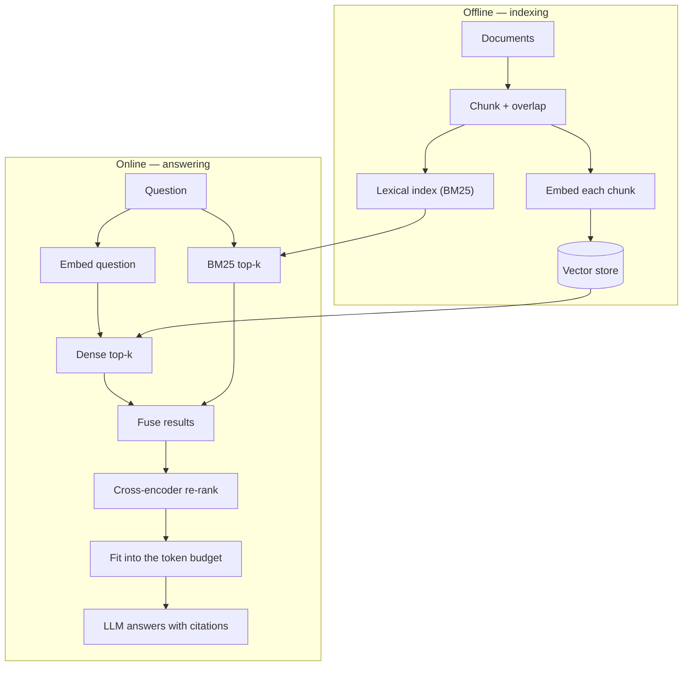

import RetrievalLab from '@site/src/components/viz/RetrievalLab';

**In one line.** Fetch the right passages first, then let the model write the answer over them — so it cites facts instead of inventing them.

## The idea in plain words

A bare LLM has three problems: it **hallucinates**, its knowledge is **frozen** at training time, and it cannot see your **private** data. Retrieval-augmented generation fixes all three without retraining.

Two phases.

**Offline — build the index.** Split documents into chunks, embed each chunk, store the vectors.

**Online — answer a question.** Embed the question, fetch the top-k similar chunks, re-rank them, paste the best into the prompt, and ask the model to answer *using only those passages*, with citations.

Everything that matters is in the details:

- **Chunking** — too small and you lose context; too large and you waste the budget and dilute the match. 300–800 tokens with ~15% overlap is the usual starting point.
- **The token budget** — context window minus the answer minus the system prompt is what remains for passages. That is a hard cap on k, which is why re-ranking matters.
- **Precision vs recall** — raise k and you catch the right passage more often but add noise. A cross-encoder re-ranker lets you fetch wide and then keep only the best.

And the distinction to remember: **RAG adds knowledge; fine-tuning changes behaviour.** They solve different problems.



<RetrievalLab />

## How it works

### The limits of a bare LLM

LLMs hallucinate, freeze their knowledge at training time, and can't see private or recent data. RAG supplies the missing facts at answer time.

### Index, retrieve, generate

- **Index (offline)** — Chunk documents → embed each → store in a vector database.
- **Retrieve + generate** — Embed the query → top-k similar chunks → augment the prompt → LLM generates a grounded answer.

:::tip

**Worked.** q=[1,0,1,0], chunk=[1,1,1,0] → cos = 2/(√2·√3) = **0.816** → retrieved into the prompt.

:::

### Token budget, precision & recall

The LLM's context window is finite: retrieved chunks + prompt + question + answer must all fit the token budget.

:::tip

**Worked.** 8,000-token window − 1,000 (answer) − 500 (prompt) = 6,500 for context ÷ ~500/chunk ≈ **13 chunks**. So k is capped — re-rank to keep the best.

:::

- **Recall** — Fraction of relevant chunks retrieved — low recall starves the model.
- **Precision** — Fraction of retrieved chunks that are relevant — low precision adds noise. Raising k trades precision for recall.

### Graph, multimodal & agentic RAG

- **Vector DB vs KG** — Vector = fuzzy semantic recall; Knowledge Graph = precise, multi-hop, structured facts.
- **Graph RAG** — Retrieve over both — fuzzy recall + explainable structure (LLM+KG synergy).
- **Multimodal & overlap** — Retrieve text/images/tables (e.g. Gemini); chunk overlap stops answers splitting across boundaries.

:::note

**Agentic RAG.** An agent decides what to retrieve, calls tools, and re-retrieves across steps until it can answer — for hard multi-hop questions. Watch pipeline latency = embed + search + re-rank + generation.

:::

### Choices & pitfalls

Quality depends on chunk size, overlap, the embedding model, k, and re-ranking.

:::note

**RAG vs fine-tuning.** RAG injects **knowledge**; fine-tuning shapes **behaviour**. They complement each other.

:::

### Key takeaways

- **1 · Why** — Fixes hallucination, stale & private data.
- **2 · Pipeline** — Index → retrieve top-k → augment → generate.
- **3 · Semantic search** — Rank by embedding cosine similarity.

:::note

**The thread.** RAG marries retrieval (from vector semantics) with generation (from LLMs): find the most relevant knowledge by embedding similarity, hand it to the model as context, and get answers grounded in real, current sources.

:::

## A real system that works this way

**Internal support assistants** are the archetype: thousands of policy documents, answers that must cite the clause they came from, and content that changes weekly. Retrieval is the only approach that keeps up without retraining.

**Customer-facing product help** adds a hard constraint — if nothing relevant is retrieved, the system must say "I do not know" rather than improvise. That refusal path is a design decision, not a model property.

**Code assistants** retrieve from the repository: the "documents" are files and symbols, and the retriever is usually hybrid because identifiers demand exact matching.

## Code you can run

A complete miniature RAG — chunking, hybrid retrieval, fusion, budget packing — in NumPy. No API keys needed.

```python
import math, re
from collections import Counter

DOCS = {
  "refunds.md": """Refunds are issued to the original payment method within 14 days.
Orders marked as damaged on arrival qualify for a full refund including shipping.
Digital goods are non-refundable once downloaded, except where required by law.""",
  "shipping.md": """Standard shipping takes 3-5 business days. Express is next-day
if ordered before 14:00. We ship to the EU, UK and US. Shipping costs are refunded
only when the order arrived damaged.""",
  "accounts.md": """You can reset a password from the login page. Account deletion
removes order history after 30 days. Support cannot change the email on an account.""",
}

# ---------- 1. chunk with overlap ----------
def chunk(text, size=22, overlap=6):
    words, out, i = text.split(), [], 0
    while i < len(words):
        out.append(" ".join(words[i:i + size]))
        i += size - overlap
    return out

CHUNKS = [(name, c) for name, text in DOCS.items() for c in chunk(text)]

# ---------- 2. two retrievers ----------
def tokens(s):
    return re.findall(r"[a-z]+", s.lower())

DF = Counter(t for _, c in CHUNKS for t in set(tokens(c)))
N = len(CHUNKS)
AVG_LEN = sum(len(tokens(c)) for _, c in CHUNKS) / N

def bm25(query, k1=1.5, b=0.75):
    scores = []
    for i, (name, c) in enumerate(CHUNKS):
        ct, dl = Counter(tokens(c)), len(tokens(c))
        s = 0.0
        for t in tokens(query):
            if t not in ct:
                continue
            idf = math.log(1 + (N - DF[t] + 0.5) / (DF[t] + 0.5))
            s += idf * ct[t] * (k1 + 1) / (ct[t] + k1 * (1 - b + b * dl / AVG_LEN))
        scores.append((s, i))
    return sorted(scores, reverse=True)

def fake_embed(text):
    """Stand-in for a real encoder: hashed bag of words, L2-normalised."""
    v = [0.0] * 64
    for t in tokens(text):
        v[hash(t) % 64] += 1.0
    norm = math.sqrt(sum(x * x for x in v)) or 1.0
    return [x / norm for x in v]

def dense(query):
    q = fake_embed(query)
    scores = [(sum(a * b for a, b in zip(q, fake_embed(c))), i)
              for i, (_, c) in enumerate(CHUNKS)]
    return sorted(scores, reverse=True)

# ---------- 3. reciprocal rank fusion ----------
def fuse(*rankings, k=60, top=4):
    points = Counter()
    for ranking in rankings:
        for rank, (_, idx) in enumerate(ranking):
            points[idx] += 1.0 / (k + rank + 1)
    return [idx for idx, _ in points.most_common(top)]

# ---------- 4. pack into the token budget ----------
def build_prompt(question, idxs, budget_words=60):
    used, passages = 0, []
    for i in idxs:
        name, c = CHUNKS[i]
        cost = len(c.split())
        if used + cost > budget_words:
            break
        passages.append(f"[{name}] {c}")
        used += cost
    context = "\n".join(passages)
    return (f"Answer ONLY from the passages. Cite the file name. "
            f"If the answer is absent, say you do not know.\n\n{context}\n\nQ: {question}"), passages

QUESTION = "do I get shipping costs back if my order arrived damaged?"
picked = fuse(bm25(QUESTION)[:6], dense(QUESTION)[:6])
prompt, passages = build_prompt(QUESTION, picked)

print("retrieved passages:")
for p in passages:
    print("  -", p[:88], "…")
print(f"\nprompt is {len(prompt.split())} words; the LLM sees only these passages")
print("\nretrieval hit the right doc:", any("shipping.md" in p for p in passages))
```

Both retrievers are needed: the lexical one locks onto "damaged" and "shipping", the dense one matches the paraphrase. Fusion gets the passage that a single retriever would miss.

## Designing with it

**The decision table**

| Choice | Default that works | When to change it |
| --- | --- | --- |
| Chunk size | 300–800 tokens, 10–20% overlap | Tables/code → chunk by structure, not length |
| Retrieval | Hybrid (BM25 + dense) with RRF | Pure dense only for short, paraphrase-heavy corpora |
| k before re-rank | 50–100 | Lower if latency-bound |
| Re-ranker | Cross-encoder on the top 50 | Skip only if p95 latency forbids it |
| Passages in prompt | 3–8 after re-rank | More is usually worse — noise beats coverage |
| Refusal | Explicit "not in the documents" path | Always, for customer-facing systems |

**Evaluate the halves separately** — this is the single most common mistake:

- **Retrieval**: recall@k, MRR, nDCG on a labelled question→passage set.
- **Generation**: faithfulness (is every claim supported by a retrieved passage?), answer relevance, citation correctness.

If you only measure end-to-end accuracy you cannot tell whether to fix the retriever or the prompt.

**Operational notes**

- **Version the index.** Changing the embedding model means a full re-index; treat it as a migration with a switchover plan.
- **Store chunk provenance** (document id, offsets, version) so citations point at something durable.
- **Freshness**: incremental upserts on document change beat nightly full rebuilds once the corpus is large.
- **Long context is not a replacement.** It is often cheaper to retrieve 6 good passages than to stuff 200k tokens, and quality degrades in the middle of long contexts.

## Where this stands in 2026

:::info Industry view

- **RAG is the default enterprise LLM architecture** — it fixes stale and private knowledge without retraining, and it produces citations, which is what compliance asks for.
- Quality is won in the unglamorous parts: **chunking, hybrid retrieval and a cross-encoder re-ranker**. Swapping the LLM is usually the smallest lever.
- **Measure retrieval and generation separately**, or you will tune the wrong half.
- RAG injects knowledge; fine-tuning shapes behaviour; long context trades cost for simplicity. Knowing when to use which is the expected senior answer.

:::

## Practice questions

<details>
<summary><strong>Q1.</strong> What limitations of LLMs does RAG address?</summary>

Hallucination, knowledge frozen at training time, and inability to see private/recent data. RAG supplies relevant external knowledge at answer time to ground the response.<br /><em>Session 15 · conceptual</em>

</details>

<details>
<summary><strong>Q2.</strong> Describe the two phases of a RAG system.</summary>

Indexing (offline): chunk documents, embed each chunk, store in a vector database. Retrieval + generation (online): embed the query, retrieve the top-k similar chunks, augment the prompt, and generate.<br /><em>Session 15 · conceptual</em>

</details>

<details>
<summary><strong>Q3.</strong> How does semantic search rank chunks, and why is it better than keyword matching?</summary>

By cosine similarity between query and chunk embeddings, so it matches on meaning rather than exact keywords.<br /><em>Session 15 · conceptual</em>

</details>

<details>
<summary><strong>Q4.</strong> Query q=[1,0,1,0], chunk d=[1,1,1,0]. Compute the retrieval cosine similarity.</summary>

cos = (q·d)/(‖q‖‖d‖) = 2/(√2·√3) = 2/2.449 = 0.816 — a strong match, so the chunk is retrieved.<br /><em>Session 15 · numeric</em>

</details>

<details>
<summary><strong>Q5.</strong> Name two RAG design choices and one common failure mode.</summary>

Choices: chunk size, embedding model, k, re-ranking. Failure: low retrieval recall (missing relevant context), misleading irrelevant chunks, or residual hallucination beyond the provided context.<br /><em>Session 15 · conceptual</em>

</details>

<details>
<summary><strong>Q6.</strong> Contrast RAG with fine-tuning.</summary>

RAG injects knowledge at answer time (easy to update, citable); fine-tuning shapes behaviour/style by adjusting weights. They are complementary.<br /><em>Session 15 · conceptual</em>

</details>

<details>
<summary><strong>Q7.</strong> An 8,000-token context window reserves 1,000 tokens for the answer and 500 for the prompt. With ~500-token chunks, how many chunks fit?</summary>

Context budget = 8000 − 1000 − 500 = 6,500 tokens; chunks ≈ 6500/500 = 13. So k is capped by the token budget — re-rank to keep the most relevant.<br /><em>Session 15 · numeric</em>

</details>

<details>
<summary><strong>Q8.</strong> Define precision and recall for retrieval, and the effect of raising k.</summary>

Recall = fraction of all relevant chunks retrieved; precision = fraction of retrieved chunks that are relevant. Raising k tends to raise recall but lower precision (more noise) — hence re-ranking.<br /><em>Session 15 · conceptual</em>

</details>

<details>
<summary><strong>Q9.</strong> Contrast a vector database with a knowledge graph for retrieval, and define Graph RAG.</summary>

A vector DB gives fuzzy, semantic recall but misses explicit relations; a knowledge graph gives precise, structured, multi-hop facts but needs curation. Graph RAG retrieves over both — semantic recall plus explainable structure.<br /><em>Session 15 · conceptual</em>

</details>

<details>
<summary><strong>Q10.</strong> What is multimodal RAG, and why use chunk overlap?</summary>

Multimodal RAG retrieves over text, images, tables and audio (e.g. Gemini). Chunk overlap shares a few sentences between adjacent chunks so an answer spanning a boundary isn't lost.<br /><em>Session 15 · conceptual</em>

</details>

<details>
<summary><strong>Q11.</strong> What is Agentic RAG and what are the stages of RAG pipeline latency?</summary>

Agentic RAG: an agent decides what to retrieve, calls tools, and re-retrieves across steps until it can answer (for multi-hop questions). Latency = embed-query + vector search + re-rank + LLM generation.<br /><em>Session 15 · conceptual</em>

</details>

## Further reading

- [Retrieval-Augmented Generation for Knowledge-Intensive NLP Tasks (Lewis et al.)](https://arxiv.org/abs/2005.11401) — the original RAG paper.
- [Lost in the Middle: How Language Models Use Long Contexts](https://arxiv.org/abs/2307.03172) — why passage order matters.
- [Sentence-Transformers: cross-encoder re-ranking](https://www.sbert.net/examples/applications/retrieve_rerank/README.html) — the retrieve-then-rerank pattern with code.
- [Ragas](https://docs.ragas.io/) — the standard library for faithfulness and retrieval metrics.
- [LlamaIndex documentation](https://docs.llamaindex.ai/) — a production-shaped RAG framework worth reading even if you build your own.
- [Source lecture: nlp-s15-rag](https://learning.bansal-ai.in/nlp-s15-rag/lecture.html) — the original interactive lecture these notes were built from.

- **[Speech and Language Processing (3rd ed. draft)](https://web.stanford.edu/~jurafsky/slp3/)** `book`
  Jurafsky & Martin — The definitive NLP textbook; chapters posted free as they are revised.
- **[Stanford CS224n](https://web.stanford.edu/class/cs224n/)** `course`
  Stanford — NLP with deep learning — slides, notes and lecture videos.
- **[The Illustrated Transformer](https://jalammar.github.io/illustrated-transformer/)** `docs`
  Jay Alammar — The clearest visual walkthrough of attention and the Transformer.
