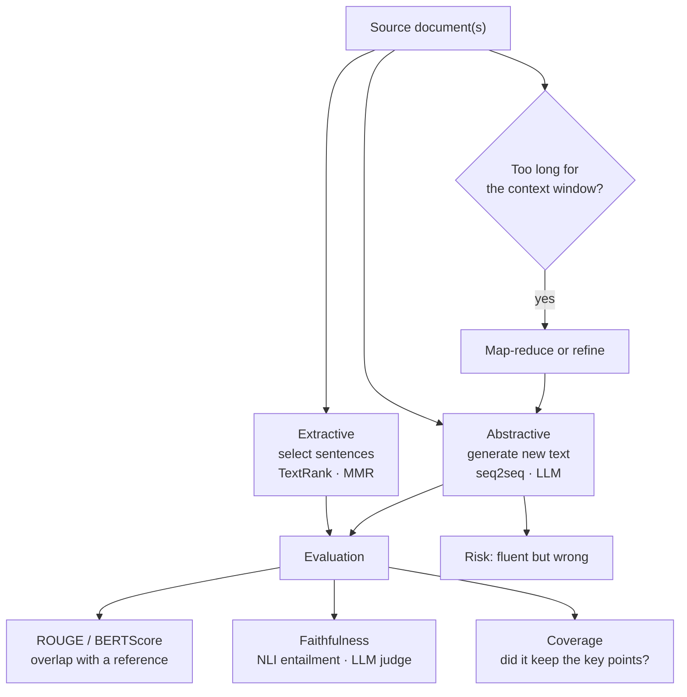

**In one line.** Shortening text is easy; keeping every claim true to the source is the part that decides whether you can ship it.

## The idea in plain words

Two families.

**Extractive** — pick the most important sentences from the source and stitch them together. Every sentence is verbatim, so it cannot invent anything. Classic methods score sentences by centrality (TextRank) and reduce redundancy (MMR).

**Abstractive** — generate new sentences that express the meaning. Fluent, compressible, and able to merge ideas across paragraphs — but it can state things the source never said.

**Evaluation is the hard part.** ROUGE counts n-gram overlap with a reference summary. It is cheap, reproducible, and blind to whether the summary is *true*: a fluent summary that swaps a number scores well.

So production systems measure **faithfulness** separately — does every claim follow from the source? — using entailment models or an LLM judge with the source in front of it.

For long inputs you must also choose a strategy: **map-reduce** (summarise chunks, then summarise the summaries), **refine** (carry a running summary through the document), or a **long-context** model in one pass.



## How it works

### What to summarize & how

Input: single- or multi-document. Output: generic or query-focused (key for summarization-for-QA, from factoid to complex/definition questions). Compression ratio = summary ÷ source length.

- **Extractive** — Select important sentences verbatim. Factual, robust; can be choppy. (Baseline: take the first sentences.)
- **Abstractive** — Generate new paraphrased text. Fluent; can hallucinate. (BART, T5, PEGASUS)

### Content selection, ordering, realization

- **1 · Content selection** — Rank sentences: frequency, tf·idf, LexRank (PageRank on a similarity graph), or supervised.
- **2 · Information ordering** — Arrange chosen content coherently (chronology, topic, templates).
- **3 · Sentence realization** — Compress and fix references for fluent prose.

:::tip

**tf·idf worked.** "learning" 6× in a 100-word doc → tf=0.06; in 10 of 1000 docs → idf=log(100)=2; tf·idf=0.12 — distinctive words score high, "the" scores ~0.

:::

### Neural (abstractive) summarization

Sequence-to-sequence Transformers pre-trained for summarization (BART, T5, PEGASUS): an encoder reads the document, a decoder writes a fluent summary — learning selection, ordering and realization end-to-end.

### ROUGE

Compare to human references by n-gram overlap: ROUGE-1/2 (unigram/bigram), ROUGE-L (longest common subsequence).

:::tip

**Worked.** "the cat sat" vs "the cat sat on the mat": ROUGE-1 overlap 3 → recall 0.6, precision 1.0, F1 = **0.75**. ROUGE-2 (bigrams): overlap 2 → recall 2/5 = **0.4**.

:::

### Key takeaways

- **1 · Two families** — Extractive (select) vs abstractive (generate).
- **2 · Models** — TextRank; BART/T5/PEGASUS.
- **3 · ROUGE** — n-gram overlap; F1 0.75 worked.

:::note

**The thread.** Summarization is the capstone application: extractive methods rank existing sentences, abstractive Transformers write fresh ones, and ROUGE measures how much of the reference's content the summary captures — the payoff of the whole NLP toolkit.

:::

## A real system that works this way

**Meeting and call summaries** are the most-deployed LLM feature in business software. The bar is not elegance — it is that action items and numbers are correct, because people act on them without reading the transcript.

**Clinical discharge summaries and legal briefs** usually mandate extractive or citation-anchored output: every sentence must trace to a source span, because an invented dosage or date is a safety and liability event.

**Ticket and incident digests** favour aggressive compression with a link back to the source, on the assumption that the reader will open the original when it matters.

## Code you can run

Extractive summarisation with TextRank plus MMR for diversity, then a faithfulness check — all in the standard library.

```python
import math, re
from collections import Counter

TEXT = """The payment service failed at 14:02 UTC after a config change removed a
database connection pool setting. Latency rose to 8 seconds and checkout errors
reached 42 percent. The on-call engineer rolled back the change at 14:19 UTC.
Error rates returned to baseline by 14:25 UTC. A postmortem found the config
schema had no validation for pool size. The team added schema validation and a
canary deploy step. No customer data was lost during the incident."""

def sentences(text):
    return [s.strip() for s in re.split(r"(?<=[.!?])\s+", text.strip()) if s.strip()]

def words(s):
    return [w for w in re.findall(r"[a-z]+", s.lower()) if len(w) > 2]

SENTS = sentences(TEXT)

def similarity(a, b):
    ca, cb = Counter(words(a)), Counter(words(b))
    shared = set(ca) & set(cb)
    if not shared:
        return 0.0
    num = sum(ca[w] * cb[w] for w in shared)
    den = math.sqrt(sum(v * v for v in ca.values())) * math.sqrt(sum(v * v for v in cb.values()))
    return num / den if den else 0.0

# ---------- TextRank: power iteration over the sentence-similarity graph ----------
def textrank(sents, damping=0.85, iters=60):
    n = len(sents)
    W = [[similarity(sents[i], sents[j]) if i != j else 0.0 for j in range(n)] for i in range(n)]
    scores = [1.0 / n] * n
    for _ in range(iters):
        new = []
        for i in range(n):
            incoming = 0.0
            for j in range(n):
                out = sum(W[j])
                if W[j][i] and out:
                    incoming += scores[j] * W[j][i] / out
            new.append((1 - damping) / n + damping * incoming)
        scores = new
    return scores

# ---------- MMR: relevance minus redundancy ----------
def mmr(sents, scores, k=3, lam=0.7):
    chosen = []
    candidates = list(range(len(sents)))
    while candidates and len(chosen) < k:
        best, best_val = None, -1e9
        for i in candidates:
            redundancy = max((similarity(sents[i], sents[j]) for j in chosen), default=0.0)
            val = lam * scores[i] - (1 - lam) * redundancy
            if val > best_val:
                best, best_val = i, val
        chosen.append(best)
        candidates.remove(best)
    return sorted(chosen)

scores = textrank(SENTS)
picked = mmr(SENTS, scores, k=3)
summary = " ".join(SENTS[i] for i in picked)
print("EXTRACTIVE SUMMARY\n ", summary, "\n")

# ---------- a crude faithfulness check for an abstractive summary ----------
def unsupported_numbers(summary, source):
    nums_src = set(re.findall(r"\d+(?:[.:]\d+)?", source))
    nums_sum = set(re.findall(r"\d+(?:[.:]\d+)?", summary))
    return sorted(nums_sum - nums_src)

good = "Checkout errors hit 42 percent until a rollback at 14:19 UTC restored service."
bad  = "Checkout errors hit 62 percent until a rollback at 14:19 UTC restored service."
for label, s in [("faithful", good), ("hallucinated", bad)]:
    missing = unsupported_numbers(s, TEXT)
    print(f"{label:13} unsupported numbers: {missing or 'none'}")
```

The number check is deliberately crude, and it still catches the class of error that hurts most. In production the same idea runs as an NLI entailment model over every claim.

## Designing with it

**Choosing the approach**

| Requirement | Approach |
| --- | --- |
| Every sentence must be traceable | Extractive, or abstractive with per-sentence citations |
| Fluent, compressed, merges ideas | Abstractive (LLM) |
| Input exceeds the context window | Map-reduce or refine; long-context as a simpler but pricier option |
| High volume, tight budget | Small fine-tuned seq2seq, or extractive |

**Design notes**

- **Define the summary contract**: length, audience, what must never be dropped (numbers, names, dates, action items). Put it in the prompt and in the eval set.
- **Map-reduce loses cross-chunk connections**; refine preserves them but is sequential and slower. Pick per document type.
- **Always keep a link to the source** and, where possible, span-level citations. It converts an accuracy problem into a verification affordance.
- **Guard the numbers.** A cheap post-check that every figure, date and name in the summary appears in the source catches the most damaging errors.

**Evaluation set**: 50–100 documents with human summaries and a list of must-keep facts beats any automatic metric alone. Score ROUGE for regression detection, faithfulness for shipping decisions.

## Where this stands in 2026

:::info Industry view

- Summarisation is now a **feature, not a product** — meeting notes, ticket digests, call summaries — and it is the most common first LLM use case in a company.
- **ROUGE is not enough**: production teams score faithfulness with NLI entailment or an LLM judge, because a fluent summary with a wrong number is worse than none.
- Long inputs force a real architecture choice: map-reduce/refine chains versus long-context models, decided on cost, latency and lost-in-the-middle behaviour.
- Regulated domains increasingly mandate extractive or citation-anchored summaries so every sentence traces to a source.

:::

## Practice questions

<details>
<summary><strong>Q1.</strong> What is text summarization, and what is the compression ratio?</summary>

Condensing a document into a shorter version that preserves the essential information. The compression ratio is summary length ÷ source length.<br /><em>Session 16 · conceptual</em>

</details>

<details>
<summary><strong>Q2.</strong> Contrast extractive and abstractive summarization.</summary>

Extractive selects important source sentences verbatim (factual, can be choppy). Abstractive generates new paraphrased text (fluent, but can hallucinate facts).<br /><em>Session 16 · conceptual</em>

</details>

<details>
<summary><strong>Q3.</strong> How does TextRank produce an extractive summary?</summary>

It builds a sentence-similarity graph and runs PageRank, so the most central sentences score highest and are selected.<br /><em>Session 16 · conceptual</em>

</details>

<details>
<summary><strong>Q4.</strong> Name two neural abstractive summarization models.</summary>

Transformer seq2seq models pre-trained for summarization, e.g. BART, T5, PEGASUS.<br /><em>Session 16 · conceptual</em>

</details>

<details>
<summary><strong>Q5.</strong> Candidate 'the cat sat', reference 'the cat sat on the mat'. Compute ROUGE-1 recall, precision and F1.</summary>

Overlap unigrams = 3; recall = 3/5 = 0.6, precision = 3/3 = 1.0, F1 = 2(1.0)(0.6)/(1.6) = 0.75.<br /><em>Session 16 · numeric</em>

</details>

<details>
<summary><strong>Q6.</strong> What does ROUGE not measure?</summary>

It measures n-gram content overlap with references, not fluency or factual faithfulness — so human and factuality checks remain necessary.<br /><em>Session 16 · conceptual</em>

</details>

<details>
<summary><strong>Q7.</strong> What are the three classical stages of extractive summarization?</summary>

Content selection (choose important sentences), information ordering (arrange coherently), and sentence realization (compress/fix references for readability).<br /><em>Session 16 · conceptual</em>

</details>

<details>
<summary><strong>Q8.</strong> Name four content-selection methods.</summary>

Frequency (greedy), tf·idf, LexRank (graph/PageRank), and supervised classification of in-summary sentences.<br /><em>Session 16 · conceptual</em>

</details>

<details>
<summary><strong>Q9.</strong> 'learning' appears 6 times in a 100-word document and in 10 of 1000 documents. Compute its tf·idf.</summary>

tf = 6/100 = 0.06; idf = log(1000/10) = log(100) = 2; tf·idf = 0.06 × 2 = 0.12 — distinctive words score high while ubiquitous words (idf→0) score ~0.<br /><em>Session 16 · numeric</em>

</details>

<details>
<summary><strong>Q10.</strong> What problem does Maximal Marginal Relevance (MMR) solve, and how?</summary>

It reduces redundancy: each next sentence is chosen to be relevant to the query yet novel relative to what's already selected — λ·Sim(s,query) − (1−λ)·max Sim(s,s′).<br /><em>Session 16 · conceptual</em>

</details>

<details>
<summary><strong>Q11.</strong> Candidate 'the cat sat', reference 'the cat sat on the mat'. Compute ROUGE-2 recall.</summary>

Candidate bigrams \{the-cat, cat-sat\} (2); reference bigrams \{the-cat, cat-sat, sat-on, on-the, the-mat\} (5); overlap = 2. ROUGE-2 recall = 2/5 = 0.4.<br /><em>Session 16 · numeric</em>

</details>

## Further reading

- [Jurafsky & Martin — summarisation chapter](https://web.stanford.edu/~jurafsky/slp3/) — extractive and abstractive methods with evaluation.
- [ROUGE: A Package for Automatic Evaluation of Summaries (Lin, 2004)](https://aclanthology.org/W04-1013/) — the metric, and what it actually measures.
- [SummEval: Re-evaluating Summarization Evaluation](https://arxiv.org/abs/2007.12626) — evidence that overlap metrics correlate poorly with human judgement.
- [BERTScore](https://arxiv.org/abs/1904.09675) — embedding-based scoring, a better default than ROUGE alone.
- [Source lecture: nlp-s16-summarization](https://learning.bansal-ai.in/nlp-s16-summarization/lecture.html) — the original interactive lecture these notes were built from.

- **[Speech and Language Processing (3rd ed. draft)](https://web.stanford.edu/~jurafsky/slp3/)** `book`
  Jurafsky & Martin — The definitive NLP textbook; chapters posted free as they are revised.
- **[Stanford CS224n](https://web.stanford.edu/class/cs224n/)** `course`
  Stanford — NLP with deep learning — slides, notes and lecture videos.
- **[The Illustrated Transformer](https://jalammar.github.io/illustrated-transformer/)** `docs`
  Jay Alammar — The clearest visual walkthrough of attention and the Transformer.
