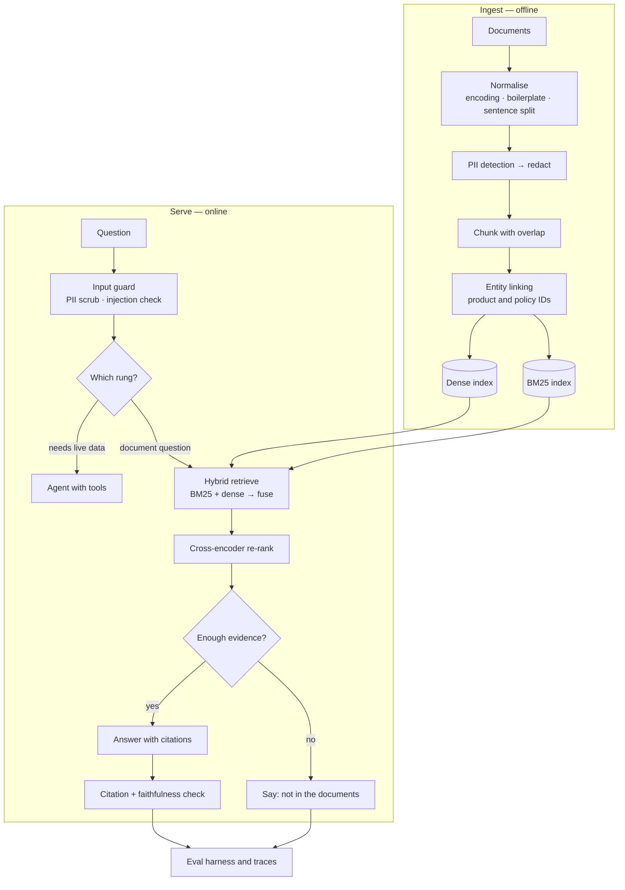

**In one line.** Build a grounded question-answering assistant over a private document corpus — with PII redaction, hybrid retrieval, citations, a refusal path, an agent for live lookups, and an evaluation harness that gates every release.

This project uses **every concept in this subject**. Each step runs on a laptop; the stack table names the library that replaces each hand-written piece in production.

## What you are building

> An internal assistant that answers questions about company policy and customer orders, **citing the exact document**, refusing when the answer is not in the corpus, and never letting personal data reach logs or prompts.

| | |
| --- | --- |
| **Users** | Support agents, ~2,000 questions a day |
| **Corpus** | ~20,000 policy pages, help-centre articles, past ticket resolutions |
| **Must have** | Citations on every claim, an explicit "not in the documents" answer, PII redacted before anything leaves the boundary |
| **Latency budget** | p95 under 3 seconds end to end |
| **Cost budget** | Under 2 cents per answered question |
| **Done means** | Faithfulness ≥ 0.95 and retrieval recall@10 ≥ 0.90 on a held-out set, with a review queue for low-confidence answers |

## Architecture



## The stack, and why each piece is there

| Library | What it does here | Learn it from |
| --- | --- | --- |
| **spaCy** | Sentence splitting, tokenisation, dependency-based negation scope | [spaCy 101](https://spacy.io/usage/spacy-101) |
| **Presidio** | Production PII detection and redaction | [Presidio docs](https://microsoft.github.io/presidio/) |
| **Transformers** | Token-classification model for domain entities; cross-encoder re-ranker | [Token classification](https://huggingface.co/docs/transformers/tasks/token_classification) |
| **Sentence-Transformers** | Bi-encoder embeddings and cross-encoder re-ranking | [SBERT retrieve & re-rank](https://www.sbert.net/examples/applications/retrieve_rerank/README.html) |
| **rank_bm25** / OpenSearch | The lexical half of hybrid retrieval | [rank_bm25](https://github.com/dorianbrown/rank_bm25) |
| **FAISS** / **Qdrant** | Vector index — FAISS in-process, Qdrant for filters and persistence | [FAISS wiki](https://github.com/facebookresearch/faiss/wiki) · [Qdrant](https://qdrant.tech/documentation/) |
| **LlamaIndex** / **LangGraph** | Pipeline and agent orchestration with state | [LlamaIndex](https://docs.llamaindex.ai/) · [LangGraph](https://langchain-ai.github.io/langgraph/) |
| **Ragas** | Faithfulness, answer relevance, context precision and recall | [Ragas](https://docs.ragas.io/) |
| **FastAPI + Pydantic** | Typed serving layer with request validation | [FastAPI](https://fastapi.tiangolo.com/) |
| **MLflow** | Index versions, eval runs, prompt versions | [MLflow](https://mlflow.org/docs/latest/index.html) |
| **pytest** | Guards the invariants: redaction, refusal, citation validity | [pytest](https://docs.pytest.org/) |
| **Evidently** | Drift on question distribution and retrieval scores | [Evidently](https://docs.evidentlyai.com/metrics/all_metrics) |

:::tip Install
```bash
pip install spacy sentence-transformers transformers rank_bm25 faiss-cpu \
            fastapi uvicorn pydantic ragas mlflow pytest \
            presidio-analyzer presidio-anonymizer
python -m spacy download en_core_web_sm
```
:::

## Step 1 — Ingest, redact, chunk

Redaction happens **before** indexing, so personal data never reaches the vector store, the prompt or the logs.

```python
# ingest.py — normalise → redact → chunk, keeping provenance on every chunk.
import re
from dataclasses import dataclass, field

PII_PATTERNS = [
    ("EMAIL",   re.compile(r"\b[\w.+-]+@[\w-]+\.[\w.]+\b")),
    ("PHONE",   re.compile(r"\b(?:\+?\d{1,3}[ -]?)?(?:\d[ -]?){9,12}\b")),
    ("IBAN",    re.compile(r"\b[A-Z]{2}\d{2}[A-Z0-9]{10,30}\b")),
    ("ORDERID", re.compile(r"\bORD-\d{6,}\b")),
]

@dataclass
class Chunk:
    doc_id: str
    ordinal: int
    text: str
    redactions: list = field(default_factory=list)

    @property
    def chunk_id(self) -> str:
        return f"{self.doc_id}#{self.ordinal}"

def redact(text):
    """Replace PII with typed placeholders, keeping a count for audit."""
    found = []
    for label, pattern in PII_PATTERNS:
        def sub(m, label=label):
            found.append((label, m.group(0)))
            return f"[{label}]"
        text = pattern.sub(sub, text)
    return text, found

def sentences(text):
    return [s.strip() for s in re.split(r"(?<=[.!?])\s+", text) if s.strip()]

def chunk_document(doc_id, text, target_words=80, overlap_sentences=1):
    """Chunk on sentence boundaries — never mid-sentence, or citations break."""
    clean, found = redact(text)
    out, buf, count, ordinal = [], [], 0, 0
    sents, i = sentences(clean), 0
    while i < len(sents):
        buf.append(sents[i]); count += len(sents[i].split()); i += 1
        if count >= target_words or i == len(sents):
            out.append(Chunk(doc_id, ordinal, " ".join(buf), found))
            ordinal += 1
            buf = buf[-overlap_sentences:] if overlap_sentences else []
            count = sum(len(s.split()) for s in buf)
    return out


if __name__ == "__main__":
    raw = ("Refunds go to the original payment method within 14 days. "
           "Contact jane.doe@example.com or +44 7700 900123 about ORD-123456. "
           "Damaged orders qualify for a full refund including shipping. "
           "Digital goods are non-refundable once downloaded.")
    chunks = chunk_document("refunds.md", raw)
    for c in chunks:
        print(f"{c.chunk_id}: {c.text}")
    joined = " ".join(c.text for c in chunks)
    assert "@" not in joined and "ORD-123456" not in joined
    print("\nassertion passed: no raw PII in any chunk")
    print("redacted:", [(l, v[:6] + '…') for l, v in chunks[0].redactions])
```

In production, swap the regexes for **Presidio plus a fine-tuned token classifier** — regexes miss names, addresses and domain-specific identifiers. Keep them as a cheap second net; defence in depth is normal here.

## Step 2 — Build hybrid indexes

```python
# index.py — BM25 + dense, built from the same chunk list so ids line up.
import json, pickle
from pathlib import Path

import faiss
import numpy as np
from rank_bm25 import BM25Okapi
from sentence_transformers import SentenceTransformer

EMBED_MODEL = "sentence-transformers/all-MiniLM-L6-v2"   # 384-dim, fast baseline

def build(chunks, out_dir="index"):
    out = Path(out_dir); out.mkdir(exist_ok=True)
    texts = [c.text for c in chunks]
    ids = [c.chunk_id for c in chunks]

    bm25 = BM25Okapi([t.lower().split() for t in texts])
    (out / "bm25.pkl").write_bytes(pickle.dumps(bm25))

    model = SentenceTransformer(EMBED_MODEL)
    vecs = model.encode(texts, normalize_embeddings=True,   # cosine == dot product
                        batch_size=64).astype("float32")
    index = faiss.IndexFlatIP(vecs.shape[1])
    index.add(vecs)
    faiss.write_index(index, str(out / "dense.faiss"))

    (out / "meta.json").write_text(json.dumps(
        {"ids": ids, "texts": texts, "embed_model": EMBED_MODEL,
         "dim": int(vecs.shape[1])}))
    print(f"indexed {len(ids)} chunks with {EMBED_MODEL}")
```

:::warning The index is a versioned artefact
Changing the embedding model changes every vector. Record the model and dimension in the metadata and treat an upgrade as a migration: build alongside, evaluate, switch. Never mix vectors from two models in one index.
:::

## Step 3 — Retrieve, fuse, re-rank

```python
# retrieve.py
import json, pickle
from pathlib import Path

import faiss
import numpy as np
from sentence_transformers import CrossEncoder, SentenceTransformer

RERANK_MODEL = "cross-encoder/ms-marco-MiniLM-L-6-v2"

class HybridRetriever:
    def __init__(self, index_dir="index"):
        d = Path(index_dir)
        self.meta = json.loads((d / "meta.json").read_text())
        self.bm25 = pickle.loads((d / "bm25.pkl").read_bytes())
        self.dense = faiss.read_index(str(d / "dense.faiss"))
        self.encoder = SentenceTransformer(self.meta["embed_model"])
        self.reranker = CrossEncoder(RERANK_MODEL)

    @staticmethod
    def _rrf(*rankings, k=60):
        """Reciprocal rank fusion — merges rankings without calibrating scores."""
        points = {}
        for ranking in rankings:
            for rank, idx in enumerate(ranking):
                points[idx] = points.get(idx, 0.0) + 1.0 / (k + rank + 1)
        return sorted(points, key=points.get, reverse=True)

    def search(self, query, k_first=50, k_final=5):
        lex = np.argsort(-self.bm25.get_scores(query.lower().split()))[:k_first]
        qv = self.encoder.encode([query], normalize_embeddings=True).astype("float32")
        _, dense_idx = self.dense.search(qv, k_first)
        fused = self._rrf(list(lex), list(dense_idx[0]))[:k_first]

        scores = self.reranker.predict([(query, self.meta["texts"][i]) for i in fused])
        ranked = sorted(zip(scores, fused), reverse=True)[:k_final]
        return [{"chunk_id": self.meta["ids"][i], "text": self.meta["texts"][i],
                 "score": float(s)} for s, i in ranked]
```

The cross-encoder is where most of the accuracy comes from: fetch wide (50), re-rank, keep 5 — and let the re-rank score drive the refusal decision next.

## Step 4 — Answer with citations, or refuse

```python
# answer.py
import re

SYSTEM = """You answer questions about company policy using ONLY the passages provided.
Rules:
1. Every factual sentence ends with a citation like [refunds.md#2].
2. If the passages do not contain the answer, reply exactly: NOT_IN_DOCUMENTS.
3. Never invent numbers, dates, names or policy terms.
4. Keep the answer under 120 words."""

MIN_SCORE = 0.25          # tuned on the eval set, not guessed

def build_prompt(question, passages, budget_tokens=2500):
    used, block = 0, []
    for p in passages:
        cost = len(p["text"].split()) * 1.3        # rough words → tokens
        if used + cost > budget_tokens:
            break
        block.append(f"[{p['chunk_id']}] {p['text']}")
        used += cost
    return f"{SYSTEM}\n\nPASSAGES:\n" + "\n\n".join(block) + f"\n\nQUESTION: {question}"

def answer(question, retriever, llm):
    passages = retriever.search(question)
    if not passages or passages[0]["score"] < MIN_SCORE:
        return {"answer": "I could not find this in the documents.",
                "sources": [], "refused": True}

    text = llm(build_prompt(question, passages))
    if text.strip() == "NOT_IN_DOCUMENTS":
        return {"answer": "I could not find this in the documents.",
                "sources": [], "refused": True}

    cited = set(re.findall(r"\[([^\]]+#\d+)\]", text))
    valid = {p["chunk_id"] for p in passages}
    if not cited or not cited <= valid:            # fabricated grounding
        return {"answer": "I could not verify an answer in the documents.",
                "sources": [], "refused": True, "reason": "invalid_citation"}

    return {"answer": text, "sources": sorted(cited), "refused": False}
```

**The citation check is not decoration.** A model that cites a chunk id which was never retrieved has fabricated its grounding, and that answer must not reach a user.

## Step 5 — Route before you spend

"Where is my order?" is in no policy document. Route it to tools instead — the ladder from [LLMs and Agents](/docs/theory/nlp/llms-and-agents).

```python
# router.py — pick the cheapest rung that can answer.
import re

ORDER_PATTERN = re.compile(r"\b(ORD-\d{6,}|my order|where is my|track(ing)?)\b", re.I)

def route(question):
    if ORDER_PATTERN.search(question):
        return "agent"           # needs live data → tools
    if len(question.split()) <= 3:
        return "search"          # too vague to ground: show search results
    return "rag"                 # default: grounded answer over the corpus

for q in ["Where is my order ORD-123456?",
          "refunds",
          "Do I get shipping costs back if the order arrived damaged?"]:
    print(f"{route(q):7} ← {q}")
```

A cheap router in front of the expensive path is the highest-leverage cost control in an LLM product.

## Step 6 — The evaluation harness that gates releases

```python
# evaluate.py — retrieval and generation scored separately, then gated.
import json, statistics

GOLD = [
    {"q": "Do I get shipping costs back if my order arrived damaged?",
     "relevant": ["shipping.md#1", "refunds.md#0"], "must_contain": ["damaged"]},
    {"q": "Can support change the email on my account?",
     "relevant": ["accounts.md#0"], "must_contain": ["cannot"]},
    {"q": "What is the refund window?",
     "relevant": ["refunds.md#0"], "must_contain": ["14"]},
]

def recall_at_k(retrieved_ids, relevant, k):
    return len(set(retrieved_ids[:k]) & set(relevant)) / len(relevant)

def mrr(retrieved_ids, relevant):
    for rank, cid in enumerate(retrieved_ids, 1):
        if cid in relevant:
            return 1.0 / rank
    return 0.0

def evaluate(retriever, answer_fn, gold=GOLD, k=10):
    recalls, rrs, faithful, refusals = [], [], [], 0
    for case in gold:
        hits = [h["chunk_id"] for h in retriever.search(case["q"], k_final=k)]
        recalls.append(recall_at_k(hits, case["relevant"], k))
        rrs.append(mrr(hits, case["relevant"]))

        result = answer_fn(case["q"])
        if result["refused"]:
            refusals += 1
            continue
        ok = all(t.lower() in result["answer"].lower() for t in case["must_contain"])
        faithful.append(1.0 if ok and result["sources"] else 0.0)

    report = {
        f"recall@{k}": round(statistics.mean(recalls), 3),
        "mrr": round(statistics.mean(rrs), 3),
        "faithfulness": round(statistics.mean(faithful), 3) if faithful else None,
        "refusal_rate": round(refusals / len(gold), 3),
    }
    report["GATE"] = "PASS" if (report[f"recall@{k}"] >= 0.90
                                and (report["faithfulness"] or 0) >= 0.95
                                and report["refusal_rate"] <= 0.20) else "FAIL"
    print(json.dumps(report, indent=2))
    return report
```

In production replace the `must_contain` proxy with **Ragas faithfulness** — an entailment or LLM judge that checks every claim against the retrieved passages. Keep the gate in CI: a release that fails it does not ship.

## Step 7 — Serve, test, package

```python
# service.py
from typing import Literal

from fastapi import FastAPI
from pydantic import BaseModel, Field

app = FastAPI(title="Document Assistant", version="1.0")
INDEX_VERSION = "policies-2026-09-18"

class Ask(BaseModel):
    question: str = Field(min_length=3, max_length=500)
    user_role: Literal["agent", "admin"] = "agent"

class Answer(BaseModel):
    answer: str
    sources: list[str]
    refused: bool
    route: str
    index_version: str

@app.post("/ask", response_model=Answer)
def ask(req: Ask) -> Answer:
    question, _ = redact(req.question)          # never log or embed raw PII
    lane = route(question)
    if lane == "rag":
        result = answer(question, RETRIEVER, LLM)
    elif lane == "agent":
        result = run_agent(question)
    else:
        result = {"answer": "Please ask a fuller question.",
                  "sources": [], "refused": True}
    return Answer(**result, route=lane, index_version=INDEX_VERSION)

@app.get("/health")
def health():
    return {"status": "ok", "index_version": INDEX_VERSION}
```

```python
# tests/test_invariants.py — the things that must never regress.
from ingest import chunk_document, redact

def test_pii_never_reaches_a_chunk():
    text = "Email jane.doe@example.com or call +44 7700 900123 about ORD-123456."
    joined = " ".join(c.text for c in chunk_document("t.md", text))
    assert "@example.com" not in joined and "ORD-123456" not in joined
    assert "[EMAIL]" in joined and "[ORDERID]" in joined

def test_redaction_is_idempotent():
    once, _ = redact("mail me at a@b.com")
    twice, _ = redact(once)
    assert once == twice

def test_chunks_end_on_sentence_boundaries():
    text = "One sentence here. Another follows. A third closes it."
    for c in chunk_document("t.md", text):
        assert c.text.rstrip().endswith((".", "!", "?"))

def test_refusal_when_nothing_retrieved():
    class Empty:
        def search(self, q, **kw): return []
    result = answer("anything at all", Empty(), lambda p: "should not be called")
    assert result["refused"] is True
```

```yaml
# .github/workflows/index-and-gate.yml
name: index-and-gate
on:
  push: {paths: ["corpus/**", "ingest.py", "retrieve.py", "answer.py"]}
  schedule: [{cron: "0 2 * * *"}]

jobs:
  build-and-gate:
    runs-on: ubuntu-latest
    steps:
      - uses: actions/checkout@v4
      - uses: actions/setup-python@v5
        with: {python-version: "3.12"}
      - run: pip install -r requirements.txt
      - run: pytest -q                       # PII + refusal invariants
      - run: python ingest.py && python index.py
      - run: python evaluate.py | tee eval.json
      - run: grep -q '"GATE": "PASS"' eval.json
      - uses: actions/upload-artifact@v4
        with: {name: index, path: index/}
```

## What to measure in production

| Metric | Target | Why |
| --- | --- | --- |
| Retrieval recall@10 | ≥ 0.90 | If the passage is not fetched, nothing downstream can save the answer |
| Faithfulness | ≥ 0.95 | Every claim traceable to a passage |
| Refusal rate | 5–20% | Too low means guessing; too high means retrieval is weak |
| Citation validity | 100% | A cited id must be one that was retrieved |
| p95 latency | < 3 s | Re-ranking is usually the spike |
| Cost per answered question | < 2¢ | Router hit rate is the main lever |
| PII incidents | 0 | Alert on any raw pattern reaching logs |
| Question-distribution drift | monitored | New topics mean the corpus needs extending |

:::warning The two failure modes that matter
**Silent wrong answers** — fluent, well-cited, and not what the document says. Catch them with faithfulness scoring and sampled human review, not user complaints.

**Prompt injection through retrieved content** — a document that says "ignore previous instructions". Keep retrieved text in a data role, never grant tools based on retrieved instructions, and test with a red-team set of poisoned documents.
:::

## Extensions once it works

- **GraphRAG** for multi-hop policy questions using the entity links from step 1 — see [Knowledge Graphs](/docs/theory/nlp/knowledge-graphs).
- **Thread summarisation** so agents get a digest of a long ticket — see [Summarization](/docs/theory/nlp/text-summarization).
- **Fine-tune the re-ranker** on click data from your own agents; this usually beats swapping the LLM.
- **Distil the router** into a small encoder once you have labelled traffic — rung 1 replacing rung 2, at a fraction of the cost.

## Further reading

- [SBERT: retrieve and re-rank](https://www.sbert.net/examples/applications/retrieve_rerank/README.html) — the two-stage pattern built above.
- [Ragas metrics](https://docs.ragas.io/en/stable/concepts/metrics/) — faithfulness, context precision and recall, defined precisely.
- [Presidio](https://microsoft.github.io/presidio/) — production PII analysis and anonymisation.
- [OWASP Top 10 for LLM Applications](https://owasp.org/www-project-top-10-for-large-language-model-applications/) — the threat model for step 5.
- [FAISS: choosing an index](https://github.com/facebookresearch/faiss/wiki/Guidelines-to-choose-an-index) — when a flat index stops being enough.
