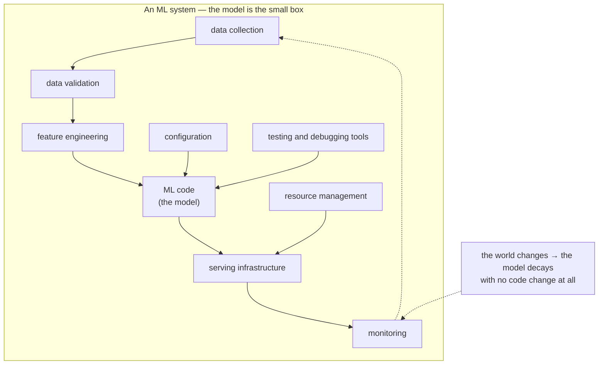

**In one line.** The model is a small part of the system, and the parts around it are where almost all the engineering effort goes.

## The idea in plain words

Ordinary software is specified: you write the rules, and a test asserts the rule holds. Machine learning inverts that — **behaviour is induced from data**, so three assumptions break at once.

- **Correctness becomes statistical.** There is no "the function is right"; there is a distribution of outcomes and a threshold you agreed with the business. A single wrong prediction is not a bug.
- **Data is now code.** Change the training data and behaviour changes, with nothing in the diff. Data therefore needs versioning, review and tests, exactly like source.
- **The system decays while you do nothing.** The world moves, the input distribution shifts, and yesterday's model quietly gets worse. Software rots only when you change it; ML rots on its own.

The consequence is the famous picture: **the model is a tiny box** in a diagram dominated by data collection, feature engineering, serving, monitoring, configuration and tooling. Teams that skip those boxes build a notebook that works once.

The engineering discipline is the same discipline as ever — requirements, architecture, testing, operations — applied to a component whose behaviour you fit rather than write.



## How it works

### The SDLC & its roles

Software does not appear fully formed. A team plans, builds, tests, ships, and maintains it. The **Software Development Life Cycle (SDLC)** is the staged process that organises all of this. And a cast of specialised roles carries the work through it.

:::note

**Analogy first.** Think of building a house. The family describes what they need (*requirements*). An architect draws plans (*design*). Builders lay bricks (*implementation*). Inspectors check the wiring (*testing*). The family moves in (*deployment*). For decades you fix leaks (*maintenance*). Software follows the same arc — the bricks are just code.

:::

#### The stages, and who owns them

The SDLC is a sequence of activities: **requirements → design → implementation → testing → deployment → maintenance**. Each role below owns part of that arc. A key practice is **shift-left testing**: moving testing *earlier*, so defects are caught when they are cheapest to fix.

#### Walk a feature through the SDLC

Click a **role** to see which stage it drives light up, with what it does. Toggle **shift-left** to watch QA move earlier in the timeline — and the project's late-defect cost drop.

:::tip

**Worked example. One "add Google login" feature, seven roles.** 1 · The **Product Owner** picks it for this quarter. 2 · The **Business Analyst** writes the requirement: "sign in with Google in under 10s". 3 · The **Architect** chooses OAuth 2.0. 4 · **Developers** build the button + token exchange. 5 · **QA/Testers** try wrong passwords, expired tokens, dropped networks. *Shift-left*, before release. 6 · The **Scrum Master** unblocks the late API key. 7 · The **Project Manager** confirms it ships on date. One small feature; the whole cast.

:::

#### Where this shows up in ML

Every role above survives when the product contains a model. But ML *adds* roles (data scientist, ML engineer) and bends old activities. Testing a model is nothing like testing a login button, as Session 2 will show.

### Toward Cloud Native

Software moved from slow, monolithic releases to small, fast, independently deployable pieces running in the cloud. "Cloud Native" is not one tool. It is a **stack of practices that fit together**.

:::note

**Analogy first.** Old way: one giant food truck that cooks every dish — if the fryer breaks, the whole truck shuts. Cloud Native: a food court of small stalls (*microservices*), each in an identical kiosk (*container*), that you add or repair without closing the others. Busy night? Roll in more kiosks (*cloud scaling*).

:::

$$ \text{Cloud Native App} = \text{Agile} + \text{DevOps} + \text{Microservices} + \text{Containers} + \text{Cloud} $$

Each term removes a specific pain. Agile removes slow planning. DevOps removes the wall between coding and releasing. Microservices remove the fragility of one giant codebase. Containers remove "it worked on my machine". The cloud removes buying hardware up front.

#### Build the stack, watch resilience rise

Toggle each practice on. The bar shows how **resilient and scalable** the app becomes. And the canvas morphs from one fragile monolith into a scalable food court of services. Turn them all on to reach a true Cloud Native app.

#### Where this shows up in ML

ML systems are increasingly Cloud Native: a model is wrapped as a microservice behind an API, shipped in a container. Scaled on the cloud when traffic spikes. The course tools — Docker, Kubernetes, FastAPI, SageMaker — are exactly this stack.

### Data → decisions

**Data science** is the art of uncovering insights hiding in data. In one line: it turns data into a *story*, the story uncovers *insights*, and the insights drive *decisions*. Machine learning is only one layer of it.

:::note

**Analogy first.** A doctor does data science on you. Symptoms and test results are the *data*; the diagnosis is the *insight*; the prescription is the *decision*. Nobody wants the raw blood-test numbers — they want the doctor's story about what the numbers mean.

:::

#### The data-science hierarchy of needs

Like Maslow's pyramid, advanced work rests on basic work being done first. You cannot do reliable AI on top of data you cannot even collect cleanly. The layers, bottom to top: **collect → store/move → clean &. Label → aggregate &. Explore → learn &. Optimise (ML) → AI**.

#### Stack the pyramid — then shake it

Click a layer to mark it **solid** or **leaky**. Everything *above* a leaky layer turns shaky — watch the AI capstone wobble and the stability score fall. The lesson: a fancy model on bad data is worse than no model.

#### Where this shows up in ML

This single picture reframes the whole course: most engineering effort lives in the layers *below* the model. The model is the tip, not the iceberg.

### ML & its three moving parts

**Machine learning** uses data and algorithms to imitate how humans learn, improving with experience. The defining move: instead of a programmer writing the rules, the *data* teaches the rules. And that is exactly what makes ML hard to engineer.

:::note

**Analogy first.** You teach a child "cat" vs "dog" by showing thousands of photos. Never by listing rules about ears and whiskers. The child generalises from examples. You did not program the child; you *trained* them.

:::

#### One moving part vs three

In ordinary software, only the **code** changes over time. In machine learning, three things change: **data**, **model**, and **code**. That jump from one moving part to three is the biggest reason ML systems are hard to build and keep alive.

#### Count the ways it can change

Each component is "unchanged" or "changed" since the last release. Toggle them and watch the grid of possible situations. Pure software has only **2** states; ML has **8** — the state space you must reason about quadruples.

:::tip

**Worked example. The size of the "what changed?" space.** Pure software: 1 variable (code), 2 states → $2^{1}=\mathbf{2}$ situations. Machine learning: 3 variables (data, model, code), 2 states each → $2^{3}=\mathbf{8}$ situations. The space grows from **2** to **8**. Four times larger. Which is why ML must version *data and models*, not just code.

:::

#### Where this shows up in ML

This is why the course later teaches **data versioning** (DVC) and **experiment tracking** (MLflow): to reproduce a result you must pin down all three moving parts.

### The ML pipeline

A **model** is the trained algorithm at the core of the system. But it must be developed, deployed, monitored. Maintained inside a looping **ML pipeline**. The loop, not the trained file, is the real deliverable.

:::note

**Analogy first.** A model is not a statue you carve once. It is a plant: you grow it (*train*), put it in the garden (*deploy*), watch it (*monitor*). Re-pot it (*retrain*) as the seasons change. The pipeline is the gardening routine that keeps it alive.

:::

#### The five stages, in a loop

- **Model Development** — pick an algorithm, tune hyper-parameters, evaluate.
- **Model Versioning** — track versions made over time.
- **Model Deployment** — serve predictions on live data.
- **Model Monitoring** — watch for *data drift*, degradation, bias.
- **Model Retraining** — refresh on new data, feeding a new version.

#### Run the pipeline; let drift trigger a retrain

Press **step** to advance the model through the loop. Push the **drift** slider up: when incoming data drifts past the threshold, monitoring fires and the loop swings back to retraining. Exactly why "deploy" is the middle of the story, not the end.

#### Where this shows up in ML

This loop is what **MLOps** automates. Prefect orchestrates it, MLflow tracks it, Arize monitors it — one tool per stage of this pipeline.

### Three generations of ML

ML arrived in three waves. Each wave moved the **human effort** to a different place — from hand-labelling, to feeding big models, to simply calling an API.

:::note

**Analogy first.** Cooking across three eras. **Gen 1:** grow your own vegetables and cook from scratch. **Gen 2:** a supermarket appears — buy raw ingredients in bulk and cook. **Gen 3:** a world-class kitchen delivers a finished dish you only plate — pay per meal, skip the cooking.

:::

#### The waves

- **Gen 1 — Basic ML:** label data, train a classic algorithm, measure. Effort is in datasets and algorithms.
- **Gen 2 — Deep Learning:** neural networks on big data. Effort is in data and compute.
- **Gen 3 — Transfer Learning / Transformers:** huge pre-trained models exist; adapt them or call an API. Effort drops to *using* models.

#### Slide across the generations

Move the slider from Gen 1 to Gen 3 for one fixed task (a sentiment classifier). Watch the **effort bars** shift: hand-labelling shrinks, data/compute peaks in Gen 2, and a per-call API fee takes over in Gen 3. The total work doesn't vanish — it *moves*.

:::tip

**Worked example — same task, three generations.** **Gen 1:** hand-label 10,000 reviews, engineer word features, train a classic classifier. *Weeks of labelling.* **Gen 2:** feed a neural net millions of reviews; it learns features itself. *Needs big data + compute.* **Gen 3:** send the text to a pre-trained model's API: "classify sentiment". *No training, no labelled dataset; pay per call.*

:::

#### Where this shows up in ML

Most of today's "AI Engineering" lives in Gen 3 — wrapping pre-trained foundation models in apps. But you still learn Gen 1–2, because owning a small model sometimes beats renting a big one.

### The four ML domains

ML capability splits into four service domains — and real products usually **stitch several together**.

- **Language (NLP)** — Understanding and analysing text: translation, sentiment, summarisation, predictive text.
- **Speech** — Speech-to-text (ASR), text-to-speech, translation, speaker recognition. Powers Siri, Alexa, captions.
- **Computer Vision** — Object detection, face recognition, feature extraction, image classification, image restoration.
- **Decision Services** — Recommendations that support efficient decisions — "customers also bought".

#### Which domains does a product use?

Click a real product. The domains it relies on light up — and most light up **more than one**. A live-captioning app needs Speech *and* Language; a self-checkout needs Vision *and* Decision. Treating a product as "one ML domain" undercounts it.

#### Where this shows up in ML

The transcription start-up in Session 2 sits in the Speech domain with Language support — a concrete reason to know these categories.

### Foundation models & LLMs

A **foundation model** is a large model trained once on a broad corpus, then adapted to many tasks with minimal extra tuning. A **Large Language Model (LLM)** is the same idea at text scale — often hundreds of billions of parameters.

:::note

**Analogy first.** A foundation model is a general graduate who has read most of the internet. They don't know *your* company yet. But A short briefing (a *prompt*) or a little on-the-job training (*fine-tuning*) lets them do many jobs. The expensive education happened once; you reuse it cheaply.

:::

#### Why size forces "rent, don't build"

An LLM's **parameters** are the adjustable numbers learned in training. More parameters means more memory to store and serve — and that quickly outgrows any laptop.

#### Scale the model, watch it outgrow your laptop

Slide the parameter count from 1 million to 175 billion. The readout computes the storage at 2 bytes each, and the canvas compares it to a typical 16 GB laptop. Past a point, the only sane option is to **call an API** (Gen 3).

:::tip

**Worked example. Reading "175 billion parameters".** Write it out: $175\text{ billion}=1.75\times10^{11}$ numbers. Storage at 2 bytes (16-bit) each: $1.75\times10^{11}\times2 = 3.5\times10^{11}$ bytes $=\mathbf{350\text{ GB}}$. A 16 GB laptop can't hold it. So you **rent** access through an API instead of training your own.

:::

#### Where this shows up in ML

Popular foundation models: GPT-4o and o-series (OpenAI), Claude (Anthropic), LLaMA (Meta), Gemini (Google, multimodal), Mistral, DeepSeek, Qwen. The course uses them through RAG pipelines (LangChain, ChromaDB, embeddings).

### Software engineering vs machine learning

The sharpest difference is **specification** — the precise statement of what the system must do. SE *writes* the rules; ML *learns* them, because the rules cannot be written.

:::note

**Analogy first.** A vending machine is SE: press B4, get slot B4's chips — a clear, deterministic rule. A sommelier is ML: "this wine tastes like blackberry" is a judgement learned from thousands of tastings, not a rule you could hand someone. You can't write the sommelier's spec; you can only train their palate.

:::

| Aspect | Software Engineering | Machine Learning |
| --- | --- | --- |
| Approach | Structured, process-oriented | Data-focused |
| Methodology | Agile/Waterfall lifecycle | Data-heavy; preprocessing crucial |
| Nature of work | Deterministic logic; predefined stages | Probabilistic; experimental, iterative |
| Focus | System design & process | Algorithms for pattern recognition |
| Evaluation | Functional correctness (right/wrong) | Model accuracy (how often right) |

#### Deterministic vs probabilistic, in numbers

The SE login check returns the same answer every time — correctness is binary. The ML spam filter outputs a *probability*; you set a **threshold**, run many emails, and read an **accuracy**. Move the threshold and press run: SE stays 100% correct; ML's accuracy shifts — never a guaranteed 100%.

:::tip

**Worked example — same input, run twice.** **SE:** input "wrong password" → "access denied", *every time*. Result is fixed; it's right or it's a bug. **ML:** input one email → "spam, probability 0.87". We call it spam because $0.87>0.5$, but it could be wrong. Quality is measured as accuracy across many emails (say **96%**), never "always correct". SE asks "is it correct?". ML asks "how often is it correct?"

:::

#### Where this shows up in ML

Because ML lacks a hard spec and outputs probabilities, everything downstream — testing, requirements, architecture — must be rethought. That rethink *is* Software Engineering for Machine Learning.

### Key takeaways

Three vocabularies and one big contrast — the ground floor of everything that follows.

- **1 · Software engineering** — The SDLC and its roles ship software; the field evolved toward Cloud Native (Agile + DevOps + microservices + containers + cloud).
- **2 · Data science** — Data → story → insight → decision, on a hierarchy of needs. ML is just the upper layer; the base must be solid first.
- **3 · Machine learning** — Data teaches the rules. Three moving parts (data, model, code), a looping pipeline, three generations, four domains, foundation models.

:::note

**The thread.** SE has one moving part and a clear spec, judged by correctness. ML has three moving parts and no exact spec, judged by accuracy. Bridging that gap with engineering discipline — requirements, architecture, testing, deployment, responsibility — is what the rest of SE4ML teaches.

:::

## A real system that works this way

**A fraud model that was never retrained** is the classic decay story: fraud patterns adapt within weeks, so a model frozen at launch degrades continuously while every dashboard about the *service* stays green. Nothing alerted, because the software was working perfectly — it was the predictions that were wrong.

**The notebook-to-production gap** is the other half: a model with excellent offline metrics that cannot ship because features were computed with pandas over a full historical table, and no equivalent exists at request time with 50 ms to spare.

## Code you can run

Decay is not a metaphor. Here a model is trained once, then scored against a world that slowly shifts — the service is healthy the whole time.

```python
import random, statistics

random.seed(7)

def train_threshold(samples):
    """A one-rule 'model': the decision boundary fitted at training time."""
    return statistics.median(s for s, _ in samples)

def world(week, n=400):
    """Fraud amounts drift upward as fraudsters adapt; legitimate ones do not."""
    rows = []
    for _ in range(n):
        fraud = random.random() < 0.15
        amount = (random.gauss(120 + 9 * week, 25) if fraud
                  else random.gauss(60, 20))
        rows.append((amount, fraud))
    return rows

train = world(week=0, n=4000)
threshold = train_threshold([(a, f) for a, f in train if f])
print(f"fitted threshold at launch: {threshold:6.1f}\n")
print(" week   accuracy   recall   service health")
for week in range(0, 13, 3):
    rows = world(week)
    tp = sum(1 for a, f in rows if f and a >= threshold)
    fn = sum(1 for a, f in rows if f and a < threshold)
    correct = sum(1 for a, f in rows if (a >= threshold) == f)
    recall = tp / max(tp + fn, 1)
    print(f"   {week:2}      {correct/len(rows):5.1%}    {recall:5.1%}   200 OK, p95 41ms")

print("\nno code changed, no error was raised, no alert fired —")
print("only the distribution moved. That is why ML systems need monitoring")
print("of predictions and inputs, not just of uptime and latency.")
```

## Designing with it

**What to decide before writing any model code**

| Question | Why it decides the architecture |
| --- | --- |
| What decision does a prediction drive? | Determines latency budget, batch vs online, and the cost of a mistake |
| What does a wrong prediction cost, in each direction? | Sets the threshold, and whether you need a human in the loop |
| Where do features come from at request time? | The single most common reason a model cannot ship |
| How will we know it has degraded? | Monitoring must exist before launch, not after the first incident |
| How do we roll back? | A model is a deployable artefact; it needs versions and a way back |

**The hidden-debt checklist** (from the classic "Technical Debt in ML Systems" paper): entanglement — changing anything changes everything; undeclared consumers — someone reads your output without telling you; data dependencies without versioning; pipeline jungles; abundant glue code; configuration that nobody reviews. Each one is cheap to prevent and expensive to remove.

**A rule for the first month:** build the *system* end to end with a trivial model (a constant, or logistic regression). If the pipeline, serving and monitoring work, swapping in a better model is an afternoon. The reverse order almost always stalls.

## Where this stands in 2026

:::info Industry view

- **Most ML failures in production are data failures**, not modelling failures — a schema change upstream, a broken join, a silently empty feature.
- Model decay is now an operational expectation: scheduled retraining and drift monitoring are standard components, not optional extras.
- "Notebook works, cannot ship" remains the single most common blocker; feature parity between training and serving is the usual cause.
- The industry framing has moved from "MLOps tooling" to **system design with an ML component** — the same discipline as any distributed system.

:::

## Practice questions

<details>
<summary><strong>Q1.</strong> Agree or disagree, with justification: “The roles of a Data Scientist and an ML Engineer are identical.”</summary>

Disagree. They overlap but differ in emphasis. A **Data Scientist** focuses on framing the problem, exploratory analysis, statistics, and building/validating models (often in notebooks) to extract insight. An **ML Engineer** focuses on turning models into reliable, scalable **production systems** — pipelines, serving, monitoring, CI/CD, latency and reliability. DS answers “does it work?”; MLE answers “does it work in production, at scale, over time?”<br /><em>Sample paper Q1(a)</em>

</details>

<details>
<summary><strong>Q2.</strong> Agree or disagree, with justification: “DevOps principles can be directly applied to Data Science projects.”</summary>

Partially — not *directly*. Core DevOps ideas (automation, CI/CD, versioning, monitoring) carry over, but DS adds dimensions DevOps doesn't cover: **data and model versioning**, **experiment tracking**, **data/feature drift and model decay**, **reproducibility** of stochastic training, and continuous **retraining**. These extensions are why we speak of **MLOps** rather than plain DevOps.<br /><em>Sample paper Q1(b)</em>

</details>

<details>
<summary><strong>Q3.</strong> Differentiate traditional ML systems from cloud-native ML systems.</summary>

**Infrastructure:** traditional = fixed on-prem servers; cloud-native = elastic, on-demand, managed services.**Scaling:** manual/vertical vs automatic/horizontal (containers, Kubernetes, serverless).**Deployment:** monolithic, infrequent vs microservices, CI/CD, frequent.**Cost:** capex up-front vs opex pay-as-you-go.**Resilience:** single-site vs multi-region, self-healing.Cloud-native trades fixed control for elasticity, managed scaling and faster iteration.<br /><em>Sample paper Q2</em>

</details>

<details>
<summary><strong>Q4.</strong> Explain the data-science “hierarchy of needs” for a churn-prediction project, and the specialists at each layer.</summary>

Like Maslow's pyramid, each layer must exist before the next is useful:**Collect** — instrument and log events (logging/ingest). *Data/Software engineers.***Store / move** — reliable data infra, pipelines, ETL. *Data engineers.***Explore / transform** — cleaning, feature engineering, EDA. *Data engineers + analysts.***Aggregate / label** — metrics, training data, analytics. *Analysts / data scientists.***Learn / optimise** — A/B tests, ML models (the churn model). *Data scientists / ML engineers.*The point: AI/ML at the top is wasted effort if the data foundations below are missing.<br /><em>Sample paper Q3</em>

</details>

<details>
<summary><strong>Q5.</strong> Name three ways software engineering for ML differs from traditional software engineering.</summary>

(1) Behaviour is learned from **data**, not just specified in code — so data quality and versioning become first-class. (2) Correctness is **probabilistic** (metrics/thresholds) rather than exact, and can **decay** as data drifts. (3) Extra lifecycle stages — experimentation, training, monitoring, retraining — and heavy entanglement (“changing anything changes everything”).<br /><em>Core · conceptual</em>

</details>

## Further reading

- [Hidden Technical Debt in Machine Learning Systems (Sculley et al., NeurIPS 2015)](https://papers.nips.cc/paper_files/paper/2015/hash/86df7dcfd896fcaf2674f757a2463eba-Abstract.html) — the paper this whole subject grew out of.
- [Machine Learning in Production (CMU course book, Kaestner)](https://mlip-cmu.github.io/book/) — the closest thing to a textbook for this material.
- [Rules of Machine Learning (Google)](https://developers.google.com/machine-learning/guides/rules-of-ml) — 43 rules from teams who learned them expensively.
- [Source lecture: seml-s1-foundations](https://learning.bansal-ai.in/seml-s1-foundations/lecture.html) — the original interactive lecture these notes were built from.

- **[Machine Learning in Production — Introduction](https://mlip-cmu.github.io/book/)** `book`
  Kaestner, CMU (MIT Press, open access) — The open-access MIT Press book this whole subject mirrors: building, deploying and maintaining AI-powered products rather than chasing a benchmark.
- **[MLiP lecture recordings (full course)](https://www.youtube.com/playlist?list=PLDS2JMJnJzdmubSKnanmIwzr08cionWm_)** `▶ video`
  CMU MLiP lecture recordings — The complete CMU lecture series, released under Creative Commons.
