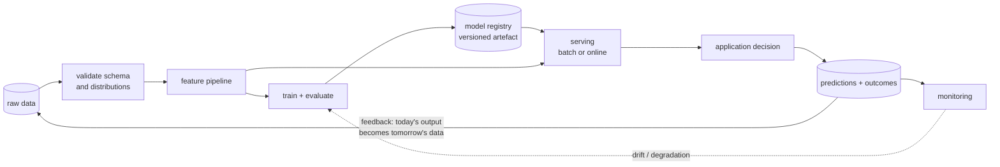

**In one line.** A model is a function; a system is everything that keeps that function fed, served, watched and replaceable.

## The idea in plain words

Draw the boundary around the whole loop and the components are always the same:

**Data** in (collection, validation, labelling) → **training** (features, fit, evaluate) → **a versioned artefact** → **serving** (batch or online) → **monitoring** → **feedback** that becomes tomorrow's training data.

Two properties decide how hard the system is to operate.

- **Where the feedback comes from.** If ground truth arrives automatically (did the user click, did the payment charge back), you can retrain continuously. If it needs human labelling, everything slows down and labelling becomes the bottleneck.
- **How tightly the loop couples.** A recommender whose output changes what users see, and therefore what data you collect, is a **feedback loop**: the model shapes its own training set. That is where systems go quietly wrong.

The interfaces matter more than the components. A clean contract — a schema for features, a versioned model artefact, a documented prediction response — lets the data team and the platform team move independently. Without one, every change is a cross-team negotiation.



## How it works

### ML in production: the squeeze

A researcher, Sidney, builds strong **speech-recognition** models and spots a market: manual transcription costs about **$1.50/min** and is slow. So she launches a transcription start-up — and meets the engineering wall.

:::note

**Analogy first.** A home cook who makes incredible bread is not yet a bakery. The bakery needs a shopfront, a till, supply chains, and consistency at 6 a.m. every day. The bread (the model) was the easy part.

:::

#### The speed–cost–quality triangle

The hardest constraint is that you can't maximise **speed**, **cost**, and **quality** at once. Push one and another gives. Pricing the product means choosing *where on the triangle* to sit.

#### Slide the trade-off, watch the third give

Drag the dial between **cheap-and-fast** and **slow-and-accurate**. The triangle shows how the three pull against each other, and the readout prices one 60-minute lecture. There is no setting that wins all three.

:::tip

**Worked example. One 60-minute lecture.** **Manual:** $1.50 × 60 = **$90**, takes hours. High quality, high cost, slow. **Cheap model ($0.10/min):** $0.10 × 60 = **$6** in minutes. But weak on technical terms. **+ LLM cleanup ($0.40/min):** ($0.10+$0.40) × 60 = **$30**. Better quality, 5× the compute cost. Pick two of \{fast, cheap, accurate\}.

:::

#### Where this shows up in ML

Every challenge here maps to a later module: fragile pipelines (orchestration), runaway GPU bills (scaling), outages (deployment + testing), bias (responsible ML). The story is the syllabus in disguise.

### ML model vs ML system

An **ML model** maps inputs to predictions. An **ML system** is the whole product around it: data pipelines, serving, UI, monitoring, and the glue code. The course turns on this distinction.

:::note

**Two views.** The **model-centric view** improves the algorithm, features, and hyper-parameters for better accuracy. The **system-centric view** improves the whole end-to-end thing for reliable real-world performance. Researchers lean model-centric; engineers must lean system-centric.

:::

#### Where does a 2% model gain disappear?

Tune the **model accuracy** up. Then add real **system losses** — dropped requests, stale UI. Watch the *user-visible* quality: it's dominated by the weakest link, not by your model tuning. The system-centric fix is usually bigger.

:::tip

**Worked example.** Model accuracy 94% → 96% drops errors from 6% to 4%. But if the serving pipeline drops **5%** of requests and the UI is stale half the time, the user-visible quality barely moves. Fixing the **timeouts** first would have been the bigger win.

:::

#### Where this shows up in ML

This is why "SE for ML" exists. The model is one component; the system is the deliverable.

### Only a fraction is ML code

Sculley et al. (2015) made a picture famous: in a real ML system the box labelled "ML code" is **tiny**, surrounded by huge boxes. Data collection, verification, feature extraction, configuration, serving, monitoring.

:::note

**Analogy first.** The model is the visible tip of an iceberg. Below the waterline sits the vast, unglamorous machinery that feeds it, serves it, watches it, and configures it. That machinery is where most of the effort — and most of the risk — actually lives.

:::

#### Size the system, find the ML sliver

Each block is a slice of the codebase. Click any block to read its share. The dark **ML code** block is just 5% — the supporting blocks add up to 95%. Budget your team as if ML is the whole job and you under-resource almost everything.

:::tip

**Worked example.** Shares: ML code 5%, data plumbing 30%, serving 25%, monitoring 15%, config 15%, UI 10%. Non-ML = 30+25+15+15+10 = **95%** — nineteen times the ML code. Mis-budgeting this 95% is a leading cause of failed ML projects.

:::

#### Where this shows up in ML

Every later module (coding practice, testing, deployment, monitoring) is about engineering the 95% well so the 5% can shine.

### ML as a component — and handling mistakes

ML can be the **core functionality** (speech recognition in a transcription app) or an **auxiliary** add-on (audit-risk prediction bolted onto tax software). Same tech, very different role and risk. And because ML is probabilistic, it *will* sometimes be wrong — so the system must plan for it.

:::note

**Analogy first.** An electric motor is the core of an electric car but only an auxiliary in a car window. When it's the core, a failure stops everything; when auxiliary, it's a minor annoyance. Knowing which you're building changes how careful you must be.

:::

#### Design for the model being wrong

A core design question: what does the surrounding system do when the model errs? Show a confidence score, ask a human, fall back to a safe default, or log for retraining. This "handle the mistake" logic is **non-ML code** wrapped around the ML component.

#### Tune a confidence gate

The ASR model attaches a confidence to each caption. Slide the **gate**: high-confidence captions auto-publish (fast, cheap); low-confidence ones route to a human (safe). Watch the split between automation and human cost — and the quality protected on the risky tail.

:::tip

**Worked example.** With a 0.90 gate, ~90% of sentences are high-confidence and auto-publish; the risky 10% go to a human reviewer. The system stays fast and cheap on the easy majority while protecting quality on the hard tail. A graceful handling of being wrong.

:::

#### Where this shows up in ML

**Human-in-the-loop** review, confidence thresholds, and safe fallbacks are standard SE4ML patterns for wrapping a probabilistic component in a dependable system. Real systems often have *many* ML components, demanding **systems thinking**.

### Predictive · Generative · Agentic

Three paradigms build on one another. **Predictive AI** forecasts from past data. **Generative AI** creates new content from instructions. **Agentic AI** acts autonomously toward a goal, using reasoning, tools, and feedback loops.

:::note

**Analogy first.** A weather forecaster (predictive) says "70% chance of rain". A novelist (generative) writes you a rainy-day story. A personal assistant (agentic) sees the forecast, books a cab, moves your meeting. Texts the client. Pursuing "get there dry" on its own.

:::

$$ \text{Generative AI} + \text{Reasoning} + \text{Tools} + \text{Feedback Loops} \;\longrightarrow\; \text{Agentic AI} $$

#### Give all three the same goal

Pick a paradigm and press **run** on the request "get me to the Tuesday meeting". Predictive returns one number. Generative writes a plan you must execute. Agentic *loops*. Plan, act, observe, re-plan. With no further prompting. Watch the step count grow with autonomy.

:::tip

**Worked example. "plan my trip".** **Predictive:** "traffic delay ≈ 25 min". 1 step, no action. **Generative:** writes an itinerary. 1 step, you still execute it. **Agentic:** plan → book cab → cab delayed → re-book. ~4–5 steps, no prompting. The jump is from "tell me" to "give me a goal".

:::

#### Where this shows up in ML

The course's final module applies SE principles to agentic AI, because acting autonomously multiplies the need for testing, monitoring, and responsible design.

### Cloud Native ML systems

ML is now a dominant cloud workload. **Cloud Native** technology gives it a scalable, reliable platform — the same stack from Session 1, now serving models.

:::note

**The CNCF definition.** Cloud Native technologies "empower organizations to build and run scalable applications in modern, dynamic environments such as public, private. Hybrid clouds". Exemplified by **containers, service meshes, microservices, immutable infrastructure. Declarative APIs**.

:::

- **How it fixes Sidney's pain** — Wrap the model as a containerised microservice behind a declarative API. Now it scales up under load (no more "slow at peak"), rolls back cleanly on a bad update (no more outages). Deploys identically everywhere (no more "works on my machine"). Cloud Native turns the fragile prototype pipeline into a dependable one.

### Apollo: 28 models, one car

Apollo, Baidu's self-driving platform, is the thesis made concrete: not one "self-driving model" but about **28 interacting ML models**. Perception, detection, prediction. Plus traditional code, fused from four sensor sources.

:::note

**Analogy first.** Driving isn't a single prediction. It's perception (what's around me?), detection (where exactly?). Trajectory prediction (where will it go?). Each its own model. One model's output feeds the next.

:::

#### Fuse the sensors, chain the models

Toggle the four sensors — **camera, LiDAR, radar, map**. Fusion accuracy climbs as you add complementary sources. Then watch the model chain: perception → detection → prediction. Turn a sensor off and see an early error *propagate* downstream — why you can't test these models in isolation.

:::tip

**Worked example — reading the numbers.** ~**28** ML models across perception/detection/prediction. Outputs chain (an early error propagates). Four sources fused (camera, LiDAR, radar, map). So the hard problems are **integration, testing, and system-level QA** — not any single model's accuracy.

:::

#### Where this shows up in ML

Around the models, traditional code does pre/post-processing, validation, and decision logic, and the system picks models dynamically by scenario. The SE4ML challenges — complexity, low test coverage, maintenance, system-level QA — are exactly this course.

### Microsoft's nine-stage workflow

A study of real Microsoft teams proposes a **nine-stage ML workflow** and stresses that ML development is highly *iterative*, with feedback loops. Not a straight line. **Data is the central component.**

:::note

**The nine stages.** Model Requirements → Data Collection → Data Cleaning → Data Labeling → Feature Engineering → Model Training → Model Evaluation → Deployment → Monitoring. The arrows go *both* ways: any stage can send you back upstream.

:::

#### Walk the workflow; inject a late error

Press **step** to advance the nine stages. Then hit **inject labeling bug**: monitoring (stage 9) discovers the labels (stage 4) were wrong. The loop snaps back. Re-running 5 downstream stages. The cost of a late data fix, made visible. Catch it early and you re-run nothing.

:::tip

**Worked example. Cost of a late fix.** A labeling error (stage 4) found at monitoring (stage 9) forces a loop back: 9 − 4 = **5 stages** re-executed. Catching it early — a "shift-left" for data — would re-run zero downstream stages. That's why data quality sits at the centre.

:::

#### Where this shows up in ML

The study also shows ML needs new roles (data scientists, ML engineers), integration with Agile/DevOps, versioning of *models and data*, continuous evaluation. A **process maturity model** (like CMM). This looped workflow is the backbone the rest of the course fills in.

### Key takeaways

One thesis ran through everything: a model is a sliver of a system.

- **1 · The gap** — Prototype → product needs far more engineering than ML, under a speed–cost–quality squeeze. The ML code is ~5% of the whole.
- **2 · Systems thinking** — See ML as a component (core or auxiliary), design for it being wrong. Reason about the whole system. Often many entangled models.
- **3 · Paradigms & cases** — Predictive → generative → agentic, on a Cloud Native platform. Apollo (28 models) and Microsoft (9-stage loop) make it real.

:::note

**The thread.** ML systems ≠ standalone models. The biggest wins, the hidden debt, and the real challenges all live in the engineering *around* the model. Next session: deciding when ML is even the right tool, and turning goals into requirements.

:::

## A real system that works this way

**Training/serving skew** is the defining failure of this diagram. The training job computes "average order value over the last 30 days" with a SQL window over the warehouse; the service computes it from a cache that quietly excludes refunds. Offline AUC is excellent, online performance is mediocre, and nothing is broken enough to page anyone. A **feature store** exists precisely to make both paths use one definition.

**Feedback loops** bite recommenders hardest: the model promotes what it already believes is popular, users can only click what was shown, and the next training set confirms the belief. Logging propensities and reserving exploration traffic is how teams break the cycle.

## Code you can run

Skew is easy to demonstrate and hard to notice: the same feature, computed two ways.

```python
from datetime import date, timedelta
from statistics import mean

ORDERS = [
    {"user": "u1", "day": date(2026, 9, 1),  "amount": 100.0, "refunded": False},
    {"user": "u1", "day": date(2026, 9, 5),  "amount": 300.0, "refunded": True},
    {"user": "u1", "day": date(2026, 9, 12), "amount": 80.0,  "refunded": False},
    {"user": "u1", "day": date(2026, 9, 20), "amount": 120.0, "refunded": False},
]
TODAY = date(2026, 9, 21)

def training_feature(user, orders, today, window=30):
    """Offline: the warehouse view — every order, refunds excluded."""
    rows = [o for o in orders
            if o["user"] == user and not o["refunded"]
            and today - o["day"] <= timedelta(days=window)]
    return round(mean(o["amount"] for o in rows), 2) if rows else 0.0

def serving_feature(user, orders, today, window=30):
    """Online: a cache that was never told about refunds."""
    rows = [o for o in orders
            if o["user"] == user and today - o["day"] <= timedelta(days=window)]
    return round(mean(o["amount"] for o in rows), 2) if rows else 0.0

train_value = training_feature("u1", ORDERS, TODAY)
serve_value = serving_feature("u1", ORDERS, TODAY)
print(f"avg_order_value  training: {train_value:7.2f}")
print(f"avg_order_value  serving : {serve_value:7.2f}")
print(f"skew: {abs(serve_value - train_value) / train_value:.0%} — same name, different number\n")

# The fix: one definition, used by both paths.
def avg_order_value(user, orders, today, window=30):
    rows = [o for o in orders
            if o["user"] == user and not o["refunded"]
            and today - o["day"] <= timedelta(days=window)]
    return round(mean(o["amount"] for o in rows), 2) if rows else 0.0

print("shared definition  training:", avg_order_value("u1", ORDERS, TODAY))
print("shared definition  serving :", avg_order_value("u1", ORDERS, TODAY))

# And the test that keeps it that way.
def test_no_training_serving_skew():
    for user in {o["user"] for o in ORDERS}:
        assert avg_order_value(user, ORDERS, TODAY) == avg_order_value(user, ORDERS, TODAY)
    return "skew test passes"

print("\n" + test_no_training_serving_skew())
```

## Designing with it

**Interfaces to pin down early**

| Interface | Contract |
| --- | --- |
| Raw data → pipeline | Schema with types, nullability and ranges; a validation step that fails loudly |
| Feature definition | One implementation used by training and serving (a feature store, or a shared library) |
| Model artefact | Versioned, with the training data version, code commit and metrics attached |
| Prediction response | Model version, score, and enough context to join with the outcome later |
| Outcome logging | Prediction id, features used, decision taken, eventual ground truth |

**Batch or online?**

| | Batch | Online |
| --- | --- | --- |
| Latency | Minutes to hours | Milliseconds |
| Features | Anything in the warehouse | Only what is available at request time |
| Failure mode | A late table delays everything | A slow feature lookup times out the request |
| Start here when | Predictions can be precomputed per entity | The input only exists at request time |

Precompute when you can — a nightly batch that writes scores to a key-value store is dramatically simpler to operate than a real-time feature pipeline, and is the right answer far more often than teams assume.

## Where this stands in 2026

:::info Industry view

- **Feature stores** (Feast, Tecton, or an internal one) exist for exactly one reason: to make the training and serving definitions the same object.
- Model registries with lineage — data version, code commit, metrics — are standard; "which model is in production and what trained it" must be answerable in seconds.
- Logging predictions **with the features used** is what makes later debugging and offline evaluation possible; teams that skip it cannot diagnose regressions.
- Precomputed batch scoring remains the most common production pattern, despite the attention real-time serving gets.

:::

## Practice questions

<details>
<summary><strong>Q1.</strong> “The ML model is only a small fraction of a real-world ML system.” Explain, referencing the hidden-technical-debt view.</summary>

In a deployed system the model code is a tiny box surrounded by far larger components: data collection and verification, feature extraction, configuration, serving infrastructure, monitoring, process management, and analysis tools. Most engineering effort and risk (“hidden technical debt”) lives in this surrounding plumbing, not in the learning algorithm.<br /><em>Core (Sculley et al.) · conceptual</em>

</details>

<details>
<summary><strong>Q2.</strong> List components a production ML system needs beyond the trained model.</summary>

**Data pipeline** — ingestion, validation, feature store.**Training pipeline** — reproducible, scheduled retraining.**Serving** — low-latency inference (batch/online), versioning, rollback.**Monitoring** — data/prediction drift, performance, alerts.**Orchestration + CI/CD**, configuration, and governance/logging.<br /><em>Core · conceptual</em>

</details>

<details>
<summary><strong>Q3.</strong> Contrast model-centric and system-centric (pipeline) thinking. Why does the system view matter for ML products?</summary>

**Model-centric:** maximise offline accuracy on a fixed dataset. **System-centric:** optimise the end-to-end product — data quality, latency, reliability, monitoring, user impact and maintenance. A highly accurate model that is unservable, unmonitored, or fed bad data fails as a product; real value comes from the whole pipeline working over time.<br /><em>Core · conceptual</em>

</details>

<details>
<summary><strong>Q4.</strong> What recurring lessons do industrial ML case studies (e.g. Microsoft's ML workflow, Apollo) report?</summary>

ML adds stages traditional SE lacks — **data management**, **model training/evaluation**, and **monitoring** — and these stages are highly **iterative** and **entangled**. Reported challenges: data discovery/versioning, end-to-end pipeline tooling, reuse, model debugging, and the need for cross-disciplinary teams. Data and pipelines, not the algorithm, dominate the effort.<br /><em>Core · conceptual</em>

</details>

## Further reading

- [Feature Stores for ML (Feast docs)](https://docs.feast.dev/) — the shared-definition problem and one solution.
- [MLflow Model Registry](https://mlflow.org/docs/latest/model-registry.html) — versioned artefacts with lineage.
- [Designing Machine Learning Systems (Chip Huyen)](https://www.oreilly.com/library/view/designing-machine-learning/9781098107956/) — the standard book on this pipeline.
- [Source lecture: seml-s2-models-to-systems](https://learning.bansal-ai.in/seml-s2-models-to-systems/lecture.html) — the original interactive lecture these notes were built from.

- **[Machine Learning in Production — From Models to Systems](https://mlip-cmu.github.io/book/)** `book`
  Kaestner, CMU (MIT Press, open access) — Why the model is a small part of the system, and what surrounds it in production.
- **[MLiP lecture recordings (full course)](https://www.youtube.com/playlist?list=PLDS2JMJnJzdmubSKnanmIwzr08cionWm_)** `▶ video`
  CMU MLiP lecture recordings — Video walkthrough of the same material.
