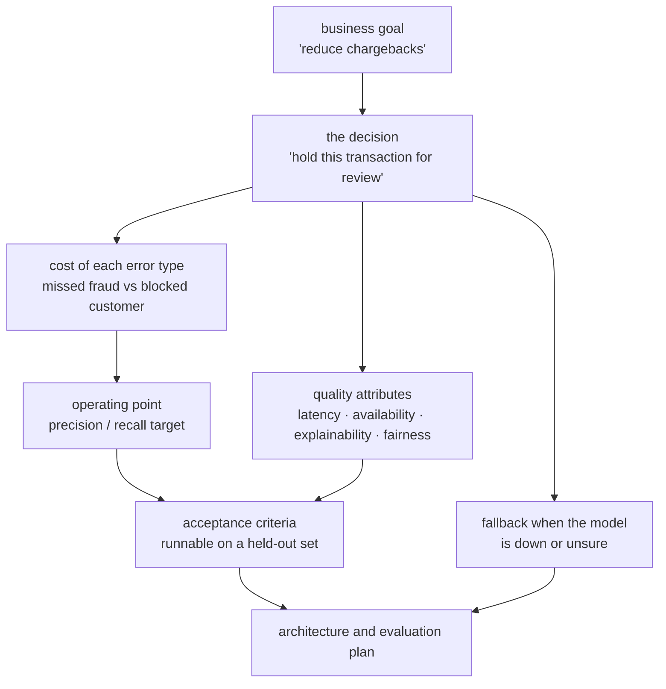

**In one line.** You cannot specify a model output, so you specify the decision it drives, the accuracy you need, and what happens when it is wrong.

## The idea in plain words

Ordinary requirements say what the software must do. ML requirements cannot, because the behaviour is learned. What you *can* specify is everything around it:

- **The decision.** Not "predict churn" but "flag accounts for a retention offer". The decision fixes the latency budget, the volume and the cost of an error.
- **The threshold.** Precision and recall trade against each other; the business must choose. "We will accept 20 false positives to catch one real fraud" is a requirement, and only the business can sign it.
- **The consequence of being wrong**, in each direction. A missed fraud costs money; a false accusation costs a customer. They are rarely symmetric.
- **The quality attributes**: latency, throughput, availability, explainability, fairness, privacy. These drive architecture more than accuracy does.
- **The fallback.** What the system does when the model is unavailable, uncertain, or out of distribution. If there is no answer, you do not have a requirement — you have a hope.

The technique that works is to write **acceptance criteria you could actually run**: on this held-out set, recall ≥ 0.85 at precision ≥ 0.6; p95 latency under 200 ms; no demographic group more than 5 points below the average.



## How it works

### When to use machine learning

ML is not always the answer. Geoff Hulten gives three signatures of problems where ML earns its place: **intrinsically hard**, **big**, or **time-changing**. If none apply, plain rules are cheaper and safer.

:::note

**Analogy first.** Use ML when you *cannot* write the rules by hand. When the problem is too subtle to specify, too large to manage, or changes too fast for fixed rules to keep up. Otherwise, write the rules: simpler, faster, easier to test.

:::

#### The ML-vs-rules decision helper

Toggle the three traits of your problem. The verdict updates live: any one trait tips you toward ML; none means plain rules win. For "big" problems, watch the hand-coded rule count explode.

:::tip

**Worked example — the song-recommendation blow-up.** 10 million users × 50 million tracks. A "does user u like track t?" rule for every pair = 10^7 × 5×10^7 = **5×10^14** rules. 500 trillion. Impossible. Instead, learn one model that *generalises*. The numbers force ML.

:::

#### Where this shows up in ML

This is the first gate of any ML project. Spam filtering is all three at once. Subtle wording (hard), huge volume (big), weekly mutation (time-changing). Which is exactly why it's done with ML.

### Requirements for a probabilistic system

Traditional systems are **deterministic**: same input, same output, so requirements can be exact. ML systems are **probabilistic**: output depends on data and learned patterns, so requirements must account for uncertainty.

:::note

**Analogy first.** Specifying a calculator is easy: 2+2 must equal 4, always. Specifying a weather app is different. You can't demand "always correct", only "at least 85% of rain forecasts are right, measured monthly". ML requirements look like the weather app.

:::

#### Three things ML requirements must consider

- **Data quality and availability** — where the data comes from and how good it is.
- **Model behaviour under uncertainty** — what happens when the model is unsure.
- **Continuous learning and updates** — how it keeps learning as the world changes.

#### Deterministic vs probabilistic spec

The calculator demands a single exact answer — feed it any input, the spec is "==". The weather model can only promise a *rate*. Drag the required accuracy bar and watch a deterministic "100% or bug" flip to a statistical "good enough?" target.

#### Where this shows up in ML

Every metric you later monitor — accuracy, precision, recall, latency — starts life here as a measurable requirement. Requirements are where monitoring is born.

### Goals across four levels

A **goal** is a desired system outcome, aligned across **model, product, user, and organisational** levels, expressed in measurable terms. Focusing only on model accuracy is not enough.

:::note

**Analogy first.** A football team's goal is not "the striker scores" — that's one player's goal. The real goal is to win the league, which needs defence, fitness, and tactics aligned. Optimising only the striker (the model) loses the season (the system).

:::

#### Turn "make it useful" into real goals

A vague aim isn't a goal until it's measurable at every level. Click each level to expand the fuzzy chatbot goal into a concrete, measurable target — and see what it's measured by.

:::tip

**Worked example. "make the chatbot useful".** **Organisational:** cut support cost. Target 20% drop. **Product/User:** users solve problems quickly. Task success ≥ 80%. **User:** satisfaction ≥ 4/5, high completion rate. **Model:** intent-classification accuracy ≥ 90%. "Useful" became four measurable targets.

:::

#### Where this shows up in ML

The four levels become the dashboard you watch in production: business KPIs at the top, model metrics at the bottom, all traceable to one another.

### When goals support — and conflict

Goals are interconnected and hierarchical. They can **support** each other (better accuracy → better UX) or **conflict** (accuracy vs latency, quality vs cost). Engineering means naming the trade-off and choosing.

:::note

**Analogy first.** Buying a car: safety, price, fuel economy. A bigger, safer car costs more and uses more fuel — the goals conflict, so you prioritise. ML goals behave the same way; you can't max all of them.

:::

#### The accuracy–latency trade-off

Slide toward a bigger model: accuracy rises but latency climbs too. Watch the two goals pull apart, and see which product wins at each setting. Snappy live-captioning favours speed; offline analysis favours accuracy. A deliberate choice, not an accident.

:::tip

**Worked example.** Small model: 92% accuracy, 40 ms. Big model: 96% accuracy, 300 ms — that's 300/40 = **7.5× slower** for +4% accuracy. For live captioning, latency wins; the small model is the right deliberate trade-off.

:::

#### Where this shows up in ML

These trade-offs reappear as **quality attributes** in architecture (Module 3): accuracy vs latency vs cost vs interpretability. Naming them as conflicting goals now makes those decisions explicit later.

### From goals to requirements

Trace the chain: understand the **goal**, find the **decisions** people make to pursue it, the **predictions** those decisions need. Which predictions **ML** can supply.

:::note

**Analogy first.** A shop's goal is more profit. A routine decision is "how much stock to order". That decision needs a prediction: "how much will sell next week?" That prediction is a job for ML. The chain turned a vague goal into a concrete model to build.

:::

$$ \text{Goal} \;\rightarrow\; \text{Decision} \;\rightarrow\; \text{Prediction} \;\rightarrow\; \text{ML requirement} $$

#### Build the goal → ML chain

Pick a business goal and press **trace**. Watch it resolve, step by step, into the decision it drives, the prediction that decision needs. The ML model you must actually build. This is how requirements are born.

#### Where this shows up in ML

This chain — goals to questions to predictions — is formalised in the **GR4ML** notation, which we meet next.

:::tip

**Worked example.** Goal "more profit" → decision "how much stock to order" → prediction "next week's demand" → ML requirement "a demand-forecasting model trained on sales history". Vague goal, concrete model.

:::

### GR4ML & its three views

**GR4ML** is a conceptual modelling framework that connects three layers. Business, analytics. Data. So the model you build actually serves the business goal. It has three views: **Business (why?)**, **Analytics Design (what?)**, **Data Preparation (how?)**.

:::note

**Analogy first.** GR4ML is like an architect's drawings before construction: one for *why* the building exists, one for *what* rooms it needs, one for *how* the plumbing runs. You wouldn't pour concrete without them; don't train a model without GR4ML's three views.

:::

#### Explore the three views (credit-risk example)

Click a view to see its modelling elements and how the bank's credit-risk example fills them in. Notice how each view feeds the next: the business "why" sets the analytics "what", which sets the data "how".

:::tip

**Worked example — the bank's GR4ML model.** **Business:** 1 strategic goal, 1 actor (case worker), 1 decision, 1 question. **Analytics:** 1 prediction goal (default risk), 2 soft goals (accuracy, interpretability). **Data:** 1 entity (applications), 2 prep tasks (clean, reduce). One traceable spec, business "why" down to data "how".

:::

#### Where this shows up in ML

The model is refreshed monthly (`UpdateFrequency`) over a `learningPeriod` of historical data. Concrete parameters the Business View captures so the data and analytics views can honour them.

### What makes a good measure

A **measure** (or **metric**) is a standard way to measure something. A good one has three properties: it **relates directly to a goal**, it is **quantifiable and objective**. It is **practical to collect**.

:::note

**Analogy first.** To measure "am I getting fitter?", resting heart rate is good: it relates to fitness, it's an objective number. A cheap watch collects it. "General vibe" fails all three. Vague, subjective, uncollectable.

:::

#### Score a measure against the three tests

For the goal "improve chatbot usefulness", click a candidate measure. The three checks light up — direct? objective? collectable? Good measures pass all three; vanity metrics fail the first.

#### Where this shows up in ML

Good measures for "chatbot usefulness" include task success rate, satisfaction score. Conversation completion rate. Each tied to the goal, quantifiable, and collectable.

### Accuracy vs precision

**Accuracy** is closeness to the true value. **Precision** is consistency — the same result each time, whether right or wrong. A measurement can be precise but inaccurate, or accurate but imprecise.

:::note

**Analogy first.** Throwing darts. *Accurate* means your darts cluster around the bullseye. *Precise* means they land tightly together — even if that tight cluster is in the wrong corner. You want both: a tight cluster on the bullseye.

:::

$$ \text{accuracy} \leftrightarrow \text{low bias (centred on truth)} \qquad \text{precision} \leftrightarrow \text{low variance (low scatter)} $$

#### The dartboard: dial bias and spread

Slide **bias** (how far off-centre, = inaccuracy) and **spread** (how scattered, = imprecision). The shots redraw live and the panel classifies you into one of the four cases. Aim for low bias *and* low spread — a tight cluster on the bullseye.

Distance of each shot from the centre. A bias shifts the whole pile right; spread widens it.

:::tip

**Worked example — a precise but inaccurate scale.** True weight 70.0 kg. Five readings: 72.1, 72.0, 72.2, 71.9, 72.0. Spread ≤ 0.3 kg → **highly precise**. Average = 360.2/5 = **72.04** kg. Error = 72.04 − 70.0 = **2.04 kg** → **inaccurate** (biased high). Calibration fixes the bias without touching precision.

:::

#### Where this shows up in ML

This is the **bias–variance** distinction: accuracy ≈ low bias (centred on truth), precision ≈ low variance (low scatter). The dartboard is the picture every ML engineer carries for it.

### Key takeaways

The questions that come before building — answered.

- **1 · When & what** — Use ML for hard, big, or time-changing problems. Its requirements are probabilistic — measurable, data-aware, model-aware.
- **2 · Goals & GR4ML** — Goals span four levels and trade off. Trace goal → decision → prediction → ML. GR4ML structures it in three views: why, what, how.
- **3 · Measure right** — Good measures relate to a goal, are objective, and are collectable. Keep accuracy (closeness) distinct from precision (consistency).

:::note

**The thread.** Get the requirements wrong and the most elegant model solves the wrong problem. Decide if ML fits, align goals across levels, trace them to model requirements with GR4ML, and measure them with metrics that are direct, objective, and collectable. Next module: architecture and design.

:::

## A real system that works this way

**"Improve recommendations"** is not a requirement. The version you can build against: *"On the home page, show 12 items; increase click-through by 3% without lowering add-to-basket; respond in under 150 ms at p95; never show out-of-stock or age-restricted items; fall back to editorial picks if the model times out."* Every clause there changes the design.

**The fairness clause matters early.** Retro-fitting a demographic constraint after launch usually means retraining and re-validating from scratch, because the data collection itself may be the problem.

## Code you can run

Acceptance criteria are only real if you can execute them. This is what that looks like.

```python
from dataclasses import dataclass
from statistics import mean

@dataclass(frozen=True)
class Criterion:
    name: str
    target: float
    direction: str           # "min" (at least) or "max" (at most)

    def check(self, value: float) -> bool:
        return value >= self.target if self.direction == "min" else value <= self.target

# What the business signed off — each line is testable
CRITERIA = [
    Criterion("recall_at_precision_0.6", 0.85, "min"),
    Criterion("p95_latency_ms",          200.0, "max"),
    Criterion("max_group_gap_pct",         5.0, "max"),
    Criterion("fallback_coverage",         1.0, "min"),
]

# A candidate model's measured results
MEASURED = {
    "recall_at_precision_0.6": 0.88,
    "p95_latency_ms": 173.0,
    "max_group_gap_pct": 7.4,          # fails: one group is 7.4 points below average
    "fallback_coverage": 1.0,
}

def evaluate(criteria, measured):
    rows, passed = [], True
    for c in criteria:
        value = measured[c.name]
        ok = c.check(value)
        passed &= ok
        rows.append((c.name, value, f"{'≥' if c.direction=='min' else '≤'} {c.target}",
                     "PASS" if ok else "FAIL"))
    return rows, passed

rows, release_ok = evaluate(CRITERIA, MEASURED)
print(f"{'criterion':28} {'measured':>9} {'required':>10}  result")
for name, value, target, result in rows:
    print(f"{name:28} {value:9.2f} {target:>10}  {result}")
print(f"\nrelease decision: {'SHIP' if release_ok else 'BLOCKED'}")

# --- the cost model that justifies the threshold ---------------------------
def expected_cost(fp, fn, cost_fp=25.0, cost_fn=420.0):
    """Blocked-customer cost vs missed-fraud cost — asymmetric, as usual."""
    return fp * cost_fp + fn * cost_fn

for threshold, fp, fn in [(0.30, 900, 40), (0.50, 400, 95), (0.70, 120, 210)]:
    print(f"threshold {threshold:.2f}: {fp:4} false positives, {fn:3} missed "
          f"-> expected cost {expected_cost(fp, fn):>9,.0f}")
print("\nthe operating point is a business decision with a number attached,")
print("not a modelling preference.")
```

## Designing with it

**A requirements template that works for ML**

| Section | Contents |
| --- | --- |
| Decision | What action the prediction triggers, and who or what takes it |
| Users | Who is affected, including the people the model is applied *to* |
| Data | Sources, ownership, legal basis, retention, refresh frequency |
| Operating point | Precision/recall or equivalent, with the cost model behind it |
| Quality attributes | Latency, throughput, availability, explainability, fairness, privacy |
| Fallback | Behaviour when the model is down, slow, or out of distribution |
| Monitoring | What is measured, what triggers an alert, who responds |
| Acceptance | Criteria that can be executed against a held-out set |
| Risks | What could go wrong, likelihood, mitigation, who signs off |

**Elicitation questions that surface the real requirement**

- What happens today without a model? (Your baseline, and often a decent fallback.)
- Which error is worse, and by how much? (Asymmetry drives the threshold.)
- Who sees the output, and do they need to know *why*? (Explainability is an architectural constraint.)
- What data can we legally use, for how long? (Often narrower than the data available.)
- How would we know in production that it stopped working? (If nobody can answer, monitoring is not designed.)

**Write the fallback first.** A system that degrades to yesterday's rules when the model is unavailable is one you can ship on a Friday.

## Where this stands in 2026

:::info Industry view

- **Model cards and system cards** have become the standard artefact for recording intended use, limitations and evaluation — increasingly expected by regulators and enterprise buyers.
- Under the EU AI Act, high-risk systems need documented risk management, data governance and human oversight — requirements work is now compliance work.
- Teams that write executable acceptance criteria ship faster, because "is it good enough?" stops being a debate and becomes a test run.
- Fairness and privacy constraints are cheapest to satisfy when specified before data collection; retro-fitting usually means starting again.

:::

## Practice questions

<details>
<summary><strong>Q1.</strong> When is machine learning the right solution, and when should you prefer rules/traditional code?</summary>

Use ML when the rules are **unknown or too complex to hand-write**, the mapping must be learned from **data**, the pattern **changes over time**, and some **error is tolerable**. Prefer explicit rules when the logic is well understood, must be **exact/auditable**, data is scarce, or mistakes are unacceptable. ML trades exactness and explainability for the ability to learn complex, evolving patterns.<br /><em>Core · conceptual</em>

</details>

<details>
<summary><strong>Q2.</strong> Distinguish functional and non-functional requirements for an ML system, with examples.</summary>

**Functional** — what the system must do: “recommend 10 products”, “flag fraudulent transactions”. **Non-functional** — quality attributes: latency, throughput, accuracy/precision targets, fairness, privacy, explainability, robustness, and cost. For ML, statistical-quality targets (e.g. recall ≥ 0.9) are first-class non-functional requirements.<br /><em>Core · conceptual</em>

</details>

<details>
<summary><strong>Q3.</strong> Why are goals and conflicts central to requirements engineering, and give one example ML conflict.</summary>

Requirements come from stakeholder **goals**, which are then refined into concrete, measurable requirements. Goals often **conflict**, forcing trade-offs. Example: higher **recall** (catch all fraud) lowers **precision** (more false alarms) and may hurt latency or user experience — RE makes such tensions explicit and resolves them deliberately.<br /><em>Core · conceptual</em>

</details>

<details>
<summary><strong>Q4.</strong> A fraud classifier gives TP=80, FP=20, FN=10, TN=90. Compute precision, recall and accuracy. When does each matter?</summary>

Precision = TP/(TP+FP) = 80/100 = **0.80** Recall = TP/(TP+FN) = 80/90 ≈ **0.889** Accuracy = (TP+TN)/all = 170/200 = **0.85**Recall matters when misses are costly (missed fraud, disease); precision matters when false positives are costly (blocking legitimate users). Accuracy misleads on imbalanced data.<br /><em>Core · numeric</em>

</details>

<details>
<summary><strong>Q5.</strong> What makes an ML requirement “measurable”, and why does that matter?</summary>

A measurable requirement specifies a **metric**, a **target**, a **dataset/condition**, and often a **time/operating constraint** — e.g. “recall ≥ 0.92 on the held-out fraud set at &lt; 100 ms p99”. Without measurability you cannot test, accept, monitor, or detect regression of the system.<br /><em>Core · conceptual</em>

</details>

## Further reading

- [Model Cards for Model Reporting (Mitchell et al.)](https://arxiv.org/abs/1810.03993) — the documentation standard for intended use and limitations.
- [Machine Learning in Production — requirements chapters](https://mlip-cmu.github.io/book/) — goals, risks and quality attributes for ML systems.
- [EU AI Act overview](https://artificialintelligenceact.eu/) — what "high-risk" obliges you to document.
- [Source lecture: seml-s3-requirements](https://learning.bansal-ai.in/seml-s3-requirements/lecture.html) — the original interactive lecture these notes were built from.

- **[Machine Learning in Production — Requirements & Risk](https://mlip-cmu.github.io/book/)** `book`
  Kaestner, CMU (MIT Press, open access) — Requirements engineering for ML, and framing the system around what can go wrong.
- **[Annotated bibliography — SE for AI](https://github.com/ckaestne/seaibib)** `docs`
  Kaestner (CMU) — An opinionated, curated bibliography of the academic literature, organised by topic — the fastest route to primary sources.
