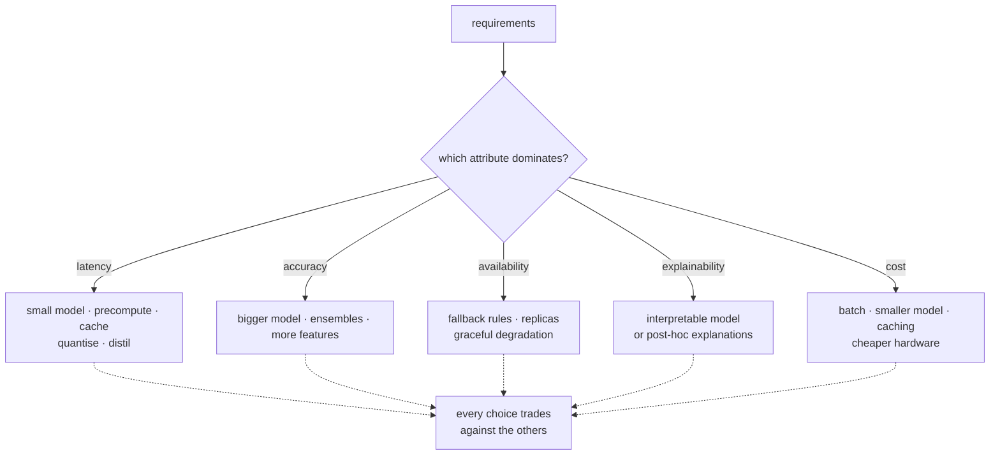

**In one line.** Architecture is the set of decisions that are expensive to reverse, and quality attributes are what forces them.

## The idea in plain words

Functional requirements say what the system does; **quality attributes** say how well, and they are what actually decide the design. For ML systems the load-bearing ones are:

- **Latency** — is a prediction needed in 50 ms, or by tomorrow morning? This single answer determines batch versus online, which features are even possible, and how big a model you can afford.
- **Throughput and cost** — requests per second, and cost per thousand predictions. GPU inference at scale is a budget decision before it is a technical one.
- **Availability** — what happens when the model service is down? A fallback that is always available often beats a better model that sometimes is not.
- **Accuracy** — but *at an operating point*, traded against everything above.
- **Explainability** — regulated decisions must be justifiable. This can rule out model families entirely.
- **Maintainability and evolvability** — how easily can you retrain, roll back, or replace the model?
- **Privacy and fairness** — constraints on data flow and on outcomes, not features you add later.

They conflict by nature. A bigger model raises accuracy and hurts latency and cost. Caching helps latency and hurts freshness. The job is not to maximise one; it is to **make the trade explicit** and write down why.



## How it works

### A tale of two launches

**Flipkart Big Billion Day (2014):** 3 lakh orders in 6 hours. Then the site crashed, carts emptied, money was debited without orders. **Hotstar (2019):** 25 million concurrent viewers for a World Cup semi-final, no meltdown.

#### What did each get right or wrong?

Click the two cases to compare. The lesson the slides draw: Hotstar *identified the key quality attributes* (scalability, performance) and *got the architecture right* (microservices on Kubernetes). Flipkart didn't.

:::tip

**The takeaway.** Both systems had the *features*. What separated them was the non-functional qualities — and architecture is how you deliver those qualities.

:::

### What is a quality attribute?

A **quality attribute** (a.k.a. **non-functional requirement**) is a measurable, testable property describing *how well* a system meets a need along one dimension. It always **qualifies** a function — it never stands alone.

#### A function, qualified five ways

Start from one functional requirement — "press the green button → the Options dialog appears" — and add a quality annotation. Each QA pins down a different dimension of "how well".

:::tip

**Definition (Bass et al.).** "A measurable or testable property that specifies how well a system meets the needs of its stakeholders along a specific dimension of interest." Quality attributes are a qualification on the functional requirements.

:::

### Make them SMART

"The system should be fast" can't be tested. A good quality attribute is **SMART**: **S**pecific, **M**easurable, **A**ttainable, **R**elevant, **T**ime-sensitive.

#### The SMART quality-attribute builder

Pick a dimension for a food-delivery app and reveal a SMART statement. Notice each names a *metric* and a *target* — that's what makes it a requirement and not a wish.

### Quality attributes unique to ML

ML inherits the classic QAs and adds its own. What to specify depends on the **problem type**, the **approach** (deep learning / classical / RAG), the **training method**. The **data quality**.

#### The ML quality wheel

Click each attribute for what it means and an example. The crucial insight: a deployed ML system usually fails on something *other* than accuracy. It can't scale, can't be explained, or silently decays under drift.

:::tip

**Beyond accuracy.** Robustness (noisy/adversarial inputs), explainability, fairness, security & privacy, data-drift adaptability, model-drift monitoring, and reproducibility are all first-class ML quality attributes.

:::

### What software architecture is

IEEE: the **structure(s)** of a system — its software **elements**, their externally visible **properties**, and the **relationships** among them. A *system* architecture is broader: hardware + software + AI/ML + infrastructure + communication.

#### Anatomy of a RAG chatbot system

Toggle the layers of a RAG enterprise-chatbot architecture. Notice the ML model is just one component among infrastructure, software, data and deployment layers. The architect's job is the whole structure.

:::tip

**An architectural pattern** is a reusable solution to a recurring problem in a context. A triple \{context, problem, solution\} with defined roles. MVC (separation of concerns) is the classic example; the patterns here apply to ML systems too.

:::

### The Pipe-and-Filter pattern

Organise a system as a sequence of independent **filters** connected by **pipes**. Each filter does one transformation — clean, extract features, infer, format — and passes its output downstream.

#### Run an ML pipeline

Push a record through the pipeline stage by stage, and try removing or reordering a filter to see modularity in action. Filters can be added, replaced, or rearranged without rewriting the rest.

:::tip

**Why it's loved for ML.** Modularity and reusability: each stage is independent. So You can swap a cleaner, add a feature step, or replace the model without touching the others. RAG's ingestion pipeline is exactly this shape.

:::

### Key takeaways

Build for "how well", not just "what".

- **1 · Quality attributes** — Testable "how well" qualifications on functions. Make them SMART. Flipkart vs Hotstar: qualities + architecture decide survival.
- **2 · ML-specific QAs** — Beyond accuracy: robustness, explainability, fairness, security, drift adaptability, reproducibility.
- **3 · Architecture** — Structure + elements + relationships, driven by quality needs. Patterns are reusable solutions — starting with pipe-and-filter.

:::note

**The thread.** A system's features rarely decide its fate under real load — its quality attributes do, and they must be SMART to be useful. ML adds robustness, fairness, drift and reproducibility to the classic list. Architecture is the structure chosen to meet those qualities, expressed through reusable patterns. Pipe-and-filter is the first; next come CQRS, RAG, monolith and microservices.

:::

## A real system that works this way

**A credit decision** has explainability as the dominant attribute: the applicant has a legal right to a reason. That alone pushes many teams to gradient-boosted trees with monotonic constraints plus SHAP, rather than a deep network that scores two points higher.

**A search ranker** has latency as the dominant attribute. The answer is the two-stage architecture: a cheap retriever over everything, then an expensive re-ranker over the top 50 — precisely so the expensive model never sees the whole corpus.

## Code you can run

Trade-offs become arguable when they carry numbers. This scores candidate designs against weighted attributes.

```python
from dataclasses import dataclass

@dataclass(frozen=True)
class Candidate:
    name: str
    p95_latency_ms: float
    accuracy: float
    cost_per_1k: float        # dollars
    explainable: bool
    availability: float       # fraction of requests served successfully

CANDIDATES = [
    Candidate("rules baseline",        5,   0.71, 0.01, True,  0.9999),
    Candidate("gradient boosting",     28,  0.86, 0.06, True,  0.999),
    Candidate("small neural net",      45,  0.88, 0.18, False, 0.999),
    Candidate("large model (GPU)",     310, 0.91, 2.40, False, 0.995),
    Candidate("large + cache + rules", 60,  0.90, 0.55, False, 0.9995),
]

# Hard constraints come first — they eliminate, they do not trade.
CONSTRAINTS = {"p95_latency_ms": 200, "explainable_required": False,
               "min_availability": 0.999}

def feasible(c: Candidate) -> tuple[bool, str]:
    if c.p95_latency_ms > CONSTRAINTS["p95_latency_ms"]:
        return False, f"latency {c.p95_latency_ms}ms over budget"
    if CONSTRAINTS["explainable_required"] and not c.explainable:
        return False, "not explainable"
    if c.availability < CONSTRAINTS["min_availability"]:
        return False, f"availability {c.availability} below floor"
    return True, ""

# Weights are the business's opinion, written down and reviewable.
WEIGHTS = {"accuracy": 0.5, "latency": 0.2, "cost": 0.3}

def score(c: Candidate) -> float:
    acc = (c.accuracy - 0.70) / (0.91 - 0.70)                  # normalise
    lat = 1 - (c.p95_latency_ms - 5) / (310 - 5)
    cost = 1 - (c.cost_per_1k - 0.01) / (2.40 - 0.01)
    return WEIGHTS["accuracy"]*acc + WEIGHTS["latency"]*lat + WEIGHTS["cost"]*cost

print(f"{'candidate':26} {'p95':>6} {'acc':>6} {'$/1k':>6}  {'score':>6}  verdict")
for c in CANDIDATES:
    ok, why = feasible(c)
    print(f"{c.name:26} {c.p95_latency_ms:6.0f} {c.accuracy:6.2f} {c.cost_per_1k:6.2f} "
          f" {score(c):6.2f}  {'feasible' if ok else 'ruled out: ' + why}")

winner = max((c for c in CANDIDATES if feasible(c)[0]), key=score)
print(f"\nchosen: {winner.name}")
print("\nchange the weights and the winner changes — which is the point:")
for label, w in [("accuracy-led", {"accuracy": .8, "latency": .1, "cost": .1}),
                 ("cost-led",     {"accuracy": .2, "latency": .2, "cost": .6})]:
    WEIGHTS.update(w)
    best = max((c for c in CANDIDATES if feasible(c)[0]), key=score)
    print(f"  {label:14} -> {best.name}")
```

## Designing with it

**Deciding the dominant attribute**

| If the system… | The dominant attribute is | And it implies |
| --- | --- | --- |
| Blocks a user-facing request | Latency | Small model, precompute, cache, two-stage retrieval |
| Runs nightly over everything | Throughput and cost | Batch, spot instances, columnar storage |
| Makes a regulated decision | Explainability and auditability | Interpretable model, decision logs, human review |
| Is used by other services | Availability and contract stability | Versioned API, fallback, deprecation policy |
| Touches personal data | Privacy | Minimisation, retention limits, access control |

**Write an architecture decision record.** One page per significant decision: context, options considered, the choice, and the consequences accepted. In six months nobody will remember why the re-ranker was capped at 50 candidates, and the ADR is what stops someone "fixing" it.

**Design for degradation.** Every ML component should have a defined behaviour when it is slow, unavailable, or unsure: serve stale results, fall back to rules, or return a neutral default. Deciding that up front is what makes the system operable.

## Where this stands in 2026

:::info Industry view

- **Two-stage retrieve-then-rerank** is the standard answer to the latency/accuracy trade in search, recommendation and RAG.
- Inference cost has become a first-class architectural constraint; distillation, quantisation and caching are routine rather than exotic.
- Architecture decision records (ADRs) are common practice and are what make ML systems reviewable a year later.
- Explainability requirements in finance, health and hiring routinely decide the model family before any experiment runs.

:::

## Practice questions

<details>
<summary><strong>Q1.</strong> What is a quality attribute, and how does it relate to a functional requirement?</summary>

A **quality attribute** (non-functional requirement) is a measurable, testable property describing *how well* a system meets a need along one dimension (performance, availability, usability…). It never stands alone — it **qualifies** a function. "The Options dialog appears" is functional; "…within 200 ms" (performance) or "…fails at most once a year" (availability) are quality annotations on that function.<br /><em>Core · conceptual</em>

</details>

<details>
<summary><strong>Q2.</strong> What does it mean for a quality attribute to be SMART? Give a SMART vs non-SMART example.</summary>

**SMART = Specific, Measurable, Attainable, Relevant, Time-sensitive.** Non-SMART: "the app should be fast" (untestable). SMART: "menus load within 2 s for 95% of requests." The SMART version names a metric, a target and a condition, so it can be tested and held to.<br /><em>Sample-paper exercise · conceptual</em>

</details>

<details>
<summary><strong>Q3.</strong> Why did Hotstar (2019) handle its traffic spike while Flipkart (2014) crashed? Give two reasons.</summary>

(1) Hotstar **identified the key quality attributes** — scalability and performance — and designed for them. (2) It chose the right **architecture** (microservices on Kubernetes) that could scale horizontally to 25M concurrent users. Both had the features; quality attributes + architecture decided who survived.<br /><em>Session 4 case study</em>

</details>

<details>
<summary><strong>Q4.</strong> List four quality attributes that are specific to ML components (beyond accuracy), with a one-line meaning each.</summary>

**Robustness** — holds up under noisy/incomplete/adversarial input (fraud model with missing fields; vision in fog).**Explainability** — humans can understand a decision.**Fairness** — unbiased across groups.**Data-drift adaptability / model-drift monitoring** — detect & react to changing inputs and performance decay; plus **reproducibility** and **security/privacy**.<br /><em>Session 4 · conceptual</em>

</details>

<details>
<summary><strong>Q5.</strong> Give the IEEE definition of software architecture and name its keywords.</summary>

The **structure(s)** of a system comprising its software **elements**, their externally visible **properties**, and the **relationships** among them. Keywords: structure, elements, (visible) properties, relationships — and, for design, evolution. A *system* architecture additionally spans hardware, infrastructure and communication.<br /><em>Session 4 · conceptual</em>

</details>

<details>
<summary><strong>Q6.</strong> Define an architectural pattern and describe the pipe-and-filter pattern.</summary>

An **architectural pattern** is a reusable solution to a recurring problem in a context — a triple \{context, problem, solution\} with defined roles (e.g. MVC). **Pipe-and-filter** organises a system as a sequence of independent **filters** (each doing one transformation — clean, extract, infer, format) connected by **pipes** that carry data. It gives modularity and reusability: stages can be added, removed, replaced or reordered independently.<br /><em>Session 4 · conceptual</em>

</details>

## Further reading

- [Software Architecture in Practice (Bass, Clements, Kazman)](https://www.oreilly.com/library/view/software-architecture-in/9780136885979/) — the canonical treatment of quality attributes and tactics.
- [Architecture decision records (Nygard)](https://cognitect.com/blog/2011/11/15/documenting-architecture-decisions.html) — the one-page format most teams use.
- [Machine Learning in Production — architecture chapters](https://mlip-cmu.github.io/book/) — quality attributes applied to ML specifically.
- [Source lecture: seml-s4-quality-architecture](https://learning.bansal-ai.in/seml-s4-quality-architecture/lecture.html) — the original interactive lecture these notes were built from.

- **[Machine Learning in Production — Quality Attributes & Architecture](https://mlip-cmu.github.io/book/)** `book`
  Kaestner, CMU (MIT Press, open access) — Architectural design for ML systems and the trade-offs between quality attributes.
- **[MLiP lecture recordings (full course)](https://www.youtube.com/playlist?list=PLDS2JMJnJzdmubSKnanmIwzr08cionWm_)** `▶ video`
  CMU MLiP lecture recordings — The architecture lectures in video form.
