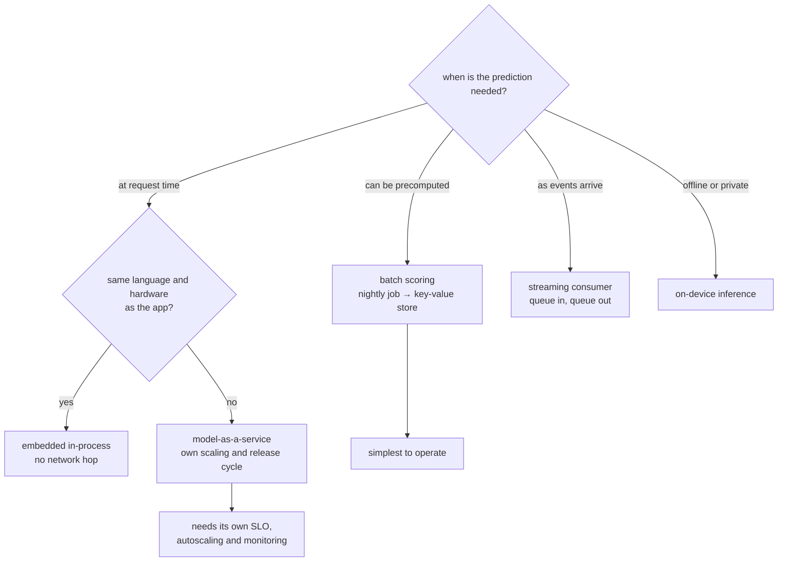

**In one line.** Where the model runs — in the app, behind an API, in a nightly job, or on the device — is the biggest structural decision you make.

## The idea in plain words

Five deployment shapes cover nearly everything.

- **Embedded in the application.** The model loads in-process. Simplest, fastest, no network hop — but scaling and updating means redeploying the app, and every language runtime needs its own copy.
- **Model-as-a-service.** The model lives behind its own HTTP/gRPC endpoint. Independent scaling and updates, one place to instrument — at the price of a network hop and an operational surface.
- **Batch scoring.** Predict everything overnight, write results to a store, serve them as lookups. Dramatically simpler to operate, and the right answer far more often than teams assume.
- **Streaming scoring.** Consume events from a queue, score, publish. Natural fit for fraud, monitoring and personalisation where inputs arrive as events.
- **On-device / edge.** Runs where the data is. Best privacy and latency; hardest to update and observe.

The second decision is how the system is **decomposed**: one service or several. ML components are natural service boundaries because they scale differently (GPU versus CPU), release differently (retraining, not code), and fail differently (degraded quality, not errors).



## How it works

### CQRS — separate reads from writes

**Command–Query Separation** (Meyer): a method should either *do* something (command) or *return* data (query), never both. **CQRS** raises this to the architecture: handle writes and reads with separate models and stores.

#### Route the operation

Click HTTP operations and watch them route to the command side (writes) or query side (reads). In an ML system the command side updates data/features/models; the query side serves predictions, metrics and dashboards.

:::tip

**Why split?** In plain CRUD, reads and writes share one model and contend for the same rows (shared/exclusive locks, tangled security). Separating them lets each side be modelled, scaled and secured independently. The two sides are joined by event streams (Kafka), brokers (RabbitMQ) or async pipelines (Airflow).

:::

### Eventual consistency

When write and read stores are separate, an update appears on the read side only *after* it propagates. **Eventual consistency**: not immediate everywhere, but all components converge after synchronisation.

#### Propagate a model release

OpenAI releases ChatGPT 6.0 at 12:00. The central registry updates instantly, but inference servers, edge regions and caches catch up over minutes. Step the clock and watch every endpoint eventually converge.

:::tip

**The trade.** Eventual consistency buys independent scaling and availability at the cost of a brief window where different parts serve different versions. For most ML serving (model versions, metrics) that window is perfectly acceptable.

:::

### RAG — retrieval-augmented generation

**RAG** grounds an LLM in external/up-to-date data: fetch relevant context first, **inject it into the prompt**, then generate. It cuts hallucination *without* retraining the model.

#### RAG as two pipelines

Trace the ingestion (write) pipeline and the query (read) pipeline. Each is pipe-and-filter; separating them is CQRS. RAG is a *composition* of patterns you already know.

:::tip

**Building blocks.** LangChain wires the app; embeddings (OpenAI, BERT, Sentence-Transformers, DPR, GloVe) turn text to vectors; vector stores (Pinecone, FAISS, ChromaDB, Elasticsearch+kNN) retrieve them. ChromaDB stores text/metadata in **SQLite** and embeddings in an **HNSW** index for fast similarity search.

:::

### The Monolith

A **monolith** packages all functionality into one deployable unit with a shared database — UI, orders, payments, the ML model, all together (the FTGO food-delivery example).

#### Monolith trade-offs

Flip between advantages and limitations. The monolith is genuinely the right call for prototypes and small teams — simple, fast, low-overhead — but it scales all-or-nothing.

:::tip

**Monolithic ML pattern.** UI/API, preprocessing, model loading and prediction in one codebase — great for prototypes (no network latency, low overhead), but independent scaling is hard, model updates may redeploy everything, and it's a single point of failure.

:::

### Microservices

Build the app as a collection of independently developed, deployed and scaled **services**, each with a single responsibility (Robert C. Martin: "gather what changes for the same reasons; separate what changes for different reasons").

#### Monolith ↔ microservices

Toggle a food-delivery app between one shared unit and independent services (gateway, orders, payments, model, logging — each with its own data). Watch what "scale one service" means in each.

:::tip

**For ML.** Split by capability — a gateway (routing), a model service (inference only), a logging service (observability) — communicating over REST/gRPC/GraphQL or Kafka. Each is developed, deployed and *scaled independently*.

:::

### Key takeaways

Compose patterns to meet your qualities.

- **1 · CQRS** — Separate writes (commands) from reads (queries); linked by events/brokers; eventual consistency between them.
- **2 · RAG** — Ground LLMs in retrieved context, no retraining. Composition: pipe-and-filter pipelines + CQRS.
- **3 · Monolith vs Micro** — One simple unit vs independent single-responsibility services. A trade-off driven by Session 4's quality attributes.

:::note

**The thread.** CQRS splits reads from writes and accepts eventual consistency in return for independent scaling. RAG shows architecture is composition — pipe-and-filter plus CQRS, grounding an LLM without retraining. The monolith and microservices are two ends of a packaging spectrum: simplicity vs independent scaling. Which you pick follows from the quality attributes you must hit. Next: event-driven architecture and ML design patterns.

:::

## A real system that works this way

**Recommendations are usually batch.** Score every user against every eligible item overnight, write the top 200 per user to Redis, and serve a lookup in 2 ms. It is unfashionable and it is right: no GPU in the request path, trivial fallback, and the freshness cost is usually acceptable.

**Fraud is streaming plus online.** The decision must happen inside the payment authorisation, so a service with a hard timeout and a rules fallback is the only workable shape.

**Keyboard prediction is on-device.** The data must not leave the phone, and the latency budget is a few milliseconds — which rules out everything else.

## Code you can run

The same model, three deployment shapes, with the trade-offs made visible.

```python
import time
from dataclasses import dataclass

# --- one model, deliberately trivial ---------------------------------------
def score(user_id: int, item_id: int) -> float:
    time.sleep(0.004)                       # stands in for real inference
    return ((user_id * 7919 + item_id * 104729) % 1000) / 1000

USERS, ITEMS = range(200), range(50)

# --- pattern 1: batch scoring ------------------------------------------------
@dataclass
class BatchStore:
    table: dict[int, list[tuple[int, float]]]

    def top_k(self, user_id: int, k: int = 5):
        return self.table.get(user_id, [])[:k]

def build_batch_store(top_k: int = 5) -> BatchStore:
    table = {}
    for user in USERS:
        scored = sorted(((item, score(user, item)) for item in ITEMS),
                        key=lambda t: -t[1])
        table[user] = scored[:top_k]
    return BatchStore(table)

start = time.perf_counter()
store = build_batch_store()
build_time = time.perf_counter() - start

start = time.perf_counter()
for user in range(50):
    store.top_k(user)
batch_serve = (time.perf_counter() - start) / 50 * 1000

# --- pattern 2: online scoring at request time ------------------------------
def online_recommend(user_id: int, k: int = 5):
    scored = sorted(((item, score(user_id, item)) for item in ITEMS), key=lambda t: -t[1])
    return scored[:k]

start = time.perf_counter()
for user in range(10):
    online_recommend(user)
online_serve = (time.perf_counter() - start) / 10 * 1000

# --- pattern 3: online with a cache and a fallback --------------------------
CACHE: dict[int, list[tuple[int, float]]] = {}
POPULAR = [(item, 0.5) for item in list(ITEMS)[:5]]     # the always-available fallback

def hybrid_recommend(user_id: int, k: int = 5, budget_ms: float = 8.0):
    if user_id in CACHE:
        return CACHE[user_id][:k], "cache"
    start = time.perf_counter()
    result = []
    for item in ITEMS:
        if (time.perf_counter() - start) * 1000 > budget_ms:
            return POPULAR[:k], "fallback (budget exceeded)"
        result.append((item, score(user_id, item)))
    result = sorted(result, key=lambda t: -t[1])[:k]
    CACHE[user_id] = result
    return result, "computed"

first, source_first = hybrid_recommend(1)
second, source_second = hybrid_recommend(1)
third, source_third = hybrid_recommend(2, budget_ms=1.0)

print(f"{'pattern':34} {'serve latency':>14}   notes")
print(f"{'batch (precomputed lookup)':34} {batch_serve:11.3f} ms   "
      f"built in {build_time:.1f}s offline")
print(f"{'online (score on request)':34} {online_serve:11.3f} ms   "
      f"{len(list(ITEMS))} inferences per request")
print(f"{'online + cache + fallback':34} {'~0.0':>11} ms   first={source_first}, "
      f"second={source_second}, tight budget={source_third}")

print("\nbatch is ~{:.0f}x faster to serve and needs no model in the request path;".format(
    online_serve / max(batch_serve, 1e-6)))
print("its cost is freshness — the table is as old as the last run.")
```

## Designing with it

**Choosing the shape**

| Pattern | Choose when | Watch out for |
| --- | --- | --- |
| Batch scoring | Inputs known in advance; freshness of hours is fine | Staleness; cold start for new entities |
| Model-as-a-service | Different scaling/hardware; several consumers | Network hop, timeouts, an extra SLO to own |
| Embedded | Single consumer, same runtime, tight latency | Redeploy to update the model; memory per process |
| Streaming | Inputs arrive as events; decisions are per-event | Ordering, replay, exactly-once semantics |
| On-device | Privacy or offline requirement | Updates, fragmentation, no observability |

**Decomposition heuristics**

- Split where the **scaling profile** differs (GPU inference versus CPU business logic).
- Split where the **release cadence** differs (a model retrained weekly versus an app released daily).
- Do **not** split because a diagram looks tidier. Every boundary adds a network call, a timeout, a retry and a deployment.
- Keep the **feature computation** on one side of the boundary, not split across it — that is how training/serving skew appears.

**Always specify degradation.** For each pattern: what is served when the model is unavailable? Batch serves the last table; online serves rules or popularity; embedded serves a bundled default. That answer belongs in the design document, not in an incident review.

## Where this stands in 2026

:::info Industry view

- **Batch scoring remains the most common production pattern** — simplest to operate, and sufficient for most recommendation and risk use cases.
- Model-as-a-service is standard for shared models; dedicated inference servers (Triton, TorchServe, vLLM, Ray Serve) are the usual runtimes.
- Streaming ML (Kafka/Flink plus a scorer) is the norm in fraud and real-time personalisation.
- On-device inference is growing fast for privacy and cost reasons, with quantised small models replacing API calls for simple tasks.

:::

## Practice questions

<details>
<summary><strong>Q1.</strong> State the Command–Query Separation principle and how CQRS applies it at the architecture level.</summary>

**CQS (Meyer):** every method should either be a *command* that performs an action or a *query* that returns data — never both. **CQRS** raises this to the architecture: handle writes and reads with separate models and stores, so each side can be modelled, scaled and secured independently. Mapping HTTP: queries ≈ GET; commands ≈ POST/PUT/DELETE.<br /><em>Session 5 · conceptual</em>

</details>

<details>
<summary><strong>Q2.</strong> What is eventual consistency? Give an example.</summary>

An update in one part of a distributed system may not appear everywhere immediately, but all components **converge** after synchronisation. Example: OpenAI releases ChatGPT 6.0 at noon; the registry updates instantly but inference servers, edge regions and caches pick it up over minutes — some users hit the new model immediately, others briefly stay on the old, then all converge.<br /><em>Session 5 · conceptual</em>

</details>

<details>
<summary><strong>Q3.</strong> Explain how RAG is a composition of two patterns.</summary>

RAG grounds an LLM in retrieved context injected into the prompt (cutting hallucination without retraining). It is two pipelines: an **ingestion/write** pipeline (documents → chunk → embed → index → vector store) and a **query/read** pipeline (query → embed → search → build prompt → answer). Each pipeline is pipe-and-filter; separating write from read is CQRS.<br /><em>Session 5 · conceptual</em>

</details>

<details>
<summary><strong>Q4.</strong> Give two advantages and two limitations of a monolithic architecture.</summary>

**Advantages:** high performance (shared memory, no service calls), simple to test (end-to-end) and deploy (one artifact). **Limitations:** can only scale the *whole* app, technology lock-in (new tech ⇒ rewrite), growing complexity that's hard for newcomers, and a single point of failure. Great for prototypes/small teams; strained as it grows.<br /><em>Session 5 · conceptual</em>

</details>

<details>
<summary><strong>Q5.</strong> What problem do microservices solve, and what principle do they embody?</summary>

They let an app be built as independently developed, deployed and **scaled** services — enabling faster deployment, mixed tech stacks, and per-capability scaling (scale the model service alone). They embody the **Single Responsibility Principle**: "gather what changes for the same reasons; separate what changes for different reasons." The cost is distributed-systems complexity — use them only when that's justified.<br /><em>Session 5 · conceptual</em>

</details>

<details>
<summary><strong>Q6.</strong> In a microservices ML system, name three services and their single responsibilities.</summary>

**Gateway** — routing/orchestration of requests. **Model service** — inference only. **Logging service** — observability/history. Each has one responsibility, communicates over well-defined APIs (REST/gRPC/GraphQL or Kafka), and scales independently.<br /><em>Session 5 · conceptual</em>

</details>

## Further reading

- [Designing Machine Learning Systems (Chip Huyen)](https://www.oreilly.com/library/view/designing-machine-learning/9781098107956/) — deployment patterns with real trade-offs.
- [Ray Serve documentation](https://docs.ray.io/en/latest/serve/index.html) — a common model-serving runtime.
- [Google Cloud: MLOps architecture levels](https://cloud.google.com/architecture/mlops-continuous-delivery-and-automation-pipelines-in-machine-learning) — the maturity model most teams map themselves against.
- [Source lecture: seml-s5-arch-patterns](https://learning.bansal-ai.in/seml-s5-arch-patterns/lecture.html) — the original interactive lecture these notes were built from.

- **[Machine Learning in Production — Deploying a Model / Design Patterns](https://mlip-cmu.github.io/book/)** `book`
  Kaestner, CMU (MIT Press, open access) — Deployment architectures and the patterns for serving models in real systems.
