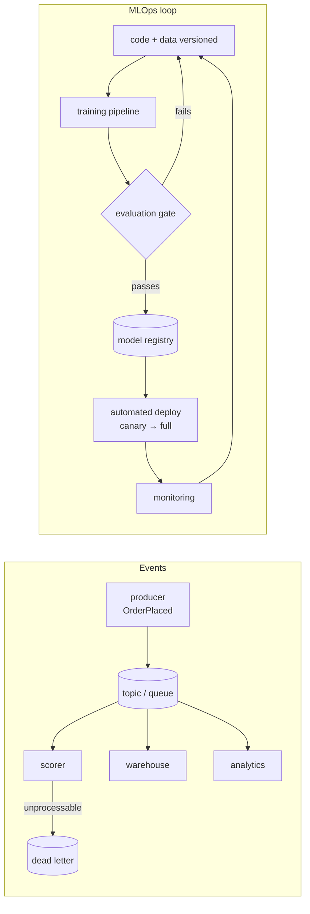

**In one line.** Events decouple the producer from the consumer; the MLOps loop is what turns a trained model into a deployed one, repeatably.

## The idea in plain words

**Event-driven** means components communicate by publishing facts rather than calling each other. An order service publishes `OrderPlaced`; a scorer, a warehouse and an analytics job all consume it, none of them knowing about the others. You gain decoupling, buffering under load and replay; you pay in eventual consistency and harder debugging.

Three properties you must design for, because the transport cannot give them to you for free:

- **At-least-once delivery.** Messages *will* arrive twice. Handlers must be **idempotent** — the same event applied twice leaves the same state.
- **Ordering is per-partition**, not global. If order matters, the key must put related events in the same partition.
- **Poison messages.** One unprocessable event must not block the queue forever — dead-letter it, count it, alert on it.

The **MLOps loop** is the same automation idea applied to models: data and code are versioned, training is a pipeline that can be re-run, the output is a registered artefact, deployment is automated and gated by evaluation, and monitoring feeds back into the next retrain. The value is not the tooling; it is that **the path from idea to production is repeatable by someone else**.



## How it works

### Event-Driven Architecture

**Context:** many asynchronous events from users, systems and processes. **Problem:** you need asynchronous communication, decoupling, and scalability. **Solution:** publish–subscribe over a message broker.

:::note

**The shift.** Instead of services calling each other directly and waiting, a service *announces that something happened* and moves on; anyone who cares listens. The publisher never needs to know who the subscribers are — that's what makes the system loosely coupled.

:::

:::tip

**Components.** **Publishers** emit events to a bus; **subscribers** register interest and get notified; **message brokers** (Apache Kafka, RabbitMQ, Amazon SQS, Azure Service Bus) give reliable delivery, queuing and persistence.

:::

### Publish–subscribe in motion

One event, many independent consumers. The producer fires once; the broker fans it out to every subscriber that registered interest.

#### Publish an event

Publish a "new transaction" event and watch the broker deliver it to all subscribers (fraud model, dashboard, notifier) at once. Toggle a subscriber off to see that publishers are unaffected — that's decoupling.

:::tip

**Why it scales.** Producers and consumers are decoupled and asynchronous, so each can be added, removed or scaled independently. EDA is the backbone linking CQRS's command and query sides and feeding streaming features/predictions.

:::

### The Model Registry pattern

In software a **registry** is a central hub to register, locate and retrieve services. In ML it's a **centralized repository that tracks, versions, manages and governs models** across their lifecycle — the "source of truth" bridging experimentation and production.

#### What MLflow Registry gives you

Click each capability. The registry is what lets you compare versions, roll back, trace a model to its exact training run/data, promote it to production, and satisfy governance — all the things ad-hoc files can't.

:::tip

**Source of truth.** The registry tracks full model lineage — which experiment and run produced a model, on what data and parameters — giving reproducibility from development to deployment. Tools: MLflow, DVC, Weights & Biases.

:::

### Git vs the ML registry

Git versions **source code**; the ML registry versions **ML artifacts**. They're complementary — use each for what it's good at.

#### What goes where?

Drag each item to Git or the ML registry. Source files, docs and config belong in Git; trained models, weights, datasets, hyperparameters, metrics, logs and lineage belong in the registry.

### Batch vs Real-time serving

A **deployment pattern** with one core trade-off: **data freshness vs operational complexity**. Batch scores many records on a schedule; real-time answers single requests instantly via an always-on API.

#### Batch or real-time?

Route each use-case to the right pattern. If an immediate answer is required to function (fraud at checkout, spam filtering), it's real-time. If tomorrow is fine (nightly recommendations, risk reports), batch is simpler.

:::tip

**Rule of thumb.** **Batch** (offline): high latency acceptable, simpler — customer segmentation, newsletter recommendations, end-of-day risk. **Real-time** (online): milliseconds matter, more complex — fraud blocking, dynamic pricing, spam filtering.

:::

### Key takeaways

Decouple, version, and serve at the right freshness.

- **1 · Event-driven** — Publish–subscribe over a broker (Kafka, RabbitMQ). Loose coupling, asynchrony, horizontal scale.
- **2 · Model Registry** — Git for ML artifacts — versions models, weights, data, metrics, lineage. MLflow, DVC, W&B.
- **3 · Serving** — Batch (offline, simple, high-latency OK) vs real-time (always-on API, milliseconds). Choose by freshness need.

:::note

**The thread.** Event-driven architecture replaces brittle direct calls with publish–subscribe over a broker, decoupling producers from consumers. The model registry brings version control, lineage and governance to ML artifacts — what Git does for code. And serving is a freshness decision: batch when high latency is fine, real-time when milliseconds matter. Next session: agentic AI and its coordination patterns.

:::

## A real system that works this way

**The double-charge incident** is the canonical event-driven failure: a consumer processes `PaymentAuthorised`, crashes before acknowledging, and the broker redelivers. Without an idempotency key the customer is charged twice. The fix is a processed-ids table and a unique constraint — five lines that prevent a category of incident.

**A retraining pipeline that nobody can run** is the canonical MLOps failure: it works on one laptop, depends on an undocumented CSV, and the person who wrote it has left. Versioned data plus a pipeline definition in the repository is what prevents it.

## Code you can run

Idempotency is the property that makes at-least-once delivery survivable.

```python
import hashlib, json, random
from collections import Counter

# --- a broker that delivers at least once, sometimes twice, out of order ----
def deliver(events, duplicate_rate=0.3, seed=0):
    rng = random.Random(seed)
    stream = []
    for e in events:
        stream.append(e)
        if rng.random() < duplicate_rate:
            stream.append(dict(e))              # redelivery
    rng.shuffle(stream)                         # ordering is not guaranteed
    return stream

EVENTS = [
    {"event_id": "e1", "type": "PaymentAuthorised", "order": "A-1", "amount": 25.0},
    {"event_id": "e2", "type": "PaymentAuthorised", "order": "A-2", "amount": 40.0},
    {"event_id": "e3", "type": "PaymentAuthorised", "order": "A-3", "amount": 15.5},
    {"event_id": "bad", "type": "PaymentAuthorised", "order": "A-4"},      # no amount
]

# --- the naive consumer -------------------------------------------------------
def naive_consumer(stream):
    balance = 0.0
    for event in stream:
        balance += event.get("amount", 0.0)
    return balance

# --- the idempotent consumer -------------------------------------------------
class IdempotentConsumer:
    def __init__(self):
        self.processed: set[str] = set()
        self.balance = 0.0
        self.dead_letter: list[dict] = []
        self.stats = Counter()

    def handle(self, event):
        key = event.get("event_id") or hashlib.sha256(
            json.dumps(event, sort_keys=True).encode()).hexdigest()
        if key in self.processed:
            self.stats["duplicate_skipped"] += 1
            return
        try:
            amount = float(event["amount"])          # may raise: poison message
        except (KeyError, TypeError, ValueError) as exc:
            self.dead_letter.append({"event": event, "reason": str(exc)})
            self.stats["dead_lettered"] += 1
            self.processed.add(key)                  # do not retry forever
            return
        self.balance += amount
        self.processed.add(key)
        self.stats["applied"] += 1

stream = deliver(EVENTS)
print(f"broker delivered {len(stream)} messages for {len(EVENTS)} events")

print(f"naive consumer total     : {naive_consumer(stream):7.2f}  <- duplicates counted twice")

consumer = IdempotentConsumer()
for event in stream:
    consumer.handle(event)
print(f"idempotent consumer total: {consumer.balance:7.2f}  <- correct")
print("stats:", dict(consumer.stats))
print("dead letter:", consumer.dead_letter)

# replaying the entire stream again must change nothing
before = consumer.balance
for event in stream:
    consumer.handle(event)
print(f"\nafter a full replay      : {consumer.balance:7.2f} "
      f"(unchanged: {consumer.balance == before})")
print("that property — replay-safe — is what makes at-least-once delivery usable.")
```

## Designing with it

**Event-driven checklist**

| Concern | Control |
| --- | --- |
| Duplicates | Idempotency key per event; a processed-ids store with a TTL |
| Ordering | Partition by the entity key; do not assume global order |
| Poison messages | Dead-letter queue with the reason, a counter and an alert |
| Schema changes | A schema registry, backwards-compatible evolution, versioned events |
| Backpressure | Bounded consumer concurrency; lag as a first-class metric |
| Replay | Keep enough retention to reprocess; make handlers replay-safe |

**MLOps maturity, honestly**

| Level | What exists | What still hurts |
| --- | --- | --- |
| 0 — manual | Notebook, hand-deployed model | Nothing is reproducible |
| 1 — automated training | Pipeline in the repo, versioned data, registry | Deployment is still manual |
| 2 — automated delivery | CI/CD for models, evaluation gate, canary | Monitoring may still be thin |
| 3 — continuous | Drift-triggered retraining, automatic rollback | Requires real discipline to keep safe |

Most teams should aim for level 2 and stop. Automatic retraining without strong evaluation and rollback is a machine for deploying regressions quickly.

**Gate every model deployment** on the same executable acceptance criteria you wrote in requirements, plus a comparison against the model currently in production. "Better than what we have" is the only meaningful bar.

## Where this stands in 2026

:::info Industry view

- **Idempotency keys and dead-letter queues are table stakes** in event-driven systems; their absence is a reliable predictor of production incidents.
- Kafka (plus Flink or Faust) dominates streaming ML; managed queues (SQS, Pub/Sub) cover the simpler cases.
- Model registries with automated evaluation gates are the standard MLOps backbone — MLflow, SageMaker, Vertex AI or an internal equivalent.
- Consumer lag and dead-letter volume are the two metrics that catch most event-pipeline failures before users notice.

:::

## Practice questions

<details>
<summary><strong>Q1.</strong> Describe the publish–subscribe model and the role of a message broker in EDA.</summary>

**Publishers** emit events to an event bus without knowing who consumes them; **subscribers** register interest in event types and are notified when they occur. A **message broker** (Kafka, RabbitMQ, SQS, Azure Service Bus) provides reliable delivery, queuing and persistence. The result is loose coupling, asynchrony and horizontal scalability.<br /><em>Session 6 · conceptual</em>

</details>

<details>
<summary><strong>Q2.</strong> What problem does event-driven architecture solve that direct service-to-service calls do not?</summary>

Direct calls couple services tightly and force synchronous waiting. EDA gives **asynchronous communication** (events at different times), **decoupling** (publishers don't know subscribers, so parts evolve independently), and **scalability** (handle rising event volume without new bottlenecks).<br /><em>Session 6 · conceptual</em>

</details>

<details>
<summary><strong>Q3.</strong> What is the Model Registry pattern, and how does it differ from Git?</summary>

A **centralized repository that tracks, versions, manages and governs ML models** across their lifecycle — the source of truth between experimentation and production. Git versions source code; the ML registry versions artifacts: trained models, weights, datasets/refs, hyperparameters, metrics, experiment logs and lineage. Tools: MLflow, DVC, Weights & Biases.<br /><em>Session 6 · conceptual</em>

</details>

<details>
<summary><strong>Q4.</strong> Name three things the MLflow Model Registry provides.</summary>

**Version control** (compare, roll back, parallel versions); **lineage/traceability** (each version links to its run, data and parameters for reproducibility); **production workflows** (promote/deploy via aliases, tags, environments); and **governance** (metadata, access control, auditability).<br /><em>Session 6 · conceptual</em>

</details>

<details>
<summary><strong>Q5.</strong> Contrast batch and real-time serving, and give one use-case for each.</summary>

**Batch (offline):** score many records on a schedule; high latency acceptable, simpler — e.g. nightly product recommendations in an email, end-of-day risk reports. **Real-time (online):** an always-on API answering single requests in milliseconds — e.g. blocking a fraudulent transaction at checkout, spam filtering. The trade-off is data freshness vs operational complexity.<br /><em>Session 6 · conceptual</em>

</details>

<details>
<summary><strong>Q6.</strong> A bank wants to block fraudulent card transactions at the point of sale. Batch or real-time? Why?</summary>

Real-time (online). The decision must be made in milliseconds while the customer waits at checkout, so the model must be a persistent, always-on service that returns approve/deny immediately — a batch job computed overnight would be far too late.<br /><em>Session 6 · applied</em>

</details>

## Further reading

- [Designing Data-Intensive Applications (Kleppmann)](https://dataintensive.net/) — chapter 11 on streams is the reference for this material.
- [Kafka documentation: delivery semantics](https://kafka.apache.org/documentation/#semantics) — at-least-once, exactly-once and what they cost.
- [MLOps: continuous delivery and automation pipelines (Google)](https://cloud.google.com/architecture/mlops-continuous-delivery-and-automation-pipelines-in-machine-learning) — the maturity levels above.
- [Source lecture: seml-s6-events-mlops](https://learning.bansal-ai.in/seml-s6-events-mlops/lecture.html) — the original interactive lecture these notes were built from.

- **[Machine Learning in Production — MLOps, Pipelines & Automation](https://mlip-cmu.github.io/book/)** `book`
  Kaestner, CMU (MIT Press, open access) — Pipeline quality, automation and MLOps as the ML-specific form of DevOps.
- **[MLiP lecture recordings (full course)](https://www.youtube.com/playlist?list=PLDS2JMJnJzdmubSKnanmIwzr08cionWm_)** `▶ video`
  CMU MLiP lecture recordings — The MLOps segment of the course.
