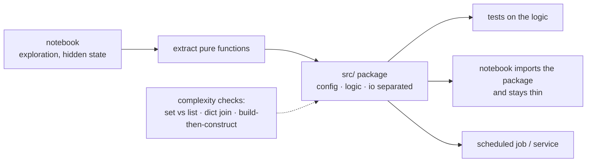

**In one line.** Research code optimises for the next experiment; production code optimises for the next person — and the gap between them is mostly structure.

## The idea in plain words

Notebooks are excellent for exploration and poor as deliverables: hidden state from out-of-order execution, no imports for other code, no tests, and diffs nobody can review. The transition is mechanical:

1. **Extract pure functions** from cells — the ones that take data and return data.
2. **Move configuration to a file or environment**, not cell-top constants.
3. **Separate I/O from logic** so the logic can be tested without a database.
4. **Put it in a package** with a `pyproject.toml`, and import the package back into the notebook. The notebook becomes a thin driver.

The other half of this topic is **cost**. ML pipelines meet asymptotics much sooner than web code because n is large:

- Membership tests against a list are O(n) — a `set` makes them O(1).
- Joining two datasets by looping is O(n·m) — index one side into a dict and it is O(n+m).
- Sorting inside a loop is the classic accidental O(n² log n).
- Appending to a DataFrame in a loop copies every time — build a list, construct once.

None of this is exotic. It is the difference between a job that finishes in four minutes and one that finishes in four hours.



## How it works

### SE vs ML: who writes the rules?

Traditional software: the developer writes explicit rules. ML: the developer writes training code and the **algorithm learns** the rules from data.

#### Rules-by-hand vs rules-learned

Flip between the two styles for the same loan-approval task.

### Five features of good ML code

- **Readable** — Clear names, small functions, comments that explain *why*.
- **Reproducible** — Fixed seeds, pinned deps, versioned data — repeat a run exactly.
- **Modular** — Separate data / features / training / evaluation; testable & reusable.
- **Efficient** — Mindful of time & memory on large data.
- **Tested & robust** — Unit tests, input validation, graceful failure on bad data.
- **Why it's harder** — Behaviour depends on data + randomness, so bugs hide easily.

### Analysing code performance

ML runs over huge data, so **time** and **memory** are first-class. Reason about how they grow with data (Big-O, next session); profile, vectorise, pick good data structures.

### Code sharing

ML is a team sport. Version control, clear structure, documented setup and small reviewable changes keep a model reproducible and maintainable across the team.

### Key takeaways

- **1 · Mindset** — Write code that learns rules, not code that states them.
- **2 · Good code** — Readable, reproducible, modular, efficient, tested.
- **3 · Team + speed** — Performance matters; share via version control & structure.

:::note

**The thread.** Machine-learning code differs fundamentally from traditional software: the algorithm learns the decision rules from data instead of the developer writing them. That makes reproducibility, modularity and testing essential — and because ML runs over large datasets, performance and good collaboration practices round out what "good code" means.

:::

How does your code slow down as data grows? **Big-O** answers that — and choosing the right data structure can turn a million operations into a few thousand.

### Why complexity matters

ML processes millions of records and billions of parameters. Code that's fine on small data can become impossible at scale.

:::tip

**The question.** If I double the data, does the work double, quadruple, or barely change? That pattern decides whether your code survives.

:::

### How code slows as data grows

Big-O keeps the dominant growth term: O(1) &lt; O(log n) &lt; O(n) &lt; O(n log n) &lt; O(n²).

#### Growth comparator

Slide the input size n and compare the operation counts across complexity classes.

:::tip

**Worked (n=1000).** O(1)=1, O(log n)≈10, O(n)=1000, O(n log n)≈**9,966**, O(n²)=**1,000,000**. A 100× gap at just a thousand items.

:::

### Using data structures effectively

A dictionary/set lookup is O(1) on average; scanning a list is O(n). Picking the right structure is often the biggest performance win.

### OOP & functional programming

- **Object-oriented** — Bundles data with methods (objects, classes, inheritance). Good for stateful entities like a Model or Dataset.
- **Functional** — Pure functions, immutability, composition (map/filter/reduce). Great for testable, parallel data pipelines.

### Key takeaways

- **1 · Big-O** — Growth with n; keep the dominant term.
- **2 · Structures** — Dict/set O(1) can turn O(n²) into O(n).
- **3 · Paradigms** — OOP for state, FP for transformations.

:::note

**The thread.** Time complexity and Big-O describe how an algorithm scales with data — the difference between code that works at a thousand rows and code that works at a billion. The right data structure can change the complexity class outright, and OOP vs functional styles shape how maintainable and parallel your ML code is.

:::

## A real system that works this way

**The four-hour feature job** is almost always one of three things: a nested loop that should be a dict join, a `df.append` inside a loop, or a per-row database query. Each is a five-line fix that turns hours into minutes, and each is invisible in a notebook on 1,000 sample rows.

**The unreproducible result** is the notebook equivalent: cells executed out of order, a variable redefined halfway down, and a number in the paper that nobody can regenerate. Restart-and-run-all as a CI check is the cheap defence.

## Code you can run

The same join, three ways — the difference is asymptotic, not stylistic.

```python
import random, time
from collections import defaultdict

random.seed(0)
N, M = 20_000, 5_000
orders = [{"id": i, "customer_id": random.randrange(M)} for i in range(N)]
customers = [{"id": i, "segment": random.choice(["gold", "silver", "bronze"])}
             for i in range(M)]

# --- O(n·m): the nested loop everyone writes first -------------------------
def join_nested(orders, customers, limit=1200):
    out = []
    for o in orders[:limit]:
        for c in customers:
            if c["id"] == o["customer_id"]:
                out.append({**o, "segment": c["segment"]})
                break
    return out

# --- O(n+m): index one side once --------------------------------------------
def join_indexed(orders, customers):
    index = {c["id"]: c["segment"] for c in customers}
    return [{**o, "segment": index[o["customer_id"]]} for o in orders]

start = time.perf_counter(); join_nested(orders, customers); nested = time.perf_counter() - start
start = time.perf_counter(); join_indexed(orders, customers); indexed = time.perf_counter() - start

print(f"nested loop  (1,200 of {N:,} rows): {nested*1000:8.1f} ms")
print(f"dict index   ({N:,} rows)        : {indexed*1000:8.1f} ms")
print(f"per-row speedup ≈ {(nested/1200) / (indexed/N):,.0f}x\n")

# --- membership: list vs set -------------------------------------------------
blocked_list = [f"user{i}" for i in range(20_000)]
blocked_set = set(blocked_list)
probes = [f"user{random.randrange(30_000)}" for _ in range(2_000)]

start = time.perf_counter(); sum(p in blocked_list for p in probes[:200])
list_time = (time.perf_counter() - start) / 200
start = time.perf_counter(); sum(p in blocked_set for p in probes)
set_time = (time.perf_counter() - start) / 2_000
print(f"membership per check: list {list_time*1e6:8.1f} µs | set {set_time*1e6:6.2f} µs "
      f"({list_time/set_time:,.0f}x)\n")

# --- accumulating rows: append-then-build, not build-then-copy -------------
def grow_by_concat(n=4_000):
    rows = []
    for i in range(n):
        rows = rows + [{"i": i}]          # copies the whole list each time: O(n²)
    return rows

def grow_by_append(n=4_000):
    rows = []
    for i in range(n):
        rows.append({"i": i})             # amortised O(1)
    return rows

start = time.perf_counter(); grow_by_concat(); concat = time.perf_counter() - start
start = time.perf_counter(); grow_by_append(); append = time.perf_counter() - start
print(f"list + [x] in a loop : {concat*1000:7.1f} ms")
print(f"list.append in a loop: {append*1000:7.1f} ms  ({concat/append:,.0f}x)")

# --- the structural point: logic separated from I/O is testable ------------
def segment_counts(joined):
    counts = defaultdict(int)
    for row in joined:
        counts[row["segment"]] += 1
    return dict(counts)

print("\npure function, no I/O, testable:", segment_counts(join_indexed(orders, customers)))
```

## Designing with it

**Notebook-to-module checklist**

| Step | Test that it worked |
| --- | --- |
| Extract pure functions | They import and run outside the notebook |
| Config out of cells | Changing an environment variable changes behaviour |
| I/O at the edges | The logic runs against in-memory fixtures |
| Package it | `pip install -e .` then `import yourpkg` from anywhere |
| Notebook imports the package | Restart-and-run-all reproduces the result |
| Seeds fixed | Two runs produce identical numbers |

**Complexity checks for pipelines**

| Pattern | Cost | Fix |
| --- | --- | --- |
| `x in big_list` | O(n) | `set` |
| Nested loop join | O(n·m) | Index one side into a dict, or use a real join |
| `df = df.append(row)` in a loop | O(n²) | Collect rows, construct once |
| Sort inside a loop | O(n² log n) | Sort once outside |
| One query per row | n round trips | Batch with `IN`, or join in the database |

**Naming and structure rules that survive review:** functions named for what they return, modules named for the domain not the technology (`pricing.py`, not `utils.py`), no function longer than a screen, and no `utils` module that becomes a landfill. In ML code specifically: keep feature definitions in one place, and never let a notebook be the only copy of a transformation.

## Where this stands in 2026

:::info Industry view

- Restart-and-run-all in CI (papermill, nbmake, or jupytext plus pytest) is the standard defence against hidden notebook state.
- Most "the pipeline is slow" tickets resolve to a dict join, a set membership test, or batched I/O — not to a bigger machine.
- polars and DuckDB are increasingly chosen over pandas for large joins because they parallelise and avoid the copy-heavy patterns above.
- Teams that keep notebooks as thin drivers over an installed package move from experiment to production far faster than those that copy cells.

:::

## Practice questions

<details>
<summary><strong>Q1.</strong> How does writing code in ML differ from traditional software engineering?</summary>

In traditional SE the developer writes the decision rules explicitly (if/else). In ML the developer writes training code and the algorithm learns the rules from data; the logic lives in learned parameters, not hand-written conditions.<br /><em>Session 9 · conceptual</em>

</details>

<details>
<summary><strong>Q2.</strong> List the five features of good code in ML.</summary>

Readable, reproducible, modular, efficient, and tested/robust.<br /><em>Session 9 · conceptual</em>

</details>

<details>
<summary><strong>Q3.</strong> Why is reproducibility especially important — and hard — in ML?</summary>

Behaviour depends on data and randomness, so results vary unless you fix random seeds, pin dependencies, and version the data. Otherwise a run can't be repeated and bugs hide easily.<br /><em>Session 9 · conceptual</em>

</details>

<details>
<summary><strong>Q4.</strong> Why is performance analysis a first-class concern in ML code?</summary>

ML processes large data — millions of records, billions of parameters — so time and memory grow quickly; code that is fine on small data can become impractical at scale. Analyse with time complexity (Big-O), and profile / vectorise.<br /><em>Session 9 · conceptual</em>

</details>

<details>
<summary><strong>Q5.</strong> What practices support good code sharing in an ML team?</summary>

Version control (git), clear project structure, documented setup, and small reviewable changes — so a model built by one person can be reproduced and maintained by the whole team.<br /><em>Session 9 · conceptual</em>

</details>

<details>
<summary><strong>Q1.</strong> What does time complexity describe, and why does it matter in ML?</summary>

It describes how an algorithm's running time grows as the input size grows. It matters because ML processes very large data, so an algorithm fine on small data can become impractical at scale.<br /><em>Session 10 · conceptual</em>

</details>

<details>
<summary><strong>Q2.</strong> What does Big-O notation capture?</summary>

The order of growth — the dominant term as n → ∞, ignoring constants and lower-order terms. It measures how time/memory scale with input size.<br /><em>Session 10 · conceptual</em>

</details>

<details>
<summary><strong>Q3.</strong> Order these by growth: O(n²), O(1), O(n log n), O(log n), O(n).</summary>

O(1) &lt; O(log n) &lt; O(n) &lt; O(n log n) &lt; O(n²).<br /><em>Session 10 · conceptual</em>

</details>

<details>
<summary><strong>Q4.</strong> At n = 1000, give the operation counts for O(n), O(n log n) and O(n²).</summary>

O(n) = 1,000; O(n log n) = 1000 × log₂1000 ≈ 1000 × 9.97 ≈ 9,966; O(n²) = 1,000,000 — a 100× gap over O(n log n).<br /><em>Session 10 · numeric</em>

</details>

<details>
<summary><strong>Q5.</strong> How can the wrong data structure create a hidden O(n²), and how do you fix it?</summary>

An O(n) list lookup inside an O(n) loop becomes O(n²). Replacing the inner list with a dictionary/set (O(1) average lookup) restores O(n).<br /><em>Session 10 · conceptual</em>

</details>

<details>
<summary><strong>Q6.</strong> Contrast OOP and functional programming.</summary>

OOP bundles data with the methods that act on it (objects, classes, inheritance) — good for stateful entities. Functional programming uses pure functions and immutability with composition (map/filter/reduce) — good for testable, parallel data pipelines.<br /><em>Session 10 · conceptual</em>

</details>

## Further reading

- [Joel Grus: I don't like notebooks](https://www.youtube.com/watch?v=7jiPeIFXb6U) — the critique worth understanding before defending them.
- [jupytext](https://jupytext.readthedocs.io/) and [nbmake](https://github.com/treebeardtech/nbmake) — reviewable, testable notebooks.
- [Python TimeComplexity](https://wiki.python.org/moin/TimeComplexity) — the cost table behind the fixes above.
- [Cookiecutter Data Science](https://cookiecutter-data-science.drivendata.org/) — a project layout that separates notebooks, source and data.
- [Source lecture: seml-s9-coding-practices](https://learning.bansal-ai.in/seml-s9-coding-practices/lecture.html) — the original interactive lecture these notes were built from.
- [Source lecture: seml-s10-complexity-datastructures](https://learning.bansal-ai.in/seml-s10-complexity-datastructures/lecture.html) — the original interactive lecture these notes were built from.

- **[Machine Learning in Production — Infrastructure Quality & Code Quality](https://mlip-cmu.github.io/book/)** `book`
  Kaestner, CMU (MIT Press, open access) — Testing, reproducibility and code quality for ML pipelines — the engineering discipline behind this session.
  Kaestner, CMU (MIT Press, open access) — How data volume and system scale drive design decisions in production ML.
