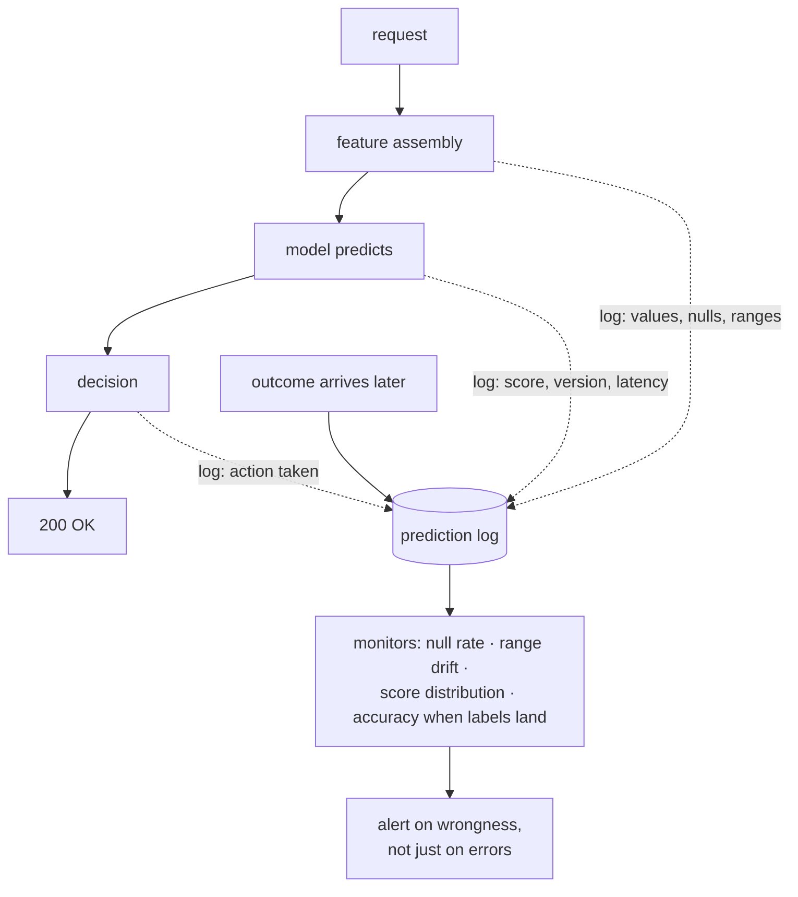

**In one line.** Ordinary software fails loudly; ML fails quietly and keeps
returning 200 OK — so you have to instrument for wrongness, not just for errors.

## The idea in plain words

There are two kinds of failure in an ML system and they need different tools.

**Loud failures** — exceptions, timeouts, 500s. Handle these the way you would
anywhere: typed exceptions, structured logs with a correlation id, tracebacks,
alerts on error rate.

**Silent failures** — the system is healthy and the answers are wrong. A feature
arrives as `NULL` and is imputed to zero; an upstream schema change shifts a
column; the model degrades as the world moves. No exception is raised, no
dashboard turns red.

Catching the silent kind means logging **what the model saw and did**, not just
that it responded:

- The **input feature vector** (or a hash plus the ranges) — most bad
  predictions are bad inputs.
- The **prediction and the confidence**, plus the **model version**.
- The **decision taken** and, when it eventually arrives, the **outcome**.

With those four you can answer "why did it do that?" months later. Without them
you are guessing. Debugging then becomes: reproduce the exact input, run it
through the exact model version, and compare against a known-good example —
which is only possible if both the input and the version were recorded.



## How it works

### Errors are normal

- **Syntax** — Caught before running — the code won't even start.
- **Runtime / exception** — Raised while running: FileNotFound, ValueError.
  Catch with try/except.
- **Logic** — Runs fine but the answer is wrong — the hardest kind.

### Logging, not print

Logging records what the program does so you can diagnose after the fact.
Frameworks give **levels**, timestamps and configurable outputs — unlike print.

:::tip

**Worked.** A run emits 5 DEBUG, 3 INFO, 2 WARNING, 1 ERROR. Set level = WARNING
→ you see only 2+1 = **3** messages. Dev at DEBUG (all 11), prod at
WARNING/INFO.

:::

### Debug systematically

- **1 · Reproduce** — A reliable, minimal trigger — fix a seed, capture the
  input.
- **2 · Isolate** — Binary-search the pipeline; check each stage's I/O; use
  breakpoints.
- **3 · Fix** — One theory, one change, test it.
- **4 · Verify** — Confirm — and add a **regression test** so it can't return.

:::note

**For ML.** Log shapes, label distributions and metrics; assert no NaNs and
values in range; check for **data leakage** and **train/serve skew** when
metrics look too good.

:::

### Key takeaways

- **1 · Handle errors** — Syntax / runtime / logic; try/except; never swallow.
- **2 · Log with levels** — Threshold controls verbosity; dev vs prod.
- **3 · Debug in a loop** — Reproduce → isolate → fix → verify with a test.

:::note

**The thread.** Robust ML code treats failure as expected: it handles errors
explicitly, logs enough (at the right level) to diagnose problems in production,
and fixes bugs through a disciplined loop that ends in a regression test — which
matters doubly in ML, where the worst bugs never crash at all.

:::

## A real system that works this way

**The imputed-zero incident** is the archetype. An upstream team renames
`account_age_days` to `account_age`. The feature pipeline finds nothing, fills
the default 0, and the model now believes every customer is brand new. Fraud
approvals swing, no error is logged, and the service dashboard is perfect. A
null-rate monitor on that one feature would have caught it in minutes.

**The mystery prediction** — "why was this customer rejected?" — is answerable
in seconds if you logged the feature vector and model version, and unanswerable
otherwise, because the model has since been retrained.

## Code you can run

Feature-level monitoring is what turns a silent failure into an alert.

```python
import json, random, statistics
from collections import Counter, defaultdict

random.seed(3)

# --- a reference profile captured at training time -------------------------
def profile(rows, features):
    prof = {}
    for f in features:
        values = [r[f] for r in rows if r[f] is not None]
        prof[f] = {
            "null_rate": 1 - len(values) / len(rows),
            "mean": statistics.fmean(values),
            "p01": sorted(values)[int(0.01 * len(values))],
            "p99": sorted(values)[int(0.99 * len(values))],
        }
    return prof

FEATURES = ["account_age_days", "order_count", "avg_basket"]

def sample(n, broken=False):
    rows = []
    for _ in range(n):
        rows.append({
            # the upstream rename: the field arrives missing and is imputed to 0
            "account_age_days": 0 if broken else max(1, int(random.gauss(400, 200))),
            "order_count": max(0, int(random.gauss(12, 6))),
            "avg_basket": round(abs(random.gauss(60, 25)), 2),
        })
    return rows

training = sample(5000)
reference = profile(training, FEATURES)
print("reference profile:")
for f, p in reference.items():
    print(f"  {f:18} mean {p['mean']:8.1f}  null_rate {p['null_rate']:.2%}")

# --- the monitor -------------------------------------------------------------
def check_batch(rows, reference, features, mean_tolerance=0.35, null_tolerance=0.02):
    alerts = []
    for f in features:
        values = [r[f] for r in rows if r[f] is not None]
        null_rate = 1 - len(values) / len(rows)
        mean = statistics.fmean(values) if values else 0.0
        ref = reference[f]
        if null_rate > ref["null_rate"] + null_tolerance:
            alerts.append(f"{f}: null rate {null_rate:.1%} (reference {ref['null_rate']:.1%})")
        drift = abs(mean - ref["mean"]) / max(abs(ref["mean"]), 1e-9)
        if drift > mean_tolerance:
            alerts.append(f"{f}: mean {mean:.1f} vs reference {ref['mean']:.1f} "
                          f"({drift:.0%} shift)")
        out_of_range = sum(1 for v in values if v < ref["p01"] or v > ref["p99"])
        if out_of_range / max(len(values), 1) > 0.10:
            alerts.append(f"{f}: {out_of_range/len(values):.0%} of values outside p01-p99")
    return alerts

print("\nhealthy batch  :", check_batch(sample(2000), reference, FEATURES) or "no alerts")
broken_alerts = check_batch(sample(2000, broken=True), reference, FEATURES)
print("broken batch   :")
for a in broken_alerts:
    print("   ALERT", a)

# --- what a prediction log row must contain to be debuggable --------------
def log_prediction(request_id, features, score, version, decision):
    return {
        "request_id": request_id,
        "model_version": version,          # which model — it will be retrained
        "features": features,              # what it saw — most bugs live here
        "score": round(score, 4),
        "decision": decision,
        "outcome": None,                   # filled in when ground truth arrives
    }

row = log_prediction("r-9182", sample(1)[0], 0.83, "fraud-2026-09-18", "review")
print("\nprediction log row:")
print(json.dumps(row, indent=2))
print("\nwith this row you can reproduce the exact prediction months later;")
print("without the feature values or the version, you cannot.")
```

## Designing with it

**What to log, and at what level**

| Signal                               | Where          | Why                                        |
| ------------------------------------ | -------------- | ------------------------------------------ |
| Request id on every line             | All logs       | Follow one request end to end              |
| Feature values (or a hash + summary) | Prediction log | Most wrong answers are wrong inputs        |
| Model version                        | Prediction log | Models are retrained; the old one is gone  |
| Score and decision                   | Prediction log | Lets you re-derive the threshold behaviour |
| Outcome, when known                  | Joined later   | The only way to measure real accuracy      |
| Exceptions with traceback            | Error log      | `log.exception`, once, where handled       |

**Monitors that catch silent failures**

1. **Null and default rates per feature** — the fastest detector of an upstream
   break.
2. **Range and distribution checks** against a training-time profile.
3. **Prediction distribution** — a sudden shift in the score histogram usually
   precedes a metric drop.
4. **Accuracy on delayed labels**, tracked per segment as well as overall.
5. **Version skew** — how many requests are still served by an old model.

**Debugging method for "the model is wrong"**

Reproduce the exact input from the log → run it through the pinned model version
→ compare with a known-good neighbour → then decide whether it is a **data**
problem, a **feature** problem, a **model** problem, or a **threshold** problem.
Skipping that ordering is how teams retrain a model to fix a broken join.

## Where this stands in 2026

:::info Industry view

- **Silent failure is the defining operational risk** of ML systems; teams
  instrument feature health, not just service health.
- Prediction logging with features and model version is standard practice, and
  is what makes incident review and offline evaluation possible.
- Drift and data-quality monitoring (Evidently, Great Expectations, WhyLabs or
  an in-house equivalent) has become a normal pipeline stage.
- Most production ML incidents trace to upstream data changes — schema renames,
  unit changes, late-arriving tables.

:::

## Practice questions

<details>
<summary><strong>Q1.</strong> Distinguish syntax, runtime and logic errors, and say which is hardest in ML.</summary>

Syntax errors are caught before running; runtime/exceptions are raised while
running (FileNotFound, ValueError); logic errors run but give wrong output — the
hardest, and especially sneaky in ML because the model still runs and looks
plausible.<br /><em>Session 11 · conceptual</em>

</details>

<details>
<summary><strong>Q2.</strong> Why use a logging framework instead of print?</summary>

It provides levels, timestamps, module names and configurable outputs, so you
can control verbosity (dev vs prod) and diagnose problems after the fact —
essential in production where you can't attach a debugger.<br /><em>Session 11 ·
conceptual</em>

</details>

<details>
<summary><strong>Q3.</strong> Order the log levels, and say what a WARNING threshold shows given 5 DEBUG, 3 INFO, 2 WARNING, 1 ERROR.</summary>

DEBUG &lt; INFO &lt; WARNING &lt; ERROR &lt; CRITICAL. A WARNING threshold shows
WARNING and above = 2 + 1 = 3 messages; DEBUG and INFO are filtered
out.<br /><em>Session 11 · numeric</em>

</details>

<details>
<summary><strong>Q4.</strong> List the steps of systematic debugging.</summary>

Reproduce (reliable minimal trigger), isolate (narrow where it happens),
hypothesise & fix (one change), verify and add a regression test so it can't
return.<br /><em>Session 11 · conceptual</em>

</details>

<details>
<summary><strong>Q5.</strong> Name two ML-specific things to check when metrics look 'too good'.</summary>

Data leakage (using information not available at prediction time) and
train/serve skew (features computed differently in training vs
production).<br /><em>Session 11 · conceptual</em>

</details>

## Further reading

- [Evidently: data and prediction drift](https://docs.evidentlyai.com/metrics/all_metrics)
  — the standard open-source monitoring toolkit.
- [Great Expectations](https://docs.greatexpectations.io/) — declarative data
  validation in pipelines.
- [Google SRE: monitoring distributed systems](https://sre.google/sre-book/monitoring-distributed-systems/)
  — the four golden signals, which still apply underneath.
- [Source lecture: seml-s11-debugging](https://learning.bansal-ai.in/seml-s11-debugging/lecture.html)
  — the original interactive lecture these notes were built from.

- **[Made With ML](https://madewithml.com/)** `course` Goku Mohandas — Design,
  test, deploy and monitor ML systems — the practical MLOps path.
- **[Rules of Machine Learning](https://developers.google.com/machine-learning/guides/rules-of-ml)**
  `docs` Google — 43 rules for engineering dependable ML systems.
- **[Continuous Delivery for ML (CD4ML)](https://martinfowler.com/articles/cd4ml.html)**
  `docs` Sato, Wider & Windheuser — How CI/CD, testing and deployment apply to
  machine-learning systems.
