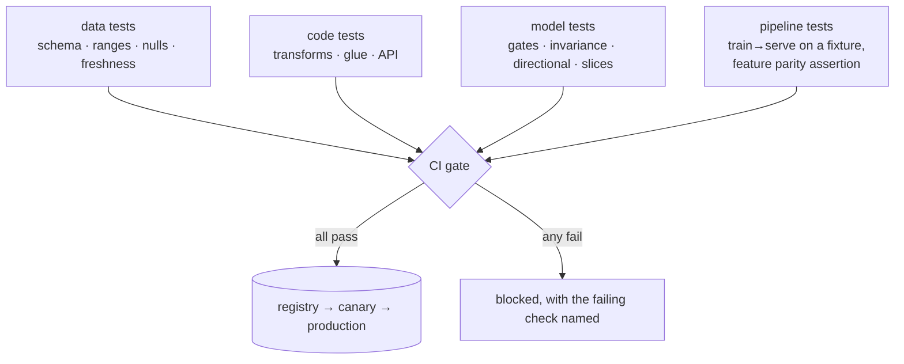

**In one line.** You cannot assert the output of a model, so you assert properties of it — and you test the data and the pipeline like ordinary software.

## The idea in plain words

A unit test asserts `f(2) == 4`. A model has no such guarantee, so ML testing splits into four layers.

**1. Data tests.** Schema, types, ranges, null rates, uniqueness of keys, referential integrity, freshness. These are ordinary assertions and they catch most real failures. Run them on every batch, before training and before serving.

**2. Code tests.** The feature transformations, the pipeline glue, the serving layer — all deterministic, all testable normally. A feature function is a pure function; test it like one.

**3. Model tests.** Not "is the output correct" but:
- **Quality gates** — metrics on a fixed held-out set, compared against the current production model, with a minimum bar.
- **Invariance tests** — changing something irrelevant must not change the prediction (a customer's name should not move a credit score).
- **Directional tests** — changing something relevant must move it the expected way (more income should not lower a creditworthiness score).
- **Minimum-functionality tests** — a small set of cases so obvious that failing them blocks release regardless of aggregate metrics.
- **Slice tests** — performance per segment, so an aggregate number cannot hide a group it fails.

**4. Pipeline tests.** Train-then-serve on a tiny fixture end to end; assert that training and serving produce the same features for the same input. That single test catches the most expensive class of ML bug.



## How it works

### Why ML QA is hard

Behaviour depends on **data and randomness**, not just code, and "correct" is statistical (good *enough*) rather than exact.

:::tip

**So testing must cover more than code** — the data feeding the model and the pipeline producing it, too.

:::

### The test pyramid

- **Unit** — One component in isolation. Many, fast, every commit.
- **Integration** — Components together — loader + model, API + DB.
- **System / e2e** — The whole pipeline as a user would. Few, slow.

#### Test-cost calculator

Set how many of each type; see the total run cost (unit=1, integration=10, e2e=100).

:::tip

**Worked.** 200 unit + 20 integration + 5 e2e = 900 units (fast, broad). Inverted (5/20/200) ≈ 20,205 — 22× slower. The pyramid is an economic argument.

:::

### Training, inference, behaviour

- **Training** — Does a step run and loss drop? Overfit a tiny batch? Reproducible with a fixed seed?
- **Inference** — Served output = trained output (no skew)? Right shapes/ranges? Acceptable latency?
- **Behavioural** — Invariances & expectations — not just aggregate accuracy.

### Model, data & pipeline quality

- **Model** — Right metric, fairness, robustness, calibration — sliced by segment.
- **Data** — Schema validation, missing/out-of-range checks, **drift** detection.
- **Pipeline** — Reproducible, versioned, monitored runs; regressions caught automatically.

### Key takeaways

- **1 · Harder in ML** — Data + randomness; "correct" is statistical.
- **2 · Pyramid** — Many unit, few e2e — cheapest feedback low down.
- **3 · Three fronts** — Model, data and pipeline quality together.

:::note

**The thread.** Assuring an ML system means testing more than code: keep the fast, precise feedback of a unit-heavy test pyramid, add training/inference/behavioural tests unique to ML, and treat model, data and pipeline quality as three fronts — because a model is only as trustworthy as the data and process behind it.

:::

## A real system that works this way

**The name-sensitivity finding** is the classic invariance failure: swapping a customer's name changes a risk score, because the model learned something from a name-derived feature it should never have used. No aggregate metric shows this; a targeted invariance test does, and it is often also a fairness finding.

**The slice that fails** is the other one: 94% accuracy overall, 61% on customers in one region because that segment is 2% of the training data. Ship it and the aggregate looks fine while a whole group gets a bad product.

## Code you can run

All four layers, written as tests you could paste into a CI job.

```python
import random, statistics
from collections import defaultdict

random.seed(11)

# --- the "model": a scoring function with a deliberate flaw ---------------
def credit_score(applicant):
    score = 0.35
    score += min(applicant["income"] / 200_000, 1.0) * 0.4
    score -= min(applicant["debt"] / 100_000, 1.0) * 0.3
    score += 0.1 if applicant["years_employed"] > 3 else 0.0
    # the flaw: a name-derived feature leaked in
    score += 0.05 if applicant["name"].lower().startswith(("a", "b", "c")) else 0.0
    return max(0.0, min(1.0, score))

BASE = {"name": "Dana", "income": 60_000, "debt": 12_000, "years_employed": 5}

# --- 1. data tests ------------------------------------------------------------
def test_data_contract(rows):
    failures = []
    required = {"name", "income", "debt", "years_employed"}
    for i, row in enumerate(rows):
        if missing := required - row.keys():
            failures.append(f"row {i}: missing {sorted(missing)}")
        if row.get("income", 0) < 0:
            failures.append(f"row {i}: negative income")
        if not isinstance(row.get("years_employed"), int):
            failures.append(f"row {i}: years_employed must be int")
    null_rate = sum(1 for r in rows if r.get("income") is None) / len(rows)
    if null_rate > 0.01:
        failures.append(f"income null rate {null_rate:.1%} above 1%")
    return failures

good = [dict(BASE) for _ in range(100)]
bad = good[:99] + [{"name": "X", "income": -5, "years_employed": "many", "debt": 0}]
print("data tests, clean batch :", test_data_contract(good) or "PASS")
print("data tests, broken batch:", test_data_contract(bad)[:2], "...")

# --- 2. invariance: irrelevant changes must not move the score ------------
def test_invariance_to_name():
    scores = {name: credit_score({**BASE, "name": name})
              for name in ["Dana", "Alice", "Zoe", "Bob"]}
    spread = max(scores.values()) - min(scores.values())
    return spread, scores

spread, scores = test_invariance_to_name()
print(f"\ninvariance to name: spread {spread:.3f} -> "
      f"{'FAIL (name leaks into the score)' if spread > 1e-9 else 'PASS'}")
print("   ", {k: round(v, 3) for k, v in scores.items()})

# --- 3. directional: relevant changes must move it the right way ----------
def test_direction_income():
    low = credit_score({**BASE, "income": 30_000})
    high = credit_score({**BASE, "income": 120_000})
    return high > low, low, high

ok, low, high = test_direction_income()
print(f"\ndirectional (income up -> score up): {'PASS' if ok else 'FAIL'} "
      f"({low:.3f} -> {high:.3f})")

# --- 4. minimum functionality: cases too obvious to fail -----------------
MFT = [
    ({**BASE, "income": 500_000, "debt": 0},      "high",  0.75),
    ({**BASE, "income": 15_000, "debt": 90_000},  "low",   0.35),
]
print("\nminimum functionality:")
for applicant, label, bar in MFT:
    score = credit_score(applicant)
    passed = score >= bar if label == "high" else score <= bar
    print(f"   {label:4} case -> {score:.3f}  {'PASS' if passed else 'FAIL'}")

# --- 5. slice metrics: the aggregate can hide a failing group ------------
def evaluate_slices(rows, labels, threshold=0.5):
    by_slice = defaultdict(lambda: [0, 0])
    for row, label in zip(rows, labels):
        predicted = credit_score(row) >= threshold
        bucket = by_slice[row["region"]]
        bucket[0] += int(predicted == label)
        bucket[1] += 1
    return {region: correct / total for region, (correct, total) in by_slice.items()}

rows, labels = [], []
for _ in range(1500):
    region = random.choices(["north", "south", "island"], weights=[60, 38, 2])[0]
    income = random.gauss(70_000 if region != "island" else 25_000, 20_000)
    row = {**BASE, "income": max(income, 1_000), "region": region,
           "debt": abs(random.gauss(20_000, 10_000))}
    rows.append(row); labels.append(row["income"] > 45_000)

slices = evaluate_slices(rows, labels)
overall = statistics.fmean(slices.values())
print(f"\nslice accuracy: " + ", ".join(f"{k} {v:.1%}" for k, v in slices.items()))
worst = min(slices, key=slices.get)
print(f"aggregate looks fine; worst slice is {worst} at {slices[worst]:.1%} "
      f"-> {'BLOCK release' if slices[worst] < 0.7 else 'ok'}")
```

## Designing with it

**A test suite that actually protects an ML system**

| Layer | Runs when | Blocks what |
| --- | --- | --- |
| Data contract | Every batch, before training and serving | Bad input reaching the model |
| Feature unit tests | Every commit | Transformation regressions |
| Feature parity (train vs serve) | Every commit | Training/serving skew |
| Quality gate vs production model | Every candidate model | Shipping a regression |
| Invariance and directional | Every candidate model | Learned nonsense, some fairness issues |
| Minimum functionality | Every candidate model | Obvious breakage the aggregate hides |
| Slice metrics | Every candidate model | A group being quietly failed |
| Smoke test after deploy | Every deploy | A broken artefact or wiring |

**Practical notes**

- **Fix the evaluation set.** A moving benchmark makes comparisons meaningless; version it like code.
- **Compare against production**, not against a fixed number. "Better than what we run today" is the decision the business actually makes.
- **Make model tests fast enough to run in CI** — a subsample plus a pinned seed.
- **Behavioural tests are cheap to write and rarely written.** A dozen invariance and directional cases per model catch problems that no amount of aggregate metric will.

## Where this stands in 2026

:::info Industry view

- Data validation in the pipeline (Great Expectations, Pandera, dbt tests) is now standard and catches the majority of production ML failures.
- **Behavioural testing** (the CheckList approach: invariance, directional, minimum functionality) is common in NLP and spreading to tabular ML.
- Slice-based evaluation is expected wherever fairness matters, and is increasingly a regulatory requirement rather than a best practice.
- Model quality gates in CI — candidate versus production on a fixed set — are the norm in mature teams; manual "looks good" is not.

:::

## Practice questions

<details>
<summary><strong>Q1.</strong> Why is testing an ML system harder than testing ordinary software?</summary>

Behaviour depends on data and randomness, not just code, and 'correct' is statistical (good enough accuracy) rather than exact — so you must test the data and pipeline too, not only the code.<br /><em>Session 12 · conceptual</em>

</details>

<details>
<summary><strong>Q2.</strong> Name the three layers of the test pyramid and their trade-off.</summary>

Unit (many, fast, isolated), integration (components together), system/end-to-end (few, slow, whole pipeline). Keep it unit-heavy because bugs are cheapest to catch low down.<br /><em>Session 12 · conceptual</em>

</details>

<details>
<summary><strong>Q3.</strong> With unit=1, integration=10, e2e=100 time-units, compare 200/20/5 vs 5/20/200.</summary>

200/20/5 = 200 + 200 + 500 = 900. 5/20/200 = 5 + 200 + 20000 = 20,205 — about 22× slower and worse isolation.<br /><em>Session 12 · numeric</em>

</details>

<details>
<summary><strong>Q4.</strong> Give one training test and one inference test specific to ML.</summary>

Training: a step runs and the loss drops, or the model overfits a tiny batch (learning works). Inference: the served model matches the trained model (no train/serve skew), with correct shapes and acceptable latency.<br /><em>Session 12 · conceptual</em>

</details>

<details>
<summary><strong>Q5.</strong> What are the three fronts of ML quality?</summary>

Model quality (metrics, fairness, robustness), data quality (schema, missing/range checks, drift), and pipeline quality (reproducible, versioned, monitored runs).<br /><em>Session 12 · conceptual</em>

</details>

## Further reading

- [Beyond Accuracy: Behavioral Testing of NLP Models with CheckList (Ribeiro et al.)](https://arxiv.org/abs/2005.04118) — invariance, directional and MFT tests.
- [The ML Test Score (Breck et al., Google)](https://research.google/pubs/pub46555/) — a rubric for how well-tested an ML system actually is.
- [Great Expectations](https://docs.greatexpectations.io/) and [Pandera](https://pandera.readthedocs.io/) — data contracts in code.
- [Source lecture: seml-s12-testing-qa](https://learning.bansal-ai.in/seml-s12-testing-qa/lecture.html) — the original interactive lecture these notes were built from.

- **[Made With ML](https://madewithml.com/)** `course`
  Goku Mohandas — Design, test, deploy and monitor ML systems — the practical MLOps path.
- **[Rules of Machine Learning](https://developers.google.com/machine-learning/guides/rules-of-ml)** `docs`
  Google — 43 rules for engineering dependable ML systems.
- **[Continuous Delivery for ML (CD4ML)](https://martinfowler.com/articles/cd4ml.html)** `docs`
  Sato, Wider & Windheuser — How CI/CD, testing and deployment apply to machine-learning systems.
