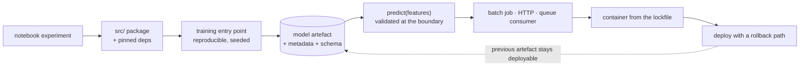

**In one line.** Productionising is not rewriting the model — it is giving the model an interface, a version, an environment and a way back.

## The idea in plain words

The gap between "the notebook gets 0.91 AUC" and "it serves traffic" is made of five concrete artefacts.

1. **A package.** The training and inference code lives in a `src/` package with pinned dependencies, importable from anywhere, installed rather than copied.
2. **A serialised model with metadata.** Not a bare pickle: the artefact records the training data version, the code commit, the metrics, the feature schema and the library versions it needs.
3. **An inference interface.** One function — `predict(features) -> prediction` — with validation at the boundary, plus whatever transport wraps it (batch job, HTTP, queue consumer).
4. **An environment.** A container built from the lockfile, so the thing that runs in production is the thing you tested.
5. **A rollback path.** The previous model artefact is still available and deployable in minutes.

The order matters: **build the thinnest possible end-to-end path first** with a trivial model, then improve the model inside a system that already works. The reverse — perfecting the model and productionising later — is how six-month projects fail to ship.



## How it works

### The 90% that isn't ML code

In Sculley et al. (NeurIPS 2015), the **ML code** box is tiny — dwarfed by configuration, data collection, feature extraction, serving, and monitoring.

#### The hidden-debt layers

Click each surrounding box to see what real-world work it represents — and how small the model itself is.

### What's missing from the notebook?

A 30-line notebook (read CSV → fit RandomForest → dump `model.pkl`) works — and is unshippable.

| Missing | Consequence |
| --- | --- |
| Schema validation | bad inputs → silent garbage |
| Error handling | crashes at 2am, no trace |
| Logging | impossible to debug in prod |
| Hardcoded paths | breaks on any other machine |
| Model versioning | which .pkl is in production? |
| Serving | nobody else can call it |

### Seven layers, notebook → service

Add the missing layers in order — each maps to a Sculley box.

#### Build it layer by layer

Step from the bare notebook through MLflow → FastAPI → Pydantic → logging → config → pytest, and watch the system fill out.

:::tip

**4 lines** add MLflow: `start_run()` + `log_params/metrics/model` — same training logic, now a versioned, tracked experiment.

:::

### The pipe-and-filter pipeline

The prediction path is four pure functions — each a stage, independently testable and swappable. Try sending a bad transaction through the validation stage.

#### Pydantic input contract

Enter a transaction. The validator enforces amount>0 and hour 0–23 (like Pydantic `Field` constraints). Watch a bad input get rejected with a field error before the model runs.

:::tip

**The pipeline:** validate_input → extract_features → run_model → format_response. Each pure, isolated, swappable.

:::

### Tests grouped by quality attribute

pytest classes named for the quality they defend turn abstract QAs into an automated gate.

| Test class | Checks |
| --- | --- |
| TestRobustness | schema rejects amount = −500 |
| TestReliability | all outputs well-formed |
| TestPerformance | latency &lt; 200 ms |
| TestMaintainability | each pipeline stage isolated |

:::note

**15 tests in ~2.6 s.** The quality attributes from Sessions 4–6 become runnable assertions — a quality gate, not a slogan.

:::

### Key takeaways

The model is 10%; the system is the other 90%.

- **1 · Sculley** — ML code is a tiny box among config, data, serving, monitoring.
- **2 · Seven layers** — MLflow, FastAPI, Pydantic, logging, config, pytest.
- **3 · QAs in code** — Pipe-and-filter + tests grouped by quality attribute.

:::note

**The thread.** A trained model is the easy part; turning it into a system means adding the surrounding layers Sculley identified. Starting from a 30-line notebook, MLflow versions it, FastAPI serves it, Pydantic guards its inputs, logging and config make it operable, and a pipe-and-filter pipeline with quality-attribute tests keeps it correct. That is software engineering for ML, made concrete.

:::

## A real system that works this way

**The pickle that would not load** is the classic productionisation failure: the model was saved with scikit-learn 1.3 and the serving image installs 1.5, so unpickling warns, silently changes behaviour, or fails outright. Recording library versions **in the artefact metadata** and building the serving image from the same lockfile removes it.

**The missing feature schema** is the other: the model expects 43 columns in a particular order and the service sends 42. A schema stored with the artefact and validated on load turns a silent accuracy collapse into a startup error.

## Code you can run

An artefact that carries everything needed to load it safely, and a loader that refuses when the environment does not match.

```python
import hashlib, json, platform, sys, tempfile
from dataclasses import asdict, dataclass, field
from datetime import datetime, timezone
from pathlib import Path

# --- a deliberately trivial "model" so the focus stays on the packaging ----
@dataclass
class LinearModel:
    weights: dict[str, float]
    bias: float
    threshold: float = 0.5

    def predict_proba(self, features: dict[str, float]) -> float:
        z = self.bias + sum(self.weights[k] * features[k] for k in self.weights)
        return 1 / (1 + 2.718281828 ** -z)

    def predict(self, features: dict[str, float]) -> bool:
        return self.predict_proba(features) >= self.threshold

# --- the metadata that makes an artefact loadable in six months ----------
@dataclass
class Artefact:
    model: dict
    feature_schema: dict[str, str]
    metrics: dict[str, float]
    training_data_version: str
    code_commit: str
    created_at: str
    python_version: str
    library_versions: dict[str, str]
    checksum: str = ""

def save(model: LinearModel, path: Path, *, schema, metrics, data_version, commit):
    payload = Artefact(
        model=asdict(model),
        feature_schema=schema,
        metrics=metrics,
        training_data_version=data_version,
        code_commit=commit,
        created_at=datetime.now(timezone.utc).isoformat(timespec="seconds"),
        python_version=platform.python_version(),
        library_versions={"stdlib-only": "n/a"},
    )
    body = json.dumps(asdict(payload), sort_keys=True)
    payload.checksum = hashlib.sha256(body.encode()).hexdigest()[:16]
    path.write_text(json.dumps(asdict(payload), indent=2))
    return payload

class ArtefactError(RuntimeError):
    pass

def load(path: Path, *, expected_features: set[str]) -> tuple[LinearModel, Artefact]:
    data = json.loads(path.read_text())
    stored_checksum = data.pop("checksum")
    body = json.dumps({**data, "checksum": ""}, sort_keys=True)
    recomputed = hashlib.sha256(body.encode()).hexdigest()[:16]
    if recomputed != stored_checksum:
        raise ArtefactError("checksum mismatch — the artefact was modified")

    schema_features = set(data["feature_schema"])
    if schema_features != expected_features:
        raise ArtefactError(
            f"feature mismatch: artefact has {sorted(schema_features)}, "
            f"service sends {sorted(expected_features)}")

    major_minor = ".".join(data["python_version"].split(".")[:2])
    running = ".".join(platform.python_version().split(".")[:2])
    if major_minor != running:
        print(f"  warning: trained on Python {major_minor}, running {running}")

    return LinearModel(**data["model"]), Artefact(**data, checksum=stored_checksum)

# --- exercise it -------------------------------------------------------------
work = Path(tempfile.mkdtemp())
path = work / "model-2026-09-18.json"

model = LinearModel(weights={"income_norm": 2.4, "debt_ratio": -3.1}, bias=-0.2)
meta = save(model, path,
            schema={"income_norm": "float", "debt_ratio": "float"},
            metrics={"auc": 0.883, "recall@p60": 0.861},
            data_version="orders-2026-09-17",
            commit="a1b2c3d")

print("artefact written:", path.name, f"({path.stat().st_size} bytes)")
print("metrics:", meta.metrics, "| data:", meta.training_data_version)

loaded, loaded_meta = load(path, expected_features={"income_norm", "debt_ratio"})
sample = {"income_norm": 0.7, "debt_ratio": 0.2}
print(f"prediction: p={loaded.predict_proba(sample):.3f} -> {loaded.predict(sample)}")

# the service was changed to send a different feature set
try:
    load(path, expected_features={"income_norm", "debt_ratio", "tenure"})
except ArtefactError as exc:
    print("\nblocked at load time:", exc)

# someone edited the file
tampered = json.loads(path.read_text())
tampered["model"]["bias"] = 5.0
path.write_text(json.dumps(tampered, indent=2))
try:
    load(path, expected_features={"income_norm", "debt_ratio"})
except ArtefactError as exc:
    print("blocked at load time:", exc)

print("\nfailing at load is the point: a schema drift or a tampered artefact")
print("must not become a silent accuracy problem in production.")
```

## Designing with it

**The productionisation checklist**

| Artefact | Minimum bar |
| --- | --- |
| Package | `pip install -e .`, no `sys.path` hacks, entry points defined |
| Training | One command, seeded, reproducible, logs its inputs |
| Model artefact | Versioned, checksummed, with schema, metrics and lineage |
| Inference | One validated function; transport is a thin wrapper |
| Environment | Container built from the lockfile; same image in CI and production |
| Rollback | Previous artefact deployable by changing one version pin |
| Smoke test | A known input produces a known output after every deploy |

**Serialisation choices**

| Format | Use when | Caution |
| --- | --- | --- |
| `joblib`/pickle | scikit-learn inside your own trust boundary | Version-fragile; never load untrusted files |
| ONNX | Cross-language or cross-runtime serving | Operator coverage varies |
| SavedModel / TorchScript | TensorFlow / PyTorch native serving | Large; pin the runtime |
| Plain JSON of parameters | Simple models | Only for models you can express as data |

**Do the thin slice first.** Constant model → pipeline → serving → monitoring → *then* the real model. A team that can deploy a stupid model on day three will deploy a good one in week three; a team that starts with the good model often deploys nothing.

## Where this stands in 2026

:::info Industry view

- **Model artefacts with lineage metadata** (data version, commit, metrics, schema) are standard; a bare pickle in blob storage is a known anti-pattern.
- Containers built from a lockfile are the norm, because environment drift between training and serving is a recurring incident cause.
- ONNX and dedicated inference runtimes are common when the training and serving stacks differ.
- The "thin end-to-end slice first" approach is the single most reliable predictor of a project reaching production.

:::

## Practice questions

<details>
<summary><strong>Q1.</strong> What is Sculley et al.'s (2015) key point about ML code in real systems?</summary>

Only a small fraction of a real ML system is the **ML code**; it is surrounded by far larger boxes — configuration, data collection, feature extraction, serving, monitoring. The model is the easy ~10%; the engineering around it is the 90% that decides production success.<br /><em>Webinar 1 · conceptual</em>

</details>

<details>
<summary><strong>Q2.</strong> List four things a 30-line notebook lacks for production.</summary>

Any four of: schema validation (bad inputs → silent garbage), error handling, logging, hardcoded paths (no config), model versioning (‘which .pkl is live?’), and serving (nobody can call it).<br /><em>Webinar 1 · conceptual</em>

</details>

<details>
<summary><strong>Q3.</strong> What do the four MLflow lines add to identical training code?</summary>

Wrapping the fit in `mlflow.start_run()` with `log_params`, `log_metrics`, `log_model` gives a named experiment, recorded hyper-parameters, tracked metrics, and a versioned model artifact — the training logic is unchanged; only the instrumentation.<br /><em>Webinar 1 · applied</em>

</details>

<details>
<summary><strong>Q4.</strong> What does Pydantic do here? Give an input it rejects.</summary>

It is the **input contract**: `amount: float = Field(..., gt=0)`, `hour_of_day: int = Field(..., ge=0, le=23)`. Sending `amount:-500, hour_of_day:99` is rejected with field-level errors (422) before the model runs — bad inputs can't become silent garbage.<br /><em>Webinar 1 · applied</em>

</details>

<details>
<summary><strong>Q5.</strong> Describe the pipe-and-filter prediction pipeline and why pure functions help.</summary>

`validate_input → extract_features → run_model → format_response` — four pure functions. Each stage is independently testable and swappable without touching the others (e.g. replace the feature extractor or model). This is the pipe-and-filter pattern in Python.<br /><em>Webinar 1 · conceptual</em>

</details>

<details>
<summary><strong>Q6.</strong> How are the pytest tests organised, and what does that achieve?</summary>

By **quality attribute**: `TestRobustness` (schema rejects −500), `TestReliability` (well-formed outputs), `TestPerformance` (latency &lt; 200 ms), `TestMaintainability` (isolated stages). It turns abstract quality attributes into an automated, runnable gate.<br /><em>Webinar 1 · conceptual</em>

</details>

## Further reading

- [MLflow Models](https://mlflow.org/docs/latest/models.html) — artefact packaging with environment and signature metadata.
- [ONNX](https://onnx.ai/) — portable model format across frameworks and runtimes.
- [Google: MLOps continuous delivery](https://cloud.google.com/architecture/mlops-continuous-delivery-and-automation-pipelines-in-machine-learning) — the pipeline this note describes.
- [Source lecture: seml-w1-ml-system](https://learning.bansal-ai.in/seml-w1-ml-system/lecture.html) — the original interactive lecture these notes were built from.

- **[Machine Learning in Production — the whole book](https://mlip-cmu.github.io/book/)** `book`
  Kaestner, CMU (MIT Press, open access) — The single best free reference for taking a notebook model to a production system.
- **[MLiP lecture recordings (full course)](https://www.youtube.com/playlist?list=PLDS2JMJnJzdmubSKnanmIwzr08cionWm_)** `▶ video`
  CMU MLiP lecture recordings — Start with the motivating talk on why you engineer the whole system around the model.
