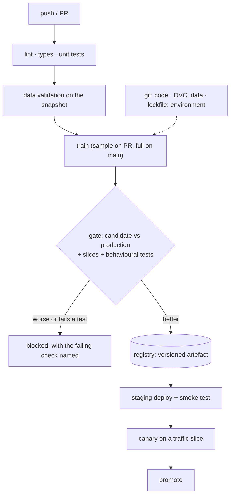

**In one line.** Reproducibility needs three versions pinned together — code, data and environment — and CI is what proves they still agree.

## The idea in plain words

"It worked last month" is only meaningful if you can reconstruct **code + data + environment** exactly. Git handles the first, a lockfile handles the third, and the second needs its own tool because large datasets do not belong in git.

**DVC** (and equivalents like LakeFS or git-lfs for smaller data) stores a small pointer file in git and the bytes in object storage. `dvc.yaml` then declares the pipeline — stages, dependencies, outputs — so `dvc repro` re-runs only what actually changed.

The CI pipeline for an ML project has more stages than a web app:

1. Lint, type-check, unit tests (fast, on every push).
2. **Data validation** on the current snapshot.
3. Training on a **sample** for pull requests; full training on merge or on a schedule.
4. **Evaluation gate** — the candidate versus the production model on a fixed set, plus slice and behavioural tests.
5. Register the artefact; deploy to staging; smoke test; canary; promote.

The discipline that makes this work: **the gate is automatic and blocking**. A model that fails the gate does not ship, no matter who wants it to.



## How it works

### What is a CI tool?

A platform that automatically builds, tests and publishes your software on every change — a **build server** plus **runners** that execute the work, in parallel.

:::note

**The tireless teammate.** Every push, CI checks out the latest code, builds it, runs all tests, and reports pass/fail immediately — killing "works on my machine".

:::

### Ten CI best practices (Fowler)

Integrate early, integrate often, automate the verification.

| # | Practice |
| --- | --- |
| 1–2 | single repo · automate the build (one command) |
| 3–4 | self-testing build · everyone commits daily |
| 5–6 | every commit is built · bug-fix ships a test |
| 7–8 | keep the build fast · test in a prod clone |
| 9–10 | everyone sees results · automate deployment |

### GitHub Actions

GitHub's native CI/CD: a YAML **workflow** in `.github/workflows/`, triggered by events, running **jobs** of **steps** on a **runner**.

#### Run the ci.yml pipeline

Step through a push triggering the fraud-demo workflow: checkout → setup-python → install → generate data → train → pytest. Then see the quality gate fail and pass.

:::tip

**Quality gate live:** set the latency SLA to 1 ms → pytest fails (red); revert to 200 ms → green. The pipeline's red/green *is* the quality attribute enforced.

:::

### Git in one minute

The everyday loop: `git pull` → edit → `git add & commit` → `git push` (which triggers CI). Work on feature branches; **main** is the protected branch Actions watches.

:::note

**Commit messages with a type:** `feat:`, `fix:`, `ci:`, `data:`, `test:` — they tell the team what changed without opening the code.

:::

### DVC — data version control

DVC brings Git-style versioning to **data and models**: the big file stays out of Git; only a small `.dvc` **fingerprint** (md5) is committed.

#### Git vs DVC vs MLflow

Click each artifact to see where it belongs — code in Git, big files in DVC, experiments in MLflow — and why you need all three.

:::tip

**Full reproducibility:** `git checkout <commit>` + `dvc pull` restores the exact code *and* data of any past result. Git + DVC + MLflow = code + data + experiment.

:::

### Key takeaways

Automate the gate; version everything.

- **1 · CI** — Build + test on every push; Fowler's 10 practices.
- **2 · Actions** — YAML workflow → jobs → steps on a runner, triggered by events.
- **3 · DVC** — Fingerprint large files; Git + DVC + MLflow = reproducibility.

:::note

**The thread.** Webinar 1 built a quality gate (pytest by quality attribute). GitHub Actions runs that gate automatically on every commit, in a clone of production, and shows everyone the result — Fowler's practices in action. Git versions the code, DVC versions the large data and models by committing only their fingerprints, and MLflow records the experiments. Together they make any past result exactly reproducible — the engineering backbone under a production ML system.

:::

## A real system that works this way

**The reproducibility test that fails** is the useful one: check out last month's commit, `dvc pull` the data it points at, rebuild the environment from the lockfile, retrain, and compare metrics. If the number does not come back, one of the three versions was not really pinned — and now you know which.

**The gate that saved the quarter**: a candidate model with better overall AUC but 9 points worse on the largest customer segment. The slice test blocked it automatically; a human reviewing an aggregate dashboard would very likely have approved it.

## Code you can run

A reproducibility check in miniature: the same inputs must produce the same model hash.

```python
import hashlib, json, random, subprocess, tempfile
from pathlib import Path

work = Path(tempfile.mkdtemp())

# --- "data versioning": content-addressed snapshots ------------------------
def write_dataset(rows, path: Path):
    body = "\n".join(json.dumps(r, sort_keys=True) for r in rows)
    path.write_text(body)
    return hashlib.sha256(body.encode()).hexdigest()[:12]

def make_rows(n, seed):
    rng = random.Random(seed)
    return [{"x": round(rng.random(), 4), "y": int(rng.random() > 0.5)} for _ in range(n)]

v1_path, v2_path = work / "data-v1.jsonl", work / "data-v2.jsonl"
v1 = write_dataset(make_rows(500, seed=1), v1_path)
v2 = write_dataset(make_rows(500, seed=2), v2_path)
print(f"dataset v1 {v1}   dataset v2 {v2}   (content-addressed, like a DVC pointer)")

# --- training: deterministic given (data, code, seed) ---------------------
CODE_VERSION = "train.py@a1b2c3d"

def train(path: Path, seed: int = 0):
    rows = [json.loads(line) for line in path.read_text().splitlines()]
    rng = random.Random(seed)
    weight = sum(r["x"] * (1 if r["y"] else -1) for r in rows) / len(rows)
    bias = rng.random() * 0                      # seeded: no hidden randomness
    model = {"weight": round(weight, 6), "bias": bias}
    fingerprint = hashlib.sha256(
        json.dumps({"model": model, "code": CODE_VERSION}, sort_keys=True).encode()
    ).hexdigest()[:12]
    return model, fingerprint

model_a, hash_a = train(v1_path)
model_b, hash_b = train(v1_path)
model_c, hash_c = train(v2_path)

print(f"\nsame data, same code -> {hash_a} / {hash_b}  reproducible: {hash_a == hash_b}")
print(f"different data       -> {hash_c}              differs: {hash_a != hash_c}")

# --- the evaluation gate ------------------------------------------------------
def evaluate(model, rows):
    correct = sum((row["x"] * model["weight"] + model["bias"] > 0) == bool(row["y"])
                  for row in rows)
    return correct / len(rows)

holdout = make_rows(400, seed=99)
production_metric = 0.52
candidate_metric = evaluate(model_c, holdout)

SLICES = {"segment_a": holdout[:200], "segment_b": holdout[200:]}
slice_metrics = {name: evaluate(model_c, rows) for name, rows in SLICES.items()}

def gate(candidate, production, slices, min_improvement=0.005, max_slice_drop=0.10):
    reasons = []
    if candidate < production + min_improvement:
        reasons.append(f"no improvement: {candidate:.3f} vs {production:.3f}")
    for name, value in slices.items():
        if value < candidate - max_slice_drop:
            reasons.append(f"slice {name} at {value:.3f}, {candidate - value:.3f} below overall")
    return (not reasons), reasons

passed, reasons = gate(candidate_metric, production_metric, slice_metrics)
print(f"\ncandidate {candidate_metric:.3f} vs production {production_metric:.3f}")
print("slices:", {k: round(v, 3) for k, v in slice_metrics.items()})
print("GATE:", "PASS -> register and deploy" if passed else f"BLOCK -> {reasons}")

# --- what the pipeline definition looks like -------------------------------
print("\ndvc.yaml equivalent:")
print(json.dumps({
    "stages": {
        "validate": {"cmd": "python -m pipeline.validate", "deps": ["data/raw"]},
        "train": {"cmd": "python -m pipeline.train",
                  "deps": ["data/processed", "src/pipeline/train.py"],
                  "outs": ["models/model.json"],
                  "metrics": ["metrics.json"]},
        "evaluate": {"cmd": "python -m pipeline.evaluate",
                     "deps": ["models/model.json", "data/holdout"]},
    }
}, indent=2))
```

## Designing with it

**Pin three things, always**

| What | How | Failure if you skip it |
| --- | --- | --- |
| Code | Git commit | "Which version produced this?" |
| Data | DVC/LakeFS pointer, or an immutable snapshot path | Metrics that cannot be reproduced |
| Environment | Lockfile + container digest | Works locally, differs in production |

**CI stage budget**

| Stage | Target | Runs on |
| --- | --- | --- |
| Lint, types, unit tests | < 3 min | Every push |
| Data validation | < 5 min | Every push |
| Sample training | < 10 min | Pull requests |
| Full training | Hours is fine | Merge to main, or nightly |
| Evaluation gate | < 15 min | Every candidate |
| Deploy + smoke | < 5 min | After the gate |

**Rules**

- **The gate blocks.** If it can be overridden casually, it is documentation, not a control.
- **Store the evaluation report as a build artefact** — the number and the context, not just pass/fail.
- **Canary before full rollout**, comparing live metrics between the two model versions.
- **Retrain on a schedule you chose deliberately**, not "when someone remembers"; and make rollback a one-line version change.

## Where this stands in 2026

:::info Industry view

- **DVC, LakeFS and similar data-versioning tools are standard** wherever reproducibility is required; datasets never live in git directly.
- Automated evaluation gates comparing candidate against production are the norm in mature teams and the main defence against silent regressions.
- Nightly or weekly scheduled retraining with a gate is far more common — and safer — than fully continuous retraining.
- Build artefacts now routinely include the evaluation report and a model card, because auditors and enterprise customers ask for them.

:::

## Practice questions

<details>
<summary><strong>Q1.</strong> What is a CI tool, and what two parts does it have?</summary>

A platform that automatically **builds, tests and publishes** software on every change, integrated with version control. It has a build server (UI, job storage, starts runs) and one or more runners / build agents that execute steps, in parallel.<br /><em>Webinar 2 · conceptual</em>

</details>

<details>
<summary><strong>Q2.</strong> Name five of Fowler's CI best practices.</summary>

Any five of: single code repository; automate the build (one command); self-testing build; everyone commits daily; every commit is built; bug-fix ships a test; keep the build fast; test in a clone of production; everyone sees the latest result; automate deployment.<br /><em>Webinar 2 · conceptual</em>

</details>

<details>
<summary><strong>Q3.</strong> Define workflow, job, step, action, runner and event in GitHub Actions.</summary>

**Event** (push/PR/schedule/webhook) triggers a **workflow** (YAML in `.github/workflows/`) made of **jobs**; each job runs on a **runner** (a GitHub-hosted VM) and contains **steps**; a step is a shell command or an **action** (reusable code with inputs/outputs).<br /><em>Webinar 2 · conceptual</em>

</details>

<details>
<summary><strong>Q4.</strong> Walk through the five steps of the fraud-demo ci.yml.</summary>

`on: push` to `main` triggers it; `runs-on: ubuntu-latest` mirrors prod; then: checkout → setup-python 3.11 → pip install → generate data → train → pytest. The workflow file is versioned in the repo with the code it tests.<br /><em>Webinar 2 · applied</em>

</details>

<details>
<summary><strong>Q5.</strong> What is the everyday Git loop, and the .gitignore rule of thumb?</summary>

`git pull` → edit → `git add & commit` (typed message: feat/fix/ci/data/test) → `git push` (triggers CI). Keep out of Git anything that can be regenerated, is large, or holds secrets — venv/, __pycache__/, mlruns/, .env, and DVC-managed data/model.<br /><em>Webinar 2 · applied</em>

</details>

<details>
<summary><strong>Q6.</strong> What is DVC, and what does the .dvc fingerprint enable?</summary>

DVC brings Git-style versioning to **data and models**: the large file stays out of Git (in remote storage); only a small `.dvc` file with an **md5 fingerprint** is committed. `git checkout <commit>` + `dvc pull` restores the exact data that produced a past result.<br /><em>Webinar 2 · conceptual</em>

</details>

<details>
<summary><strong>Q7.</strong> MLflow already versions models — why also use DVC?</summary>

MLflow tracks **experiments, params, metrics and the model registry** — but not the **data** that fed them. DVC versions the datasets and model files. Git + DVC + MLflow = code version + data version + experiment record = full reproducibility.<br /><em>Webinar 2 · exam Q&A</em>

</details>

## Further reading

- [DVC documentation](https://dvc.org/doc) — data versioning and pipeline stages.
- [CML (continuous machine learning)](https://cml.dev/doc) — posting metric comparisons into pull requests.
- [GitHub Actions for ML](https://docs.github.com/en/actions) — matrices, caching, artefacts and scheduled runs.
- [Source lecture: seml-w2-cicd-dvc](https://learning.bansal-ai.in/seml-w2-cicd-dvc/lecture.html) — the original interactive lecture these notes were built from.

- **[Machine Learning in Production — Automating the Pipeline / MLOps](https://mlip-cmu.github.io/book/)** `book`
  Kaestner, CMU (MIT Press, open access) — Versioning, continuous integration and automated pipelines for ML — the concepts behind GitHub Actions + DVC.
