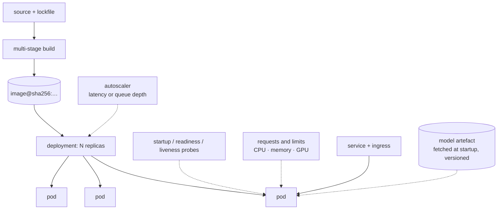

**In one line.** A container fixes the environment; an orchestrator decides how many copies run, where, and what happens when one dies.

## The idea in plain words

A **container image** is a filesystem plus a command, built in layers and identified by a digest. Its value for ML is exact environment reproduction: the CUDA version, the system libraries and the Python packages that the model was tested against.

Build rules that matter:

- **Multi-stage builds** — resolve and install dependencies in a builder stage, copy only the runtime environment into a slim final image. ML images are enormous by default; this is what keeps them shippable.
- **Layer order follows change frequency** — dependencies first (rarely change, cached), application code last.
- **Run as a non-root user**, pin base images by digest, and keep the model artefact out of the image if it is large and versioned separately.

**Orchestration** (Kubernetes, or a managed equivalent) then handles running N copies, restarting failures, rolling out new versions and routing traffic. The concepts you actually need:

- **Requests and limits** — memory limits are a hard kill, so an under-set limit is an OOMKill loop; ML processes are memory-hungry and startup-heavy.
- **Probes** — *liveness* restarts a wedged process, *readiness* controls whether traffic is routed. A model that takes 40 seconds to load needs a startup probe, or it will be killed mid-load forever.
- **Autoscaling** — on a queue-depth or latency signal, not just CPU; GPU inference scales differently from stateless web code.
- **Rollouts** — rolling update, blue/green, or canary, with a rollback that is one command.



## How it works

### "Works on my machine" isn't enough

The hard parts of deployment aren't the model — they're dependencies, environment differences, scaling under load, and updating without downtime.

:::tip

**Two standard answers:** containers (run the same everywhere) and orchestration (run many reliably).

:::

### Package once, run anywhere

A **container** bundles your app *with* its dependencies into one isolated unit. It shares the host kernel (unlike a VM), so it's lightweight and starts in seconds.

- **Dockerfile** — Recipe: FROM base, COPY code, RUN installs, CMD to launch.
- **Image** — The built, immutable package (layers). Stored in a registry.
- **Container** — A running instance of an image.

:::note

**For ML.** The image holds Python, your libraries, the model file and serving code — so anyone who pulls it gets exactly your environment, and training/serving can't drift apart.

:::

### Containers at scale

Kubernetes is a **declarative orchestrator**: describe the desired state, and it continuously makes reality match.

#### Self-healing demo

Set the desired replicas, then "kill" a pod — watch Kubernetes restore the count.

- **Pod / Deployment** — A Deployment declares N replicas; a ReplicaSet keeps exactly N pods alive, replacing any that die.
- **Service / rollout** — A Service is a stable endpoint in front of the pods; rolling updates + autoscaling handle new versions and load.

### The deployment pipeline

Build the image in CI, push to a registry, apply the K8s manifests — ideally via **CI/CD** so a merge triggers build → test → deploy automatically.

:::tip

**For ML,** add model versioning, a **canary or shadow** rollout to compare the new model on real traffic, and monitoring so a bad model rolls back fast.

:::

### Key takeaways

- **1 · Docker** — Dockerfile → image → container; same environment everywhere.
- **2 · Kubernetes** — Declarative; deployments keep N pods; self-healing; services; rolling updates.
- **3 · CI/CD** — Automate build → test → deploy; canary + monitoring for ML.

:::note

**The thread.** Deployment turns a model into a dependable service. Docker fixes the environment so it runs the same everywhere; Kubernetes maintains the desired number of healthy pods behind a stable endpoint and updates them without downtime; and a CI/CD pipeline makes the whole path from commit to production automatic and safe to reverse.

:::

## A real system that works this way

**The OOMKill loop** is the most common ML-on-Kubernetes incident: the container works locally, gets a 2 GiB memory limit, and the model plus a batch of requests needs 3 GiB. The pod is killed, restarts, loads the model again, and dies again — a crash loop that looks like an application bug and is a limits bug.

**The forty-second model load** is the second: a liveness probe with a 10-second threshold kills the pod before the model finishes loading, forever. A startup probe with a generous failure threshold is the fix, and it is a one-line change that teams lose a day to.

## Code you can run

A Dockerfile and a deployment manifest are configuration — so review them the way you would review code.

```python
"""Generate and sanity-check the deployment configuration for an ML service."""
import json, textwrap

DOCKERFILE = textwrap.dedent("""
    # --- builder: resolve dependencies once, cached by the lockfile ---------
    FROM python:3.12-slim AS builder
    COPY --from=ghcr.io/astral-sh/uv:latest /uv /usr/local/bin/uv
    WORKDIR /app
    COPY pyproject.toml uv.lock ./          # copied first: this layer caches
    RUN uv sync --frozen --no-dev --no-install-project
    COPY src/ src/                          # code changes do not rebuild deps
    RUN uv sync --frozen --no-dev

    # --- runtime: slim, non-root, no build tools ---------------------------
    FROM python:3.12-slim AS runtime
    RUN useradd --create-home --uid 10001 app
    WORKDIR /app
    COPY --from=builder --chown=app:app /app/.venv /app/.venv
    COPY --chown=app:app src/ src/
    ENV PATH="/app/.venv/bin:$PATH" PYTHONUNBUFFERED=1
    USER app
    EXPOSE 8000
    CMD ["uvicorn", "service.api:app", "--host", "0.0.0.0", "--port", "8000"]
""").strip()

DEPLOYMENT = {
    "apiVersion": "apps/v1",
    "kind": "Deployment",
    "metadata": {"name": "scorer"},
    "spec": {
        "replicas": 3,
        "selector": {"matchLabels": {"app": "scorer"}},
        "template": {
            "metadata": {"labels": {"app": "scorer"}},
            "spec": {
                "containers": [{
                    "name": "scorer",
                    "image": "registry.example.com/scorer@sha256:2f9c…",  # digest, not :latest
                    "resources": {
                        "requests": {"cpu": "500m", "memory": "2Gi"},
                        "limits": {"cpu": "2", "memory": "4Gi"},       # model + batch headroom
                    },
                    # the model takes ~40s to load: startup probe protects it
                    "startupProbe": {"httpGet": {"path": "/health", "port": 8000},
                                     "failureThreshold": 30, "periodSeconds": 5},
                    "readinessProbe": {"httpGet": {"path": "/ready", "port": 8000},
                                       "periodSeconds": 10},
                    "livenessProbe": {"httpGet": {"path": "/health", "port": 8000},
                                      "periodSeconds": 20, "failureThreshold": 3},
                    "env": [{"name": "MODEL_VERSION", "value": "fraud-2026-09-18"}],
                }],
                "securityContext": {"runAsNonRoot": True, "runAsUser": 10001},
            },
        },
    },
}

# --- a config review, as a function -----------------------------------------
def review(dockerfile: str, deployment: dict) -> list[str]:
    problems = []
    if "USER " not in dockerfile:
        problems.append("Dockerfile: runs as root")
    if "AS builder" not in dockerfile:
        problems.append("Dockerfile: single stage — build tools ship to production")
    if dockerfile.index("COPY pyproject.toml") > dockerfile.index("COPY src/"):
        problems.append("Dockerfile: code copied before dependencies — cache is wasted")

    container = deployment["spec"]["template"]["spec"]["containers"][0]
    if ":latest" in container["image"]:
        problems.append("deployment: :latest tag — not reproducible")
    limits = container.get("resources", {}).get("limits", {})
    requests = container.get("resources", {}).get("requests", {})
    if not limits or not requests:
        problems.append("deployment: missing resource requests/limits")
    else:
        req_mem = float(requests["memory"].rstrip("Gi"))
        lim_mem = float(limits["memory"].rstrip("Gi"))
        if lim_mem < req_mem * 1.5:
            problems.append("deployment: little memory headroom above the request")
    if "startupProbe" not in container:
        problems.append("deployment: no startup probe — slow model load will be killed")
    if "livenessProbe" in container and "readinessProbe" not in container:
        problems.append("deployment: liveness without readiness — traffic hits a loading pod")
    if not deployment["spec"]["template"]["spec"].get("securityContext", {}).get("runAsNonRoot"):
        problems.append("deployment: not pinned to a non-root user")
    return problems

print("=== good configuration ===")
print(review(DOCKERFILE, DEPLOYMENT) or "no problems found")

# --- the version everyone writes first --------------------------------------
BAD_DOCKERFILE = textwrap.dedent("""
    FROM python:3.12
    WORKDIR /app
    COPY src/ src/
    COPY pyproject.toml uv.lock ./
    RUN pip install -r requirements.txt
    CMD ["python", "-m", "service"]
""").strip()

BAD_DEPLOYMENT = json.loads(json.dumps(DEPLOYMENT))
bad_container = BAD_DEPLOYMENT["spec"]["template"]["spec"]["containers"][0]
bad_container["image"] = "registry.example.com/scorer:latest"
bad_container.pop("startupProbe")
bad_container["resources"] = {"requests": {"cpu": "500m", "memory": "2Gi"},
                              "limits": {"cpu": "2", "memory": "2Gi"}}
BAD_DEPLOYMENT["spec"]["template"]["spec"].pop("securityContext")

print("\n=== the version everyone writes first ===")
for problem in review(BAD_DOCKERFILE, BAD_DEPLOYMENT):
    print("  -", problem)
```

## Designing with it

**Sizing and probes for ML workloads**

| Setting | Guidance |
| --- | --- |
| Memory limit | Model size + batch working set + 50% headroom. Too low is an OOMKill loop |
| CPU request | Enough for steady state; bursts come from the limit |
| Startup probe | `failureThreshold × periodSeconds` > worst-case model load time |
| Readiness | Fails while loading or when a dependency is down — stops traffic without restarting |
| Liveness | Only for genuinely wedged processes; too aggressive causes restart storms |
| Replicas | At least 2 for availability; scale on latency or queue depth, not CPU alone |
| GPU | Requested as a whole device; plan for bin-packing and cold starts |

**Image discipline**

- Pin base images **by digest**; `:latest` is not reproducible.
- Keep large model artefacts **out of the image** — fetch at startup by version, so the image is reusable and small.
- Scan images for CVEs in CI; ML base images accumulate them quickly.
- Prefer a **slim** runtime; multi-gigabyte images slow every rollout and autoscale event.

**Rollout strategy:** rolling update for stateless scorers; blue/green when the model change is risky and you want an instant switch back; canary with live metric comparison when you can measure quality quickly. All three need the previous version still deployable.

## Where this stands in 2026

:::info Industry view

- Kubernetes is the default substrate for model serving, usually with a specialised layer (KServe, Ray Serve, Seldon) rather than raw deployments.
- **OOMKills and probe misconfiguration are the two most common ML-on-Kubernetes incidents** — both are configuration, not code.
- Fetching model artefacts at startup by version (rather than baking them into the image) is the prevailing pattern for large models.
- GPU scheduling, bin-packing and cold-start time now drive real cost decisions for inference-heavy services.

:::

## Practice questions

<details>
<summary><strong>Q1.</strong> What does a container package, and how does it differ from a VM?</summary>

A container bundles the application together with its dependencies into one isolated unit that runs the same anywhere. Unlike a VM it shares the host OS kernel, so it's lightweight and starts in seconds.<br /><em>Session 13 · conceptual</em>

</details>

<details>
<summary><strong>Q2.</strong> Distinguish Dockerfile, image and container.</summary>

Dockerfile is the recipe (FROM, COPY, RUN, CMD); image is the built immutable package of layers; container is a running instance of an image.<br /><em>Session 13 · conceptual</em>

</details>

<details>
<summary><strong>Q3.</strong> What does a Kubernetes Deployment do, and what is self-healing?</summary>

A Deployment declares N replicas of a pod; a ReplicaSet keeps exactly N alive. Self-healing: if a pod dies, K8s automatically starts a replacement to restore the desired count.<br /><em>Session 13 · conceptual</em>

</details>

<details>
<summary><strong>Q4.</strong> A Deployment wants 3 replicas and 1 pod dies. What happens, and how does autoscaling react to load?</summary>

The ReplicaSet sees 2 ≠ 3 and starts 1 new pod — back to 3, no human action. Under load a horizontal autoscaler (e.g. target ~70% CPU) adds pods (3→6), then removes them when traffic falls.<br /><em>Session 13 · numeric</em>

</details>

<details>
<summary><strong>Q5.</strong> What is a Service, and what does a rolling update give you?</summary>

A Service is a stable network endpoint / load balancer in front of the pods, so callers don't care which pod answers. A rolling update replaces pods gradually for zero-downtime deploys, with automatic rollback if the new version is unhealthy.<br /><em>Session 13 · conceptual</em>

</details>

## Further reading

- [Docker: build best practices](https://docs.docker.com/build/building/best-practices/) — layer caching, multi-stage, slim images.
- [Kubernetes: configure liveness, readiness and startup probes](https://kubernetes.io/docs/tasks/configure-pod-container/configure-liveness-readiness-startup-probes/) — the exact semantics.
- [KServe](https://kserve.github.io/website/) — model serving as a Kubernetes-native abstraction.
- [Source lecture: seml-s13-deployment](https://learning.bansal-ai.in/seml-s13-deployment/lecture.html) — the original interactive lecture these notes were built from.

- **[Made With ML](https://madewithml.com/)** `course`
  Goku Mohandas — Design, test, deploy and monitor ML systems — the practical MLOps path.
- **[Rules of Machine Learning](https://developers.google.com/machine-learning/guides/rules-of-ml)** `docs`
  Google — 43 rules for engineering dependable ML systems.
- **[Continuous Delivery for ML (CD4ML)](https://martinfowler.com/articles/cd4ml.html)** `docs`
  Sato, Wider & Windheuser — How CI/CD, testing and deployment apply to machine-learning systems.
