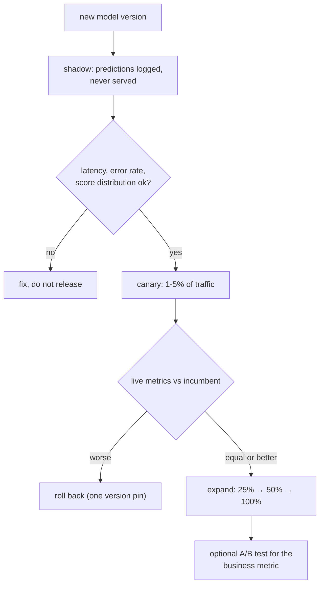

**In one line.** Releasing a model is a measurement exercise: send it a little traffic, compare it with the incumbent, and keep the way back open.

## The idea in plain words

Deploying a model is not the same as releasing it. The strategies, in increasing order of risk:

- **Shadow** — the new model sees real traffic and its predictions are logged but never used. Zero user risk; validates latency, error rate and prediction distribution against reality.
- **Canary** — a small traffic slice (1–5%) gets the new model. Compare live metrics; expand or roll back.
- **Blue/green** — both versions fully deployed, traffic switched at once. Instant rollback, double the resources.
- **A/B test** — a deliberate experiment with randomised assignment and a business metric, run long enough to be significant. This is the only one that answers "is it actually better for users".

Underneath, an inference service has three levers on latency and cost:

- **Batching** — group requests over a few milliseconds and run one forward pass. Dramatic throughput gains on GPU, at a small latency cost.
- **Caching** — identical or near-identical inputs are common; a cache in front of the model is often the cheapest win available.
- **Model size** — quantisation and distillation trade a little accuracy for a lot of latency and cost.

Every one of these needs the **prediction log** to evaluate, which is why logging comes before releasing.



## How it works

### The model inference function

Deployment turns a fixed trained model into live predictions: encode raw input to a feature vector, apply f(), emit the label.

:::tip

**Golden rule.** The feature-encoding code at inference must be identical to training — factor it into a shared library so train and serve can't drift.

:::

### Four designs for serving a model

- **Library** — Embed in-process, local call. Lowest latency; coupled to host.
- **Service (REST)** — Dedicated server, replicated in the cloud. Scalable, language-agnostic.
- **Batch** — Score huge datasets offline at once. Move the model to the data.
- **Cached** — Precompute/lookup when inputs repeat and inference is costly.

:::tip

**Worked.** 20 ms/request → 50 QPS per replica → 10 replicas for 500 QPS. Cache 90% @1ms + 10% @50ms → avg 5.9 ms.

:::

### Zero-downtime deployment

- **Basic / Ramped** — Replace in place, or update instances gradually.
- **Blue/Green** — Two identical envs; flip all traffic after testing. Easy rollback, 2× cost.
- **Canary** — Release to a small subset first, then full rollout. Limits blast radius.
- **MLOps / LLMOps / AgentOps** — Predictive · generative (prompt/RAG) · autonomous agents.

### Metrics by Ops type

- **MLOps** — Quality: accuracy, precision, recall, F1, ROC-AUC, RMSE. Ops: latency, throughput, data/model drift.
- **LLMOps** — Quality: BLEU, ROUGE, BERTScore, hallucination rate. Ops: token latency, cost/tokens, response time.
- **AgentOps** — Quality: task-success & goal-completion rate. Ops: end-to-end latency, agent utilization.

:::note

**MLOps simulation.** The Pima diabetes simulator shows the full loop: serve the model → inputs drift from the training distribution → monitoring detects the accuracy drop → an automated retraining pipeline fires. Deploy → monitor → retrain is what makes it an *operated* system.

:::

### Key takeaways

- **1 · Inference** — f(input, model); shared encoding.
- **2 · Serve** — Library / service / batch / cache.
- **3 · Rollout** — Basic / Ramped / Blue-Green / Canary.

:::note

**The thread.** Deployment is where ML meets production engineering: wrap the model in a reliable inference function, choose a serving design that fits your latency and scale, roll out without downtime, and operate it with the right Ops discipline.

:::

## A real system that works this way

**Shadow mode catches what offline evaluation cannot.** A model with better offline metrics turned out to take 340 ms at p99 on real payload sizes — fine in the notebook, over budget in production. Shadow traffic surfaced it before a single user was affected.

**The canary that saved a launch**: a new recommender improved click-through by 4% and reduced add-to-basket by 6%. The canary comparison caught the trade in a day. An offline metric would never have shown it, because the offline metric was click-through.

## Code you can run

A traffic router with sticky assignment, plus the comparison that decides whether to expand or roll back.

```python
import hashlib, random, statistics
from collections import defaultdict

random.seed(5)

# --- two model versions, with different characteristics ------------------
def model_v1(user_id: int) -> tuple[float, float]:
    """Returns (score, latency_ms). The incumbent: steady, decent."""
    return (0.50 + (user_id % 7) / 40, random.gauss(38, 6))

def model_v2(user_id: int) -> tuple[float, float]:
    """The candidate: slightly better scores, noticeably slower tail."""
    return (0.54 + (user_id % 7) / 40, random.gauss(52, 22))

# --- sticky assignment: the same user always gets the same version -------
def assign(user_id: int, canary_pct: float) -> str:
    bucket = int(hashlib.sha256(str(user_id).encode()).hexdigest(), 16) % 10_000
    return "v2" if bucket < canary_pct * 100 else "v1"

def run(canary_pct: float, n_users: int = 20_000):
    logs = defaultdict(lambda: {"latency": [], "score": [], "conversions": 0, "n": 0})
    for user_id in range(n_users):
        version = assign(user_id, canary_pct)
        score, latency = (model_v1 if version == "v1" else model_v2)(user_id)
        # a user converts more often with a higher score, but slow pages lose them
        converted = random.random() < score * (0.9 if latency > 80 else 1.0)
        entry = logs[version]
        entry["latency"].append(latency)
        entry["score"].append(score)
        entry["conversions"] += converted
        entry["n"] += 1
    return logs

def summarise(logs):
    rows = {}
    for version, e in logs.items():
        ordered = sorted(e["latency"])
        rows[version] = {
            "requests": e["n"],
            "p50": ordered[len(ordered) // 2],
            "p99": ordered[int(len(ordered) * 0.99)],
            "conversion": e["conversions"] / e["n"],
        }
    return rows

print("=== canary at 5% ===")
rows = summarise(run(canary_pct=5))
for version, r in sorted(rows.items()):
    print(f"  {version}: n={r['requests']:6,}  p50 {r['p50']:5.1f}ms  "
          f"p99 {r['p99']:6.1f}ms  conversion {r['conversion']:.3%}")

# --- the decision rule, written down in advance ---------------------------
def decide(rows, p99_budget_ms=120.0, min_conversion_delta=-0.002):
    v1, v2 = rows["v1"], rows["v2"]
    reasons = []
    if v2["p99"] > p99_budget_ms:
        reasons.append(f"p99 {v2['p99']:.0f}ms over the {p99_budget_ms:.0f}ms budget")
    delta = v2["conversion"] - v1["conversion"]
    if delta < min_conversion_delta:
        reasons.append(f"conversion {delta:+.3%} below the tolerated drop")
    return (not reasons), reasons, delta

ok, reasons, delta = decide(rows)
print(f"\nconversion delta: {delta:+.3%}")
print("decision:", "EXPAND to 25%" if ok else f"ROLL BACK -> {reasons}")

# --- sticky assignment is a correctness property, not a nicety -----------
sample = [assign(uid, 5) for uid in [7, 7, 7, 42, 42]]
print(f"\nsticky assignment for users 7,7,7,42,42: {sample} "
      f"(a user must not flip between versions mid-session)")

# --- batching: the throughput lever --------------------------------------
def simulate_batching(requests=1000, per_item_ms=0.4, fixed_overhead_ms=18.0):
    rows = []
    for batch_size in (1, 8, 32, 64):
        batches = requests / batch_size
        total_ms = batches * (fixed_overhead_ms + per_item_ms * batch_size)
        added_wait = (batch_size - 1) * 0.5      # time spent waiting to fill a batch
        rows.append((batch_size, total_ms / 1000, fixed_overhead_ms +
                     per_item_ms * batch_size + added_wait))
    return rows

print("\nbatch  total for 1k requests   per-request latency")
for size, total_s, latency_ms in simulate_batching():
    print(f"{size:5}  {total_s:9.2f} s            {latency_ms:6.1f} ms")
print("batching trades a little latency for a lot of throughput —")
print("which is why it is standard on GPU and often wrong on a tight p99 budget.")
```

## Designing with it

**Choosing a release strategy**

| Strategy | Risk to users | Cost | Answers |
| --- | --- | --- | --- |
| Shadow | None | Double inference | Does it work at production latency and scale? |
| Canary | Small, bounded | Small | Do live metrics hold up? |
| Blue/green | All-or-nothing, instant rollback | Double resources | Is the switch safe and reversible? |
| A/B test | Bounded, randomised | Small, but slow | Is it genuinely better for the business? |

**Rules**

- **Sticky assignment** by a hash of the user id — a user flipping between models mid-session produces incoherent behaviour and unusable metrics.
- **Define the rollback trigger before you start** (p99 over budget, conversion drop beyond X, error rate over Y) and automate it.
- **Compare against the incumbent on live traffic**, not against an offline number.
- **Log the model version on every prediction**, or the comparison is impossible.
- **Watch the guardrail metrics**, not only the target one — the recommender example above is the reason.

**Latency budget arithmetic:** feature lookup + model inference + post-processing + network must fit inside the request budget. If the model is 60% of it, batching and caching are worth more than a better model.

## Where this stands in 2026

:::info Industry view

- **Shadow then canary** is the standard model release path; straight-to-100% deployment is treated as an incident waiting to happen.
- Dynamic batching is built into every serious inference server (Triton, vLLM, TorchServe) because it is the main GPU throughput lever.
- Sticky, hash-based assignment is standard for both canaries and experiments, and is what makes the metrics trustworthy.
- Automated rollback on guardrail breach is increasingly expected, since the failure mode is a quality drop rather than an outage.

:::

## Practice questions

<details>
<summary><strong>Q1.</strong> What is the model inference function, and what stays fixed during inference?</summary>

The operational logic that turns new input into a prediction: prediction = f(input features, trained model). The trained model's parameters are fixed; only the inputs change.<br /><em>Session 14 · conceptual</em>

</details>

<details>
<summary><strong>Q2.</strong> Why must feature-encoding code be shared between training and serving?</summary>

So the runtime encoding is identical to training — otherwise train/serve skew silently corrupts predictions. Factor it into a reusable library used by both.<br /><em>Session 14 · conceptual</em>

</details>

<details>
<summary><strong>Q3.</strong> Name the four designs for serving a model.</summary>

Library (in-process), Service (REST API, cloud-replicated), Batch (offline at scale), and Cached predictions (precompute/lookup).<br /><em>Session 14 · conceptual</em>

</details>

<details>
<summary><strong>Q4.</strong> A model takes 20 ms/request. How many replicas serve 500 QPS?</summary>

One replica = 1000/20 = 50 QPS; replicas = 500/50 = 10.<br /><em>Session 14 · numeric</em>

</details>

<details>
<summary><strong>Q5.</strong> Cache hit 90% at 1 ms, miss 10% at 50 ms. Average latency?</summary>

0.9(1) + 0.1(50) = 5.9 ms — why caching helps for repeated inputs.<br /><em>Session 14 · numeric</em>

</details>

<details>
<summary><strong>Q6.</strong> Contrast Blue/Green with Canary deployment.</summary>

Blue/Green runs two identical environments and flips all traffic at once (fast, easy rollback, ~2× cost). Canary releases to a small subset first then rolls out fully (limits blast radius, slower).<br /><em>Session 14 · conceptual</em>

</details>

<details>
<summary><strong>Q7.</strong> Distinguish MLOps, LLMOps and AgentOps.</summary>

MLOps: predictive models on structured data (drift, retraining; F1/latency). LLMOps: pre-trained foundation models via prompting/RAG on text (prompt versioning, hallucination, token cost). AgentOps: autonomous long-running agents (tool use, memory, multi-step decisions).<br /><em>Session 14 · conceptual</em>

</details>

## Further reading

- [Practical Lessons on Model Deployment (Google SRE workbook: canarying releases)](https://sre.google/workbook/canarying-releases/) — the general theory, directly applicable.
- [NVIDIA Triton: dynamic batching](https://docs.nvidia.com/deeplearning/triton-inference-server/user-guide/docs/user_guide/model_configuration.html#dynamic-batcher) — how batching is configured in practice.
- [Trustworthy Online Controlled Experiments (Kohavi et al.)](https://experimentguide.com/) — the standard reference for A/B testing done properly.
- [Source lecture: seml-s14-deployment-serving](https://learning.bansal-ai.in/seml-s14-deployment-serving/lecture.html) — the original interactive lecture these notes were built from.

- **[Made With ML](https://madewithml.com/)** `course`
  Goku Mohandas — Design, test, deploy and monitor ML systems — the practical MLOps path.
- **[Rules of Machine Learning](https://developers.google.com/machine-learning/guides/rules-of-ml)** `docs`
  Google — 43 rules for engineering dependable ML systems.
- **[Continuous Delivery for ML (CD4ML)](https://martinfowler.com/articles/cd4ml.html)** `docs`
  Sato, Wider & Windheuser — How CI/CD, testing and deployment apply to machine-learning systems.
