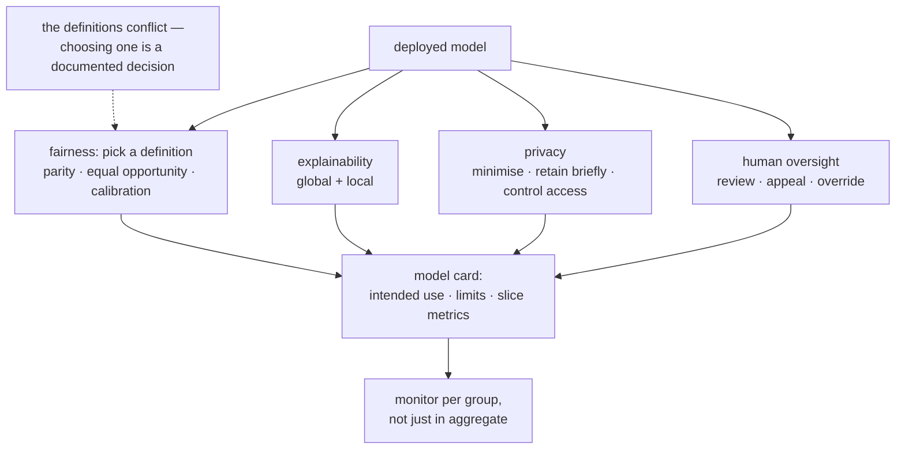

**In one line.** Fairness, privacy and explainability are engineering requirements with measurable definitions — and the definitions conflict, so someone has to choose.

## The idea in plain words

"Make it fair" is not actionable until you pick a definition, and the main ones are **mathematically incompatible** except in degenerate cases:

- **Demographic parity** — the positive rate is equal across groups.
- **Equal opportunity** — the true-positive rate is equal across groups.
- **Equalised odds** — both true-positive and false-positive rates are equal.
- **Calibration** — a score of 0.7 means the same thing in every group.

You cannot generally satisfy calibration and equalised odds simultaneously when base rates differ. So the engineering task is to **choose, document why, and measure it continuously** — not to claim neutrality.

The rest of the responsible-ML toolkit:

- **Explainability.** Global (what does the model use in general) and local (why this decision). SHAP and counterfactuals are the usual tools; in regulated settings an interpretable model may be required outright.
- **Privacy.** Data minimisation, retention limits, access control, pseudonymisation; differential privacy where the guarantee must be formal. Remember that models can memorise training data.
- **Human oversight.** For consequential decisions: review queues, appeal routes, and the ability for a person to override — with the override logged as training signal.
- **Documentation.** Model cards and datasheets recording intended use, limitations, evaluation by slice, and known failure modes.



## How it works

### Harm, and what Responsible AI means

Software can cause real harm; ML amplifies it by learning from biased data at scale. Responsible AI aligns systems with stakeholder values, law and ethics — mitigating harm while maximising benefit.

:::note

**Categories of harm.** To individuals (unfair loan/job denial), to groups (systematic discrimination), to society (misinformation, lost trust), and physical (a safety-critical failure).

:::

- **Fairness · Explainability** — No unfair discrimination; understand why a decision was made.
- **Safety · Security · Privacy** — Reliable, attack-resistant, data-protecting.
- **Versioning & provenance** — Track, trace and reproduce data/code/models.

### Versioning, provenance & reproducibility

When a loan decision is disputed (à la the 2019 Apple Card case), you must reconstruct which model version ran, which code produced it, and what inputs led to it — despite A/B tests and canaries.

:::note

**Three concerns.** Versioning (revisions + parallel variants), provenance/lineage (who/what produced each artifact), reproducibility (recreate despite nondeterministic training).

:::

:::tip

**Five ways to version big datasets.** Full copies · deltas · append-only offsets · per-record history · version the pipeline (regenerate from versioned inputs + deterministic code).

:::

### Explainable AI (XAI)

When models are opaque, explanations are the bridge to trust and debugging — e.g. a recidivism risk score that must be justified.

- **Transparency** — Can I **see** how the model works? (decision-tree rules)
- **Interpretability** — Can I **understand** how it works? (points scorecard)
- **Explainability** — Can I understand **why this** prediction? (feature contributions)

### Fairness & the bias loop

Fairness stops an AI unfairly favouring/discriminating against groups. Amazon scrapped a recruiting model that penalised women's résumés — trained on 10 years of male-dominated hiring.

:::tip

**Worked.** Rates 0.45 vs 0.60 → disparate impact 0.45/0.60 = 0.75 &lt; 0.80 → fails 80% rule; parity gap 0.15. Equal-opportunity: TPR 0.70 vs 0.85 → 0.15 gap for qualified applicants.

:::

### Engineering for trust

Safety prevents failures causing death/injury, property loss, or societal harm — critical in aircraft, autonomous vehicles, medical devices, railways.

- **ML safety** — Robustness (withstand hazards) · Monitoring (detect problems) · Alignment (do what we want). A sticker can make a stop sign undetected.
- **Security (CIA)** — Confidentiality, Integrity, Availability + auth, non-repudiation, authorization. In ML: block data poisoning, model theft, training-data extraction.
- **Privacy** — Control over personal data; risky because ML aggregates & infers across sources.

:::note

**Regulation.** EU: risk-based & enforceable (bans unacceptable-risk, strict rules for high-risk). UK: pro-innovation, sector-based. US: fragmented, state-led. Shared themes: safety, fairness, privacy, security, transparency, deepfake labelling.

:::

### Key takeaways

- **1 · Principles** — Anticipate harm; fairness, explainability, safety, security, privacy.
- **2 · Provenance & XAI** — Version/trace/reproduce; transparency vs interpretability vs explainability.
- **3 · Measure & defend** — Disparate impact & equal-opportunity; robustness, CIA, privacy, regulation.

:::note

**The thread.** Responsible engineering is not an add-on: bake fairness, transparency, safety and privacy into the pipeline, make every decision reconstructible, and measure fairness with concrete metrics rather than good intentions.

:::

## A real system that works this way

**COMPAS** is the case study everyone should know: a recidivism score that was **calibrated** across racial groups yet had very different false-positive rates. Both sides of the public argument were arithmetically correct — they were measuring different definitions of fairness. That is the entire lesson: the choice is normative, and it must be explicit.

**Hiring models** show the privacy and proxy problem: remove gender and the model finds a proxy (a sport, a college, a gap in employment). Fairness work is therefore about outcomes measured per group, not about which columns you deleted.

## Code you can run

The incompatibility is not rhetorical — it is arithmetic you can run.

```python
import random
from dataclasses import dataclass

random.seed(17)

@dataclass
class Applicant:
    group: str
    qualified: bool
    score: float

def population(n=8000):
    """Two groups with different base rates — the usual real-world situation."""
    people = []
    for _ in range(n):
        group = random.choice(["A", "B"])
        base_rate = 0.60 if group == "A" else 0.35
        qualified = random.random() < base_rate
        # a calibrated score: same meaning in both groups, different distributions
        score = min(1.0, max(0.0, random.gauss(0.72 if qualified else 0.38, 0.16)))
        people.append(Applicant(group, qualified, score))
    return people

def rates(people, threshold):
    out = {}
    for group in ("A", "B"):
        rows = [p for p in people if p.group == group]
        selected = [p for p in rows if p.score >= threshold]
        tp = sum(1 for p in selected if p.qualified)
        fp = len(selected) - tp
        pos = sum(1 for p in rows if p.qualified)
        neg = len(rows) - pos
        out[group] = {
            "selection_rate": len(selected) / len(rows),
            "tpr": tp / pos if pos else 0.0,
            "fpr": fp / neg if neg else 0.0,
        }
    return out

def calibration(people, low, high):
    """Among people scored in a band, what fraction were actually qualified?"""
    out = {}
    for group in ("A", "B"):
        band = [p for p in people if p.group == group and low <= p.score < high]
        out[group] = sum(p.qualified for p in band) / len(band) if band else float("nan")
    return out

people = population()

print("a single threshold of 0.5, applied equally to both groups:")
r = rates(people, 0.5)
for group, m in r.items():
    print(f"  group {group}: selection {m['selection_rate']:.1%}  "
          f"TPR {m['tpr']:.1%}  FPR {m['fpr']:.1%}")
cal = calibration(people, 0.6, 0.8)
print(f"  calibration in the 0.6-0.8 band: A {cal['A']:.1%}  B {cal['B']:.1%} "
      f"(≈ equal: the score means the same thing)")
print(f"  demographic parity gap: "
      f"{abs(r['A']['selection_rate'] - r['B']['selection_rate']):.1%}  <- violated")

# --- enforce demographic parity with group-specific thresholds ------------
def threshold_for_rate(people, group, target_rate):
    scores = sorted((p.score for p in people if p.group == group), reverse=True)
    index = min(int(target_rate * len(scores)), len(scores) - 1)
    return scores[index]

target = r["A"]["selection_rate"]
t_a = threshold_for_rate(people, "A", target)
t_b = threshold_for_rate(people, "B", target)

def rates_split(people, t_a, t_b):
    out = {}
    for group, t in (("A", t_a), ("B", t_b)):
        rows = [p for p in people if p.group == group]
        selected = [p for p in rows if p.score >= t]
        tp = sum(1 for p in selected if p.qualified)
        fp = len(selected) - tp
        pos = sum(1 for p in rows if p.qualified)
        neg = len(rows) - pos
        out[group] = {"threshold": t, "selection_rate": len(selected) / len(rows),
                      "tpr": tp / pos if pos else 0, "fpr": fp / neg if neg else 0}
    return out

print(f"\nnow enforcing demographic parity (equal selection rates):")
split = rates_split(people, t_a, t_b)
for group, m in split.items():
    print(f"  group {group}: threshold {m['threshold']:.2f}  "
          f"selection {m['selection_rate']:.1%}  TPR {m['tpr']:.1%}  FPR {m['fpr']:.1%}")
print(f"  selection-rate gap now {abs(split['A']['selection_rate'] - split['B']['selection_rate']):.1%}")
print(f"  but FPR gap is {abs(split['A']['fpr'] - split['B']['fpr']):.1%} "
      f"and the thresholds differ by {abs(t_a - t_b):.2f}")

print("\nfixing one definition broke another. There is no threshold that satisfies")
print("demographic parity, equalised odds and calibration at once when base rates")
print("differ — so the choice is a documented business and ethical decision.")
```

## Designing with it

**A responsible-ML checklist you can actually run**

| Area | Concrete action |
| --- | --- |
| Fairness | Choose a definition, justify it in writing, measure it per release and in production |
| Slices | Report metrics per group, including small groups, not just in aggregate |
| Explainability | Decide global vs local needs early — it can determine the model family |
| Privacy | Minimise fields, set retention, control access, document the legal basis |
| Oversight | Review queue for low-confidence or high-impact decisions; a real appeal route |
| Documentation | Model card: intended use, out-of-scope use, training data, limitations, slice metrics |
| Monitoring | Fairness metrics on live traffic — a model can drift into unfairness |

**Process notes**

- **Decide before you collect data.** Fairness and privacy constraints are cheapest at the design stage and most expensive after launch.
- **Proxies defeat deletion.** Removing a protected attribute does not remove the correlation; measure outcomes, not inputs.
- **Small groups need attention, not exclusion** — they are where aggregate metrics hide the worst behaviour.
- **Log overrides.** When a human reverses a decision, that is both an audit record and a training signal.

**Under the EU AI Act**, high-risk systems require documented risk management, data governance, technical documentation, logging, human oversight, and accuracy/robustness testing. Most of that list is the engineering hygiene in this subject, written down.

## Where this stands in 2026

:::info Industry view

- Model cards and system cards are now expected artefacts, driven by both regulation and enterprise procurement.
- **The EU AI Act** has made much of this legally binding for high-risk systems, with documentation and human-oversight obligations.
- Fairness toolkits (Fairlearn, AIF360) are common, but the hard part remains choosing the definition and owning that choice.
- Privacy work has shifted left: data minimisation and retention limits at collection time, rather than anonymisation afterwards.

:::

## Practice questions

<details>
<summary><strong>Q1.</strong> Define Responsible AI.</summary>

A set of principles guiding the design, development, deployment and use of AI so systems align with stakeholder values, legal standards and ethical principles — mitigating risks and harm while maximising positive outcomes.<br /><em>Session 15 · conceptual</em>

</details>

<details>
<summary><strong>Q2.</strong> List the principles of Responsible ML.</summary>

Fairness, explainability, safety, security, privacy, plus versioning, provenance and reproducibility.<br /><em>Session 15 · conceptual</em>

</details>

<details>
<summary><strong>Q3.</strong> What three concerns let you reconstruct a disputed automated decision?</summary>

Versioning (revisions over time and parallel variants), provenance/lineage (who/what produced each artifact), and reproducibility (recreating results despite nondeterministic training).<br /><em>Session 15 · conceptual</em>

</details>

<details>
<summary><strong>Q4.</strong> Group A is selected at 0.45, Group B at 0.60. Compute disparate impact and apply the 80% rule.</summary>

Disparate impact = 0.45/0.60 = 0.75. Since 0.75 &lt; 0.80 it fails the four-fifths (80%) rule — adverse impact on Group A. Demographic-parity gap = |0.60−0.45| = 0.15.<br /><em>Session 15 · numeric</em>

</details>

<details>
<summary><strong>Q5.</strong> True-positive rates are 0.70 and 0.85 across two groups. Give the equal-opportunity difference and what it means.</summary>

|0.85 − 0.70| = 0.15 — qualified members of the first group are approved less often, a fairness gap even if overall accuracy looks acceptable.<br /><em>Session 15 · numeric</em>

</details>

<details>
<summary><strong>Q6.</strong> Name five strategies for versioning large datasets.</summary>

Store full copies; store deltas; offsets in append-only data; version individual records; version the pipeline (regenerate derived data from versioned inputs + deterministic code).<br /><em>Session 15 · conceptual</em>

</details>

<details>
<summary><strong>Q7.</strong> Give one safety, one security and one privacy threat to an ML system.</summary>

Safety: unreliable behaviour on corrupted/adversarial input. Security: data poisoning of the training set (or unauthorized data access). Privacy: misuse of aggregated sensitive personal data.<br /><em>Session 15 · conceptual</em>

</details>

<details>
<summary><strong>Q8.</strong> Distinguish transparency, interpretability and explainability.</summary>

Transparency = can I see how the model works? (visible rules, e.g. a decision tree). Interpretability = can I understand how it works? (e.g. a points scorecard). Explainability = can I understand why it made this particular prediction? (feature contributions for one case).<br /><em>Session 15 · conceptual</em>

</details>

<details>
<summary><strong>Q9.</strong> What is Explainable AI (XAI) and why does it matter?</summary>

A set of tools and methods that help humans understand how a model makes decisions, turning black-box algorithms into transparent systems so users can see why an answer was given, check for fairness, and trust the results (e.g. justifying a recidivism risk score).<br /><em>Session 15 · conceptual</em>

</details>

<details>
<summary><strong>Q10.</strong> Name the three categories of ML safety.</summary>

Robustness (withstand hazardous/adversarial inputs — e.g. a stickered stop sign), monitoring (detect problems/drift), and alignment (the model optimises what we actually want).<br /><em>Session 15 · conceptual</em>

</details>

<details>
<summary><strong>Q11.</strong> State the CIA triad and how each maps to security in ML.</summary>

Confidentiality — data/models/predictions safe from unauthorized access (no dataset leaks, no model theft, no training-data extraction via queries). Integrity — no unauthorized modification (no data poisoning, no malicious model swap, no tampered predictions). Availability — endpoints and retraining infra stay up under malicious load.<br /><em>Session 15 · conceptual</em>

</details>

<details>
<summary><strong>Q12.</strong> Contrast the EU, UK and US approaches to AI regulation.</summary>

EU: risk-based and legally enforceable (bans unacceptable-risk systems; strict rules for high-risk). UK: pro-innovation, sector-based via existing regulators. US: fragmented, largely state-led, no single federal AI law.<br /><em>Session 15 · conceptual</em>

</details>

## Further reading

- [Fairness and Machine Learning (Barocas, Hardt, Narayanan)](https://fairmlbook.org/) — the free textbook, including the impossibility results.
- [Model Cards for Model Reporting](https://arxiv.org/abs/1810.03993) and [Datasheets for Datasets](https://arxiv.org/abs/1803.09010).
- [Fairlearn](https://fairlearn.org/) — metrics and mitigation algorithms in code.
- [EU AI Act](https://artificialintelligenceact.eu/) — obligations by risk tier.
- [Source lecture: seml-s15-responsible-ml](https://learning.bansal-ai.in/seml-s15-responsible-ml/lecture.html) — the original interactive lecture these notes were built from.

- **[Made With ML](https://madewithml.com/)** `course`
  Goku Mohandas — Design, test, deploy and monitor ML systems — the practical MLOps path.
- **[Rules of Machine Learning](https://developers.google.com/machine-learning/guides/rules-of-ml)** `docs`
  Google — 43 rules for engineering dependable ML systems.
- **[Continuous Delivery for ML (CD4ML)](https://martinfowler.com/articles/cd4ml.html)** `docs`
  Sato, Wider & Windheuser — How CI/CD, testing and deployment apply to machine-learning systems.
