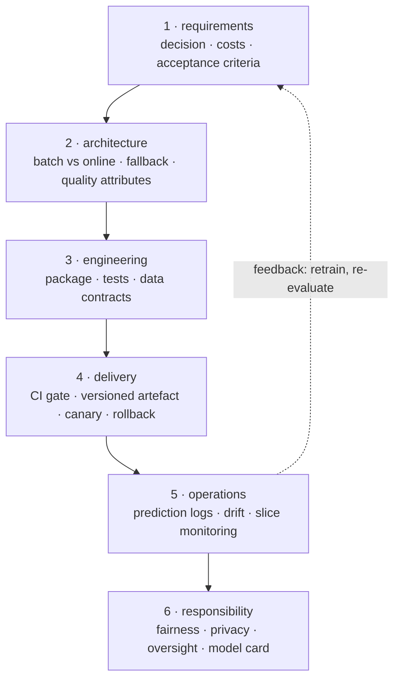

**In one line.** One page you can hold a design review against, where every item exists because a real system failed without it.

## The idea in plain words

This subject is one argument: **an ML system is a software system whose behaviour is fitted rather than written**, and everything hard follows from that. The checklist below is the condensed form.

It works as a **production-readiness review**. Go through it before launch, and again after any significant change. Each item names the failure it prevents, because a checklist without consequences becomes a formality.

The five questions that matter most, if you only have ten minutes:

1. **What decision does this drive, and what does a wrong one cost?** (No answer means no requirements.)
2. **Where do the features come from at serving time, and are they computed identically in training?** (The most common silent failure.)
3. **How will we know it has degraded, before a user tells us?** (Monitoring on predictions and inputs, not just uptime.)
4. **What happens when the model is unavailable or unsure?** (The fallback is the difference between a degraded feature and an outage.)
5. **How do we roll back, and how fast?** (If the answer is "retrain", you cannot roll back.)



## How it works

### Eight modules, one pipeline

Foundations → Requirements → Architecture & Design → Implementation → Quality Assurance → Deployment → Responsible ML → Agentic AI.

:::note

**Evaluation components.** An online quiz (EC-1, low weight), assignment(s) (EC-2), and a comprehensive exam (highest weight). The comprehensive exam rewards synthesis across modules — so practise connections, not single slides.

:::

### Ideas that recur

- **Data is a dependency** — Version, trace and reproduce data like code.
- **Design for change** — Quality attributes & patterns because data evolves.
- **Automate the lifecycle** — Pipelines, CI/CD, MLOps make it dependable.
- **Engineer for trust** — Testing, safety, fairness are correctness.

### Exam synthesis

:::note

**Connect the modules.** A drift alert (Deployment/MLOps) → retraining (Implementation) → validated by tests (QA) → checked for fairness (Responsible ML) → every version tracked (provenance).

:::

:::tip

**Formulas to keep.** QPS/replica = 1000/latency · cache avg = hit·ℓ_hit + miss·ℓ_miss · disparate impact &lt; 0.8 fails the 80% rule.

:::

## A real system that works this way

**The review that catches things** is short and specific. Three questions that have saved real launches: *"show me the fallback path"*, *"show me the feature computed in both training and serving"*, and *"show me the alert that fires when accuracy drops"*. Teams that cannot demonstrate all three are not ready, whatever the offline metrics say.

## Code you can run

A readiness review you can run as code, so "are we ready?" has an answer rather than an opinion.

```python
from dataclasses import dataclass, field

@dataclass
class Check:
    area: str
    question: str
    prevents: str
    blocking: bool = True
    answer: bool | None = None

CHECKLIST = [
    Check("requirements", "Is the decision the model drives written down, with the cost of each error type?",
          "building the wrong thing accurately"),
    Check("requirements", "Are there acceptance criteria that can be executed on a held-out set?",
          "endless subjective 'is it good enough' debates"),
    Check("architecture", "Is the serving pattern (batch/online/stream) justified by the latency budget?",
          "an unserveable model"),
    Check("architecture", "Is there a defined fallback when the model is down, slow or unsure?",
          "a model outage becoming a product outage"),
    Check("engineering", "Are features computed by ONE definition used in training and serving?",
          "training/serving skew — the classic silent failure"),
    Check("engineering", "Are there data contract tests on every input batch?",
          "upstream schema changes corrupting predictions"),
    Check("engineering", "Do model tests include slices and behavioural (invariance/directional) cases?",
          "an aggregate metric hiding a failing group"),
    Check("delivery", "Are code, data and environment all versioned and pinned together?",
          "results nobody can reproduce"),
    Check("delivery", "Does CI block a candidate that is not better than production?",
          "shipping regressions"),
    Check("delivery", "Is rollback a version change that takes minutes?",
          "being stuck with a bad model"),
    Check("operations", "Are predictions logged with features and model version?",
          "unanswerable 'why did it do that?'"),
    Check("operations", "Do monitors cover null rates, drift, score distribution and delayed accuracy?",
          "silent decay"),
    Check("operations", "Is there an on-call owner and a runbook?", "nobody responding at 3am"),
    Check("responsibility", "Is a fairness definition chosen, justified and measured per group?",
          "discriminatory outcomes discovered externally"),
    Check("responsibility", "Is there a model card with intended use and limitations?",
          "misuse by a downstream team"),
    Check("responsibility", "For consequential decisions, is there human review and an appeal route?",
          "no recourse for the people affected", blocking=False),
]

# a team's honest answers before a launch review
ANSWERS = {
    0: True, 1: True, 2: True, 3: False, 4: True, 5: True, 6: False, 7: True,
    8: True, 9: True, 10: True, 11: False, 12: True, 13: False, 14: True, 15: False,
}
for i, value in ANSWERS.items():
    CHECKLIST[i].answer = value

by_area: dict[str, list[Check]] = {}
for check in CHECKLIST:
    by_area.setdefault(check.area, []).append(check)

blockers = []
print(f"{'area':16} {'passed':>8}   gaps")
for area, checks in by_area.items():
    passed = sum(1 for c in checks if c.answer)
    gaps = [c for c in checks if not c.answer]
    blockers += [c for c in gaps if c.blocking]
    print(f"{area:16} {passed:3}/{len(checks):<4}   " +
          (", ".join(c.question[:46] + "…" for c in gaps) if gaps else "—"))

print(f"\n{len(blockers)} blocking gaps:")
for c in blockers:
    print(f"  [{c.area}] {c.question}")
    print(f"      prevents: {c.prevents}")

print(f"\nverdict: {'READY' if not blockers else 'NOT READY — close the blocking gaps first'}")
```

## Designing with it

**The review checklist, by stage**

**Requirements** — the decision is written down; costs of each error type; executable acceptance criteria; the fallback specified; legal basis for the data.

**Architecture** — serving pattern justified by latency; quality attributes ranked with an ADR; degradation behaviour defined; feature availability at request time confirmed.

**Engineering** — one feature definition across training and serving; data contract tests; unit tests on transformations; slice and behavioural model tests; a reproducible training entry point.

**Delivery** — code, data and environment versioned together; CI gate comparing candidate against production; artefact with lineage; shadow then canary; rollback in minutes.

**Operations** — predictions logged with features and version; monitors for null rates, drift, score distribution and delayed accuracy; alerting with an owner; a runbook.

**Responsibility** — a chosen fairness definition measured per group; privacy minimisation and retention; human oversight for consequential decisions; a model card.

**How to use it.** Walk it in a 45-minute review with the team, mark each item yes/no/not-applicable, and record the blocking gaps as tickets. The point is not the score — it is that the gaps become visible and owned **before** launch rather than during an incident.

## Where this stands in 2026

:::info Industry view

- Production-readiness reviews are standard practice in mature ML organisations, usually as a checklist exactly like this one.
- The **ML Test Score** rubric (Google) is the best-known published version and is worth scoring your system against.
- Regulatory regimes are converging on the same list — documentation, monitoring, oversight and rollback are becoming obligations, not options.
- Teams that keep a runbook and an owner per model recover from incidents in minutes; teams that do not spend those minutes finding out who to call.

:::

## Practice questions

Synthesis questions spanning the SE4ML course.

<details>
<summary><strong>Q1.</strong> Name the eight SE4ML modules in order.</summary>

Foundations → Requirements → Architecture & Design → Implementation & code sharing → Quality Assurance → Deployment → Responsible ML Engineering → Application of SE Principles for Agentic AI.<br /><em>Session 16 · conceptual</em>

</details>

<details>
<summary><strong>Q5.</strong> What are the evaluation components, and what should drive revision?</summary>

An online quiz (EC-1, low weight), assignment(s) (EC-2), and a comprehensive exam (highest weight). Because the comprehensive exam rewards synthesis across modules, practise cross-module connections over single-slide recall.<br /><em>Session 16 · conceptual</em>

</details>

<details>
<summary><strong>Q2.</strong> Give four threads that run through the whole course.</summary>

Data is a dependency; design for change; automate the lifecycle; engineer for trust.<br /><em>Session 16 · conceptual</em>

</details>

<details>
<summary><strong>Q3.</strong> Trace how a production drift alert flows across modules.</summary>

Drift alert (Deployment/MLOps) → retraining (Implementation) → validated by tests (QA) → checked for fairness (Responsible ML) → every version tracked (provenance).<br /><em>Session 16 · conceptual</em>

</details>

<details>
<summary><strong>Q4.</strong> Recall the three quantitative anchors from the post-mid modules.</summary>

Serving: QPS/replica = 1000/latency(ms). Caching: avg = hit·ℓ_hit + miss·ℓ_miss. Fairness: disparate impact &lt; 0.8 fails the 80% rule.<br /><em>Session 16 · numeric</em>

</details>

## Further reading

- [The ML Test Score (Breck et al.)](https://research.google/pubs/pub46555/) — 28 actionable tests across data, model, infrastructure and monitoring.
- [Machine Learning in Production (CMU)](https://mlip-cmu.github.io/book/) — the full treatment of everything summarised here.
- [Google SRE workbook](https://sre.google/workbook/table-of-contents/) — production readiness reviews, runbooks and on-call.
- [Source lecture: seml-s16-course-review](https://learning.bansal-ai.in/seml-s16-course-review/lecture.html) — the original interactive lecture these notes were built from.

- **[Made With ML](https://madewithml.com/)** `course`
  Goku Mohandas — Design, test, deploy and monitor ML systems — the practical MLOps path.
- **[Rules of Machine Learning](https://developers.google.com/machine-learning/guides/rules-of-ml)** `docs`
  Google — 43 rules for engineering dependable ML systems.
- **[Continuous Delivery for ML (CD4ML)](https://martinfowler.com/articles/cd4ml.html)** `docs`
  Sato, Wider & Windheuser — How CI/CD, testing and deployment apply to machine-learning systems.
