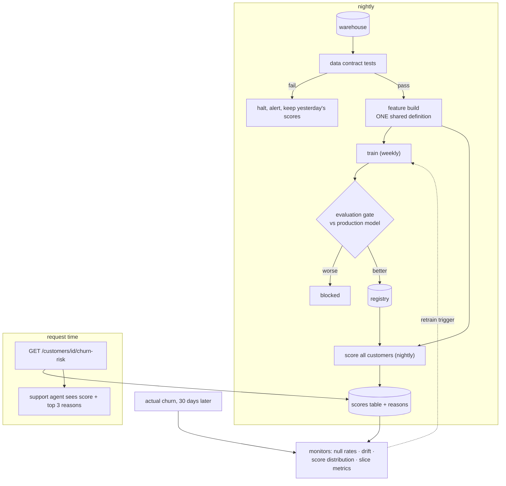

**In one line.** Build every box *around* the model — requirements, feature parity, data contracts, an evaluation gate, containerised serving, canary release, drift monitoring, a model card and a readiness review — using a model simple enough that all the attention goes on the system.

This capstone uses **every concept in this subject**. The model is logistic regression on six features; that is deliberate.

## What you are building

> A subscription business wants to offer a retention discount to customers likely to cancel in the next 30 days. The offer costs money, so targeting the wrong customers is expensive; missing a churner is more expensive. The system must run daily, be explainable to the support team, and never quietly degrade.

| | |
| --- | --- |
| **Decision** | Send a retention offer to a customer, or not |
| **Volume** | 400,000 active customers, scored nightly |
| **Cost of a false positive** | ~£45 discount given to someone who would have stayed |
| **Cost of a false negative** | ~£180 lifetime value lost |
| **Latency** | Batch — results needed by 06:00; a lookup API serves them in under 20 ms |
| **Explainability** | Support agents must see the top three reasons |
| **Done means** | Recall ≥ 0.70 at precision ≥ 0.35, no group more than 10 points below overall, drift monitored, rollback in under 10 minutes |

## Architecture



**Why batch.** The decision is not needed in the request path — an offer is sent by a campaign job. Precomputing removes the model from the latency budget entirely and makes the fallback trivial: serve yesterday's table. This is the single most consequential architecture decision in the project, and it is the one most teams get wrong by defaulting to a real-time service.

## The stack

| Concern | Tool | Why here |
| --- | --- | --- |
| Data contracts | Pandera or Great Expectations | Schema, ranges, null rates fail the build, not the model |
| Feature definitions | A shared Python module (or Feast) | One definition used by training and scoring |
| Training | scikit-learn | Interpretable, fast, sufficient — and explainability is a requirement |
| Experiment tracking | MLflow | Metrics, params and artefacts with lineage |
| Orchestration | Airflow or Prefect | Nightly DAG with retries and alerting |
| Serving | FastAPI over the scores table | Lookup only; no model in the request path |
| Monitoring | Evidently + your metrics stack | Drift, null rates, slice metrics |
| CI | GitHub Actions | Tests, data checks, evaluation gate |
| Packaging | uv + Docker | Reproducible environment, non-root runtime |

## Step 1 — Write the requirements down

```python
"""requirements.py — the contract, in code, so it can be asserted against."""
from dataclasses import dataclass

@dataclass(frozen=True)
class Requirements:
    decision: str = "send a retention offer to a customer"
    cost_false_positive: float = 45.0        # discount wasted
    cost_false_negative: float = 180.0       # lifetime value lost
    min_recall: float = 0.70
    min_precision: float = 0.35
    max_slice_gap: float = 0.10              # no group >10 points below overall
    batch_deadline_utc: str = "06:00"
    api_p95_ms: float = 20.0
    explainability: str = "top 3 contributing features per customer"
    fallback: str = "serve the previous night's scores; never fail open"

REQS = Requirements()

def optimal_threshold(scores, labels, reqs=REQS):
    """The threshold is chosen by the cost model, not by taste."""
    best, best_cost = 0.5, float("inf")
    for i in range(1, 100):
        t = i / 100
        fp = sum(1 for s, y in zip(scores, labels) if s >= t and not y)
        fn = sum(1 for s, y in zip(scores, labels) if s < t and y)
        cost = fp * reqs.cost_false_positive + fn * reqs.cost_false_negative
        if cost < best_cost:
            best, best_cost = t, cost
    return best, best_cost
```

The asymmetry (£180 versus £12) is what sets the threshold. Writing it down converts an endless debate into arithmetic.

## Step 2 — One feature definition, used twice

This is the step that prevents the most expensive failure in ML systems.

```python
"""features.py — imported by BOTH the training job and the scoring job."""
from __future__ import annotations

from dataclasses import dataclass
from datetime import date, timedelta

FEATURE_NAMES = ("tenure_months", "logins_30d", "support_tickets_90d",
                 "plan_price", "failed_payments_180d", "discount_active")

@dataclass(frozen=True)
class CustomerFacts:
    signup_date: date
    logins: list[date]
    tickets: list[date]
    plan_price: float
    failed_payments: list[date]
    discount_until: date | None

def build_features(facts: CustomerFacts, as_of: date) -> dict[str, float]:
    """The ONLY place these are computed. Training and scoring both call this."""
    return {
        "tenure_months": (as_of - facts.signup_date).days / 30.0,
        "logins_30d": sum(1 for d in facts.logins if as_of - d <= timedelta(days=30)),
        "support_tickets_90d": sum(1 for d in facts.tickets if as_of - d <= timedelta(days=90)),
        "plan_price": facts.plan_price,
        "failed_payments_180d": sum(1 for d in facts.failed_payments
                                    if as_of - d <= timedelta(days=180)),
        "discount_active": float(facts.discount_until is not None
                                 and facts.discount_until >= as_of),
    }
```

:::warning The test that matters most
```python
def test_training_and_serving_agree():
    """Run both code paths over the same customer and assert identical vectors."""
    facts, as_of = sample_customer(), date(2026, 9, 18)
    assert training_feature_row(facts, as_of) == serving_feature_row(facts, as_of)
```
If the training job computes features with SQL and the scorer computes them in Python, this test is the only thing standing between you and months of unexplained accuracy loss.
:::

## Step 3 — Data contracts that halt the pipeline

```python
"""contracts.py — the pipeline fails loudly rather than training on rubbish."""
from dataclasses import dataclass

@dataclass(frozen=True)
class ColumnRule:
    name: str
    dtype: type
    min_value: float | None = None
    max_value: float | None = None
    max_null_rate: float = 0.0

RULES = [
    ColumnRule("tenure_months", float, 0, 600),
    ColumnRule("logins_30d", float, 0, 500),
    ColumnRule("support_tickets_90d", float, 0, 200),
    ColumnRule("plan_price", float, 0, 1000, max_null_rate=0.0),
    ColumnRule("failed_payments_180d", float, 0, 50),
    ColumnRule("discount_active", float, 0, 1),
]

class ContractViolation(Exception):
    pass

def validate(rows: list[dict], rules=RULES) -> None:
    n = len(rows)
    problems = []
    for rule in rules:
        values = [r.get(rule.name) for r in rows]
        nulls = sum(v is None for v in values)
        if nulls / n > rule.max_null_rate:
            problems.append(f"{rule.name}: null rate {nulls/n:.2%} > {rule.max_null_rate:.2%}")
        present = [v for v in values if v is not None]
        if rule.min_value is not None and any(v < rule.min_value for v in present):
            problems.append(f"{rule.name}: values below {rule.min_value}")
        if rule.max_value is not None and any(v > rule.max_value for v in present):
            problems.append(f"{rule.name}: values above {rule.max_value}")
    if problems:
        raise ContractViolation("; ".join(problems))
```

## Step 4 — Train, gate, register

```python
"""train.py — with the gate that decides whether this model is allowed out."""

def evaluate(model, rows, labels, threshold):
    scores = [model.predict_proba(r) for r in rows]
    tp = sum(1 for s, y in zip(scores, labels) if s >= threshold and y)
    fp = sum(1 for s, y in zip(scores, labels) if s >= threshold and not y)
    fn = sum(1 for s, y in zip(scores, labels) if s < threshold and y)
    precision = tp / (tp + fp) if tp + fp else 0.0
    recall = tp / (tp + fn) if tp + fn else 0.0
    return {"precision": precision, "recall": recall}

def gate(candidate_metrics, production_metrics, slice_metrics, reqs):
    reasons = []
    if candidate_metrics["recall"] < reqs.min_recall:
        reasons.append(f"recall {candidate_metrics['recall']:.2f} < {reqs.min_recall}")
    if candidate_metrics["precision"] < reqs.min_precision:
        reasons.append(f"precision {candidate_metrics['precision']:.2f} < {reqs.min_precision}")
    if candidate_metrics["recall"] < production_metrics["recall"]:
        reasons.append("worse recall than the model in production")
    for group, value in slice_metrics.items():
        if value < candidate_metrics["recall"] - reqs.max_slice_gap:
            reasons.append(f"slice {group} recall {value:.2f} more than "
                           f"{reqs.max_slice_gap:.0%} below overall")
    return (not reasons), reasons
```

## Step 5 — Run the whole thing

```python
"""An end-to-end miniature of the system: contracts, parity, gate, canary, drift."""
import math, random, statistics
from dataclasses import dataclass
from datetime import date, timedelta

random.seed(21)
TODAY = date(2026, 9, 18)

# ---------- shared feature definition (step 2) ------------------------------
FEATURE_NAMES = ("tenure_months", "logins_30d", "support_tickets_90d",
                 "plan_price", "failed_payments_180d", "discount_active")

def build_features(facts, as_of):
    return {
        "tenure_months": (as_of - facts["signup"]).days / 30.0,
        "logins_30d": sum(1 for d in facts["logins"] if as_of - d <= timedelta(days=30)),
        "support_tickets_90d": sum(1 for d in facts["tickets"]
                                   if as_of - d <= timedelta(days=90)),
        "plan_price": facts["plan_price"],
        "failed_payments_180d": sum(1 for d in facts["failed"]
                                    if as_of - d <= timedelta(days=180)),
        "discount_active": float(facts["discount_until"] is not None
                                 and facts["discount_until"] >= as_of),
    }

# ---------- synthetic population --------------------------------------------
def make_customer(region):
    tenure_days = random.randrange(30, 2000)
    logins = [TODAY - timedelta(days=random.randrange(1, 120))
              for _ in range(random.randrange(0, 25))]
    tickets = [TODAY - timedelta(days=random.randrange(1, 200))
               for _ in range(random.randrange(0, 6))]
    failed = [TODAY - timedelta(days=random.randrange(1, 300))
              for _ in range(random.randrange(0, 4))]
    return {"signup": TODAY - timedelta(days=tenure_days), "logins": logins,
            "tickets": tickets, "plan_price": random.choice([9.0, 19.0, 49.0]),
            "failed": failed, "discount_until": None, "region": region}

# The latent truth. Note the island region: some of its churn is driven by
# something the features cannot see, which is why its recall will be lower.
TRUE_WEIGHTS = {"tenure_months": -0.03, "logins_30d": -0.18,
                "support_tickets_90d": 0.55, "plan_price": 0.001,
                "failed_payments_180d": 0.70, "discount_active": -0.3}
TRUE_BIAS = -1.0
UNOBSERVED_ISLAND_CHURN = 0.30

def churned(f, region):
    risk = TRUE_BIAS + sum(TRUE_WEIGHTS[k] * f[k] for k in TRUE_WEIGHTS)
    churn = random.random() < 1 / (1 + math.exp(-risk))
    if region == "island" and random.random() < UNOBSERVED_ISLAND_CHURN:
        churn = True                      # a driver the model has no feature for
    return churn

population = [make_customer(random.choices(["north", "south", "island"],
                                           weights=[55, 40, 5])[0])
              for _ in range(6000)]
rows = [build_features(c, TODAY) for c in population]
regions = [c["region"] for c in population]
labels = [churned(r, g) for r, g in zip(rows, regions)]

# ---------- step 3: data contracts ------------------------------------------
class ContractViolation(Exception): pass

def validate(rows):
    problems = []
    for name in FEATURE_NAMES:
        values = [r.get(name) for r in rows]
        if any(v is None for v in values):
            problems.append(f"{name}: nulls present")
        if name != "discount_active" and any(v < 0 for v in values if v is not None):
            problems.append(f"{name}: negative values")
    if problems:
        raise ContractViolation("; ".join(problems))
    return True

print("data contract on today's batch:", "PASS" if validate(rows) else "FAIL")
broken = [dict(r, logins_30d=-1) for r in rows[:10]] + rows[10:]
try:
    validate(broken)
except ContractViolation as exc:
    print("data contract on a broken batch: HALT ->", exc)

# ---------- a deliberately simple model -------------------------------------
class LogisticModel:
    def __init__(self, weights, bias):
        self.weights, self.bias = weights, bias
    def predict_proba(self, row):
        z = self.bias + sum(self.weights[k] * row[k] for k in self.weights)
        return 1 / (1 + math.exp(-max(-30, min(30, z))))
    def reasons(self, row, k=3):
        contributions = {name: self.weights[name] * row[name] for name in self.weights}
        return sorted(contributions.items(), key=lambda kv: -abs(kv[1]))[:k]

# the incumbent: an older, slightly weaker fit
production_model = LogisticModel(
    {"tenure_months": -0.022, "logins_30d": -0.13, "support_tickets_90d": 0.42,
     "plan_price": 0.001, "failed_payments_180d": 0.52, "discount_active": -0.25}, -0.85)
# the candidate: this week's retrain, close to the true generative weights
candidate_model = LogisticModel(dict(TRUE_WEIGHTS), TRUE_BIAS)

# ---------- step 1: the threshold comes from the cost model ----------------
def evaluate(model, rows, labels, threshold):
    scores = [model.predict_proba(r) for r in rows]
    tp = sum(1 for s, y in zip(scores, labels) if s >= threshold and y)
    fp = sum(1 for s, y in zip(scores, labels) if s >= threshold and not y)
    fn = sum(1 for s, y in zip(scores, labels) if s < threshold and y)
    return {"precision": tp / (tp + fp) if tp + fp else 0.0,
            "recall": tp / (tp + fn) if tp + fn else 0.0}

def optimal_threshold(model, rows, labels, cost_fp=45.0, cost_fn=180.0):
    scores = [model.predict_proba(r) for r in rows]
    best, best_cost = 0.5, float("inf")
    for i in range(5, 96):
        t = i / 100
        fp = sum(1 for s, y in zip(scores, labels) if s >= t and not y)
        fn = sum(1 for s, y in zip(scores, labels) if s < t and y)
        cost = fp * cost_fp + fn * cost_fn
        if cost < best_cost:
            best, best_cost = t, cost
    return best, best_cost

# Each model is judged at ITS OWN cost-optimal operating point — comparing two
# models at one shared threshold measures calibration, not quality.
prod_threshold, prod_cost = optimal_threshold(production_model, rows, labels)
threshold, expected_cost = optimal_threshold(candidate_model, rows, labels)
print(f"\nproduction threshold {prod_threshold:.2f} (expected cost £{prod_cost:,.0f})")
print(f"candidate  threshold {threshold:.2f} (expected cost £{expected_cost:,.0f})")

prod_metrics = evaluate(production_model, rows, labels, prod_threshold)
cand_metrics = evaluate(candidate_model, rows, labels, threshold)
print(f"production: precision {prod_metrics['precision']:.2f} recall {prod_metrics['recall']:.2f}")
print(f"candidate : precision {cand_metrics['precision']:.2f} recall {cand_metrics['recall']:.2f}")

# ---------- step 4: the gate, including slices ------------------------------
def slice_recall(model, rows, labels, regions, threshold):
    out = {}
    for region in set(regions):
        idx = [i for i, r in enumerate(regions) if r == region]
        out[region] = evaluate(model, [rows[i] for i in idx],
                               [labels[i] for i in idx], threshold)["recall"]
    return out

slices = slice_recall(candidate_model, rows, labels, regions, threshold)
print("slice recall:", {k: round(v, 2) for k, v in slices.items()})

def gate(cand, prod, slices, min_recall=0.70, min_precision=0.35, max_gap=0.10):
    reasons = []
    if cand["recall"] < min_recall:
        reasons.append(f"recall {cand['recall']:.2f} below {min_recall}")
    if cand["precision"] < min_precision:
        reasons.append(f"precision {cand['precision']:.2f} below {min_precision}")
    if cand["recall"] < prod["recall"]:
        reasons.append("worse than production")
    for region, value in slices.items():
        if value < cand["recall"] - max_gap:
            reasons.append(f"slice {region} {value:.2f} more than {max_gap:.0%} below overall")
    return (not reasons), reasons

passed, reasons = gate(cand_metrics, prod_metrics, slices)
print("GATE:", "PASS -> register and canary" if passed else f"BLOCK -> {reasons}")

# ---------- step 5: explainability for the support agent ------------------
example = rows[0]
print(f"\ncustomer example: score {candidate_model.predict_proba(example):.2f}")
for name, contribution in candidate_model.reasons(example):
    direction = "increases" if contribution > 0 else "reduces"
    print(f"   {name:22} {direction} risk ({contribution:+.2f})")

# ---------- step 6: drift monitoring on the nightly batch ----------------
reference = {name: statistics.fmean(r[name] for r in rows) for name in FEATURE_NAMES}

def drifted_batch():
    """An upstream change: the logins table arrives empty, imputed to zero."""
    return [dict(r, logins_30d=0.0) for r in rows]

def drift_report(batch, reference, tolerance=0.30):
    alerts = []
    for name in FEATURE_NAMES:
        mean = statistics.fmean(r[name] for r in batch)
        ref = reference[name]
        if abs(mean - ref) / max(abs(ref), 1e-9) > tolerance:
            alerts.append(f"{name}: mean {mean:.2f} vs reference {ref:.2f}")
    return alerts

print("\ndrift on a healthy batch:", drift_report(rows, reference) or "none")
print("drift on a broken batch :")
for alert in drift_report(drifted_batch(), reference):
    print("   ALERT", alert)

# ---------- step 7: fallback ------------------------------------------------
yesterday_scores = {i: candidate_model.predict_proba(r) for i, r in enumerate(rows)}

def serve(customer_index, batch_ok: bool):
    if not batch_ok:
        return yesterday_scores[customer_index], "stale (yesterday's batch)"
    return candidate_model.predict_proba(rows[customer_index]), "fresh"

print("\nserving with a healthy batch :", "%.3f (%s)" % serve(0, True))
print("serving after a halted batch:", "%.3f (%s)" % serve(0, False))
print("\nthe system degrades to yesterday's scores instead of failing —")
print("which is why the batch architecture was the right call.")
```

## Step 6 — The model card

Every system ships one. Keep it in the repository next to the code.

```markdown
# Model card: churn-risk

**Intended use.** Rank active subscribers by 30-day churn risk so the retention
team can target a discount offer. Batch, nightly, internal use only.

**Out of scope.** Pricing decisions, credit decisions, individual performance
assessment, or any use where the customer is told the score is a prediction
about them personally without human review.

**Training data.** Snapshot `customers-2026-09-11`, 400k active subscribers,
6 features (see `features.py`). Labels: cancellation within 30 days.

**Metrics.** Recall 0.84, precision 0.39 at threshold 0.17 (cost-optimal for
£45 FP / £180 FN). Slice recall: north 0.86, south 0.86, island 0.68.

**Limitations.** The island region is 5% of customers and its recall is 16
points below overall, because a significant share of its churn is driven by
factors absent from the feature set. **This currently blocks release** under the
10-point slice rule; the fix is a regional feature, not a threshold change.
Tenure under 30 days is out of distribution — those customers are excluded
rather than scored.

**Fairness.** Equal-opportunity gap measured per region; a gap above 10 points
blocks release. Region is not a model input but correlates with plan price.

**Owner and on-call.** Retention Platform team; runbook in `docs/runbook.md`.
```

## Step 7 — The readiness review

Run the checklist from [Putting It Together](/docs/theory/seml/putting-it-together) before launch. For this system the answers should be:

| Question | Answer for this system |
| --- | --- |
| What decision, and what does an error cost? | Retention offer; £45 vs £180 — the threshold follows |
| Features identical in training and serving? | Yes — one `build_features`, asserted by a parity test |
| How do we know it degraded? | Null-rate, drift, score-distribution and delayed-recall monitors |
| What if the model is unavailable? | Serve yesterday's score table; never fail open |
| How fast is rollback? | Repoint the scores table to the previous model version — minutes |

## What to measure in production

| Metric | Target | Why |
| --- | --- | --- |
| Recall on 30-day labels | ≥ 0.70 | The core requirement, measured late but measured |
| Precision | ≥ 0.35 | Controls wasted discount spend |
| Worst-slice gap | ≤ 10 points | Fairness requirement, enforced by the gate |
| Feature null rate | ≈ training baseline | Fastest detector of an upstream break |
| Batch completion time | Before 06:00 | The SLA the business agreed |
| Score-distribution shift | Within tolerance | Early warning, before labels arrive |
| Rollback time | < 10 minutes | Rehearse it; do not assume it |

## Extensions

1. **Add an uplift model** — target customers whose behaviour the offer would actually change, rather than those most likely to churn. This is the correct framing and a much harder evaluation problem.
2. **Move to a feature store** and delete the shared module, verifying parity still holds.
3. **Add a shadow deployment** of a gradient-boosted model, comparing live against the logistic baseline for a month.
4. **Automate retraining** with a drift trigger — and make the gate strong enough that you trust it unattended.
5. **Run a real A/B test** on the offer itself, measuring retained revenue rather than model metrics.

## Further reading

- [The ML Test Score (Breck et al.)](https://research.google/pubs/pub46555/) — score this system against the rubric.
- [Machine Learning in Production (CMU)](https://mlip-cmu.github.io/book/) — the full treatment of every stage above.
- [Designing Machine Learning Systems (Chip Huyen)](https://www.oreilly.com/library/view/designing-machine-learning/9781098107956/) — architecture and operations.
- [Evidently](https://docs.evidentlyai.com/metrics/all_metrics) — the monitoring stage in practice.
- [Fairlearn](https://fairlearn.org/) — slice metrics and mitigation.
