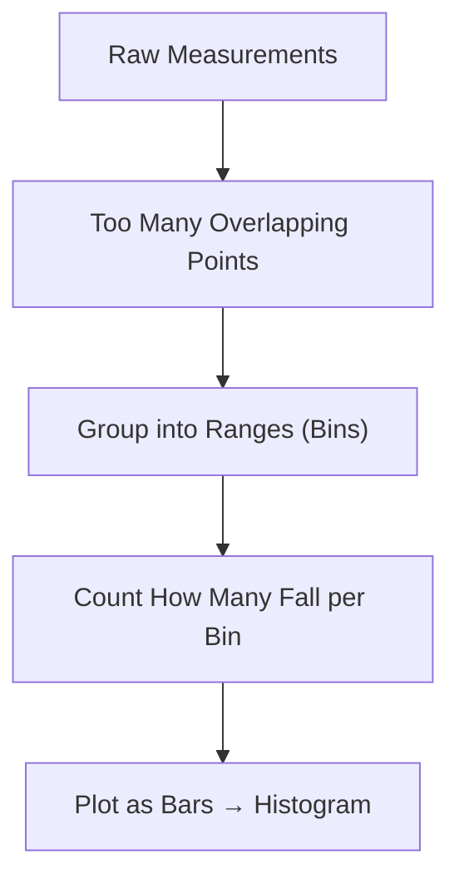
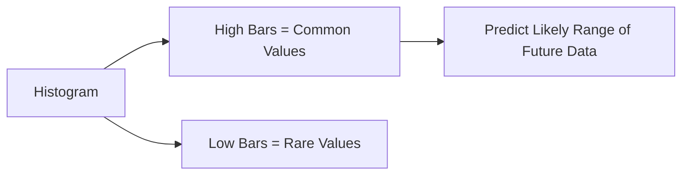
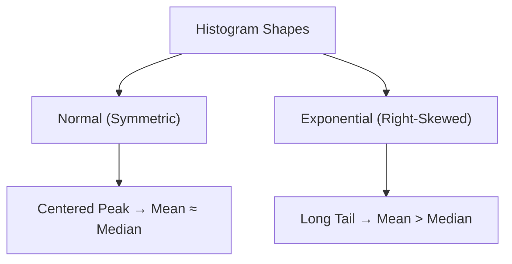
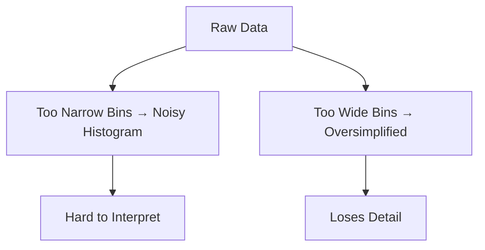
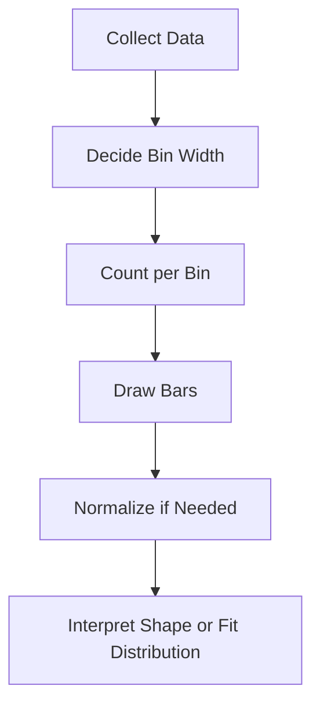

:::info Careful

Formulas rendered twice, one in english and another in math

:::

#  Histograms

---

## Introduction

A **histogram** is one of the most important tools in statistics for visualizing
the distribution of numerical data.  
When you have many observations, plotting each one individually (like a dot on a
line) quickly becomes unreadable.  
A histogram solves this by **grouping values into ranges** (called **bins**) and
showing how many data points fall inside each range.

---

### Conceptual Overview



This flow shows how raw data are transformed into a readable structure.
Individual overlapping points are grouped into bins, and the count in each bin
is shown by bar height. The result is a simple, informative picture of how the
data are distributed.

---

### Visual Example

When dots begin to overlap, patterns disappear:


Grouping similar values together reveals structure and variation:


Each bar’s height reflects how many observations fall in that range. The
histogram turns scattered data into a shape that represents data density.

---

## Using Histograms to Understand Data

Histograms tell a story about the data:

- **Tall bars** show frequent values.
- **Short bars** show rare or extreme values.
- The **overall shape** reveals how the variable behaves.

---

### Concept Flow



This shows how histograms link the present to prediction. High bars reveal
common outcomes, and from them we estimate where future data are most likely to
fall.

---

### Real Example


The central region with the tallest bars marks where most data points appear and
where future observations are most probable.

---

## Connecting Histograms to Probability Distributions

Histograms can reveal which **probability distribution** best fits the data.

- A **symmetric** shape suggests a **Normal distribution**.
- A **right-skewed** shape suggests an **Exponential** or **Log-normal**
  distribution.

---

### Conceptual Contrast



This shows how shape connects to interpretation. If the peak is centered, the
mean and median are close — a normal pattern. If the tail extends rightward,
large values occur occasionally, a hallmark of right-skewed data.

---

### Example Visuals

**Symmetric Example:**


**Right-Skewed Example:**


---

## The Challenge of Choosing Bin Width

Bin width controls how detailed or smooth the histogram appears.

---

### Concept Comparison



Narrow bins add noise; wide bins hide structure. A balanced width preserves both
detail and clarity.

---

### Visual Comparison

**Too Narrow:** 

**Too Wide:** 

The best width depends on the dataset. A rule such as **Freedman–Diaconis**
adapts well to most data types.

---

## Why Histograms Matter

Histograms help:

- Detect clusters and outliers
- Assess symmetry and skewness
- Estimate probabilities
- Guide model selection
- Provide the first look at how data behave

---

# Deeper Learning

---

## 1. Mathematical Meaning

A histogram estimates the **probability density function (PDF)** of data. For a
bin centered at $x_i$:

$$
\hat{f}(x_i) = \frac{n_i}{n \cdot h}
$$

where $n_i$ = count in bin $i$, $n$ = total observations, $h$ = bin width.

If normalized, the total area equals 1:

$$
\sum_i \hat{f}(x_i) \cdot h = 1
$$

The area under each bar represents the probability of falling within that
interval.

---

### Concept Illustration

```
Bin Count ÷ (Total × Width) = Density
Density × Width = Probability
```

Counts are converted into densities, and densities describe probabilities.

---

## 2. Rules for Choosing Number of Bins

| Rule                  | Formula                    | Description            |
| --------------------- | -------------------------- | ---------------------- |
| **Sturges’**          | $k = 1 + \log_2(n)$        | Good for small data    |
| **Rice**              | $k = 2n^{1/3}$             | General purpose        |
| **Freedman–Diaconis** | $h = 2\frac{IQR}{n^{1/3}}$ | Robust for skewed data |

$IQR = Q_3 - Q_1$

---

## 3. Example Calculation

Heights (cm): `[150, 155, 156, 160, 162, 164, 166, 168, 172, 180]` Range = 30,
Bins = 5, Bin width = $30 / 5 = 6$

| Bin (cm) | Count |
| -------- | ----- |
| 150–156  | 3     |
| 156–162  | 2     |
| 162–168  | 3     |
| 168–174  | 1     |
| 174–180  | 1     |

Most values fall between 150–168 cm, giving a mild right skew.

---

## 4. Process Overview



Each step refines raw data into a model of probability. Good decisions at each
stage ensure the histogram accurately represents the data.

---

## 5. Recap Through Visuals

| Concept              | Illustration                                             |
| -------------------- | -------------------------------------------------------- |
| Overlapping raw data |         |
| Clear histogram      |  |
| Too narrow bins      |                |
| Too wide bins        |                    |
| Skewed distribution  |      |
| Central range focus  |            |

---

## Summary

Histograms convert raw numerical data into a simple, structured visual summary.
They show where values cluster, where extremes occur, and what patterns shape
the data distribution. Through binning, histograms reveal the **underlying
probability structure** of a dataset — bridging the gap between simple counts
and statistical reasoning.

**Key Insights:**

- They approximate a probability density function (PDF).
- The total area under a normalized histogram equals 1.
- Bin width dramatically affects how data patterns appear.
- Proper interpretation helps in model selection and probability prediction.

A well-designed histogram is not just a graph — it is your **first statistical
model**.

---

## Questions & Answers

**Q1. What does each bar in a histogram represent?** Each bar represents the
count (or probability, if normalized) of data points falling within a specific
range of values.

**Q2. Why do we divide data into bins?** Because individual data points overlap
when plotted; bins group nearby values together to reveal structure.

**Q3. What does normalization (`density=True`) do?** It scales the bars so that
the total area under the histogram equals 1, allowing interpretation as a
probability density.

**Q4. What happens if bins are too narrow or too wide?**

- Too narrow → noisy, hard to read
- Too wide → oversimplified, hides detail

**Q5. How can we choose a good bin width?** Use statistical rules like
**Sturges**, **Rice**, or the **Freedman–Diaconis** rule for optimal bin sizing.

**Q6. How are histograms different from bar charts?** Histograms are for
**continuous numerical data** with connected bins, while bar charts are for
**categorical data** with separated bars.

**Q7. What does the total area under a normalized histogram represent?** The
total probability, which equals **1** — just like a probability distribution.

---
