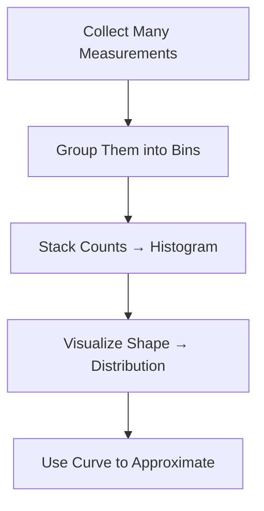
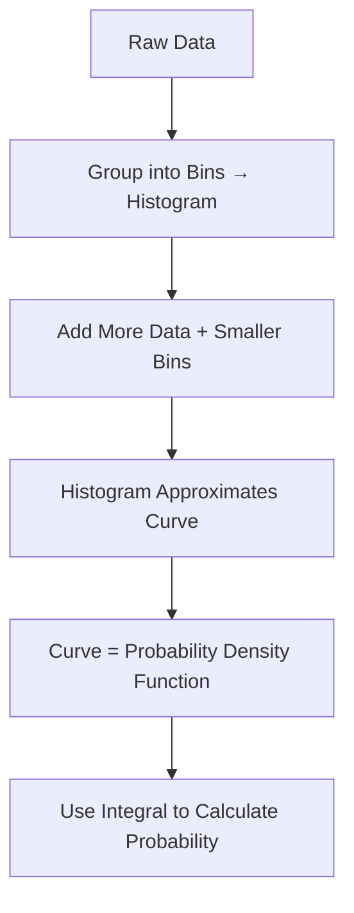

# What Is a Distribution?

---

## Introduction

In statistics, **a distribution** describes how values of a variable are
**spread or arranged**.  
It tells us which values occur more often, which are rare, and how likely it is
to get a value in a specific range.

Imagine you're at a party and overhear someone saying,

> “That dataset has a Normal distribution.”

They’re talking about how data points — like people’s **heights** — are
distributed across possible values.

---

### Concept Overview

---

## From Data to Distribution

Let’s start simple.

We measure a bunch of people’s heights:

| Person | Height (ft) | Bin (ft range) |
| ------ | ----------- | -------------- |
| 1      | 5.2         | 5.0–5.5        |
| 2      | 5.8         | 5.5–6.0        |
| 3      | 5.6         | 5.5–6.0        |
| 4      | 5.9         | 5.5–6.0        |
| 5      | 5.1         | 5.0–5.5        |
| 6      | 6.3         | 6.0–6.5        |

When we count how many fall into each bin, we get this histogram:

Most people are between **5 and 6 feet tall**, meaning measurements here are
**more frequent** (higher probability).

---

## Understanding Probability from Histograms

The histogram gives us an intuitive sense of **how likely** different heights
are:

- Short bars → rare events (e.g., < 5 ft or > 6 ft)
- Tall bars → common events (e.g., around 5.5 ft)

So if we pick a person at random, it’s very likely they fall between **5 and 6
ft**.

---

## Refining the Picture: Smaller Bins

If we reduce the bin width (say, from 0.5 ft to 0.25 ft), we get a **more
detailed** view of how measurements vary.

Now we can say things like:

> Half the people are between 5.25 and 5.75 feet tall.

The smaller the bins and the more data we collect, the **closer our histogram
approximates the true distribution**.

---

## From Histogram to Curve

Once we have enough data, we can **draw a smooth curve** that passes through the
tops of the histogram bars.

This curve is the **Probability Density Function (PDF)** — a continuous version
of the histogram.

Both show the same thing:

- Where data is dense (high peaks)
- Where data is rare (flat tails)

But the curve offers two big advantages.

---

### 1. It Fills the Gaps Between Bins

Even if a bin has **no data**, the curve can estimate the probability there.

So, we can still ask:

> “What’s the chance of someone being 5.3 ft tall?” even if we didn’t measure
> exactly that height.

---

### 2. It Allows Continuous Probability

A curve lets us compute probabilities for **any range**, even very precise ones
— e.g., between **5.021 and 5.317 ft**.

This is possible using **calculus**:

$$
P(a < X < b) = \int_a^b f(x),dx
$$

This area under the curve gives the probability that a random observation lies
between `a` and `b`.

---

### 3. It Saves Time and Money

When we have limited data, a curve can still be estimated from just a few
summary statistics — typically the **mean** and **standard deviation**.

This gives us a quick, good-enough model of the underlying distribution without
collecting thousands of measurements.

---

## Mathematical Meaning

Both the **histogram** and the **curve** represent a **distribution** — a
mapping of how probabilities are spread across values.

### Key Characteristics

| Concept               | Meaning                                |
| --------------------- | -------------------------------------- |
| **Mode**              | Peak — most frequent or likely value   |
| **Mean**              | Average value                          |
| **Variance / Spread** | How dispersed the data is              |
| **Skewness**          | Whether the tail is longer on one side |
| **Kurtosis**          | How “peaked” or “flat” the curve is    |

---

### Probability Density Function (PDF)

For continuous data:

$$
\int_{-\infty}^{+\infty} f(x),dx = 1
$$

For discrete data (like bins):

$$
\sum_i P(x_i) = 1
$$

Both express that **total probability = 1**.

---

## Connecting Histogram and PDF

| Histogram                   | Probability Density Function   |
| --------------------------- | ------------------------------ |
| Discrete bars for frequency | Smooth curve for density       |
| Bin-dependent               | Bin-independent                |
| Area of bars = probability  | Area under curve = probability |
| Empirical (from data)       | Theoretical (from model)       |

Both are valid **distributions** — one empirical, one analytical.

---

## Concept Flow Summary

---

## Types of Distributions (Preview)

Every dataset has its own **shape**:

| Type            | Shape                  | Example              |
| --------------- | ---------------------- | -------------------- |
| **Normal**      | Bell-shaped, symmetric | Heights, exam scores |
| **Uniform**     | Flat                   | Dice rolls           |
| **Exponential** | Long tail              | Waiting times        |
| **Bimodal**     | Two peaks              | Mixed populations    |
| **Skewed**      | One side stretched     | Incomes              |

We’ll explore each in future lessons.

---

## Summary

- A **distribution** shows how data values are spread across a range.
- A **histogram** is a visual representation of frequencies.
- A **curve (PDF)** provides a smooth, continuous version of that histogram.
- The **area under the curve = 1**, representing total probability.
- Curves help estimate probabilities even where no data was measured.

---

## Practice Questions

1. What does the area under a probability curve represent? → The total
   probability (always equals 1).

2. What is the main advantage of a curve over a histogram? → It allows
   probability calculation for any continuous range.

3. If a distribution is symmetric and bell-shaped, what type is it? → Normal
   distribution.

4. What does a histogram with a long right tail indicate? → Right-skewed or
   exponential distribution.

5. How can we compute the probability between two heights `a` and `b`? → By
   integrating the PDF: $\int_a^b f(x),dx$.

---

> **Key Takeaway:** A distribution — whether discrete (histogram) or continuous
> (curve) — describes _how likely_ each value is, forming the foundation of all
> statistical reasoning.
