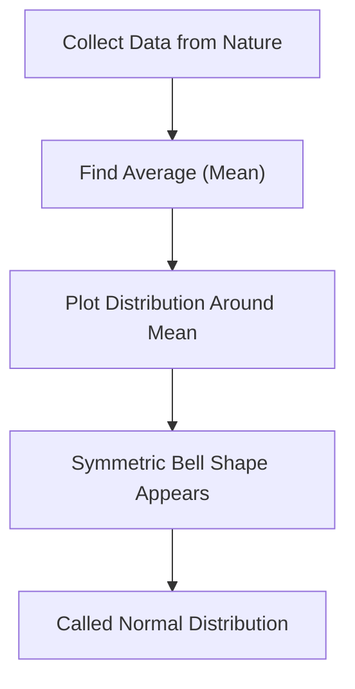
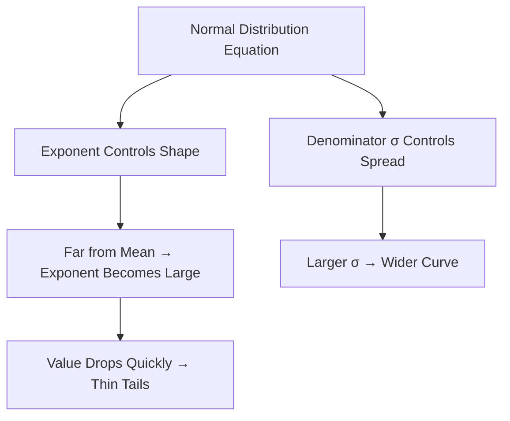

# The Normal (Gaussian) Distribution

---

## Introduction

The **Normal Distribution**, also known as the **Gaussian Distribution** or
**Bell Curve**, is one of the most important concepts in statistics.  
It appears in natural processes like **height**, **weight**, **IQ**, **exam
scores**, **errors in measurement**, and much more.

It’s called _“normal”_ not because it’s ordinary, but because **many natural and
human phenomena naturally follow this pattern** — symmetric and centered around
an average value.

---

### Concept Overview



The **bell shape** represents how likely each value is relative to the mean:

- Most data cluster near the **average** (center of the curve).
- Very low or very high values occur **rarely**, forming the thin “tails.”

---

## Understanding the Bell Curve

Imagine we record the **height** of many people:

- Some are short
- Most are average
- A few are tall

Plotting their frequencies gives a **bell-shaped curve**:


The **Y-axis** represents the _relative probability_ of observing each height.

- **Low ends** → few very short people.
- **Middle** → many people near the average.
- **Right end** → few very tall people.

---

## Real-World Example: Heights of Males

Here are two normal distributions representing **male heights**:

- One for **newborn babies**
- One for **adult males**


| Group      | Mean Height (inches) | Standard Deviation (SD) | Spread Range (≈95%) |
| ---------- | -------------------- | ----------------------- | ------------------- |
| **Babies** | 20                   | 0.6                     | 18.8 – 21.2         |
| **Adults** | 70                   | 4                       | 62 – 78             |

Notice that:

- The **adult curve** is **wider and shorter** (more spread-out heights).
- The **baby curve** is **narrower and taller** (less variation).

---

### Why the Difference?

The **standard deviation (SD)** determines the **width** of the curve.

- **Small SD** → narrow and tall (values tightly packed)
- **Large SD** → wide and short (values more spread out)

---

### Concept Flow

```mermaid
graph TD
A[Mean (Average)] --> B[Center of the Curve]
B --> C[Standard Deviation (SD)]
C --> D[Determines Width and Height]
D --> E[Smaller SD = Tall Curve; Larger SD = Wide Curve]
```

---

## The Role of Standard Deviation

The Normal Distribution follows a precise rule known as the **68–95–99.7 Rule**:

| Range  | Meaning     | Probability |
| ------ | ----------- | ----------- |
| μ ± 1σ | Within 1 SD | ~68%        |
| μ ± 2σ | Within 2 SD | ~95%        |
| μ ± 3σ | Within 3 SD | ~99.7%      |

For babies (μ = 20, σ = 0.6):

$$
95% = 20 \pm (2 \times 0.6) = [18.8, 21.2]
$$

For adults (μ = 70, σ = 4):

$$
95% = 70 \pm (2 \times 4) = [62, 78]
$$

Thus, **95% of all measurements** fall within two standard deviations from the
mean.


---

## Mathematical Definition

The **probability density function (PDF)** of a normal distribution is:

$$
f(x) = \frac{1}{\sqrt{2\pi\sigma^2}} e^{-\frac{(x - \mu)^2}{2\sigma^2}}
$$

Where:

- $\mu$ = mean (center)
- $\sigma$ = standard deviation (spread)
- The total area under the curve = **1**

---

### Intuitive Meaning



The exponent term ensures that the curve quickly decreases as we move away from
the mean — explaining why extreme values are so rare.

---

## Properties of the Normal Distribution

| Property                    | Description                              |
| --------------------------- | ---------------------------------------- |
| **Symmetry**                | Perfectly mirrored about the mean        |
| **Mean = Median = Mode**    | All at the center                        |
| **Total Area = 1**          | Represents total probability             |
| **Defined by μ and σ only** | Fully determined by these two parameters |
| **Continuous**              | Values can take any real number          |
| **Unimodal**                | Has only one peak                        |

---

## Why the Normal Distribution Is So Common

Many small, independent effects combine to form an outcome — and when they do,
their sum tends to follow a normal distribution. This powerful principle is
called the **Central Limit Theorem (CLT)**.

It explains why normal distributions appear **so often in nature**:

- Heights = genetics + nutrition + growth environment
- Test scores = knowledge + focus + luck
- Measurement errors = many small inaccuracies added up

---

## Applications in Real Life

| Field              | Example                            |
| ------------------ | ---------------------------------- |
| **Medicine**       | Blood pressure, cholesterol levels |
| **Engineering**    | Manufacturing tolerances           |
| **Finance**        | Stock returns (approximate)        |
| **Education**      | Test scores, IQ                    |
| **Social Science** | Survey responses, reaction times   |

---

## Summary

- The **Normal Distribution** (bell curve) is symmetric, centered, and shaped by
  the **mean** and **standard deviation**.
- **Smaller σ** → narrow, tall curve. **Larger σ** → wide, short curve.
- 68–95–99.7% of values fall within 1–3 standard deviations from the mean.
- It’s **ubiquitous in nature** because of the **Central Limit Theorem**.
- The **PDF** defines its exact mathematical behavior.

---

## Practice Questions

1. What two parameters define a normal distribution? → The **mean (μ)** and
   **standard deviation (σ)**.

2. What does a large σ indicate about the data? → It’s more spread out; curve is
   wider and shorter.

3. What percentage of data falls within ±2σ from the mean? → Approximately 95%.

4. Why do normal distributions appear so frequently in real life? → Because of
   the **Central Limit Theorem** — many small independent effects combine to
   form a normal pattern.

5. In a bell curve, where are extreme values found? → In the **tails** — far
   from the mean, with low probability.

---

> **Key Takeaway:** The Normal Distribution connects probability, data
> variation, and natural phenomena. It’s the foundation of most statistical
> modeling and inference.

<iframe width="100%" height="615" src="https://www.youtube.com/embed/rzFX5NWojp0?si=2830x3hTAKU-BHLt" title="YouTube video player" frameborder="0" allow="accelerometer; autoplay; clipboard-write; encrypted-media; gyroscope; picture-in-picture; web-share" referrerpolicy="strict-origin-when-cross-origin" allowfullscreen></iframe>
