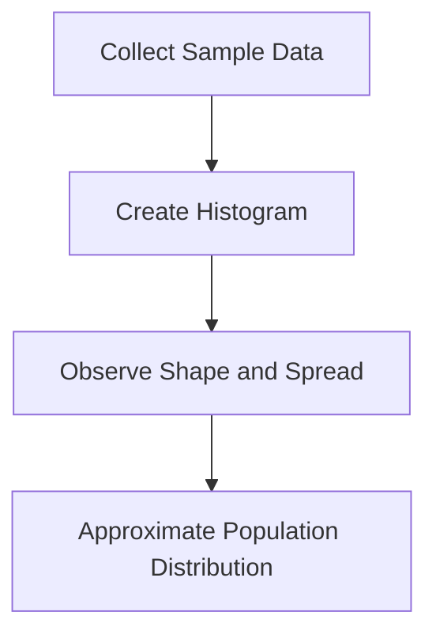
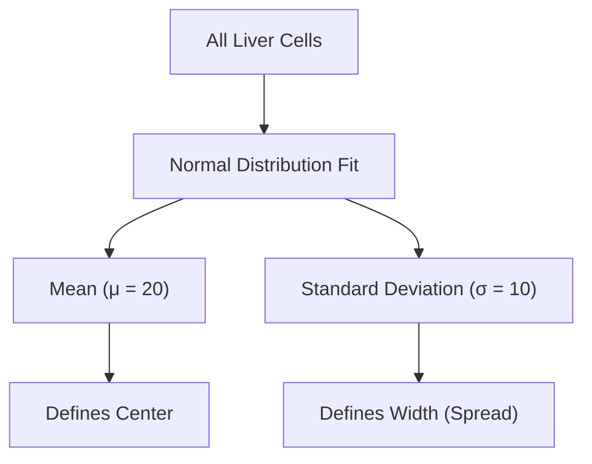
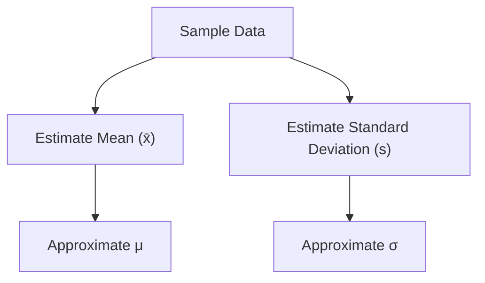
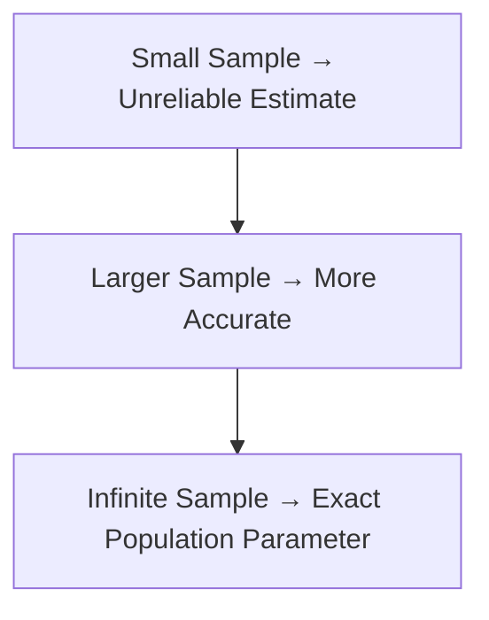
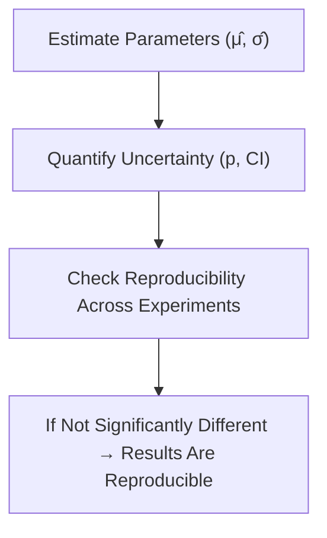

# Population Parameters

---

## Introduction

In statistics, **population parameters** describe the characteristics of an
entire group (the _population_).  
Since we can rarely measure every member of a population, we use **samples** to
estimate these parameters.  
This concept forms the foundation of **statistical inference** — drawing
conclusions about a population based on a limited dataset.

---

## From Observations to Histograms

Imagine we measure **mRNA transcripts** for gene X in a few liver cells.

| Cell | Transcripts |
| ---- | ----------- |
| 1    | 3           |
| 2    | 13          |
| 3    | 19          |
| 4    | 24          |
| 5    | 29          |

If we could measure **all 240 billion** liver cells, we would know the exact
**population distribution**.

Since we can’t, we start with a **sample**.

---

### Concept Overview



---

### Real Data Illustration


The histogram shows that most liver cells have between **20–30 transcripts**,
and very few have less than 10 or more than 30.

This histogram is roughly **bell-shaped**, so we can model it using a **Normal
Distribution**.

---

## The Population Distribution

The corresponding **normal distribution** has:

- **Mean (μ)** = 20
- **Standard Deviation (σ)** = 10

The **mean** marks the center of the data, while the **standard deviation**
determines its spread.

---

### Population Representation



This curve represents the **entire population**, meaning it contains data for
_every cell_ — a complete statistical picture.

---

## Population Parameters

Since the histogram represents all 240 billion liver cells, the **mean** and
**standard deviation** of this distribution are called **population
parameters**.

| Parameter                         | Symbol | Meaning                           |
| --------------------------------- | ------ | --------------------------------- |
| **Population Mean**               | μ      | Central average of the population |
| **Population Standard Deviation** | σ      | Measure of spread or variability  |

They define how the distribution fits the data perfectly — **no sampling
error**.

---

### Alternative Population Shapes

Not all populations are normally distributed.

1. **Exponential Distribution** – Describes waiting times or time between
   events. Controlled by **rate (λ)**.

   ```mermaid
   graph TD
   A["Population Data (Right-Skewed)"] --> B["Fit Exponential Distribution"]
   B --> C["Parameter: Rate (λ)"]
   ```

   

2. **Gamma Distribution** – Describes positive continuous data with variable
   shapes. Controlled by **shape (k)** and **rate (θ)**.

   ```mermaid
   graph TD
   A["Population Data (Various Shapes)"] --> B["Fit Gamma Distribution"]
   B --> C["Parameters: Shape (k), Rate (θ)"]
   ```

   

---

## Estimating Population Parameters

Since we can’t measure every data point, we use **samples** to estimate
population parameters.

Example: We only have measurements from **5 cells** out of 240 billion.

| Cell | Transcripts |
| ---- | ----------- |
| 1    | 3           |
| 2    | 13          |
| 3    | 19          |
| 4    | 24          |
| 5    | 29          |

These provide **sample estimates** of μ and σ.

---

### Process Flow



---

### Sample Estimation Example

| Trial       | Estimated μ | Estimated σ |
| ----------- | ----------- | ----------- |
| **Trial 1** | 17.6        | 10.1        |
| **Trial 2** | 19.2        | 12.7        |

Each time we repeat the experiment, our estimates vary slightly. But as we
**collect more data**, our estimates get **closer to the true values**.

---

### The Law of Large Numbers

As sample size increases:

- The **sample mean** → approaches the **population mean (μ)**
- The **sample standard deviation** → approaches the **population σ**



---

## Confidence and Reproducibility

One goal of statistics is to quantify **confidence** in our estimates.

We use tools such as:

- **p-values** – To check significance
- **Confidence Intervals (CI)** – To express uncertainty in estimated parameters

The **larger the sample**, the **smaller the uncertainty**.

---

### Conceptual Connection



---

## Key Observations

| Concept        | Meaning                                    |
| -------------- | ------------------------------------------ |
| **Population** | Entire group being studied                 |
| **Sample**     | Subset used to estimate parameters         |
| **Parameter**  | True (unknown) value describing population |
| **Statistic**  | Estimated value from the sample            |
| **Goal**       | Infer parameters from sample data reliably |

---

## Summary

- A **population** represents the complete dataset (e.g., all liver cells).
- **Population parameters** (μ, σ) describe its true mean and spread.
- We rarely have full data — so we **estimate** parameters using **samples**.
- **Larger samples** → higher accuracy and confidence.
- Confidence intervals and p-values quantify how sure we are of those estimates.
- Estimating population parameters allows results to be **reproducible** and
  **scientifically valid**.

---

## Practice Questions

1. What are **population parameters**? → Numerical values (like mean and SD)
   that describe the entire population.

2. Why can’t we usually compute population parameters exactly? → Measuring every
   element of a population is impractical.

3. What happens to estimate accuracy as sample size increases? → Accuracy
   improves and estimates converge to true values.

4. What is the difference between **parameter** and **statistic**? → A parameter
   describes the population; a statistic estimates it from a sample.

5. How do confidence intervals relate to population parameters? → They express
   uncertainty in estimated population values.

---

> **Key takeaway:** Population parameters describe the entire dataset, but we
> estimate them from samples to make **reliable, reproducible conclusions**.

<iframe width="100%" height="615" src="https://www.youtube.com/embed/vikkiwjQqfU?si=WJIaPxyOGoCTpM5H" title="YouTube video player" frameborder="0" allow="accelerometer; autoplay; clipboard-write; encrypted-media; gyroscope; picture-in-picture; web-share" referrerpolicy="strict-origin-when-cross-origin" allowfullscreen></iframe>
