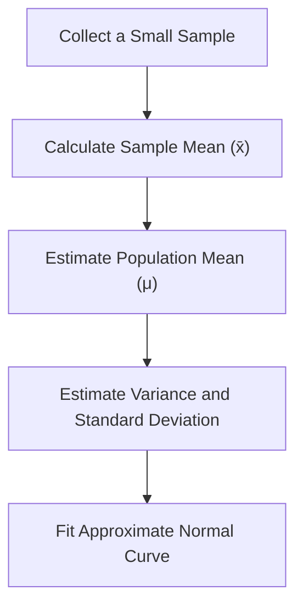
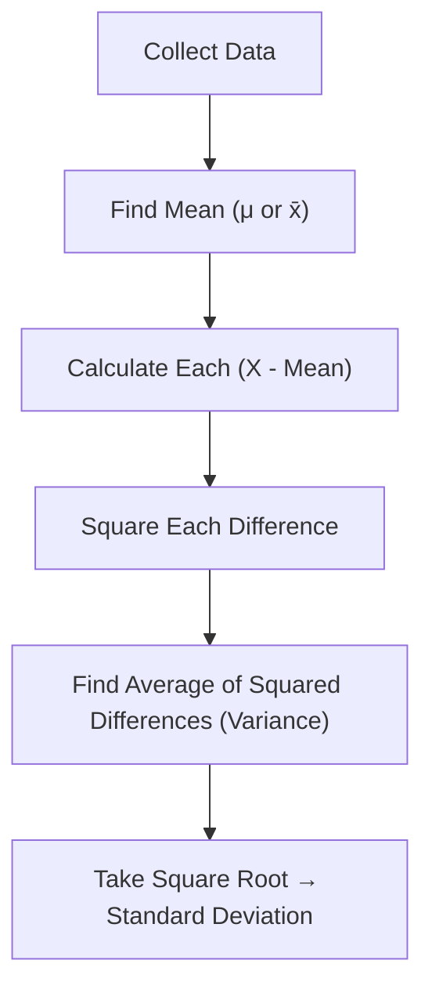
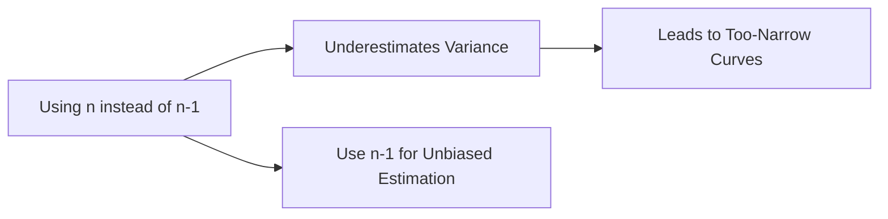
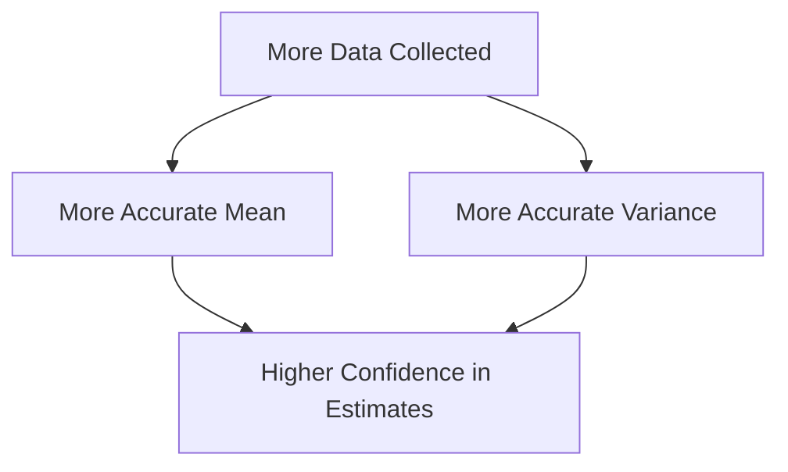

# Estimating the Mean, Variance, and Standard Deviation

---

## Introduction

In this StatQuest, we explore how to **estimate the population mean, variance,
and standard deviation** from a sample of data.  
Even if we could measure all data points in a population, it’s rarely practical
or affordable.  
So, instead of calculating exact population parameters, we **estimate** them
using smaller samples.

---

### Concept Overview

---

## 1. Population vs Sample

Imagine counting the number of **mRNA transcripts** from gene X in **five
different liver cells**. Alternatively, think of counting **green apples** in
five grocery stores or **green T-shirts** in five shops.

| Cell | mRNA Count |
| ---- | ---------- |
| 1    | 3          |
| 2    | 13         |
| 3    | 19         |
| 4    | 24         |
| 5    | 29         |

If we had unlimited time and money, we could count all **240 billion liver
cells** — that’s the **entire population**. But in practice, we rely on just a
few measurements (the **sample**).

---

### Visual Representation

The histogram of all 240 billion cells would form a smooth **normal
distribution** with a **mean (μ) = 20** and **standard deviation (σ) = 10**.

---

## 2. Calculating the Population Mean

If we had access to the full dataset:

$$
\mu = \frac{\sum X_i}{N}
$$

- ( X_i ) = each data point
- ( N ) = number of data points (240 billion)

Example: Average of all mRNA counts → **μ = 20**

Since this uses all values, it’s the **true population mean**, not an estimate.

---

### Estimating the Mean from a Sample

When we only have a few samples:

$$
\bar{x} = \frac{\sum x_i}{n}
$$

- ( x_i ) = sample data points
- ( n ) = number of samples

Example: For [3, 13, 19, 24, 29],

$$
\bar{x} = 17.6
$$

This is our **estimated population mean**.

---

### Key Difference

| Symbol | Meaning                 | Formula                |
| ------ | ----------------------- | ---------------------- |
| μ      | Population Mean         | $( \frac{\sum X}{N} )$ |
| x̄      | Sample (Estimated) Mean | $( \frac{\sum x}{n} )$ |

With larger samples, ( x̄ ) → μ.

---

## 3. Understanding Variance and Standard Deviation

Variance measures how spread out the data is from the mean. The **standard
deviation** is the square root of variance, bringing it back to the same units
as the data.

---

### Concept Flow

---

### Population Variance

If we have every value in the population:

$$
\sigma^2 = \frac{\sum (X_i - \mu)^2}{N}
$$

Then,

$$
\sigma = \sqrt{\sigma^2}
$$

Example: Population Variance = 100 Population SD = √100 = 10

---

### Estimating from a Sample

We almost never know μ, so we use x̄ and divide by ( n - 1 ):

$$
s^2 = \frac{\sum (x_i - \bar{x})^2}{n - 1}
$$

$$
s = \sqrt{s^2}
$$

Dividing by ( n - 1 ) instead of ( n ) corrects for the bias that occurs when
estimating from limited data. This adjustment is called **Bessel’s Correction**.

---

### Conceptual Reasoning

---

## 4. Practical Example

| Sample | Value |
| ------ | ----- |
| x₁     | 3     |
| x₂     | 13    |
| x₃     | 19    |
| x₄     | 24    |
| x₅     | 29    |

**Sample Mean (x̄)** = 17.6

**Estimated Variance:**

$$
s^2 = \frac{(3-17.6)^2 + (13-17.6)^2 + (19-17.6)^2 + (24-17.6)^2 + (29-17.6)^2}{5 - 1} = 101.8
$$

**Estimated Standard Deviation:**

$$
s = \sqrt{101.8} = 10.1
$$

This gives a bell curve centered near 17.6, slightly left of the true mean (20),
but with a similar spread.

---

### Visual Comparison

| Type                   | Mean | SD   | Curve Example                                    |
| ---------------------- | ---- | ---- | ------------------------------------------------ |
| True Population Curve  | 20   | 10   |  |
| Estimated Sample Curve | 17.6 | 10.1 |    |

---

## 5. Relationship Between Mean and Variance

The **mean** determines the center of the distribution, and the **variance**
determines its spread.

More data → more accurate estimates of both. With small samples, estimates vary
between experiments, but remain statistically consistent.

---

### Concept Recap

---

## 6. Software Note

In software like **Excel**, you’ll see two variance functions:

| Function  | Description         | Use When...       |
| --------- | ------------------- | ----------------- |
| `VAR.P()` | Population variance | You have all data |
| `VAR.S()` | Sample variance     | You have a sample |

Since we almost always work with samples, **use VAR.S()** in Excel.

---

## 7. Summary

| Concept                | Population Formula             | Sample Estimate                  | Symbol  |
| ---------------------- | ------------------------------ | -------------------------------- | ------- |
| **Mean**               | $( \frac{\sum X}{N} ) $        | $( \frac{\sum x}{n} ) $          | μ / x̄   |
| **Variance**           | $( \frac{\sum (X - μ)^2}{N} )$ | $( \frac{\sum (x - x̄)^2}{n-1} )$ | σ² / s² |
| **Standard Deviation** | √Variance                      | √Variance                        | σ / s   |

- Larger sample → better estimation
- Use ( n-1 ) correction for unbiased variance
- Variance shows spread, SD gives spread in actual units

---

## 8. Practice Q&A

**Q1.** Why divide by ( n - 1 ) when estimating variance? **A1.** It corrects
the underestimation bias caused by using the sample mean instead of the true
population mean.

**Q2.** What happens if we divide by ( n ) instead? **A2.** The variance
estimate will be too small, underestimating variability.

**Q3.** Why square deviations in the variance formula? **A3.** To ensure all
differences are positive and emphasize larger deviations.

**Q4.** What is Bessel’s correction? **A4.** The adjustment that replaces ( n )
with ( n - 1 ) in the denominator to produce an unbiased estimate.

**Q5.** Why is standard deviation more interpretable than variance? **A5.** It’s
in the same units as the data, unlike variance which is in squared units.

---

> **Key Takeaway:** We rarely know population parameters, so we estimate them
> using sample data. The more samples we collect, the closer our estimates (x̄,
> s², s) approach the true parameters (μ, σ², σ).

<iframe width="100%" height="600" src="https://www.youtube.com/embed/SzZ6GpcfoQY?si=2yRegRjlHsakLI1F" title="YouTube video player" frameborder="0" allow="accelerometer; autoplay; clipboard-write; encrypted-media; gyroscope; picture-in-picture; web-share" referrerpolicy="strict-origin-when-cross-origin" allowfullscreen></iframe>
