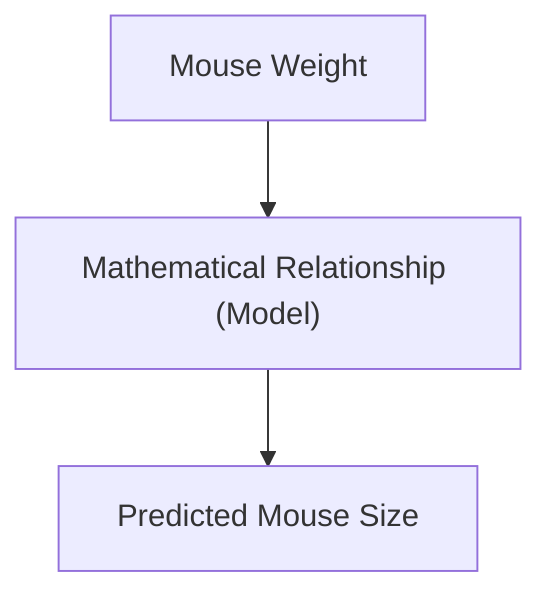
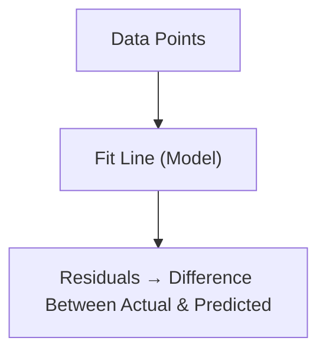
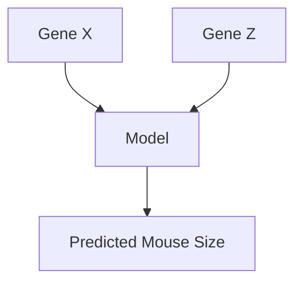

---

title: What is a (Mathematical) Model?
sidebar_position: 77
--------------------

# Understanding Statistical Models

---

## Introduction

In this lesson, we explore **what a model is** in the context of **statistics
and data analysis**. The StatQuest video begins with a fun reminder that the
word “model” can mean different things in different contexts — but in
statistics, it has a very specific meaning tied to **relationships** and
**prediction**.

---

## What Does “Model” Mean?

### Everyday Meanings

- As a kid — a model could mean a **toy** you glue together.
- As a teen — it could mean someone who **wears fancy clothes**.
- As a data scientist — it refers to a **mathematical representation** of
  reality.

### In Statistics

A **model** describes the **relationship between variables** — how one variable
changes in response to another.

For example, we might **model mouse size based on mouse weight**.

---

## Modeling a Relationship

The goal of modeling is to **capture how one factor influences another**.

In this example:

- Heavier mice → tend to be larger.
- Lighter mice → tend to be smaller.

Thus, the model expresses this **positive relationship** between size and
weight.

---

## The Model as an Equation

A **model** can also be expressed mathematically. Suppose the relationship
between mouse weight ($x$) and size ($y$) is approximately linear:

$$
y = 0.8x + 0.1
$$

This equation tells us how to **predict** the size of a mouse given its weight.

If a mouse weighs **4 units**, we plug that into the equation:

$$
y = 0.8(4) + 0.1 = 3.3
$$

✅ **Predicted mouse size = 3.3 units**

---

### Visualizing the Model (Light Theme)

Here:

- The **solid line** is our model — it summarizes the relationship.
- The **dots** represent real observations (data points).

The line allows us to predict values even for mice we haven’t measured yet.

---

## Real Data vs. Model Predictions

The model is never perfect — it’s an **approximation** of the real data. The
**dotted lines** (called **residuals**) show the **difference between actual and
predicted values**.

A smaller residual means the model fits the data well. A larger residual means
the prediction is less accurate.

---

### Why Statistics Matter Here

A big part of statistics is figuring out:

- How well a model fits the data.
- Whether the observed relationships are **real** or **due to chance**.
- How confident we can be about predictions.

This leads to concepts like:

- **Linear Regression**
- **ANOVA (Analysis of Variance)**
- **t-tests** and **F-tests**
- **General Linear Models (GLMs)**

Each of these helps evaluate how good or bad a model is at explaining the data.

---

## Non-Linear Models

Not all relationships are straight lines. Some are **curved** — for example, the
relationship between **drug dosage and hair growth**.

At first, more of the drug increases hair growth, but after a certain point,
**extra doses no longer help** — or may even reduce growth.

This is a **non-linear model**, showing diminishing returns — a common
real-world pattern.

---

## Modeling with Multiple Variables

Sometimes, one variable isn’t enough. We can include **multiple predictors** to
improve accuracy.

Here, we use both **Gene X** and **Gene Z** to model **mouse size**. This is an
example of a **multiple regression model** — a type of multivariable model.

---

## Summary

| Concept                | Explanation                                          |
| ---------------------- | ---------------------------------------------------- |
| **Model (Definition)** | A representation of a relationship between variables |
| **Purpose**            | To explain or predict outcomes                       |
| **Example**            | Mouse size modeled using mouse weight                |
| **Equation**           | $y = 0.8x + 0.1$ (a simple linear model)             |
| **Residuals**          | Differences between observed and predicted values    |
| **Statistical Tools**  | Regression, ANOVA, t-tests, F-tests                  |
| **Model Types**        | Linear, Non-linear, Multivariable                    |

---

## Practice Questions

1. What is a “model” in statistics? → A mathematical or conceptual
   representation of relationships between variables.

2. What do we mean by “residuals”? → The difference between actual data points
   and model predictions.

3. What is an example of a non-linear model? → Drug dosage vs. hair growth curve
   — where additional dosage stops increasing results.

4. Why do we use more than one variable in a model? → To improve accuracy and
   explain more variation in the outcome.

5. How do we measure a model’s quality? → Using statistical tests like
   **ANOVA**, **t-tests**, and **R² (coefficient of determination)**.

---

> **Key Takeaway:** A model is a simplified mathematical framework that
> describes, explains, or predicts relationships in real-world data. It can be
> linear or non-linear, simple or complex — but always aims to help us
> **understand patterns** and **make better decisions**.

<iframe width="100%" height="600" src="https://www.youtube.com/embed/yQhTtdq_y9M?si=-8nnd8tP4-yJ-8T8" title="YouTube video player" frameborder="0" allow="accelerometer; autoplay; clipboard-write; encrypted-media; gyroscope; picture-in-picture; web-share" referrerpolicy="strict-origin-when-cross-origin" allowfullscreen></iframe>
