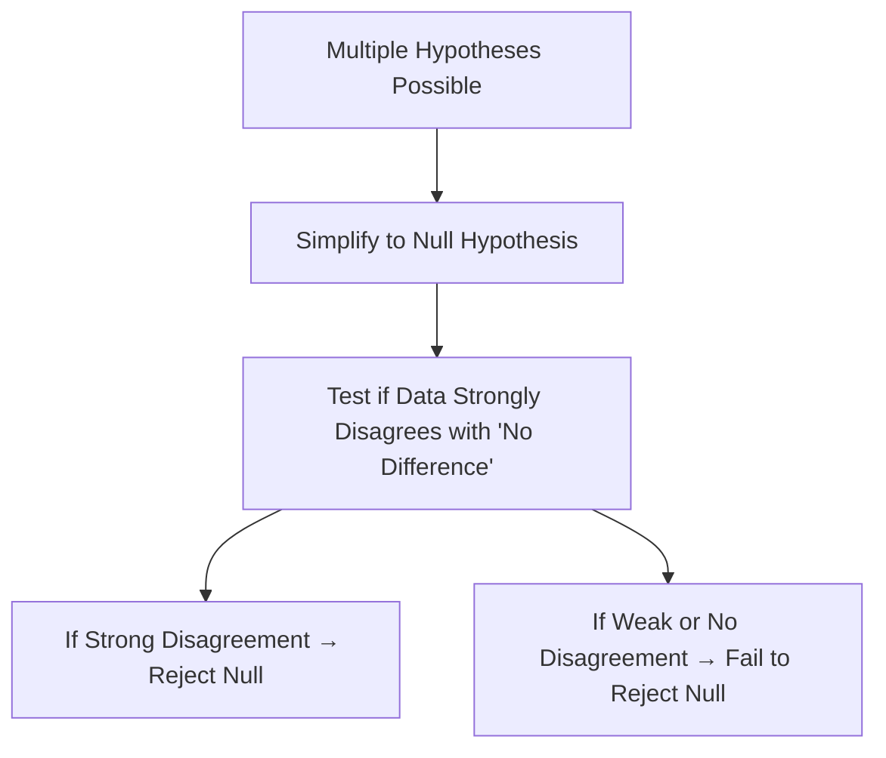

# Hypothesis Testing and the Null Hypothesis

---

## Introduction

The process of **hypothesis testing** lies at the heart of modern statistics.  
It helps us decide whether our observations reflect **real effects** or are simply the result of **random variation**.

In this StatQuest, we’ll learn how to:

- Formulate hypotheses based on data  
- Understand when to **reject** or **fail to reject** them  
- Discover the importance of the **Null Hypothesis**

---

## Scenario: Two Drugs, Two Groups

Imagine a virus spreading among people, and we have **two drugs** to test — **Drug A** and **Drug B**.

We treat three patients with each drug and measure **how long it takes to recover**.

```mermaid
graph TD
A["Drug A → 3 Patients"] --> B["Measure Recovery Time"]
C["Drug B → 3 Patients"] --> B
B --> D["Compare Average Recovery Times"]
````

---

## Observing Randomness

Even though all patients took the same drug, their **recovery times differ**.
This variation can happen due to random factors like:

* Lifestyle and exercise
* Stress levels
* Environmental conditions
* Immune system strength

So, even identical treatments can produce **slightly different outcomes**.

---

## First Hypothesis: Drug A Works Faster

From preliminary data, suppose we find that **Drug A** helps people recover **15 hours faster** than **Drug B** on average.

This leads us to our **first hypothesis**:

> **Hypothesis 1:**
> People taking Drug A need, on average, **15 fewer hours** to recover than people taking Drug B.

---

## Repeating the Experiment

When we repeat the experiment carefully, we find something shocking:
the new results show **the opposite trend** — people on Drug A take **35 more hours** to recover!

Even after rechecking everything (labels, procedures, etc.), the **same opposite result** appears again and again.

This consistent contradiction gives us strong confidence to **reject our initial hypothesis**.

---

### Visual Summary


* **Blue bars**: Drug A recoveries
* **Red bars**: Drug B recoveries
* After repeated tests → Opposite of hypothesis → **Reject it**

---

## Second Hypothesis: Drugs C and D

Now, we test **two new drugs**, **C** and **D**.

Our first experiment shows:

> People taking Drug C recover **13 hours faster** than those taking Drug D.

We repeat the experiment:

| Replicate | Observed Difference (hours) |
| --------- | --------------------------- |
| 1st Run   | 13                          |
| 2nd Run   | 12                          |
| 3rd Run   | 13.5                        |

All differences are **close**, but not exactly the same.

---

## When to Reject vs. Fail to Reject

Although the results vary slightly, they’re **not opposite** — just different due to random factors.

So, we have **no strong reason** to reject the hypothesis.

This leads us to the key distinction:

| Decision Type                 | Meaning                                    |
| ----------------------------- | ------------------------------------------ |
| **Reject Hypothesis**         | Evidence clearly contradicts it            |
| **Fail to Reject Hypothesis** | Evidence neither confirms nor disproves it |

```mermaid
graph TD
A["Collect Data"] --> B["Form Hypothesis"]
B --> C["Run Experiment"]
C --> D["Is Result Opposite or Very Different?"]
D -->|Yes| E["Reject Hypothesis"]
D -->|No, Similar| F["Fail to Reject Hypothesis"]
```

---

## The Motivation for the Null Hypothesis

When multiple plausible hypotheses exist (12 hr, 13 hr, 13.5 hr, etc.),
how do we know **which one** to test?

To avoid ambiguity, we introduce a baseline:
the **Null Hypothesis** — a statement that there is **no difference** between groups.

> **Null Hypothesis (H₀):**
> There is **no difference** between Drug C and Drug D in recovery time.

---

## Why the Null Hypothesis Helps

The null hypothesis simplifies things — it gives us a **clear, testable baseline**.

Instead of guessing the “true” difference, we ask:

> Is there enough evidence to **reject the idea of no difference**?

---

### Example: Drug E vs. Drug F

Suppose we test two new drugs and find a **tiny 0.5-hour difference**.

Small variations like diet or rest could easily change the outcome.
So, random noise might be the cause.

If tiny lifestyle differences could flip the results,
we **fail to reject** the null hypothesis — meaning there’s no convincing evidence of a real difference.

---

### Concept Flow



---

## Rejecting the Null Hypothesis

If we conduct a **large-scale experiment** with many participants,
and the results are consistently in one direction,
then random chance is unlikely to explain it.

That’s when we **reject the null hypothesis**.

> Rejecting H₀ means:
> The difference we observe is **statistically significant** — unlikely to be due to randomness.

---

## The Connection to Significance Testing

Statistical tests (like **t-tests**, **ANOVA**, and **F-tests**) are formal ways to decide whether
our results are **significant enough** to reject the null hypothesis.

We often calculate a **p-value**, which measures how likely the observed result would occur
**if the null hypothesis were true**.

---

## Summary

| Concept                  | Description                                                |
| ------------------------ | ---------------------------------------------------------- |
| **Hypothesis**           | A statement predicting an effect or difference             |
| **Reject Hypothesis**    | Data strongly contradicts the statement                    |
| **Fail to Reject**       | Data is inconclusive — could be random                     |
| **Null Hypothesis (H₀)** | Assumes no difference between groups                       |
| **p-value**              | Probability of observing current results under H₀          |
| **Goal**                 | To determine if data provides enough evidence to reject H₀ |

---

### Visual Recap


* **Left:** Opposite result → Reject hypothesis
* **Right:** Slight variation → Fail to reject

---

## Key Takeaways

* Hypotheses are **testable statements** about differences or effects.
* When evidence is strongly against a hypothesis → **Reject it**.
* When evidence is ambiguous → **Fail to reject it**.
* The **Null Hypothesis (H₀)** assumes **no difference** — acts as a baseline for testing.
* Hypothesis testing allows scientists to distinguish between **random noise** and **real effects**.

---

## Practice Questions

1. What is the **Null Hypothesis (H₀)**?
   → It’s the assumption that there is **no difference** or **no effect**.

2. When do we **reject** the null hypothesis?
   → When the evidence is **strong enough** that random chance is unlikely.

3. What does it mean to **fail to reject** the null hypothesis?
   → Data doesn’t provide convincing evidence of a difference.

4. Why do we prefer testing H₀ = 0 difference?
   → Because it gives a **clear reference point** instead of guessing multiple values.

5. What is the purpose of a **p-value**?
   → To measure the probability of observing our results if the null hypothesis were true.

---

> **Key Insight:**
> Hypothesis testing turns uncertainty into structured reasoning.
> By comparing data against the null hypothesis, we decide whether what we see
> is **statistically meaningful** or just **random variation**.

<iframe width="100%" height="600" src="https://www.youtube.com/embed/0oc49DyA3hU?si=3BVXupsxwBnPLrpf" title="YouTube video player" frameborder="0" allow="accelerometer; autoplay; clipboard-write; encrypted-media; gyroscope; picture-in-picture; web-share" referrerpolicy="strict-origin-when-cross-origin" allowfullscreen></iframe>