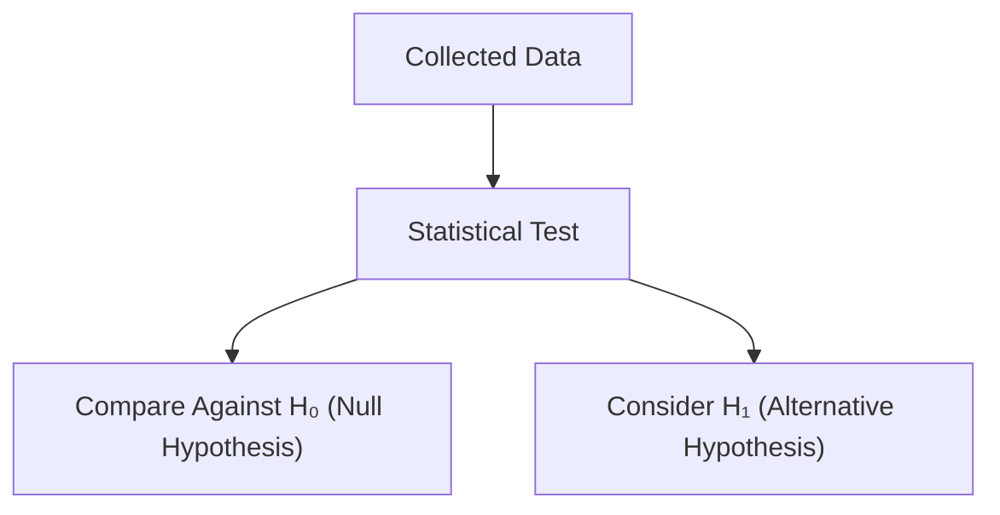
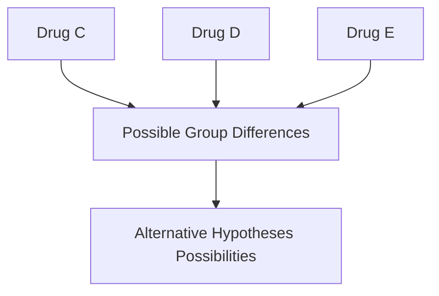
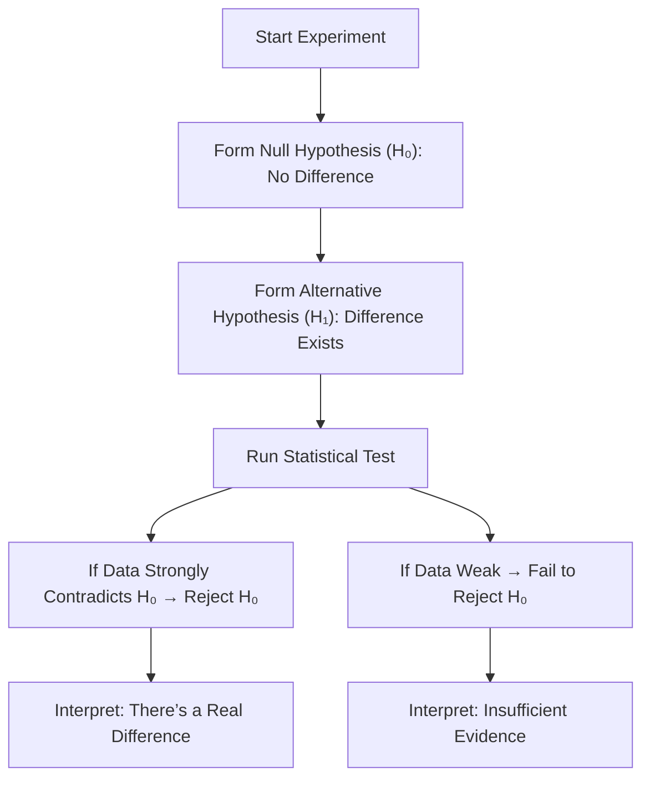

---

title: Alternative Hypothesis
sidebar_position: 79

---

# The Alternative Hypothesis

---

## Introduction

In this StatQuest, we dive into the **Alternative Hypothesis**, which works alongside the **Null Hypothesis** in hypothesis testing.

When we perform statistical tests, we compare data against the **null hypothesis** (which usually states “no difference” or “no effect”).
The **alternative hypothesis** is what we propose when we suspect **a difference exists** or **an effect is real**.

---

## Review: Null Hypothesis and Hypothesis Testing

Before introducing the alternative hypothesis, let’s briefly review the **null hypothesis** from the previous lesson:

> The **null hypothesis (H₀)** assumes that there is **no difference** between groups or conditions.

For example:

* Drug C and Drug D have **the same average recovery time**.

We then collect data, perform a statistical test, and either:

* **Reject H₀** → strong evidence of a difference
* **Fail to reject H₀** → not enough evidence to conclude a difference

---

## The Need for the Alternative Hypothesis

Every hypothesis test needs **three components**:

| Component                       | Purpose                             |
| ------------------------------- | ----------------------------------- |
| **Data**                        | Collected evidence to analyze       |
| **Null Hypothesis (H₀)**        | Statement of no difference          |
| **Alternative Hypothesis (H₁)** | Statement of a difference or effect |

---

## Example: Drug C vs. Drug D

Suppose we measure **recovery times** for two drugs:

* Drug C group recovers slightly faster.
* Drug D group takes longer to recover.

We run a statistical test to determine whether this difference is significant.

### Step 1: Define hypotheses

$$
H_0: \text{Mean}_C = \text{Mean}_D
$$

$$
H_1: \text{Mean}_C \neq \text{Mean}_D
$$

### Step 2: Evaluate both

We calculate:

* The **mean** for each group
* The **variability** within each group

If the two group means are far apart compared to their internal variability, we **reject H₀**.

If the means are close relative to the variability, we **fail to reject H₀**.

---

### Visual: Comparing Two Groups

In this visualization:

* The **gray curve** represents the null hypothesis — a single mean for both groups.
* The **colored curves** represent the alternative — separate means for each group.
* If using two means explains the data **much better**, we reject the null.

---

## Intuitive Understanding

Even if the observed difference seems large, small **random factors** (like exercise or diet) might explain it.

So, we need statistical evidence that the difference is **too large** to have occurred by chance.

If not, we **fail to reject the null hypothesis** — we don’t say “accept H₀,” because it might still be wrong; we just don’t have enough proof to reject it.

---

## When We Have More Than Two Groups

The **alternative hypothesis** becomes more flexible when we have **three or more groups** (say, Drug C, Drug D, and Drug E).

Now there are **multiple alternatives**:

1. All three drugs are different.
2. Drugs C and D are similar, but Drug E differs.
3. Only one drug differs from the rest.

Each version of the **alternative hypothesis** gives a different perspective — and the **statistical test’s decision** can change depending on which alternative we use.

---

### Visual: Multiple Means vs. One Mean

In this light-themed illustration:

* The **gray mean line** shows the **null hypothesis** (no difference).
* The **colored mean lines** show different **alternative hypotheses**.
* The smaller the distances from group means to data points, the stronger the evidence for the alternative hypothesis.

---

## Hypothesis Relationship Summary

| Hypothesis                 | Symbol | Description                             |
| -------------------------- | ------ | --------------------------------------- |
| **Null Hypothesis**        | H₀     | Assumes no difference or effect         |
| **Alternative Hypothesis** | H₁     | Assumes there is a difference or effect |
| **Decision Rule**          | —      | Based on test statistic and p-value     |
| **Reject H₀**              | —      | Data strongly contradicts the null      |
| **Fail to Reject H₀**      | —      | Data not strong enough to oppose null   |

---

## Machine Learning Analogy

Failing to reject the null hypothesis is like **overfitting** in machine learning.

> You might think the two averages are different, but it’s really just noise in your training data — not a generalizable pattern.

If you add more data and the difference remains strong, then rejecting H₀ becomes more reliable.

---

## Key Takeaways

* The **alternative hypothesis (H₁)** represents what we are trying to prove — a difference or effect.
* We never “accept” the alternative; we only **reject H₀ in favor of H₁**.
* With more than two groups, there can be **multiple valid alternatives**.
* Every statistical test compares **H₀ vs. H₁** to make a decision based on evidence.

---

## Summary Diagram

---

## Practice Questions

1. What does the **alternative hypothesis** represent?
   → It states that there is a **real difference or effect** in the population.

2. Why do we not “accept” H₁?
   → Because we can only test evidence **against H₀** — rejecting H₀ supports H₁ but doesn’t prove it.

3. What happens when we fail to reject H₀?
   → It means the data do not provide enough evidence to conclude a difference.

4. When testing three or more groups, how can the alternative hypothesis vary?
   → There can be multiple alternatives (e.g., one group differs, or all differ).

5. How does overfitting relate to hypothesis testing?
   → Believing a pattern exists when it’s just noise is like rejecting H₀ based on random variation.

---

> **Key Takeaway:**
> The **Alternative Hypothesis** (H₁) complements the **Null Hypothesis (H₀)** — together, they form the foundation of hypothesis testing.
> H₀ assumes “no effect,” while H₁ assumes “there is an effect.”
> Statistical tests let data decide which hypothesis is more consistent with reality.

---
<iframe width="100%" height="615" src="https://www.youtube.com/embed/5koKb5B_YWo?si=19Qblshe7AaUMWux" title="YouTube video player" frameborder="0" allow="accelerometer; autoplay; clipboard-write; encrypted-media; gyroscope; picture-in-picture; web-share" referrerpolicy="strict-origin-when-cross-origin" allowfullscreen></iframe>