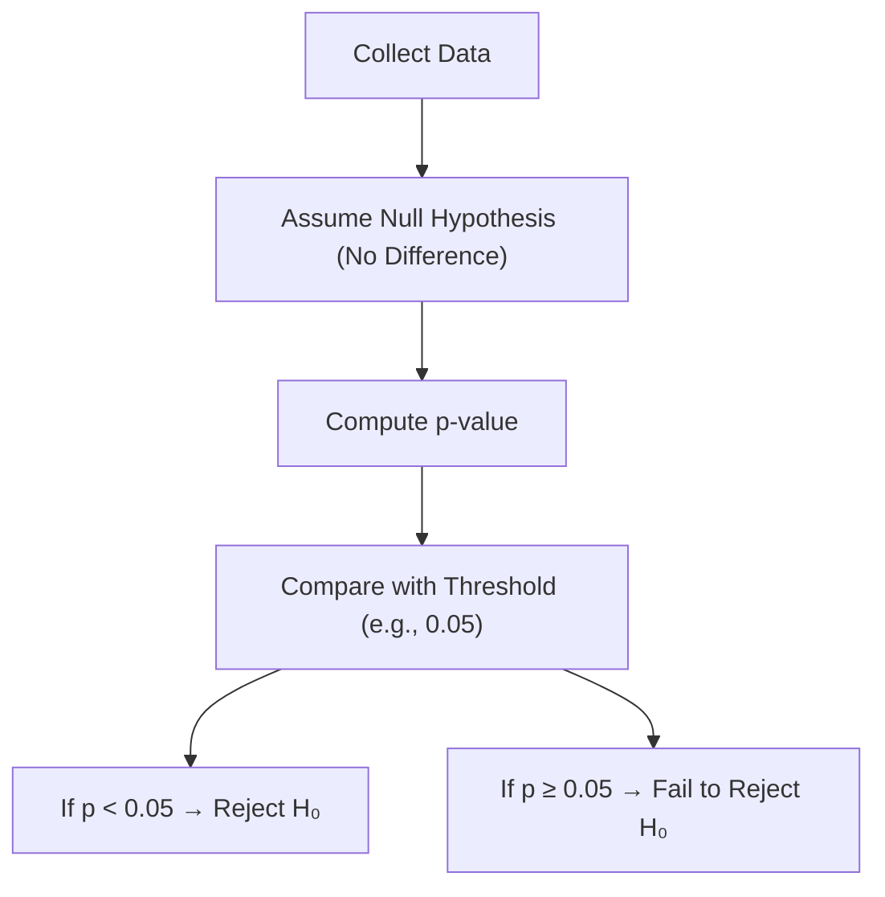

# Understanding P-Values

---

## Introduction

The **p-value** is one of the most fundamental and often misunderstood concepts
in statistics. In this StatQuest, we explore what p-values actually mean, why
they matter, and how to interpret them correctly.

A **p-value** helps us decide whether the observed difference between two groups
— for example, between **Drug A** and **Drug B** — is **real** or simply due to
**random chance**.

---

## Conceptual Motivation for P-Values

Imagine we have two drugs: **Drug A** and **Drug B**. We want to test if **Drug
A** is more effective than **Drug B** in curing an illness.

At first, we test only **one person per drug**:

| Person | Drug | Cured? |
| ------ | ---- | ------ |
| 1      | A    | ✅ Yes |
| 2      | B    | ❌ No  |

Does this prove that Drug A is better? → **No**, because one person’s result
could be influenced by many random factors (diet, stress, allergies, dosage
mistakes, etc.).

---

## Why We Need Larger Samples

So we test more people. When we repeat the experiment with **many
participants**, we might see:

| Drug | People Cured | Total Tested | Cure Rate |
| ---- | ------------ | ------------ | --------- |
| A    | 1043         | 1046         | 99.7%     |
| B    | 2            | 1434         | 0.1%      |

This difference is so extreme that it seems **highly unlikely** to have occurred
just by chance. We are confident that **Drug A really is more effective**.

But in most real studies, results are much closer, e.g.:

| Drug | Cure Rate |
| ---- | --------- |
| A    | 37%       |
| B    | 31%       |

Now we ask:

> “How confident can we be that this 6% difference is real, and not just random
> noise?”

That’s where **p-values** come in.

---

## Definition of a P-Value

A **p-value** is a number between **0 and 1** that tells us **how likely our
data would occur if there was truly no difference** between the groups (i.e., if
the null hypothesis were true).

### Interpretation:

- **Small p-value (~0)** → Strong evidence that the groups are different
- **Large p-value (~1)** → Little or no evidence of a difference

---

## The 0.05 Threshold

In practice, we often use **0.05** as a threshold for “statistical
significance.”

| p-value  | Interpretation                                           |
| -------- | -------------------------------------------------------- |
| p < 0.05 | Reject the null hypothesis (significant difference)      |
| p ≥ 0.05 | Fail to reject the null hypothesis (no clear difference) |

If **p < 0.05**, it means that if there were no real difference between Drug A
and B, we would see a result this extreme (or more extreme) **less than 5% of
the time** — just by random chance.

---

### Example: Random Variation

Suppose both groups take the **same drug** (so no real difference exists).

- Most of the time, random variations lead to **large p-values (e.g., 0.9)**.
- But occasionally, pure luck gives a small p-value, like **0.01** — a **false
  positive**.

---

## False Positives and the Role of Thresholds

Getting a small p-value **when there’s no true difference** is called a **false
positive**.

If our threshold is **0.05**, then:

- We expect a false positive about **5% of the time** (1 in 20 experiments).

If the cost of being wrong is **high**, we can use a **smaller threshold**,
like:

| Threshold | Meaning                                             |
| --------- | --------------------------------------------------- |
| 0.05      | 5% chance of false positive (common)                |
| 0.00001   | 0.001% chance of false positive (very strict)       |
| 0.20      | 20% chance of false positive (lenient, rarely used) |

---

## Example of Applying p-Values

If we calculate the p-value for our drug experiment and get:

$$
p = 0.24
$$

Since **0.24 > 0.05**, we **fail to reject the null hypothesis** — meaning we
are **not confident** that Drug A and Drug B are truly different.

✅ **Conclusion:** The observed 6% difference might just be random.

---

## Relationship to Hypothesis Testing

The **p-value** is central to the framework of **hypothesis testing**.

| Concept                         | Meaning                                                          |
| ------------------------------- | ---------------------------------------------------------------- |
| **Null Hypothesis (H₀)**        | No difference between groups                                     |
| **Alternative Hypothesis (H₁)** | There is a difference                                            |
| **p-value**                     | Probability of observing data as extreme as ours if H₀ were true |

If the p-value is small enough (below threshold), we **reject H₀** in favor of
H₁.

---

## p-Values Do Not Measure Effect Size

A **common misconception** is that a smaller p-value means a larger difference.
This is **false**.

Example:

| Experiment | Difference | Sample Size   | p-value |
| ---------- | ---------- | ------------- | ------- |
| A          | 6 points   | 20 people     | 0.24    |
| B          | 1 point    | 10,000 people | 0.04    |

Even though **Experiment B** has a _smaller difference_, its large sample size
makes the p-value smaller. Thus, **p-values depend on both effect size and
sample size**.

---

## Concept Flow

---

## Summary

| Concept                      | Explanation                                                                     |
| ---------------------------- | ------------------------------------------------------------------------------- |
| **p-value**                  | Probability of observing data as extreme as ours if the null hypothesis is true |
| **Small p-value (&lt;0.05)** | Strong evidence against the null hypothesis                                     |
| **Large p-value (&gt;0.05)** | Weak or no evidence against the null hypothesis                                 |
| **Threshold (α)**            | Commonly 0.05 — defines what counts as “statistically significant”              |
| **False Positive Rate**      | Equal to chosen threshold (e.g., 5% for α = 0.05)                               |
| **Effect Size**              | Not measured by p-value (depends on actual difference)                          |

---

## Practice Questions

1. What does a p-value of 0.02 mean? → There’s a 2% chance of observing these
   results if the null hypothesis were true.

2. If p = 0.24, what should we conclude? → Fail to reject the null hypothesis;
   no clear difference.

3. Does a smaller p-value mean a bigger effect? → No — it just means stronger
   evidence against the null.

4. What is a false positive in this context? → When the test says there’s a
   difference, but in reality there isn’t.

5. Why is 0.05 often used as the threshold? → It balances reliability and
   practicality — only 5% of false positives.

---

> **Key Takeaway:** A **p-value** measures the strength of evidence against the
> **null hypothesis**, not the size of the effect. A smaller p-value means
> **more confidence that a real difference exists**, but not necessarily a
> **bigger difference**.

---

<iframe width="100%" height="615" src="https://www.youtube.com/embed/vemZtEM63GY?si=YmjQD76eJ5XATMZu" title="YouTube video player" frameborder="0" allow="accelerometer; autoplay; clipboard-write; encrypted-media; gyroscope; picture-in-picture; web-share" referrerpolicy="strict-origin-when-cross-origin" allowfullscreen></iframe>
