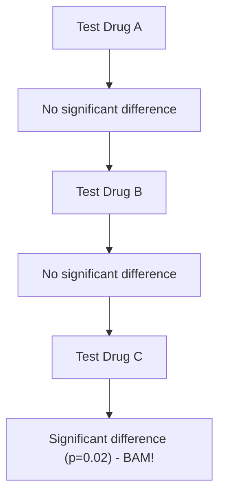
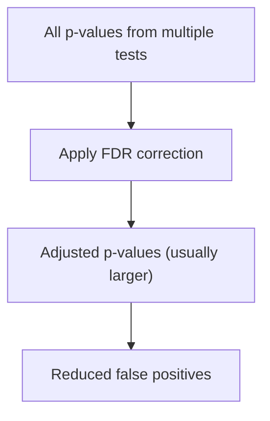
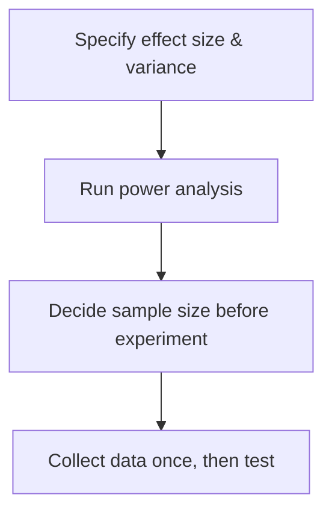

# Understanding P-Hacking

---

## Introduction

**P-hacking** is the misuse or manipulation of statistical analysis to make
results look **significant** when they’re actually **false positives**.  
This lesson shows how that happens and how to prevent it.

---

## What Is P-Hacking?

### The Scenario

We’re testing multiple new drugs for a virus to see if any reduce recovery time.



It looks like **Drug C works** (p = 0.02 < 0.05). But since we tested **many
drugs**, this “significant” result might be **luck** — not a real effect. That’s
**p-hacking**.

---

## Definition

> **P-hacking**: Using analysis workflows (e.g., repeated testing, selective
> reporting) that inflate the chance of **false positives**.

---

## The Multiple Testing Problem

Imagine recovery times **without any drug** follow a normal-like pattern: most
people recover between 5 and 15 days.


If we take two small samples (3 people each) from the same population:

- Their means will differ **slightly** by random chance.
- A test might give **p = 0.86** → no real difference.

If we repeat this comparison **many times**, some random pairs will eventually
show **p < 0.05** by chance alone.

### Why This Happens

If the significance threshold is **0.05**:

$$
\text{About } 5% \text{ of tests on identical data will look significant (false positives).}
$$

| Number of tests | Expected false positives |
| --------------: | -----------------------: |
|             100 |                        5 |
|          10,000 |                      500 |

More tests → more **false “discoveries.”**

---

## The False Discovery Rate (FDR)

To compensate, use **False Discovery Rate (FDR)** correction on **all** p-values
from the experiment.



**Example**

Before correction:

```
Drug A: p = 0.04
Drug B: p = 0.03
Drug C: p = 0.02
```

After FDR:

```
Drug A: p = 0.12
Drug B: p = 0.08
Drug C: p = 0.06
```

Only truly strong signals tend to remain significant.


**Rule:** When you run multiple tests, **adjust p-values** (FDR is a common
choice).

---

## Subtle P-Hacking: “Just Add a Bit More Data”

Suppose the first test gives **p = 0.06** — almost significant. Temptation:
“Let’s add one more observation per group and re-test!” Now **p = 0.02** —
success?

❌ Still p-hacking. You effectively ran **multiple tests** (before and after
adding data) until the p-value crossed 0.05.


The 0.05 false-positive control assumes **one** pre-specified test, not an
evolving sequence of “peek & re-test.”

---

## Power Analysis — The Proper Fix

Instead of reactively adding data, **plan the sample size** ahead of time with a
**power analysis**.

> **Power analysis** estimates how many samples you need to detect a true effect
> with high probability (often 80–90%).

Benefits:

- Avoids collecting too little (missing real effects) or too much (waste).
- Prevents post-hoc “nibbling” that inflates false positives.




---

## Summary

| Concept                  | Explanation                                                 |
| ------------------------ | ----------------------------------------------------------- |
| **P-hacking**            | Misusing analysis to obtain small p-values by chance        |
| **Multiple testing**     | Many tests inflate false positives                          |
| **FDR correction**       | Adjust p-values across tests to reduce false discoveries    |
| **Adding data post-hoc** | “Peeking” breaks the single-test 0.05 assumption            |
| **Power analysis**       | Pre-compute the required sample size to test once, properly |

---

## Best Practices to Avoid P-Hacking

- ✅ Pre-register hypotheses and analysis plans.
- ✅ Use **FDR** (or Bonferroni) when testing **multiple** hypotheses.
- ✅ Do a **power analysis** to set sample size **before** collecting data.
- ✅ Report **all** tests you ran (not just significant ones).
- ✅ Keep a clear audit trail of analysis decisions.

---

> **Key Takeaway:** P-hacking inflates false discoveries. Prevent it with
> **planning, corrections, and transparency**.

---

<iframe width="100%" height="615" src="https://www.youtube.com/embed/HDCOUXE3HMM?si=VSdP4U1sRJ49u0S6" title="YouTube video player" frameborder="0" allow="accelerometer; autoplay; clipboard-write; encrypted-media; gyroscope; picture-in-picture; web-share" referrerpolicy="strict-origin-when-cross-origin" allowfullscreen></iframe>
