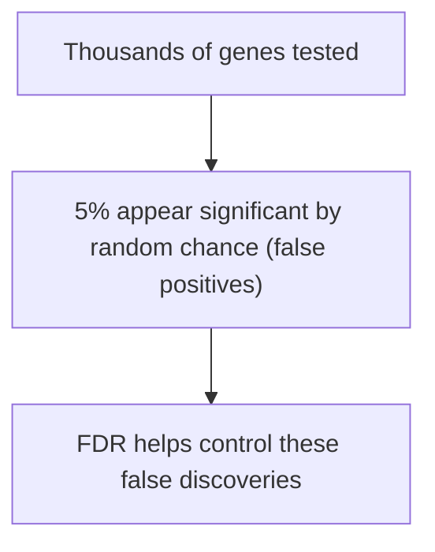
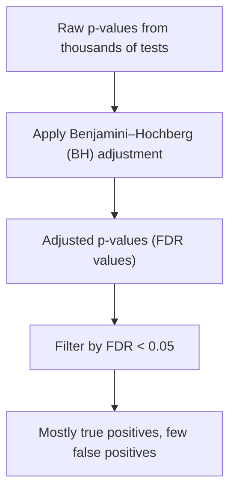

# Understanding the False Discovery Rate (FDR)

---

## Introduction

**False Discovery Rate (FDR)** is a statistical technique used to control
**false positives** that occur when testing **many hypotheses** (e.g., 10,000
genes in an RNA-Seq experiment).  
It helps us avoid mistaking random noise for meaningful discoveries.

---

## Motivation

When you test thousands of hypotheses (like gene expression differences), some
will appear significant **just by chance** — even if there’s no real effect.

> **Key idea:** FDR weeds out _bad data that looks good._

---

## The Problem: False Positives Multiply

Let’s start with an example:

We measure **gene expression** for an imaginary gene, _Gene X_, across
**wild-type mice**. RNA sequencing gives slightly different counts for each
mouse.

If we measure hundreds of genes, 95% will overlap normally, but about **5%** may
look _significantly different_ just by random chance — even if no treatment was
applied.

---

## The Multiple Testing Explosion

| Number of genes tested | False positives expected (at α = 0.05) |
| ---------------------- | -------------------------------------- |
| 100                    | 5                                      |
| 10,000                 | 500                                    |
| 1,000,000              | 50,000                                 |

That’s a lot of **wrong “discoveries.”**

---

## The FDR Solution

**False Discovery Rate (FDR)** limits the _proportion_ of false positives among
all results you call significant.

It doesn’t remove them completely — it just ensures that, for example, if you
declare 100 discoveries, fewer than 5 of them (5%) are likely false.

### Conceptual Diagram

---

## Understanding p-value Distributions

### Case 1: No Real Differences

All samples come from the **same distribution**. The p-values will be
**uniformly distributed** between 0 and 1.

Each bin contains roughly 5% of p-values.

---

### Case 2: Real Differences Exist

When comparing **two different groups** (e.g., control vs. treated mice), the
p-values are **skewed toward zero** because some genes _really are_ different.

---

### Case 3: Real + Null Mix

In reality, some genes are affected by the drug (true positives), while most are
not. This produces a **mixed distribution** — uniform + skewed.

By eye, you can estimate where the uniform region ends — that’s what the
Benjamini–Hochberg method does _mathematically_.

---

## The Benjamini–Hochberg (BH) Method

### Step-by-Step

Let’s say we have 10 p-values:

| Rank (i) | Raw p-value | FDR adjusted (q-value) |
| -------- | ----------- | ---------------------- |
| 1        | 0.004       | ?                      |
| 2        | 0.01        | ?                      |
| 3        | 0.03        | ?                      |
| 4        | 0.05        | ?                      |
| 5        | 0.08        | ?                      |
| 6        | 0.10        | ?                      |
| 7        | 0.30        | ?                      |
| 8        | 0.60        | ?                      |
| 9        | 0.81        | ?                      |
| 10       | 0.91        | ?                      |

1. **Sort** the p-values in ascending order.
2. **Rank** them (smallest = 1, largest = n).
3. Compute each adjusted value:
   $$
   q_i = \min\left(\frac{p_i \times n}{i}, q_{i+1}\right)
   $$
   (We go from largest to smallest.)
4. This ensures **monotonic non-decreasing** q-values.

---

### Example Calculation

| Rank (i) | p-value | FDR calc ($p_i \times n / i$) | Adjusted FDR (q-value) |
| -------- | ------- | ----------------------------- | ---------------------- |
| 10       | 0.91    | 0.91                          | 0.91                   |
| 9        | 0.81    | 0.90                          | 0.90                   |
| 8        | 0.60    | 0.75                          | 0.75                   |
| 7        | 0.30    | 0.43                          | 0.43                   |
| 6        | 0.10    | 0.17                          | 0.17                   |
| 5        | 0.08    | 0.16                          | 0.16                   |
| 4        | 0.05    | 0.13                          | 0.13                   |
| 3        | 0.03    | 0.10                          | 0.10                   |
| 2        | 0.01    | 0.05                          | 0.05                   |
| 1        | 0.004   | 0.04                          | 0.04                   |

After correction, only the **first two or three tests** remain significant at
FDR < 0.05.

---

## How the BH Method Filters Results

### Before Correction

### After Correction

Only the **most confident results** (lowest p-values) survive the adjustment.

---

## Summary

| Concept                          | Explanation                                                           |
| -------------------------------- | --------------------------------------------------------------------- |
| **False Discovery Rate (FDR)**   | Controls the proportion of false positives among significant results  |
| **Uniform p-values**             | Occur when no real difference exists                                  |
| **Skewed p-values**              | Occur when a true effect exists                                       |
| **Benjamini–Hochberg method**    | Adjusts p-values mathematically to approximate “eyeball thresholding” |
| **Adjusted p-values (q-values)** | Usually larger; only a few remain significant                         |

---

## Best Practices

✅ Use FDR correction whenever you test **many hypotheses** (e.g., thousands of
genes). ✅ Don’t cherry-pick small p-values — apply correction to **all**. ✅
Report both **raw** and **FDR-adjusted** values. ✅ Understand that FDR < 0.05 ≠
“no false positives” — it just limits them.

---

> **Key Takeaway:** The **Benjamini–Hochberg False Discovery Rate** method makes
> multiple testing reliable by keeping false positives under control.

---

<iframe width="100%" height="600" src="https://www.youtube.com/embed/K8LQSvtjcEo?si=bZg7CZjFhpPOvSUl" title="YouTube video player" frameborder="0" allow="accelerometer; autoplay; clipboard-write; encrypted-media; gyroscope; picture-in-picture; web-share" referrerpolicy="strict-origin-when-cross-origin" allowfullscreen></iframe>
